# CTOaaS System Architecture

**Product**: CTOaaS (CTO as a Service)
**Version**: 1.0
**Created**: 2026-03-12
**Author**: Architect Agent
**Status**: Draft (pending CEO review)

---

## 1. Overview

CTOaaS is an AI-powered advisory platform for CTOs, CIOs, and VPs of Engineering. The architecture is built around three pillars:

1. **CopilotKit** -- React-based AI copilot UI with streaming, generative UI, and visible agent reasoning via the AG-UI protocol
2. **LangGraph** -- Stateful multi-step agent orchestration with ReAct pattern, tool use, and human-in-the-loop
3. **LlamaIndex** -- RAG framework for knowledge ingestion, chunking, indexing, and retrieval against pgvector

The system delivers personalized, citation-backed advisory responses grounded in curated engineering knowledge from elite organizations.

---

## 2. C4 Context Diagram (Level 1)

Shows CTOaaS in its environment -- users, external systems, and system boundaries.

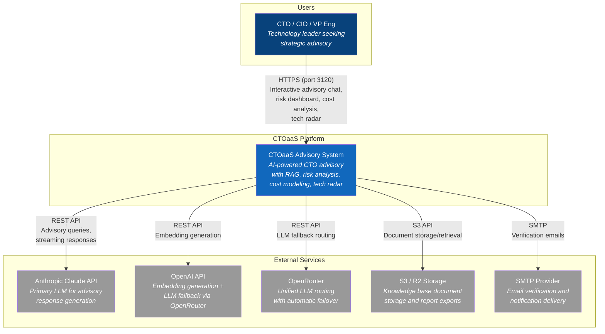

---

## 3. C4 Container Diagram (Level 2)

Shows the high-level technology choices -- apps, databases, APIs, and how they interact.

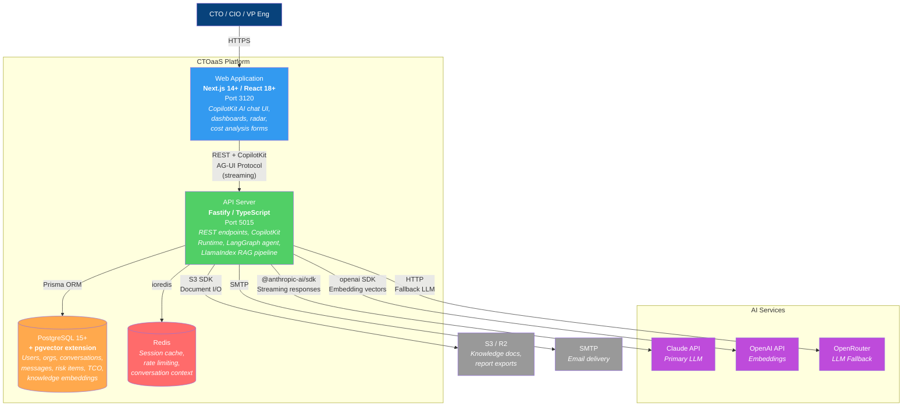

---

## 4. C4 Component Diagram (Level 3) -- API Server

Internal structure of the Fastify API server showing plugins, services, and the agent pipeline.

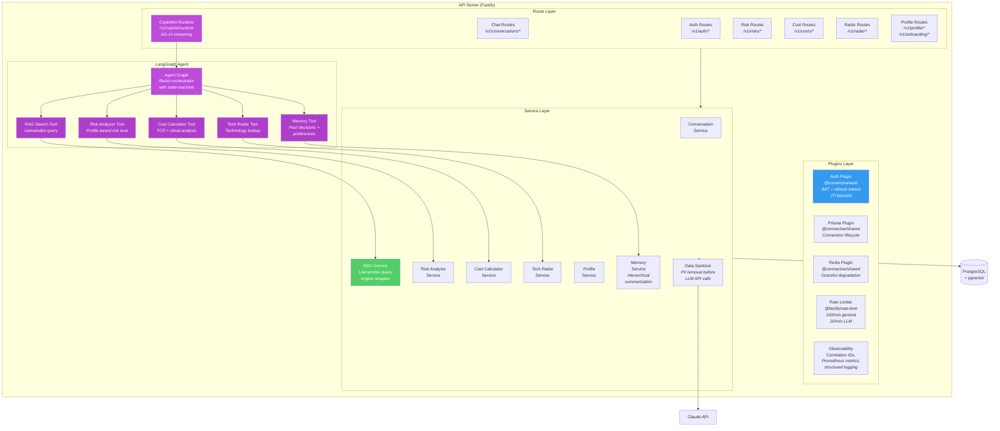

---

## 5. LangGraph Agent Graph

The CTO Advisory Agent uses the ReAct (Reasoning + Acting) pattern. Each tool node is an independent module that can be tested, improved, and extended separately. CopilotKit's AG-UI protocol makes every reasoning step visible to the CTO in real-time.

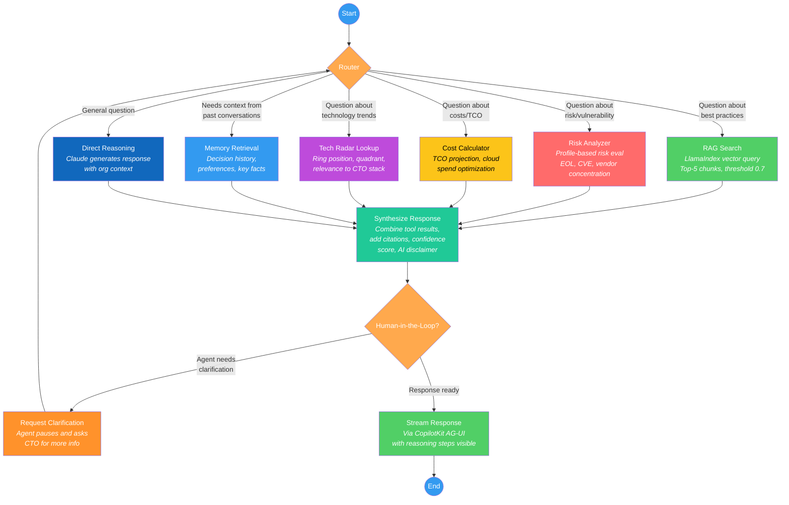

### Agent State Schema (LangGraph)

```typescript
interface AgentState {
  // Input
  messages: BaseMessage[];
  userQuery: string;
  organizationId: string;
  userId: string;

  // Context
  companyProfile: CompanyProfile | null;
  userPreferences: UserPreference[];
  conversationSummary: string | null;

  // Tool results
  ragResults: RAGChunk[];
  riskAnalysis: RiskResult | null;
  costAnalysis: CostResult | null;
  radarResults: TechRadarItem[];
  memoryResults: MemoryFact[];

  // Output
  response: string;
  citations: Citation[];
  confidenceScore: number;
  toolsUsed: string[];
  reasoningSteps: ReasoningStep[];
}
```

### Tool Node Specifications

| Tool | Input | Output | Latency Target | Data Source |
|------|-------|--------|----------------|------------|
| RAG Search | Query string, top_k=5, threshold=0.7 | Ranked chunks with similarity scores | < 500ms | pgvector via LlamaIndex |
| Risk Analyzer | Organization ID, company profile | Risk items with severity scores | < 2s | Company profile + risk rules |
| Cost Calculator | Cost parameters (TCO or cloud spend) | Projections, recommendations | < 1s | User input + benchmarks |
| Tech Radar Lookup | Technology name or category | Radar items with ring/quadrant | < 200ms | tech_radar_items table |
| Memory Retrieval | User ID, conversation context | Past decisions, preferences, key facts | < 300ms | conversations + preferences |

---

## 6. Advisory Chat Sequence Diagram

Shows the full flow from CTO question through CopilotKit, Fastify, LangGraph agent, tool execution, and streaming response with visible reasoning.

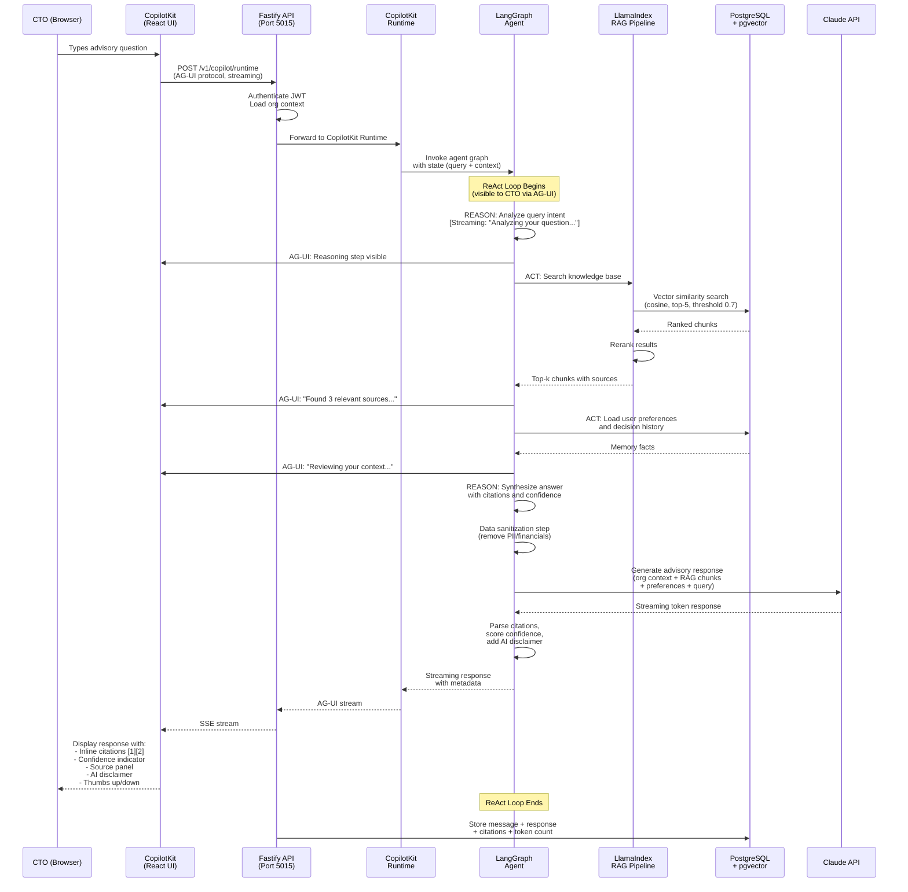

---

## 7. Knowledge Ingestion Pipeline (LlamaIndex)

Shows how knowledge documents are ingested, chunked, embedded, and stored for RAG retrieval.

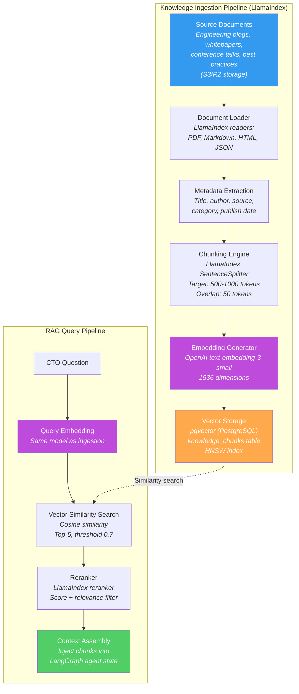

### Embedding Configuration

| Parameter | Value | Rationale |
|-----------|-------|-----------|
| Model | `text-embedding-3-small` | Cost-efficient, 1536 dims, good quality |
| Dimensions | 1536 | Default for text-embedding-3-small |
| Chunk size | 500-1000 tokens | Balances context richness vs. retrieval precision |
| Chunk overlap | 50 tokens | Prevents information loss at boundaries |
| Similarity metric | Cosine | Standard for text embeddings |
| Top-k | 5 | Enough context without overwhelming prompt |
| Threshold | 0.7 | Filters low-relevance noise |
| Index type | HNSW | Sub-linear search time for 100K+ vectors |

---

## 8. Entity-Relationship Diagram

Complete database schema for the CTOaaS platform.

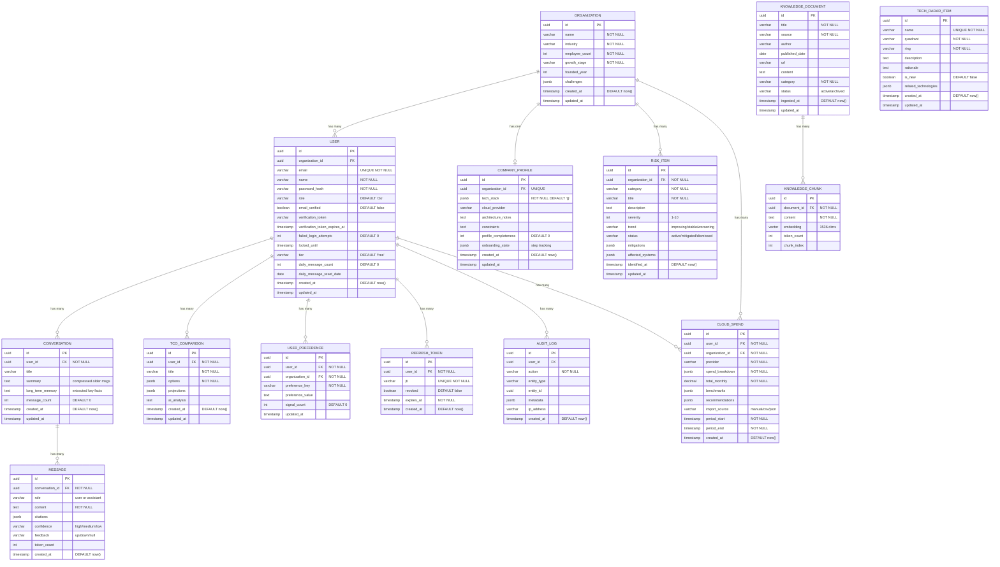

---

## 9. Authentication Flow

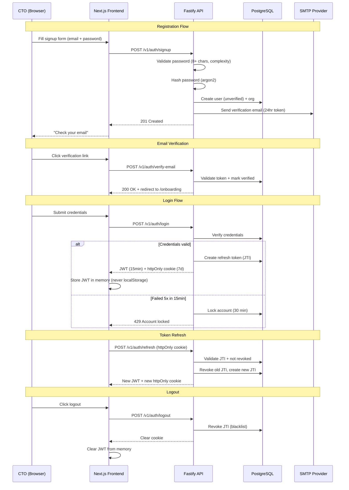

---

## 10. Risk Assessment Flow

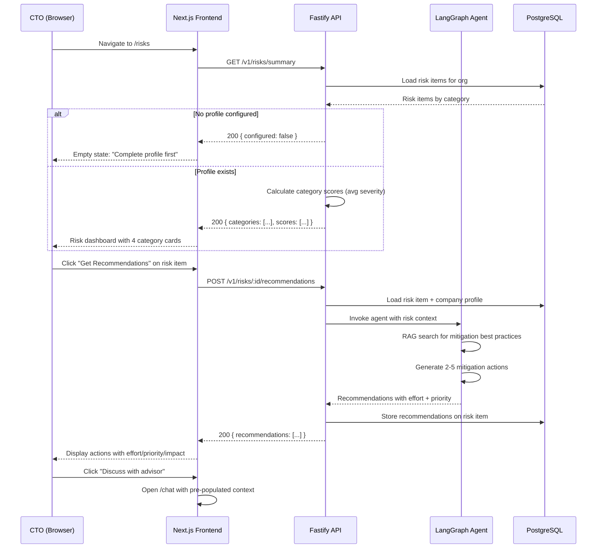

---

## 11. Conversation Memory Architecture

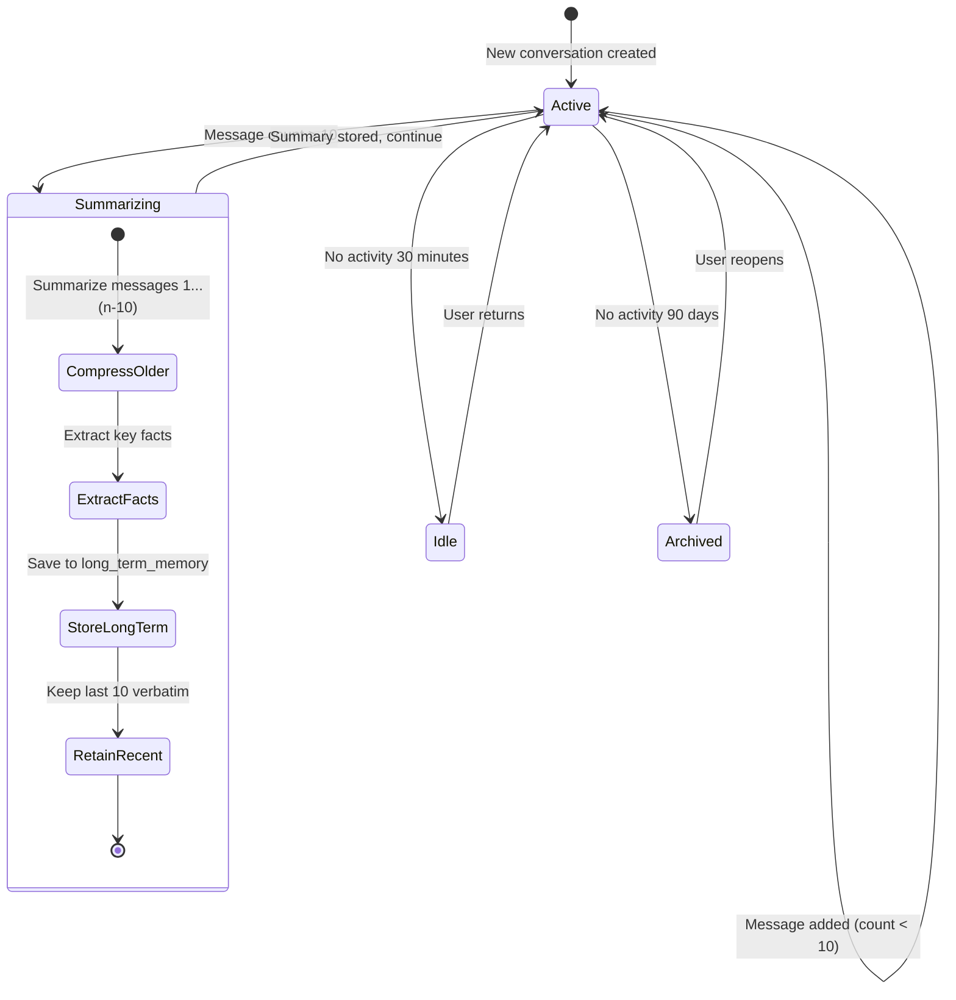

### Memory Hierarchy

| Layer | Storage | Content | Retention | Used In Prompt |
|-------|---------|---------|-----------|---------------|
| Short-term | `messages` table | Last 10 messages verbatim | Session | Always |
| Medium-term | `conversation.summary` | Compressed older messages | Per conversation | Always (if exists) |
| Long-term | `conversation.long_term_memory` | Key facts, decisions, preferences | Cross-session | Always (if exists) |
| Preference | `user_preferences` table | Learned communication style | Permanent | Always |

---

## 12. Project Structure

```
products/ctoaas/
├── apps/
│   ├── api/                          # Fastify backend (port 5015)
│   │   ├── src/
│   │   │   ├── server.ts             # Entry point, plugin registration
│   │   │   ├── app.ts                # Fastify app factory (buildApp)
│   │   │   ├── plugins/
│   │   │   │   ├── auth.ts           # @connectsw/auth integration
│   │   │   │   ├── prisma.ts         # @connectsw/shared/plugins/prisma
│   │   │   │   ├── redis.ts          # @connectsw/shared/plugins/redis
│   │   │   │   ├── rate-limit.ts     # @fastify/rate-limit config
│   │   │   │   ├── observability.ts  # Correlation IDs, metrics
│   │   │   │   └── copilot-runtime.ts# CopilotKit runtime setup
│   │   │   ├── routes/
│   │   │   │   ├── auth.ts           # /v1/auth/* (from @connectsw/auth)
│   │   │   │   ├── conversations.ts  # /v1/conversations/*
│   │   │   │   ├── copilot.ts        # /v1/copilot/runtime (AG-UI)
│   │   │   │   ├── risks.ts          # /v1/risks/*
│   │   │   │   ├── costs.ts          # /v1/costs/*
│   │   │   │   ├── radar.ts          # /v1/radar/*
│   │   │   │   ├── profile.ts        # /v1/profile/*
│   │   │   │   ├── onboarding.ts     # /v1/onboarding/*
│   │   │   │   ├── preferences.ts    # /v1/preferences/*
│   │   │   │   └── health.ts         # /v1/health
│   │   │   ├── services/
│   │   │   │   ├── conversation.service.ts
│   │   │   │   ├── rag.service.ts     # LlamaIndex wrapper
│   │   │   │   ├── risk.service.ts
│   │   │   │   ├── cost.service.ts
│   │   │   │   ├── radar.service.ts
│   │   │   │   ├── profile.service.ts
│   │   │   │   ├── memory.service.ts
│   │   │   │   ├── sanitizer.service.ts
│   │   │   │   └── embedding.service.ts
│   │   │   ├── agent/
│   │   │   │   ├── graph.ts           # LangGraph graph definition
│   │   │   │   ├── state.ts           # AgentState interface
│   │   │   │   ├── nodes/
│   │   │   │   │   ├── router.ts      # Intent classification
│   │   │   │   │   ├── rag-search.ts  # RAG tool node
│   │   │   │   │   ├── risk-analyzer.ts
│   │   │   │   │   ├── cost-calculator.ts
│   │   │   │   │   ├── radar-lookup.ts
│   │   │   │   │   ├── memory-retrieval.ts
│   │   │   │   │   └── synthesizer.ts # Response assembly
│   │   │   │   └── prompts/
│   │   │   │       ├── system.ts       # System prompt template
│   │   │   │       ├── rag-context.ts  # RAG injection template
│   │   │   │       └── risk-analysis.ts
│   │   │   └── types/
│   │   │       ├── agent.ts
│   │   │       ├── risk.ts
│   │   │       ├── cost.ts
│   │   │       └── radar.ts
│   │   ├── tests/
│   │   │   ├── unit/
│   │   │   │   ├── services/
│   │   │   │   └── agent/
│   │   │   └── integration/
│   │   │       ├── auth.test.ts
│   │   │       ├── conversations.test.ts
│   │   │       ├── risks.test.ts
│   │   │       ├── costs.test.ts
│   │   │       └── radar.test.ts
│   │   ├── prisma/
│   │   │   ├── schema.prisma
│   │   │   ├── migrations/
│   │   │   └── seed.ts
│   │   ├── package.json
│   │   └── tsconfig.json
│   │
│   └── web/                          # Next.js frontend (port 3120)
│       ├── src/
│       │   ├── app/
│       │   │   ├── layout.tsx         # Root layout with CopilotKit provider
│       │   │   ├── page.tsx           # Landing page (SSR)
│       │   │   ├── (auth)/
│       │   │   │   ├── login/page.tsx
│       │   │   │   ├── signup/page.tsx
│       │   │   │   └── verify-email/page.tsx
│       │   │   ├── onboarding/page.tsx
│       │   │   ├── (dashboard)/
│       │   │   │   ├── layout.tsx     # DashboardLayout wrapper
│       │   │   │   ├── dashboard/page.tsx
│       │   │   │   ├── chat/
│       │   │   │   │   ├── page.tsx   # Chat with CopilotKit sidebar
│       │   │   │   │   └── [conversationId]/page.tsx
│       │   │   │   ├── risks/
│       │   │   │   │   ├── page.tsx   # Risk dashboard
│       │   │   │   │   └── [category]/page.tsx
│       │   │   │   ├── costs/
│       │   │   │   │   ├── page.tsx   # Cost analysis hub
│       │   │   │   │   ├── tco/page.tsx
│       │   │   │   │   ├── tco/[comparisonId]/page.tsx
│       │   │   │   │   └── cloud-spend/page.tsx
│       │   │   │   ├── radar/page.tsx # Technology radar
│       │   │   │   └── settings/
│       │   │   │       ├── page.tsx
│       │   │   │       ├── profile/page.tsx
│       │   │   │       ├── account/page.tsx
│       │   │   │       └── preferences/page.tsx
│       │   ├── components/
│       │   │   ├── chat/
│       │   │   │   ├── ChatWindow.tsx  # CopilotKit chat wrapper
│       │   │   │   ├── CitationPanel.tsx
│       │   │   │   ├── ConversationSidebar.tsx
│       │   │   │   └── FeedbackButtons.tsx
│       │   │   ├── risk/
│       │   │   │   ├── RiskCategoryCard.tsx
│       │   │   │   ├── RiskItemDetail.tsx
│       │   │   │   └── RiskRecommendations.tsx
│       │   │   ├── cost/
│       │   │   │   ├── TcoForm.tsx
│       │   │   │   ├── TcoProjectionChart.tsx
│       │   │   │   ├── CloudSpendForm.tsx
│       │   │   │   └── CloudSpendChart.tsx
│       │   │   ├── radar/
│       │   │   │   ├── TechRadar.tsx   # SVG circular visualization
│       │   │   │   ├── RadarDetailPanel.tsx
│       │   │   │   └── RadarListView.tsx # Mobile fallback
│       │   │   ├── onboarding/
│       │   │   │   ├── CompanyBasics.tsx
│       │   │   │   ├── TechStackSelector.tsx
│       │   │   │   ├── ChallengesSelector.tsx
│       │   │   │   └── PreferencesForm.tsx
│       │   │   └── shared/            # @connectsw/ui re-exports
│       │   ├── hooks/
│       │   │   ├── useAuth.ts          # @connectsw/auth/frontend
│       │   │   ├── useConversations.ts
│       │   │   ├── useRisks.ts
│       │   │   ├── useCosts.ts
│       │   │   └── useRadar.ts
│       │   └── lib/
│       │       ├── api-client.ts       # Fetch wrapper with auth
│       │       ├── constants.ts
│       │       └── utils.ts
│       ├── tests/
│       ├── public/
│       ├── package.json
│       ├── next.config.ts
│       ├── tailwind.config.ts
│       └── tsconfig.json
│
├── e2e/
│   ├── tests/
│   │   ├── auth.spec.ts
│   │   ├── onboarding.spec.ts
│   │   ├── chat.spec.ts
│   │   ├── risks.spec.ts
│   │   ├── costs.spec.ts
│   │   └── radar.spec.ts
│   └── playwright.config.ts
│
├── docs/
│   ├── PRD.md
│   ├── business-analysis.md
│   ├── architecture.md              # This document
│   ├── api-schema.yml               # OpenAPI 3.0
│   ├── db-schema.sql                # Full DDL
│   ├── plan.md                      # Implementation plan
│   ├── ADRs/
│   │   ├── ADR-001-copilotkit-for-ai-ui.md
│   │   ├── ADR-002-langgraph-for-agent-orchestration.md
│   │   └── ADR-003-llamaindex-for-rag.md
│   └── specs/
│       └── ctoaas-foundation.md
│
├── .claude/
│   └── addendum.md                  # Product-specific agent config
│
├── package.json
└── README.md
```

---

## 13. Integration Points

| System | Direction | Protocol | Data Exchanged | Auth Method | Failure Mode |
|--------|-----------|----------|---------------|-------------|--------------|
| Claude API (Anthropic) | Outbound | REST HTTPS | Advisory prompts + streaming responses | API key (env var) | Fallback to OpenRouter |
| OpenAI API | Outbound | REST HTTPS | Text for embedding generation | API key (env var) | Retry 3x, then error |
| OpenRouter | Outbound | REST HTTPS | Fallback LLM queries | API key (env var) | Return "advisor unavailable" |
| S3/R2 Storage | Outbound | S3 API | Knowledge docs upload/download | Access key + secret | Return cached if available |
| SMTP Provider | Outbound | SMTP/API | Verification emails | API key | Queue for retry |
| Redis | Internal | TCP | Session cache, rate limiting | Password (optional) | Graceful degradation to DB |
| PostgreSQL | Internal | TCP | All persistent data | Connection string | Fatal -- service unavailable |

---

## 14. Security Architecture

### Authentication and Authorization

| Aspect | Implementation |
|--------|---------------|
| Authentication | Email/password with argon2 hashing. JWT access token (15-min, in-memory). httpOnly refresh cookie (7-day, rotation). |
| Authorization | Organization-scoped queries via mandatory `organization_id` filter on all data-access services. Prisma middleware enforces scoping. |
| Account lockout | 5 failed attempts in 15 min = 30-min lock. Progressive backoff. |
| BOLA prevention | Every API endpoint validates that the authenticated user belongs to the requested organization. |
| BFLA prevention | Role field on User model. Admin-only routes guarded by role check. |
| Session management | Refresh token JTI tracked in DB. Revocation on logout. JTI blacklist with circuit breaker pattern. |

### Data Protection

| Layer | Mechanism |
|-------|-----------|
| In transit | TLS 1.2+ enforced. HSTS header. HTTP to HTTPS redirect in production. |
| At rest (sensitive) | AES-256-GCM application-level encryption for: company financials, cloud spend data, API keys stored in profiles. |
| At rest (general) | PostgreSQL disk-level encryption via provider (Render/Supabase). |
| LLM data sanitization | Sanitizer service strips raw financials, credentials, and unnecessary PII before any LLM API call. Only minimum context included. |
| No source code | Per BR-005, customer source code is never stored or transmitted to LLM providers. |
| PII logging | Logger from @connectsw/shared/utils/logger redacts PII fields automatically. |

### API Security

| Control | Configuration |
|---------|--------------|
| Rate limiting | 100 req/min general, 20 req/min LLM endpoints. In-memory fallback when Redis unavailable. |
| CORS | Allow only the Next.js frontend origin. Credentials mode enabled. |
| CSP | `default-src 'self'`, `script-src 'self'`, `connect-src 'self' api.anthropic.com api.openai.com` |
| Input validation | Zod schemas on all route handlers. Max message length 10,000 chars. |
| Error responses | RFC 7807 format with `type` field. No stack traces in production. |
| Request correlation | UUID correlation ID on every request for tracing. |
| Health endpoint | `/v1/health` returns 503 on DB connection failure. |

---

## 15. Scalability Considerations

| Concern | Design Decision | Scale Path |
|---------|----------------|------------|
| pgvector at 100K embeddings | HNSW index, cosine similarity, < 500ms target | Phase 2: migrate to dedicated Pinecone/Weaviate if > 1M embeddings |
| Concurrent users (1,000) | Connection pooling (50 connections), Redis caching | Horizontal scaling via multiple API instances behind load balancer |
| LLM API costs | Token budgeting per tier, response caching, prompt optimization | Phase 2: custom NanoChat model reduces per-query cost |
| Conversation context window | Hierarchical memory (summarize + extract facts) | Keeps context bounded regardless of conversation length |
| Database connections | Prisma connection pool with configurable size | PgBouncer for production if needed |

---

## 16. Error Handling Strategy

| Error Category | Example | Detection | Recovery | User Experience |
|---------------|---------|-----------|----------|----------------|
| Validation | Invalid email, password too short | Zod schema check | Return 400 with field errors | Inline form error messages |
| Auth | Expired JWT, invalid refresh token | Auth middleware | Clear tokens, redirect login | "Session expired" toast |
| LLM unavailable | Claude API 429 or 500 | Try/catch + timeout | Retry 3x with backoff, fallback to OpenRouter | "Thinking..." then error with retry |
| LLM timeout | Response exceeds 30s | Timeout guard | Cancel request, show partial | "Response is taking longer than expected" |
| Redis unavailable | Connection refused | Health check | Fall back to DB + in-memory rate limiting | No user-facing impact (graceful) |
| Database | Connection lost | Health check, Prisma error handler | Reconnect pool, return 503 | "Service temporarily unavailable" page |
| RAG no results | No chunks above 0.7 threshold | Empty result check | Respond with general AI knowledge, label it | "Based on general AI knowledge" label |
| Rate limit exceeded | 20+ LLM queries/min | Rate limiter middleware | Return 429 with retry-after header | "Slow down" message with countdown |
| Free tier limit | 20+ messages/day | Daily counter check | Return 403 with upgrade CTA | Modal: "Upgrade to Pro for unlimited" |

---

## 17. Traceability Matrix

Maps user stories to functional requirements to API endpoints to database tables.

| User Story | Functional Req | API Endpoint(s) | DB Tables | Component |
|------------|---------------|-----------------|-----------|-----------|
| US-01: Advisory Chat | FR-001, FR-002, FR-028, FR-029 | `POST /v1/copilot/runtime` | conversation, message | CopilotKit + LangGraph |
| US-02: Follow-Up | FR-003, FR-004 | `POST /v1/copilot/runtime` | conversation, message | LangGraph agent state |
| US-03: RAG Knowledge | FR-005 | `POST /v1/copilot/runtime` (internal RAG tool) | knowledge_document, knowledge_chunk | LlamaIndex |
| US-04: Citations | FR-006, FR-007 | `POST /v1/copilot/runtime` | message.citations | LangGraph synthesizer |
| US-05: Company Profile | FR-008, FR-009 | `POST /v1/onboarding`, `PUT /v1/profile` | organization, company_profile | Profile service |
| US-06: Preferences | FR-010 | `POST /v1/conversations/:id/messages/:id/feedback`, `GET /v1/preferences` | user_preference, message.feedback | Memory service |
| US-07: Conv Memory | FR-011, FR-012, FR-013 | `GET /v1/conversations`, `GET /v1/conversations/:id`, `GET /v1/conversations/search` | conversation, message | Memory service |
| US-08: Registration | FR-014, FR-015, FR-016 | `POST /v1/auth/signup`, `POST /v1/auth/login`, `POST /v1/auth/verify-email`, `POST /v1/auth/refresh`, `POST /v1/auth/logout` | user, refresh_token | @connectsw/auth |
| US-09: Data Isolation | FR-017, FR-018, FR-019 | All endpoints (middleware) | All tables (org_id filter) | Auth + Prisma middleware |
| US-10: Risk Dashboard | FR-020, FR-021 | `GET /v1/risks/summary`, `GET /v1/risks/:category` | risk_item, company_profile | Risk service |
| US-11: Risk Recommendations | FR-022 | `POST /v1/risks/:id/recommendations` | risk_item.mitigations | Risk service + LangGraph |
| US-12: TCO Calculator | FR-023, FR-024 | `POST /v1/costs/tco`, `GET /v1/costs/tco/:id`, `POST /v1/costs/tco/:id/analyze` | tco_comparison | Cost service |
| US-13: Cloud Spend | FR-027 | `POST /v1/costs/cloud-spend`, `GET /v1/costs/cloud-spend` | cloud_spend | Cost service |
| US-14: Tech Radar | FR-025, FR-026 | `GET /v1/radar`, `GET /v1/radar/:id` | tech_radar_item, company_profile | Radar service |

### NFR Coverage

| NFR | Implementation |
|-----|---------------|
| NFR-001 (Performance: streaming < 3s) | CopilotKit AG-UI streaming, LangGraph async execution |
| NFR-002 (Performance: full response < 15s) | Token budgeting, prompt optimization, timeout guards |
| NFR-003 (Performance: dashboard < 2s) | Redis caching for risk scores, pre-computed summaries |
| NFR-004 (Performance: vector search < 500ms) | HNSW index on pgvector, 100K embedding target |
| NFR-005 (Security: AES-256) | Sanitizer service + encryption service for sensitive fields |
| NFR-006 (Security: TLS 1.2+) | HSTS, HTTP redirect, provider-managed TLS |
| NFR-007 (Security: token storage) | In-memory JWT via @connectsw/auth/frontend TokenManager |
| NFR-008 (Security: OWASP) | Rate limiting, input validation, CORS, CSP, parameterized queries |
| NFR-009 (Security: rate limiting) | @fastify/rate-limit with Redis store, fallback to in-memory |
| NFR-010 (Accessibility: WCAG 2.1 AA) | shadcn/ui (accessible by default), keyboard nav, contrast ratios |
| NFR-011 (Scalability: 1K concurrent) | Connection pooling, Redis caching, horizontal scaling path |
| NFR-012 (Scalability: DB connections) | Prisma pool size = 50 |
| NFR-013 (Reliability: 99.5%) | Health checks, graceful degradation, monitoring |
| NFR-014 (Reliability: graceful degradation) | Redis fallback, OpenRouter fallback |
| NFR-015 (Reliability: no data loss) | PostgreSQL WAL, transaction safety |
| NFR-016 (Cost: < $0.05/interaction) | Token budgeting, response caching, prompt optimization |
| NFR-017 (Cost: token budgeting) | Per-tier limits, daily counters, cached common queries |

---

## 18. Technology Radar Visualization Architecture

The radar is a custom SVG component (not a library dependency) with D3.js for interactivity.

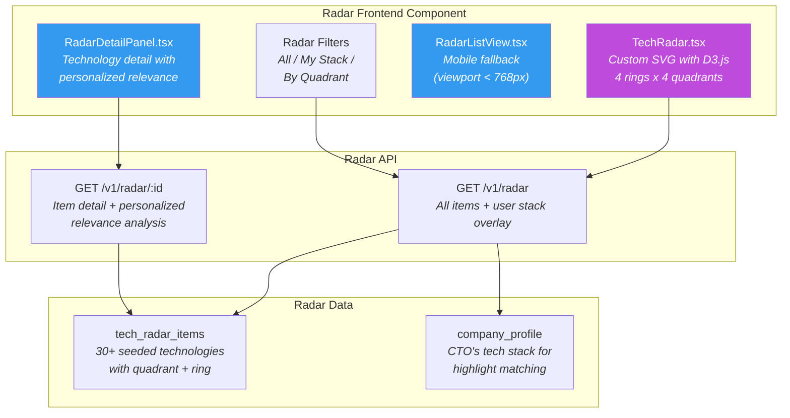

### Radar Ring Definitions

| Ring | Meaning | Color |
|------|---------|-------|
| Adopt | Proven, recommended for production use | Green |
| Trial | Worth pursuing; safe to try in non-critical systems | Blue |
| Assess | Worth exploring; understand how it fits | Yellow |
| Hold | Proceed with caution; may be legacy or risky | Red |

### Radar Quadrant Definitions

| Quadrant | Contents |
|----------|----------|
| Languages & Frameworks | Programming languages, web/mobile/backend frameworks |
| Platforms & Infrastructure | Cloud services, databases, container orchestration, CI/CD |
| Tools | Development tools, monitoring, testing, security tools |
| Techniques | Architecture patterns, methodologies, practices |

---

## 19. Component Reuse Plan

| Need | Existing Component | Source | Action |
|------|-------------------|--------|--------|
| Auth (signup, login, JWT, refresh) | `@connectsw/auth` (backend + frontend) | `packages/auth/` | Direct import |
| Structured logging | `@connectsw/shared/utils/logger` | `packages/shared/` | Direct import |
| Password hashing | `@connectsw/shared/utils/crypto` | `packages/shared/` | Direct import |
| Prisma lifecycle | `@connectsw/shared/plugins/prisma` | `packages/shared/` | Direct import |
| Redis connection | `@connectsw/shared/plugins/redis` | `packages/shared/` | Direct import |
| UI components | `@connectsw/ui/components` | `packages/ui/` | Direct import |
| Dashboard layout | `@connectsw/ui/layout` | `packages/ui/` | Direct import |
| Dark mode | `@connectsw/ui/hooks/useTheme` | `packages/ui/` | Direct import |
| CopilotKit chat UI | `@copilotkit/react-ui` | npm | New dependency |
| LangGraph agent | `@langchain/langgraph` | npm | New dependency |
| LlamaIndex RAG | `llamaindex` | npm | New dependency |
| Tech radar visualization | None found | -- | Build custom (SVG + D3.js) |
| TCO calculator engine | None found | -- | Build custom (pure functions) |
| Risk scoring engine | None found | -- | Build custom (rule-based) |
| Data sanitizer for LLM | None found | -- | Build custom (add to registry) |

### New Components to Add to Registry After Implementation

| Component | Description | Reusable By |
|-----------|-------------|-------------|
| LLM Data Sanitizer | Strips PII/financials before LLM API calls | Any LLM-powered product |
| LangGraph Agent Base | Base agent graph with ReAct pattern | Any agentic product |
| CopilotKit Runtime Plugin | Fastify plugin for CopilotKit server | Any CopilotKit product |
| Embedding Service | OpenAI embedding generation with batching | Any RAG-enabled product |

---

## 20. Complexity Tracking

| Decision | Violates Simplicity? | Justification | Simpler Alternative Rejected |
|----------|---------------------|---------------|------------------------------|
| LangGraph for agent orchestration | No | CEO-mandated; provides state management, tool use, human-in-the-loop for complex advisory flows | Simple prompt chaining -- lacks state persistence and tool composition |
| CopilotKit for chat UI | No | CEO-mandated; provides streaming, generative UI, AG-UI protocol out of the box | Custom chat UI -- would require building SSE, streaming display, reasoning display from scratch |
| LlamaIndex for RAG | No | CEO-mandated; handles chunking, embedding, indexing, retrieval with optimized pipeline | Custom RAG pipeline -- same functionality but 3-5x more code to maintain |
| pgvector instead of Pinecone | No | Single database, simpler ops, sufficient for Phase 1 (100K embeddings) | Pinecone -- adds external dependency, cost, and complexity for Phase 1 scale |
| Redis for caching | No | ConnectSW standard, graceful degradation when unavailable | No caching -- would hit DB on every request, poor performance |
| Custom SVG radar | Yes (moderate) | No good open-source radar component matches ThoughtWorks-style with React integration | D3.js library component -- none found with 4-ring 4-quadrant radar |
| Hierarchical memory | No | Required by FR-012; simple 3-tier approach (recent/summary/facts) | No summarization -- would exceed context window on long conversations |

---

## 21. Constitution Check

| Article | Requirement | Status |
|---------|------------|--------|
| I. Spec-First | Specification exists at `products/ctoaas/docs/specs/ctoaas-foundation.md` | PASS |
| II. Component Reuse | COMPONENT-REGISTRY.md checked; 8 components reused, 4 new components planned | PASS |
| III. TDD | Test plan included in project structure (unit, integration, E2E directories) | PASS |
| IV. TypeScript | TypeScript 5+ with strict mode configured | PASS |
| V. Default Stack | Stack matches default (Fastify + Prisma + PostgreSQL + Next.js). New deps (CopilotKit, LangGraph, LlamaIndex) documented in ADRs | PASS |
| VII. Port Registry | Frontend: 3120, Backend: 5015 (already registered) | PASS |
| VIII. Git Safety | Branch: `foundation/ctoaas` | PASS |
| IX. Quality Gates | Multi-gate system applies | PASS |
| X. Diagram-First | 9 Mermaid diagrams included | PASS |
