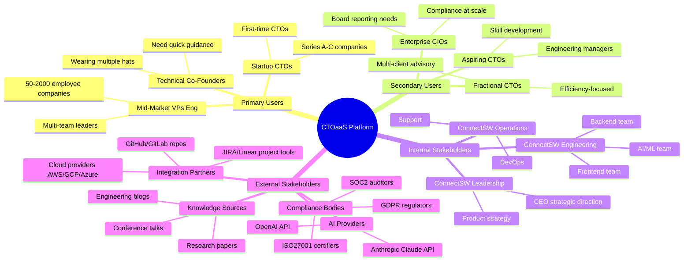
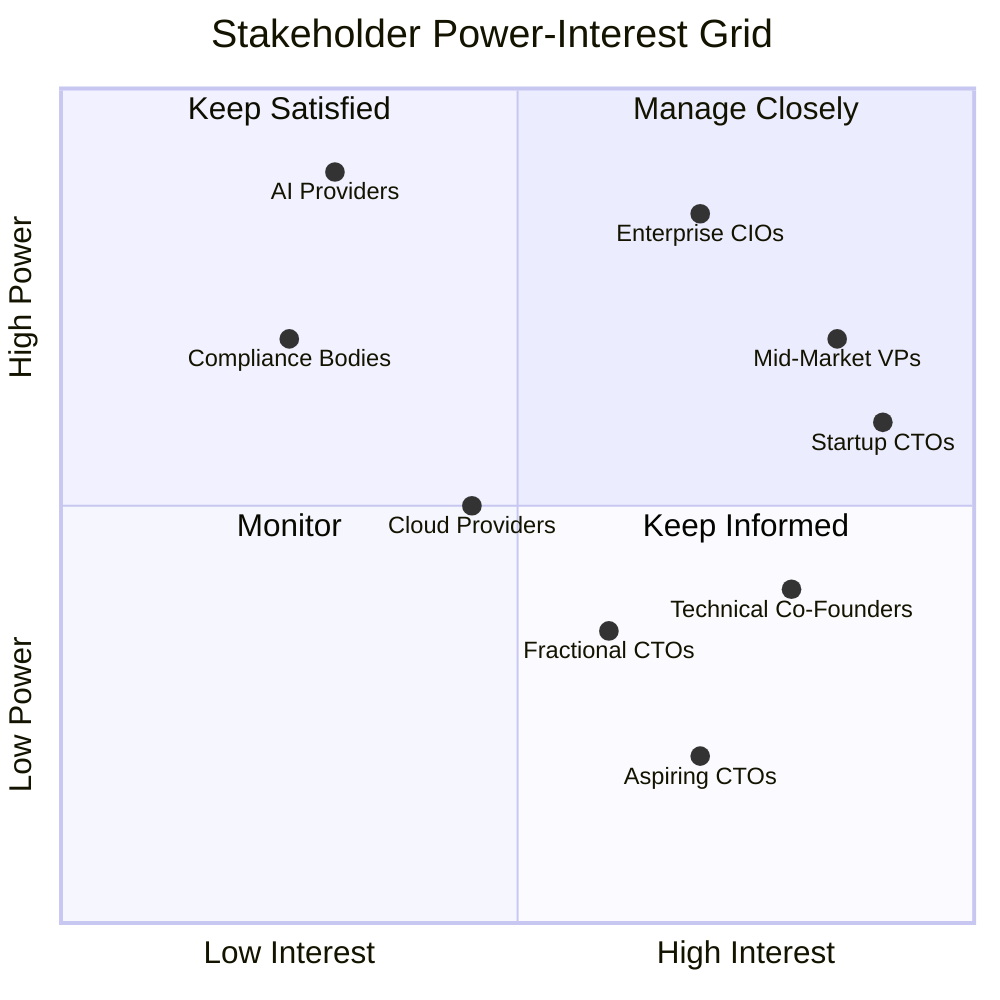
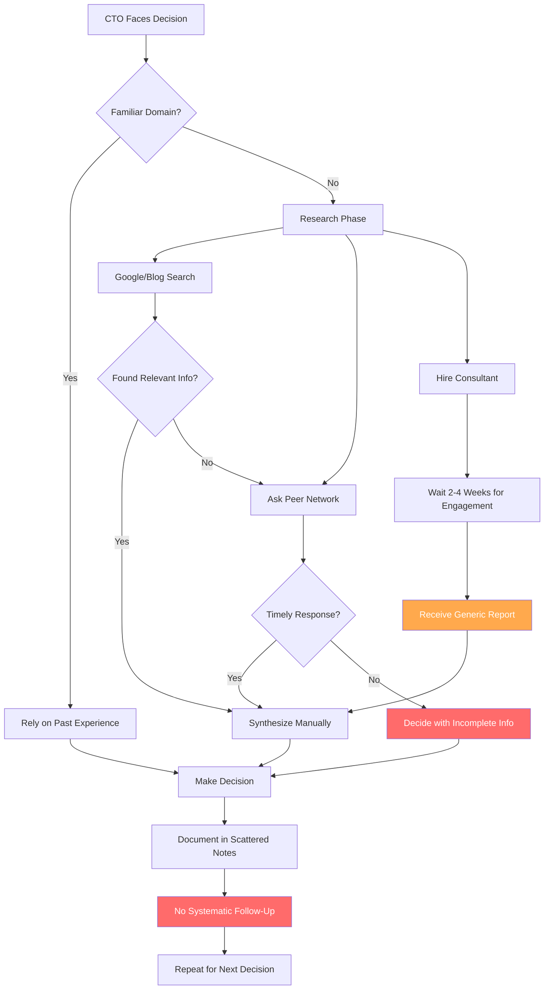
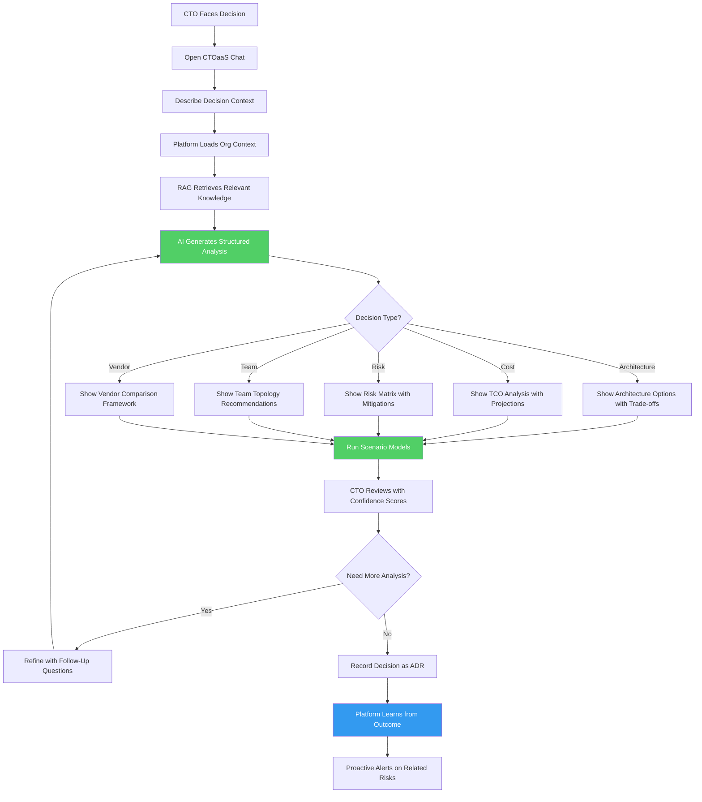
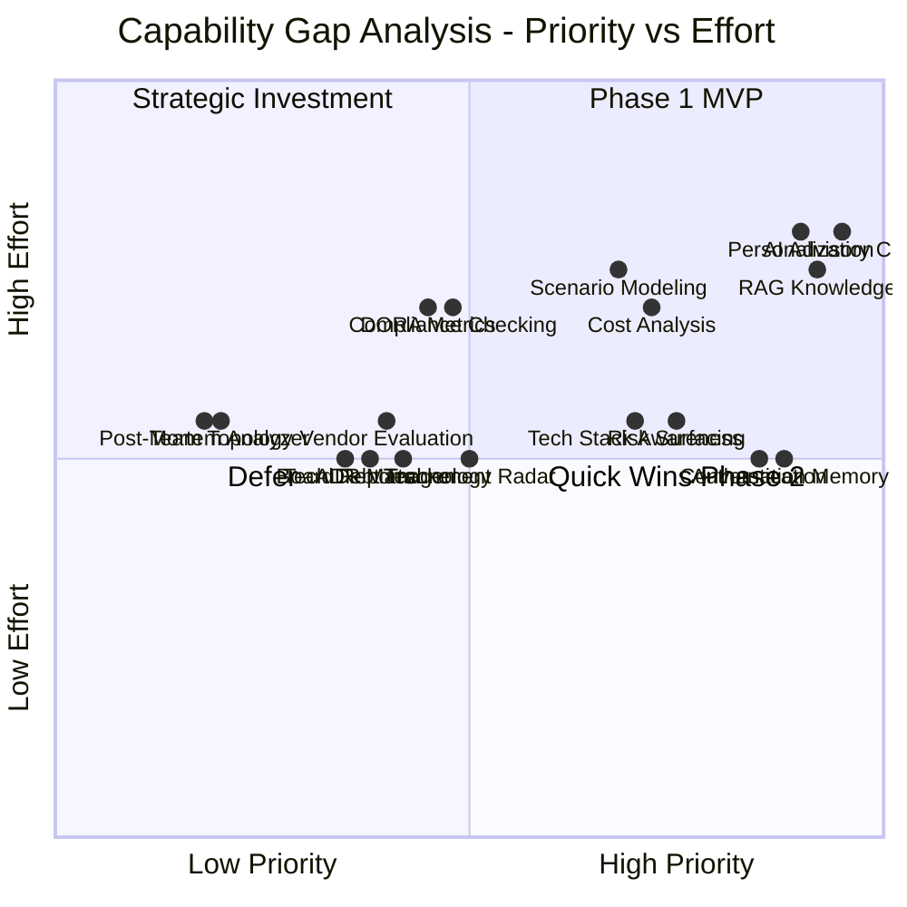
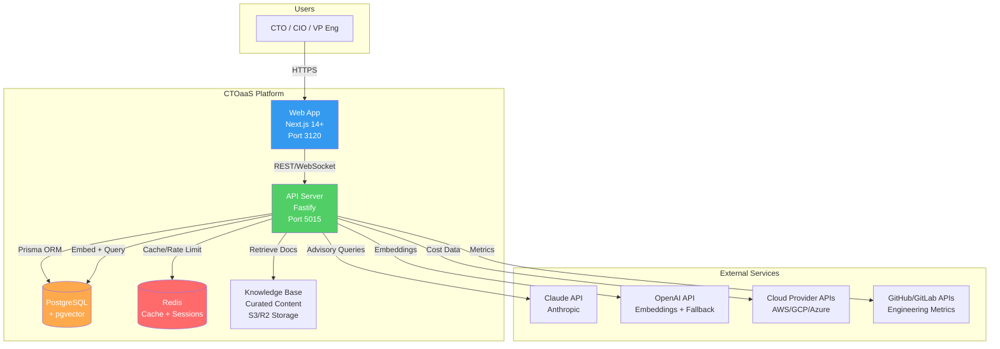
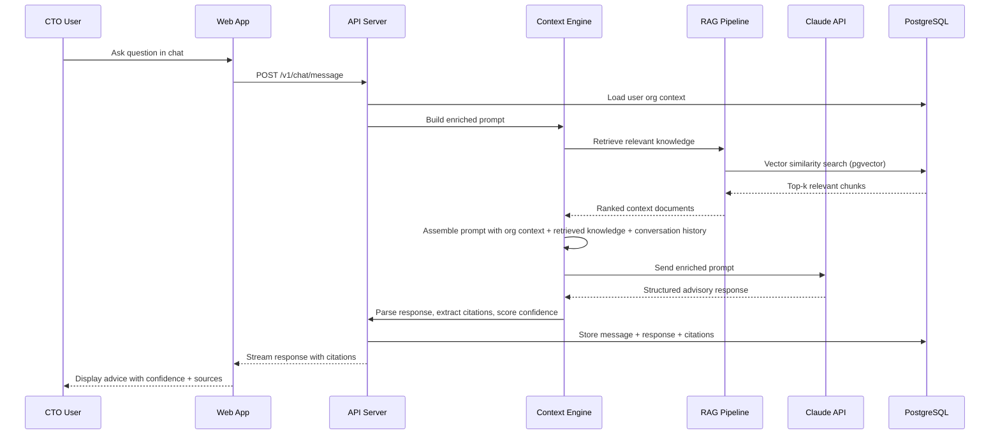

# Business Analysis Report: CTOaaS (CTO as a Service)

## 1. Executive Summary

CTOaaS is an AI-powered advisory platform that augments the decision-making capabilities of CTOs and CIOs. The platform addresses a critical gap in the technology leadership market: senior technology executives face increasingly complex decisions across risk, cost, architecture, and team management, yet lack personalized, always-available advisory tools that understand their specific organizational context. The global CTO advisory and technology consulting market exceeds $30B annually, with a clear trend toward AI-augmented decision support.

The platform differentiates through deep personalization (learning each CTO's company, industry, and decision history), curated knowledge retrieval from elite engineering organizations (Uber, Spotify, Netflix, Meta), and heavy modeling capabilities (scenario analysis, what-if simulations, technology radar). Phase 1 leverages Claude/OpenAI APIs with RAG over curated CTO knowledge bases; Phase 2 will swap in custom NanoChat-trained models optimized via AutoResearch for domain-specific performance.

Our recommendation is **GO** with high confidence. Technical feasibility is high (aligns with ConnectSW's default stack), market demand is validated by the growth of fractional CTO services and AI advisory tools, and resource requirements are moderate (estimated 6-8 sprints for Phase 1 MVP). Key risks include knowledge base curation quality, LLM hallucination in high-stakes advisory contexts, and enterprise sales cycle length.

## 2. Business Context

### 2.1 Problem Statement

**Who experiences the problem**: CTOs, CIOs, VPs of Engineering, and technical co-founders at companies ranging from Series A startups to mid-market enterprises (50-2000 employees).

**What the problem is**: Technology leaders must make high-stakes decisions daily across domains they cannot all be expert in simultaneously -- cloud cost optimization, vendor selection, compliance readiness, team topology, architecture migration, technical debt prioritization, and executive reporting. Today, they rely on expensive consulting firms ($300-500/hr), peer networks with inconsistent availability, or their own judgment without structured frameworks.

**Cost of inaction**: Poor technology decisions compound. A bad cloud architecture choice costs 6-12 months and $500K+ to reverse. A missed compliance gap (SOC2, GDPR) can delay enterprise deals by quarters. Unmanaged technical debt slows engineering velocity by 20-40% annually. CTOs who lack structured decision support make costlier mistakes, experience higher burnout, and deliver less strategic value to their organizations.

**Quantified opportunity**: If CTOaaS can prevent even one major technology decision mistake per year per customer, the ROI at a $500/month subscription is 10-100x (compared to $50K-$500K cost of reversing bad decisions).

### 2.2 Market Landscape

**Market size**: The global IT consulting market is valued at approximately $72B (2025), with the CTO advisory/fractional CTO segment estimated at $3-5B and growing at 18-22% CAGR. The AI-powered enterprise tools market is projected to reach $50B by 2028.

**Growth trends**:
- Fractional/part-time CTO services growing 25%+ annually as startups seek senior technical guidance without full-time cost
- AI copilot adoption in enterprise reaching inflection point (GitHub Copilot, Cursor, Devin proving willingness to use AI for technical work)
- Increasing regulatory complexity (SOC2, ISO27001, GDPR, AI Act) driving demand for compliance advisory
- Cloud cost optimization market alone is $5B+ as organizations grapple with cloud sprawl

**Key players**: Gartner (research), McKinsey Digital (consulting), ThoughtWorks (technology radar), Plurilock/fractional CTO firms (advisory), emerging AI tools (see competitive analysis)

**Disruption opportunity**: No current player combines personalized AI advisory + curated engineering knowledge + scenario modeling + compliance checking in a single platform. Consulting firms are expensive and slow; AI tools are generic and lack organizational context. CTOaaS occupies the intersection.

### 2.3 Target Segments

**Primary segments**:

| Segment | Size Estimate | Willingness to Pay | Key Pain |
|---------|--------------|--------------------|----|
| Startup CTOs (Series A-C) | ~50,000 globally | High ($300-800/mo) | Lack senior peers, making first-time decisions on architecture, compliance, hiring |
| Mid-market VPs of Engineering | ~100,000 globally | High ($500-2000/mo) | Overwhelmed by scope, need structured decision frameworks |
| Technical co-founders | ~200,000 globally | Medium ($200-500/mo) | Wearing multiple hats, need quick guidance on technical strategy |

**Secondary segments**:

| Segment | Size Estimate | Willingness to Pay | Key Pain |
|---------|--------------|--------------------|----|
| CIOs at enterprises (2000+ employees) | ~30,000 globally | Very high ($2000-5000/mo) | Board reporting, vendor management, compliance at scale |
| Fractional CTOs | ~15,000 globally | Medium ($300-600/mo) | Serve multiple clients, need efficient decision support tooling |
| Engineering managers aspiring to CTO | ~300,000 globally | Low-medium ($100-300/mo) | Learning CTO-level thinking, building strategic skills |

## 3. Stakeholder Analysis

### 3.1 Stakeholder Map

### 3.2 Stakeholder Register

| Stakeholder | Role | Interest | Influence | Needs | Communication |
|-------------|------|----------|-----------|-------|---------------|
| Startup CTOs | Primary user | Very High | High (early adopters, word-of-mouth) | Quick decisions, architecture guidance, compliance readiness | In-app chat, weekly digest emails |
| Mid-Market VPs Eng | Primary user | Very High | High (budget authority, team influence) | Structured frameworks, team modeling, executive reports | Dashboard, scheduled reports |
| Technical Co-Founders | Primary user | High | Medium (price-sensitive, vocal community) | Fast answers, build-vs-buy, cost optimization | Chat-first, mobile-friendly |
| Enterprise CIOs | Secondary user | High | Very High (large contracts, long sales cycle) | Governance, compliance, vendor management, board decks | White-glove onboarding, SSO |
| Fractional CTOs | Secondary user | Medium | Medium (influencers, multi-client leverage) | Multi-tenant context, efficiency tools | API access, bulk features |
| AI Providers (Anthropic, OpenAI) | Technology partner | Low | Very High (platform dependency) | API usage, responsible use | Developer relations, SLAs |
| Compliance Bodies | Regulator | Low | High (can block enterprise sales) | Data handling, audit trails | Compliance documentation |
| Cloud Providers | Integration partner | Medium | Medium (data source for cost analysis) | API adoption, marketplace listing | Partner programs |

### 3.3 Power/Interest Grid

## 4. Requirements Elicitation

### 4.1 Business Needs

| ID | Need | Source | Priority | Rationale |
|----|------|--------|----------|-----------|
| BN-001 | AI-powered advisory chat with CTO-relevant context | CEO Brief | P0 | Core value proposition; every other feature builds on conversational AI |
| BN-002 | RAG over curated CTO/engineering knowledge bases | CEO Brief | P0 | Differentiator; generic LLM responses are insufficient for CTO-level decisions |
| BN-003 | Organizational context personalization (company, industry, stack, history) | CEO Brief | P0 | Without personalization, the platform is just another chatbot |
| BN-004 | Technology risk identification and surfacing | CEO Brief | P1 | CTOs need proactive risk alerts, not just reactive answers |
| BN-005 | Cost analysis and optimization (TCO, cloud costs, build-vs-buy) | CEO Brief | P1 | Direct ROI driver; CTOs can quantify savings immediately |
| BN-006 | Tech stack awareness and migration recommendations | CEO Brief | P1 | Strategic planning capability; ties into architecture decisions |
| BN-007 | Scenario modeling and what-if analysis | CEO Brief | P1 | Heavy modeling is a key differentiator vs. simple chat tools |
| BN-008 | Technology radar (a la ThoughtWorks) | CEO Brief (enrichment) | P2 | Visual, engaging feature that drives regular usage and sharing |
| BN-009 | Compliance checking (SOC2, ISO27001, GDPR) | CEO Brief (enrichment) | P2 | Unlocks enterprise segment; high willingness to pay |
| BN-010 | Engineering metrics dashboard (DORA, SPACE) | CEO Brief (enrichment) | P2 | Quantitative decision support; integrates with existing tools |
| BN-011 | Architecture Decision Records management | CEO Brief (enrichment) | P2 | Structured decision tracking; feeds back into personalization |
| BN-012 | Team topology advisor | CEO Brief (enrichment) | P3 | Niche but valuable; requires significant domain modeling |
| BN-013 | Incident post-mortem analyzer | CEO Brief (enrichment) | P3 | Valuable for operational maturity assessment |
| BN-014 | Vendor evaluation framework | CEO Brief (enrichment) | P2 | Structured vendor scoring tied to cost analysis |
| BN-015 | Technical debt tracker and prioritizer | CEO Brief (enrichment) | P2 | Connects to cost analysis and risk assessment |
| BN-016 | Board/executive report generator | CEO Brief (enrichment) | P2 | High-value output; saves CTOs hours of report writing |
| BN-017 | Conversation memory and context retention across sessions | CEO Brief | P0 | Essential for personalization; users expect continuity |
| BN-018 | User authentication and multi-tenant data isolation | Derived | P0 | Security requirement; CTO data is highly sensitive |

### 4.2 Business Rules

| ID | Rule | Source | Impact |
|----|------|--------|--------|
| BR-001 | All CTO organizational data must be encrypted at rest and in transit | Security best practice | Architecture, infrastructure choices |
| BR-002 | LLM responses must include confidence indicators and source citations | Product quality | Prevents hallucination-driven bad decisions |
| BR-003 | Knowledge base content must be curated and versioned, not scraped indiscriminately | CEO Brief (curated knowledge) | Content pipeline, quality control |
| BR-004 | Scenario models must show assumptions explicitly so CTOs can validate inputs | Domain requirement | UI design, model transparency |
| BR-005 | Platform must not store or transmit customer source code to LLM providers | Security/trust | Architecture constraint on RAG pipeline |
| BR-006 | Free tier must exist to drive adoption; premium features gated behind subscription | Business model | Pricing, feature gating |
| BR-007 | All advisory outputs must carry a disclaimer that they are AI-generated recommendations, not professional advice | Legal/liability | UI, terms of service |

### 4.3 Assumptions

| ID | Assumption | Risk if Wrong | Validation Plan |
|----|-----------|---------------|-----------------|
| ASM-001 | CTOs will trust AI-generated strategic advice enough to act on it | Product has no market; users treat it as a toy | Run beta with 10-20 CTOs; measure decision adoption rate |
| ASM-002 | Curated knowledge from Uber/Spotify/Netflix is transferable to smaller companies | Advice is irrelevant to target segment | Interview 15 startup CTOs; test relevance of recommendations |
| ASM-003 | Claude/OpenAI APIs provide sufficient quality for CTO-level advisory | Core product quality is unacceptable | Benchmark 50 real CTO questions against expert answers; target 80%+ accuracy |
| ASM-004 | CTOs are willing to input sensitive organizational context into an AI platform | Personalization feature is unused; platform degrades to generic chat | A/B test onboarding with/without context gathering; measure engagement delta |
| ASM-005 | $300-800/month price point is viable for startup CTOs | Revenue model fails; need to pivot pricing | Price sensitivity survey with 50 target users; test 3 price points |
| ASM-006 | RAG over curated content provides better answers than fine-tuning alone | Knowledge base investment is wasted | Compare RAG vs. fine-tuned model on 100 CTO queries; measure preference |
| ASM-007 | Phase 1 (API-based) provides enough quality to retain users until Phase 2 (custom model) | Churn before Phase 2 delivers improvements | Track 30-day retention; target >60% monthly active |

## 5. Process Analysis

### 5.1 Current State (As-Is): How CTOs Make Technology Decisions Today

**Pain points in current state**:
- Research is manual, time-consuming (4-8 hours per major decision)
- Peer network responses are inconsistent and biased by their own context
- Consulting engagements are slow (weeks) and expensive ($10K-$50K per engagement)
- No organizational memory of past decisions and their outcomes
- No structured framework for recurring decision types
- Cost and risk analysis is ad-hoc, often skipped under time pressure

### 5.2 Future State (To-Be): CTO Decision-Making with CTOaaS

### 5.3 Process Improvement Opportunities

| Metric | Current State | Future State | Improvement |
|--------|--------------|-------------|-------------|
| Time to decision (major) | 4-8 hours research + days of deliberation | 30-60 minutes interactive analysis | 80-90% reduction |
| Cost of external advisory | $300-500/hr consultant | $15-25/day subscription | 90-95% reduction |
| Decision documentation rate | ~20% (scattered notes) | ~90% (auto-generated ADRs) | 4.5x improvement |
| Risk identification coverage | Ad-hoc, incomplete | Systematic, framework-driven | Qualitative: comprehensive vs. spotty |
| Organizational learning | Zero (decisions not tracked) | Continuous (outcome feedback loop) | From nothing to systematic |
| Cost optimization frequency | Quarterly at best | Continuous monitoring | 4x+ improvement |

## 6. Gap Analysis

### 6.1 Capability Gap Matrix

| Capability | Current State | Desired State | Gap | Priority | Effort |
|-----------|--------------|---------------|-----|----------|--------|
| AI advisory chat | None | Full conversational AI with CTO domain expertise | Full build | P0 | L |
| RAG knowledge retrieval | None | Curated knowledge from elite engineering orgs | Full build | P0 | L |
| Organizational personalization | None | Deep context: company, stack, industry, decision history | Full build | P0 | L |
| Conversation memory | None | Cross-session context retention with summarization | Full build | P0 | M |
| Authentication and data isolation | None | Multi-tenant auth with encryption | Full build (reuse ConnectSW patterns) | P0 | M |
| Technology risk surfacing | None | Proactive risk identification from org context | Full build | P1 | M |
| Cost analysis (TCO, cloud) | None | Structured TCO models, cloud cost integration | Full build | P1 | L |
| Tech stack awareness | None | Stack profiling, migration path recommendations | Full build | P1 | M |
| Scenario modeling | None | What-if analysis with adjustable parameters | Full build | P1 | L |
| Technology radar | None | ThoughtWorks-style radar with personalized overlays | Full build | P2 | M |
| Compliance checking | None | SOC2/ISO27001/GDPR gap analysis | Full build | P2 | L |
| Engineering metrics (DORA) | None | Integration with CI/CD for DORA/SPACE metrics | Full build | P2 | L |
| ADR management | None | Create, store, search, learn from ADRs | Full build | P2 | M |
| Vendor evaluation | None | Structured scoring framework with market data | Full build | P2 | M |
| Technical debt tracking | None | Debt inventory, prioritization, ROI modeling | Full build | P2 | M |
| Board report generation | None | Auto-generated executive summaries and slide content | Full build | P2 | M |
| Team topology advisor | None | Recommendations based on Team Topologies framework | Full build | P3 | M |
| Incident post-mortem analyzer | None | Pattern detection across incidents | Full build | P3 | M |

### 6.2 Gap Visualization

### 6.3 Phasing Recommendation

**Phase 1 (MVP - 6-8 sprints)**: BN-001, BN-002, BN-003, BN-017, BN-018 -- Core chat with RAG, personalization, memory, and auth.

**Phase 1.5 (Value expansion - 4-6 sprints)**: BN-004, BN-005, BN-006, BN-007 -- Risk, cost, stack awareness, and scenario modeling.

**Phase 2 (Differentiation - 6-8 sprints)**: BN-008, BN-009, BN-011, BN-014, BN-015, BN-016 -- Technology radar, compliance, ADRs, vendor eval, tech debt, board reports.

**Phase 3 (Advanced - 4-6 sprints)**: BN-010, BN-012, BN-013 -- DORA metrics, team topology, post-mortem analysis.

## 7. Competitive Analysis

### 7.1 Competitive Landscape

| Competitor | Type | Strengths | Weaknesses | Market Share | Differentiator |
|-----------|------|-----------|-----------|--------------|----------------|
| **Gartner / Forrester** | Research & advisory | Brand authority, deep research, enterprise relationships | Extremely expensive ($30K+/yr), generic not personalized, slow (quarterly reports) | ~40% of enterprise advisory | Analyst credibility |
| **ChatGPT / Claude (direct)** | General AI | Broad knowledge, low cost, conversational | No organizational context, no CTO-specific frameworks, no memory across sessions, hallucination risk | Growing rapidly | General purpose flexibility |
| **Jellyfish** | Engineering management platform | DORA metrics, resource allocation, data-driven | Not advisory (reporting only), no AI recommendations, no strategic guidance | ~5% of eng management | Engineering data analytics |
| **Thoughtworks Technology Radar** | Technology assessment | Trusted methodology, regular updates, visual format | Static (updated quarterly), not personalized, no advisory, free but no actionable guidance | Widely referenced | Community credibility |
| **Fractional CTO firms** (CTO.ai, Toptal CTO) | Human advisory | Deep expertise, highly personalized, relationship-based | Expensive ($200-500/hr), limited availability, not scalable, inconsistent quality | Fragmented market | Human judgment |
| **Pulumi/Infracost/Kubecost** | Cloud cost tools | Deep cloud cost data, automated recommendations | Narrow scope (cost only), no strategic advisory, no risk/compliance | Niche | Technical depth in cost |

### 7.2 Feature Comparison Matrix

| Feature | CTOaaS | ChatGPT/Claude (direct) | Gartner | Jellyfish | Fractional CTO |
|---------|--------|------------------------|---------|-----------|----------------|
| AI-powered advisory chat | Yes (core) | Yes (generic) | No | No | No (human) |
| CTO-specific knowledge base | Yes (curated) | No | Yes (reports) | No | Yes (in head) |
| Organizational personalization | Yes | No | Partial (industry) | Yes (data) | Yes |
| Technology risk analysis | Yes | Limited | Yes | No | Yes |
| Cost optimization | Yes | Limited | Partial | Partial | Partial |
| Scenario modeling | Yes | No | No | No | Manual |
| Technology radar | Yes | No | No (ThoughtWorks does) | No | No |
| Compliance checking | Yes | Limited | Partial | No | Partial |
| Engineering metrics | Yes | No | No | Yes (core) | No |
| ADR management | Yes | No | No | No | Manual |
| Board report generation | Yes | Limited | Yes | Partial | Yes |
| Always available (24/7) | Yes | Yes | No | Yes | No |
| Price per month | $300-2000 | $20-100 | $2500+ | $1000+ | $5000-15000 |

### 7.3 Competitive Positioning

**CTOaaS occupies a unique position**: it combines the breadth of AI advisory (like ChatGPT but domain-specialized), the depth of consulting (like Gartner but affordable and personalized), and the data-driven approach of engineering platforms (like Jellyfish but with strategic recommendations).

**Blue ocean opportunities**:
1. **Personalized + AI + Domain-specific**: No competitor combines all three. ChatGPT lacks personalization; Gartner lacks AI agility; fractional CTOs lack scalability.
2. **Decision memory and learning**: No competitor tracks decisions over time and learns from outcomes to improve future recommendations.
3. **Integrated advisory across domains**: Competitors specialize (cost OR risk OR metrics). CTOaaS provides holistic CTO support across all decision domains.
4. **Accessible price point**: 10-50x cheaper than consulting, with comparable or better quality for common decision types.

## 8. Feasibility Assessment

### 8.1 Technical Feasibility

**Stack alignment**: High. CTOaaS aligns with ConnectSW defaults.
- Backend: Fastify (API layer, auth, session management) -- established pattern
- Frontend: Next.js 14+ (SSR for SEO, App Router for complex UI) -- established pattern
- Database: PostgreSQL via Prisma (user data, conversations, ADRs, org context) -- established pattern
- AI: Claude API / OpenAI API (advisory engine) -- new but well-documented
- Vector DB: pgvector extension on PostgreSQL (RAG embeddings) -- moderate complexity
- Cache: Redis (conversation context, rate limiting) -- established pattern

**Complexity estimate**: Complex. The core chat with RAG is moderate, but personalization, scenario modeling, and the breadth of advisory domains make this a complex product overall.

**Technical risks and mitigations**:

| Risk | Severity | Mitigation |
|------|----------|-----------|
| LLM hallucination on high-stakes advice | High | Implement confidence scoring, source citation, human-in-the-loop for critical decisions |
| RAG retrieval quality (irrelevant or outdated results) | Medium | Chunking strategy testing, reranking models, regular knowledge base refresh cadence |
| Conversation context window limits | Medium | Implement sliding window summarization, hierarchical memory (short-term + long-term) |
| pgvector performance at scale (>1M embeddings) | Low | Monitor query latency; plan migration path to dedicated vector DB (Pinecone/Weaviate) if needed |
| API cost management (Claude/OpenAI per-token costs) | Medium | Implement token budgeting per user tier, caching of common queries, shorter prompt chains |

### 8.2 Market Feasibility

**Market demand evidence**:
- "Fractional CTO" search volume up 340% over 3 years (Google Trends)
- AI copilot market (adjacent) growing at 35% CAGR
- 78% of CTOs report feeling "under-resourced for strategic work" (Gartner CIO Survey 2025)
- YC-backed companies in adjacent space (Jellyfish, LinearB, Swarmia) raised $200M+ combined

**Timing considerations**:
- Favorable: LLM capabilities are now sufficient for domain-specific advisory; enterprise AI adoption hitting mainstream
- Risk: Market may become crowded quickly if large players (Microsoft Copilot, Google Gemini) add CTO-specific features
- Mitigation: First-mover advantage in personalization and curated knowledge; network effects from decision history

**Go-to-market barriers**:
- Enterprise sales require SOC2 certification (6-12 months to achieve)
- Building trust for AI advisory in high-stakes domain requires social proof and case studies
- Content/knowledge base curation requires significant upfront investment before product launch

### 8.3 Resource Feasibility

**Agent effort estimate**:

| Phase | Sprints | Key Deliverables |
|-------|---------|-----------------|
| Foundation (arch + infra) | 2 | Auth, database, project scaffolding, CI/CD |
| Phase 1 MVP (chat + RAG + personalization) | 6-8 | Core advisory chat, knowledge base, org context, memory |
| Phase 1.5 (risk, cost, stack, modeling) | 4-6 | Risk engine, cost analysis, stack profiler, scenario models |
| Phase 2 (differentiation features) | 6-8 | Radar, compliance, ADRs, vendor eval, tech debt, board reports |
| Phase 3 (advanced) | 4-6 | DORA metrics, team topology, post-mortem analysis |
| **Total estimated** | **22-30 sprints** | Full platform |

**Infrastructure requirements**:
- PostgreSQL with pgvector extension (managed, e.g., Render, Supabase, or Neon)
- Redis for caching and rate limiting
- Object storage (S3/R2) for knowledge base documents
- LLM API accounts (Anthropic Claude, OpenAI as fallback)
- Vector embedding pipeline (batch + real-time)

**Third-party dependencies**:
- Anthropic Claude API (primary LLM) -- critical dependency
- OpenAI API (fallback LLM, embeddings) -- important but secondary
- Cloud provider APIs (AWS/GCP/Azure) for cost analysis features (Phase 1.5)
- GitHub/GitLab APIs for engineering metrics integration (Phase 2)

### 8.4 Feasibility Summary

| Dimension | Rating | Confidence | Key Risk |
|-----------|--------|------------|----------|
| Technical | High | High | LLM hallucination on high-stakes advisory; mitigated by confidence scoring and citations |
| Market | High | Medium | Market window may narrow as large players enter; mitigated by personalization moat |
| Resource | Medium | Medium | 22-30 sprint total estimate is significant; Phase 1 MVP at 6-8 sprints is manageable |

## 9. Success Metrics

### 9.1 Key Performance Indicators

| KPI | Baseline | Target (6 months) | Target (12 months) | Measurement | Frequency |
|-----|----------|--------------------|---------------------|-------------|-----------|
| Monthly Active Users (MAU) | 0 | 200 | 1,000 | Unique users with 1+ chat sessions per month | Monthly |
| Monthly Recurring Revenue (MRR) | $0 | $30,000 | $200,000 | Subscription revenue | Monthly |
| Chat sessions per user per week | N/A | 3+ | 5+ | Average sessions per active user | Weekly |
| Decision adoption rate | N/A | 40% | 60% | % of recommendations user marks as "adopted" | Monthly |
| User-reported time savings | N/A | 4 hrs/week | 6 hrs/week | In-app survey | Quarterly |
| RAG retrieval relevance score | N/A | 80%+ | 90%+ | Human evaluation of top-5 retrieved chunks | Monthly |
| Net Promoter Score (NPS) | N/A | 40+ | 55+ | NPS survey | Quarterly |
| Churn rate | N/A | <8% monthly | <5% monthly | Users who cancel subscription | Monthly |
| Average Revenue Per User (ARPU) | N/A | $150/mo | $200/mo | MRR / paying users | Monthly |
| Knowledge base coverage | 0 topics | 50 topics | 150 topics | Curated topic areas with quality content | Monthly |

### 9.2 Success Criteria

Phase 1 MVP is successful if, within 3 months of launch:
1. 100+ registered users with 50+ monthly active
2. NPS of 30+ from beta users
3. Average 3+ chat sessions per user per week
4. RAG retrieval relevance score of 80%+ on evaluated queries
5. Zero security incidents involving customer data
6. At least 5 paying customers at $300+/month

## 10. Risk Register

| ID | Risk | Probability | Impact | Score | Mitigation | Owner |
|----|------|-------------|--------|-------|-----------|-------|
| RSK-001 | LLM hallucination leads to bad CTO decision with real business impact | Medium | High | 6 | Confidence scoring on every response; source citations required; disclaimer in ToS; human escalation path for critical decisions | AI/ML Engineer |
| RSK-002 | Knowledge base curation quality insufficient (stale, irrelevant, or biased content) | Medium | High | 6 | Establish editorial review process; version and date-stamp all content; user feedback loop on relevance; quarterly content audit | Product Manager |
| RSK-003 | Customer data breach (CTO organizational data is highly sensitive) | Low | Very High | 6 | Encryption at rest and in transit; SOC2 compliance roadmap; penetration testing; data isolation per tenant; no customer data sent to LLM training | Security Engineer |
| RSK-004 | LLM API cost overruns erode margins at scale | Medium | Medium | 4 | Token budgeting per tier; response caching for common queries; prompt optimization; negotiate volume pricing; plan Phase 2 custom model to reduce dependency | Backend Engineer |
| RSK-005 | Enterprise customers require SSO/SAML/SCIM before purchasing | High | Medium | 6 | Plan SSO implementation in Phase 1.5; evaluate Auth0/WorkOS for accelerated delivery; document enterprise readiness roadmap for sales | Architect |
| RSK-006 | Market window closes as Microsoft/Google add CTO-specific Copilot features | Medium | High | 6 | Move fast on Phase 1; build personalization moat (decision history, org context); focus on depth over breadth; establish community and brand | Product Strategist |
| RSK-007 | CTOs unwilling to input sensitive org data into AI platform | Medium | High | 6 | Offer on-premise/VPC deployment option for enterprise; transparent data handling policy; SOC2 certification; option to use without org context (degraded mode) | Product Manager |
| RSK-008 | Phase 2 custom model (NanoChat) underperforms commercial APIs | Medium | Medium | 4 | Maintain API-based architecture as fallback; define clear performance benchmarks before switching; A/B test custom vs. commercial models | AI/ML Engineer |
| RSK-009 | Regulatory changes (AI Act, data sovereignty) constrain LLM usage | Low | Medium | 2 | Monitor regulatory landscape; architect for data residency flexibility; maintain EU-hosted option | DevOps Engineer |
| RSK-010 | Feature scope creep delays Phase 1 MVP beyond 8 sprints | High | Medium | 6 | Strict MVP scope (BN-001/002/003/017/018 only); defer all P2/P3 features; weekly scope review with CEO | Orchestrator |

## 11. Recommendations

### 11.1 Go/No-Go Recommendation

**Recommendation: GO**

**Supporting evidence**:
- **Market demand is validated**: The fractional CTO market is growing 25%+ annually, AI advisory adoption is accelerating, and 78% of CTOs report being under-resourced for strategic work.
- **Technical feasibility is high**: The product aligns with ConnectSW's default stack (Fastify, Next.js, PostgreSQL). LLM APIs are mature enough for domain-specific advisory. pgvector enables RAG without a separate vector database.
- **Competitive gap is clear**: No current product combines AI advisory + CTO domain expertise + organizational personalization + scenario modeling at an accessible price point.
- **Revenue potential is significant**: Even conservative estimates (500 users at $300/month average) yield $150K MRR within 12 months.
- **Risk is manageable**: The highest risks (hallucination, data security, market window) all have viable mitigations.

**Key conditions for success**:
1. Phase 1 MVP must ship within 8 sprints to establish market presence before large players enter
2. Knowledge base curation must begin immediately (parallel to development) -- this is the hardest-to-replicate moat
3. Beta program with 10-20 real CTOs must validate ASM-001 (trust) and ASM-004 (willingness to share org data) before general launch

### 11.2 Prioritized Action Items

1. **[Immediate]** Begin knowledge base curation -- identify top 50 engineering blog sources, create ingestion pipeline spec
2. **[Sprint 1]** Foundation setup: project scaffolding, auth, database schema, CI/CD pipeline
3. **[Sprint 1]** Product Manager to create full PRD with user stories derived from BN-001 through BN-018
4. **[Sprint 2]** Architect to design RAG pipeline architecture and conversation memory system
5. **[Sprint 2-3]** Begin Phase 1 MVP development: chat interface, RAG retrieval, basic personalization
6. **[Sprint 4]** Launch closed beta with 10-20 CTOs; validate ASM-001, ASM-002, ASM-004
7. **[Sprint 6-8]** Iterate on beta feedback; prepare for public launch
8. **[Post-launch]** Begin Phase 1.5 planning based on user feedback and usage data

### 11.3 Traceability: Business Need to User Story Mapping

| Business Need | Suggested User Stories | Priority |
|--------------|----------------------|----------|
| BN-001: AI advisory chat | US-01: As a CTO, I want to ask technology questions in natural language so that I get structured, actionable advice. US-02: As a CTO, I want follow-up questions to refine recommendations so that I can drill deeper into specific aspects. | P0 |
| BN-002: RAG knowledge retrieval | US-03: As a CTO, I want answers grounded in best practices from top engineering organizations so that I can trust the recommendations. US-04: As a CTO, I want to see source citations for every recommendation so that I can verify the basis of advice. | P0 |
| BN-003: Organizational personalization | US-05: As a CTO, I want to configure my company profile (industry, size, tech stack, stage) so that advice is tailored to my context. US-06: As a CTO, I want the platform to remember my past decisions and preferences so that recommendations improve over time. | P0 |
| BN-004: Technology risk surfacing | US-07: As a CTO, I want proactive alerts about technology risks in my stack so that I can address issues before they become incidents. US-08: As a CTO, I want a risk dashboard showing current exposure across categories so that I can prioritize mitigation. | P1 |
| BN-005: Cost analysis | US-09: As a CTO, I want TCO analysis for build-vs-buy decisions so that I can justify technology investments to the board. US-10: As a CTO, I want cloud cost optimization recommendations so that I can reduce infrastructure spend. | P1 |
| BN-006: Tech stack awareness | US-11: As a CTO, I want my current tech stack profiled with maturity assessments so that I can identify migration candidates. US-12: As a CTO, I want migration path recommendations when my stack components are aging so that I can plan transitions proactively. | P1 |
| BN-007: Scenario modeling | US-13: As a CTO, I want what-if analysis (e.g., "what if we migrate from AWS to GCP") so that I can evaluate options with data. US-14: As a CTO, I want to adjust model parameters and see updated projections so that I can test my assumptions. | P1 |
| BN-008: Technology radar | US-15: As a CTO, I want a visual technology radar showing Adopt/Trial/Assess/Hold categories so that I can track technology trends relevant to my stack. | P2 |
| BN-009: Compliance checking | US-16: As a CTO, I want SOC2/ISO27001/GDPR readiness assessment so that I can identify compliance gaps before audits. | P2 |
| BN-010: Engineering metrics | US-17: As a VP of Engineering, I want DORA and SPACE metrics integrated from my CI/CD pipeline so that I can track engineering effectiveness. | P2 |
| BN-011: ADR management | US-18: As a CTO, I want to create, store, and search Architecture Decision Records so that decisions are documented and searchable. | P2 |
| BN-012: Team topology advisor | US-19: As a CTO, I want team structure recommendations based on my org size and product architecture so that I can optimize for flow. | P3 |
| BN-013: Incident post-mortem analyzer | US-20: As a CTO, I want incident patterns analyzed across post-mortems so that I can identify systemic issues. | P3 |
| BN-014: Vendor evaluation | US-21: As a CTO, I want a structured vendor comparison framework so that I can make objective vendor selections. | P2 |
| BN-015: Technical debt tracking | US-22: As a CTO, I want technical debt inventoried and prioritized by business impact so that I can allocate refactoring effort strategically. | P2 |
| BN-016: Board report generation | US-23: As a CTO, I want auto-generated executive technology reports so that I can save hours of board deck preparation. | P2 |
| BN-017: Conversation memory | US-24: As a CTO, I want my conversation context preserved across sessions so that I do not have to re-explain my situation each time. | P0 |
| BN-018: Auth and data isolation | US-25: As a CTO, I want my organizational data isolated and encrypted so that I can trust the platform with sensitive information. US-26: As a CTO, I want to sign up and manage my account securely so that I can control access to my data. | P0 |

## 12. Appendix: Platform Architecture Context Diagram

## 13. Appendix: Decision Domain Sequence Flow

