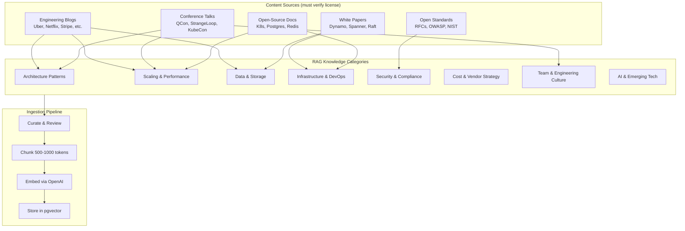
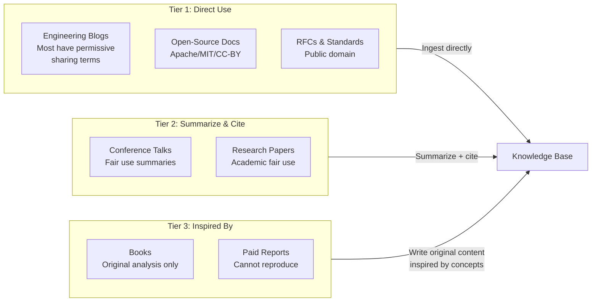
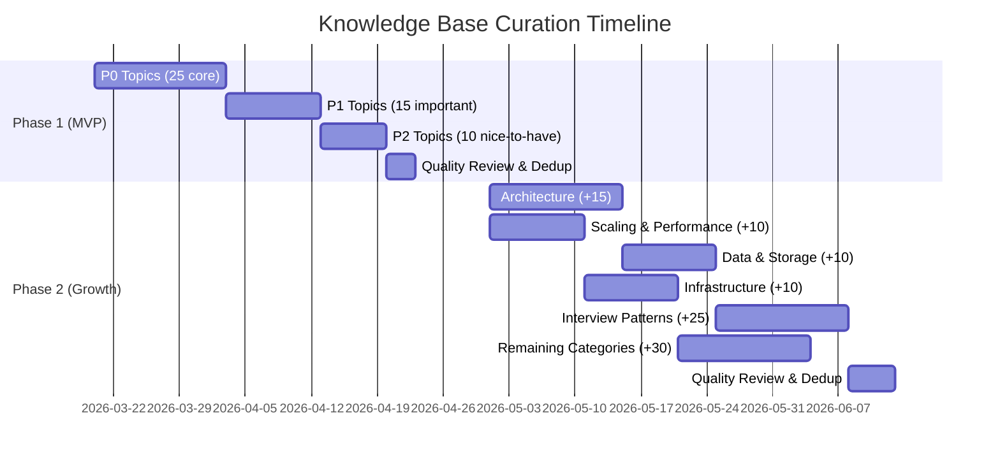

# CTOaaS Knowledge Base Curation Plan

**Date**: 2026-03-15
**Source**: [System Design Academy](https://github.com/systemdesign42/system-design-academy) taxonomy (22.7k stars)
**Purpose**: Map elite engineering knowledge topics to CTOaaS RAG categories for Phase 1 (50 topics) and Phase 2 (150 topics)
**Traces to**: US-03, US-04, FR-005

> **License note**: The System Design Academy repo (CC BY-NC-ND 4.0) cannot be used directly.
> This plan uses its **topic taxonomy** as a coverage checklist. All content must be
> sourced independently from original engineering blogs, papers, and conference talks.

---

## 1. Knowledge Base Architecture



---

## 2. Phase 1 — MVP Topics (50 topics)

Prioritized by **CTO decision frequency** × **advisory value** × **content availability**.

### Category A: Architecture Patterns (10 topics)

| # | Topic | Source Inspiration | CTO Decision It Supports | Priority |
|---|-------|--------------------|--------------------------|----------|
| A-01 | Microservices vs Monolith trade-offs | Netflix microservices lessons, Shopify modular monolith | "Should we break up our monolith?" | P0 |
| A-02 | API Gateway patterns | How API Gateway works, Gateway vs LB vs Reverse Proxy | API architecture decisions | P0 |
| A-03 | Event-driven architecture | Kafka fundamentals, message queues | Async vs sync design | P0 |
| A-04 | Cell-based architecture | Cell-based architecture patterns | Blast radius isolation | P1 |
| A-05 | Service discovery patterns | Service discovery fundamentals | Microservice communication | P1 |
| A-06 | Sidecar & service mesh | Sidecar pattern | Infrastructure layer decisions | P1 |
| A-07 | Actor model | Actor model fundamentals | Concurrency architecture | P2 |
| A-08 | Micro frontends | Micro frontends patterns | Frontend architecture at scale | P2 |
| A-09 | Saga pattern for distributed transactions | Halo's saga pattern at 11.6M users | Cross-service data consistency | P1 |
| A-10 | CQRS & event sourcing | Stock exchange architecture | Read/write optimization | P2 |

### Category B: Scaling & Performance (10 topics)

| # | Topic | Source Inspiration | CTO Decision It Supports | Priority |
|---|-------|--------------------|--------------------------|----------|
| B-01 | Horizontal scaling strategies | AWS scaling to 10M users, GCP scaling to 100M | "When and how to scale?" | P0 |
| B-02 | Load balancing algorithms | Load balancing algorithm comparison | Traffic distribution | P0 |
| B-03 | Caching patterns (5 patterns) | Top 5 caching patterns | Performance optimization | P0 |
| B-04 | Rate limiting strategies | Stripe rate limiting, rate limiting explained | API protection | P0 |
| B-05 | CDN & edge computing | Cloudflare 55M req/s with 15 Postgres clusters | Global performance | P1 |
| B-06 | Connection pooling & Nginx | Nginx 1M concurrent connections | Server resource management | P1 |
| B-07 | Code splitting for performance | Discord code splitting | Frontend performance | P2 |
| B-08 | Real-time systems at scale | Disney+ 5B emojis, 25M concurrent users | Real-time feature decisions | P1 |
| B-09 | Back-of-envelope estimation | Back of the envelope calculations | Capacity planning | P0 |
| B-10 | Consistent hashing | Consistent hashing fundamentals | Distributed data partitioning | P1 |

### Category C: Data & Storage (8 topics)

| # | Topic | Source Inspiration | CTO Decision It Supports | Priority |
|---|-------|--------------------|--------------------------|----------|
| C-01 | Database selection guide (SQL vs NoSQL) | YouTube with MySQL at 2.49B users, Figma Postgres at 4M | "Which database should we use?" | P0 |
| C-02 | Database sharding strategies | Quora MySQL sharding at 13TB+ | Scaling data layer | P0 |
| C-03 | Data consistency patterns | Consistency patterns, Meta 99.99999999% cache consistency | CAP theorem trade-offs | P0 |
| C-04 | Migration strategies for large datasets | Tumblr 60B+ row migration | Zero-downtime migrations | P1 |
| C-05 | Vector databases & embeddings | pgvector, embedding strategies | AI feature data layer | P1 |
| C-06 | Password & secrets storage | How databases keep passwords securely | Security-critical storage | P0 |
| C-07 | Bloom & quotient filters | Bloom filter, quotient filter | Probabilistic data structures | P2 |
| C-08 | Redis use cases & patterns | Redis use cases | Caching & session architecture | P1 |

### Category D: Infrastructure & DevOps (7 topics)

| # | Topic | Source Inspiration | CTO Decision It Supports | Priority |
|---|-------|--------------------|--------------------------|----------|
| D-01 | DNS & networking fundamentals | How DNS works, what happens when you type a URL | Debugging & architecture | P0 |
| D-02 | Deployment patterns | Deployment patterns (blue-green, canary, rolling) | Release strategy | P0 |
| D-03 | Chaos engineering | Netflix chaos engineering | Resilience strategy | P1 |
| D-04 | Container orchestration (K8s vs ECS) | Industry patterns | "Do we need Kubernetes?" | P0 |
| D-05 | Serverless architecture | Amazon Lambda, Meta XFaaS | Build vs serverless decisions | P1 |
| D-06 | Gossip protocol & distributed coordination | Gossip protocol, hinted handoff | Distributed systems design | P2 |
| D-07 | Observability & monitoring | Industry best practices | Production readiness | P1 |

### Category E: Security & Compliance (5 topics)

| # | Topic | Source Inspiration | CTO Decision It Supports | Priority |
|---|-------|--------------------|--------------------------|----------|
| E-01 | API security best practices | API security best practices | Securing APIs | P0 |
| E-02 | Authentication patterns (JWT, OAuth) | How JWT works, HTTPS | Auth architecture | P0 |
| E-03 | SOC2 compliance roadmap | Industry frameworks | Enterprise readiness | P0 |
| E-04 | GDPR & data privacy | Regulatory requirements | Privacy compliance | P1 |
| E-05 | Cybersecurity fundamentals for CTOs | Cybersecurity terms for engineers | Security posture | P1 |

### Category F: Cost & Vendor Strategy (5 topics)

| # | Topic | Source Inspiration | CTO Decision It Supports | Priority |
|---|-------|--------------------|--------------------------|----------|
| F-01 | Cloud cost optimization | AWS/GCP scaling guides, frugal architecture | "How to reduce cloud spend?" | P0 |
| F-02 | Build vs buy framework | Industry decision frameworks | Make/buy decisions | P0 |
| F-03 | Vendor lock-in assessment | Multi-cloud patterns | Vendor strategy | P1 |
| F-04 | Open source strategy | Tumblr open source guidelines | OSS adoption decisions | P2 |
| F-05 | Technical debt quantification | Industry methodologies | Board reporting on tech debt | P0 |

### Category H: AI & Emerging Tech (5 topics)

| # | Topic | Source Inspiration | CTO Decision It Supports | Priority |
|---|-------|--------------------|--------------------------|----------|
| H-01 | LLM integration patterns | LLM concepts explained | "Should we add AI to our product?" | P0 |
| H-02 | AI agents architecture | How AI agents work | Building AI features | P0 |
| H-03 | Context engineering vs prompt engineering | Context eng vs prompt eng | AI implementation quality | P1 |
| H-04 | MCP (Model Context Protocol) | MCP deep dive | AI tooling decisions | P1 |
| H-05 | AI coding workflows | AI coding workflow patterns | Developer productivity | P2 |

---

## 3. Phase 2 — Extended Topics (100 additional, total 150)

### Category A: Architecture Patterns (+15)

| # | Topic | Source |
|---|-------|--------|
| A-11 | Protocol Buffers & gRPC | LinkedIn 60% latency reduction with protobuf |
| A-12 | WebSocket architecture | WebSocket fundamentals |
| A-13 | Webhook design patterns | Webhook fundamentals |
| A-14 | HTTP streaming | Airbnb $84M savings via HTTP streaming |
| A-15 | URL shortener architecture | Bitly architecture |
| A-16 | Feed generation at scale | Hashnode feed generation |
| A-17 | Live video streaming | Facebook live video to 1B users |
| A-18 | Software load balancing | Facebook software load balancer to 1B users |
| A-19 | Search engine architecture | Google Search internals |
| A-20 | Real-time collaboration | Canva real-time collab for 135M users, Google Docs |
| A-21 | Social platform architecture | Reddit, Bluesky internals |
| A-22 | Payments architecture | Uber 30M tx/day, PayPal 1B tx/day, Stripe idempotency |
| A-23 | Food delivery platforms | McDonald's 20K orders/sec |
| A-24 | Ride-sharing systems | Uber ETA at 500K req/sec, nearby drivers at 1M req/sec |
| A-25 | Messaging at scale | WhatsApp 50B msgs/day with 32 engineers |

### Category B: Scaling & Performance (+10)

| # | Topic | Source |
|---|-------|--------|
| B-11 | Flash sale architecture | SeatGeek virtual waiting room, Shopify 32M req/min |
| B-12 | Launch day scaling | Disney+ 11M users on day 1 |
| B-13 | Gaming leaderboards | Real-time gaming leaderboard |
| B-14 | Distributed counters | Distributed counter patterns |
| B-15 | Presence systems | Real-time presence platform |
| B-16 | Live commenting at scale | Real-time live comments |
| B-17 | GIF/media delivery at scale | Giphy 10B GIFs/day to 1B users |
| B-18 | Swipe/matching at scale | Tinder 1.6B swipes/day |
| B-19 | Emoji delivery at scale | Disney+ Hotstar 5B emojis real-time |
| B-20 | Video streaming optimization | Netflix architecture |

### Category C: Data & Storage (+10)

| # | Topic | Source |
|---|-------|--------|
| C-09 | Amazon Dynamo paper | Dynamo white paper |
| C-10 | Google Spanner paper | Spanner white paper |
| C-11 | S3 architecture & durability | S3 99.999999999% durability |
| C-12 | Strong consistency at scale | Amazon S3 strong consistency |
| C-13 | Stacked diffs workflow | Stacked diffs explained |
| C-14 | Git workflows at scale | 21 Git commands for engineers |
| C-15 | Instagram data at 2.5B users | Instagram scaling |
| C-16 | LinkedIn data at 930M users | LinkedIn scaling |
| C-17 | Khan Academy scaling to 30M | Khan Academy architecture |
| C-18 | Dropbox scaling to 100K users | Dropbox early scaling |

### Category D: Infrastructure & DevOps (+10)

| # | Topic | Source |
|---|-------|--------|
| D-08 | Concurrency vs parallelism | Concurrency is not parallelism |
| D-09 | RPC patterns | How RPC works |
| D-10 | High availability patterns | What is high availability |
| D-11 | HTTP headers deep dive | Must-know HTTP headers |
| D-12 | HTTPS/TLS internals | How HTTPS works |
| D-13 | Sorting algorithms for engineers | How Timsort works |
| D-14 | Cloud failure patterns | 15 pitfalls that break cloud systems |
| D-15 | API versioning strategies | API versioning |
| D-16 | Forward vs reverse proxy | Proxy comparison |
| D-17 | Code review best practices | Code review patterns, scaling code reviews |

### Category E: Security & Compliance (+5)

| # | Topic | Source |
|---|-------|--------|
| E-06 | Payment security (PCI-DSS) | Apple Pay 41M tx/day securely |
| E-07 | IoT security patterns | AirTag security |
| E-08 | Supply chain security | Industry frameworks |
| E-09 | Zero-trust architecture | Industry patterns |
| E-10 | Incident response playbooks | Industry best practices |

### Category F: Cost & Vendor Strategy (+5)

| # | Topic | Source |
|---|-------|--------|
| F-06 | Frugal architecture principles | Amazon frugal architecture |
| F-07 | Tech stack evolution case study | Levels.fyi tech stack evolution |
| F-08 | Automation ROI | Zapier billions of tasks automated |
| F-09 | Team size vs scale trade-offs | YouTube 9 engineers, WhatsApp 32 engineers, PayPal 8 VMs |
| F-10 | Infrastructure consolidation | Cloudflare 15 Postgres clusters for 55M req/s |

### Category G: Team & Engineering Culture (+10)

| # | Topic | Source |
|---|-------|--------|
| G-01 | Engineering team scaling | Industry patterns |
| G-02 | Technical hiring frameworks | Interview resources |
| G-03 | System design interview frameworks | System design interview framework |
| G-04 | Behavioral interview patterns | Behavioral interview playbook |
| G-05 | Engineering metrics (DORA, SPACE) | Industry frameworks |
| G-06 | On-call & incident management | Industry patterns |
| G-07 | Engineering blog strategy | Industry examples |
| G-08 | Developer experience (DevEx) | Industry patterns |
| G-09 | Architecture decision records | ADR best practices |
| G-10 | Technical leadership patterns | Industry wisdom |

### Category H: AI & Emerging Tech (+10)

| # | Topic | Source |
|---|-------|--------|
| H-06 | Reinforcement learning for products | Reinforcement learning fundamentals |
| H-07 | ChatGPT app architecture | How ChatGPT apps work |
| H-08 | RAG pipeline design | Industry patterns |
| H-09 | AI evaluation & testing | Industry patterns |
| H-10 | AI cost management | Token budgets, model selection |
| H-11 | Edge AI & on-device inference | Industry trends |
| H-12 | AI safety & responsible AI | Industry frameworks |
| H-13 | Vector search optimization | Industry patterns |
| H-14 | Multi-modal AI products | Industry trends |
| H-15 | AI-powered code review | Industry tools |

### System Design Interviews (+25)

These topics serve double duty: CTOs use them to evaluate candidates AND learn patterns.

| # | Topic | Source |
|---|-------|--------|
| I-01 | Design Airbnb | System design interview |
| I-02 | Design ChatGPT | System design interview |
| I-03 | Design Spotify | System design interview |
| I-04 | Design WhatsApp (Parts 1-2) | System design interview |
| I-05 | Design YouTube | System design interview |
| I-06 | Design Twitter/X Timeline | System design interview |
| I-07 | Design Web Crawler | System design interview |
| I-08 | Design Pastebin | System design case study |
| I-09 | Design Slack | Slack architecture |
| I-10 | Design Uber | Uber ETA + nearby drivers |
| I-11 | Design Netflix | Netflix architecture |
| I-12 | Design Instagram | Instagram scaling |
| I-13 | Design Dropbox | Dropbox scaling |
| I-14 | Design LinkedIn | LinkedIn scaling |
| I-15 | Design a Payment System | Stripe + PayPal patterns |
| I-16 | Design a Rate Limiter | Rate limiting strategies |
| I-17 | Design a URL Shortener | Bitly architecture |
| I-18 | Design a News Feed | Hashnode feed generation |
| I-19 | Design a Real-time Leaderboard | Gaming leaderboard |
| I-20 | Design a Stock Exchange | Stock exchange parts 1-3 |
| I-21 | Design a CDN | CDN fundamentals |
| I-22 | Design a Search Engine | Google Search |
| I-23 | Design a Chat System | WeChat 1.67B users |
| I-24 | Design a Notification System | Industry patterns |
| I-25 | Design a Distributed Cache | Redis + caching patterns |

---

## 4. Content Sourcing Strategy

### Approved Source Types (License-Compatible)



### Priority Source List

| Company | Blog URL | Key Topics | License |
|---------|----------|------------|---------|
| Netflix | netflixtechblog.com | Microservices, chaos eng, streaming | Permissive blog |
| Uber | eng.uber.com | Geospatial, payments, real-time | Permissive blog |
| Stripe | stripe.com/blog/engineering | Payments, API design, rate limiting | Permissive blog |
| Meta | engineering.fb.com | Caching, load balancing, live video | Permissive blog |
| Airbnb | medium.com/airbnb-engineering | HTTP streaming, scaling | Permissive blog |
| Spotify | engineering.atspotify.com | Microservices, ML, personalization | Permissive blog |
| Cloudflare | blog.cloudflare.com | CDN, DNS, DDoS, performance | Permissive blog |
| Discord | discord.com/blog | Performance, code splitting, scaling | Permissive blog |
| LinkedIn | engineering.linkedin.com | Protocol Buffers, scaling, data | Permissive blog |
| Shopify | shopify.engineering | Flash sales, modular monolith | Permissive blog |

---

## 5. Ingestion Cadence



### Per-Topic Ingestion Checklist

- [ ] Identify 2-3 authoritative sources per topic
- [ ] Verify license allows summarization/ingestion
- [ ] Write 1500-3000 word curated summary with citations
- [ ] Include: definition, trade-offs, when to use, when NOT to use, real-world examples
- [ ] Tag with category, subcategory, company examples, tech stack relevance
- [ ] Chunk at semantic boundaries (500-1000 tokens)
- [ ] Embed and verify retrieval quality (test 3 sample queries per topic)
- [ ] Peer review for accuracy

---

## 6. RAG Quality Metrics

| Metric | Phase 1 Target | Phase 2 Target |
|--------|---------------|----------------|
| Topic coverage (of planned) | 50/50 (100%) | 150/150 (100%) |
| Retrieval relevance (top-5) | >= 80% | >= 85% |
| Citation accuracy | >= 90% | >= 95% |
| Query latency (p95) | < 500ms | < 500ms |
| Hallucination rate | < 10% | < 5% |
| User satisfaction (thumbs up) | >= 70% | >= 80% |

---

## 7. Category-to-Copilot Route Mapping

Maps knowledge categories to CTOaaS copilot routing (from `agent/graph.ts`):

| Knowledge Category | Copilot Route | How It's Used |
|-------------------|---------------|---------------|
| A: Architecture Patterns | `rag-search` | Grounded architecture advice |
| B: Scaling & Performance | `rag-search` | Scaling decision support |
| C: Data & Storage | `rag-search` | Database/storage selection |
| D: Infrastructure & DevOps | `rag-search` | Infrastructure decisions |
| E: Security & Compliance | `risk-advisor` | Risk assessment + RAG |
| F: Cost & Vendor Strategy | `cost-analyzer` | TCO analysis + RAG |
| G: Team & Engineering Culture | `rag-search` | Team scaling advice |
| H: AI & Emerging Tech | `radar-lookup` + `rag-search` | Tech radar + advice |
| I: System Design Interviews | `rag-search` | Interview prep for CTO's team |

---

## 8. Competitive Advantage

This curated knowledge base, organized around **real CTO decisions** rather than abstract concepts, is CTOaaS's moat:

```
Generic AI (ChatGPT)          CTOaaS Knowledge Base
─────────────────────         ─────────────────────
"Microservices are..."        "Given your 15-person team at Series B,
                               Netflix's lesson is relevant: they found
                               microservices added 40% overhead below
                               50 engineers. Shopify chose modular monolith
                               at similar scale and saved $84M in infra.
                               Recommendation: stay monolithic, extract
                               only the payment service. [1][2][3]"
```

The System Design Academy taxonomy ensures we cover what CTOs actually search for.
