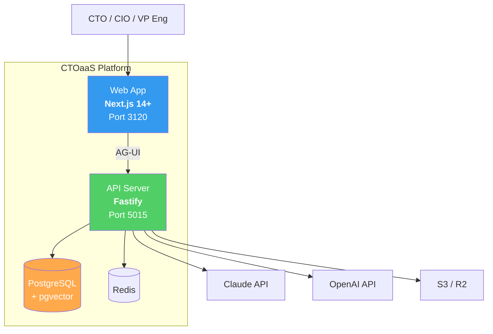
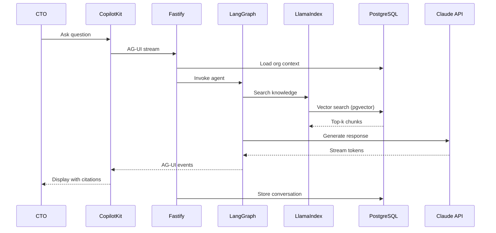

# Implementation Plan: CTOaaS Foundation (Phase 1 MVP)

**Product**: CTOaaS (CTO as a Service)
**Branch**: `foundation/ctoaas`
**Created**: 2026-03-12
**Spec**: `products/ctoaas/docs/specs/ctoaas-foundation.md`

## Summary

CTOaaS is an AI-powered advisory platform for CTOs, CIOs, and VPs of Engineering. Phase 1 MVP delivers a conversational advisory copilot (CopilotKit + LangGraph), knowledge retrieval (LlamaIndex + pgvector), organizational personalization, risk dashboard, cost analysis, and interactive technology radar.

**Why this matters**: Technology leaders make high-stakes decisions daily across domains they cannot all be expert in. A single bad architecture decision costs 6-12 months and $500K+ to reverse. CTOaaS provides always-available, personalized, citation-backed advisory grounded in best practices from elite engineering organizations, at 10-50x less cost than traditional consulting.

## Technical Context

- **Language/Version**: TypeScript 5+ / Node.js 20+
- **Backend**: Fastify + Prisma + PostgreSQL 15 + pgvector
- **Frontend**: Next.js 14+ / React 18+ / Tailwind CSS / shadcn/ui
- **AI UI**: CopilotKit (AG-UI protocol, streaming, generative UI)
- **Agent Framework**: LangGraph (stateful orchestration, ReAct pattern)
- **RAG Framework**: LlamaIndex (ingestion, chunking, retrieval)
- **Primary LLM**: Claude API (Anthropic)
- **Fallback LLM**: OpenAI GPT-4 via OpenRouter
- **Embeddings**: OpenAI text-embedding-3-small (1536 dims)
- **Testing**: Jest + React Testing Library + Playwright
- **Target Platform**: Web (responsive, no native mobile)
- **Assigned Ports**: Frontend 3120 / Backend 5015

## Architecture

See `products/ctoaas/docs/architecture.md` for complete architecture documentation including:
- C4 Context Diagram (Level 1)
- C4 Container Diagram (Level 2)
- C4 Component Diagram (Level 3) -- API Server
- LangGraph Agent Graph
- Advisory Chat Sequence Diagram
- Knowledge Ingestion Pipeline (LlamaIndex)
- Entity-Relationship Diagram
- Authentication Flow
- Risk Assessment Flow
- Conversation Memory Architecture

### Container Diagram (C4 Level 2)

### Data Flow (Advisory Chat)

### Integration Points

| System | Direction | Protocol | Data Exchanged | Auth Method |
|--------|-----------|----------|---------------|-------------|
| Claude API | Outbound | REST HTTPS | Advisory prompts + streaming responses | API key |
| OpenAI API | Outbound | REST HTTPS | Embedding vectors | API key |
| OpenRouter | Outbound | REST HTTPS | Fallback LLM queries | API key |
| S3/R2 | Outbound | S3 API | Knowledge documents | Access key |
| SMTP | Outbound | SMTP/API | Verification emails | API key |
| Redis | Internal | TCP | Cache, rate limits | Password |
| PostgreSQL | Internal | TCP | All persistent data | Connection string |

### Security Considerations

- **Authentication**: Email/password with argon2 hashing. JWT (15-min, in-memory) + httpOnly refresh cookie (7-day, rotation). @connectsw/auth package.
- **Authorization**: All queries scoped by `organization_id`. Prisma middleware enforces org-level data isolation. No cross-org data access paths.
- **Data Protection**: AES-256-GCM for sensitive fields (financials, cloud spend). TLS 1.2+ in transit. PII redaction in logs.
- **Input Validation**: Zod schemas on all endpoints. Max message 10,000 chars. Sanitizer strips PII/financials before LLM calls.
- **Rate Limiting**: 100 req/min general, 20 req/min LLM endpoints. Redis-backed with in-memory fallback.

### Error Handling Strategy

| Error Category | Example | Detection | Recovery | User Experience |
|---------------|---------|-----------|----------|----------------|
| Validation | Invalid email format | Zod schema | Return 400 | Inline field errors |
| Auth | Expired JWT | Auth middleware | Redirect login | "Session expired" toast |
| LLM unavailable | Claude 429/500 | Try/catch + timeout | Retry 3x, fallback OpenRouter | "Thinking..." then error |
| LLM timeout | Response > 30s | Timeout guard | Cancel, show partial | "Taking longer" warning |
| Redis unavailable | Connection refused | Health check | DB + in-memory fallback | No user impact |
| Database down | Connection lost | Prisma error | Reconnect pool, 503 | "Temporarily unavailable" |
| RAG no results | 0 chunks above threshold | Empty result check | General AI knowledge | "General knowledge" label |
| Rate limit | 20+ LLM req/min | Rate limiter | 429 with retry-after | "Slow down" message |
| Free tier limit | 20+ messages/day | Counter check | 403 with upgrade CTA | "Upgrade" modal |

## Constitution Check

**Gate: Before Phase 0**

| Article | Requirement | Status |
|---------|------------|--------|
| I. Spec-First | Specification exists at `products/ctoaas/docs/specs/ctoaas-foundation.md` | PASS |
| II. Component Reuse | COMPONENT-REGISTRY.md checked; 8 reusable components identified | PASS |
| III. TDD | Test directories defined in project structure (unit, integration, E2E) | PASS |
| IV. TypeScript | TypeScript 5+ with strict mode | PASS |
| V. Default Stack | Fastify + Prisma + PostgreSQL + Next.js (default). CopilotKit/LangGraph/LlamaIndex documented in ADRs 001-003 | PASS |
| VII. Port Registry | Frontend 3120 / Backend 5015 (registered) | PASS |

## Implementation Audit

**Gate: Before Phase 0** -- Verified against existing codebase.

| # | Capability | Spec Req | Status | Evidence | Action |
|---|-----------|----------|--------|----------|--------|
| 1 | Authentication (signup, login, JWT, refresh, logout) | FR-014, FR-015, FR-016 | FULLY_IMPLEMENTED | `packages/auth/` | EXCLUDE -- reuse @connectsw/auth |
| 2 | Structured logging | NFR cross-cutting | FULLY_IMPLEMENTED | `packages/shared/utils/logger` | EXCLUDE -- import directly |
| 3 | Password hashing (argon2) | FR-014 | FULLY_IMPLEMENTED | `packages/shared/utils/crypto` | EXCLUDE -- import directly |
| 4 | Prisma connection lifecycle | NFR-012 | FULLY_IMPLEMENTED | `packages/shared/plugins/prisma` | EXCLUDE -- import directly |
| 5 | Redis connection + degradation | NFR-014 | FULLY_IMPLEMENTED | `packages/shared/plugins/redis` | EXCLUDE -- import directly |
| 6 | UI components (Button, Card, Input) | FR cross-cutting | FULLY_IMPLEMENTED | `packages/ui/` | EXCLUDE -- import directly |
| 7 | Dashboard layout + sidebar | FR-020 (dashboard) | FULLY_IMPLEMENTED | `packages/ui/layout` | EXCLUDE -- import directly |
| 8 | Advisory chat with CopilotKit | FR-001, FR-002 | NOT_IMPLEMENTED | none found | INCLUDE |
| 9 | LangGraph agent orchestration | FR-001 through FR-029 | NOT_IMPLEMENTED | none found | INCLUDE |
| 10 | LlamaIndex RAG pipeline | FR-005, FR-006, FR-007 | NOT_IMPLEMENTED | none found | INCLUDE |
| 11 | Company profile + onboarding | FR-008, FR-009 | NOT_IMPLEMENTED | none found | INCLUDE |
| 12 | Conversation memory + search | FR-011, FR-012, FR-013 | NOT_IMPLEMENTED | none found | INCLUDE |
| 13 | Risk dashboard + recommendations | FR-020, FR-021, FR-022 | NOT_IMPLEMENTED | none found | INCLUDE |
| 14 | TCO calculator + AI analysis | FR-023, FR-024 | NOT_IMPLEMENTED | none found | INCLUDE |
| 15 | Cloud spend analysis | FR-027 | NOT_IMPLEMENTED | none found | INCLUDE |
| 16 | Technology radar | FR-025, FR-026 | NOT_IMPLEMENTED | none found | INCLUDE |
| 17 | User preference learning | FR-010 | NOT_IMPLEMENTED | none found | INCLUDE |
| 18 | Data sanitization for LLM | FR-019 | NOT_IMPLEMENTED | none found | INCLUDE |
| 19 | Free tier message limits | FR-028 | NOT_IMPLEMENTED | none found | INCLUDE |
| 20 | AI disclaimer on responses | FR-029 | NOT_IMPLEMENTED | none found | INCLUDE |

**Verified scope**: 13 of 20 capabilities proceed to planning.
- **Excluded** (already implemented): Auth, logging, crypto, Prisma plugin, Redis plugin, UI components, dashboard layout (7 capabilities reused from shared packages)
- **Included** (new work needed): 13 capabilities -- all domain-specific features

**Verification method**: Grep + file system scan of `packages/` directory

## Component Reuse Plan

| Need | Existing Component | Source | Action |
|------|-------------------|--------|--------|
| Auth (signup, login, JWT, refresh) | `@connectsw/auth` | `packages/auth/` | Import directly |
| Structured logging | `@connectsw/shared/utils/logger` | `packages/shared/` | Import directly |
| Password hashing | `@connectsw/shared/utils/crypto` | `packages/shared/` | Import directly |
| Prisma lifecycle | `@connectsw/shared/plugins/prisma` | `packages/shared/` | Import directly |
| Redis connection | `@connectsw/shared/plugins/redis` | `packages/shared/` | Import directly |
| UI components | `@connectsw/ui/components` | `packages/ui/` | Import directly |
| Dashboard layout | `@connectsw/ui/layout` | `packages/ui/` | Import directly |
| Dark mode hook | `@connectsw/ui/hooks/useTheme` | `packages/ui/` | Import directly |
| CopilotKit AI chat | `@copilotkit/react-ui` | npm | New dependency (ADR-001) |
| LangGraph agent | `@langchain/langgraph` | npm | New dependency (ADR-002) |
| LlamaIndex RAG | `llamaindex` | npm | New dependency (ADR-003) |
| Tech radar SVG | None | -- | Build new |
| TCO calculator | None | -- | Build new (pure functions) |
| Risk scoring engine | None | -- | Build new |
| Data sanitizer | None | -- | Build new (add to registry) |

## Project Structure

See `products/ctoaas/docs/architecture.md` Section 12 for complete project structure.

## Sprint Plan

### Sprint 1: Foundation (Estimated: 5 days)

**Goal**: Project scaffolding, database, auth, basic health check.

| Task | Agent | FR/NFR | Description | Estimated |
|------|-------|--------|-------------|-----------|
| FOUND-01 | Backend | -- | Scaffold Fastify project with TypeScript, register plugins (auth, prisma, redis, rate-limit, observability) | 0.5 day |
| FOUND-02 | Data | FR-014-018 | Create Prisma schema from db-schema.sql, run initial migration, seed tech radar items | 1 day |
| FOUND-03 | Frontend | -- | Scaffold Next.js project with Tailwind, shadcn/ui, CopilotKit provider in root layout | 0.5 day |
| FOUND-04 | Backend | FR-014-016 | Integrate @connectsw/auth routes (signup, login, refresh, logout, verify-email) | 0.5 day |
| FOUND-05 | Frontend | FR-014-016 | Auth pages (signup, login, verify-email) using @connectsw/auth/frontend hooks | 1 day |
| FOUND-06 | DevOps | -- | CI workflow, Docker Compose (PostgreSQL + pgvector + Redis), environment config | 0.5 day |
| FOUND-07 | QA | -- | Integration tests for auth flow (signup, verify, login, refresh, logout) | 1 day |

### Sprint 2: Company Profile + Onboarding (Estimated: 4 days)

**Goal**: Multi-step onboarding wizard, company profile CRUD, organizational context.

| Task | Agent | FR/NFR | Description | Estimated |
|------|-------|--------|-------------|-----------|
| PROFILE-01 | Backend | FR-008 | Profile service + routes: onboarding (4 steps), profile CRUD, completeness calculation | 1 day |
| PROFILE-02 | Frontend | FR-008 | Onboarding wizard (4 steps): CompanyBasics, TechStackSelector, ChallengesSelector, PreferencesForm | 1.5 days |
| PROFILE-03 | Frontend | -- | Settings pages: profile edit, account settings, preferences | 1 day |
| PROFILE-04 | QA | FR-008 | Integration tests: onboarding flow (step persistence, skip, resume), profile CRUD | 0.5 day |

### Sprint 3: RAG Pipeline + Knowledge Base (Estimated: 5 days)

**Goal**: LlamaIndex ingestion pipeline, pgvector storage, RAG retrieval.

| Task | Agent | FR/NFR | Description | Estimated |
|------|-------|--------|-------------|-----------|
| RAG-01 | AI/ML | FR-005 | RAG service: LlamaIndex setup, document loaders, SentenceSplitter (500-1000 tokens), OpenAI embedding integration | 1.5 days |
| RAG-02 | AI/ML | FR-005 | Embedding service: batch embedding generation, pgvector PGVectorStore adapter, HNSW index | 1 day |
| RAG-03 | AI/ML | FR-005 | RAG query engine: vector similarity search (cosine, top-5, threshold 0.7), reranker | 1 day |
| RAG-04 | Backend | -- | Knowledge document management routes: upload, list, status. S3/R2 storage integration | 1 day |
| RAG-05 | QA | NFR-004 | RAG pipeline tests: ingestion, chunking, embedding, retrieval accuracy, < 500ms latency | 0.5 day |

### Sprint 4: LangGraph Agent + CopilotKit Chat (Estimated: 6 days)

**Goal**: Core advisory experience -- CTO asks questions, agent reasons, tools execute, response streams.

| Task | Agent | FR/NFR | Description | Estimated |
|------|-------|--------|-------------|-----------|
| AGENT-01 | AI/ML | FR-001, FR-009 | LangGraph agent graph: state schema, router node, synthesizer node, system prompt with org context injection | 2 days |
| AGENT-02 | AI/ML | FR-005-007 | RAG search tool node: integrate LlamaIndex query engine, citation extraction, grounded vs. general knowledge labeling | 1 day |
| AGENT-03 | Backend | FR-002, FR-029 | CopilotKit Runtime plugin: Fastify route for /v1/copilot/runtime, AG-UI streaming, AI disclaimer injection | 1 day |
| AGENT-04 | Frontend | FR-001-002 | CopilotKit chat page: CopilotChat/CopilotSidebar components, conversation sidebar, citation panel, feedback buttons | 1.5 days |
| AGENT-05 | Backend | FR-019 | Data sanitizer service: PII/financial stripping before LLM calls | 0.5 day |
| AGENT-06 | QA | FR-001-007 | Agent integration tests: query routing, RAG retrieval, citation presence, streaming response | 1 day (overlap) |

### Sprint 5: Conversation Memory + Preferences (Estimated: 4 days)

**Goal**: Persistent conversations, hierarchical memory, full-text search, preference learning.

| Task | Agent | FR/NFR | Description | Estimated |
|------|-------|--------|-------------|-----------|
| MEMORY-01 | Backend | FR-011 | Conversation service: create, list, get with messages, auto-title generation | 1 day |
| MEMORY-02 | Backend | FR-012 | Memory service: hierarchical summarization (messages > 10 triggers compress), long-term fact extraction | 1 day |
| MEMORY-03 | Backend | FR-013 | Conversation search: full-text search via pg_trgm index, < 2s response | 0.5 day |
| MEMORY-04 | Backend | FR-010 | Preference learning: feedback storage, preference profile building, preference injection into prompts | 0.5 day |
| MEMORY-05 | AI/ML | -- | Memory retrieval tool node: LangGraph tool that loads past decisions and preferences | 0.5 day |
| MEMORY-06 | QA | FR-010-013 | Memory tests: conversation persistence, summarization trigger, search accuracy, preference signals | 0.5 day |

### Sprint 6: Risk Dashboard + Recommendations (Estimated: 5 days)

**Goal**: Risk dashboard with 4 categories, auto-generated risk items, AI recommendations.

| Task | Agent | FR/NFR | Description | Estimated |
|------|-------|--------|-------------|-----------|
| RISK-01 | Backend | FR-020, FR-021 | Risk service: auto-generate risk items from company profile (EOL detection, vendor concentration, compliance gaps) | 1.5 days |
| RISK-02 | Backend | FR-022 | Risk recommendation generation: LangGraph tool node for AI-powered mitigation actions | 1 day |
| RISK-03 | Backend | FR-020 | Risk routes: summary (4 categories with scores), category detail, item detail, recommendations, status update | 0.5 day |
| RISK-04 | Frontend | FR-020-022 | Risk dashboard: category cards with scores/trends, risk item list, detail panel, recommendation display, "Discuss with advisor" link | 1.5 days |
| RISK-05 | QA | FR-020-022 | Risk tests: dashboard rendering, risk generation from profile, recommendation quality, status update | 0.5 day |

### Sprint 7: Cost Analysis (Estimated: 5 days)

**Goal**: TCO calculator with projections and AI analysis, cloud spend optimization.

| Task | Agent | FR/NFR | Description | Estimated |
|------|-------|--------|-------------|-----------|
| COST-01 | Backend | FR-023 | Cost calculator service: TCO projection (3-year), pure calculation functions | 1 day |
| COST-02 | Backend | FR-024 | TCO AI analysis: LangGraph cost calculator tool node with org context | 0.5 day |
| COST-03 | Backend | FR-027 | Cloud spend service: manual entry, CSV/JSON import, benchmark comparison, recommendations | 1 day |
| COST-04 | Frontend | FR-023-024 | TCO pages: multi-option form, 3-year projection chart (line chart), AI analysis display, export | 1 day |
| COST-05 | Frontend | FR-027 | Cloud spend pages: input form, donut chart, benchmark comparison, recommendations list | 1 day |
| COST-06 | QA | FR-023-024, FR-027 | Cost tests: TCO calculation accuracy, cloud spend import, recommendation generation | 0.5 day |

### Sprint 8: Technology Radar + Polish (Estimated: 5 days)

**Goal**: Interactive radar visualization, free tier limits, final polish.

| Task | Agent | FR/NFR | Description | Estimated |
|------|-------|--------|-------------|-----------|
| RADAR-01 | Backend | FR-025-026 | Radar routes: list all items (with user stack overlay), item detail with personalized relevance | 0.5 day |
| RADAR-02 | Frontend | FR-025-026 | Radar component: custom SVG circular visualization (4 rings x 4 quadrants), D3.js interactivity, detail panel, mobile list view | 2 days |
| RADAR-03 | AI/ML | -- | Radar lookup tool node: LangGraph tool for technology queries | 0.5 day |
| RADAR-04 | Backend | FR-028 | Free tier enforcement: daily message counter, tier-based feature gating | 0.5 day |
| RADAR-05 | Frontend | -- | Dashboard page: summary cards (recent conversations, risk overview, quick actions, profile completeness) | 0.5 day |
| RADAR-06 | Frontend | -- | Landing page, deferred page skeletons (help, integrations, reports, team, compliance, ADRs) | 0.5 day |
| RADAR-07 | QA | -- | E2E test suite: full user journey (signup -> onboarding -> chat -> risks -> costs -> radar) | 1 day |

**Total estimated: 39 days (8 sprints of ~5 days each)**

## Phase 0: Research

- [x] Researched CopilotKit -- documented in ADR-001
- [x] Researched LangGraph -- documented in ADR-002
- [x] Researched LlamaIndex -- documented in ADR-003
- [x] Checked component registry -- 8 reusable components identified
- [x] Verified no `[NEEDS CLARIFICATION]` markers remain in spec (all resolved)

## Phase 1: Design & Contracts

- [x] Architecture document: `products/ctoaas/docs/architecture.md` (9 Mermaid diagrams)
- [x] API contract: `products/ctoaas/docs/api-schema.yml` (OpenAPI 3.0, 35+ endpoints)
- [x] Database schema: `products/ctoaas/docs/db-schema.sql` (13 tables, 30+ indexes, seed data)
- [x] ADRs: 3 decisions documented with before/after diagrams and alternatives
- [x] Constitution check: all articles PASS

## Complexity Tracking

| Decision | Violates Simplicity? | Justification | Simpler Alternative Rejected |
|----------|---------------------|---------------|------------------------------|
| CopilotKit for chat UI | No | CEO-mandated, provides 80% code reduction vs. custom | Custom SSE chat |
| LangGraph for agent orchestration | No | CEO-mandated, provides state management and tool composition | Simple prompt chaining |
| LlamaIndex for RAG | No | CEO-mandated, handles full pipeline (ingest/chunk/embed/retrieve) | Custom pgvector queries |
| pgvector (not Pinecone) | No | Single DB, simpler ops, sufficient at Phase 1 scale | Dedicated vector DB |
| Custom SVG radar | Moderate | No open-source 4-ring radar component for React found | N/A |
| Hierarchical memory | No | Required by FR-012 to handle long conversations | No summarization (context overflow) |
| Redis for caching | No | ConnectSW standard, graceful degradation pattern | No caching (slow) |
