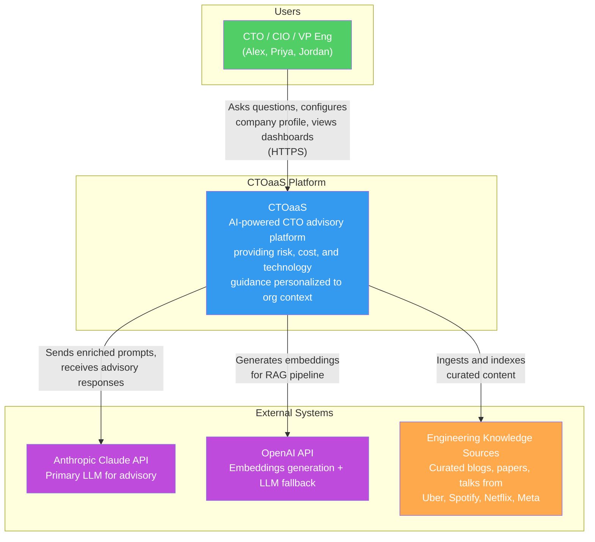
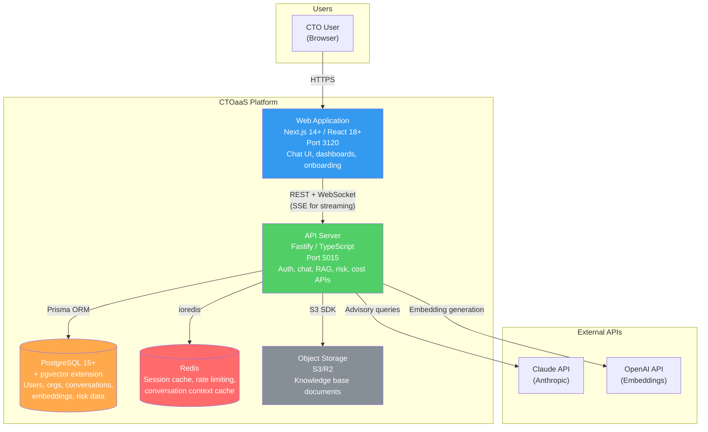
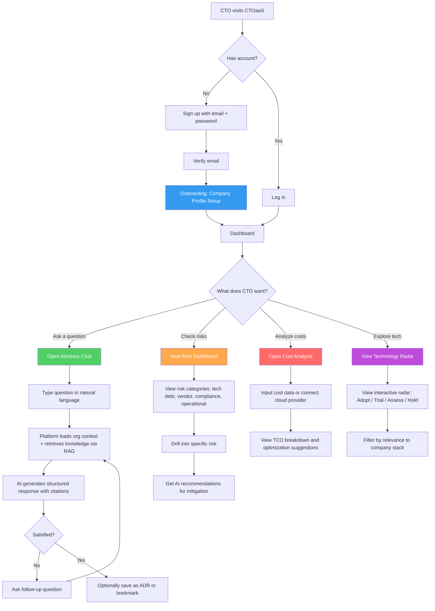
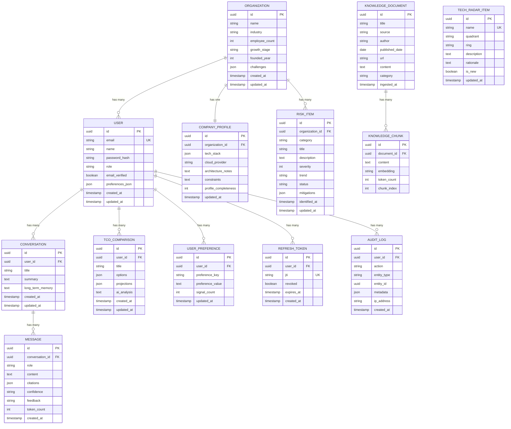
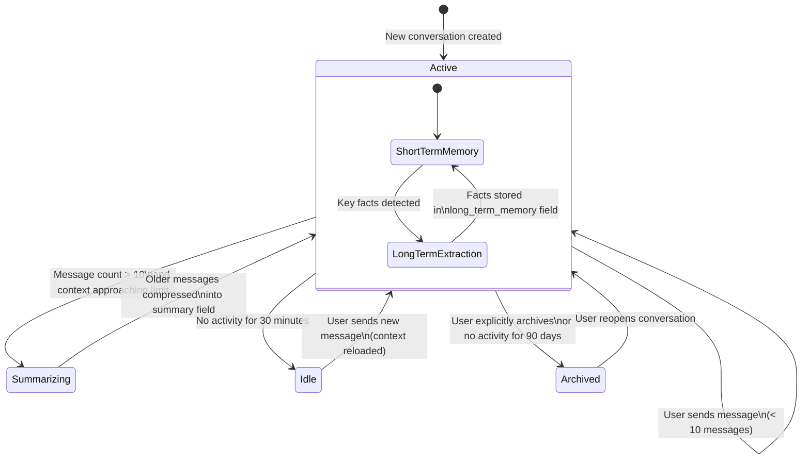
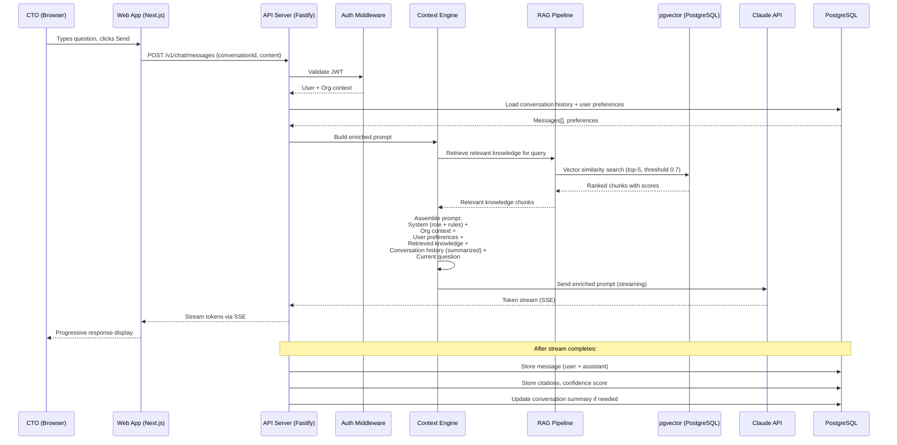
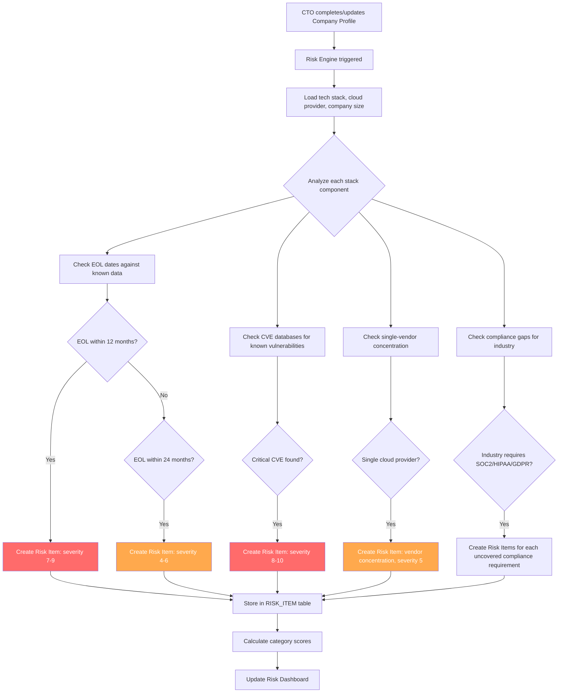

# Feature Specification: CTOaaS Foundation (Phase 1 MVP)

**Product**: CTOaaS (CTO as a Service)
**Feature Branch**: `foundation/ctoaas`
**Created**: 2026-03-11
**Status**: Draft
**Spec ID**: SPEC-01
**Input**: CEO Brief — AI-powered advisory platform for CTOs and CIOs with risk awareness, cost awareness, tech stack awareness, personalization, RAG + memory, chat interface, and modeling capabilities.

---

## Business Context

### Problem Statement

**Who experiences the problem**: CTOs, CIOs, VPs of Engineering, and technical co-founders at companies with 50-2000 employees (Series A startups through mid-market enterprises).

**What the problem is**: Technology leaders make high-stakes decisions daily across domains they cannot all be expert in simultaneously -- cloud cost optimization, vendor selection, compliance readiness, team topology, architecture migration, and technical debt prioritization. Today they rely on expensive consulting firms ($300-500/hr with 2-4 week engagement cycles), inconsistent peer networks, or their own judgment without structured frameworks. Research for a single major decision takes 4-8 hours. Past decisions are documented in scattered notes with no systematic follow-up or organizational learning.

**Cost of inaction**: A bad cloud architecture choice costs 6-12 months and $500K+ to reverse. A missed compliance gap delays enterprise deals by quarters. Unmanaged technical debt slows engineering velocity by 20-40% annually. CTOs without structured decision support make costlier mistakes, experience higher burnout, and deliver less strategic value.

**Quantified opportunity**: If CTOaaS prevents one major technology decision mistake per year per customer, the ROI at a $500/month subscription is 10-100x (compared to $50K-$500K cost of reversing bad decisions). The addressable market exceeds 350,000 technology leaders globally across primary segments.

### Target Users

| Persona | Role | Pain Point | Expected Outcome |
|---------|------|-----------|-----------------|
| **Alex** (Startup CTO) | CTO at Series A-C company (50-200 employees) | Making first-time architecture, compliance, and hiring decisions without senior peers; 4-8 hours of manual research per major decision | Structured, context-aware advisory in minutes; decisions grounded in best practices from elite engineering organizations |
| **Priya** (Mid-Market VP Eng) | VP of Engineering at company with 200-2000 employees | Overwhelmed managing multiple teams, budgets, and technology strategy simultaneously; ad-hoc cost and risk analysis | Dashboard-driven risk monitoring, automated cost analysis, and scenario modeling to support board-level reporting |
| **Jordan** (Technical Co-Founder) | Technical co-founder wearing multiple hats | Needs quick, reliable guidance on build-vs-buy, stack selection, and infrastructure decisions without the budget for consultants | Fast, affordable advisory ($300-500/month vs. $10K-50K consulting engagements) accessible via conversational interface |

### Business Value

- **Revenue Impact**: Target $30K MRR within 6 months, $200K MRR within 12 months. Subscription tiers from $300/month (startup) to $2000/month (enterprise). Even 500 users at $300/month average yields $150K MRR.
- **User Retention**: Personalization deepens over time (decision history, organizational context, preference learning), creating a switching cost that reduces churn. Target less than 8% monthly churn at 6 months, less than 5% at 12 months.
- **Competitive Position**: No current product combines AI advisory + CTO domain expertise + organizational personalization + scenario modeling at an accessible price point. CTOaaS occupies the intersection of consulting (expensive, slow) and generic AI (cheap, uncontextualized).
- **Strategic Alignment**: First ConnectSW product targeting the technology leadership segment. Phase 1 validates the core advisory model; Phase 2 introduces a custom NanoChat model trained via AutoResearch for domain-specific performance.

### Business Need Traceability

| Business Need (from BA Report) | User Stories | Priority |
|-------------------------------|-------------|----------|
| BN-001: AI advisory chat | US-01, US-02 | P0 |
| BN-002: RAG knowledge retrieval | US-03, US-04 | P0 |
| BN-003: Organizational personalization | US-05, US-06 | P0 |
| BN-017: Conversation memory | US-07 | P0 |
| BN-018: Auth and data isolation | US-08, US-09 | P0 |
| BN-004: Technology risk surfacing | US-10, US-11 | P1 |
| BN-005: Cost analysis | US-12, US-13 | P1 |
| BN-008: Technology radar | US-14 | P1 |
| BN-006: Tech stack awareness | (deferred to enrichment within US-05, US-10) | P1 |

---

## System Context (C4 Level 1)

## Container Diagram (C4 Level 2)

## User Journey Flowchart

---

## User Scenarios & Testing

### US-01 - Advisory Chat: Ask a Technology Question (Priority: P0)

**As a** CTO (Alex), **I want to** ask technology questions in natural language and receive structured, actionable advice, **so that** I can make informed decisions in minutes instead of hours of manual research.

The CTO opens the chat interface from the dashboard. They type a question such as "Should we migrate from MongoDB to PostgreSQL for our growing SaaS product?" The platform loads their organizational context (company size, current stack, industry), retrieves relevant knowledge from curated sources (e.g., how Uber handled database migrations), and generates a structured response with trade-offs, a recommended approach, estimated effort, risks, and source citations. The response streams in real-time. The CTO can see confidence indicators and click on citations to view the source material.

**Why this priority**: This is the core value proposition. Every other feature builds on the conversational AI engine. Without a high-quality chat experience, the product has no foundation.

**Independent Test**: Send 10 representative CTO questions through the chat interface and verify each receives a structured response with at least 2 citations, a confidence indicator, and actionable recommendations within 15 seconds.

**Acceptance Criteria**:

1. **Given** a logged-in CTO with a configured company profile, **When** they type a technology question and press Enter (or click Send), **Then** the system returns a structured response within 15 seconds that includes: (a) a direct answer, (b) supporting reasoning with trade-offs, (c) at least 1 source citation from the knowledge base, and (d) a confidence indicator (high/medium/low).
2. **Given** a logged-in CTO, **When** the AI generates a response, **Then** the response streams token-by-token to the UI (server-sent events) so the CTO sees progressive output rather than waiting for the full response.
3. **Given** a question that falls outside the platform's knowledge domain (e.g., "What is the weather today?"), **When** the CTO submits it, **Then** the system responds with a polite redirect explaining it specializes in technology leadership topics and suggests rephrasing.
4. **Given** a CTO on a free tier, **When** they have sent 20 messages in the current day, **Then** the system displays a message indicating the daily limit has been reached and prompts upgrade to a paid plan.

---

### US-02 - Advisory Chat: Follow-Up and Refinement (Priority: P0)

**As a** CTO (Alex), **I want to** ask follow-up questions that refine or drill deeper into a previous recommendation, **so that** I can explore specific aspects of a decision without re-explaining my situation.

After receiving an initial response about database migration, the CTO asks "What would the migration timeline look like for a team of 5 engineers?" The platform uses the existing conversation context (the original question, company profile, previous response) to generate a refined answer that builds on the prior exchange without requiring the CTO to repeat background information.

**Why this priority**: Conversations are multi-turn by nature. A single-shot Q&A is far less valuable than a conversation that deepens understanding progressively.

**Independent Test**: Start a conversation with a technology question, then ask 3 follow-up questions. Verify each follow-up response references or builds upon prior context without the user re-explaining.

**Acceptance Criteria**:

1. **Given** an ongoing chat conversation with at least 1 prior exchange, **When** the CTO asks a follow-up question, **Then** the response references context from prior messages in the same conversation (verified by the response containing information from the initial question without re-prompting).
2. **Given** a conversation with 10+ messages, **When** the CTO asks a follow-up, **Then** the system uses conversation summarization to stay within LLM context limits while preserving key context (response quality does not degrade noticeably after 10 messages).
3. **Given** a CTO in an active conversation, **When** they click "New Conversation," **Then** a new conversation starts with a clean context (no bleed from the previous conversation) while the previous conversation is preserved in history.

---

### US-03 - RAG-Powered Knowledge Retrieval (Priority: P0)

**As a** CTO (Priya), **I want to** receive answers grounded in best practices from top engineering organizations (Uber, Spotify, Netflix, Meta), **so that** I can trust the recommendations are based on proven approaches rather than generic AI hallucination.

When the CTO asks about microservices architecture, the RAG pipeline retrieves relevant chunks from curated content -- for example, Netflix's approach to service mesh, Uber's domain-oriented microservice architecture, and Spotify's squad model for team organization. These are injected into the LLM prompt as grounding context, and the response explicitly references these sources.

**Why this priority**: RAG over curated knowledge is the primary differentiator versus generic ChatGPT/Claude usage. Without it, CTOaaS provides no unique value.

**Independent Test**: Query the knowledge base with 5 known topics (e.g., "microservices at scale," "database sharding strategies," "CI/CD best practices") and verify each returns at least 3 relevant chunks with similarity scores above 0.7.

**Acceptance Criteria**:

1. **Given** a CTO question related to a topic covered in the knowledge base, **When** the RAG pipeline processes the query, **Then** it retrieves the top-5 most relevant knowledge chunks with vector similarity scores above 0.7, and at least 1 chunk is included in the LLM prompt context.
2. **Given** a curated knowledge base with at least 50 indexed documents, **When** a vector similarity search executes, **Then** the search completes in less than 500ms for a database with up to 100,000 embedding vectors.
3. **Given** a newly ingested knowledge document, **When** it is processed by the embedding pipeline, **Then** it is chunked (target 500-1000 tokens per chunk), embedded, and stored in pgvector within 60 seconds, and is retrievable in subsequent queries.

---

### US-04 - Source Citations in Responses (Priority: P0)

**As a** CTO (Priya), **I want to** see source citations for every recommendation the platform makes, **so that** I can verify the basis of the advice and build trust in the AI's output.

Each advisory response includes numbered citations linking back to the source material (e.g., "[1] Netflix Engineering Blog: Embracing the Differences, 2024"). The CTO can click a citation to expand a preview of the source content. Citations appear inline in the response text and are also collected in a "Sources" section at the bottom.

**Why this priority**: Trust is the critical barrier for AI advisory in high-stakes domains. Citations are the mechanism by which CTOs verify and trust recommendations. Per business rule BR-002, all responses require confidence indicators and source citations.

**Independent Test**: Generate 5 advisory responses and verify each contains at least 1 citation with a clickable source reference that displays the original content.

**Acceptance Criteria**:

1. **Given** an advisory response that used RAG-retrieved knowledge, **When** the response is displayed, **Then** each claim derived from the knowledge base includes an inline citation number (e.g., [1], [2]) and a "Sources" section at the bottom listing each source with title, author, date, and a link/preview.
2. **Given** a citation in a response, **When** the CTO clicks it, **Then** a panel or modal displays the relevant excerpt from the source document (the chunk that was retrieved).
3. **Given** a response where the AI generates advice not grounded in the knowledge base, **When** displayed, **Then** the response explicitly marks such sections as "Based on general AI knowledge" (not cited) so the CTO can distinguish grounded from ungrounded advice.

---

### US-05 - Company Profile Onboarding (Priority: P0)

**As a** CTO (Jordan), **I want to** configure my company profile including industry, company size, tech stack, growth stage, and key challenges, **so that** all advisory responses are tailored to my specific organizational context.

During onboarding (and editable later from settings), the CTO completes a multi-step form: (1) Company basics -- name, industry, employee count, founding year, growth stage. (2) Technology stack -- programming languages, frameworks, databases, cloud provider, CI/CD tools (with auto-suggest from a known technology list). (3) Key challenges -- select from common CTO challenges (scaling, compliance, cost optimization, hiring, technical debt, architecture migration) and optionally describe in free text. (4) Preferences -- communication style (concise vs. detailed), risk tolerance (conservative vs. aggressive), decision framework preference.

**Why this priority**: Personalization is what separates CTOaaS from generic ChatGPT usage. Without organizational context, responses are generic and low-value. Per BN-003, this is a P0 business need.

**Independent Test**: Complete onboarding for 3 different company profiles (startup, mid-market, enterprise). Then ask the same question from each profile and verify the responses differ based on organizational context.

**Acceptance Criteria**:

1. **Given** a newly registered CTO, **When** they complete onboarding, **Then** the system stores their company profile with all required fields: company name, industry (from a predefined list of 20+ industries), employee count, growth stage (seed/Series A/B/C/growth/enterprise), primary tech stack components, and at least 1 key challenge.
2. **Given** a CTO with a completed profile, **When** they ask an advisory question, **Then** the system prompt includes their organizational context (verified by the response referencing company-specific factors such as their stack, team size, or industry).
3. **Given** a CTO on the onboarding flow, **When** they skip optional fields and submit, **Then** the system accepts the profile with required fields only and shows a "profile completeness" indicator encouraging them to fill in more later.
4. **Given** a CTO with an existing profile, **When** they navigate to Settings and edit their tech stack, **Then** the updated stack is reflected in subsequent advisory responses within the same session.

---

### US-06 - Preference Learning Over Time (Priority: P0)

**As a** CTO (Alex), **I want to** the platform to learn my preferences and past decisions over time, **so that** recommendations become more relevant and aligned with my decision-making style as I use the platform.

As the CTO interacts with the platform, the system tracks: which recommendations they marked as "helpful" or "not helpful," which topics they ask about most frequently, their preferred level of detail, and any decisions they recorded. Over time, the system builds a preference profile that influences how responses are structured and what context is emphasized.

**Why this priority**: This creates the personalization moat described in the business analysis. The longer a CTO uses the platform, the more valuable it becomes, reducing churn and increasing lifetime value.

**Independent Test**: Interact with the platform for 20+ messages, rate 5 responses as "helpful" and 2 as "not helpful." Verify the user's preference profile is updated and subsequent responses reflect the learned preferences.

**Acceptance Criteria**:

1. **Given** a CTO viewing an advisory response, **When** they click a "thumbs up" or "thumbs down" button, **Then** the feedback is stored linked to the message, the response's RAG sources, and the conversation topic. The UI confirms the feedback was recorded.
2. **Given** a CTO with 10+ feedback signals, **When** the system generates a new response, **Then** the system prompt includes a summary of learned preferences (e.g., "User prefers concise answers with code examples" or "User values cost analysis over speed").
3. **Given** a CTO's preference data, **When** the same user asks a question in a later session, **Then** the system applies learned preferences to tailor the response. **[RESOLVED]**: MVP is single-user per organization. Team member access and organizational preference sharing are deferred to Phase 2. The data model should use a user-level preference table with an `organization_id` foreign key to enable future org-level sharing without schema migration. **Risk-if-wrong**: If early adopters need team access in MVP, we would need to expedite Phase 2 team features, estimated at 2-3 additional sprints.

---

### US-07 - Conversation Memory Across Sessions (Priority: P0)

**As a** CTO (Jordan), **I want to** my conversation context preserved across sessions, **so that** I do not have to re-explain my situation each time I return to the platform.

The CTO closes their browser and returns the next day. They see their conversation history in a sidebar. They can continue any previous conversation, and the platform recalls the full context (what was discussed, what decisions were considered, what the CTO's concerns were). The platform also maintains a long-term memory summary that captures key facts about the CTO's situation across all conversations.

**Why this priority**: Per BN-017, conversation memory is a P0 business need. Without it, the platform resets every session, which is unacceptable for a tool that promises personalization and continuity.

**Independent Test**: Start a conversation, discuss a topic in depth (5+ messages), close the browser, reopen, and continue the conversation. Verify the platform recalls prior context without the user re-explaining.

**Acceptance Criteria**:

1. **Given** a CTO with previous conversations, **When** they log in, **Then** the sidebar displays a list of past conversations ordered by most recent, each with a title (auto-generated from the first message or topic) and timestamp.
2. **Given** a CTO who selects a previous conversation, **When** the conversation loads, **Then** all prior messages (user and AI) are displayed, and the CTO can continue the conversation with full context retained.
3. **Given** a conversation with 50+ messages, **When** the CTO continues it, **Then** the system uses a hierarchical memory approach: recent messages (last 10) are included verbatim, older messages are summarized, and key facts are extracted into a long-term memory store. The response quality remains consistent regardless of conversation length.
4. **Given** a CTO with 20+ conversations, **When** they search conversation history, **Then** the system returns conversations matching the search query (full-text search on message content) within 2 seconds.

---

### US-08 - Secure Account Registration (Priority: P0)

**As a** CTO (Alex), **I want to** sign up and manage my account securely with email/password authentication, **so that** I can control access to my sensitive organizational data.

The CTO visits the landing page and clicks "Sign Up." They enter their email, create a password (minimum 8 characters, must include uppercase, lowercase, number, and special character), and confirm their email via a verification link. After verification, they are redirected to onboarding. Existing users log in with email/password and receive JWT access tokens with refresh token rotation.

**Why this priority**: Authentication is a foundational requirement. No other feature can function without secure user identity. Per BN-018, this is P0.

**Independent Test**: Register a new account, verify email, log in, verify JWT is issued, refresh the token, log out, and confirm the refresh token is revoked.

**Acceptance Criteria**:

1. **Given** a visitor on the signup page, **When** they submit a valid email and password (8+ characters, 1 uppercase, 1 lowercase, 1 number, 1 special character), **Then** the system creates an unverified account, sends a verification email with a token (valid for 24 hours), and displays a "Check your email" message.
2. **Given** a user who clicks the verification link, **When** the token is valid, **Then** the account is marked as verified and the user is redirected to the onboarding flow. **When** the token is expired or invalid, **Then** the system displays an error with an option to resend verification.
3. **Given** a verified user on the login page, **When** they submit correct credentials, **Then** the system returns a JWT access token (15-minute expiry, stored in memory, never localStorage) and an httpOnly refresh token cookie (7-day expiry). After 5 failed login attempts within 15 minutes, the account is temporarily locked for 30 minutes.
4. **Given** a logged-in user, **When** they click "Log out," **Then** the refresh token is revoked (JTI blacklisted), the access token is cleared from memory, and the user is redirected to the login page.

---

### US-09 - Multi-Tenant Data Isolation (Priority: P0)

**As a** CTO (Priya), **I want to** my organizational data isolated from other users' data and encrypted, **so that** I can trust the platform with sensitive company information.

Each CTO's data (company profile, conversations, preferences, risk assessments, cost data) is stored in a logically isolated manner using organization-scoped queries. All data is encrypted at rest (AES-256) via PostgreSQL's native encryption or application-level encryption for sensitive fields. Data in transit is protected by TLS 1.2+. No customer organizational data is sent to LLM provider training pipelines (per BR-005).

**Why this priority**: CTO data is highly sensitive (tech stacks, cost data, risk assessments, strategic decisions). A data leak would be catastrophic for trust and could expose competitive intelligence. Per BR-001 and BN-018.

**Independent Test**: Create 2 separate user accounts with different organizations. Verify that API endpoints for one organization return zero results from the other organization's data. Verify encryption at rest is configured.

**Acceptance Criteria**:

1. **Given** two CTOs from different organizations, **When** CTO-A queries their conversations, company profile, or risk data, **Then** the API returns only data belonging to CTO-A's organization. No query path exists that returns another organization's data (enforced at the Prisma query layer with mandatory organization ID filtering).
2. **Given** sensitive fields (company financials, cloud spend data, API keys), **When** stored in the database, **Then** they are encrypted at the application level using AES-256-GCM before storage. Non-sensitive fields rely on PostgreSQL's disk-level encryption.
3. **Given** any API request, **When** it is transmitted between client and server, **Then** TLS 1.2+ is enforced. HTTP requests are redirected to HTTPS in production.
4. **Given** a conversation sent to the Claude API for advisory generation, **When** the prompt is assembled, **Then** the system includes only the minimum necessary context (no raw financial data, no credentials, no PII beyond what is required for the query). A data sanitization step runs before any LLM API call.

---

### US-10 - Risk Dashboard Overview (Priority: P1)

**As a** VP of Engineering (Priya), **I want to** see a dashboard showing current technology risks across categories (tech debt, vendor, compliance, operational), **so that** I can prioritize mitigation efforts and report risk posture to leadership.

The risk dashboard displays a summary view with 4 risk categories, each showing a risk score (1-10), trend indicator (improving/stable/worsening), and count of identified risks. The CTO can click into any category to see individual risk items with severity, description, affected systems, and recommended mitigations. Risks are derived from the CTO's company profile (e.g., "Your primary database is MySQL 5.7 which reaches EOL in Q4 2025") and from advisory conversations where risks were identified.

**Why this priority**: Proactive risk surfacing differentiates CTOaaS from reactive Q&A tools. CTOs need to see their risk landscape at a glance, not just when they remember to ask. Per BN-004.

**Independent Test**: Configure a company profile with a tech stack containing 2 known-risky components (e.g., an EOL framework, a single-cloud dependency). Verify the risk dashboard populates with at least 2 risk items with appropriate severity scores.

**Acceptance Criteria**:

1. **Given** a CTO with a configured company profile, **When** they navigate to the Risk Dashboard, **Then** the dashboard displays 4 risk category cards (Technology Debt, Vendor Risk, Compliance Risk, Operational Risk), each with a numeric score (1-10), a color indicator (green 1-3, yellow 4-6, red 7-10), and a trend arrow.
2. **Given** a company profile listing "MySQL 5.7" as the primary database, **When** the risk engine evaluates the profile, **Then** it generates a risk item under Technology Debt: "MySQL 5.7 approaching end-of-life" with severity 7+, a description of the risk, and a recommended mitigation (upgrade path).
3. **Given** a risk item on the dashboard, **When** the CTO clicks it, **Then** a detail panel shows: risk title, severity score, category, affected systems, description, recommended mitigations (AI-generated), and an option to "Ask advisor about this risk" which opens a pre-populated chat.
4. **Given** a CTO who has not configured their company profile, **When** they navigate to the Risk Dashboard, **Then** the dashboard shows an empty state prompting them to complete their company profile before risk assessment can run.

---

### US-11 - AI-Powered Risk Recommendations (Priority: P1)

**As a** CTO (Alex), **I want to** receive AI-generated mitigation recommendations for each identified risk, **so that** I can act on risks rather than just knowing about them.

When viewing a risk item, the CTO can click "Get Recommendations." The system uses the risk context, the CTO's organization profile, and RAG-retrieved best practices to generate specific, actionable mitigation steps. Recommendations include estimated effort, priority, and potential impact.

**Why this priority**: Risk identification without actionable recommendations is only half the value. The AI-powered recommendations are what make the risk dashboard actionable and differentiate it from static checklists.

**Independent Test**: Select 3 risk items and generate recommendations for each. Verify each recommendation includes at least 2 specific actions with effort estimates.

**Acceptance Criteria**:

1. **Given** a risk item displayed on the dashboard, **When** the CTO clicks "Get Recommendations," **Then** the system generates 2-5 specific mitigation actions within 10 seconds, each with: action description, estimated effort (days/weeks), priority (high/medium/low), and expected impact on the risk score.
2. **Given** a risk recommendation, **When** the CTO clicks "Discuss with advisor," **Then** a new chat conversation opens pre-populated with the risk context and recommendation, allowing the CTO to ask follow-up questions.
3. **Given** a risk recommendation that the CTO marks as "Implemented," **When** the risk engine next evaluates, **Then** the risk score for that item is recalculated (reduced) and the trend indicator updates.

---

### US-12 - Cost Analysis: TCO Calculator (Priority: P1)

**As a** CTO (Jordan), **I want to** analyze total cost of ownership for build-vs-buy decisions, **so that** I can justify technology investments to my board with data.

The CTO navigates to the Cost Analysis section and selects "TCO Calculator." They input parameters for two or more options (e.g., build in-house vs. buy SaaS): development cost (team size x duration x loaded cost), infrastructure cost (servers, databases, storage), maintenance cost (ongoing engineering, support), opportunity cost, and hidden costs (training, migration, integration). The system generates a 3-year TCO comparison with visualizations.

**Why this priority**: Cost analysis is a direct ROI driver for CTOs. Build-vs-buy decisions are among the most common and consequential decisions CTOs face. Per BN-005.

**Independent Test**: Input parameters for a "build vs. buy" comparison with known values. Verify the TCO calculation produces a 3-year projection with correct arithmetic and a clear recommendation.

**Acceptance Criteria**:

1. **Given** a CTO on the Cost Analysis page, **When** they create a new TCO comparison with at least 2 options and fill in required fields (development cost, infrastructure cost, maintenance cost), **Then** the system calculates and displays a 3-year TCO projection for each option as both a table and a line chart.
2. **Given** a completed TCO comparison, **When** the CTO clicks "Get AI Analysis," **Then** the system generates a summary recommending the lower-TCO option with caveats, hidden costs to consider, and risks of each option, grounded in the CTO's organization context (team size, stage, constraints).
3. **Given** a TCO comparison, **When** the CTO adjusts a parameter (e.g., changes team size from 3 to 5), **Then** the projection recalculates in real-time (less than 1 second) and the chart updates.
4. **Given** a completed TCO comparison, **When** the CTO clicks "Export," **Then** the system generates a PDF or Markdown report suitable for board presentation.

---

### US-13 - Cost Analysis: Cloud Spend Optimization (Priority: P1)

**As a** VP of Engineering (Priya), **I want to** receive cloud cost optimization recommendations based on my current spend patterns, **so that** I can reduce infrastructure costs without impacting service quality.

The CTO inputs their monthly cloud spend breakdown by service category (compute, storage, database, networking, other) and cloud provider. Alternatively, they describe their infrastructure in the advisory chat. The system analyzes the spend profile against benchmarks for companies of similar size and industry, and generates optimization recommendations (e.g., "Your compute spend is 40% above benchmark; consider reserved instances or spot instances for batch workloads").

**Why this priority**: Cloud cost optimization is the most immediately quantifiable value CTOaaS delivers. CTOs can see ROI within the first month. Per BN-005.

**Independent Test**: Input cloud spend data for a mid-market company ($50K/month on AWS) and verify the system generates at least 3 optimization recommendations with estimated savings.

**Acceptance Criteria**:

1. **Given** a CTO on the Cost Analysis page, **When** they input monthly cloud spend by category (compute, storage, database, networking) and provider, **Then** the system displays the spend breakdown as a donut chart and a comparison against industry benchmarks for their company size.
2. **Given** a cloud spend profile, **When** the system analyzes it, **Then** it generates 3-5 optimization recommendations within 10 seconds, each with: recommendation description, estimated monthly savings (dollar range), implementation effort, and risk level.
3. **Given** optimization recommendations, **When** the CTO clicks "Discuss with advisor," **Then** a chat conversation opens pre-populated with the cost context, allowing deeper exploration of specific recommendations.
4. **Given** a CTO who has not input any cost data, **When** they navigate to Cloud Spend Optimization, **Then** the page shows an empty state with clear instructions on how to input spend data (manual CSV/JSON upload or form entry) and an option to "Describe your infrastructure in chat" as an alternative. **[RESOLVED]**: Phase 1 uses manual data import only (CSV upload, JSON upload, or form-based entry). Direct cloud provider API integration (AWS Cost Explorer, Azure Cost Management, GCP Billing) is deferred to Phase 2. The import interface should accept a standardized schema so that future API integrations can populate the same data model. **Risk-if-wrong**: Manual input adds friction and may reduce adoption of the cost analysis feature. If usage is too low, we may need to accelerate API integration to Phase 1.5.

---

### US-14 - Interactive Technology Radar (Priority: P1)

**As a** CTO (Alex), **I want to** view an interactive technology radar showing Adopt/Trial/Assess/Hold categories for technologies relevant to my stack, **so that** I can make informed decisions about technology investments and stay current with industry trends.

The Technology Radar displays technologies in a circular radar visualization with 4 rings (Adopt, Trial, Assess, Hold) and 4 quadrants (Languages & Frameworks, Platforms & Infrastructure, Tools, Techniques). Technologies relevant to the CTO's stack are highlighted. The CTO can click any technology to see a detail panel with: description, why it is in that ring, relevance to their organization, adoption trends, and an option to "Ask advisor about this technology."

**Why this priority**: The technology radar is a high-engagement feature that drives regular return visits (CTOs check it monthly) and creates shareable content. It is also a natural entry point to the advisory chat. Per BN-008.

**Independent Test**: Load the technology radar for a CTO with a Node.js/PostgreSQL/AWS stack. Verify at least 10 technologies are displayed, stack-relevant technologies are highlighted, and clicking a technology shows a detail panel.

**Acceptance Criteria**:

1. **Given** a CTO navigating to the Technology Radar page, **When** the radar loads, **Then** it displays an interactive circular visualization with 4 rings (Adopt, Trial, Assess, Hold) and 4 quadrants (Languages & Frameworks, Platforms & Infrastructure, Tools, Techniques), populated with at least 30 technologies from the curated knowledge base.
2. **Given** a CTO with a configured tech stack, **When** the radar renders, **Then** technologies that are part of or directly related to their stack are visually highlighted (e.g., different color, border, or badge) and the radar can be filtered to show "My Stack" only.
3. **Given** a technology on the radar, **When** the CTO clicks it, **Then** a detail panel displays: technology name, current ring position, quadrant, a 2-3 sentence description, the rationale for its ring position, relevance to the CTO's organization (personalized), and a "Discuss with advisor" button.
4. **Given** the technology radar, **When** the CTO hovers over a technology dot, **Then** a tooltip displays the technology name and ring. The radar supports zoom and pan for dense areas. On mobile viewports (less than 768px), the radar switches to a list view grouped by quadrant.

---

### Edge Cases

| # | Scenario | Expected Behavior | Priority |
|---|----------|------------------|----------|
| 1 | CTO sends a message containing only whitespace or empty string | System rejects with inline validation "Please enter a question" before sending to API. No API call is made. | P0 |
| 2 | Claude API returns a 429 (rate limit) or 500 (server error) during advisory response | System retries with exponential backoff (1s, 2s, 4s, max 3 retries). If all retries fail, displays "Our AI advisor is temporarily unavailable. Your question has been saved and will be answered when service resumes." Falls back to OpenAI API if configured. | P0 |
| 3 | CTO's conversation exceeds LLM context window (200K+ tokens accumulated) | System triggers conversation summarization: compresses older messages into a summary, retains last 10 messages verbatim, and continues the conversation seamlessly. User sees no interruption. | P0 |
| 4 | Two browser tabs open the same conversation simultaneously | Last-write-wins with timestamp ordering. Both tabs receive real-time updates via WebSocket/SSE. No data corruption. Messages are never duplicated. | P1 |
| 5 | CTO uploads a company profile with conflicting data (e.g., "2 employees" but "enterprise" growth stage) | System accepts the data but displays a soft warning: "Your company size and growth stage seem inconsistent. Would you like to review?" No hard block. | P1 |
| 6 | Knowledge base returns 0 results for a valid CTO question (topic not yet curated) | System generates a response using general AI knowledge, explicitly labels it as "Based on general AI knowledge (no curated sources matched)," and logs the query for knowledge base expansion review. | P0 |
| 7 | CTO attempts to access another organization's data via API manipulation (e.g., changing org ID in request) | API middleware validates organization ownership on every request. Returns 403 Forbidden. Logs the attempt as a security event. | P0 |
| 8 | Redis cache becomes unavailable | System degrades gracefully: skips caching layer, queries PostgreSQL directly. Rate limiting falls back to in-memory store. Logs a warning for operations. No user-facing error. | P1 |
| 9 | CTO pastes a very long message (10,000+ characters) | System accepts up to 10,000 characters. Beyond that limit, input is truncated with a warning: "Message truncated to 10,000 characters." The truncated message is still processed. | P1 |
| 10 | Concurrent onboarding: CTO starts onboarding, gets interrupted, returns hours later | Onboarding progress is persisted per step. When the CTO returns, they resume from where they left off. A "skip for now" option exists on every optional step. | P1 |

---

## Requirements

### Functional Requirements

- **FR-001**: System MUST accept natural language questions via a chat interface and return structured advisory responses with citations and confidence indicators. *Traces to: US-01, AC 1*
- **FR-002**: System MUST stream responses token-by-token using server-sent events (SSE). *Traces to: US-01, AC 2*
- **FR-003**: System MUST maintain conversation context across multiple messages within a session. *Traces to: US-02, AC 1*
- **FR-004**: System MUST implement conversation summarization when message count exceeds context window limits. *Traces to: US-02, AC 2; US-07, AC 3*
- **FR-005**: System MUST retrieve relevant knowledge chunks via vector similarity search (pgvector) with a minimum similarity threshold of 0.7. *Traces to: US-03, AC 1*
- **FR-006**: System MUST display inline source citations in advisory responses with expandable source previews. *Traces to: US-04, AC 1, AC 2*
- **FR-007**: System MUST distinguish between RAG-grounded and general AI knowledge in responses. *Traces to: US-04, AC 3*
- **FR-008**: System MUST collect and store company profile data during onboarding (industry, size, stack, stage, challenges). *Traces to: US-05, AC 1*
- **FR-009**: System MUST inject organizational context into LLM prompts for personalized responses. *Traces to: US-05, AC 2*
- **FR-010**: System MUST collect user feedback (thumbs up/down) on responses and build preference profiles. *Traces to: US-06, AC 1, AC 2*
- **FR-011**: System MUST persist conversations across sessions with full message history. *Traces to: US-07, AC 1, AC 2*
- **FR-012**: System MUST implement hierarchical memory (verbatim recent + summarized older + long-term facts). *Traces to: US-07, AC 3*
- **FR-013**: System MUST support full-text search across conversation history. *Traces to: US-07, AC 4*
- **FR-014**: System MUST implement email/password authentication with email verification. *Traces to: US-08, AC 1, AC 2*
- **FR-015**: System MUST implement JWT access tokens (15-min expiry) with httpOnly refresh token rotation (7-day expiry). *Traces to: US-08, AC 3*
- **FR-016**: System MUST enforce account lockout after 5 failed login attempts within 15 minutes. *Traces to: US-08, AC 3*
- **FR-017**: System MUST isolate all data queries by organization ID. *Traces to: US-09, AC 1*
- **FR-018**: System MUST encrypt sensitive fields at application level using AES-256-GCM. *Traces to: US-09, AC 2*
- **FR-019**: System MUST sanitize data before sending to LLM APIs (no raw financials, credentials, or unnecessary PII). *Traces to: US-09, AC 4*
- **FR-020**: System MUST display a risk dashboard with 4 categories, scores, trends, and drill-down. *Traces to: US-10, AC 1, AC 3*
- **FR-021**: System MUST auto-generate risk items from company profile analysis. *Traces to: US-10, AC 2*
- **FR-022**: System MUST generate AI-powered risk mitigation recommendations. *Traces to: US-11, AC 1*
- **FR-023**: System MUST calculate and display 3-year TCO projections for build-vs-buy comparisons. *Traces to: US-12, AC 1*
- **FR-024**: System MUST generate AI analysis of TCO comparisons grounded in organizational context. *Traces to: US-12, AC 2*
- **FR-025**: System MUST display an interactive technology radar with 4 rings and 4 quadrants. *Traces to: US-14, AC 1*
- **FR-026**: System MUST personalize radar highlights based on the CTO's configured tech stack. *Traces to: US-14, AC 2*
- **FR-027**: System MUST display cloud spend breakdown with benchmark comparisons and optimization recommendations. *Traces to: US-13, AC 1, AC 2*
- **FR-028**: System MUST enforce daily message limits for free-tier users (20 messages/day). *Traces to: US-01, AC 4*
- **FR-029**: All advisory responses MUST include a disclaimer that recommendations are AI-generated and not professional advice. *Traces to: BR-007*

### Non-Functional Requirements

- **NFR-001**: Performance -- Advisory chat responses MUST begin streaming within 3 seconds of submission. Full response MUST complete within 15 seconds for 95th percentile queries. Dashboard pages MUST load within 2 seconds.
- **NFR-002**: Security -- All data encrypted at rest (AES-256) and in transit (TLS 1.2+). JWT tokens stored in memory only (never localStorage). Refresh tokens in httpOnly cookies. OWASP Top 10 mitigations implemented. Rate limiting on all API endpoints (100 requests/minute per user for general endpoints, 20 requests/minute for LLM-powered endpoints).
- **NFR-003**: Accessibility -- WCAG 2.1 AA compliance. All interactive elements keyboard-navigable. Chat interface works with screen readers. Color contrast ratios meet AA standards (4.5:1 for normal text).
- **NFR-004**: Scalability -- System MUST support 1,000 concurrent users with less than 5% performance degradation. pgvector MUST handle 100,000 embeddings with less than 500ms query latency. Database connection pooling configured for 50 concurrent connections.
- **NFR-005**: Reliability -- 99.5% uptime target for the web application and API. Graceful degradation when external services (Claude API, Redis) are unavailable. No data loss on system restart.
- **NFR-006**: LLM Cost Efficiency -- Average LLM API cost per user interaction MUST not exceed $0.05. Token budgeting enforced per user tier. Common query patterns cached to reduce redundant API calls.

### Key Entities

| Entity | Description | Key Attributes | Relationships |
|--------|-------------|---------------|---------------|
| User | A registered technology leader | id, email, name, role, password_hash, verified, preferences_json | belongs to Organization, has many Conversations |
| Organization | A company/team the CTO leads | id, name, industry, employee_count, growth_stage, founded_year, challenges | has many Users, has one CompanyProfile |
| CompanyProfile | Detailed org context for personalization | id, org_id, tech_stack_json, cloud_provider, architecture_notes, constraints | belongs to Organization |
| Conversation | A chat session between CTO and AI | id, user_id, title, summary, created_at, updated_at | belongs to User, has many Messages |
| Message | A single message in a conversation | id, conversation_id, role (user/assistant), content, citations_json, confidence, feedback | belongs to Conversation |
| KnowledgeDocument | A curated source document | id, title, source, author, date, url, content, category | has many KnowledgeChunk |
| KnowledgeChunk | An embedded chunk for RAG retrieval | id, document_id, content, embedding (vector), token_count | belongs to KnowledgeDocument |
| RiskItem | An identified technology risk | id, org_id, category, title, description, severity, trend, status, mitigations_json | belongs to Organization |
| TcoComparison | A build-vs-buy cost comparison | id, user_id, title, options_json, projections_json | belongs to User |
| TechRadarItem | A technology on the radar | id, name, quadrant, ring, description, rationale | standalone reference data |
| UserPreference | Learned user preferences | id, user_id, preference_key, preference_value, signal_count | belongs to User |

### Data Model

### Conversation Memory State Diagram

---

## Component Reuse Check

Before planning, checked `.claude/COMPONENT-REGISTRY.md`:

| Need | Existing Component | Source Package | Reuse? |
|------|-------------------|---------------|--------|
| Authentication (signup, login, JWT, refresh tokens) | `@connectsw/auth` (backend + frontend) | `packages/auth/` | **Yes** -- Full reuse. Auth plugin, routes, hooks, token manager, Prisma schema partials. |
| Structured logging with PII redaction | `@connectsw/shared/utils/logger` | `packages/shared/` | **Yes** -- Direct import. |
| Password hashing and crypto utilities | `@connectsw/shared/utils/crypto` | `packages/shared/` | **Yes** -- Direct import. |
| Prisma plugin (connection lifecycle, pool sizing) | `@connectsw/shared/plugins/prisma` | `packages/shared/` | **Yes** -- Direct import. |
| Redis plugin (connection, TLS, graceful degradation) | `@connectsw/shared/plugins/redis` | `packages/shared/` | **Yes** -- Direct import. |
| UI components (Button, Card, Input, Badge, StatCard, DataTable) | `@connectsw/ui/components` | `packages/ui/` | **Yes** -- Direct import for dashboard, forms, risk cards. |
| Dashboard layout (sidebar, header, mobile responsive) | `@connectsw/ui/layout` (DashboardLayout, Sidebar) | `packages/ui/` | **Yes** -- Direct import. |
| Dark mode toggle and theme hook | `@connectsw/ui/hooks` (useTheme) | `packages/ui/` | **Yes** -- Direct import. |
| Error boundary | `@connectsw/ui/components` (ErrorBoundary) | `packages/ui/` | **Yes** -- Direct import. |
| Chat interface (streaming, message display) | None found | N/A | **No** -- Build new. Chat with SSE streaming, citation display, and feedback buttons is domain-specific. |
| RAG pipeline (embeddings, vector search, reranking) | None found | N/A | **No** -- Build new. pgvector integration, chunking, embedding generation are new capabilities. |
| Technology radar visualization | None found | N/A | **No** -- Build new. Interactive circular radar chart is a custom visualization. |
| TCO calculator with projections | None found | N/A | **No** -- Build new. Domain-specific calculation engine. |
| Risk assessment engine | None found | N/A | **No** -- Build new. Risk scoring from profile analysis is domain-specific. |
| Knowledge base ingestion pipeline | None found | N/A | **No** -- Build new. Document chunking, embedding, and storage pipeline. |

**Summary**: 9 components reused from shared packages, 6 new components to build.

---

## Site Map

| Route | Status | Description |
|-------|--------|-------------|
| `/` | MVP | Landing page with product overview and CTA to sign up |
| `/signup` | MVP | Registration form (email + password) |
| `/login` | MVP | Login form with email/password |
| `/verify-email` | MVP | Email verification handler |
| `/onboarding` | MVP | Multi-step company profile setup |
| `/dashboard` | MVP | Main dashboard with summary cards (recent conversations, risk overview, quick actions) |
| `/chat` | MVP | Advisory chat interface with conversation list sidebar |
| `/chat/:conversationId` | MVP | Specific conversation view |
| `/risks` | MVP | Risk dashboard with 4 category cards and drill-down |
| `/risks/:category` | MVP | Risk category detail with individual risk items |
| `/costs` | MVP | Cost analysis hub (TCO calculator + cloud spend) |
| `/costs/tco` | MVP | TCO comparison calculator |
| `/costs/tco/:comparisonId` | MVP | Specific TCO comparison detail |
| `/costs/cloud-spend` | MVP | Cloud spend analysis and optimization |
| `/radar` | MVP | Interactive technology radar |
| `/settings` | MVP | User settings (profile, preferences) |
| `/settings/profile` | MVP | Edit company profile (same as onboarding but editable) |
| `/settings/account` | MVP | Account settings (password, email, delete account) |
| `/settings/preferences` | MVP | Advisory preferences (detail level, risk tolerance, style) |
| `/help` | Deferred | Help and FAQ page (page skeleton with empty state) |
| `/integrations` | Deferred | Third-party integrations setup (page skeleton with empty state) |
| `/reports` | Deferred | Executive report generation (page skeleton with empty state) |
| `/team` | Deferred | Team management for multi-user organizations (page skeleton with empty state) |
| `/compliance` | Deferred | Compliance checker (page skeleton with empty state) |
| `/adrs` | Deferred | Architecture Decision Records management (page skeleton with empty state) |

---

## Success Criteria

### Measurable Outcomes

| # | Metric | Target | Measurement Method |
|---|--------|--------|-------------------|
| SC-001 | Advisory response latency (streaming start) | Less than 3 seconds (p95) | Server-side timing logs on chat endpoint |
| SC-002 | RAG retrieval relevance | 80%+ of retrieved chunks rated as relevant by human evaluator (sample of 50 queries) | Monthly human evaluation of top-5 retrieved chunks |
| SC-003 | Chat sessions per active user per week | 3+ sessions/week average | Analytics: count distinct session starts per user per week |
| SC-004 | Onboarding completion rate | 70%+ of registered users complete onboarding | Funnel analysis: signup to onboarding completion |
| SC-005 | Response citation rate | 90%+ of advisory responses include at least 1 source citation | Automated check: count responses with non-empty citations field |
| SC-006 | Risk dashboard population | 80%+ of users with completed profiles see at least 1 risk item | Automated check: users with profiles vs. users with risk items |
| SC-007 | Monthly active users (MAU) at 3 months post-launch | 50+ MAU | Unique users with 1+ chat sessions per month |
| SC-008 | Zero security incidents | 0 data breaches or unauthorized access events | Security monitoring, incident log |

---

## Out of Scope

- **SSO/SAML/SCIM authentication** -- Deferred to Phase 1.5. Enterprise customers requiring SSO will be managed with a documented roadmap. (Per RSK-005 in BA report.)
- **Direct cloud provider API integration** (AWS Cost Explorer, GCP Billing, Azure Cost Management) -- Phase 1 uses manual cost input. API integration planned for Phase 1.5.
- **Custom NanoChat model** -- Phase 2. Phase 1 uses Claude API (primary) and OpenAI API (fallback/embeddings).
- **Engineering metrics (DORA/SPACE)** -- Phase 2-3. Requires CI/CD integration.
- **Team topology advisor** -- Phase 3. Requires significant domain modeling.
- **Incident post-mortem analyzer** -- Phase 3.
- **Vendor evaluation framework** -- Phase 2. Manual vendor comparison can be done via advisory chat in Phase 1.
- **Technical debt tracker** -- Phase 2.
- **Board/executive report generator** -- Phase 2. CTOs can use the advisory chat to draft report sections in Phase 1.
- **ADR management** -- Phase 2. The infrastructure for storing decision records is partially built (conversations are stored), but structured ADR creation is deferred.
- **Compliance checking (SOC2/ISO27001/GDPR)** -- Phase 2.
- **Mobile application** -- No mobile app planned for Phase 1. Web app is responsive.
- **On-premise/VPC deployment** -- Enterprise deployment option deferred to post-Phase 2.
- **Multi-language support** -- English only for Phase 1.
- **Real-time collaboration** -- Single-user conversations only in Phase 1. No shared conversations or team chat.

---

## Open Questions

| # | Question | Resolution | Risk-if-Wrong | Owner | Status |
|---|----------|-----------|---------------|-------|--------|
| 1 | Should organizational preferences be shared across team members within the same org, or is MVP strictly single-user per organization? | **MVP is single-user per organization.** One account per org. Data model uses user-level preferences with `organization_id` FK to enable future team sharing without migration. Team access (invite members, role-based permissions, shared vs. private preferences) deferred to Phase 2. | If early adopters require multi-user team access at launch, Phase 2 team features would need to be accelerated (2-3 sprints). Mitigation: the FK-ready schema ensures no data model rework. | Product Manager | **Resolved** |
| 2 | Should Phase 1 include direct cloud provider API integration for cost analysis, or is manual input sufficient for MVP? | **Manual input only for Phase 1.** Support CSV upload, JSON upload, and form-based entry using a standardized cost schema. Direct API integration (AWS Cost Explorer, Azure Cost Management, GCP Billing) deferred to Phase 2. The standardized schema ensures API-imported data and manual data use the same tables. | Manual input adds friction; cost analysis feature adoption may be lower than projected. If adoption is critically low (<10% of users), accelerate API integration to Phase 1.5. Mitigation: "Describe your infrastructure in chat" provides a low-friction alternative. | Product Manager | **Resolved** |
| 3 | What is the knowledge base content strategy for launch? | **Curated public content from top engineering organizations.** Launch with minimum 50 curated topics sourced from public engineering blogs and whitepapers: Uber Engineering, Spotify Engineering, Netflix Tech Blog, Meta Engineering, Google Research, and equivalent. Content covers: cloud architecture, scaling patterns, team topology, compliance frameworks (SOC2, HIPAA, GDPR), cost optimization, and technical debt management. No proprietary data. AI-ML Engineer to build an ingestion pipeline that processes markdown/HTML into vector embeddings. | If 50 topics is insufficient for quality RAG responses across all advisory domains, users may get generic answers. Mitigation: prioritize depth in top 5 domains (cloud, compliance, architecture, cost, team) over breadth. Monitor RAG confidence scores post-launch and add content where scores are low. | Product Manager / AI-ML Engineer | **Resolved** |
| 4 | What is the pricing model for MVP launch? | **Freemium model.** Free tier: 20 advisory queries/month, 1 organization profile, basic risk dashboard, read-only technology radar. Pro tier: unlimited queries, full cost analysis, advanced risk assessment, decision logging, conversation export, priority support. Pro pricing TBD by Product Strategist before launch (BA report range: $300-2000/month). Implementation: rate limiting middleware counts queries per billing cycle; feature flags gate Pro-only features. | If free tier is too generous, conversion to Pro may be low. If too restrictive, users churn before seeing value. Mitigation: instrument usage analytics from day 1; adjust free tier limits based on data within first 30 days. **Assumption**: Pro tier pricing finalized by Product Strategist before go-to-market (not blocking implementation). | Product Manager | **Resolved** (pricing amount is an assumption -- see risk) |
| 5 | Should the technology radar content be fully curated by ConnectSW, community-contributed, or AI-generated from trends data? | **AI-curated from public sources with admin editorial review.** Primary sources: GitHub Trending, Hacker News, ThoughtWorks Technology Radar (public), engineering blogs (same sources as Q3). AI pipeline extracts technology mentions, categorizes into Adopt/Trial/Assess/Hold based on sentiment and adoption signals, and queues for admin review. Seed the radar with 30 manually curated technologies at launch. Admin dashboard allows approve/reject/edit of AI-suggested entries. No community contribution in MVP. | AI curation quality may be inconsistent initially, placing technologies in wrong rings. Mitigation: all AI suggestions require admin approval before publishing. Launch with 30 manually curated entries so the radar is useful even if the AI pipeline needs tuning. | Product Manager | **Resolved** |
| 6 | What LLM fallback strategy should be used when Claude API is unavailable? | **Automatic fallback via OpenRouter.** Primary: Claude API (Anthropic direct). Fallback: OpenAI GPT-4 via OpenRouter for unified routing and automatic failover. When fallback is active, the UI displays a subtle indicator: "Response generated by alternate model" (no quality disclaimer that undermines trust). OpenRouter handles retry logic, timeout detection, and model switching. Budget cap per-request on fallback to prevent cost spikes. | OpenRouter adds a dependency and marginal latency (~100ms). GPT-4 responses may differ in style from Claude, causing inconsistency. Mitigation: system prompt is model-agnostic; style consistency is enforced via prompt engineering, not model selection. If OpenRouter itself is down, show a graceful "Service temporarily unavailable, please retry in a few minutes" message. | Architect | **Resolved** |

---

## Appendix: Advisory Chat Sequence Diagram

## Appendix: Risk Assessment Flow

