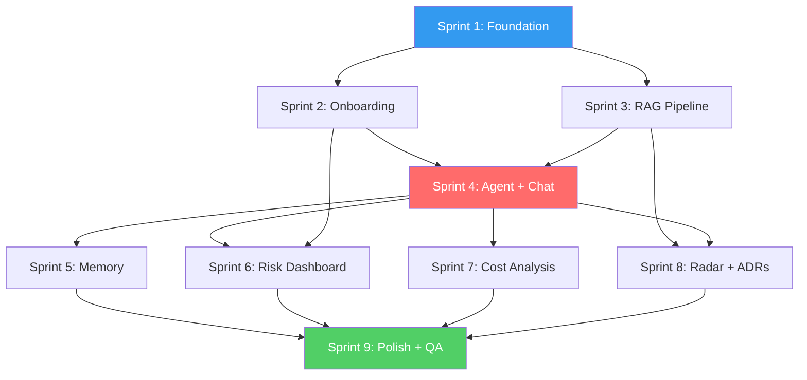

# Tasks: CTOaaS Foundation (Phase 1 MVP)

**Product**: CTOaaS (CTO as a Service)
**Branch**: `foundation/ctoaas`
**Created**: 2026-03-12
**Plan**: `products/ctoaas/docs/plan.md`
**Spec**: `products/ctoaas/docs/specs/ctoaas-foundation.md`
**PRD**: `products/ctoaas/docs/PRD.md`
**Architecture**: `products/ctoaas/docs/architecture.md`

---

## Format

`- [ ] [IMPL-XXX] [P?] [US-XX?] Description → file/path | agent | depends_on | est`

- **IMPL-XXX**: Task ID
- **[P]**: Can run in parallel with other [P] tasks in same sprint
- **[US-XX]**: Links to user story
- **→ file/path**: Target file(s) to create/modify
- **agent**: Assigned specialist agent
- **depends_on**: Task dependencies
- **est**: Estimated time in minutes

---

## Pre-verified Exclusions (already implemented)

*From Implementation Audit in plan.md — these capabilities are NOT included as tasks.*

| Capability | Evidence | Spec Req | Would Have Been |
|-----------|----------|----------|-----------------|
| Authentication (signup, login, JWT, refresh, logout) | `packages/auth/` | FR-014, FR-015, FR-016 | Sprint 1 auth tasks |
| Structured logging | `packages/shared/utils/logger` | NFR cross-cutting | Sprint 1 logging setup |
| Password hashing (argon2) | `packages/shared/utils/crypto` | FR-014 | Sprint 1 crypto task |
| Prisma connection lifecycle | `packages/shared/plugins/prisma` | NFR-012 | Sprint 1 DB plugin |
| Redis connection + degradation | `packages/shared/plugins/redis` | NFR-014 | Sprint 1 cache setup |
| UI components (Button, Card, Input) | `packages/ui/` | FR cross-cutting | Sprint 1 UI library |
| Dashboard layout + sidebar | `packages/ui/layout` | FR-020 | Sprint 1 layout scaffolding |

**7 capabilities excluded** — reused from shared `packages/` directory.

---

## Sprint 1: Foundation (Backend + Frontend + DevOps — parallel)

**Goal**: Project scaffolding, database, auth integration, basic health check, CI pipeline.
**Estimated**: 5 days

### Setup

- [ ] IMPL-001 [P] Initialize backend project structure with Fastify, TypeScript strict, register shared plugins (auth, prisma, redis, rate-limit, logger) → `products/ctoaas/apps/api/` | **backend-engineer** | — | 120 min
  - FR: —, NFR: —
  - Create `package.json`, `tsconfig.json`, `.eslintrc.js`, `src/server.ts`, `src/app.ts`
  - Register `@connectsw/auth`, `@connectsw/shared/plugins/prisma`, `@connectsw/shared/plugins/redis`
  - Configure rate-limit (100 req/min general, 20 req/min LLM endpoints)

- [ ] IMPL-002 [P] Initialize frontend project with Next.js 14, Tailwind, shadcn/ui, CopilotKit provider in root layout → `products/ctoaas/apps/web/` | **frontend-engineer** | — | 120 min
  - FR: —, NFR: —
  - Create `package.json`, `tsconfig.json`, `next.config.ts`, `tailwind.config.ts`
  - Install CopilotKit (`@copilotkit/react-core`, `@copilotkit/react-ui`)
  - Add `<CopilotKit>` provider in `layout.tsx` pointing to `/api/copilot`
  - Import `@connectsw/ui` components, dashboard layout

- [ ] IMPL-003 [P] CI workflow, Docker Compose (PostgreSQL + pgvector + Redis), environment config → `products/ctoaas/` | **devops-engineer** | — | 90 min
  - FR: —, NFR: —
  - `docker-compose.yml` with `pgvector/pgvector:pg15` and Redis 7
  - `.env.example` with all required env vars (DB, Redis, Claude API key, OpenAI API key, S3)
  - GitHub Actions CI workflow (lint, type-check, test, build)

- [ ] IMPL-004 Register ports in PORT-REGISTRY.md (Frontend 3120 / Backend 5015) → `.claude/PORT-REGISTRY.md` | **devops-engineer** | — | 10 min
  - FR: —, NFR: —

### Database

- [ ] IMPL-005 Create Prisma schema from db-schema.sql — all 13+ tables including ADR model → `products/ctoaas/apps/api/prisma/schema.prisma` | **data-engineer** | IMPL-001, IMPL-003 | 180 min
  - FR: FR-008, FR-011, FR-017, FR-020, FR-023, FR-025, FR-030
  - Tables: User, Organization, CompanyProfile, Conversation, Message, KnowledgeDocument, KnowledgeChunk, RiskItem, RiskRecommendation, CostScenario, CloudSpend, TechRadarItem, UserPreference, ArchitectureDecisionRecord
  - pgvector extension for embedding columns
  - Indexes: GIN for full-text search, HNSW for vector similarity, B-tree for FKs
  - Seed data: tech radar items (50+ technologies), sample knowledge documents

- [ ] IMPL-006 Run initial migration, verify schema, seed tech radar items → `products/ctoaas/apps/api/prisma/migrations/` | **data-engineer** | IMPL-005 | 60 min
  - FR: FR-025

### Backend Health & Auth Integration

- [ ] IMPL-007 **Test (Red)**: Health endpoint integration test → `products/ctoaas/apps/api/tests/integration/health.test.ts` | **backend-engineer** | IMPL-001 | 30 min
  - NFR: NFR-013

- [ ] IMPL-008 **(Green)**: Health endpoint with DB and Redis status → `products/ctoaas/apps/api/src/routes/health.ts` | **backend-engineer** | IMPL-007 | 30 min
  - NFR: NFR-013, NFR-014

- [ ] IMPL-009 **Test (Red)**: Auth integration tests (signup, verify, login, refresh, logout) → `products/ctoaas/apps/api/tests/integration/auth.test.ts` | **qa-engineer** | IMPL-001, IMPL-005 | 120 min
  - FR: FR-014, FR-015, FR-016, NFR-007

- [ ] IMPL-010 **(Green)**: Integrate @connectsw/auth routes (signup, login, refresh, logout, verify-email) → `products/ctoaas/apps/api/src/routes/auth.ts` | **backend-engineer** | IMPL-009, IMPL-006 | 90 min
  - FR: FR-014, FR-015, FR-016
  - US-08: Secure Account Registration

### Frontend Auth Pages

- [ ] IMPL-011 [P] [US-08] Auth pages (signup, login, verify-email) using @connectsw/auth frontend hooks → `products/ctoaas/apps/web/src/app/(auth)/` | **frontend-engineer** | IMPL-002 | 180 min
  - FR: FR-014, FR-015, FR-016
  - Pages: `/signup`, `/login`, `/verify-email/[token]`
  - Use `@connectsw/ui` form components
  - Client-side validation matching backend Zod schemas

### Sprint 1 Checkpoint

- [ ] IMPL-012 Verify: all Sprint 1 tests pass, health + auth endpoints operational → — | **qa-engineer** | IMPL-008, IMPL-010, IMPL-011 | 30 min

---

## Sprint 2: Company Profile + Onboarding

**Goal**: Multi-step onboarding wizard, company profile CRUD, organizational context injection.
**Estimated**: 4 days
**depends_on**: Sprint 1 complete (IMPL-012)

### Tests First (TDD - Red)

- [ ] IMPL-013 [P] **Test (Red)**: Profile service unit tests — onboarding steps, profile CRUD, completeness calculation → `products/ctoaas/apps/api/tests/unit/profile.service.test.ts` | **backend-engineer** | IMPL-012 | 90 min
  - FR: FR-008, FR-009

- [ ] IMPL-014 [P] **Test (Red)**: Profile routes integration tests — 4-step onboarding, skip/resume, profile update → `products/ctoaas/apps/api/tests/integration/profile.test.ts` | **qa-engineer** | IMPL-012 | 90 min
  - FR: FR-008, FR-009
  - US-05: Company Profile Onboarding

### Implementation (TDD - Green)

- [ ] IMPL-015 [US-05] Profile service + routes: onboarding (4 steps: CompanyBasics, TechStack, Challenges, Preferences), profile CRUD, completeness % → `products/ctoaas/apps/api/src/services/profile.service.ts`, `products/ctoaas/apps/api/src/routes/profile.ts` | **backend-engineer** | IMPL-013, IMPL-014 | 180 min
  - FR: FR-008, FR-009
  - 4-step wizard with persistence per step (resume from last incomplete step)
  - Completeness calculation (required vs optional fields)
  - Org context builder for LLM prompt injection

- [ ] IMPL-016 [P] [US-05] Onboarding wizard frontend (4 steps): CompanyBasics, TechStackSelector, ChallengesSelector, PreferencesForm → `products/ctoaas/apps/web/src/app/(dashboard)/onboarding/` | **frontend-engineer** | IMPL-012 | 240 min
  - FR: FR-008
  - Step indicator, back/next/skip navigation
  - TechStackSelector with searchable multi-select (languages, frameworks, databases, cloud providers)
  - ChallengesSelector with predefined list + custom input
  - Validation per step, progress persistence

- [ ] IMPL-017 [P] [US-05] Settings pages: profile edit, account settings, preferences → `products/ctoaas/apps/web/src/app/(dashboard)/settings/` | **frontend-engineer** | IMPL-012 | 180 min
  - FR: FR-008, FR-009
  - Profile edit form (pre-populated from onboarding)
  - Account settings (email, password change)
  - Preferences form (communication style, response format, detail level)

### Sprint 2 Checkpoint

- [ ] IMPL-018 Verify: onboarding flow works end-to-end (step persistence, skip, resume), profile CRUD passes → — | **qa-engineer** | IMPL-015, IMPL-016, IMPL-017 | 60 min
  - US-05 acceptance criteria verified

---

## Sprint 3: RAG Pipeline + Knowledge Base (LlamaIndex)

**Goal**: LlamaIndex ingestion pipeline, pgvector storage, RAG retrieval, knowledge document management.
**Estimated**: 5 days
**depends_on**: Sprint 1 complete (IMPL-012), Database (IMPL-006)

### Tests First (TDD - Red)

- [ ] IMPL-019 [P] **Test (Red)**: RAG service unit tests — document loading, chunking (500-1000 tokens), embedding generation → `products/ctoaas/apps/api/tests/unit/rag.service.test.ts` | **ai-ml-engineer** | IMPL-012 | 90 min
  - FR: FR-005

- [ ] IMPL-020 [P] **Test (Red)**: Embedding service tests — batch embedding, pgvector storage, HNSW index search → `products/ctoaas/apps/api/tests/unit/embedding.service.test.ts` | **ai-ml-engineer** | IMPL-012 | 60 min
  - FR: FR-005, NFR-004

- [ ] IMPL-021 [P] **Test (Red)**: RAG query engine tests — vector similarity search (cosine, top-5, threshold 0.7), reranking → `products/ctoaas/apps/api/tests/unit/rag-query.service.test.ts` | **ai-ml-engineer** | IMPL-012 | 60 min
  - FR: FR-005, FR-006, NFR-004

- [ ] IMPL-022 [P] **Test (Red)**: Knowledge document management route tests — upload, list, status → `products/ctoaas/apps/api/tests/integration/knowledge.test.ts` | **backend-engineer** | IMPL-012 | 60 min
  - FR: FR-005

### Implementation (TDD - Green)

- [ ] IMPL-023 [US-03] RAG service: LlamaIndex setup, document loaders (PDF, Markdown, text), SentenceSplitter (500-1000 tokens), OpenAI embedding integration → `products/ctoaas/apps/api/src/services/rag.service.ts` | **ai-ml-engineer** | IMPL-019 | 240 min
  - FR: FR-005
  - LlamaIndex `SimpleDirectoryReader`, `SentenceSplitter`
  - OpenAI `text-embedding-3-small` (1536 dims)
  - Batch processing with progress tracking

- [ ] IMPL-024 [US-03] Embedding service: batch embedding generation, pgvector PGVectorStore adapter, HNSW index configuration → `products/ctoaas/apps/api/src/services/embedding.service.ts` | **ai-ml-engineer** | IMPL-020, IMPL-023 | 180 min
  - FR: FR-005, NFR-004
  - `PGVectorStore` from LlamaIndex
  - HNSW index for <500ms search at 100K vectors

- [ ] IMPL-025 [US-03] [US-04] RAG query engine: vector similarity search (cosine, top-5, threshold 0.7), reranker, citation extraction → `products/ctoaas/apps/api/src/services/rag-query.service.ts` | **ai-ml-engineer** | IMPL-021, IMPL-024 | 180 min
  - FR: FR-005, FR-006, FR-007
  - Return chunks with source metadata (title, author, date, relevance score)
  - Label "grounded" vs "general AI knowledge" sections
  - Citation format: `[1]`, `[2]` inline with Sources section

- [ ] IMPL-026 [US-03] Knowledge document management routes: upload, list, status, S3/R2 storage integration → `products/ctoaas/apps/api/src/routes/knowledge.ts`, `products/ctoaas/apps/api/src/services/knowledge.service.ts` | **backend-engineer** | IMPL-022, IMPL-023 | 180 min
  - FR: FR-005
  - Upload endpoint with multipart/form-data
  - Async ingestion pipeline trigger
  - Status tracking (pending, processing, indexed, failed)

### Sprint 3 Checkpoint

- [ ] IMPL-027 **Test (Integration)**: RAG pipeline end-to-end — ingest document, chunk, embed, retrieve with <500ms latency → `products/ctoaas/apps/api/tests/integration/rag-pipeline.test.ts` | **qa-engineer** | IMPL-023, IMPL-024, IMPL-025, IMPL-026 | 90 min
  - FR: FR-005, FR-006, FR-007, NFR-004
  - US-03, US-04 acceptance criteria verified

---

## Sprint 4: LangGraph Agent + CopilotKit Chat

**Goal**: Core advisory experience — CTO asks questions, agent reasons, tools execute, response streams with citations.
**Estimated**: 6 days
**depends_on**: Sprint 2 (IMPL-018 — org context), Sprint 3 (IMPL-027 — RAG pipeline)

### Tests First (TDD - Red)

- [ ] IMPL-028 [P] **Test (Red)**: LangGraph agent unit tests — state schema, router node routing logic, synthesizer node → `products/ctoaas/apps/api/tests/unit/agent.test.ts` | **ai-ml-engineer** | IMPL-027 | 90 min
  - FR: FR-001, FR-009

- [ ] IMPL-029 [P] **Test (Red)**: RAG search tool node tests — query routing, citation extraction, grounded vs general labeling → `products/ctoaas/apps/api/tests/unit/agent-tools.test.ts` | **ai-ml-engineer** | IMPL-027 | 60 min
  - FR: FR-005, FR-006, FR-007

- [ ] IMPL-030 [P] **Test (Red)**: CopilotKit Runtime route tests — AG-UI streaming, disclaimer injection → `products/ctoaas/apps/api/tests/integration/copilot.test.ts` | **backend-engineer** | IMPL-018 | 60 min
  - FR: FR-002, FR-029

- [ ] IMPL-031 [P] **Test (Red)**: Data sanitizer unit tests — PII stripping, financial data removal, credential redaction → `products/ctoaas/apps/api/tests/unit/sanitizer.test.ts` | **backend-engineer** | IMPL-012 | 60 min
  - FR: FR-019

### Implementation (TDD - Green)

- [ ] IMPL-032 [US-01] [US-02] LangGraph agent graph: state schema (AgentState), router node (classify → rag/risk/cost/radar/general), synthesizer node, system prompt with org context injection → `products/ctoaas/apps/api/src/agent/graph.ts`, `products/ctoaas/apps/api/src/agent/nodes/` | **ai-ml-engineer** | IMPL-028 | 360 min
  - FR: FR-001, FR-009
  - StateGraph with `AgentState` (messages, org_context, tool_results, citations)
  - Router node: classify query intent → select tool path
  - Synthesizer node: compose final response with citations + confidence
  - System prompt template with org context placeholders
  - ReAct pattern: reason → act → observe → respond

- [ ] IMPL-033 [US-03] [US-04] RAG search tool node: integrate LlamaIndex query engine, citation extraction, grounded vs general knowledge labeling → `products/ctoaas/apps/api/src/agent/tools/rag-search.ts` | **ai-ml-engineer** | IMPL-029, IMPL-025 | 180 min
  - FR: FR-005, FR-006, FR-007
  - LangGraph tool wrapping RAG query service
  - Return structured citations with source metadata
  - Threshold-based grounding indicator

- [ ] IMPL-034 [US-01] CopilotKit Runtime plugin: Fastify route for `/v1/copilot/runtime`, AG-UI streaming protocol, AI disclaimer injection on every response → `products/ctoaas/apps/api/src/routes/copilot.ts`, `products/ctoaas/apps/api/src/services/copilot.service.ts` | **backend-engineer** | IMPL-030, IMPL-032 | 180 min
  - FR: FR-002, FR-029
  - `@copilotkit/runtime` Fastify adapter
  - Stream LangGraph agent output via AG-UI protocol
  - Append disclaimer to every AI response

- [ ] IMPL-035 [US-09] Data sanitizer service: PII/financial stripping before LLM calls → `products/ctoaas/apps/api/src/services/sanitizer.service.ts` | **backend-engineer** | IMPL-031 | 90 min
  - FR: FR-019
  - Regex-based PII detection (email, phone, SSN patterns)
  - Financial data redaction (account numbers, specific amounts)
  - Credential stripping (API keys, tokens, passwords)
  - Configurable allow-list for necessary context

- [ ] IMPL-036 [US-01] [US-04] CopilotKit chat page: CopilotChat component, conversation sidebar, citation panel with source preview, feedback buttons (thumbs up/down), AI disclaimer display → `products/ctoaas/apps/web/src/app/(dashboard)/chat/` | **frontend-engineer** | IMPL-018, IMPL-034 | 270 min
  - FR: FR-001, FR-002, FR-006, FR-007, FR-029
  - `CopilotChat` or `CopilotSidebar` from `@copilotkit/react-ui`
  - Conversation list in sidebar (auto-generated titles, timestamps)
  - Citation panel: clickable `[1]`, `[2]` markers → source preview modal
  - "General AI knowledge" label for ungrounded sections
  - Feedback buttons per message (thumbs up/down)
  - Streaming token-by-token display
  - "New Conversation" button

### Sprint 4 Checkpoint

- [ ] IMPL-037 **Test (Integration)**: Agent end-to-end — query routing, RAG retrieval, citation presence, streaming response, disclaimer present → `products/ctoaas/apps/api/tests/integration/agent.test.ts` | **qa-engineer** | IMPL-032, IMPL-033, IMPL-034, IMPL-035, IMPL-036 | 120 min
  - FR: FR-001, FR-002, FR-005, FR-006, FR-007, FR-019, FR-029
  - US-01, US-02, US-03, US-04, US-09 acceptance criteria verified

---

## Sprint 5: Conversation Memory + Preferences

**Goal**: Persistent conversations, hierarchical memory, full-text search, preference learning.
**Estimated**: 4 days
**depends_on**: Sprint 4 (IMPL-037 — agent + chat operational)

### Tests First (TDD - Red)

- [ ] IMPL-038 [P] **Test (Red)**: Conversation service tests — create, list, get with messages, auto-title generation → `products/ctoaas/apps/api/tests/unit/conversation.service.test.ts` | **backend-engineer** | IMPL-037 | 60 min
  - FR: FR-011

- [ ] IMPL-039 [P] **Test (Red)**: Memory service tests — hierarchical summarization trigger (>10 messages), long-term fact extraction → `products/ctoaas/apps/api/tests/unit/memory.service.test.ts` | **backend-engineer** | IMPL-037 | 60 min
  - FR: FR-012

- [ ] IMPL-040 [P] **Test (Red)**: Conversation search tests — full-text search via pg_trgm, <2s response → `products/ctoaas/apps/api/tests/unit/search.service.test.ts` | **backend-engineer** | IMPL-037 | 30 min
  - FR: FR-013

- [ ] IMPL-041 [P] **Test (Red)**: Preference learning tests — feedback storage, preference profile building, preference injection → `products/ctoaas/apps/api/tests/unit/preference.service.test.ts` | **backend-engineer** | IMPL-037 | 60 min
  - FR: FR-010

### Implementation (TDD - Green)

- [ ] IMPL-042 [US-07] Conversation service: create, list (paginated, ordered by recent), get with messages, auto-title generation via LLM → `products/ctoaas/apps/api/src/services/conversation.service.ts`, `products/ctoaas/apps/api/src/routes/conversations.ts` | **backend-engineer** | IMPL-038 | 180 min
  - FR: FR-011
  - Auto-title: LLM generates concise title from first 2 messages
  - Pagination with cursor-based approach
  - Org-scoped queries (mandatory organization_id filter)

- [ ] IMPL-043 [US-02] [US-07] Memory service: hierarchical summarization (messages > 10 triggers compress), long-term fact extraction → `products/ctoaas/apps/api/src/services/memory.service.ts` | **backend-engineer** | IMPL-039, IMPL-042 | 180 min
  - FR: FR-012
  - Recent messages (last 10) included verbatim
  - Older messages compressed into summary
  - Key facts extracted to long-term memory store
  - Context window management (<128K tokens)

- [ ] IMPL-044 [US-07] Conversation search: full-text search via pg_trgm index on message content, <2s response → `products/ctoaas/apps/api/src/services/search.service.ts` | **backend-engineer** | IMPL-040, IMPL-042 | 90 min
  - FR: FR-013
  - GIN index on `messages.content` for trigram matching
  - Highlight matching text in results

- [ ] IMPL-045 [US-06] Preference learning: feedback storage (thumbs up/down linked to message + RAG sources), preference profile building, preference injection into system prompts → `products/ctoaas/apps/api/src/services/preference.service.ts`, `products/ctoaas/apps/api/src/routes/preferences.ts` | **backend-engineer** | IMPL-041 | 90 min
  - FR: FR-010
  - After 10+ signals: generate preference summary (e.g., "prefers concise answers with code examples")
  - Inject preference summary into LangGraph system prompt

- [ ] IMPL-046 Memory retrieval tool node: LangGraph tool that loads past decisions and preferences for current conversation context → `products/ctoaas/apps/api/src/agent/tools/memory-retrieval.ts` | **ai-ml-engineer** | IMPL-043, IMPL-045 | 90 min
  - FR: FR-010, FR-012
  - Tool available to agent graph for "recall past decisions" queries

### Sprint 5 Checkpoint

- [ ] IMPL-047 **Test (Integration)**: Memory end-to-end — conversation persistence, summarization trigger at 10+ messages, search accuracy, preference signals applied → `products/ctoaas/apps/api/tests/integration/memory.test.ts` | **qa-engineer** | IMPL-042, IMPL-043, IMPL-044, IMPL-045, IMPL-046 | 90 min
  - FR: FR-010, FR-011, FR-012, FR-013
  - US-02, US-06, US-07 acceptance criteria verified

---

## Sprint 6: Risk Dashboard + Recommendations

**Goal**: Risk dashboard with 4 categories, auto-generated risk items from company profile, AI-powered recommendations.
**Estimated**: 5 days
**depends_on**: Sprint 2 (IMPL-018 — company profile), Sprint 4 (IMPL-037 — agent)

### Tests First (TDD - Red)

- [ ] IMPL-048 [P] **Test (Red)**: Risk service unit tests — auto-generate risk items from company profile (EOL detection, vendor concentration, compliance gaps) → `products/ctoaas/apps/api/tests/unit/risk.service.test.ts` | **backend-engineer** | IMPL-018 | 90 min
  - FR: FR-020, FR-021

- [ ] IMPL-049 [P] **Test (Red)**: Risk recommendation tests — LangGraph tool node generates AI mitigation actions → `products/ctoaas/apps/api/tests/unit/risk-recommendation.test.ts` | **ai-ml-engineer** | IMPL-037 | 60 min
  - FR: FR-022

- [ ] IMPL-050 [P] **Test (Red)**: Risk routes integration tests — summary, category detail, item detail, recommendations, status update → `products/ctoaas/apps/api/tests/integration/risk.test.ts` | **backend-engineer** | IMPL-018 | 60 min
  - FR: FR-020, FR-021, FR-022

### Implementation (TDD - Green)

- [ ] IMPL-051 [US-10] Risk service: auto-generate risk items from company profile analysis — EOL technology detection, vendor concentration scoring, compliance gap identification, operational risk assessment → `products/ctoaas/apps/api/src/services/risk.service.ts` | **backend-engineer** | IMPL-048 | 240 min
  - FR: FR-020, FR-021
  - 4 risk categories: Technology Debt, Vendor Risk, Compliance, Operational
  - Score per category (1-10) with trend indicators (improving/stable/degrading)
  - Auto-generate from company profile tech stack analysis

- [ ] IMPL-052 [US-11] Risk recommendation generation: LangGraph tool node for AI-powered mitigation actions → `products/ctoaas/apps/api/src/agent/tools/risk-advisor.ts` | **ai-ml-engineer** | IMPL-049, IMPL-051 | 180 min
  - FR: FR-022
  - Generate specific, actionable mitigation steps
  - Priority-ranked recommendations
  - Effort/impact estimates per recommendation

- [ ] IMPL-053 [US-10] Risk routes: GET /risks/summary (4 categories with scores/trends), GET /risks/:category, GET /risks/items/:id, GET /risks/items/:id/recommendations, PATCH /risks/items/:id/status → `products/ctoaas/apps/api/src/routes/risks.ts` | **backend-engineer** | IMPL-050, IMPL-051 | 90 min
  - FR: FR-020, FR-021, FR-022

- [ ] IMPL-054 [US-10] [US-11] Risk dashboard frontend: category cards with scores/trends, risk item list with severity indicators, detail panel, recommendation display, "Discuss with advisor" deep link to chat → `products/ctoaas/apps/web/src/app/(dashboard)/risks/` | **frontend-engineer** | IMPL-053 | 270 min
  - FR: FR-020, FR-021, FR-022
  - 4 category cards (color-coded by severity)
  - Risk item list with filters (category, severity, status)
  - Detail panel with full context and AI recommendations
  - "Discuss with advisor" button → opens chat pre-filled with risk context

### Sprint 6 Checkpoint

- [ ] IMPL-055 **Test (Integration)**: Risk end-to-end — dashboard renders, risk generation from profile, recommendation quality, status update → `products/ctoaas/apps/api/tests/integration/risk-e2e.test.ts` | **qa-engineer** | IMPL-051, IMPL-052, IMPL-053, IMPL-054 | 60 min
  - FR: FR-020, FR-021, FR-022
  - US-10, US-11 acceptance criteria verified

---

## Sprint 7: Cost Analysis + TCO Calculator

**Goal**: TCO calculator with 3-year projections and AI analysis, cloud spend analysis with benchmarks.
**Estimated**: 5 days
**depends_on**: Sprint 4 (IMPL-037 — agent for AI analysis)

### Tests First (TDD - Red)

- [ ] IMPL-056 [P] **Test (Red)**: Cost calculator service unit tests — TCO projection (3-year), pure calculation functions → `products/ctoaas/apps/api/tests/unit/cost.service.test.ts` | **backend-engineer** | IMPL-037 | 60 min
  - FR: FR-023

- [ ] IMPL-057 [P] **Test (Red)**: TCO AI analysis tests — LangGraph cost calculator tool node → `products/ctoaas/apps/api/tests/unit/cost-analysis.test.ts` | **ai-ml-engineer** | IMPL-037 | 60 min
  - FR: FR-024

- [ ] IMPL-058 [P] **Test (Red)**: Cloud spend service tests — manual entry, CSV/JSON import, benchmark comparison → `products/ctoaas/apps/api/tests/unit/cloud-spend.service.test.ts` | **backend-engineer** | IMPL-037 | 60 min
  - FR: FR-027

- [ ] IMPL-059 [P] **Test (Red)**: Cost routes integration tests — TCO CRUD, cloud spend CRUD, AI analysis trigger → `products/ctoaas/apps/api/tests/integration/cost.test.ts` | **backend-engineer** | IMPL-037 | 60 min
  - FR: FR-023, FR-024, FR-027

### Implementation (TDD - Green)

- [ ] IMPL-060 [US-12] Cost calculator service: TCO projection (3-year), pure calculation functions (build cost, buy cost, maintenance, scaling) → `products/ctoaas/apps/api/src/services/cost.service.ts` | **backend-engineer** | IMPL-056 | 180 min
  - FR: FR-023
  - Input: option name, upfront cost, monthly recurring, team size, hourly rate, scaling factor
  - Output: 3-year TCO per option with year-by-year breakdown
  - Pure functions — no side effects, easily testable

- [ ] IMPL-061 [US-12] TCO AI analysis: LangGraph cost calculator tool node with org context → `products/ctoaas/apps/api/src/agent/tools/cost-analyzer.ts` | **ai-ml-engineer** | IMPL-057, IMPL-060 | 90 min
  - FR: FR-024
  - Analyze TCO comparison considering company profile (size, growth stage, budget)
  - Generate recommendation with reasoning

- [ ] IMPL-062 [US-13] Cloud spend service: manual entry, CSV/JSON import, industry benchmark comparison, optimization recommendations → `products/ctoaas/apps/api/src/services/cloud-spend.service.ts`, `products/ctoaas/apps/api/src/routes/cloud-spend.ts` | **backend-engineer** | IMPL-058 | 180 min
  - FR: FR-027
  - Import: CSV/JSON parsing with validation
  - Benchmarks: industry average spend by company size
  - Recommendations: over-provisioned resources, reserved instance opportunities

- [ ] IMPL-063 [US-12] TCO pages frontend: multi-option comparison form, 3-year projection line chart, AI analysis display, export to PDF → `products/ctoaas/apps/web/src/app/(dashboard)/costs/tco/` | **frontend-engineer** | IMPL-060, IMPL-061 | 180 min
  - FR: FR-023, FR-024
  - Form: add multiple build/buy options with cost inputs
  - Chart: recharts line chart showing 3-year TCO curves per option
  - AI analysis section with recommendation

- [ ] IMPL-064 [US-13] Cloud spend pages frontend: spend input form, donut chart (by service), benchmark comparison bar chart, recommendations list → `products/ctoaas/apps/web/src/app/(dashboard)/costs/cloud-spend/` | **frontend-engineer** | IMPL-062 | 180 min
  - FR: FR-027
  - Donut chart: spend breakdown by cloud service
  - Bar chart: your spend vs industry benchmark
  - Recommendation cards with estimated savings

### Sprint 7 Checkpoint

- [ ] IMPL-065 **Test (Integration)**: Cost end-to-end — TCO calculation accuracy, cloud spend import, AI recommendation generation → `products/ctoaas/apps/api/tests/integration/cost-e2e.test.ts` | **qa-engineer** | IMPL-060, IMPL-061, IMPL-062, IMPL-063, IMPL-064 | 60 min
  - FR: FR-023, FR-024, FR-027
  - US-12, US-13 acceptance criteria verified

---

## Sprint 8: Tech Radar + ADR Management

**Goal**: Interactive technology radar visualization, ADR CRUD with AI-assist, ADR RAG integration.
**Estimated**: 6 days
**depends_on**: Sprint 3 (IMPL-027 — RAG for ADR indexing), Sprint 4 (IMPL-037 — agent for AI features)

### Tech Radar — Tests First (TDD - Red)

- [ ] IMPL-066 [P] **Test (Red)**: Radar routes tests — list items with user stack overlay, item detail with personalized relevance → `products/ctoaas/apps/api/tests/integration/radar.test.ts` | **backend-engineer** | IMPL-037 | 45 min
  - FR: FR-025, FR-026

- [ ] IMPL-067 [P] **Test (Red)**: Radar lookup tool node tests — LangGraph tool for technology queries → `products/ctoaas/apps/api/tests/unit/radar-tool.test.ts` | **ai-ml-engineer** | IMPL-037 | 30 min
  - FR: FR-025, FR-026

### Tech Radar — Implementation (TDD - Green)

- [ ] IMPL-068 [US-14] Radar routes: GET /radar (all items with user stack overlay), GET /radar/:id (item detail with personalized relevance score) → `products/ctoaas/apps/api/src/routes/radar.ts` | **backend-engineer** | IMPL-066 | 90 min
  - FR: FR-025, FR-026
  - Overlay: highlight technologies in user's configured stack
  - Relevance: score based on stack match, industry, company size

- [ ] IMPL-069 [US-14] Radar component: custom SVG circular visualization (4 rings: Adopt/Trial/Assess/Hold × 4 quadrants: Languages/Frameworks/Infrastructure/Tools), D3.js interactivity, detail panel, mobile-responsive list view fallback → `products/ctoaas/apps/web/src/components/radar/` | **frontend-engineer** | IMPL-068 | 360 min
  - FR: FR-025, FR-026
  - SVG radar with interactive dots (hover → tooltip, click → detail)
  - 4 rings: Adopt (innermost), Trial, Assess, Hold (outermost)
  - 4 quadrants: Languages & Frameworks, Tools, Platforms, Techniques
  - User's stack items highlighted (different color/size)
  - Mobile: collapsed to sortable/filterable list view

- [ ] IMPL-070 [US-14] Radar lookup tool node: LangGraph tool for technology queries ("What do you think of Kubernetes?") → `products/ctoaas/apps/api/src/agent/tools/radar-lookup.ts` | **ai-ml-engineer** | IMPL-067, IMPL-068 | 90 min
  - FR: FR-025, FR-026
  - Lookup radar item by name/category
  - Return ring, quadrant, description, relevance to user's stack

### ADR Management — Tests First (TDD - Red)

- [ ] IMPL-071 [P] **Test (Red)**: ADR CRUD route tests — create, read, update, archive, list with filters → `products/ctoaas/apps/api/tests/integration/adr.test.ts` | **backend-engineer** | IMPL-037 | 90 min
  - FR: FR-030, FR-032, FR-033

- [ ] IMPL-072 [P] **Test (Red)**: ADR RAG indexing tests — ADR content indexed in vector store, searchable → `products/ctoaas/apps/api/tests/unit/adr-indexing.test.ts` | **ai-ml-engineer** | IMPL-027 | 60 min
  - FR: FR-034

- [ ] IMPL-073 [P] **Test (Red)**: ADR drafting tool node tests — AI-assisted trade-off analysis, alternative suggestions, consequence pre-fill → `products/ctoaas/apps/api/tests/unit/adr-drafter.test.ts` | **ai-ml-engineer** | IMPL-037 | 60 min
  - FR: FR-031

- [ ] IMPL-074 [P] **Test (Red)**: Related ADR surfacing tests — new ADR triggers similarity search against existing ADRs → `products/ctoaas/apps/api/tests/unit/adr-related.test.ts` | **ai-ml-engineer** | IMPL-027 | 45 min
  - FR: FR-035

### ADR Management — Implementation (TDD - Green)

- [ ] IMPL-075 [US-15] ADR Prisma model (if not in IMPL-005) and CRUD service: create, read, update, archive with structured fields (title, status [proposed/accepted/deprecated/superseded], context, decision, consequences, alternatives, linked radar items, linked risk items) → `products/ctoaas/apps/api/src/services/adr.service.ts`, `products/ctoaas/apps/api/src/routes/adrs.ts` | **backend-engineer** | IMPL-071 | 180 min
  - FR: FR-030, FR-032, FR-033
  - Fields: title, status, context, decision, consequences, alternatives, mermaid_diagram, linked_radar_item_ids, linked_risk_item_ids, conversation_id (optional — link to chat that led to decision)
  - ADR-to-Radar linking via junction table
  - ADR-to-Risk linking via junction table
  - Mermaid diagram content stored as text field (rendered on frontend)

- [ ] IMPL-076 [US-16] ADR RAG indexing: index ADR content (title + context + decision + consequences) in LlamaIndex vector store on create/update → `products/ctoaas/apps/api/src/services/adr-indexing.service.ts` | **ai-ml-engineer** | IMPL-072, IMPL-075 | 120 min
  - FR: FR-034
  - Trigger re-indexing on ADR create/update
  - Include ADR metadata (id, title, status, date) in chunk metadata
  - Agent can cite past ADRs when answering related questions

- [ ] IMPL-077 [US-15] ADR drafting tool node: LangGraph tool that drafts trade-off analysis, suggests alternatives based on company context, pre-fills consequences from knowledge base → `products/ctoaas/apps/api/src/agent/tools/adr-drafter.ts` | **ai-ml-engineer** | IMPL-073, IMPL-032 | 180 min
  - FR: FR-031
  - Input: technology/decision topic, brief context
  - Output: structured ADR draft with trade-offs, alternatives, consequences
  - Uses RAG to ground suggestions in knowledge base
  - Uses company profile for context-aware recommendations

- [ ] IMPL-078 [US-16] Related ADR surfacing: when creating new ADR, search existing ADRs by vector similarity (title + context) and surface top-3 related → `products/ctoaas/apps/api/src/services/adr-related.service.ts` | **ai-ml-engineer** | IMPL-074, IMPL-076 | 90 min
  - FR: FR-035
  - Vector similarity search against ADR embeddings
  - Return top-3 related ADRs with relevance score and summary

- [ ] IMPL-079 [US-15] ADR list page: sortable/filterable table (status, date, technology), search → `products/ctoaas/apps/web/src/app/(dashboard)/adrs/page.tsx` | **frontend-engineer** | IMPL-075 | 120 min
  - FR: FR-030
  - Table columns: title, status (badge), date, linked technologies
  - Filters: status dropdown, date range, search text
  - "New ADR" button

- [ ] IMPL-080 [US-15] ADR create/edit form with AI-assist: structured form fields, "AI Draft" button that invokes LangGraph ADR drafter, Mermaid diagram editor with live preview → `products/ctoaas/apps/web/src/app/(dashboard)/adrs/new/page.tsx`, `products/ctoaas/apps/web/src/app/(dashboard)/adrs/[id]/edit/page.tsx` | **frontend-engineer** | IMPL-077, IMPL-079 | 240 min
  - FR: FR-030, FR-031, FR-033
  - Form sections: Title, Status, Context, Decision, Consequences, Alternatives
  - "AI Draft" button: sends topic + context → receives pre-filled form sections
  - Mermaid diagram textarea with live `mermaid.render()` preview panel
  - Link to radar items (multi-select from radar data)
  - Link to risk items (multi-select from risk data)
  - Related ADRs panel (auto-populated on context change)

- [ ] IMPL-081 [US-15] [US-16] ADR detail page: full ADR rendered with Mermaid diagrams, linked radar/risk items, conversation history link, related ADRs sidebar → `products/ctoaas/apps/web/src/app/(dashboard)/adrs/[id]/page.tsx` | **frontend-engineer** | IMPL-075, IMPL-078 | 180 min
  - FR: FR-030, FR-032, FR-033, FR-035
  - Clean rendering of all ADR fields
  - Mermaid diagrams rendered inline (before/after architecture)
  - Linked radar items shown as clickable chips
  - Linked risk items shown as clickable chips
  - Related ADRs sidebar with relevance scores
  - "Originated from conversation" link (if applicable)

### Sprint 8 Checkpoint

- [ ] IMPL-082 **Test (Integration)**: Tech Radar + ADR end-to-end — radar rendering with overlay, ADR CRUD, AI drafting, RAG citation of past ADRs, related ADR surfacing → `products/ctoaas/apps/api/tests/integration/radar-adr-e2e.test.ts` | **qa-engineer** | IMPL-068, IMPL-069, IMPL-070, IMPL-075, IMPL-076, IMPL-077, IMPL-078, IMPL-079, IMPL-080, IMPL-081 | 120 min
  - FR: FR-025, FR-026, FR-030, FR-031, FR-032, FR-033, FR-034, FR-035
  - US-14, US-15, US-16 acceptance criteria verified

---

## Sprint 9: Polish, Testing, Quality Gates

**Goal**: Free tier enforcement, dashboard page, landing page, E2E test suite, quality gates.
**Estimated**: 4 days
**depends_on**: All previous sprints complete

### Free Tier + UI Polish

- [ ] IMPL-083 **Test (Red)**: Free tier enforcement tests — daily message counter, tier-based feature gating → `products/ctoaas/apps/api/tests/unit/tier.service.test.ts` | **backend-engineer** | IMPL-037 | 45 min
  - FR: FR-028

- [ ] IMPL-084 [US-01] Free tier enforcement: daily message counter (20/day), tier-based feature gating, upgrade CTA → `products/ctoaas/apps/api/src/services/tier.service.ts`, `products/ctoaas/apps/api/src/routes/tier.ts` | **backend-engineer** | IMPL-083 | 90 min
  - FR: FR-028
  - Redis-backed daily counter (reset at midnight UTC)
  - Middleware to check tier limits before LLM endpoints
  - 403 response with upgrade CTA when limit reached

- [ ] IMPL-085 [P] Dashboard page: summary cards (recent conversations, risk overview, quick actions, profile completeness indicator) → `products/ctoaas/apps/web/src/app/(dashboard)/page.tsx` | **frontend-engineer** | IMPL-042, IMPL-053 | 90 min
  - FR: FR-008, FR-011, FR-020
  - Cards: "Continue conversation", "Risk posture" (mini scores), "Quick actions" (new chat, new ADR, view radar), "Profile completeness" (%)

- [ ] IMPL-086 [P] Landing page + deferred page skeletons (help, integrations, reports, team, compliance) → `products/ctoaas/apps/web/src/app/page.tsx`, `products/ctoaas/apps/web/src/app/(dashboard)/*/` | **frontend-engineer** | IMPL-002 | 120 min
  - Marketing landing page with value prop, features, CTA
  - Skeleton pages with "Coming Soon" for Phase 2 features

### E2E Test Suite

- [ ] IMPL-087 Configure Playwright for CTOaaS (port 3120 frontend, port 5015 backend) → `products/ctoaas/e2e/playwright.config.ts` | **qa-engineer** | IMPL-012 | 45 min

- [ ] IMPL-088 E2E: Full user journey — signup → verify email → onboarding → first chat question → view risks → run TCO → explore radar → create ADR → search past ADRs → logout → `products/ctoaas/e2e/tests/user-journey.spec.ts` | **qa-engineer** | all IMPL-0XX | 180 min
  - US-01 through US-16 journey
  - Verify streaming response in chat
  - Verify citations appear
  - Verify risk dashboard loads with categories
  - Verify TCO calculator produces chart
  - Verify radar visualization renders
  - Verify ADR creation with AI draft
  - Verify ADR appears in RAG search results

- [ ] IMPL-089 E2E: Auth edge cases — expired token, locked account (5 failed attempts), invalid verification link → `products/ctoaas/e2e/tests/auth-edge-cases.spec.ts` | **qa-engineer** | IMPL-010 | 60 min
  - US-08 edge cases

- [ ] IMPL-090 E2E: Multi-tenant data isolation — verify org-A cannot see org-B data → `products/ctoaas/e2e/tests/data-isolation.spec.ts` | **qa-engineer** | IMPL-010, IMPL-015 | 60 min
  - US-09 acceptance criteria

### Quality Gates

- [ ] IMPL-091 Update API documentation with all endpoints → `products/ctoaas/docs/API.md` | **technical-writer** | all IMPL-0XX | 120 min

- [ ] IMPL-092 Run `/speckit.analyze` for spec-plan-tasks consistency check → — | **qa-engineer** | IMPL-091 | 30 min

- [ ] IMPL-093 Add new reusable components to COMPONENT-REGISTRY.md (data sanitizer, risk scoring engine, TCO calculator) → `.claude/COMPONENT-REGISTRY.md` | **backend-engineer** | all IMPL-0XX | 30 min

- [ ] IMPL-094 Verify test coverage >= 80% across all packages → — | **qa-engineer** | IMPL-088 | 30 min

- [ ] IMPL-095 Run all quality gates: browser-first (product works in real browser), security (Semgrep + Trivy), testing gate (all tests pass) → — | **qa-engineer** | IMPL-094 | 60 min

- [ ] IMPL-096 Update PRODUCT-REGISTRY.md with CTOaaS entry → `.claude/PRODUCT-REGISTRY.md` | **devops-engineer** | IMPL-095 | 15 min

---

## Execution Strategy

### Parallel Opportunities

| Sprint | Parallel Tasks | Worktree Strategy |
|--------|---------------|-------------------|
| Sprint 1 | IMPL-001, IMPL-002, IMPL-003 (backend, frontend, devops) | 3 worktrees |
| Sprint 1 | IMPL-007 + IMPL-011 (backend tests + frontend auth) | 2 worktrees |
| Sprint 2 | IMPL-013/014 (backend tests) ‖ IMPL-016/017 (frontend) | 2 worktrees |
| Sprint 3 | IMPL-019/020/021 (AI tests) ‖ IMPL-022 (backend tests) | 2 worktrees |
| Sprint 4 | IMPL-028/029 (AI tests) ‖ IMPL-030/031 (backend tests) | 2 worktrees |
| Sprint 5 | IMPL-038/039/040/041 (all backend tests — parallel) | Single worktree |
| Sprint 6 | IMPL-048/049/050 (tests) then IMPL-054 (frontend) ‖ IMPL-051/052/053 (backend) | 2 worktrees |
| Sprint 7 | IMPL-056/057/058 (tests parallel) ‖ IMPL-063/064 (frontend) | 2 worktrees |
| Sprint 8 | IMPL-066/067 (radar tests) ‖ IMPL-071/072/073/074 (ADR tests) | 2 worktrees |
| Sprint 8 | IMPL-069 (radar frontend) ‖ IMPL-079/080/081 (ADR frontend) | 2 worktrees |
| Sprint 9 | IMPL-085/086 (frontend polish) ‖ IMPL-083/084 (backend tier) ‖ IMPL-087-090 (E2E) | 3 worktrees |

### MVP-First Delivery

**Minimum Viable Product** (Sprints 1-4): Auth + Onboarding + RAG + Agent Chat = CTO can ask questions and get cited responses.

**Enhanced MVP** (+ Sprints 5-6): Add conversation memory + risk dashboard = persistent experience with proactive value.

**Full MVP** (+ Sprints 7-9): Add cost analysis + tech radar + ADR management + polish = complete Phase 1.

### Sprint Dependencies

---

## Requirement Traceability

### Functional Requirements

| Spec Requirement | Description | Task(s) | Test(s) | User Story |
|-----------------|-------------|---------|---------|------------|
| FR-001 | Natural language advisory chat | IMPL-032, IMPL-034, IMPL-036 | IMPL-028, IMPL-030, IMPL-037 | US-01 |
| FR-002 | Streaming responses (AG-UI) | IMPL-034, IMPL-036 | IMPL-030, IMPL-037 | US-01 |
| FR-003 | Follow-up conversation context | IMPL-043 | IMPL-039, IMPL-047 | US-02 |
| FR-004 | New conversation (clean context) | IMPL-042, IMPL-036 | IMPL-038, IMPL-047 | US-02 |
| FR-005 | RAG knowledge retrieval | IMPL-023, IMPL-024, IMPL-025, IMPL-026 | IMPL-019, IMPL-020, IMPL-021, IMPL-022, IMPL-027 | US-03 |
| FR-006 | Inline source citations | IMPL-025, IMPL-033, IMPL-036 | IMPL-021, IMPL-029, IMPL-037 | US-04 |
| FR-007 | Grounded vs general labeling | IMPL-025, IMPL-033 | IMPL-021, IMPL-029, IMPL-037 | US-04 |
| FR-008 | Company profile onboarding | IMPL-015, IMPL-016 | IMPL-013, IMPL-014, IMPL-018 | US-05 |
| FR-009 | Org context in prompts | IMPL-015, IMPL-032 | IMPL-013, IMPL-028 | US-05 |
| FR-010 | Preference learning | IMPL-045, IMPL-046 | IMPL-041, IMPL-047 | US-06 |
| FR-011 | Conversation persistence | IMPL-042 | IMPL-038, IMPL-047 | US-07 |
| FR-012 | Hierarchical memory | IMPL-043 | IMPL-039, IMPL-047 | US-07 |
| FR-013 | Conversation search | IMPL-044 | IMPL-040, IMPL-047 | US-07 |
| FR-014 | User registration | IMPL-010, IMPL-011 | IMPL-009 | US-08 |
| FR-015 | Email verification | IMPL-010, IMPL-011 | IMPL-009 | US-08 |
| FR-016 | JWT + refresh auth | IMPL-010, IMPL-011 | IMPL-009 | US-08 |
| FR-017 | Org-level data isolation | IMPL-005 (schema) | IMPL-090 | US-09 |
| FR-018 | AES-256-GCM encryption | IMPL-005 (schema) | IMPL-090 | US-09 |
| FR-019 | LLM data sanitization | IMPL-035 | IMPL-031, IMPL-037 | US-09 |
| FR-020 | Risk dashboard (4 categories) | IMPL-051, IMPL-053, IMPL-054 | IMPL-048, IMPL-050, IMPL-055 | US-10 |
| FR-021 | Auto-generated risk items | IMPL-051 | IMPL-048, IMPL-055 | US-10 |
| FR-022 | AI risk recommendations | IMPL-052, IMPL-053 | IMPL-049, IMPL-055 | US-11 |
| FR-023 | TCO projection calculator | IMPL-060, IMPL-063 | IMPL-056, IMPL-059, IMPL-065 | US-12 |
| FR-024 | AI TCO analysis | IMPL-061, IMPL-063 | IMPL-057, IMPL-065 | US-12 |
| FR-025 | Interactive technology radar | IMPL-068, IMPL-069, IMPL-070 | IMPL-066, IMPL-067, IMPL-082 | US-14 |
| FR-026 | Personalized radar highlights | IMPL-068, IMPL-069 | IMPL-066, IMPL-082 | US-14 |
| FR-027 | Cloud spend analysis | IMPL-062, IMPL-064 | IMPL-058, IMPL-059, IMPL-065 | US-13 |
| FR-028 | Free-tier message limits | IMPL-084 | IMPL-083, IMPL-088 | US-01 |
| FR-029 | AI disclaimer | IMPL-034, IMPL-036 | IMPL-030, IMPL-037 | BR-007 |
| FR-030 | ADR CRUD operations | IMPL-075, IMPL-079, IMPL-080, IMPL-081 | IMPL-071, IMPL-082 | US-15 |
| FR-031 | AI-assisted ADR drafting | IMPL-077, IMPL-080 | IMPL-073, IMPL-082 | US-15 |
| FR-032 | ADR-to-Radar linking | IMPL-075, IMPL-080, IMPL-081 | IMPL-071, IMPL-082 | US-15 |
| FR-033 | ADR Mermaid diagrams | IMPL-075, IMPL-080, IMPL-081 | IMPL-071, IMPL-082 | US-15 |
| FR-034 | ADR RAG integration | IMPL-076 | IMPL-072, IMPL-082 | US-16 |
| FR-035 | Related ADR surfacing | IMPL-078, IMPL-081 | IMPL-074, IMPL-082 | US-16 |

### Non-Functional Requirements

| NFR | Description | Task(s) | Test(s) |
|-----|-------------|---------|---------|
| NFR-001 | Chat streaming start <3s (p95) | IMPL-034 | IMPL-037, IMPL-088 |
| NFR-002 | Full response <15s (p95) | IMPL-032, IMPL-034 | IMPL-037, IMPL-088 |
| NFR-003 | Dashboard load <2s | IMPL-085 | IMPL-088 |
| NFR-004 | Vector search <500ms | IMPL-024, IMPL-025 | IMPL-020, IMPL-021, IMPL-027 |
| NFR-005 | AES-256 encryption at rest | IMPL-005 | IMPL-090 |
| NFR-006 | TLS 1.2+ in transit | IMPL-003 | IMPL-095 |
| NFR-007 | JWT in memory, refresh in httpOnly cookie | IMPL-010 | IMPL-009 |
| NFR-008 | OWASP Top 10 mitigations | IMPL-001, IMPL-035 | IMPL-095 |
| NFR-009 | Rate limiting (100/20 req/min) | IMPL-001 | IMPL-009, IMPL-088 |
| NFR-010 | WCAG 2.1 AA | IMPL-002, IMPL-036, IMPL-069 | IMPL-095 |
| NFR-011 | 1,000 concurrent users | IMPL-001 | IMPL-095 |
| NFR-012 | Connection pooling (50 concurrent) | Excluded (shared plugin) | IMPL-008 |
| NFR-013 | 99.5% uptime | IMPL-008 | IMPL-008 |
| NFR-014 | Graceful degradation (Redis/Claude down) | Excluded (shared plugin) | IMPL-008 |
| NFR-015 | No data loss on restart | IMPL-005, IMPL-042 | IMPL-088 |
| NFR-016 | LLM cost <$0.05/interaction | IMPL-032 | IMPL-037 |
| NFR-017 | Token budgeting per tier | IMPL-084 | IMPL-083 |

### Unmapped Requirements

None. All 35 functional requirements (FR-001 through FR-035) and 17 non-functional requirements (NFR-001 through NFR-017) are mapped to at least one task and one test.

---

## Summary

| Metric | Value |
|--------|-------|
| **Total tasks** | 96 (IMPL-001 through IMPL-096) |
| **Sprints** | 9 |
| **Backend tasks** | 38 |
| **Frontend tasks** | 16 |
| **AI/ML tasks** | 18 |
| **QA/E2E tasks** | 16 |
| **DevOps tasks** | 4 |
| **Data Engineering tasks** | 2 |
| **Technical Writing tasks** | 1 |
| **Other (registry updates)** | 1 |
| **Parallel opportunities** | 11 sprint phases with parallelizable work |
| **Estimated total** | ~39 working days |
| **FR coverage** | 35/35 (100%) |
| **NFR coverage** | 17/17 (100%) |
| **User story coverage** | 16/16 (US-01 through US-16, 100%) |

**Suggested next step**: `/speckit.analyze` to validate spec-plan-tasks consistency, then `/speckit.implement` to begin Sprint 1.
