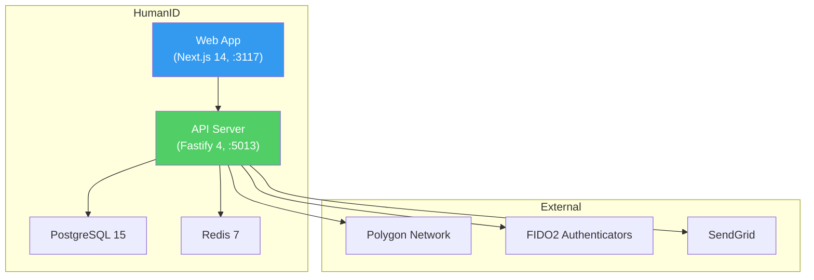

# HumanID — Product Addendum

## Product Overview

**HumanID** is a universal digital identity platform that gives every human on Earth a secure, verifiable digital ID. Built on decentralized principles with blockchain-anchored credentials and biometric proofing, it enables identity verification without centralized authorities.

### Key Value Proposition
- Self-sovereign identity: users own and control their digital ID
- Verifiable credentials: W3C-compliant, cryptographically signed, tamper-evident
- Selective disclosure: zero-knowledge proofs reveal only what is needed
- Blockchain anchoring: immutable proof of identity events on Polygon
- Developer-first: SDK and API for easy integration

### Market Context
- $34.5B digital identity market (2024), growing to $83.2B by 2030 (16.2% CAGR)
- Decentralized identity segment growing at 88.7% CAGR
- No platform combines W3C standards + biometric proofing + ZKP + developer API
- Competitors: Worldcoin (crypto-native), Civic (crypto-native), Microsoft Entra Verified ID (enterprise), Polygon ID (crypto-native)

## Vision

8 billion people. One identity standard. Zero central control.

## Tech Stack

| Layer | Technology | Notes |
|-------|-----------|-------|
| Frontend | Next.js 14+ / React 18+ | App Router, Tailwind CSS, shadcn/ui |
| Backend | Fastify 4 + TypeScript | Plugin architecture |
| Database | PostgreSQL 15+ via Prisma | Primary data store (14 tables) |
| Cache / Pub/Sub | Redis 7 | Rate limiting, session cache, real-time events |
| Identity | W3C DIDs, Verifiable Credentials | Core identity standards |
| Blockchain | Polygon (L2) | Event anchoring, low gas cost |
| Biometrics | FIDO2 / WebAuthn | On-device biometric authentication |
| Crypto | libsodium / noble-ed25519 | Key generation, signing, ZKP |
| ZKP | snarkjs / circom (WASM) | Zero-knowledge proof engine |
| Auth | JWT + API Keys | Dual auth pattern |
| Email | SendGrid | Transactional email |
| Testing | Jest (unit), Playwright (E2E) | TDD mandatory |

## Port Assignments

| Service | Port | URL |
|---------|------|-----|
| Frontend (Web) | 3117 | http://localhost:3117 |
| Backend (API) | 5013 | http://localhost:5013 |

## Key Domains

- **Identity Issuance**: Creating and provisioning new digital identities (DIDs)
- **Credential Management**: Issuing, holding, presenting, and verifying credentials (VCs)
- **Biometric Proofing**: Liveness detection and biometric enrollment (FIDO2/WebAuthn)
- **Blockchain Anchoring**: Immutable proof of identity events on Polygon
- **Privacy**: Zero-knowledge proofs for selective disclosure
- **Interoperability**: W3C DID / VC standards compliance
- **Developer Platform**: API keys, SDK, sandbox, usage monitoring

## Conventions

### Branch Naming
- Branch prefix: `feature/humanid/`, `fix/humanid/`, `arch/humanid/`

### Database
- Database: `humanid_dev` (local), containerized for CI

### API Design Patterns
- RESTful API with versioned prefix: `/api/v1/`
- Zod input validation at route boundary
- Service layer for business logic (no logic in route handlers)
- AppError with RFC 7807 problem details
- Structured logging with request correlation
- All identity data encrypted at rest
- PII handling follows GDPR + CCPA compliance patterns

### Key Domain Concepts

| Concept | Description |
|---------|-------------|
| DID | Decentralized Identifier -- globally unique ID owned by the user |
| Verifiable Credential (VC) | Cryptographically signed credential from an issuer |
| Verifiable Presentation (VP) | Holder's response to a verification request |
| Zero-Knowledge Proof (ZKP) | Proof of an attribute without revealing underlying data |
| Wallet | On-device storage for credentials and keys |
| Issuer | Organization that creates and signs credentials |
| Holder | Individual who owns and controls credentials |
| Verifier | Entity that requests and verifies credential presentations |
| Anchor | On-chain hash of an identity event |

### User Roles

- **Holder**: Creates identity, manages credentials, presents to verifiers
- **Issuer**: Issues verifiable credentials to holders
- **Developer**: Integrates verification via API/SDK
- **Verifier**: Verifies presented credentials
- **Admin**: Manages trusted issuers, platform settings, analytics

### Identity Lifecycle
```
Initializing --> BiometricEnrollment --> RecoverySetup --> Active
Active --> Suspended | Recovering | Deactivated
```

### Credential Lifecycle
```
Offered --> Accepted --> Active --> Presented / Revoked / Expired
```

## Directory Structure

```
products/humanid/
├── apps/
│   ├── api/              # Fastify backend (port 5013)
│   │   ├── src/
│   │   │   ├── plugins/  # Fastify plugins
│   │   │   ├── routes/   # API routes
│   │   │   ├── services/ # Business logic
│   │   │   ├── schemas/  # Zod validation schemas
│   │   │   └── types/    # TypeScript types
│   │   ├── prisma/       # Database schema + migrations
│   │   └── tests/        # Backend tests
│   └── web/              # Next.js frontend (port 3117)
│       ├── src/
│       │   ├── app/      # App Router pages
│       │   ├── components/ # React components
│       │   ├── hooks/    # Custom hooks
│       │   ├── lib/      # Utilities
│       │   └── types/    # Frontend types
│       └── tests/        # Frontend tests
├── packages/             # Shared code (DID utils, crypto)
├── e2e/                  # Playwright E2E tests
├── docs/
│   ├── PRD.md           # Product Requirements
│   ├── architecture.md  # System architecture
│   ├── API.md           # API documentation
│   ├── ADRs/            # Architecture decisions
│   ├── specs/           # Feature specifications
│   └── test-reports/    # QA test reports
├── .claude/
│   ├── addendum.md      # This file
│   └── task-graph.yml   # Active task graph
└── README.md
```

---

## Site Map

### Route Overview (42 routes total, 26 MVP)

| Section | Route Prefix | MVP Routes | Coming Soon |
|---------|-------------|------------|-------------|
| Public | `/` | 10 | 1 |
| Wallet (Holder) | `/wallet` | 6 | 1 |
| Issuer Dashboard | `/issuer` | 6 | 1 |
| Developer Portal | `/developer` | 4 | 4 |
| Admin Panel | `/admin` | 3 | 4 |

Full route registry: See PRD Section 11.2

---

## Technical Architecture

### System Components



| Component | Technology | Responsibility |
|-----------|-----------|----------------|
| Web App | Next.js 14, React 18, Tailwind | UI: wallet, issuer dashboard, developer portal, admin |
| API Server | Fastify 4, TypeScript | REST API, identity operations, credential engine, verification |
| Identity Tier | DID Service, Credential Service, ZKP Engine, Biometric Service | Core identity logic |
| Database | PostgreSQL 15 via Prisma | Primary data store (14 tables) |
| Cache | Redis 7 | Rate limiting, session cache, pub/sub |
| Blockchain | Polygon (L2) | Identity event anchoring |
| Auth | JWT + API key dual authentication | User and developer auth |

### API Surface Summary

| Area | Endpoints | Method Summary |
|------|-----------|----------------|
| Auth | 5 | Register, login, refresh, logout, verify-email |
| DIDs | 4 | Create, resolve, update, deactivate |
| Credentials | 6 | Issue, receive, list, get, revoke, batch |
| Verification | 4 | Request, present, status, result |
| Issuers | 4 | Register, verify, list, revoke |
| Developers | 4 | Register, API keys, usage, sandbox |
| Admin | 4 | Issuers, users, analytics, audit |
| Templates | 3 | List, create, update |
| Wallet | 3 | Credentials, sharing-history, scan |
| **Total** | **37** | |

All endpoints use `/api/v1/` prefix.

### Data Model Overview

14 tables organized into 5 domains:

| Domain | Tables | Key Entity |
|--------|--------|-----------|
| Identity | users, dids, did_documents, biometric_bindings, recovery_configs, sessions | DID |
| Credentials | credentials, credential_templates, credential_presentations | Credential |
| Verification | verification_requests | Verification Request |
| Issuers | issuers | Issuer |
| Infrastructure | blockchain_anchors, api_keys, audit_logs | Blockchain Anchor |

Full ER diagram: See PRD Section 8.

### Plugin Registration Order (Fastify)

```
1. Observability (Pino logging)
2. Prisma (database connection)
3. Redis (cache, pub/sub)
4. Rate Limit (Redis-backed)
5. Auth (JWT + API key plugin)
6. CORS
7. Routes (auth, dids, credentials, verify, issuers, developers, admin)
```

### Reused ConnectSW Packages

| Package | Usage |
|---------|-------|
| `@connectsw/auth` | JWT + API key auth plugin, auth routes, frontend useAuth hook |
| `@connectsw/ui` | Button, Card, Input, Badge, DataTable, DashboardLayout, Sidebar |
| `@connectsw/shared` | Logger, crypto utils, Prisma plugin, Redis plugin |

---

## Business Logic

### Identity Creation Rules
1. One primary DID per user (secondary DIDs allowed for organizational use)
2. Biometric enrollment is mandatory for full identity; face capture + liveness is minimum
3. Recovery setup is recommended but can be skipped (warning persists)
4. DID creation succeeds even if blockchain anchoring is delayed (async anchoring)

### Credential Issuance Rules
1. Only organizations in the trusted issuer registry can issue credentials
2. Credentials must conform to a registered template schema
3. Batch issuance limited to 500 per request
4. Credential offers expire after 7 days if not accepted

### Verification Rules
1. Verification checks (in order): signature, issuer trust, revocation, expiry
2. All four checks must pass for `verified: true`
3. ZKP verification validates proof without accessing underlying data
4. Verification results are logged in audit_logs for compliance

### Blockchain Anchoring Rules
1. DID creation, credential issuance, and revocation trigger anchoring
2. Anchoring is asynchronous -- never blocks the user flow
3. Failed transactions retry up to 3 times with increasing gas
4. After 3 failures, the event is queued for manual retry and an alert is raised

### Rate Limiting
| Tier | Rate Limit | Use Case |
|------|-----------|----------|
| Sandbox | 100 req/hr | Developer testing |
| Production | 10,000 req/hr | Standard production use |
| Enterprise | Custom | Negotiated per contract |

### Privacy Rules
1. Biometric templates NEVER leave the device
2. Credential claims encrypted at rest (AES-256-GCM)
3. Private keys NEVER leave the device
4. Selective disclosure via ZKP is the default for attribute verification
5. Sharing history tracks all presentations; holders can revoke at any time

---

## Key Documents

- **PRD**: `products/humanid/docs/PRD.md`
- **Architecture**: `products/humanid/docs/architecture.md` (to be created)
- **API Contract**: `products/humanid/docs/API.md` (to be created)
- **ADRs**: `products/humanid/docs/ADRs/`
- **Task Graph**: `products/humanid/.claude/task-graph.yml`

---

*This addendum is the source of truth for HumanID product context. Updated: February 19, 2026.*
