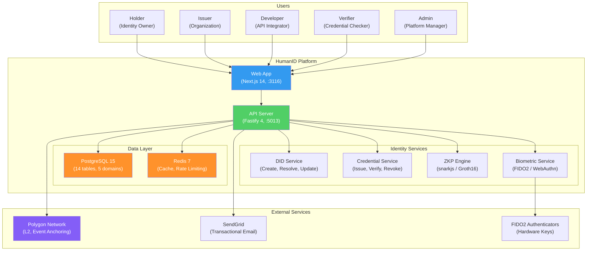
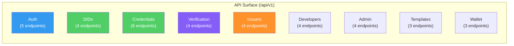
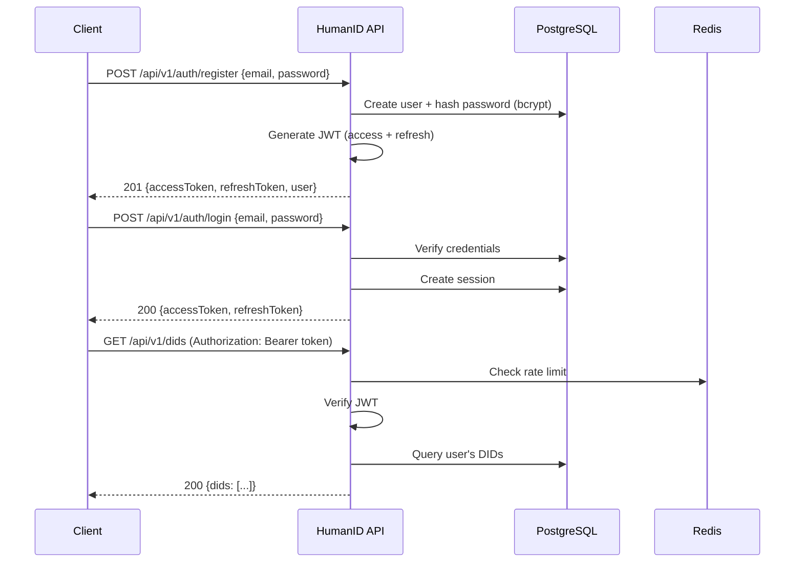
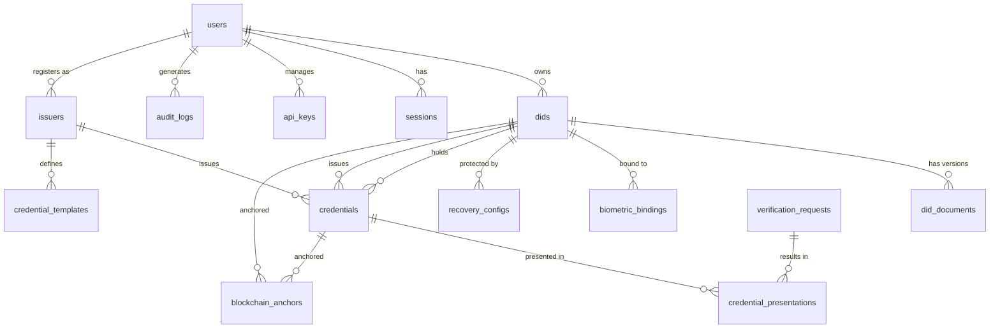

# HumanID — Universal Digital Identity Platform

> 8 billion people. One identity standard. Zero central control.

HumanID gives every human a secure, verifiable digital identity. Built on decentralized principles with blockchain-anchored credentials and biometric proofing, it enables identity verification without centralized authorities.

## Why HumanID Exists

The $34.5B digital identity market lacks a platform that combines W3C standards, biometric proofing, zero-knowledge privacy, and a developer-first API. Existing solutions are either crypto-native (Worldcoin, Civic), enterprise-locked (Microsoft Entra), or lack privacy-by-design. HumanID fills this gap.

## Architecture Overview



## Key Features

| Feature | Description |
|---------|-------------|
| **Self-Sovereign Identity** | Users own and control their digital ID via DIDs |
| **Verifiable Credentials** | W3C-compliant, cryptographically signed, tamper-evident |
| **Selective Disclosure** | Zero-knowledge proofs reveal only what is needed |
| **Blockchain Anchoring** | Immutable proof of identity events on Polygon |
| **Biometric Proofing** | FIDO2/WebAuthn for secure authentication |
| **Developer API** | 37 RESTful endpoints with API key authentication |

## Tech Stack

| Layer | Technology |
|-------|-----------|
| Frontend | Next.js 14, React 18, Tailwind CSS |
| Backend | Fastify 4, TypeScript |
| Database | PostgreSQL 15 via Prisma (14 tables) |
| Cache | Redis 7 |
| Identity | W3C DIDs, Verifiable Credentials |
| Blockchain | Polygon L2 |
| Biometrics | FIDO2 / WebAuthn |
| Crypto | Ed25519, AES-256-GCM, Groth16 ZKP |
| Testing | Jest, Playwright |

## Getting Started

### Prerequisites

- Node.js 20+
- Docker & Docker Compose
- PostgreSQL 15+ (or use Docker)
- Redis 7+ (or use Docker)

### Quick Start

```bash
# 1. Start infrastructure
cd products/humanid
docker compose up -d

# 2. Set up environment
cp .env.example .env
# Edit .env with your values (JWT_SECRET is required)

# 3. Install dependencies
cd apps/api && npm install && cd ../..
cd apps/web && npm install && cd ../..

# 4. Run database migrations
npm run db:migrate

# 5. Generate Prisma client
npm run db:generate

# 6. Start development servers
npm run dev
# API: http://localhost:5013
# Web: http://localhost:3116
```

### Port Assignments

| Service | Port | URL |
|---------|------|-----|
| Frontend (Web) | 3116 | http://localhost:3116 |
| Backend (API) | 5013 | http://localhost:5013 |
| PostgreSQL | 5432 | localhost:5432 |
| Redis | 6379 | localhost:6379 |

## API Overview

37 endpoints organized into 9 areas:



### Key Endpoints

| Endpoint | Method | Description |
|----------|--------|-------------|
| `/api/v1/auth/register` | POST | Create new account |
| `/api/v1/auth/login` | POST | Authenticate and get tokens |
| `/api/v1/dids` | POST | Create a new DID |
| `/api/v1/dids/:did` | GET | Resolve a DID |
| `/api/v1/credentials` | POST | Issue a credential |
| `/api/v1/credentials/:id/verify` | POST | Verify a credential |
| `/api/v1/verify/request` | POST | Create verification request |
| `/api/v1/wallet/credentials` | GET | List holder's credentials |

### Auth Flow



## Data Model

5 domains, 14 tables:



## Project Structure

```
products/humanid/
├── apps/
│   ├── api/                 # Fastify backend (port 5013)
│   │   ├── src/
│   │   │   ├── plugins/     # Fastify plugins (prisma, redis, auth, observability)
│   │   │   ├── routes/v1/   # API routes
│   │   │   ├── services/    # Business logic
│   │   │   ├── utils/       # Logger, crypto, validation
│   │   │   └── types/       # TypeScript types, AppError
│   │   ├── prisma/          # Schema + migrations
│   │   └── tests/           # Integration tests
│   └── web/                 # Next.js frontend (port 3117)
│       └── src/
│           ├── app/         # App Router pages
│           ├── components/  # React components
│           └── hooks/       # Custom hooks
├── docs/
│   ├── PRD.md              # Product Requirements
│   ├── architecture.md     # System Architecture
│   ├── security.md         # Security Considerations
│   ├── openapi.yaml        # API Contract (37 endpoints)
│   └── ADRs/               # 5 Architecture Decision Records
├── docker-compose.yml       # PostgreSQL 15 + Redis 7
├── .env.example             # Environment template
└── README.md                # This file
```

## Documentation

| Document | Description |
|----------|-------------|
| [PRD](docs/PRD.md) | Product Requirements Document |
| [Architecture](docs/architecture.md) | System Architecture |
| [Security](docs/security.md) | Security Considerations |
| [OpenAPI](docs/openapi.yaml) | API Contract (37 endpoints) |
| [ADR-001](docs/ADRs/ADR-001-did-method.md) | Custom DID Method |
| [ADR-002](docs/ADRs/ADR-002-zkp-framework.md) | ZKP Framework Choice |
| [ADR-003](docs/ADRs/ADR-003-blockchain-network.md) | Blockchain Network |
| [ADR-004](docs/ADRs/ADR-004-credential-format.md) | Credential Format |
| [ADR-005](docs/ADRs/ADR-005-key-management.md) | Key Management |

## License

UNLICENSED — ConnectSW Internal
