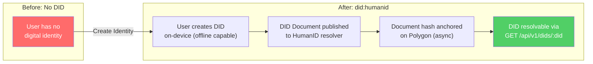
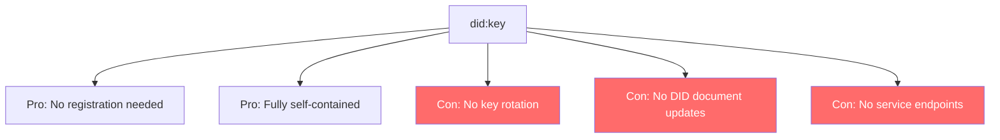

# ADR-001: DID Method Selection

**Status**: Accepted
**Date**: 2026-02-19
**Deciders**: Architect, Product Manager
**Context**: HumanID needs a DID method for decentralized identity creation

---

## Context

HumanID requires a DID (Decentralized Identifier) method to generate globally unique, self-sovereign identifiers for users. The DID method determines how DIDs are created, resolved, updated, and deactivated. This is a foundational decision that affects interoperability, performance, and user experience.

### Requirements

- W3C DID Core 1.0 compliant
- Support Ed25519 key pairs
- Resolvable without depending on a single external service
- Support for key rotation and DID document updates
- Must work offline for DID generation (resolution can be online)
- Blockchain anchoring for tamper evidence

## Decision

We will use a **custom `did:humanid` method** with the following specification:

```
did:humanid:<base58-encoded-ed25519-public-key>
```

DID documents are stored in our PostgreSQL database and resolvable via our API (`GET /api/v1/dids/:did`). Document hashes are anchored on Polygon for tamper evidence.

### DID Resolution Architecture



## Alternatives Considered

### Alternative 1: `did:key`



- **Pros**: No registration needed, fully self-contained, widely supported
- **Cons**: No key rotation (DID changes when key changes), no DID document updates, no service endpoints, no blockchain anchoring
- **Rejected because**: Key rotation is essential for a long-lived identity. Users must be able to rotate keys without changing their DID.

### Alternative 2: `did:web`

- **Pros**: Easy to resolve (HTTPS), human-readable, no blockchain needed
- **Cons**: Depends on DNS/HTTPS infrastructure, centralized resolution, domain ownership required
- **Rejected because**: Introduces centralized dependency on DNS, which contradicts the self-sovereign principle. Domain expiry would invalidate DIDs.

### Alternative 3: `did:ion` (Bitcoin-anchored)

- **Pros**: Fully decentralized, Bitcoin-level security, production proven
- **Cons**: Bitcoin transaction costs ($5-50), slow finality (10-60 min), complex Sidetree protocol
- **Rejected because**: Cost and latency are prohibitive for a universal identity platform targeting 8 billion users.

### Alternative 4: `did:ethr` (Ethereum-based)

- **Pros**: Widely supported, smart contract registry, well-documented
- **Cons**: L1 gas costs ($1-20), slower resolution, EVM dependency
- **Rejected because**: L1 costs too high. Polygon (L2) is used for anchoring instead, and our custom method gives us more control.

## Consequences

### Positive

- Full control over DID creation, resolution, and lifecycle
- Offline DID generation (key pair created on-device)
- Support for key rotation without changing DID
- DID document versioning with history
- Blockchain anchoring provides tamper evidence without being required for resolution
- Optimized resolution performance (our own database vs external network)

### Negative

- Not resolvable by the Universal Resolver out of the box (requires registering our method)
- We maintain the resolver infrastructure (availability responsibility)
- Interoperability requires other platforms to support `did:humanid`

### Mitigations

- Register `did:humanid` with the DIF Universal Resolver
- Provide a DID resolver library (`@humanid/did-resolver`) for third-party integration
- Use W3C DID Document format for maximum interoperability
- Fallback: support `did:key` for minimal interop scenarios

## Implementation Notes

- DID format: `did:humanid:<base58(ed25519_pubkey)>`
- Resolution endpoint: `GET /api/v1/dids/{did}` (returns W3C DID Document)
- Library: `@noble/ed25519` for key generation
- Storage: PostgreSQL (dids + did_documents tables)
- Anchoring: SHA-256 hash of DID document on Polygon
