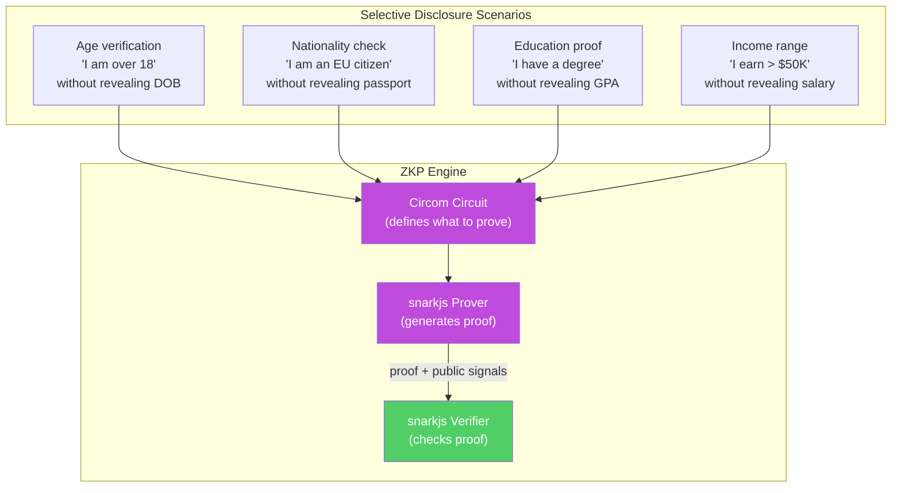
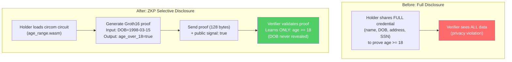

# ADR-002: Zero-Knowledge Proof Framework

**Status**: Accepted
**Date**: 2026-02-19
**Deciders**: Architect, Security Engineer
**Context**: HumanID needs ZKP for selective credential disclosure

---

## Context

HumanID's core value proposition includes selective disclosure: proving an attribute (e.g., "age >= 18") without revealing the underlying data (e.g., date of birth). This requires a zero-knowledge proof (ZKP) system that can:

1. Generate proofs on the client side (browser/mobile)
2. Verify proofs on the server side
3. Support common predicate types (equality, range, membership)
4. Run within 5 seconds on mid-range smartphones (NFR-003)
5. Be auditable and based on well-studied cryptography

### ZKP Use Cases in HumanID

## Decision

We will use **snarkjs + circom** as our ZKP framework:

- **circom**: Circuit compiler for defining ZKP circuits (what can be proven)
- **snarkjs**: JavaScript library for Groth16 proof generation and verification
- **WASM**: Circuits compiled to WebAssembly for browser execution

### Proof System: Groth16

- Proof size: 3 group elements (~128 bytes) -- minimal network overhead
- Verification time: ~10ms (constant time) -- well within our 2s verification target
- Proving time: 1-5 seconds depending on circuit complexity
- Trusted setup: Required per circuit (one-time ceremony)

### Architecture

## Alternatives Considered

### Alternative 1: PLONK (via snarkjs)

- **Pros**: Universal trusted setup (no per-circuit ceremony), supported by snarkjs
- **Cons**: Larger proof size (~2.5KB vs 128 bytes), slower verification (~50ms vs ~10ms)
- **Rejected because**: Groth16's smaller proof size and faster verification are better suited for our use case. We have a finite set of circuits (age range, membership, equality), so per-circuit trusted setup is manageable.

### Alternative 2: Bulletproofs (via bulletproofs-js)

- **Pros**: No trusted setup at all, good for range proofs
- **Cons**: Larger proofs (~700 bytes), linear verification time, limited JavaScript support, less mature WASM tooling
- **Rejected because**: JavaScript/WASM tooling is less mature. Verification time scales linearly with circuit size, which could exceed our 2s target for complex proofs.

### Alternative 3: STARKs (via starkjs)

- **Pros**: No trusted setup, post-quantum secure, transparent
- **Cons**: Very large proofs (~50-200KB), slower generation, immature browser tooling
- **Rejected because**: Proof size is prohibitive for mobile/browser use. Browser tooling is not production-ready.

### Alternative 4: Polygon ID's Iden3 protocol

- **Pros**: Purpose-built for identity ZKP, Polygon ecosystem, production proven
- **Cons**: Tight coupling to Polygon ecosystem, less flexibility for custom predicates, complex integration
- **Rejected because**: Too tightly coupled to Polygon's specific identity protocol. We need flexibility to define custom circuits for various credential types.

## Consequences

### Positive

- Groth16 proofs are tiny (128 bytes) -- minimal bandwidth impact
- Constant-time verification (~10ms) -- exceeds our 2s target
- circom is the most widely used ZKP circuit language with strong community
- WASM compilation enables browser-side proof generation
- snarkjs is actively maintained by iden3/Polygon team
- Well-studied cryptography (BN128 curve, 128-bit security level)

### Negative

- Trusted setup ceremony required for each circuit (one-time, manageable)
- Groth16 is not post-quantum secure (adequate for next 10+ years)
- Circuit development requires specialized knowledge (circom language)
- Proving key files can be large (10-50MB) -- requires caching strategy

### Mitigations

- Pre-compile and cache WASM circuits and proving keys on client
- Use Web Workers for proof generation (non-blocking UI)
- Start with 4 standard circuits (age_range, membership, equality, income_range)
- Document trusted setup process for auditing
- Monitor post-quantum ZKP developments for future migration path

## Implementation Notes

### Pre-built Circuits (MVP)

| Circuit | Input | Public Output | Use Case |
|---------|-------|--------------|----------|
| `age_range` | date_of_birth, threshold | age_over_threshold (bool) | Age verification |
| `membership` | value, set_hash | is_member (bool) | Country/group membership |
| `equality` | attribute, expected_hash | matches (bool) | Exact attribute match |
| `range` | value, min, max | in_range (bool) | Income/score ranges |

### Client-Side Flow

1. Load circuit WASM + proving key (cached after first load)
2. Prepare witness (private inputs from credential)
3. Generate Groth16 proof via Web Worker (1-5s)
4. Send proof + public signals to API
5. Server verifies proof with verification key (~10ms)

### Dependencies

- `snarkjs`: ^0.7.0 (proof generation + verification)
- `circomlib`: ^2.0.0 (standard circuit components)
- `circom`: ^2.1.0 (circuit compiler, build-time only)
