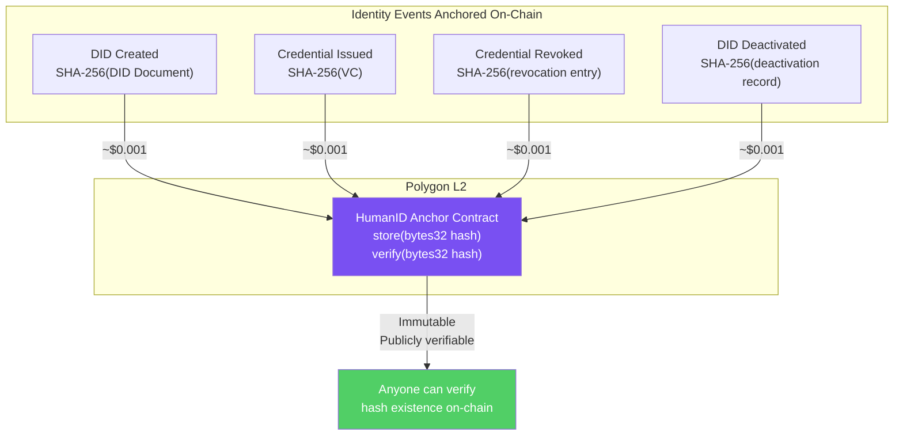
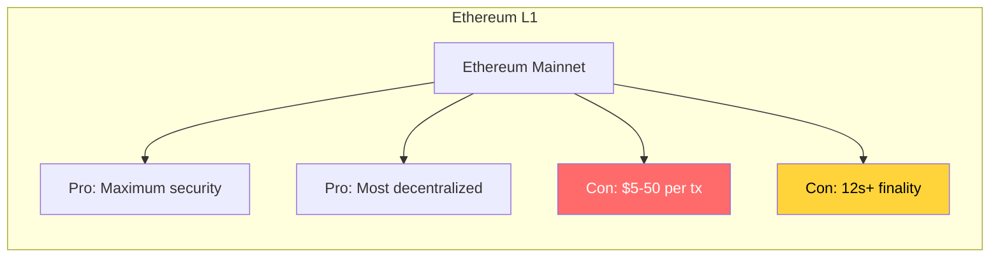

# ADR-003: Blockchain Network for Identity Anchoring

**Status**: Accepted
**Date**: 2026-02-19
**Deciders**: Architect, CTO
**Context**: HumanID needs a blockchain for anchoring identity events

---

## Context

HumanID anchors hashes of critical identity events (DID creation, credential issuance, revocation) on a blockchain. This provides an immutable, publicly verifiable audit trail. The blockchain serves as a tamper-evidence layer, not as the primary data store.

### Anchoring Requirements

- Low cost per transaction (targeting $0.01 or less)
- Fast finality (under 30 seconds, per FR-025)
- Public and verifiable by anyone
- EVM compatible (to leverage existing tooling)
- Production-proven with high uptime
- Supports simple data storage (hash anchoring)

### What Gets Anchored



## Decision

We will use **Polygon PoS (L2)** for identity event anchoring.

### Cost Analysis

| Network | Avg Tx Cost | 10K DIDs/month | 50K Creds/month | Annual Cost |
|---------|-------------|----------------|-----------------|-------------|
| **Polygon PoS** | **~$0.001** | **$10** | **$50** | **~$720** |
| Ethereum L1 | ~$5-50 | $50K-500K | $250K-2.5M | Prohibitive |
| Arbitrum | ~$0.01 | $100 | $500 | ~$7,200 |
| Solana | ~$0.0003 | $3 | $15 | ~$216 |
| Base | ~$0.005 | $50 | $250 | ~$3,600 |

Polygon PoS provides the optimal balance of cost, finality speed, and ecosystem maturity.

## Alternatives Considered

### Alternative 1: Ethereum L1



- **Pros**: Highest security, most decentralized, universally recognized
- **Cons**: $5-50 per transaction (prohibitive at scale), 12-second block time
- **Rejected because**: At 60K events/month (MVP target), L1 costs would be $300K-3M/year. Identity anchoring does not require L1 security -- the hashes are already tamper-evident by design.

### Alternative 2: Solana

- **Pros**: Extremely low cost (~$0.0003), sub-second finality, high throughput
- **Cons**: Not EVM compatible, different tooling ecosystem, past outages (2022-2023), Rust-based smart contracts
- **Rejected because**: Non-EVM tooling adds development cost. ConnectSW already has Polygon/Ethereum expertise from stablecoin-gateway. Solana's outage history is a concern for an identity platform.

### Alternative 3: Arbitrum

- **Pros**: EVM compatible, lower cost than L1, 7-day fraud proofs
- **Cons**: 7-day challenge period for L1 finality, higher cost than Polygon ($0.01 vs $0.001)
- **Rejected because**: The 7-day challenge period means anchored events are not truly final for a week. Polygon's 2-second finality is better for identity events that need quick verification.

### Alternative 4: No Blockchain (Database Only)

- **Pros**: Zero cost, fastest, simplest
- **Cons**: No public verifiability, no tamper evidence, requires trust in HumanID
- **Rejected because**: Public verifiability is a core value proposition. Users and verifiers need the ability to independently verify that identity events were recorded at a specific time. Database-only would make HumanID a centralized authority -- contrary to our mission.

## Consequences

### Positive

- Transaction cost ~$0.001 (annual cost ~$720 for MVP volume)
- 2-second block finality (well within 30s target)
- EVM compatible -- reuse Solidity tooling, ethers.js
- ConnectSW already has Polygon expertise (stablecoin-gateway)
- Shared infrastructure potential with stablecoin-gateway
- Public and verifiable by anyone with a block explorer
- Large validator set (100+ validators)

### Negative

- Polygon PoS is less decentralized than Ethereum L1
- Dependent on Polygon network availability
- Requires managing a hot wallet with MATIC for gas
- Polygon has undergone rebranding/reorganization (AggLayer)

### Mitigations

- Async anchoring: blockchain unavailability never blocks user flows
- Retry logic: 3 retries with gas escalation before queuing
- Hot wallet with spending limits and monitoring
- Future: support multi-chain anchoring (Ethereum L1 for high-value events)
- Store data hash in our DB as primary source; blockchain is supplementary proof

## Implementation Notes

### Smart Contract

```solidity
// Minimal anchoring contract
contract HumanIDAnchor {
    event Anchored(bytes32 indexed hash, uint256 timestamp);
    mapping(bytes32 => uint256) public anchors;

    function anchor(bytes32 hash) external {
        require(anchors[hash] == 0, "Already anchored");
        anchors[hash] = block.timestamp;
        emit Anchored(hash, block.timestamp);
    }

    function verify(bytes32 hash) external view returns (uint256) {
        return anchors[hash]; // 0 = not anchored
    }
}
```

### Gas Management

- Hot wallet funded with MATIC
- Alert at 0.5 MATIC balance
- Gas price: dynamic (1.1x current base fee)
- Retry gas: 1.5x, 2.0x, 3.0x escalation
- After 3 failures: queue for manual intervention

### Libraries

- `ethers`: ^6.0 (Polygon interaction)
- Network: Polygon PoS Mainnet (chainId: 137)
- Testnet: Polygon Amoy (chainId: 80002)
- RPC: Alchemy or QuickNode (reliable RPC provider)
