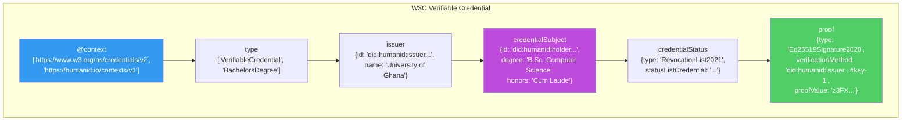
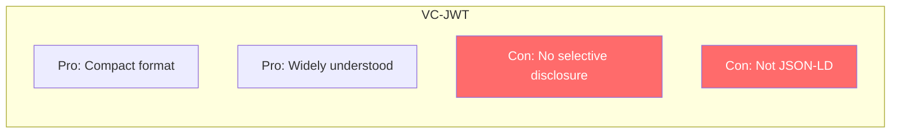

# ADR-004: Credential Format

**Status**: Accepted
**Date**: 2026-02-19
**Deciders**: Architect, Product Manager
**Context**: HumanID needs a standard format for verifiable credentials

---

## Context

HumanID issues, stores, and verifies digital credentials. The credential format determines interoperability with other identity platforms, proof mechanisms, and data structure. The choice must support:

- Cryptographic signatures for tamper evidence
- Selective disclosure of individual claims
- Schema validation for consistent data
- Interoperability with other identity platforms
- JSON-based for web-native processing

## Decision

We will use **W3C Verifiable Credentials Data Model 2.0** with **JSON-LD** encoding and **Ed25519Signature2020** proof suite.

### Credential Structure



### Example Credential

```json
{
  "@context": [
    "https://www.w3.org/ns/credentials/v2",
    "https://humanid.io/contexts/v1"
  ],
  "type": ["VerifiableCredential", "BachelorsDegree"],
  "issuer": {
    "id": "did:humanid:z6MkissuerPublicKey...",
    "name": "University of Ghana"
  },
  "validFrom": "2026-06-15T00:00:00Z",
  "validUntil": "2036-06-15T00:00:00Z",
  "credentialSubject": {
    "id": "did:humanid:z6MkholderPublicKey...",
    "degree": "Bachelor of Science",
    "field": "Computer Science",
    "honors": "Cum Laude",
    "graduationDate": "2025-06-15"
  },
  "credentialStatus": {
    "id": "https://api.humanid.io/v1/credentials/status/123",
    "type": "RevocationList2021"
  },
  "proof": {
    "type": "Ed25519Signature2020",
    "created": "2026-06-15T10:30:00Z",
    "verificationMethod": "did:humanid:z6MkissuerPublicKey...#key-1",
    "proofPurpose": "assertionMethod",
    "proofValue": "z3FXr8tLm9..."
  }
}
```

## Alternatives Considered

### Alternative 1: JWT-based Verifiable Credentials (VC-JWT)



- **Pros**: Compact format, widely understood by web developers, simpler parsing
- **Cons**: No native selective disclosure (entire JWT is revealed or nothing), not JSON-LD (less semantic richness), harder to extend with new credential types
- **Rejected because**: Selective disclosure is a core requirement. VC-JWT requires revealing the entire token, which contradicts our privacy-first approach.

### Alternative 2: AnonCreds (Hyperledger)

- **Pros**: Built-in selective disclosure, ZKP-native, designed for identity
- **Cons**: Hyperledger-specific format, not W3C standard, CL signatures (larger, slower), smaller ecosystem
- **Rejected because**: Not W3C standard, limiting interoperability. CL signatures are larger and slower than Ed25519. Hyperledger Indy/Aries ecosystem is shrinking.

### Alternative 3: SD-JWT (Selective Disclosure JWT)

- **Pros**: Selective disclosure via hash-based mechanism, IETF draft standard, simpler than ZKP
- **Cons**: Still JWT-based (not JSON-LD), limited predicate proofs (cannot prove "age > 18" without revealing age), IETF draft (not final)
- **Rejected because**: Cannot support predicate proofs (range proofs, membership proofs). Our ZKP approach via Groth16 provides stronger privacy guarantees.

## Consequences

### Positive

- Full W3C standard compliance -- interoperable with any VC-compliant platform
- JSON-LD provides semantic richness and extensibility
- Ed25519Signature2020 is fast, compact, and well-audited
- Selective disclosure achieved via our ZKP layer (ADR-002)
- Credential schemas can be extended without breaking changes
- Claims are stored encrypted (AES-256-GCM) with only hashes exposed

### Negative

- JSON-LD processing adds complexity (context resolution)
- Larger payload than JWT (~2-5KB vs ~500 bytes)
- Requires maintaining JSON-LD context documents

### Mitigations

- Cache JSON-LD contexts locally (avoid network fetches during verification)
- Compress credentials for storage and transfer
- Define HumanID-specific context (`https://humanid.io/contexts/v1`) for our credential types

## Implementation Notes

### Proof Suite: Ed25519Signature2020

- Library: `@noble/ed25519` for signing
- Canonicalization: JSON-LD canonicalization (URDNA2015) before signing
- Verification: Resolve issuer DID -> get public key -> verify signature

### Credential Storage

- Claims encrypted with AES-256-GCM at rest (`encrypted_claims` column)
- Proof stored as JSON (`proof` column)
- Credential hash (SHA-256) stored for blockchain anchoring

### Supported Credential Types (MVP)

| Type | Schema | Attributes |
|------|--------|-----------|
| NationalID | Identity | name, dob, nationality, document_number |
| BachelorsDegree | Education | degree, field, institution, graduation_date, honors |
| EmploymentVerification | Employment | employer, position, start_date, end_date |
| ProofOfAddress | Finance | address, verified_date, verifier |
