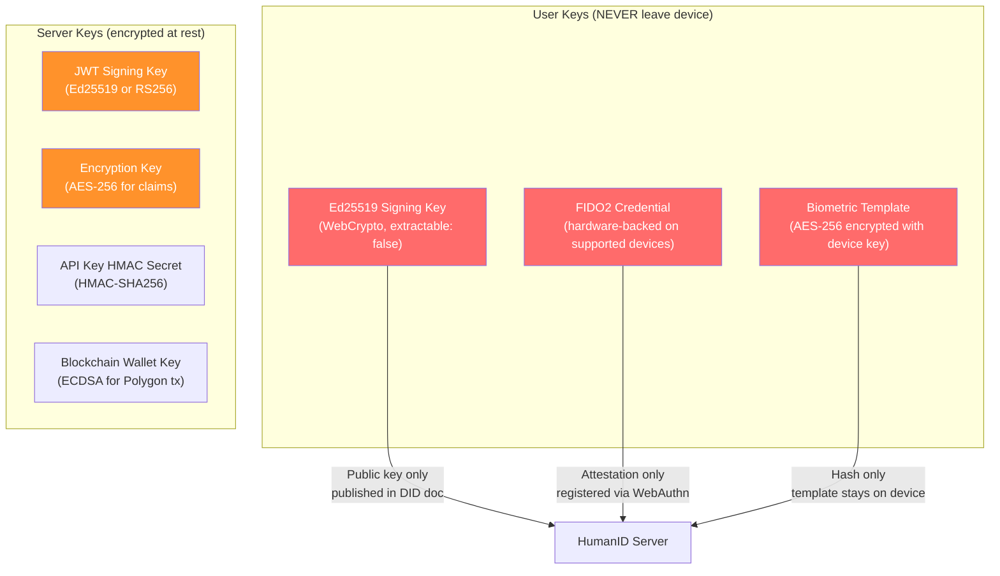
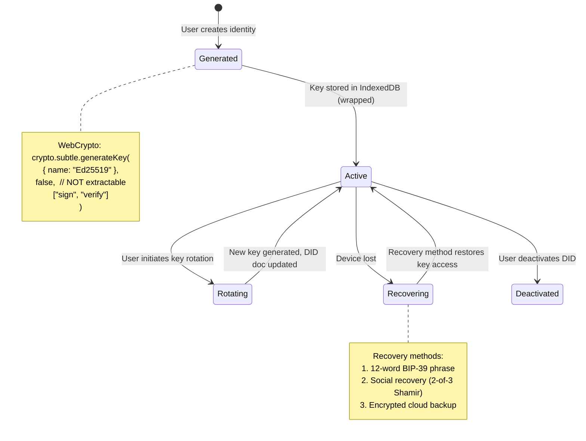
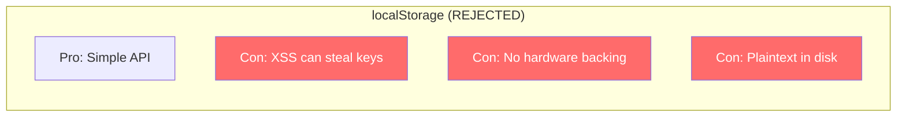

# ADR-005: Key Management Strategy

**Status**: Accepted
**Date**: 2026-02-19
**Deciders**: Architect, Security Engineer
**Context**: HumanID needs a key management strategy for user keys and server keys

---

## Context

HumanID handles multiple types of cryptographic keys:

1. **User signing keys** (Ed25519) -- for DID operations and credential presentations
2. **User biometric keys** (FIDO2/WebAuthn) -- for authentication
3. **Server JWT signing keys** -- for access/refresh tokens
4. **Server encryption keys** -- for credential claim encryption at rest
5. **Server API key hashing secret** -- for API key verification
6. **Blockchain wallet keys** -- for transaction signing

The key management strategy must balance security (keys should never be compromised) with usability (users should not lose access to their identity).

### Key Security Requirements



## Decision

### User Key Management: WebCrypto API with Non-Extractable Keys

User Ed25519 signing keys are generated and stored using the **Web Cryptography API** with `extractable: false`. This means:

- Keys are generated in the browser's secure execution environment
- On devices with hardware security (TPM/Secure Enclave), keys are hardware-backed
- The private key cannot be extracted via JavaScript -- only signing operations are exposed
- Key material never crosses the browser boundary

### Key Lifecycle



### Server Key Management: Environment Variables + Rotation Policy

| Key | Storage | Rotation | Backup |
|-----|---------|----------|--------|
| JWT signing key | `JWT_SECRET` env var | Every 90 days | Encrypted backup |
| Encryption key | `ENCRYPTION_KEY` env var | On-demand (re-encrypt records) | HSM in production |
| HMAC secret | `API_KEY_HMAC_SECRET` env var | Yearly | Encrypted backup |
| Blockchain wallet | `ANCHOR_WALLET_KEY` env var | Per spending limit reset | Multi-sig in production |

## Alternatives Considered

### Alternative 1: localStorage-Based Key Storage



- **Pros**: Simple API, works everywhere
- **Cons**: Vulnerable to XSS (keys extractable via JavaScript), no hardware security module backing, stored as plaintext on disk
- **Rejected because**: Any XSS vulnerability would allow key theft. For an identity platform, this is unacceptable.

### Alternative 2: Cloud-Based Key Management (AWS KMS / GCP KMS)

- **Pros**: HSM-backed, audit trail, automatic rotation, team access controls
- **Cons**: Keys are not self-sovereign (cloud provider controls them), adds latency (network round-trip for every signing), vendor lock-in, costs at scale
- **Rejected because**: Self-sovereign identity requires that the user controls their own keys. Cloud KMS would make HumanID a centralized key authority.

### Alternative 3: Native App with Secure Enclave

- **Pros**: Hardware-level key isolation, biometric-gated access, tamper-resistant
- **Cons**: Requires native app (iOS/Android), not available in MVP (web-only), platform-specific APIs
- **Rejected because**: MVP is web-based. WebCrypto provides adequate security for web with hardware backing on supported devices. Native app with Secure Enclave is planned for the mobile wallet (Future phase).

## Consequences

### Positive

- User keys never leave the device boundary (WebCrypto `extractable: false`)
- Hardware-backed on devices with TPM/Secure Enclave (transparent to code)
- No server-side user key storage -- eliminates a massive attack vector
- Three recovery methods provide resilience without centralized custody
- Server keys follow standard practices (env vars, rotation policy)

### Negative

- WebCrypto key storage ties identity to a specific browser/device
- Key loss without recovery setup means permanent identity loss
- Ed25519 support in WebCrypto is relatively recent (but broadly available)
- IndexedDB storage is per-origin, per-browser

### Mitigations

- Prominent recovery setup during onboarding (persistent warning if skipped)
- Support three independent recovery methods for redundancy
- Future: native mobile app with Secure Enclave for stronger device binding
- Test WebCrypto Ed25519 across top 10 browser/OS combinations

## Implementation Notes

### Client-Side Key Generation

```typescript
// Generate Ed25519 key pair (non-extractable)
const keyPair = await crypto.subtle.generateKey(
  { name: "Ed25519" },
  false, // NOT extractable
  ["sign", "verify"]
);

// Export public key only (for DID document)
const publicKeyBuffer = await crypto.subtle.exportKey(
  "raw",
  keyPair.publicKey
);
const publicKeyBase58 = base58.encode(new Uint8Array(publicKeyBuffer));
const did = `did:humanid:${publicKeyBase58}`;

// Sign data
const signature = await crypto.subtle.sign(
  { name: "Ed25519" },
  keyPair.privateKey,
  dataBuffer
);
```

### Recovery Methods

| Method | Mechanism | Security | Usability |
|--------|-----------|----------|-----------|
| Recovery phrase | BIP-39 12-word mnemonic -> seed -> derive new key pair | High (if stored securely) | Medium (must write down) |
| Social recovery | Shamir secret sharing (2-of-3 trusted contacts) | High (requires 2 colluding contacts) | High (familiar trust model) |
| Cloud backup | AES-256-GCM encrypted key material uploaded to cloud | Medium (depends on cloud security) | High (automatic) |

### Dependencies

- WebCrypto API (built into browsers, no external dependency)
- `@noble/ed25519`: Fallback for environments without WebCrypto Ed25519 support
- `bip39`: Recovery phrase generation
- `shamir-secret-sharing`: Social recovery implementation
