# HumanID Product Requirements Document (PRD)

**Document Version**: 1.0
**Date**: February 19, 2026
**Author**: Product Manager, ConnectSW
**Status**: Draft for CEO Review
**Product**: HumanID -- Universal Digital Identity Platform

---

## Table of Contents

1. [Business Context](#1-business-context)
2. [User Personas](#2-user-personas)
3. [User Stories and Acceptance Criteria](#3-user-stories-and-acceptance-criteria)
4. [User Flows](#4-user-flows)
5. [System Architecture (C4 Diagrams)](#5-system-architecture-c4-diagrams)
6. [Sequence Diagrams](#6-sequence-diagrams)
7. [State Diagrams](#7-state-diagrams)
8. [Data Model (ER Diagram)](#8-data-model-er-diagram)
9. [Functional Requirements](#9-functional-requirements)
10. [Non-Functional Requirements](#10-non-functional-requirements)
11. [Site Map](#11-site-map)
12. [Phasing: MVP, Phase 2, Future](#12-phasing-mvp-phase-2-future)
13. [Success Metrics](#13-success-metrics)
14. [Out of Scope](#14-out-of-scope)
15. [Risks and Mitigations](#15-risks-and-mitigations)

---

## 1. Business Context

### 1.1 Problem Statement

**1.1 billion people worldwide lack any form of legally recognized identity** (World Bank ID4D, 2024). Even among the 6.9 billion who have some identity document, verification is fragmented: passports expire, driver's licenses vary by jurisdiction, and digital KYC processes require sharing excessive personal data with every relying party. The current identity landscape suffers from three systemic failures:

1. **Exclusion**: Rural populations, refugees, and stateless persons cannot participate in digital economies because centralized identity systems require physical infrastructure they cannot access.
2. **Privacy erosion**: Every identity verification today requires sharing a full credential (name, DOB, address, photo) even when the verifier only needs a single attribute (e.g., "is this person over 18?").
3. **Single points of failure**: Centralized identity databases (Equifax breach: 147M records, Aadhaar leaks: 1.1B records) create catastrophic attack surfaces.

No existing solution addresses all three problems simultaneously. Government-issued IDs perpetuate exclusion. Federated logins (Google, Apple) concentrate power. Even emerging decentralized identity projects (Worldcoin, Civic, Polygon ID) focus narrowly on crypto wallets rather than building a universal identity layer.

### 1.2 Target Market and Users

The digital identity market is valued at **$34.5B (2024)** and projected to reach **$83.2B by 2030** at a **16.2% CAGR** (MarketsandMarkets). Key segments:

| Segment | Size (2024) | Growth | HumanID Opportunity |
|---------|------------|--------|---------------------|
| Identity verification | $12.8B | 15.4% CAGR | Primary -- credential issuance and verification |
| Decentralized identity | $1.4B | 88.7% CAGR | Core -- fastest-growing segment |
| Biometric authentication | $8.6B | 14.2% CAGR | Enabling -- biometric proofing layer |
| Government ID programs | $11.7B | 12.8% CAGR | Phase 2 -- government partnerships |

**Primary target users**:

- **Individuals** who need a portable, privacy-preserving digital identity
- **Organizations** (employers, banks, universities) that need to verify identity attributes
- **Developers** building applications that require identity verification
- **Governments and NGOs** deploying identity programs for underserved populations

**Initial serviceable obtainable market (SOM)**: $5-10M in Year 1 (developer platform + early enterprise), growing to $50-100M by Year 3 as government and NGO channels open.

### 1.3 Value Proposition

> **For** individuals who need to prove who they are online and organizations who need to verify identity, **HumanID** is a universal digital identity platform **that** gives every person a secure, portable, verifiable digital ID anchored on blockchain and verified through biometric proofing. **Unlike** centralized identity providers (Equifax, TransUnion), big-tech federated logins (Google, Apple), or narrow crypto identity projects (Worldcoin, Civic), **HumanID** is built on open standards (W3C DID/VC), preserves privacy through zero-knowledge proofs, and works for all 8 billion humans regardless of nationality, wealth, or internet connectivity.

### 1.4 Strategic Fit within ConnectSW Portfolio

HumanID is a foundational infrastructure product. Every other ConnectSW product that handles users could eventually integrate HumanID for authentication and identity verification.

| Synergy | Value |
|---------|-------|
| HumanID + Stablecoin Gateway | KYC/AML identity verification for crypto transactions; regulatory compliance |
| HumanID + ConnectGRC | Verifiable credentials for professional certifications; audit-grade identity proofing |
| HumanID + CodeGuardian | Developer identity for code signing and supply-chain attestation |
| Shared blockchain infra | Common Ethereum/Polygon infrastructure across HumanID and Stablecoin Gateway |
| Cross-product SSO | HumanID becomes the identity layer for all ConnectSW products |

**Strategic Fit Score**: 10/10 -- HumanID is a horizontal platform that creates value for every vertical product.

### 1.5 Competitive Differentiation

| Differentiator | HumanID | Worldcoin | Civic | Microsoft Entra Verified ID | Polygon ID |
|---------------|---------|-----------|-------|----------------------------|------------|
| Universal (non-crypto) identity | Yes | No (crypto-native) | No (crypto-native) | Partial (enterprise) | No (crypto-native) |
| Biometric proofing | FIDO2/WebAuthn | Iris scanning (Orb) | Selfie + doc | Delegated to partners | None |
| Zero-knowledge proofs | Yes (selective disclosure) | Limited | No | No | Yes |
| W3C DID/VC standards | Full compliance | No | Partial | Yes | Partial |
| Open source | Core open, enterprise closed | Partial | No | No | Yes |
| Works offline | Planned (Phase 2) | No | No | No | No |
| Pricing | Free for individuals | Free (token incentive) | Paid per verification | Enterprise pricing | Free |

**Key competitive advantage**: HumanID is the only platform combining W3C standards compliance, biometric proofing, zero-knowledge selective disclosure, and a developer-first API -- all without requiring users to own cryptocurrency or specialized hardware.

---

## 2. User Personas

### 2.1 Persona Overview

```mermaid
flowchart TD
    subgraph "Primary Personas (MVP Focus)"
        P1["<b>Amira - Identity Holder</b><br/>28, Refugee resettled in Germany<br/>Needs portable digital ID<br/><i>End user, identity owner</i>"]
        P2["<b>Raj - Developer</b><br/>32, Full-stack engineer in Bangalore<br/>Building fintech app needing KYC<br/><i>API consumer, integrator</i>"]
    end

    subgraph "Secondary Personas"
        P3["<b>Claire - Compliance Officer</b><br/>45, Head of Compliance at a bank<br/>Needs audit-grade identity verification<br/><i>Enterprise buyer, verifier</i>"]
        P4["<b>Kwame - Credential Issuer</b><br/>50, University registrar in Accra<br/>Issues academic credentials digitally<br/><i>Issuer, institutional user</i>"]
    end

    subgraph "Future Personas"
        P5["<b>Elena - Government Official</b><br/>55, Digital identity program director<br/>Deploying national digital ID<br/><i>Government buyer, large-scale deployer</i>"]
    end

    P1 -->|"presents credentials to"| P3
    P2 -->|"integrates verification via API"| P3
    P4 -->|"issues credentials to"| P1
    P5 -.->|"deploys identity programs<br/>(Phase 2)"| P1
```

### 2.2 Amira -- Identity Holder (Primary End User)

| Attribute | Detail |
|-----------|--------|
| **Name** | Amira Hassan |
| **Age** | 28 |
| **Location** | Berlin, Germany (originally Damascus, Syria) |
| **Occupation** | Freelance translator; studying for German language certification |
| **Tech proficiency** | Moderate -- uses smartphone daily, comfortable with apps, not a developer |
| **Current identity situation** | Has UNHCR refugee document, German residence permit (limited), no credit history. Every new service (bank, employer, university) requires re-submitting documents and waiting days for verification. |
| **Key frustration** | "I have to prove who I am over and over. Every time, they want the same documents, and every time it takes days. My identity should be mine to carry." |
| **Desired outcome** | A single digital ID she controls, accepted by banks, employers, and universities. Prove attributes (age, residency, language skills) without sharing her full refugee file. |
| **Device** | Android smartphone (mid-range), intermittent Wi-Fi |
| **Accessibility needs** | Arabic and German language support; offline credential storage for areas with poor connectivity |

**Goals**:
- Create a verifiable digital identity linked to her biometrics
- Store credentials (residence permit, language certification, work history) in a mobile wallet
- Share specific attributes with verifiers without exposing full documents
- Revoke access to shared credentials at any time

**Pain points**:
- Re-verification takes 3-7 business days per service
- Must physically carry paper documents
- No way to prove attributes selectively (must share full documents)
- Lost documents require months to replace

### 2.3 Raj -- Developer (Primary Technical User)

| Attribute | Detail |
|-----------|--------|
| **Name** | Raj Patel |
| **Age** | 32 |
| **Location** | Bangalore, India |
| **Occupation** | Senior full-stack developer at a fintech startup (Series A, 40 employees) |
| **Tech proficiency** | Expert -- 10 years experience, TypeScript/React/Node.js stack |
| **Current identity integration** | Uses Onfido for KYC ($2.50/verification), Twilio for SMS OTP ($0.05/SMS). Frustrated by vendor lock-in, high per-call costs, and inconsistent verification across countries. |
| **Key frustration** | "Every identity provider has a different API, different data formats, different pricing. I need one standard that works everywhere." |
| **Desired outcome** | A single API endpoint that verifies user identity using open standards. SDK that integrates in under 30 minutes. Predictable pricing. |

**Goals**:
- Integrate identity verification into his fintech app with minimal code
- Verify users across 50+ countries with one API
- Reduce per-verification cost from $2.50 to under $0.50
- Maintain compliance with Indian RBI KYC regulations

**Pain points**:
- Each country requires a different KYC provider
- Identity APIs return inconsistent data formats
- Vendor lock-in makes switching expensive
- No standard way to verify credentials issued by third parties

### 2.4 Claire -- Compliance Officer (Secondary Enterprise User)

| Attribute | Detail |
|-----------|--------|
| **Name** | Claire Dubois |
| **Age** | 45 |
| **Location** | London, UK |
| **Occupation** | Head of Compliance, European retail bank (2,000 employees) |
| **Key frustration** | "Our KYC process costs $25 per customer and takes 48 hours. Regulators want real-time verification, but our providers cannot deliver it." |
| **Desired outcome** | Instant, audit-grade identity verification that satisfies PSD2, AMLD6, and eIDAS regulations. Cryptographic proof of every verification for audit trails. |

**Goals**:
- Verify customer identity in under 10 seconds (down from 48 hours)
- Generate immutable audit trails for every verification event
- Reduce KYC costs from $25/customer to under $5/customer
- Comply with EU eIDAS 2.0 digital identity framework

### 2.5 Kwame -- Credential Issuer (Secondary Institutional User)

| Attribute | Detail |
|-----------|--------|
| **Name** | Kwame Mensah |
| **Age** | 50 |
| **Location** | Accra, Ghana |
| **Occupation** | University Registrar, University of Ghana (38,000 students) |
| **Key frustration** | "We issue 8,000 degrees per year on paper. Employers call us to verify each one. We cannot scale this." |
| **Desired outcome** | Issue digital, verifiable academic credentials that graduates can present to any employer worldwide. Eliminate manual verification calls. |

**Goals**:
- Issue W3C Verifiable Credentials for degrees and transcripts
- Allow graduates to store credentials in their digital wallet
- Enable employers to verify credentials instantly without calling the university
- Reduce verification response time from 2 weeks to under 5 seconds

---

## 3. User Stories and Acceptance Criteria

### 3.1 Epic: Identity Creation (EP-01)

#### US-01: Create Decentralized Identifier (DID)

> **As** Amira (Identity Holder), **I want** to create a decentralized digital identity tied to my device **so that** I own my identity without depending on any central authority.

**Priority**: P0 (MVP)

**Acceptance Criteria**:

| AC ID | Given | When | Then |
|-------|-------|------|------|
| AC-01-1 | Amira has installed the HumanID app and has not created an identity | She taps "Create My Identity" | The system generates a DID (did:humanid:...) and a cryptographic key pair stored on-device |
| AC-01-2 | The DID has been generated | The identity creation completes | The DID document is published to the HumanID resolver and the user sees their DID displayed |
| AC-01-3 | Amira has no internet connection | She attempts to create a DID | The system generates the DID and key pair locally and queues the DID document publication for when connectivity resumes |
| AC-01-4 | Amira already has a DID on this device | She attempts to create another DID | The system warns that an existing DID exists and offers to recover it or create a secondary DID |

#### US-02: Biometric Enrollment

> **As** Amira (Identity Holder), **I want** to enroll my biometrics (face and fingerprint) during identity creation **so that** my identity is uniquely bound to me and cannot be impersonated.

**Priority**: P0 (MVP)

**Acceptance Criteria**:

| AC ID | Given | When | Then |
|-------|-------|------|------|
| AC-02-1 | Amira has created a DID and is prompted for biometric enrollment | She follows the face enrollment flow (3 poses captured) | The system stores a biometric template on-device (never transmitted) and creates a biometric binding credential |
| AC-02-2 | Amira is on a device with a fingerprint sensor | She enrolls her fingerprint via FIDO2/WebAuthn | The system registers the FIDO2 credential and links it to her DID |
| AC-02-3 | Amira's face enrollment fails liveness detection | She attempts enrollment with a photo of a face | The system rejects the enrollment with "Liveness check failed. Please try again with your real face" within 3 seconds |
| AC-02-4 | Amira completes biometric enrollment | The enrollment finalizes | The biometric template is encrypted with her device key and a hash of the template is anchored on-chain |

#### US-03: Identity Recovery Setup

> **As** Amira (Identity Holder), **I want** to set up identity recovery options during onboarding **so that** I can recover my identity if I lose my device.

**Priority**: P0 (MVP)

**Acceptance Criteria**:

| AC ID | Given | When | Then |
|-------|-------|------|------|
| AC-03-1 | Amira has completed biometric enrollment | She is prompted to set up recovery | The system offers three recovery methods: (1) recovery phrase (12 words), (2) trusted contacts (social recovery), (3) encrypted cloud backup |
| AC-03-2 | Amira chooses recovery phrase | She writes down the 12-word phrase and confirms by entering words 3, 7, and 11 | The system stores an encrypted recovery key and marks recovery as configured |
| AC-03-3 | Amira chooses trusted contacts | She selects 3 trusted contacts (minimum 2-of-3 required for recovery) | The system creates Shamir secret shares and distributes them to the trusted contacts' DIDs |
| AC-03-4 | Amira skips recovery setup | She taps "Skip for now" | The system creates the identity but displays a persistent warning banner "Recovery not configured -- your identity is at risk if you lose this device" |

### 3.2 Epic: Credential Management (EP-02)

#### US-04: Receive a Verifiable Credential

> **As** Amira (Identity Holder), **I want** to receive a verifiable credential from an issuer (e.g., her university or employer) **so that** I can store it in my wallet and present it when needed.

**Priority**: P0 (MVP)

**Acceptance Criteria**:

| AC ID | Given | When | Then |
|-------|-------|------|------|
| AC-04-1 | Kwame (Issuer) has generated a credential offer for Amira's DID | Amira opens the credential offer (via QR code or deep link) | The system displays the credential details (type, issuer, claims, expiry) and asks "Accept this credential?" |
| AC-04-2 | Amira accepts the credential | She taps "Accept" | The credential is verified (issuer signature checked), stored in her wallet, and a receipt is sent to the issuer |
| AC-04-3 | The credential has an invalid issuer signature | Amira attempts to accept it | The system rejects with "This credential could not be verified. The issuer's signature is invalid." |
| AC-04-4 | Amira receives a credential while offline | The offer is queued | When connectivity resumes, the credential is automatically fetched, verified, and stored |

#### US-05: Present a Credential with Selective Disclosure

> **As** Amira (Identity Holder), **I want** to present only specific attributes from my credentials (e.g., "over 18" without revealing exact date of birth) **so that** I share the minimum information necessary.

**Priority**: P0 (MVP)

**Acceptance Criteria**:

| AC ID | Given | When | Then |
|-------|-------|------|------|
| AC-05-1 | A verifier requests proof that Amira is over 18 | Amira receives the presentation request | The system shows which attributes are requested, which credential will be used, and what will NOT be shared |
| AC-05-2 | Amira approves the selective disclosure | She taps "Share" after reviewing | The system generates a zero-knowledge proof proving "age >= 18" without revealing the actual date of birth, and sends it to the verifier |
| AC-05-3 | Amira denies the presentation request | She taps "Deny" | No data is shared; the verifier receives a "request denied" response |
| AC-05-4 | The verifier requests more attributes than needed | Amira reviews the request | The system highlights which attributes are "required" vs "optional" and allows Amira to uncheck optional attributes |

#### US-06: Revoke a Shared Credential

> **As** Amira (Identity Holder), **I want** to revoke a credential I previously shared **so that** the verifier can no longer use my data.

**Priority**: P1 (MVP)

**Acceptance Criteria**:

| AC ID | Given | When | Then |
|-------|-------|------|------|
| AC-06-1 | Amira previously shared a credential with a verifier | She navigates to "Sharing History" | The system lists all presentations: verifier name, attributes shared, date, and status (active/revoked) |
| AC-06-2 | Amira taps "Revoke" on a shared credential | She confirms the revocation | The system publishes a revocation entry on-chain and notifies the verifier that the credential presentation has been revoked |
| AC-06-3 | A verifier attempts to re-verify a revoked credential | The verifier calls the verification API | The system returns status "revoked" with the revocation timestamp |

### 3.3 Epic: Credential Issuance (EP-03)

#### US-07: Issue a Verifiable Credential

> **As** Kwame (Credential Issuer), **I want** to issue a W3C Verifiable Credential to a student **so that** they can prove their degree to any employer worldwide.

**Priority**: P0 (MVP)

**Acceptance Criteria**:

| AC ID | Given | When | Then |
|-------|-------|------|------|
| AC-07-1 | Kwame is logged into the HumanID issuer dashboard | He selects "Issue Credential" and fills in the credential form (student DID, degree type, date, honors) | The system generates a W3C Verifiable Credential, signs it with the university's DID, and sends a credential offer to the student |
| AC-07-2 | Kwame issues a batch of 500 credentials for a graduating class | He uploads a CSV with student DIDs and credential data | The system processes the batch within 60 seconds and reports success/failure per row |
| AC-07-3 | Kwame attempts to issue a credential with missing required fields | He submits the form with "degree type" empty | The system displays "Degree type is required" and does not issue the credential |
| AC-07-4 | The university's DID is not yet registered as a trusted issuer | Kwame attempts to issue a credential | The system returns "Your organization must complete issuer verification before issuing credentials" |

#### US-08: Manage Credential Templates

> **As** Kwame (Credential Issuer), **I want** to create and manage credential templates **so that** I can issue consistent credentials without re-entering the same schema every time.

**Priority**: P1 (MVP)

**Acceptance Criteria**:

| AC ID | Given | When | Then |
|-------|-------|------|------|
| AC-08-1 | Kwame navigates to "Credential Templates" | He clicks "Create Template" | The system presents a form with fields: template name, credential type, schema (JSON-LD), required attributes, optional attributes, default expiry |
| AC-08-2 | Kwame creates a "Bachelor's Degree" template | He fills in the template and saves | The template is stored and appears in the templates list, available for future issuance |
| AC-08-3 | Kwame edits an existing template | He changes the default expiry from "none" to "10 years" | The template is updated; previously issued credentials using this template are NOT affected |

### 3.4 Epic: Credential Verification (EP-04)

#### US-09: Verify a Presented Credential

> **As** Claire (Compliance Officer), **I want** to verify a credential presented by a customer **so that** I can confirm their identity attributes are authentic and current.

**Priority**: P0 (MVP)

**Acceptance Criteria**:

| AC ID | Given | When | Then |
|-------|-------|------|------|
| AC-09-1 | Claire's bank system sends a verification request to HumanID API | The API receives a verifiable presentation | The system verifies: (1) credential signature, (2) issuer trust status, (3) revocation status, (4) expiry, and returns a verification result within 2 seconds |
| AC-09-2 | The credential passes all checks | Verification completes | The API returns `{"verified": true, "claims": {...}, "issuer": {...}, "confidence": "high"}` with a cryptographic proof of verification |
| AC-09-3 | The credential has been revoked | Verification is attempted | The API returns `{"verified": false, "reason": "credential_revoked", "revoked_at": "..."}` |
| AC-09-4 | The credential's issuer is not in the trusted issuer registry | Verification is attempted | The API returns `{"verified": false, "reason": "untrusted_issuer", "issuer_did": "..."}` |

#### US-10: Request a Credential Presentation

> **As** Claire (Compliance Officer), **I want** to send a presentation request to a customer specifying exactly which attributes I need **so that** I receive only the data required for compliance.

**Priority**: P1 (MVP)

**Acceptance Criteria**:

| AC ID | Given | When | Then |
|-------|-------|------|------|
| AC-10-1 | Claire configures a KYC verification template requiring "full name, date of birth, nationality, proof of address" | She sends a presentation request to a customer's DID | The customer's wallet receives the request showing exactly which attributes are needed |
| AC-10-2 | The customer responds with a verifiable presentation | The presentation arrives at Claire's system | The system auto-verifies and returns structured claims matching the requested attributes |
| AC-10-3 | The customer partially responds (e.g., omits proof of address) | The partial presentation arrives | The system returns verified claims for provided attributes and flags missing attributes |

### 3.5 Epic: Developer Platform (EP-05)

#### US-11: Register as a Developer

> **As** Raj (Developer), **I want** to register for HumanID developer access and get API keys **so that** I can integrate identity verification into my app.

**Priority**: P0 (MVP)

**Acceptance Criteria**:

| AC ID | Given | When | Then |
|-------|-------|------|------|
| AC-11-1 | Raj visits the HumanID developer portal | He clicks "Sign Up" and enters email, password, organization name | The system creates a developer account, sends email verification, and provisions a sandbox API key within 30 seconds |
| AC-11-2 | Raj verifies his email | He clicks the verification link | The system activates his account and redirects to the developer dashboard showing sandbox API key and quick-start guide |
| AC-11-3 | Raj attempts to register with an already-registered email | He submits the form | The system returns "An account with this email already exists" without revealing whether the email is registered (to prevent enumeration) |

#### US-12: Integrate Verification via SDK

> **As** Raj (Developer), **I want** to integrate HumanID verification into my app using an SDK **so that** I can verify users with minimal code.

**Priority**: P0 (MVP)

**Acceptance Criteria**:

| AC ID | Given | When | Then |
|-------|-------|------|------|
| AC-12-1 | Raj has a valid API key and installs the HumanID SDK (`npm install @humanid/sdk`) | He calls `HumanID.verify({ did: '...', attributes: ['name', 'age'] })` | The SDK returns a verified claims object within 3 seconds |
| AC-12-2 | Raj uses an invalid API key | He calls any SDK method | The SDK throws `HumanIDError: Invalid API key` with a link to the docs |
| AC-12-3 | Raj's sandbox API key hits the rate limit (100 requests/hour) | He sends the 101st request | The SDK returns HTTP 429 with `retry-after` header and a message suggesting upgrade to production |

#### US-13: View API Usage and Billing

> **As** Raj (Developer), **I want** to view my API usage, costs, and billing history **so that** I can monitor spending and plan my budget.

**Priority**: P1 (MVP)

**Acceptance Criteria**:

| AC ID | Given | When | Then |
|-------|-------|------|------|
| AC-13-1 | Raj logs into the developer dashboard | He navigates to "Usage & Billing" | The system shows: total verifications (this month), verifications by type, cost breakdown, and trend chart (last 6 months) |
| AC-13-2 | Raj's usage exceeds 80% of his plan limit | The threshold is crossed | The system sends an email alert with current usage and a link to upgrade |
| AC-13-3 | Raj downloads an invoice | He clicks "Download Invoice" for a specific month | The system generates a PDF invoice with line items, tax, and total within 5 seconds |

### 3.6 Epic: Blockchain Anchoring (EP-06)

#### US-14: Anchor Identity Event on Blockchain

> **As** a HumanID system operator, **I want** critical identity events (DID creation, credential issuance, revocation) to be anchored on blockchain **so that** there is an immutable, publicly verifiable record.

**Priority**: P0 (MVP)

**Acceptance Criteria**:

| AC ID | Given | When | Then |
|-------|-------|------|------|
| AC-14-1 | A new DID is created | The identity creation flow completes | The system anchors a hash of the DID document on Polygon within 30 seconds and stores the transaction hash |
| AC-14-2 | A credential is revoked | The revocation is processed | The system anchors the revocation on-chain and the revocation is verifiable by any party within 60 seconds |
| AC-14-3 | The blockchain network is congested | An anchoring transaction is submitted | The system retries with increasing gas price up to 3 times, then queues for retry and logs a warning |
| AC-14-4 | An identity event is anchored | Any party queries the blockchain | The event hash is verifiable on-chain and maps to the corresponding DID or credential via the HumanID resolver |

### 3.7 Epic: Identity Wallet (EP-07)

#### US-15: View and Manage Credentials in Wallet

> **As** Amira (Identity Holder), **I want** a wallet view showing all my credentials organized by category **so that** I can easily find and manage my digital documents.

**Priority**: P0 (MVP)

**Acceptance Criteria**:

| AC ID | Given | When | Then |
|-------|-------|------|------|
| AC-15-1 | Amira opens the HumanID wallet | The wallet loads | She sees credentials organized by category (Identity, Education, Employment, Finance) with issuer name, issue date, and status (active/expired/revoked) |
| AC-15-2 | Amira taps on a credential | She views the credential detail | The system shows all claims, issuer details, issue date, expiry date, blockchain anchor proof, and sharing history |
| AC-15-3 | Amira has no credentials | She opens the wallet | The system shows an empty state with "No credentials yet" and a CTA "Get your first credential" linking to common issuers |

#### US-16: Scan QR Code for Credential Exchange

> **As** Amira (Identity Holder), **I want** to scan a QR code to receive or present credentials **so that** I can exchange credentials in person without typing URLs.

**Priority**: P1 (MVP)

**Acceptance Criteria**:

| AC ID | Given | When | Then |
|-------|-------|------|------|
| AC-16-1 | An issuer displays a credential offer QR code | Amira scans it with the HumanID app | The system decodes the QR, fetches the credential offer, and displays it for acceptance within 3 seconds |
| AC-16-2 | A verifier displays a presentation request QR code | Amira scans it | The system shows which attributes are requested and allows her to approve/deny |
| AC-16-3 | Amira scans an invalid or expired QR code | The scan completes | The system shows "This QR code is invalid or has expired. Please ask for a new one." |

### 3.8 Epic: Platform Administration (EP-08)

#### US-17: Manage Trusted Issuers

> **As** a HumanID platform administrator, **I want** to manage the trusted issuer registry **so that** only verified organizations can issue credentials.

**Priority**: P1 (MVP)

**Acceptance Criteria**:

| AC ID | Given | When | Then |
|-------|-------|------|------|
| AC-17-1 | An organization applies to become a trusted issuer | The admin reviews the application | The system shows: organization name, DID, legal entity verification, credential types requested, and supporting documents |
| AC-17-2 | The admin approves the application | She clicks "Approve" | The organization's DID is added to the trusted issuer registry, and the organization is notified via email |
| AC-17-3 | The admin revokes an issuer's trust status | She clicks "Revoke Trust" with a reason | The issuer is removed from the trusted registry; all future verifications of their credentials return "untrusted_issuer" |

#### US-18: View Platform Analytics

> **As** a HumanID platform administrator, **I want** to view platform-wide analytics **so that** I can monitor adoption, usage patterns, and system health.

**Priority**: P2 (Phase 2)

**Acceptance Criteria**:

| AC ID | Given | When | Then |
|-------|-------|------|------|
| AC-18-1 | The admin navigates to the analytics dashboard | The page loads | She sees: total DIDs created, total credentials issued, verifications per day (chart), top issuers, top verifiers, geographic distribution |
| AC-18-2 | The admin filters by date range | She selects "Last 30 days" | All metrics update to reflect the selected period within 2 seconds |

---

## 4. User Flows

### 4.1 Identity Creation Flow

### 4.2 Credential Issuance Flow

### 4.3 Credential Verification Flow

### 4.4 Developer Integration Flow

---

## 5. System Architecture (C4 Diagrams)

### 5.1 Level 1: System Context

### 5.2 Level 2: Container Diagram

### 5.3 Level 3: Component Diagram (API Server)

---

## 6. Sequence Diagrams

### 6.1 Identity Creation Sequence

### 6.2 Credential Verification Sequence

### 6.3 Developer SDK Integration Sequence

---

## 7. State Diagrams

### 7.1 Identity Lifecycle

### 7.2 Credential Lifecycle

### 7.3 Verification Request Lifecycle

---

## 8. Data Model (ER Diagram)

**Table summary**: 14 tables organized into 5 domains:

| Domain | Tables | Key Entity |
|--------|--------|-----------|
| Identity | users, dids, did_documents, biometric_bindings, recovery_configs, sessions | DID |
| Credentials | credentials, credential_templates, credential_presentations | Credential |
| Verification | verification_requests | Verification Request |
| Issuers | issuers | Issuer |
| Infrastructure | blockchain_anchors, api_keys, audit_logs | Blockchain Anchor |

---

## 9. Functional Requirements

### 9.1 Identity Management

| ID | Requirement | Stories | Priority |
|----|------------|---------|----------|
| FR-001 | The system shall generate a W3C-compliant DID (did:humanid:...) using Ed25519 key pairs stored on the user's device | US-01 | P0 |
| FR-002 | The system shall publish DID documents to the HumanID resolver and make them resolvable via the universal resolver | US-01 | P0 |
| FR-003 | The system shall perform biometric enrollment using FIDO2/WebAuthn for fingerprint and on-device face capture with liveness detection | US-02 | P0 |
| FR-004 | The system shall reject biometric enrollment attempts that fail liveness detection within 3 seconds of capture | US-02 | P0 |
| FR-005 | The system shall store biometric templates only on the user's device, encrypted with the device key; templates shall never be transmitted to the server | US-02 | P0 |
| FR-006 | The system shall support three recovery methods: 12-word recovery phrase, social recovery (Shamir secret sharing with 2-of-3 trusted contacts), and encrypted cloud backup | US-03 | P0 |
| FR-007 | The system shall display a persistent warning when recovery is not configured | US-03 | P0 |

### 9.2 Credential Management

| ID | Requirement | Stories | Priority |
|----|------------|---------|----------|
| FR-008 | The system shall issue W3C Verifiable Credentials signed with the issuer's DID using Ed25519 signatures | US-07 | P0 |
| FR-009 | The system shall support credential offers delivered via QR code and DID-to-DID messaging (deep link) | US-04, US-16 | P0 |
| FR-010 | The system shall verify the issuer's signature on any received credential before storing it in the holder's wallet | US-04 | P0 |
| FR-011 | The system shall store accepted credentials in the holder's encrypted local wallet, organized by category (Identity, Education, Employment, Finance) | US-04, US-15 | P0 |
| FR-012 | The system shall support batch credential issuance of up to 500 credentials via CSV upload, completing within 60 seconds | US-07 | P0 |
| FR-013 | The system shall allow issuers to create, edit, and manage credential templates with customizable schemas, required/optional attributes, and default expiry | US-08 | P1 |
| FR-014 | The system shall support credential revocation by issuers, publishing a revocation entry on-chain within 60 seconds | US-06 | P1 |

### 9.3 Verification and Selective Disclosure

| ID | Requirement | Stories | Priority |
|----|------------|---------|----------|
| FR-015 | The system shall verify presented credentials by checking: (1) credential signature, (2) issuer trust status, (3) revocation status, (4) expiry date -- all within 2 seconds | US-09 | P0 |
| FR-016 | The system shall generate zero-knowledge proofs for selective attribute disclosure (e.g., "age >= 18" without revealing date of birth) | US-05 | P0 |
| FR-017 | The system shall allow holders to review exactly which attributes are requested before approving a presentation, distinguishing required vs. optional attributes | US-05 | P0 |
| FR-018 | The system shall allow holders to revoke previously shared credential presentations | US-06 | P1 |
| FR-019 | The system shall support verifier-initiated presentation requests specifying required and optional attributes | US-10 | P1 |

### 9.4 Developer Platform

| ID | Requirement | Stories | Priority |
|----|------------|---------|----------|
| FR-020 | The system shall provide developer registration with email verification and sandbox API key provisioning within 30 seconds | US-11 | P0 |
| FR-021 | The system shall provide a TypeScript/JavaScript SDK (`@humanid/sdk`) that enables verification integration in under 30 minutes | US-12 | P0 |
| FR-022 | The system shall enforce rate limits per API key: sandbox (100 req/hr), production (10,000 req/hr), enterprise (custom) | US-12, US-13 | P0 |
| FR-023 | The system shall provide a developer dashboard showing API usage, verification counts, cost breakdown, and trend charts | US-13 | P1 |
| FR-024 | The system shall send email alerts when API usage exceeds 80% of the plan limit | US-13 | P1 |

### 9.5 Blockchain Anchoring

| ID | Requirement | Stories | Priority |
|----|------------|---------|----------|
| FR-025 | The system shall anchor hashes of DID creation events on Polygon within 30 seconds of identity creation | US-14 | P0 |
| FR-026 | The system shall anchor hashes of credential issuance and revocation events on Polygon | US-14 | P0 |
| FR-027 | The system shall retry failed blockchain transactions up to 3 times with increasing gas price, then queue for manual retry | US-14 | P0 |
| FR-028 | The system shall provide a public blockchain explorer API for verifying anchored events | US-14 | P1 |

### 9.6 Platform Administration

| ID | Requirement | Stories | Priority |
|----|------------|---------|----------|
| FR-029 | The system shall provide a trusted issuer registry where administrators can approve, suspend, and revoke issuer trust status | US-17 | P1 |
| FR-030 | The system shall provide platform analytics including: total DIDs, total credentials, verifications per day, top issuers, and geographic distribution | US-18 | P2 |

---

## 10. Non-Functional Requirements

### 10.1 Performance

| ID | Requirement | Metric | Priority |
|----|------------|--------|----------|
| NFR-001 | DID creation shall complete (DID generated + DID document published) within 5 seconds (excluding blockchain anchoring) | p95 < 5s | P0 |
| NFR-002 | Credential verification shall complete within 2 seconds | p95 < 2s | P0 |
| NFR-003 | Zero-knowledge proof generation shall complete within 5 seconds on a mid-range smartphone (Snapdragon 7 series) | p95 < 5s | P0 |
| NFR-004 | Batch credential issuance (500 credentials) shall complete within 60 seconds | p95 < 60s | P0 |
| NFR-005 | API response time for standard endpoints shall be under 500ms | p95 < 500ms | P0 |
| NFR-006 | Frontend pages shall achieve a Lighthouse performance score of 90+ | Score >= 90 | P1 |

### 10.2 Security

| ID | Requirement | Metric | Priority |
|----|------------|--------|----------|
| NFR-007 | All biometric templates shall be stored exclusively on the user's device, encrypted with AES-256 using the device key | Zero server-side biometric storage | P0 |
| NFR-008 | All credential claims stored in the database shall be encrypted at rest using AES-256-GCM | 100% encryption | P0 |
| NFR-009 | Private keys shall never leave the user's device; all signing operations shall be performed on-device | Zero key exfiltration vectors | P0 |
| NFR-010 | The API shall implement OWASP Top 10 protections: injection prevention, authentication, access control, encryption, logging | Zero critical vulnerabilities | P0 |
| NFR-011 | JWT tokens shall expire within 15 minutes; refresh tokens within 7 days | Enforced expiry | P0 |
| NFR-012 | All API endpoints shall enforce rate limiting to prevent abuse | Rate limits per NFR tier | P0 |

### 10.3 Privacy and Compliance

| ID | Requirement | Metric | Priority |
|----|------------|--------|----------|
| NFR-013 | The system shall comply with GDPR: right to access, rectification, erasure, and data portability | Full compliance | P0 |
| NFR-014 | The system shall comply with CCPA: disclosure, deletion, and opt-out rights | Full compliance | P0 |
| NFR-015 | The system shall implement data minimization: collect only data necessary for the stated purpose | Audit-verified | P1 |
| NFR-016 | The system shall provide audit logs for all identity events, retained for 7 years per financial compliance requirements | 100% event coverage | P1 |
| NFR-017 | The system shall comply with EU eIDAS 2.0 digital identity framework requirements for credential issuance and verification | Compliance roadmap by Phase 2 | P2 |

### 10.4 Scalability and Reliability

| ID | Requirement | Metric | Priority |
|----|------------|--------|----------|
| NFR-018 | The system shall support 100,000 concurrent identity holders in MVP | Load tested | P0 |
| NFR-019 | The system shall achieve 99.9% uptime for the verification API | SLA: 99.9% | P0 |
| NFR-020 | The database shall be horizontally scalable through read replicas and connection pooling | Measured under load | P1 |
| NFR-021 | The blockchain anchoring service shall degrade gracefully: if the chain is congested, events are queued and retried without blocking the user flow | Zero user-facing failures from chain congestion | P0 |

### 10.5 Accessibility and Internationalization

| ID | Requirement | Metric | Priority |
|----|------------|--------|----------|
| NFR-022 | The web application shall meet WCAG 2.1 AA accessibility standards | Audit score >= 90% | P1 |
| NFR-023 | The application shall support English, Arabic, Spanish, French, and Hindi at launch | 5 languages | P1 |
| NFR-024 | All user-facing text shall be externalized for translation | 100% externalized | P1 |

### 10.6 Infrastructure

| ID | Requirement | Metric | Priority |
|----|------------|--------|----------|
| NFR-025 | CI/CD pipeline shall run all tests and deploy to staging on every PR merge | 100% automation | P0 |
| NFR-026 | All infrastructure shall be defined as code (Docker, Terraform, or equivalent) | 100% IaC | P1 |
| NFR-027 | Logs shall be structured (JSON) with request correlation IDs for distributed tracing | Correlation coverage: 100% | P1 |

---

## 11. Site Map

### 11.1 Site Map Diagram

### 11.2 Route Registry

| Route | Page | Role | MVP | Status |
|-------|------|------|-----|--------|
| `/` | Home / Landing | Public | Yes | To build |
| `/about` | About HumanID | Public | Yes | To build |
| `/pricing` | Pricing Plans | Public | Yes | To build |
| `/docs` | Public Documentation | Public | Yes | To build |
| `/login` | Sign In | Public | Yes | To build |
| `/register` | Create Account | Public | Yes | To build |
| `/verify-email` | Email Verification | Public | Yes | To build |
| `/reset-password` | Password Reset | Public | Yes | To build |
| `/legal/privacy` | Privacy Policy | Public | Yes | To build |
| `/legal/terms` | Terms of Service | Public | Yes | To build |
| `/legal/dpa` | Data Processing Agreement | Public | No | Coming Soon |
| `/wallet` | Credential Overview | Holder | Yes | To build |
| `/wallet/credentials/:id` | Credential Detail | Holder | Yes | To build |
| `/wallet/scan` | QR Scanner | Holder | Yes | To build |
| `/wallet/sharing` | Sharing History | Holder | Yes | To build |
| `/wallet/identity` | My Identity (DID) | Holder | Yes | To build |
| `/wallet/recovery` | Recovery Settings | Holder | Yes | To build |
| `/wallet/settings` | Account Settings | Holder | Yes | To build |
| `/wallet/notifications` | Notifications | Holder | No | Coming Soon |
| `/issuer` | Issuer Dashboard | Issuer | Yes | To build |
| `/issuer/credentials` | Issued Credentials | Issuer | Yes | To build |
| `/issuer/credentials/new` | Issue Credential | Issuer | Yes | To build |
| `/issuer/credentials/batch` | Batch Issue | Issuer | Yes | To build |
| `/issuer/templates` | Credential Templates | Issuer | Yes | To build |
| `/issuer/templates/new` | Create Template | Issuer | Yes | To build |
| `/issuer/verification` | Issuer Verification | Issuer | Yes | To build |
| `/issuer/settings` | Organization Settings | Issuer | No | Coming Soon |
| `/developer` | Developer Dashboard | Developer | Yes | To build |
| `/developer/api-keys` | API Key Management | Developer | Yes | To build |
| `/developer/usage` | Usage & Billing | Developer | No | Coming Soon |
| `/developer/docs` | API Documentation | Developer | Yes | To build |
| `/developer/sdk` | SDK Reference | Developer | Yes | To build |
| `/developer/sandbox` | Sandbox Testing | Developer | Yes | To build |
| `/developer/logs` | API Logs | Developer | No | Coming Soon |
| `/developer/webhooks` | Webhook Configuration | Developer | No | Coming Soon |
| `/developer/settings` | Developer Settings | Developer | No | Coming Soon |
| `/admin` | Admin Dashboard | Admin | Yes | To build |
| `/admin/issuers` | Trusted Issuer Registry | Admin | Yes | To build |
| `/admin/issuers/:id` | Issuer Detail | Admin | Yes | To build |
| `/admin/users` | User Management | Admin | No | Coming Soon |
| `/admin/analytics` | Platform Analytics | Admin | No | Coming Soon |
| `/admin/audit` | Audit Logs | Admin | No | Coming Soon |
| `/admin/blockchain` | Blockchain Monitor | Admin | No | Coming Soon |
| `/admin/settings` | Platform Settings | Admin | No | Coming Soon |

**Total pages**: 42 (26 MVP, 16 Coming Soon)

---

## 12. Phasing: MVP, Phase 2, Future

### 12.1 MVP (3-4 months)

**Goal**: Core identity creation, credential issuance/verification, and developer API.

**Stories included**:

| Story ID | Story | Epic |
|----------|-------|------|
| US-01 | Create Decentralized Identifier (DID) | EP-01 |
| US-02 | Biometric Enrollment | EP-01 |
| US-03 | Identity Recovery Setup | EP-01 |
| US-04 | Receive a Verifiable Credential | EP-02 |
| US-05 | Present a Credential with Selective Disclosure | EP-02 |
| US-07 | Issue a Verifiable Credential | EP-03 |
| US-09 | Verify a Presented Credential | EP-04 |
| US-11 | Register as a Developer | EP-05 |
| US-12 | Integrate Verification via SDK | EP-05 |
| US-14 | Anchor Identity Event on Blockchain | EP-06 |
| US-15 | View and Manage Credentials in Wallet | EP-07 |

**Requirements included**: FR-001 through FR-012, FR-015 through FR-017, FR-020 through FR-022, FR-025 through FR-027, NFR-001 through NFR-012, NFR-018, NFR-019, NFR-021, NFR-025

### 12.2 Phase 2 (2-3 months post-MVP)

**Goal**: Enterprise features, compliance, and ecosystem growth.

**Stories included**:

| Story ID | Story | Epic |
|----------|-------|------|
| US-06 | Revoke a Shared Credential | EP-02 |
| US-08 | Manage Credential Templates | EP-03 |
| US-10 | Request a Credential Presentation | EP-04 |
| US-13 | View API Usage and Billing | EP-05 |
| US-16 | Scan QR Code for Credential Exchange | EP-07 |
| US-17 | Manage Trusted Issuers | EP-08 |

**Additional features**:
- Webhook notifications for verification events
- API usage billing and invoicing
- Bulk issuer onboarding
- Credential schema marketplace
- eIDAS 2.0 compliance module
- Offline credential storage and presentation

### 12.3 Future Vision (6-12 months post-MVP)

| Feature | Description |
|---------|-------------|
| US-18 | Platform analytics dashboard |
| Mobile-native wallet | Standalone iOS/Android app with Secure Enclave integration |
| Government ID integration | Partnership with national ID programs |
| Cross-chain anchoring | Support for multiple L1/L2 chains (Ethereum mainnet, Solana, etc.) |
| Organizational identity | DIDs for companies, departments, devices |
| Delegated issuance | Issuers delegate credential issuance to sub-entities |
| Identity federation | Bridge to existing SAML/OIDC identity providers |
| AI-powered fraud detection | Machine learning for detecting credential fraud patterns |
| Decentralized governance | Token-based governance for protocol decisions |

### 12.4 Phasing Gantt Chart

---

## 13. Success Metrics

### 13.1 MVP Success Criteria (3 months post-launch)

| Metric | Target | Measurement |
|--------|--------|-------------|
| DIDs created | 10,000 | Database count |
| Credentials issued | 50,000 | Database count |
| Verifications per day | 1,000 | API analytics |
| Developer registrations | 500 | Database count |
| SDK integrations (production) | 50 | API key activations |
| Verification API uptime | 99.9% | Monitoring (e.g., Datadog) |
| Verification p95 latency | < 2 seconds | APM monitoring |
| DID creation p95 latency | < 5 seconds | APM monitoring |
| Critical security vulnerabilities | 0 | Security audit |

### 13.2 Phase 2 Success Criteria (6 months post-launch)

| Metric | Target | Measurement |
|--------|--------|-------------|
| DIDs created | 100,000 | Database count |
| Credentials issued | 500,000 | Database count |
| Verifications per day | 10,000 | API analytics |
| Enterprise customers (paid) | 20 | CRM |
| Issuer organizations | 100 | Trusted issuer registry |
| API revenue (MRR) | $50,000 | Billing system |
| Developer NPS | > 50 | Survey |
| Credential types in ecosystem | 25 | Template registry |

### 13.3 North Star Metric

**Verified identity interactions per month** -- The total number of successful credential verifications across the platform. This metric captures the network effect: more holders + more issuers + more verifiers = exponential growth in verification volume.

---

## 14. Out of Scope

The following are explicitly excluded from the current product scope. They are documented here to prevent scope creep and set stakeholder expectations.

| Item | Reason | When it might be addressed |
|------|--------|---------------------------|
| Mobile-native wallet app (iOS/Android) | MVP uses responsive web wallet; native app requires Secure Enclave integration | Future (6-12 months) |
| Government-issued national ID integration | Requires government partnerships and regulatory approval | Future (requires partnerships) |
| Cryptocurrency token / tokenomics | HumanID is an identity platform, not a crypto project | Not planned |
| CRDT-based real-time collaboration | No collaborative editing use case in MVP | Not planned |
| Custom blockchain / L1 network | Use existing Polygon L2; no value in running custom chain | Not planned |
| Biometric template server storage | Privacy mandate: biometrics stay on-device | Never -- this is a design principle |
| Legacy SAML/OIDC federation bridge | MVP focuses on DID/VC standards | Phase 2 or Future |
| AI-powered fraud detection | Requires training data from real usage | Future (12+ months) |
| Multi-language support beyond 5 languages | 5 languages cover 3.5B+ speakers | Phase 2 |
| Compliance certifications (SOC 2, ISO 27001) | Requires operational history | Phase 2 |

---

## 15. Risks and Mitigations

### 15.1 Technical Risks

| Risk | Probability | Impact | Mitigation |
|------|-------------|--------|------------|
| **ZKP computation too slow on mobile browsers** | Medium | High | Use WebAssembly for ZKP operations; pre-compute proofs where possible; fall back to selective disclosure without ZKP if needed |
| **Blockchain congestion delays anchoring** | Medium | Medium | Anchor asynchronously (never block user flow); retry with increasing gas; batch multiple events per transaction |
| **FIDO2/WebAuthn browser compatibility** | Low | Medium | Feature detection with fallback to PIN-based authentication; test on top 10 browser/OS combinations |
| **Ed25519 key management across devices** | Medium | High | Use WebCrypto API with non-extractable keys; implement robust recovery mechanisms; test on 20+ device types |
| **W3C DID/VC spec evolving** | Medium | Low | Abstract DID/VC operations behind service layer; pin to specific spec versions; monitor W3C working group |

### 15.2 Business Risks

| Risk | Probability | Impact | Mitigation |
|------|-------------|--------|------------|
| **Low developer adoption** | Medium | High | Developer-first launch strategy; free tier with generous limits; comprehensive SDK with 5-minute quick-start; developer advocacy |
| **Trusted issuer chicken-and-egg problem** | High | High | Seed with university partners (academic credentials); offer free issuer accounts for Year 1; create demo credentials for testing |
| **Regulatory uncertainty (eIDAS 2.0, GDPR scope)** | Medium | High | Engage legal counsel specializing in digital identity; design for maximum compliance flexibility; document compliance gaps |
| **Competition from Worldcoin, Microsoft, Polygon ID** | Medium | Medium | Differentiate on universality (not crypto-native), open standards, and developer experience; avoid head-to-head with crypto incumbents |

### 15.3 User Adoption Risks

| Risk | Probability | Impact | Mitigation |
|------|-------------|--------|------------|
| **Users do not understand "decentralized identity"** | High | High | Avoid jargon in UI; frame as "your digital ID" not "your DID"; use familiar metaphors (digital wallet = physical wallet) |
| **Biometric enrollment friction causes drop-off** | Medium | High | Minimize enrollment steps; allow partial enrollment (face only, fingerprint later); progressive profiling |
| **Recovery phrase loss** | High | Medium | Default to social recovery or cloud backup; make recovery phrase optional (not default); send periodic recovery reminders |
| **No immediate use case for early adopters** | High | High | Partner with 3-5 issuers before launch; pre-seed the ecosystem with useful credentials; gamify onboarding (issue a "HumanID Early Adopter" credential) |

### 15.4 Risk Heatmap

---

## Appendix A: Glossary

| Term | Definition |
|------|-----------|
| **DID** | Decentralized Identifier -- A globally unique identifier that does not require a central registration authority (W3C standard) |
| **VC** | Verifiable Credential -- A tamper-evident credential with cryptographic proof of authorship (W3C standard) |
| **VP** | Verifiable Presentation -- A data format for presenting one or more VCs to a verifier |
| **ZKP** | Zero-Knowledge Proof -- A cryptographic method allowing one party to prove a statement is true without revealing the underlying data |
| **FIDO2/WebAuthn** | An open authentication standard enabling passwordless authentication using biometrics or security keys |
| **Selective Disclosure** | Revealing only specific attributes from a credential without exposing the full credential |
| **Issuer** | An entity that creates and signs verifiable credentials (e.g., university, government, employer) |
| **Holder** | An individual who possesses and controls their verifiable credentials |
| **Verifier** | An entity that requests and verifies credential presentations |
| **Shamir Secret Sharing** | A cryptographic scheme that splits a secret into N shares, requiring K of N shares to reconstruct |
| **On-chain Anchoring** | Recording a hash of identity data on a blockchain for immutable proof |

## Appendix B: Traceability Matrix (Summary)

| Epic | Stories | Functional Requirements | Priority |
|------|---------|------------------------|----------|
| EP-01: Identity Creation | US-01, US-02, US-03 | FR-001 through FR-007 | P0 |
| EP-02: Credential Management | US-04, US-05, US-06 | FR-008 through FR-014 | P0/P1 |
| EP-03: Credential Issuance | US-07, US-08 | FR-008, FR-012, FR-013 | P0/P1 |
| EP-04: Credential Verification | US-09, US-10 | FR-015 through FR-019 | P0/P1 |
| EP-05: Developer Platform | US-11, US-12, US-13 | FR-020 through FR-024 | P0/P1 |
| EP-06: Blockchain Anchoring | US-14 | FR-025 through FR-028 | P0/P1 |
| EP-07: Identity Wallet | US-15, US-16 | FR-011, FR-009 | P0/P1 |
| EP-08: Platform Admin | US-17, US-18 | FR-029, FR-030 | P1/P2 |

---

*Document generated by Product Manager Agent, ConnectSW*
*Last updated: February 19, 2026*
