# HumanID -- System Architecture Document

**Version**: 1.0
**Date**: February 19, 2026
**Author**: Architect, ConnectSW
**Status**: Ready for Review
**Product**: HumanID -- Universal Digital Identity Platform

---

## Table of Contents

1. [Architecture Overview](#1-architecture-overview)
2. [C4 Diagrams](#2-c4-diagrams)
3. [Sequence Diagrams](#3-sequence-diagrams)
4. [State Diagrams](#4-state-diagrams)
5. [Data Model](#5-data-model)
6. [API Surface](#6-api-surface)
7. [Security Architecture](#7-security-architecture)
8. [Technology Decisions](#8-technology-decisions)
9. [Deployment Architecture](#9-deployment-architecture)
10. [Traceability Matrix](#10-traceability-matrix)

---

## 1. Architecture Overview

HumanID is a decentralized identity platform built on W3C DID/VC standards. The architecture is organized around five domains: Identity, Credentials, Verification, Issuers, and Infrastructure. The system follows a layered architecture with clear separation between presentation, business logic, and data access.

### 1.1 Design Principles

| Principle | Description |
|-----------|-------------|
| **Self-Sovereign Identity** | Users own their keys and data. Private keys and biometric templates never leave the device. |
| **Privacy by Design** | Selective disclosure via ZKP is the default. Data minimization at every layer. |
| **Standards First** | W3C DID Core 1.0, W3C VC Data Model 2.0, FIDO2/WebAuthn. No proprietary lock-in. |
| **Async Blockchain** | Blockchain anchoring never blocks user flows. Events are queued and anchored asynchronously. |
| **Defense in Depth** | Multiple security layers: encryption at rest, TLS in transit, rate limiting, RBAC, audit logging. |
| **Reuse Over Rebuild** | Leverage ConnectSW shared packages (`@connectsw/auth`, `@connectsw/shared`, `@connectsw/ui`, `@connectsw/audit`). |

### 1.2 High-Level Architecture

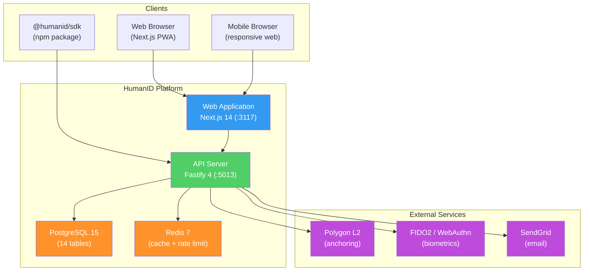
```mermaid
graph TD
    subgraph "Clients"
        BROWSER["Web Browser<br/>(Next.js PWA)"]
        SDK["@humanid/sdk<br/>(npm package)"]
        MOBILE["Mobile Browser<br/>(responsive web)"]
    end

    subgraph "HumanID Platform"
        WEB["Web Application<br/>Next.js 14 (:3117)"]
        API["API Server<br/>Fastify 4 (:5013)"]
        DB["PostgreSQL 15<br/>(14 tables)"]
        CACHE["Redis 7<br/>(cache + rate limit)"]
    end

    subgraph "External Services"
        POLYGON["Polygon L2<br/>(anchoring)"]
        FIDO["FIDO2 / WebAuthn<br/>(biometrics)"]
        SENDGRID["SendGrid<br/>(email)"]
    end

    BROWSER --> WEB
    MOBILE --> WEB
    SDK --> API
    WEB --> API
    API --> DB
    API --> CACHE
    API --> POLYGON
    API --> FIDO
    API --> SENDGRID

    style WEB fill:#339af0,color:#fff
    style API fill:#51cf66,color:#fff
    style DB fill:#ff922b,color:#fff
    style CACHE fill:#ff922b,color:#fff
    style POLYGON fill:#be4bdb,color:#fff
    style FIDO fill:#be4bdb,color:#fff
    style SENDGRID fill:#be4bdb,color:#fff
```

---

## 2. C4 Diagrams

### 2.1 Level 1: System Context

The system context shows HumanID in its environment with all actors and external systems.

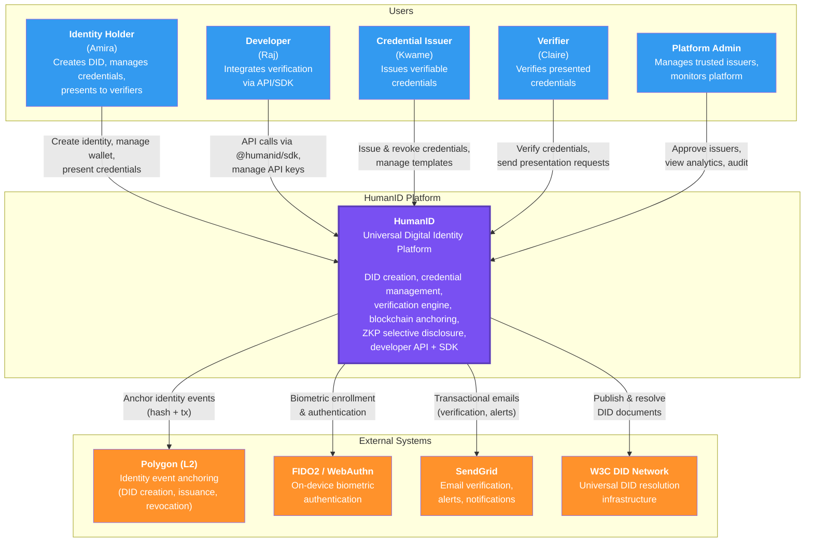
```mermaid
graph TD
    subgraph "Users"
        IH["<b>Identity Holder</b><br/>(Amira)<br/>Creates DID, manages credentials,<br/>presents to verifiers"]
        DEV["<b>Developer</b><br/>(Raj)<br/>Integrates verification<br/>via API/SDK"]
        ISS["<b>Credential Issuer</b><br/>(Kwame)<br/>Issues verifiable<br/>credentials"]
        VER["<b>Verifier</b><br/>(Claire)<br/>Verifies presented<br/>credentials"]
        ADM["<b>Platform Admin</b><br/>Manages trusted issuers,<br/>monitors platform"]
    end

    subgraph "HumanID Platform"
        HUMANID["<b>HumanID</b><br/>Universal Digital Identity Platform<br/><br/>DID creation, credential management,<br/>verification engine, blockchain anchoring,<br/>ZKP selective disclosure,<br/>developer API + SDK"]
    end

    subgraph "External Systems"
        BC["<b>Polygon (L2)</b><br/>Identity event anchoring<br/>(DID creation, issuance, revocation)"]
        FIDO["<b>FIDO2 / WebAuthn</b><br/>On-device biometric<br/>authentication"]
        EMAIL["<b>SendGrid</b><br/>Email verification,<br/>alerts, notifications"]
        DID_NET["<b>W3C DID Network</b><br/>Universal DID resolution<br/>infrastructure"]
    end

    IH -->|"Create identity, manage wallet,<br/>present credentials"| HUMANID
    DEV -->|"API calls via @humanid/sdk,<br/>manage API keys"| HUMANID
    ISS -->|"Issue & revoke credentials,<br/>manage templates"| HUMANID
    VER -->|"Verify credentials,<br/>send presentation requests"| HUMANID
    ADM -->|"Approve issuers,<br/>view analytics, audit"| HUMANID

    HUMANID -->|"Anchor identity events<br/>(hash + tx)"| BC
    HUMANID -->|"Biometric enrollment<br/>& authentication"| FIDO
    HUMANID -->|"Transactional emails<br/>(verification, alerts)"| EMAIL
    HUMANID -->|"Publish & resolve<br/>DID documents"| DID_NET

    style HUMANID fill:#7950f2,color:#fff,stroke:#5c3dba,stroke-width:3px
    style IH fill:#339af0,color:#fff
    style DEV fill:#339af0,color:#fff
    style ISS fill:#339af0,color:#fff
    style VER fill:#339af0,color:#fff
    style ADM fill:#339af0,color:#fff
    style BC fill:#ff922b,color:#fff
    style FIDO fill:#ff922b,color:#fff
    style EMAIL fill:#ff922b,color:#fff
    style DID_NET fill:#ff922b,color:#fff
```

### 2.2 Level 2: Container Diagram

The container diagram shows the major deployable units and their technology choices.

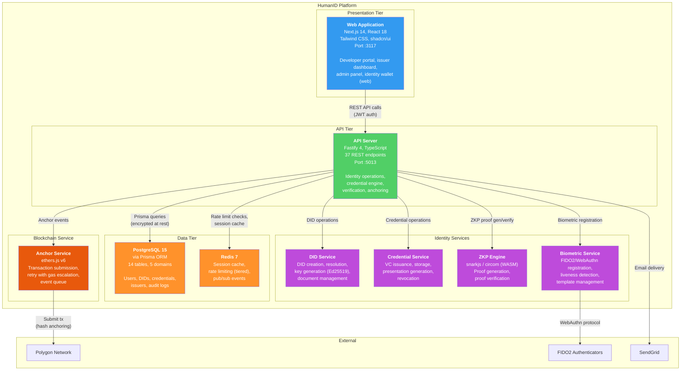
```mermaid
graph TD
    subgraph "HumanID Platform"
        subgraph "Presentation Tier"
            WEB["<b>Web Application</b><br/>Next.js 14, React 18<br/>Tailwind CSS, shadcn/ui<br/>Port :3117<br/><br/>Developer portal, issuer dashboard,<br/>admin panel, identity wallet (web)"]
        end

        subgraph "API Tier"
            API["<b>API Server</b><br/>Fastify 4, TypeScript<br/>37 REST endpoints<br/>Port :5013<br/><br/>Identity operations,<br/>credential engine,<br/>verification, anchoring"]
        end

        subgraph "Data Tier"
            DB["<b>PostgreSQL 15</b><br/>via Prisma ORM<br/>14 tables, 5 domains<br/><br/>Users, DIDs, credentials,<br/>issuers, audit logs"]
            REDIS["<b>Redis 7</b><br/>Session cache,<br/>rate limiting (tiered),<br/>pub/sub events"]
        end

        subgraph "Identity Services"
            DID_SVC["<b>DID Service</b><br/>DID creation, resolution,<br/>key generation (Ed25519),<br/>document management"]
            VC_SVC["<b>Credential Service</b><br/>VC issuance, storage,<br/>presentation generation,<br/>revocation"]
            ZKP_SVC["<b>ZKP Engine</b><br/>snarkjs / circom (WASM)<br/>Proof generation,<br/>proof verification"]
            BIO_SVC["<b>Biometric Service</b><br/>FIDO2/WebAuthn registration,<br/>liveness detection,<br/>template management"]
        end

        subgraph "Blockchain Service"
            ANCHOR["<b>Anchor Service</b><br/>ethers.js v6<br/>Transaction submission,<br/>retry with gas escalation,<br/>event queue"]
        end
    end

    subgraph "External"
        POLYGON["Polygon Network"]
        FIDO2["FIDO2 Authenticators"]
        SENDGRID["SendGrid"]
    end

    WEB -->|"REST API calls<br/>(JWT auth)"| API
    API -->|"Prisma queries<br/>(encrypted at rest)"| DB
    API -->|"Rate limit checks,<br/>session cache"| REDIS
    API -->|"DID operations"| DID_SVC
    API -->|"Credential operations"| VC_SVC
    API -->|"ZKP proof gen/verify"| ZKP_SVC
    API -->|"Biometric registration"| BIO_SVC
    API -->|"Anchor events"| ANCHOR

    ANCHOR -->|"Submit tx<br/>(hash anchoring)"| POLYGON
    BIO_SVC -->|"WebAuthn protocol"| FIDO2
    API -->|"Email delivery"| SENDGRID

    style WEB fill:#339af0,color:#fff
    style API fill:#51cf66,color:#fff
    style DB fill:#ff922b,color:#fff
    style REDIS fill:#ff922b,color:#fff
    style DID_SVC fill:#be4bdb,color:#fff
    style VC_SVC fill:#be4bdb,color:#fff
    style ZKP_SVC fill:#be4bdb,color:#fff
    style BIO_SVC fill:#be4bdb,color:#fff
    style ANCHOR fill:#e8590c,color:#fff
```

### 2.3 Level 3: Component Diagram (API Server)

The component diagram shows the internal structure of the Fastify API server.

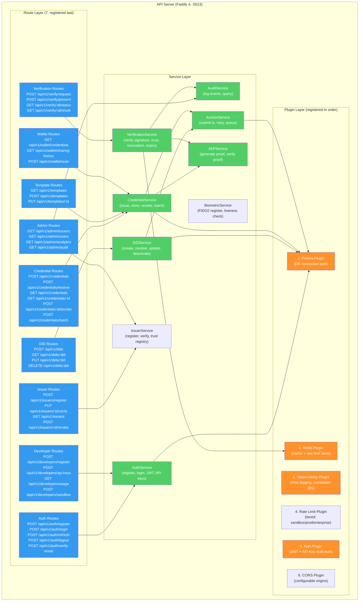
```mermaid
graph TD
    subgraph "API Server (Fastify 4, :5013)"
        subgraph "Plugin Layer (registered in order)"
            OBS_P["1. Observability Plugin<br/>(Pino logging, correlation IDs)"]
            PRISMA_P["2. Prisma Plugin<br/>(DB connection pool)"]
            REDIS_P["3. Redis Plugin<br/>(cache + rate limit store)"]
            RATE_P["4. Rate Limit Plugin<br/>(tiered: sandbox/prod/enterprise)"]
            AUTH_P["5. Auth Plugin<br/>(JWT + API Key dual auth)"]
            CORS_P["6. CORS Plugin<br/>(configurable origins)"]
        end

        subgraph "Route Layer (7. registered last)"
            AUTH_R["Auth Routes<br/>POST /api/v1/auth/register<br/>POST /api/v1/auth/login<br/>POST /api/v1/auth/refresh<br/>POST /api/v1/auth/logout<br/>POST /api/v1/auth/verify-email"]
            DID_R["DID Routes<br/>POST /api/v1/dids<br/>GET /api/v1/dids/:did<br/>PUT /api/v1/dids/:did<br/>DELETE /api/v1/dids/:did"]
            VC_R["Credential Routes<br/>POST /api/v1/credentials<br/>POST /api/v1/credentials/receive<br/>GET /api/v1/credentials<br/>GET /api/v1/credentials/:id<br/>POST /api/v1/credentials/:id/revoke<br/>POST /api/v1/credentials/batch"]
            VERIFY_R["Verification Routes<br/>POST /api/v1/verify/request<br/>POST /api/v1/verify/present<br/>GET /api/v1/verify/:id/status<br/>GET /api/v1/verify/:id/result"]
            ISSUER_R["Issuer Routes<br/>POST /api/v1/issuers/register<br/>PUT /api/v1/issuers/:id/verify<br/>GET /api/v1/issuers<br/>POST /api/v1/issuers/:id/revoke"]
            DEV_R["Developer Routes<br/>POST /api/v1/developers/register<br/>POST /api/v1/developers/api-keys<br/>GET /api/v1/developers/usage<br/>POST /api/v1/developers/sandbox"]
            ADMIN_R["Admin Routes<br/>GET /api/v1/admin/issuers<br/>GET /api/v1/admin/users<br/>GET /api/v1/admin/analytics<br/>GET /api/v1/admin/audit"]
            TMPL_R["Template Routes<br/>GET /api/v1/templates<br/>POST /api/v1/templates<br/>PUT /api/v1/templates/:id"]
            WALLET_R["Wallet Routes<br/>GET /api/v1/wallet/credentials<br/>GET /api/v1/wallet/sharing-history<br/>POST /api/v1/wallet/scan"]
        end

        subgraph "Service Layer"
            AUTH_S["AuthService<br/>(register, login, JWT, API keys)"]
            DID_S["DIDService<br/>(create, resolve, update, deactivate)"]
            VC_S["CredentialService<br/>(issue, store, revoke, batch)"]
            VERIFY_S["VerificationService<br/>(verify signature, trust, revocation, expiry)"]
            ISSUER_S["IssuerService<br/>(register, verify, trust registry)"]
            ZKP_S["ZKPService<br/>(generate proof, verify proof)"]
            BIO_S["BiometricService<br/>(FIDO2 register, liveness check)"]
            ANCHOR_S["AnchorService<br/>(submit tx, retry, queue)"]
            AUDIT_S["AuditService<br/>(log events, query)"]
        end
    end

    AUTH_R --> AUTH_S
    DID_R --> DID_S
    VC_R --> VC_S
    VERIFY_R --> VERIFY_S
    ISSUER_R --> ISSUER_S
    DEV_R --> AUTH_S
    ADMIN_R --> ISSUER_S & AUDIT_S
    TMPL_R --> VC_S
    WALLET_R --> VC_S

    DID_S --> ANCHOR_S
    VC_S --> ZKP_S & ANCHOR_S
    VERIFY_S --> ZKP_S & AUDIT_S

    AUTH_S --> PRISMA_P
    DID_S --> PRISMA_P
    VC_S --> PRISMA_P
    VERIFY_S --> REDIS_P
    ANCHOR_S --> PRISMA_P

    style AUTH_R fill:#339af0,color:#fff
    style DID_R fill:#339af0,color:#fff
    style VC_R fill:#339af0,color:#fff
    style VERIFY_R fill:#339af0,color:#fff
    style ISSUER_R fill:#339af0,color:#fff
    style DEV_R fill:#339af0,color:#fff
    style ADMIN_R fill:#339af0,color:#fff
    style TMPL_R fill:#339af0,color:#fff
    style WALLET_R fill:#339af0,color:#fff
    style AUTH_S fill:#51cf66,color:#fff
    style DID_S fill:#51cf66,color:#fff
    style VC_S fill:#51cf66,color:#fff
    style VERIFY_S fill:#51cf66,color:#fff
    style ZKP_S fill:#51cf66,color:#fff
    style ANCHOR_S fill:#51cf66,color:#fff
    style AUDIT_S fill:#51cf66,color:#fff
    style OBS_P fill:#ff922b,color:#fff
    style PRISMA_P fill:#ff922b,color:#fff
    style REDIS_P fill:#ff922b,color:#fff
    style AUTH_P fill:#ff922b,color:#fff
```

### 2.4 Level 3: Component Diagram (Web Application)

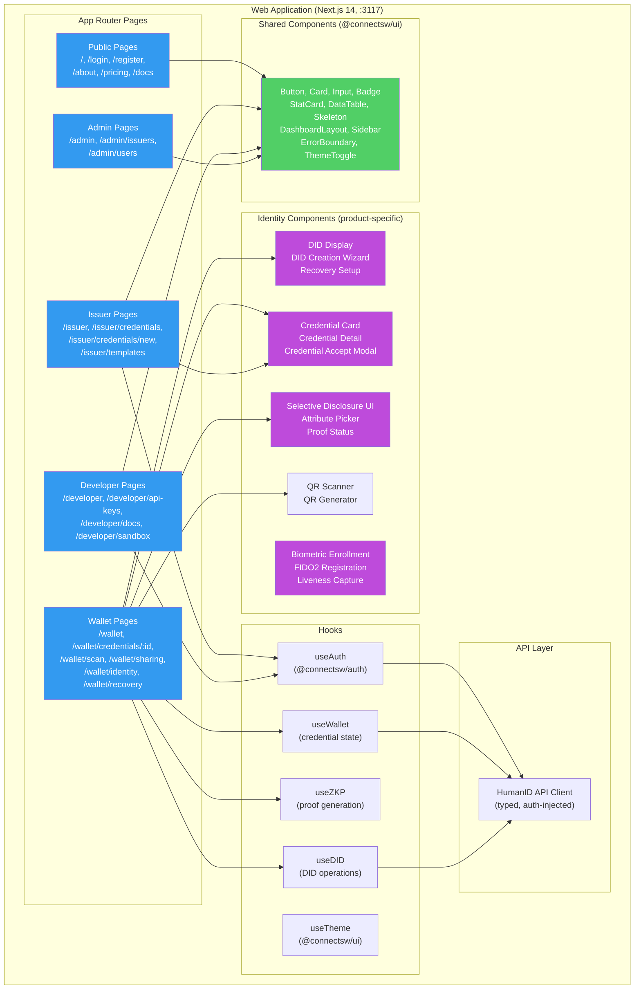
```mermaid
graph TD
    subgraph "Web Application (Next.js 14, :3117)"
        subgraph "App Router Pages"
            PUB["Public Pages<br/>/, /login, /register,<br/>/about, /pricing, /docs"]
            WALLET_P["Wallet Pages<br/>/wallet, /wallet/credentials/:id,<br/>/wallet/scan, /wallet/sharing,<br/>/wallet/identity, /wallet/recovery"]
            ISSUER_P["Issuer Pages<br/>/issuer, /issuer/credentials,<br/>/issuer/credentials/new,<br/>/issuer/templates"]
            DEV_P["Developer Pages<br/>/developer, /developer/api-keys,<br/>/developer/docs, /developer/sandbox"]
            ADMIN_P["Admin Pages<br/>/admin, /admin/issuers,<br/>/admin/users"]
        end

        subgraph "Shared Components (@connectsw/ui)"
            UI["Button, Card, Input, Badge<br/>StatCard, DataTable, Skeleton<br/>DashboardLayout, Sidebar<br/>ErrorBoundary, ThemeToggle"]
        end

        subgraph "Identity Components (product-specific)"
            DID_COMP["DID Display<br/>DID Creation Wizard<br/>Recovery Setup"]
            CRED_COMP["Credential Card<br/>Credential Detail<br/>Credential Accept Modal"]
            ZKP_COMP["Selective Disclosure UI<br/>Attribute Picker<br/>Proof Status"]
            QR_COMP["QR Scanner<br/>QR Generator"]
            BIO_COMP["Biometric Enrollment<br/>FIDO2 Registration<br/>Liveness Capture"]
        end

        subgraph "Hooks"
            AUTH_H["useAuth<br/>(@connectsw/auth)"]
            WALLET_H["useWallet<br/>(credential state)"]
            DID_H["useDID<br/>(DID operations)"]
            ZKP_H["useZKP<br/>(proof generation)"]
            THEME_H["useTheme<br/>(@connectsw/ui)"]
        end

        subgraph "API Layer"
            API_CLIENT["HumanID API Client<br/>(typed, auth-injected)"]
        end
    end

    PUB --> UI
    WALLET_P --> DID_COMP & CRED_COMP & ZKP_COMP & QR_COMP
    ISSUER_P --> CRED_COMP & UI
    DEV_P --> UI
    ADMIN_P --> UI

    WALLET_P --> WALLET_H & DID_H & ZKP_H
    ISSUER_P --> AUTH_H
    DEV_P --> AUTH_H

    AUTH_H --> API_CLIENT
    WALLET_H --> API_CLIENT
    DID_H --> API_CLIENT

    style PUB fill:#339af0,color:#fff
    style WALLET_P fill:#339af0,color:#fff
    style ISSUER_P fill:#339af0,color:#fff
    style DEV_P fill:#339af0,color:#fff
    style ADMIN_P fill:#339af0,color:#fff
    style UI fill:#51cf66,color:#fff
    style DID_COMP fill:#be4bdb,color:#fff
    style CRED_COMP fill:#be4bdb,color:#fff
    style ZKP_COMP fill:#be4bdb,color:#fff
    style BIO_COMP fill:#be4bdb,color:#fff
```

---

## 3. Sequence Diagrams

### 3.1 Identity Creation Flow

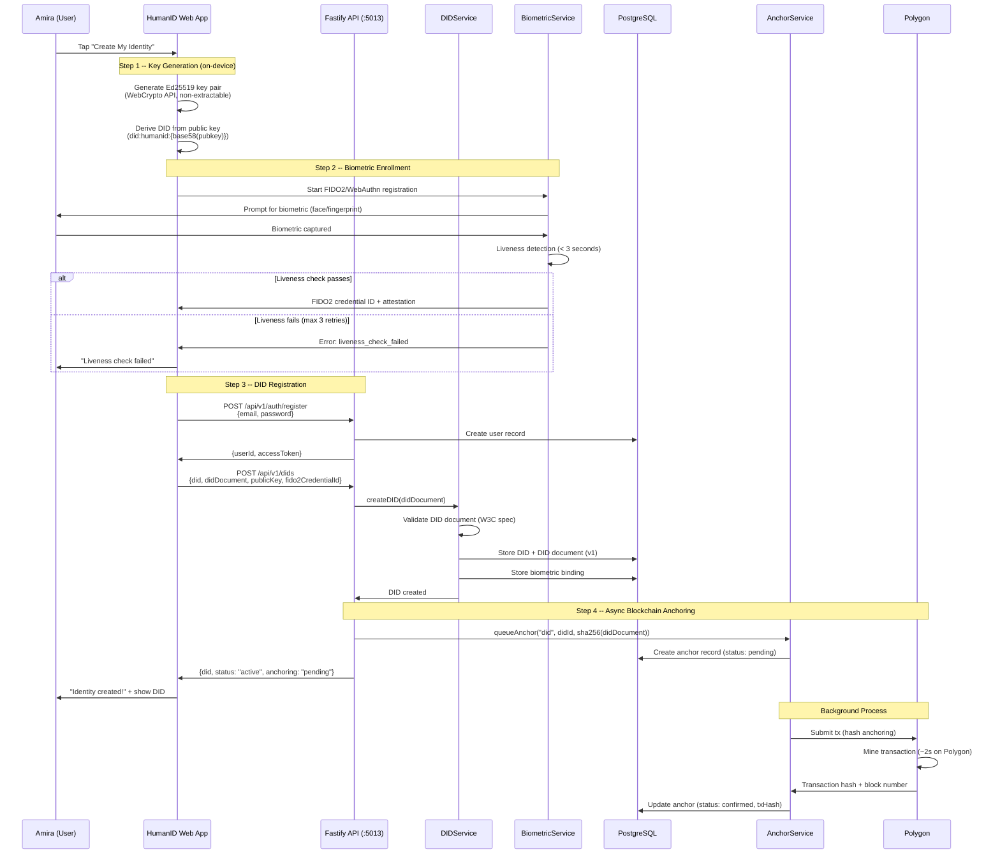
```mermaid
sequenceDiagram
    participant U as Amira (User)
    participant APP as HumanID Web App
    participant API as Fastify API (:5013)
    participant DID as DIDService
    participant BIO as BiometricService
    participant DB as PostgreSQL
    participant ANCHOR as AnchorService
    participant BC as Polygon

    U->>APP: Tap "Create My Identity"

    Note over APP: Step 1 -- Key Generation (on-device)
    APP->>APP: Generate Ed25519 key pair<br/>(WebCrypto API, non-extractable)
    APP->>APP: Derive DID from public key<br/>(did:humanid:{base58(pubkey)})

    Note over APP,BIO: Step 2 -- Biometric Enrollment
    APP->>BIO: Start FIDO2/WebAuthn registration
    BIO->>U: Prompt for biometric (face/fingerprint)
    U->>BIO: Biometric captured
    BIO->>BIO: Liveness detection (< 3 seconds)
    alt Liveness check passes
        BIO->>APP: FIDO2 credential ID + attestation
    else Liveness fails (max 3 retries)
        BIO->>APP: Error: liveness_check_failed
        APP->>U: "Liveness check failed"
    end

    Note over APP,API: Step 3 -- DID Registration
    APP->>API: POST /api/v1/auth/register<br/>{email, password}
    API->>DB: Create user record
    API->>APP: {userId, accessToken}

    APP->>API: POST /api/v1/dids<br/>{did, didDocument, publicKey, fido2CredentialId}
    API->>DID: createDID(didDocument)
    DID->>DID: Validate DID document (W3C spec)
    DID->>DB: Store DID + DID document (v1)
    DID->>DB: Store biometric binding
    DID->>API: DID created

    Note over API,BC: Step 4 -- Async Blockchain Anchoring
    API->>ANCHOR: queueAnchor("did", didId, sha256(didDocument))
    ANCHOR->>DB: Create anchor record (status: pending)
    API->>APP: {did, status: "active", anchoring: "pending"}
    APP->>U: "Identity created!" + show DID

    Note over ANCHOR,BC: Background Process
    ANCHOR->>BC: Submit tx (hash anchoring)
    BC->>BC: Mine transaction (~2s on Polygon)
    BC->>ANCHOR: Transaction hash + block number
    ANCHOR->>DB: Update anchor (status: confirmed, txHash)
```

### 3.2 Credential Issuance Flow

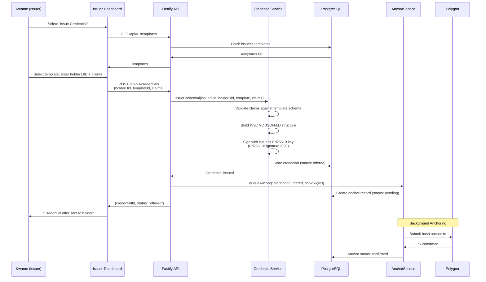
```mermaid
sequenceDiagram
    participant ISS as Kwame (Issuer)
    participant DASH as Issuer Dashboard
    participant API as Fastify API
    participant VC as CredentialService
    participant DB as PostgreSQL
    participant ANCHOR as AnchorService
    participant BC as Polygon

    ISS->>DASH: Select "Issue Credential"
    DASH->>API: GET /api/v1/templates
    API->>DB: Fetch issuer's templates
    DB->>API: Templates list
    API->>DASH: Templates

    ISS->>DASH: Select template, enter holder DID + claims
    DASH->>API: POST /api/v1/credentials<br/>{holderDid, templateId, claims}

    API->>VC: issueCredential(issuerDid, holderDid, template, claims)
    VC->>VC: Validate claims against template schema
    VC->>VC: Build W3C VC JSON-LD structure
    VC->>VC: Sign with issuer's Ed25519 key<br/>(Ed25519Signature2020)
    VC->>DB: Store credential (status: offered)
    VC->>API: Credential issued

    API->>ANCHOR: queueAnchor("credential", credId, sha256(vc))
    ANCHOR->>DB: Create anchor record (status: pending)

    API->>DASH: {credentialId, status: "offered"}
    DASH->>ISS: "Credential offer sent to holder"

    Note over ANCHOR,BC: Background Anchoring
    ANCHOR->>BC: Submit hash anchor tx
    BC->>ANCHOR: tx confirmed
    ANCHOR->>DB: Anchor status: confirmed
```

### 3.3 Credential Verification Flow (with ZKP)

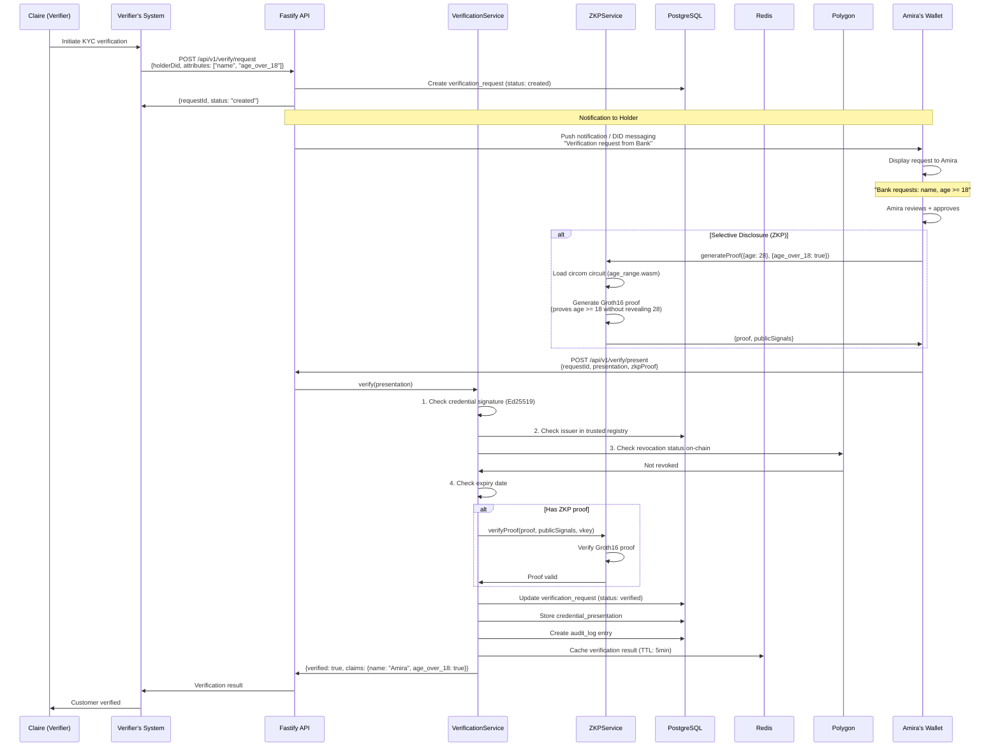
```mermaid
sequenceDiagram
    participant V as Claire (Verifier)
    participant VSYS as Verifier's System
    participant API as Fastify API
    participant VER as VerificationService
    participant ZKP as ZKPService
    participant DB as PostgreSQL
    participant REDIS as Redis
    participant BC as Polygon
    participant W as Amira's Wallet

    V->>VSYS: Initiate KYC verification
    VSYS->>API: POST /api/v1/verify/request<br/>{holderDid, attributes: ["name", "age_over_18"]}
    API->>DB: Create verification_request (status: created)
    API->>VSYS: {requestId, status: "created"}

    Note over API,W: Notification to Holder
    API->>W: Push notification / DID messaging<br/>"Verification request from Bank"

    W->>W: Display request to Amira
    Note over W: "Bank requests: name, age >= 18"
    W->>W: Amira reviews + approves

    alt Selective Disclosure (ZKP)
        W->>ZKP: generateProof({age: 28}, {age_over_18: true})
        ZKP->>ZKP: Load circom circuit (age_range.wasm)
        ZKP->>ZKP: Generate Groth16 proof<br/>(proves age >= 18 without revealing 28)
        ZKP->>W: {proof, publicSignals}
    end

    W->>API: POST /api/v1/verify/present<br/>{requestId, presentation, zkpProof}

    API->>VER: verify(presentation)
    VER->>VER: 1. Check credential signature (Ed25519)
    VER->>DB: 2. Check issuer in trusted registry
    VER->>BC: 3. Check revocation status on-chain
    BC->>VER: Not revoked
    VER->>VER: 4. Check expiry date

    alt Has ZKP proof
        VER->>ZKP: verifyProof(proof, publicSignals, vkey)
        ZKP->>ZKP: Verify Groth16 proof
        ZKP->>VER: Proof valid
    end

    VER->>DB: Update verification_request (status: verified)
    VER->>DB: Store credential_presentation
    VER->>DB: Create audit_log entry

    VER->>REDIS: Cache verification result (TTL: 5min)
    VER->>API: {verified: true, claims: {name: "Amira", age_over_18: true}}
    API->>VSYS: Verification result
    VSYS->>V: Customer verified
```

### 3.4 Blockchain Anchoring Flow

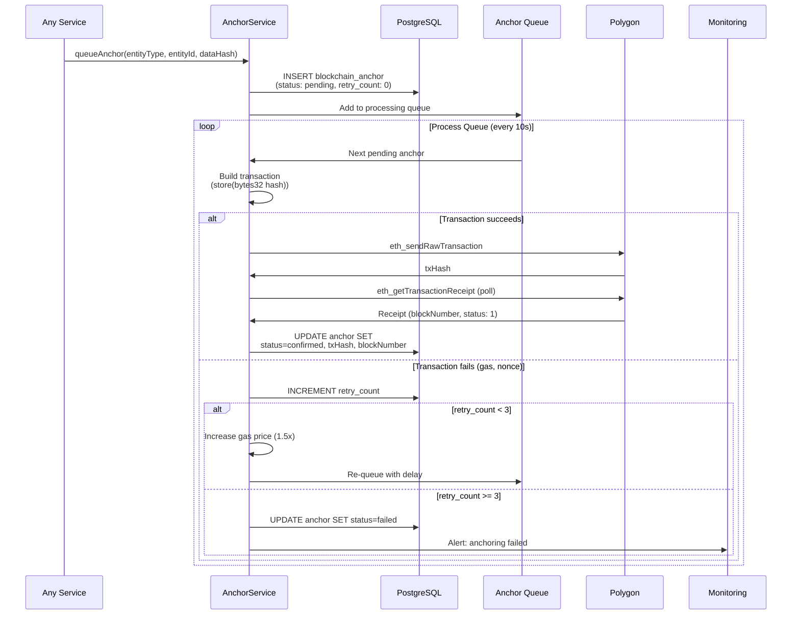
```mermaid
sequenceDiagram
    participant SVC as Any Service
    participant ANCHOR as AnchorService
    participant DB as PostgreSQL
    participant QUEUE as Anchor Queue
    participant BC as Polygon
    participant MONITOR as Monitoring

    SVC->>ANCHOR: queueAnchor(entityType, entityId, dataHash)
    ANCHOR->>DB: INSERT blockchain_anchor<br/>(status: pending, retry_count: 0)
    ANCHOR->>QUEUE: Add to processing queue

    loop Process Queue (every 10s)
        QUEUE->>ANCHOR: Next pending anchor
        ANCHOR->>ANCHOR: Build transaction<br/>(store(bytes32 hash))

        alt Transaction succeeds
            ANCHOR->>BC: eth_sendRawTransaction
            BC->>ANCHOR: txHash
            ANCHOR->>BC: eth_getTransactionReceipt (poll)
            BC->>ANCHOR: Receipt (blockNumber, status: 1)
            ANCHOR->>DB: UPDATE anchor SET<br/>status=confirmed, txHash, blockNumber
        else Transaction fails (gas, nonce)
            ANCHOR->>DB: INCREMENT retry_count
            alt retry_count < 3
                ANCHOR->>ANCHOR: Increase gas price (1.5x)
                ANCHOR->>QUEUE: Re-queue with delay
            else retry_count >= 3
                ANCHOR->>DB: UPDATE anchor SET status=failed
                ANCHOR->>MONITOR: Alert: anchoring failed
            end
        end
    end
```

---

## 4. State Diagrams

### 4.1 Identity (DID) Lifecycle

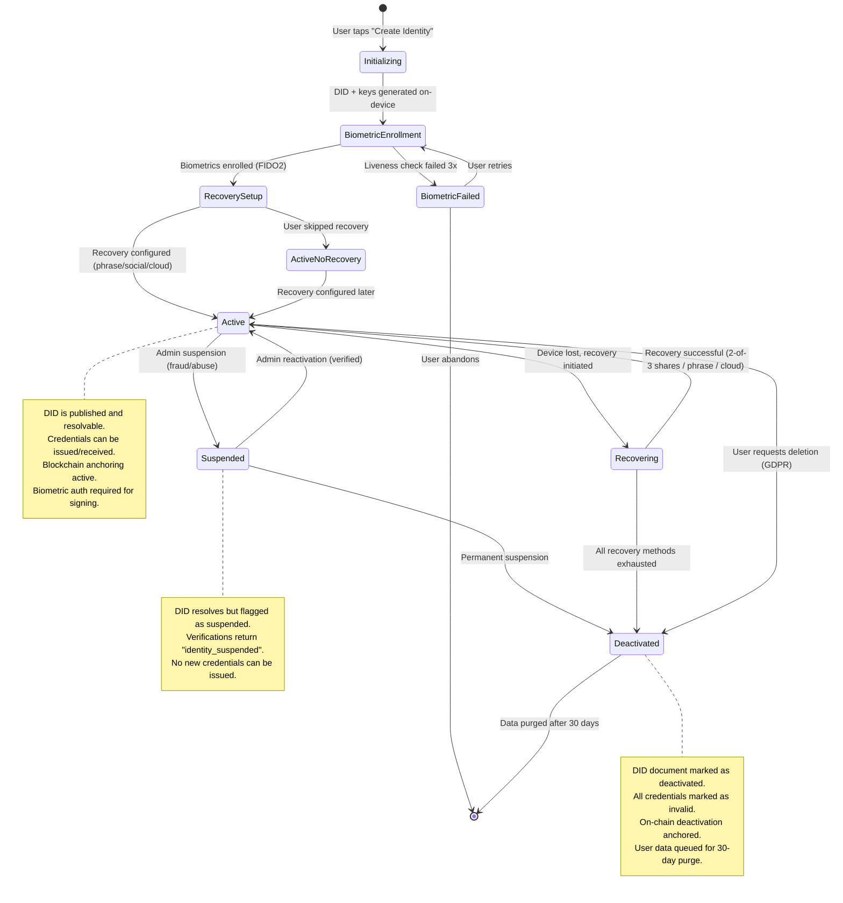
```mermaid
stateDiagram-v2
    [*] --> Initializing: User taps "Create Identity"

    Initializing --> BiometricEnrollment: DID + keys generated on-device
    BiometricEnrollment --> RecoverySetup: Biometrics enrolled (FIDO2)
    BiometricEnrollment --> BiometricFailed: Liveness check failed 3x

    BiometricFailed --> BiometricEnrollment: User retries
    BiometricFailed --> [*]: User abandons

    RecoverySetup --> Active: Recovery configured (phrase/social/cloud)
    RecoverySetup --> ActiveNoRecovery: User skipped recovery

    ActiveNoRecovery --> Active: Recovery configured later

    Active --> Suspended: Admin suspension (fraud/abuse)
    Active --> Recovering: Device lost, recovery initiated

    Suspended --> Active: Admin reactivation (verified)
    Suspended --> Deactivated: Permanent suspension

    Recovering --> Active: Recovery successful (2-of-3 shares / phrase / cloud)
    Recovering --> Deactivated: All recovery methods exhausted

    Active --> Deactivated: User requests deletion (GDPR)
    Deactivated --> [*]: Data purged after 30 days

    note right of Active
        DID is published and resolvable.
        Credentials can be issued/received.
        Blockchain anchoring active.
        Biometric auth required for signing.
    end note

    note right of Suspended
        DID resolves but flagged as suspended.
        Verifications return "identity_suspended".
        No new credentials can be issued.
    end note

    note right of Deactivated
        DID document marked as deactivated.
        All credentials marked as invalid.
        On-chain deactivation anchored.
        User data queued for 30-day purge.
    end note
```

### 4.2 Credential Lifecycle

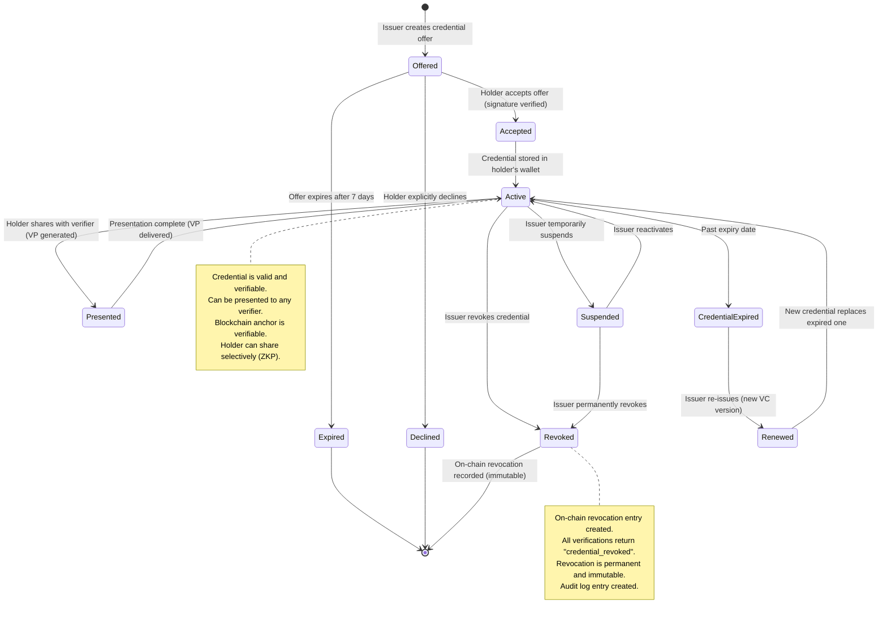
```mermaid
stateDiagram-v2
    [*] --> Offered: Issuer creates credential offer

    Offered --> Accepted: Holder accepts offer (signature verified)
    Offered --> Expired: Offer expires after 7 days
    Offered --> Declined: Holder explicitly declines

    Expired --> [*]
    Declined --> [*]

    Accepted --> Active: Credential stored in holder's wallet

    Active --> Presented: Holder shares with verifier (VP generated)
    Presented --> Active: Presentation complete (VP delivered)

    Active --> Revoked: Issuer revokes credential
    Active --> CredentialExpired: Past expiry date
    Active --> Suspended: Issuer temporarily suspends

    Suspended --> Active: Issuer reactivates
    Suspended --> Revoked: Issuer permanently revokes

    Revoked --> [*]: On-chain revocation recorded (immutable)

    CredentialExpired --> Renewed: Issuer re-issues (new VC version)
    Renewed --> Active: New credential replaces expired one

    note right of Active
        Credential is valid and verifiable.
        Can be presented to any verifier.
        Blockchain anchor is verifiable.
        Holder can share selectively (ZKP).
    end note

    note right of Revoked
        On-chain revocation entry created.
        All verifications return "credential_revoked".
        Revocation is permanent and immutable.
        Audit log entry created.
    end note
```

### 4.3 Verification Request Lifecycle

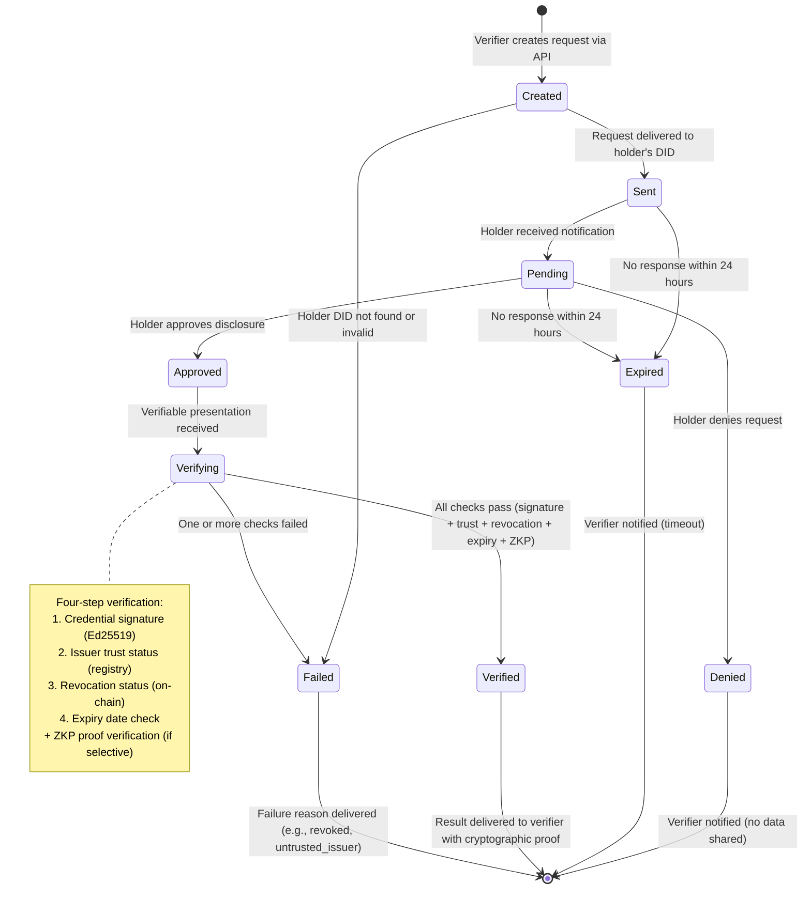
```mermaid
stateDiagram-v2
    [*] --> Created: Verifier creates request via API

    Created --> Sent: Request delivered to holder's DID
    Created --> Failed: Holder DID not found or invalid

    Sent --> Pending: Holder received notification
    Sent --> Expired: No response within 24 hours

    Pending --> Approved: Holder approves disclosure
    Pending --> Denied: Holder denies request
    Pending --> Expired: No response within 24 hours

    Approved --> Verifying: Verifiable presentation received

    Verifying --> Verified: All checks pass (signature + trust + revocation + expiry + ZKP)
    Verifying --> Failed: One or more checks failed

    Denied --> [*]: Verifier notified (no data shared)
    Expired --> [*]: Verifier notified (timeout)
    Verified --> [*]: Result delivered to verifier with cryptographic proof
    Failed --> [*]: Failure reason delivered (e.g., revoked, untrusted_issuer)

    note right of Verifying
        Four-step verification:
        1. Credential signature (Ed25519)
        2. Issuer trust status (registry)
        3. Revocation status (on-chain)
        4. Expiry date check
        + ZKP proof verification (if selective)
    end note
```

---

## 5. Data Model

### 5.1 Entity-Relationship Diagram


```mermaid
erDiagram
    users ||--o{ dids : "owns"
    users ||--o{ sessions : "has"
    users ||--o{ api_keys : "has"
    users ||--o{ audit_logs : "generates"
    users ||--o{ issuers : "registers as"

    users {
        uuid id PK
        string email UK
        string password_hash
        enum role "holder | issuer | developer | admin"
        enum status "active | suspended | deactivated"
        boolean email_verified
        timestamp created_at
        timestamp updated_at
    }

    dids ||--o{ did_documents : "has versions"
    dids ||--o{ biometric_bindings : "bound by"
    dids ||--o{ recovery_configs : "protected by"
    dids ||--o{ credentials_held : "holds"
    dids ||--o{ blockchain_anchors : "anchored by"

    dids {
        uuid id PK
        uuid user_id FK
        string did UK "did:humanid:base58(pubkey)"
        string method "humanid"
        string public_key "Ed25519 public key (base58)"
        enum status "active | suspended | deactivated"
        jsonb key_agreement "X25519 for encryption"
        timestamp created_at
        timestamp updated_at
    }

    did_documents {
        uuid id PK
        uuid did_id FK
        int version "auto-incrementing"
        jsonb document "W3C DID Document JSON-LD"
        string document_hash "SHA-256 of document"
        timestamp created_at
    }

    biometric_bindings {
        uuid id PK
        uuid did_id FK
        enum type "fido2 | face"
        string template_hash "SHA-256 of biometric template"
        string fido2_credential_id "WebAuthn credential ID"
        string fido2_public_key "WebAuthn public key"
        jsonb metadata "device info, attestation"
        timestamp created_at
    }

    recovery_configs {
        uuid id PK
        uuid did_id FK
        enum method "phrase | social | cloud"
        text encrypted_config "AES-256-GCM encrypted recovery data"
        enum status "active | used | expired"
        timestamp created_at
        timestamp updated_at
    }

    issuers ||--o{ credentials_issued : "issues"
    issuers ||--o{ credential_templates : "defines"

    issuers {
        uuid id PK
        uuid user_id FK
        uuid did_id FK
        string organization_name
        string legal_entity_id
        enum trust_status "pending | trusted | revoked"
        jsonb allowed_credential_types
        jsonb verification_documents "uploaded docs"
        timestamp verified_at
        timestamp revoked_at
        timestamp created_at
        timestamp updated_at
    }

    credential_templates {
        uuid id PK
        uuid issuer_id FK
        string name
        string credential_type
        jsonb schema "JSON-LD schema definition"
        jsonb required_attributes
        jsonb optional_attributes
        int default_expiry_days
        boolean is_active
        timestamp created_at
        timestamp updated_at
    }

    credentials {
        uuid id PK
        uuid holder_did_id FK
        uuid issuer_did_id FK
        uuid issuer_id FK
        uuid template_id FK
        string credential_type
        text encrypted_claims "AES-256-GCM encrypted"
        jsonb proof "Ed25519Signature2020"
        string credential_hash "SHA-256 for anchoring"
        enum status "offered | active | revoked | expired | suspended"
        timestamp issued_at
        timestamp expires_at
        timestamp revoked_at
        timestamp accepted_at
    }

    credential_presentations ||--o{ audit_logs : "logged in"

    credential_presentations {
        uuid id PK
        uuid credential_id FK
        uuid holder_did_id FK
        uuid verifier_did_id FK
        uuid verification_request_id FK
        jsonb disclosed_attributes "attributes shared"
        enum proof_type "full | selective | zkp"
        jsonb zkp_proof "Groth16 proof data"
        enum status "active | revoked"
        timestamp presented_at
        timestamp revoked_at
    }

    verification_requests {
        uuid id PK
        uuid verifier_id FK "user ID of verifier"
        string holder_did "DID of holder"
        jsonb requested_attributes "required + optional"
        enum status "created | sent | pending | approved | denied | expired | verified | failed"
        jsonb result "verification result payload"
        string failure_reason
        timestamp created_at
        timestamp responded_at
        timestamp expires_at
    }

    blockchain_anchors {
        uuid id PK
        enum entity_type "did | credential | revocation"
        uuid entity_id
        enum chain "polygon"
        string transaction_hash UK
        string block_number
        string data_hash "SHA-256 hash anchored"
        enum status "pending | confirmed | failed"
        int retry_count "max 3"
        string error_message
        timestamp anchored_at
        timestamp created_at
    }

    sessions {
        uuid id PK
        uuid user_id FK
        string token_hash "SHA-256 of refresh token"
        string device_info
        string ip_address
        timestamp expires_at
        timestamp created_at
    }

    api_keys {
        uuid id PK
        uuid user_id FK
        string key_hash UK "HMAC-SHA256 of key"
        string key_prefix "humanid_sk_ or humanid_pk_"
        string name
        enum environment "sandbox | production"
        enum status "active | revoked"
        jsonb permissions
        int rate_limit "requests per hour"
        timestamp last_used_at
        timestamp created_at
    }

    audit_logs {
        uuid id PK
        uuid user_id FK
        string action "did.created | credential.issued | verification.completed | ..."
        string entity_type "did | credential | verification | issuer"
        uuid entity_id
        jsonb metadata "request details, outcome"
        string ip_address
        string user_agent
        timestamp created_at
    }
```

### 5.2 Domain Summary

| Domain | Tables | Count | Key Entity |
|--------|--------|-------|-----------|
| Identity | users, dids, did_documents, biometric_bindings, recovery_configs, sessions | 6 | DID |
| Credentials | credentials, credential_templates, credential_presentations | 3 | Credential |
| Verification | verification_requests | 1 | Verification Request |
| Issuers | issuers | 1 | Issuer |
| Infrastructure | blockchain_anchors, api_keys, audit_logs | 3 | Blockchain Anchor |
| **Total** | | **14** | |

### 5.3 Index Strategy

| Table | Index | Type | Reason |
|-------|-------|------|--------|
| users | email | Unique | Login lookup |
| dids | did | Unique | DID resolution |
| dids | user_id | B-tree | User's DIDs lookup |
| did_documents | (did_id, version) | Unique | Version management |
| credentials | holder_did_id | B-tree | Wallet queries |
| credentials | issuer_did_id | B-tree | Issuer dashboard |
| credentials | status | B-tree | Status filtering |
| credential_presentations | verification_request_id | B-tree | Verification lookup |
| verification_requests | verifier_id | B-tree | Verifier's requests |
| verification_requests | status | B-tree | Status polling |
| blockchain_anchors | (entity_type, entity_id) | B-tree | Entity lookup |
| blockchain_anchors | transaction_hash | Unique | Tx dedup |
| blockchain_anchors | status | B-tree | Queue processing |
| api_keys | key_hash | Unique | API key auth |
| api_keys | user_id | B-tree | User's keys |
| audit_logs | user_id | B-tree | User audit trail |
| audit_logs | action | B-tree | Action filtering |
| audit_logs | entity_type | B-tree | Entity filtering |
| audit_logs | created_at | BRIN | Time-series queries |
| issuers | trust_status | B-tree | Trusted issuer registry |
| sessions | token_hash | Unique | Token lookup |
| sessions | user_id | B-tree | User sessions |

---

## 6. API Surface

### 6.1 Endpoint Summary

All endpoints use the `/api/v1/` prefix. Full OpenAPI 3.0 specification is in `openapi.yaml`.

| # | Area | Method | Endpoint | Auth | Description | User Stories |
|---|------|--------|----------|------|-------------|-------------|
| 1 | Auth | POST | /auth/register | Public | Register new user | US-11 |
| 2 | Auth | POST | /auth/login | Public | Login, get JWT | US-11 |
| 3 | Auth | POST | /auth/refresh | Cookie | Refresh access token | -- |
| 4 | Auth | POST | /auth/logout | JWT | Logout, revoke refresh | -- |
| 5 | Auth | POST | /auth/verify-email | Public | Verify email token | US-11 |
| 6 | DIDs | POST | /dids | JWT | Create DID | US-01 |
| 7 | DIDs | GET | /dids/:did | Public | Resolve DID document | US-01 |
| 8 | DIDs | PUT | /dids/:did | JWT | Update DID document | US-01 |
| 9 | DIDs | DELETE | /dids/:did | JWT | Deactivate DID | US-01 |
| 10 | Creds | POST | /credentials | JWT+Issuer | Issue credential | US-07 |
| 11 | Creds | POST | /credentials/receive | JWT | Accept credential offer | US-04 |
| 12 | Creds | GET | /credentials | JWT | List holder's credentials | US-15 |
| 13 | Creds | GET | /credentials/:id | JWT | Get credential detail | US-15 |
| 14 | Creds | POST | /credentials/:id/revoke | JWT+Issuer | Revoke credential | US-06 |
| 15 | Creds | POST | /credentials/batch | JWT+Issuer | Batch issue (CSV) | US-07 |
| 16 | Verify | POST | /verify/request | JWT/APIKey | Create verification request | US-10 |
| 17 | Verify | POST | /verify/present | JWT | Present VP to verifier | US-05, US-09 |
| 18 | Verify | GET | /verify/:id/status | JWT/APIKey | Poll verification status | US-09 |
| 19 | Verify | GET | /verify/:id/result | JWT/APIKey | Get verification result | US-09 |
| 20 | Issuers | POST | /issuers/register | JWT | Register as issuer | US-07 |
| 21 | Issuers | PUT | /issuers/:id/verify | JWT+Admin | Verify issuer (approve) | US-17 |
| 22 | Issuers | GET | /issuers | JWT | List issuers | US-17 |
| 23 | Issuers | POST | /issuers/:id/revoke | JWT+Admin | Revoke issuer trust | US-17 |
| 24 | Dev | POST | /developers/register | Public | Register developer account | US-11 |
| 25 | Dev | POST | /developers/api-keys | JWT+Dev | Create API key | US-11 |
| 26 | Dev | GET | /developers/usage | JWT+Dev | Get API usage stats | US-13 |
| 27 | Dev | POST | /developers/sandbox | JWT+Dev | Create sandbox env | US-12 |
| 28 | Admin | GET | /admin/issuers | JWT+Admin | List all issuers (admin) | US-17 |
| 29 | Admin | GET | /admin/users | JWT+Admin | List all users (admin) | US-18 |
| 30 | Admin | GET | /admin/analytics | JWT+Admin | Platform analytics | US-18 |
| 31 | Admin | GET | /admin/audit | JWT+Admin | Query audit logs | US-18 |
| 32 | Templates | GET | /templates | JWT+Issuer | List templates | US-08 |
| 33 | Templates | POST | /templates | JWT+Issuer | Create template | US-08 |
| 34 | Templates | PUT | /templates/:id | JWT+Issuer | Update template | US-08 |
| 35 | Wallet | GET | /wallet/credentials | JWT | Wallet credential list | US-15 |
| 36 | Wallet | GET | /wallet/sharing-history | JWT | Sharing history | US-06 |
| 37 | Wallet | POST | /wallet/scan | JWT | Process scanned QR code | US-16 |

### 6.2 Authentication Patterns

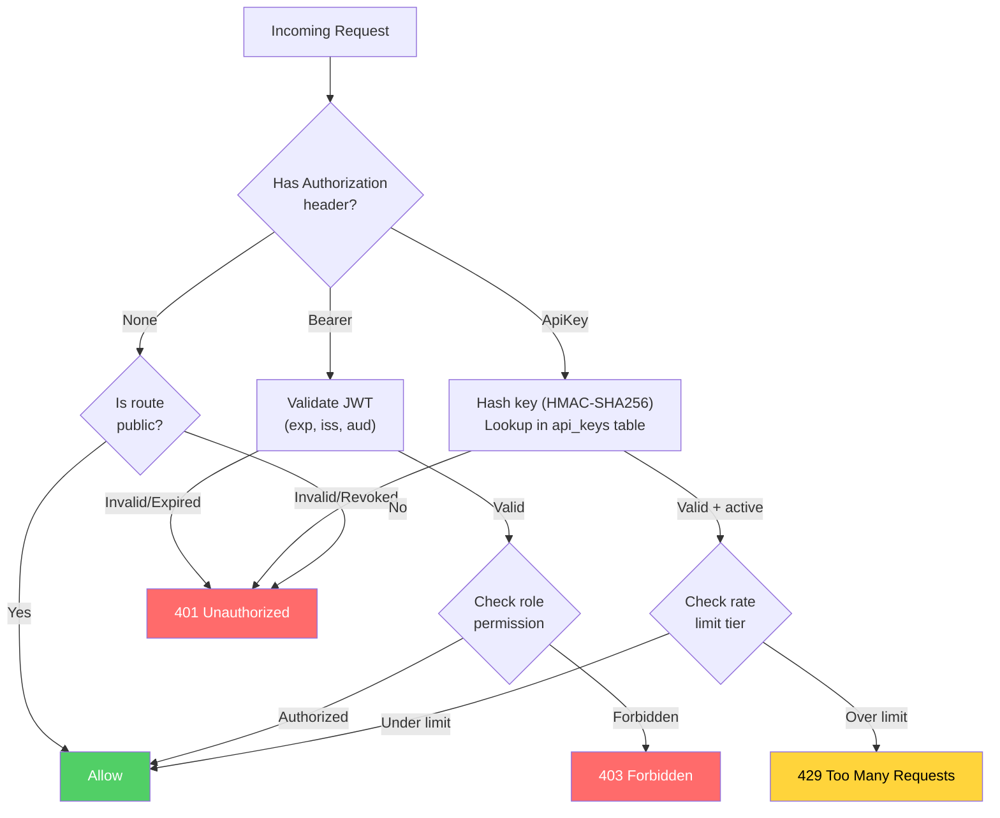
```mermaid
flowchart TD
    REQ["Incoming Request"] --> CHECK{"Has Authorization<br/>header?"}

    CHECK -->|"Bearer <jwt>"| JWT_V["Validate JWT<br/>(exp, iss, aud)"]
    CHECK -->|"ApiKey <key>"| API_V["Hash key (HMAC-SHA256)<br/>Lookup in api_keys table"]
    CHECK -->|"None"| PUB{"Is route<br/>public?"}

    JWT_V -->|Valid| ROLE{"Check role<br/>permission"}
    JWT_V -->|Invalid/Expired| R401["401 Unauthorized"]

    API_V -->|Valid + active| RATE{"Check rate<br/>limit tier"}
    API_V -->|Invalid/Revoked| R401

    PUB -->|Yes| ALLOW["Allow"]
    PUB -->|No| R401

    ROLE -->|Authorized| ALLOW
    ROLE -->|Forbidden| R403["403 Forbidden"]

    RATE -->|Under limit| ALLOW
    RATE -->|Over limit| R429["429 Too Many Requests"]

    style ALLOW fill:#51cf66,color:#fff
    style R401 fill:#ff6b6b,color:#fff
    style R403 fill:#ff6b6b,color:#fff
    style R429 fill:#ffd43b,color:#000
```

### 6.3 Error Response Format (RFC 7807)

All error responses follow RFC 7807 Problem Details:

```json
{
  "type": "https://humanid.io/errors/credential-revoked",
  "title": "Credential Revoked",
  "status": 409,
  "detail": "The credential cred_abc123 was revoked by the issuer on 2026-02-15T10:30:00Z",
  "instance": "/api/v1/verify/request/req_xyz789",
  "extensions": {
    "credentialId": "cred_abc123",
    "revokedAt": "2026-02-15T10:30:00Z",
    "issuerDid": "did:humanid:issuer456"
  }
}
```

### 6.4 Rate Limiting Tiers

| Tier | Requests/Hour | Burst | Applied To |
|------|--------------|-------|------------|
| Public | 20 | 5/sec | Unauthenticated endpoints |
| Authenticated | 1,000 | 50/sec | JWT-authenticated users |
| Sandbox API Key | 100 | 10/sec | Developer sandbox keys |
| Production API Key | 10,000 | 100/sec | Production API keys |
| Enterprise | Custom | Custom | Negotiated per contract |

---

## 7. Security Architecture

### 7.1 Security Layers

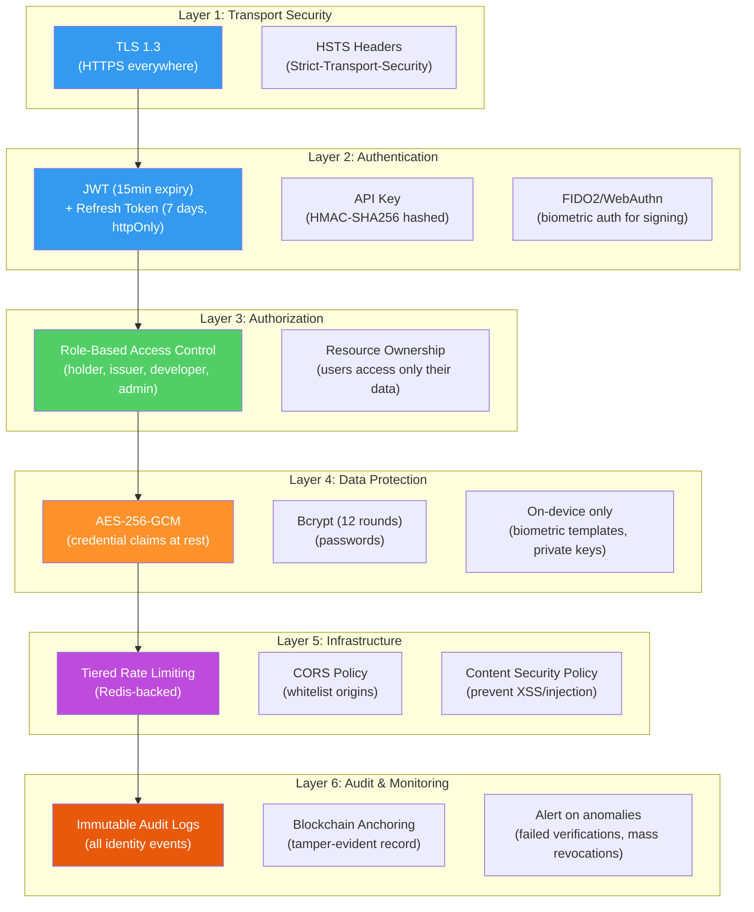
```mermaid
graph TD
    subgraph "Layer 1: Transport Security"
        TLS["TLS 1.3<br/>(HTTPS everywhere)"]
        HSTS["HSTS Headers<br/>(Strict-Transport-Security)"]
    end

    subgraph "Layer 2: Authentication"
        JWT["JWT (15min expiry)<br/>+ Refresh Token (7 days, httpOnly)"]
        APIKEY["API Key<br/>(HMAC-SHA256 hashed)"]
        FIDO_A["FIDO2/WebAuthn<br/>(biometric auth for signing)"]
    end

    subgraph "Layer 3: Authorization"
        RBAC["Role-Based Access Control<br/>(holder, issuer, developer, admin)"]
        RESOURCE["Resource Ownership<br/>(users access only their data)"]
    end

    subgraph "Layer 4: Data Protection"
        ENCRYPT["AES-256-GCM<br/>(credential claims at rest)"]
        HASH["Bcrypt (12 rounds)<br/>(passwords)"]
        ONDEVICE["On-device only<br/>(biometric templates, private keys)"]
    end

    subgraph "Layer 5: Infrastructure"
        RATE["Tiered Rate Limiting<br/>(Redis-backed)"]
        CORS_S["CORS Policy<br/>(whitelist origins)"]
        CSP["Content Security Policy<br/>(prevent XSS/injection)"]
    end

    subgraph "Layer 6: Audit & Monitoring"
        AUDIT["Immutable Audit Logs<br/>(all identity events)"]
        BC_SEC["Blockchain Anchoring<br/>(tamper-evident record)"]
        ALERT["Alert on anomalies<br/>(failed verifications, mass revocations)"]
    end

    TLS --> JWT
    JWT --> RBAC
    RBAC --> ENCRYPT
    ENCRYPT --> RATE
    RATE --> AUDIT

    style TLS fill:#339af0,color:#fff
    style JWT fill:#339af0,color:#fff
    style RBAC fill:#51cf66,color:#fff
    style ENCRYPT fill:#ff922b,color:#fff
    style RATE fill:#be4bdb,color:#fff
    style AUDIT fill:#e8590c,color:#fff
```

### 7.2 Cryptographic Architecture

| Operation | Algorithm | Key Size | Library |
|-----------|-----------|----------|---------|
| DID key generation | Ed25519 | 256-bit | @noble/ed25519 |
| Credential signing | Ed25519Signature2020 | 256-bit | @noble/ed25519 |
| Key agreement | X25519 | 256-bit | @noble/ed25519 |
| Claims encryption at rest | AES-256-GCM | 256-bit | Node.js crypto |
| Password hashing | Bcrypt | 12 rounds | bcrypt |
| API key hashing | HMAC-SHA256 | 256-bit | Node.js crypto |
| Document hashing | SHA-256 | 256-bit | Node.js crypto |
| ZKP proof system | Groth16 (BN128) | 128-bit security | snarkjs |
| Recovery phrase | BIP-39 | 128-bit entropy | bip39 |
| Shamir secret sharing | GF(256) | Threshold 2-of-3 | shamir-secret-sharing |
| Biometric template hash | SHA-256 | 256-bit | Node.js crypto |

### 7.3 Key Management

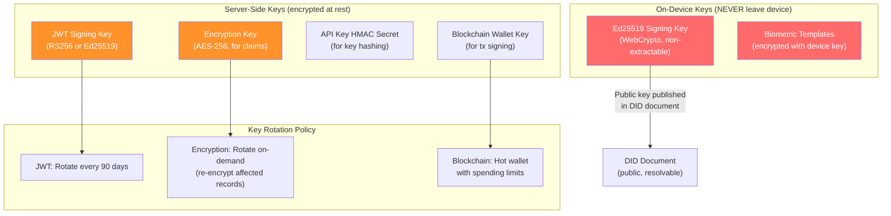
```mermaid
flowchart TD
    subgraph "On-Device Keys (NEVER leave device)"
        SIGNING["Ed25519 Signing Key<br/>(WebCrypto, non-extractable)"]
        BIO_T["Biometric Templates<br/>(encrypted with device key)"]
    end

    subgraph "Server-Side Keys (encrypted at rest)"
        JWT_KEY["JWT Signing Key<br/>(RS256 or Ed25519)"]
        ENCRYPT_KEY["Encryption Key<br/>(AES-256, for claims)"]
        API_HMAC["API Key HMAC Secret<br/>(for key hashing)"]
        ANCHOR_KEY["Blockchain Wallet Key<br/>(for tx signing)"]
    end

    subgraph "Key Rotation Policy"
        JWT_ROT["JWT: Rotate every 90 days"]
        ENCRYPT_ROT["Encryption: Rotate on-demand<br/>(re-encrypt affected records)"]
        ANCHOR_ROT["Blockchain: Hot wallet<br/>with spending limits"]
    end

    SIGNING -->|"Public key published<br/>in DID document"| DID_DOC["DID Document<br/>(public, resolvable)"]

    JWT_KEY --> JWT_ROT
    ENCRYPT_KEY --> ENCRYPT_ROT
    ANCHOR_KEY --> ANCHOR_ROT

    style SIGNING fill:#ff6b6b,color:#fff
    style BIO_T fill:#ff6b6b,color:#fff
    style JWT_KEY fill:#ff922b,color:#fff
    style ENCRYPT_KEY fill:#ff922b,color:#fff
```

### 7.4 Privacy Controls

| Control | Implementation | Requirement |
|---------|---------------|------------|
| Biometric data residency | Templates stored ONLY on user's device, encrypted with AES-256 device key | NFR-007 |
| Credential claim encryption | AES-256-GCM at rest in PostgreSQL (encrypted_claims column) | NFR-008 |
| Private key isolation | WebCrypto API with `extractable: false`; all signing on-device | NFR-009 |
| Selective disclosure | ZKP (Groth16) proves attributes without revealing underlying data | FR-016 |
| Data minimization | Collect only required fields; no unnecessary PII | NFR-015 |
| Right to erasure (GDPR) | Deactivate DID + purge PII after 30 days; anchored hashes remain on-chain (non-PII) | NFR-013 |
| Audit trail | All identity events logged with IP, user agent, action, timestamp | NFR-016 |
| Consent management | Holder explicitly approves each credential presentation | FR-017 |

### 7.5 OWASP Top 10 Mitigations

| # | Risk | Mitigation |
|---|------|-----------|
| A01 | Broken Access Control | RBAC with resource ownership checks; JWT + API key dual auth |
| A02 | Cryptographic Failures | AES-256-GCM for data at rest; TLS 1.3 in transit; Ed25519 for signatures |
| A03 | Injection | Zod input validation at route boundary; Prisma parameterized queries |
| A04 | Insecure Design | Privacy by design; threat modeling; security review gate |
| A05 | Security Misconfiguration | CORS whitelist; CSP headers; HSTS; no default credentials |
| A06 | Vulnerable Components | `npm audit` in CI; Dependabot; SCA in pipeline |
| A07 | Auth Failures | Bcrypt (12 rounds); JWT 15min expiry; rate limiting on auth endpoints |
| A08 | Data Integrity Failures | Blockchain anchoring provides tamper-evident audit trail |
| A09 | Logging Failures | Structured JSON logging; PII redaction; 7-year retention |
| A10 | SSRF | No server-side URL fetching; DID resolution via allowlisted resolvers only |

---

## 8. Technology Decisions

Key architecture decisions are documented in individual ADRs in `docs/ADRs/`. Summary:

| ADR | Decision | Rationale |
|-----|----------|-----------|
| ADR-001 | `did:humanid` custom DID method | Full control over resolution, optimized for our use case |
| ADR-002 | snarkjs + circom for ZKP | WASM support, Groth16 prover, circom circuit language, active community |
| ADR-003 | Polygon L2 for anchoring | Low gas (~$0.001/tx), 2s finality, EVM compatible, production proven |
| ADR-004 | W3C VC Data Model 2.0 | Industry standard, JSON-LD, interoperable with other platforms |
| ADR-005 | WebCrypto + non-extractable keys | Browser-native, hardware-backed on supported devices, no key exfiltration |

See individual ADR files for full Context / Decision / Consequences / Alternatives analysis.

---

## 9. Deployment Architecture

### 9.1 Development Environment

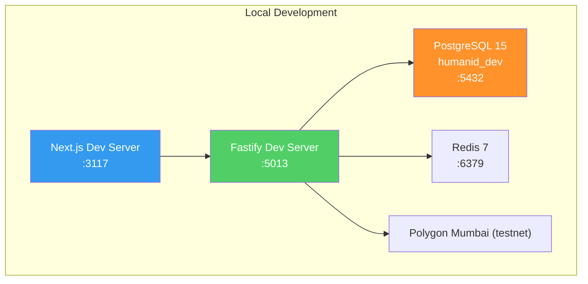
```mermaid
graph TD
    subgraph "Local Development"
        DEV_WEB["Next.js Dev Server<br/>:3117"]
        DEV_API["Fastify Dev Server<br/>:5013"]
        DEV_DB["PostgreSQL 15<br/>humanid_dev<br/>:5432"]
        DEV_REDIS["Redis 7<br/>:6379"]
        DEV_BC["Polygon Mumbai (testnet)"]
    end

    DEV_WEB --> DEV_API
    DEV_API --> DEV_DB
    DEV_API --> DEV_REDIS
    DEV_API --> DEV_BC

    style DEV_WEB fill:#339af0,color:#fff
    style DEV_API fill:#51cf66,color:#fff
    style DEV_DB fill:#ff922b,color:#fff
```

### 9.2 Production Architecture (Target)

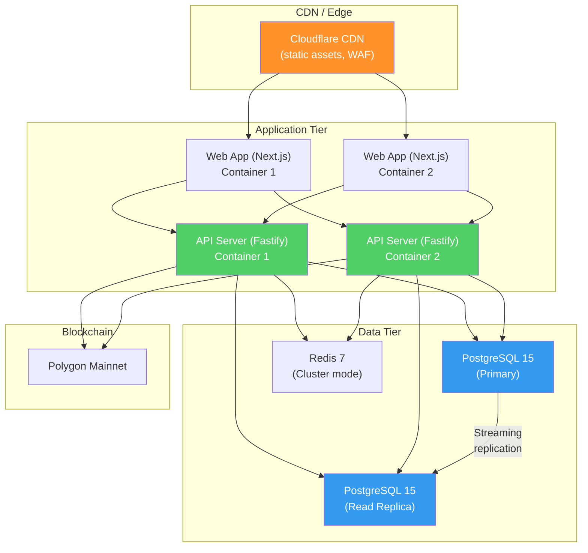
```mermaid
graph TD
    subgraph "CDN / Edge"
        CF["Cloudflare CDN<br/>(static assets, WAF)"]
    end

    subgraph "Application Tier"
        WEB_1["Web App (Next.js)<br/>Container 1"]
        WEB_2["Web App (Next.js)<br/>Container 2"]
        API_1["API Server (Fastify)<br/>Container 1"]
        API_2["API Server (Fastify)<br/>Container 2"]
    end

    subgraph "Data Tier"
        DB_PRIMARY["PostgreSQL 15<br/>(Primary)"]
        DB_REPLICA["PostgreSQL 15<br/>(Read Replica)"]
        REDIS_PROD["Redis 7<br/>(Cluster mode)"]
    end

    subgraph "Blockchain"
        POLYGON_MAIN["Polygon Mainnet"]
    end

    CF --> WEB_1 & WEB_2
    WEB_1 & WEB_2 --> API_1 & API_2
    API_1 & API_2 --> DB_PRIMARY
    API_1 & API_2 --> DB_REPLICA
    API_1 & API_2 --> REDIS_PROD
    API_1 & API_2 --> POLYGON_MAIN

    DB_PRIMARY -->|"Streaming<br/>replication"| DB_REPLICA

    style CF fill:#ff922b,color:#fff
    style API_1 fill:#51cf66,color:#fff
    style API_2 fill:#51cf66,color:#fff
    style DB_PRIMARY fill:#339af0,color:#fff
    style DB_REPLICA fill:#339af0,color:#fff
```

### 9.3 Docker Compose (Development)

```yaml
# products/humanid/docker-compose.yml
services:
  postgres:
    image: postgres:15-alpine
    ports: ["127.0.0.1:5432:5432"]
    environment:
      POSTGRES_DB: humanid_dev
      POSTGRES_HOST_AUTH_METHOD: trust
    volumes: [humanid-pgdata:/var/lib/postgresql/data]
    healthcheck:
      test: ["CMD-SHELL", "pg_isready -U postgres"]

  redis:
    image: redis:7-alpine
    ports: ["127.0.0.1:6379:6379"]
    healthcheck:
      test: ["CMD", "redis-cli", "ping"]

  api:
    build: ./apps/api
    ports: ["5013:5013"]
    depends_on: [postgres, redis]
    environment:
      DATABASE_URL: postgresql://postgres@postgres:5432/humanid_dev
      REDIS_URL: redis://redis:6379
      JWT_SECRET: ${JWT_SECRET:?Set JWT_SECRET}
      ENCRYPTION_KEY: ${ENCRYPTION_KEY:?Set ENCRYPTION_KEY}

  web:
    build: ./apps/web
    ports: ["3117:3117"]
    depends_on: [api]
    environment:
      NEXT_PUBLIC_API_URL: http://localhost:5013

volumes:
  humanid-pgdata:
```

---

## 10. Traceability Matrix

### 10.1 User Story to Functional Requirement to Endpoint to Table

| User Story | FR | API Endpoint | DB Tables | Priority |
|-----------|-----|-------------|-----------|----------|
| US-01: Create DID | FR-001, FR-002 | POST /dids, GET /dids/:did | users, dids, did_documents, biometric_bindings | P0 |
| US-02: Biometric Enrollment | FR-003, FR-004, FR-005 | POST /dids (includes biometric) | biometric_bindings | P0 |
| US-03: Recovery Setup | FR-006, FR-007 | PUT /dids/:did (recovery config) | recovery_configs | P0 |
| US-04: Receive Credential | FR-009, FR-010, FR-011 | POST /credentials/receive | credentials | P0 |
| US-05: Selective Disclosure | FR-016, FR-017 | POST /verify/present | credential_presentations, verification_requests | P0 |
| US-06: Revoke Shared Credential | FR-014, FR-018 | POST /credentials/:id/revoke, GET /wallet/sharing-history | credentials, credential_presentations, blockchain_anchors | P1 |
| US-07: Issue Credential | FR-008, FR-012 | POST /credentials, POST /credentials/batch | credentials, credential_templates, blockchain_anchors | P0 |
| US-08: Manage Templates | FR-013 | GET/POST/PUT /templates | credential_templates | P1 |
| US-09: Verify Credential | FR-015 | POST /verify/present, GET /verify/:id/result | verification_requests, credential_presentations, audit_logs | P0 |
| US-10: Request Presentation | FR-019 | POST /verify/request, GET /verify/:id/status | verification_requests | P1 |
| US-11: Developer Registration | FR-020 | POST /developers/register, POST /developers/api-keys | users, api_keys | P0 |
| US-12: SDK Integration | FR-021, FR-022 | POST /verify/request (via SDK) | verification_requests, api_keys | P0 |
| US-13: API Usage & Billing | FR-023, FR-024 | GET /developers/usage | api_keys, audit_logs | P1 |
| US-14: Blockchain Anchoring | FR-025, FR-026, FR-027 | (internal -- triggered by other ops) | blockchain_anchors | P0 |
| US-15: Wallet View | FR-011 | GET /wallet/credentials | credentials, credential_presentations | P0 |
| US-16: QR Code Exchange | FR-009 | POST /wallet/scan | credentials, verification_requests | P1 |
| US-17: Manage Issuers | FR-029 | GET/PUT/POST /admin/issuers, /issuers/* | issuers | P1 |
| US-18: Platform Analytics | FR-030 | GET /admin/analytics, GET /admin/audit | audit_logs, users, dids, credentials | P2 |

### 10.2 Functional Requirement Coverage

| FR ID | Requirement Summary | Covered By Endpoint | Covered By Table | Covered By Service |
|-------|--------------------|--------------------|-----------------|-------------------|
| FR-001 | Generate W3C DID (Ed25519) | POST /dids | dids, did_documents | DIDService |
| FR-002 | Publish DID documents | GET /dids/:did | did_documents | DIDService |
| FR-003 | Biometric enrollment (FIDO2) | POST /dids | biometric_bindings | BiometricService |
| FR-004 | Reject failed liveness (< 3s) | POST /dids | -- | BiometricService |
| FR-005 | Store biometrics on-device only | -- (client-side) | -- | -- (client-side) |
| FR-006 | Three recovery methods | PUT /dids/:did | recovery_configs | DIDService |
| FR-007 | Warning when no recovery | GET /dids/:did | dids | DIDService |
| FR-008 | Issue W3C VC (Ed25519) | POST /credentials | credentials | CredentialService |
| FR-009 | Credential offers (QR + deep link) | POST /wallet/scan | credentials | CredentialService |
| FR-010 | Verify issuer signature on receive | POST /credentials/receive | credentials | CredentialService |
| FR-011 | Store in encrypted wallet | GET /wallet/credentials | credentials | CredentialService |
| FR-012 | Batch issuance (500 in 60s) | POST /credentials/batch | credentials | CredentialService |
| FR-013 | Credential templates CRUD | GET/POST/PUT /templates | credential_templates | CredentialService |
| FR-014 | Credential revocation on-chain | POST /credentials/:id/revoke | credentials, blockchain_anchors | CredentialService, AnchorService |
| FR-015 | Four-check verification (< 2s) | POST /verify/present | verification_requests | VerificationService |
| FR-016 | ZKP selective disclosure | POST /verify/present | credential_presentations | ZKPService |
| FR-017 | Attribute review before approval | POST /verify/present | -- (client-side UI) | -- |
| FR-018 | Revoke shared presentations | GET /wallet/sharing-history | credential_presentations | CredentialService |
| FR-019 | Verifier-initiated requests | POST /verify/request | verification_requests | VerificationService |
| FR-020 | Developer registration (< 30s) | POST /developers/register | users, api_keys | AuthService |
| FR-021 | TypeScript SDK | -- (npm package) | -- | -- (SDK) |
| FR-022 | Tiered rate limits | All endpoints | api_keys | Rate Limit Plugin |
| FR-023 | Developer usage dashboard | GET /developers/usage | api_keys, audit_logs | AuthService |
| FR-024 | Usage threshold alerts | GET /developers/usage | -- | NotificationService |
| FR-025 | Anchor DID on Polygon (< 30s) | (internal) | blockchain_anchors | AnchorService |
| FR-026 | Anchor issuance/revocation | (internal) | blockchain_anchors | AnchorService |
| FR-027 | Retry failed anchoring (3x) | (internal) | blockchain_anchors | AnchorService |
| FR-028 | Public blockchain explorer API | GET /admin/blockchain (Phase 2) | blockchain_anchors | AnchorService |
| FR-029 | Trusted issuer registry | GET/PUT/POST /admin/issuers | issuers | IssuerService |
| FR-030 | Platform analytics | GET /admin/analytics | audit_logs, users, dids | -- (Phase 2) |

### 10.3 Non-Functional Requirement Mapping

| NFR ID | Requirement | Implementation |
|--------|-------------|---------------|
| NFR-001 | DID creation < 5s (p95) | DID generation on-device; server registration < 500ms; anchoring async |
| NFR-002 | Verification < 2s (p95) | Redis-cached issuer trust; indexed DB queries; parallel checks |
| NFR-003 | ZKP proof gen < 5s (mobile) | WASM-compiled circom circuits; pre-loaded proving keys; Web Workers |
| NFR-004 | Batch 500 creds < 60s | PostgreSQL bulk insert; parallel signing; chunked processing |
| NFR-005 | API response < 500ms (p95) | Connection pooling; Redis caching; indexed queries |
| NFR-007 | Biometrics on-device only | WebAuthn/FIDO2 -- templates never leave device |
| NFR-008 | Claims encrypted (AES-256-GCM) | encrypted_claims column; server-side encryption key |
| NFR-009 | Private keys never leave device | WebCrypto extractable: false |
| NFR-010 | OWASP Top 10 | See Section 7.5 |
| NFR-011 | JWT 15min, refresh 7 days | @connectsw/auth configuration |
| NFR-012 | Rate limiting on all endpoints | @fastify/rate-limit + Redis store |
| NFR-013 | GDPR compliance | Data deletion; consent; DPA; audit trail |
| NFR-018 | 100K concurrent holders | Connection pooling; read replicas; Redis caching |
| NFR-019 | 99.9% uptime (verification API) | Multi-container deployment; health checks; graceful degradation |
| NFR-021 | Blockchain degrades gracefully | Async anchoring; never blocks user flow |
| NFR-025 | CI/CD pipeline | GitHub Actions quality gate workflow |

---

## Appendix A: ConnectSW Shared Package Usage

| Package | Usage in HumanID |
|---------|-----------------|
| `@connectsw/auth` | JWT + API key dual auth plugin, auth routes, useAuth hook, TokenManager |
| `@connectsw/ui` | Button, Card, Input, Badge, StatCard, DataTable, DashboardLayout, Sidebar, ThemeToggle |
| `@connectsw/shared` | Logger (PII redaction), Crypto Utils (hashing), Prisma Plugin, Redis Plugin |
| `@connectsw/audit` | AuditLogService (DB + ring buffer), audit routes, createAuditHook |
| `@connectsw/notifications` | Email verification, issuer approval notifications, usage alerts |

## Appendix B: File Structure

```
products/humanid/
├── apps/
│   ├── api/
│   │   ├── src/
│   │   │   ├── plugins/
│   │   │   │   ├── prisma.ts          # from @connectsw/shared
│   │   │   │   ├── redis.ts           # from @connectsw/shared
│   │   │   │   ├── auth.ts            # from @connectsw/auth
│   │   │   │   ├── rate-limit.ts      # tiered rate limiting
│   │   │   │   └── observability.ts   # from @connectsw/shared
│   │   │   ├── routes/
│   │   │   │   ├── auth.routes.ts
│   │   │   │   ├── did.routes.ts
│   │   │   │   ├── credential.routes.ts
│   │   │   │   ├── verify.routes.ts
│   │   │   │   ├── issuer.routes.ts
│   │   │   │   ├── developer.routes.ts
│   │   │   │   ├── admin.routes.ts
│   │   │   │   ├── template.routes.ts
│   │   │   │   └── wallet.routes.ts
│   │   │   ├── services/
│   │   │   │   ├── did.service.ts
│   │   │   │   ├── credential.service.ts
│   │   │   │   ├── verification.service.ts
│   │   │   │   ├── issuer.service.ts
│   │   │   │   ├── zkp.service.ts
│   │   │   │   ├── biometric.service.ts
│   │   │   │   ├── anchor.service.ts
│   │   │   │   └── audit.service.ts    # from @connectsw/audit
│   │   │   ├── schemas/
│   │   │   │   ├── auth.schemas.ts
│   │   │   │   ├── did.schemas.ts
│   │   │   │   ├── credential.schemas.ts
│   │   │   │   ├── verify.schemas.ts
│   │   │   │   └── common.schemas.ts
│   │   │   ├── types/
│   │   │   │   ├── did.types.ts
│   │   │   │   ├── credential.types.ts
│   │   │   │   └── verification.types.ts
│   │   │   ├── app.ts
│   │   │   └── index.ts
│   │   ├── prisma/
│   │   │   └── schema.prisma
│   │   ├── tests/
│   │   └── package.json
│   └── web/
│       ├── src/
│       │   ├── app/
│       │   │   ├── page.tsx               # Landing
│       │   │   ├── login/page.tsx
│       │   │   ├── register/page.tsx
│       │   │   ├── wallet/
│       │   │   ├── issuer/
│       │   │   ├── developer/
│       │   │   └── admin/
│       │   ├── components/
│       │   │   ├── identity/
│       │   │   │   ├── DIDDisplay.tsx
│       │   │   │   ├── DIDCreationWizard.tsx
│       │   │   │   └── RecoverySetup.tsx
│       │   │   ├── credentials/
│       │   │   │   ├── CredentialCard.tsx
│       │   │   │   ├── CredentialDetail.tsx
│       │   │   │   └── CredentialAcceptModal.tsx
│       │   │   ├── verification/
│       │   │   │   ├── SelectiveDisclosure.tsx
│       │   │   │   └── ProofStatus.tsx
│       │   │   ├── wallet/
│       │   │   │   ├── WalletOverview.tsx
│       │   │   │   └── SharingHistory.tsx
│       │   │   └── biometric/
│       │   │       ├── BiometricEnrollment.tsx
│       │   │       └── LivenessCapture.tsx
│       │   ├── hooks/
│       │   │   ├── useWallet.ts
│       │   │   ├── useDID.ts
│       │   │   └── useZKP.ts
│       │   ├── lib/
│       │   │   ├── api-client.ts
│       │   │   ├── did-utils.ts
│       │   │   └── zkp-utils.ts
│       │   └── types/
│       ├── tests/
│       └── package.json
├── packages/
│   └── did-core/              # Shared DID utilities
│       ├── src/
│       │   ├── did.ts         # DID creation/resolution
│       │   ├── crypto.ts      # Ed25519 operations
│       │   └── zkp.ts         # ZKP circuit helpers
│       └── package.json
├── e2e/
│   ├── identity-creation.spec.ts
│   ├── credential-issuance.spec.ts
│   ├── verification.spec.ts
│   └── developer-flow.spec.ts
├── docs/
│   ├── PRD.md
│   ├── architecture.md        # This file
│   ├── API.md
│   ├── ADRs/
│   │   ├── ADR-001-did-method.md
│   │   ├── ADR-002-zkp-framework.md
│   │   ├── ADR-003-blockchain-network.md
│   │   ├── ADR-004-credential-format.md
│   │   └── ADR-005-key-management.md
│   ├── security.md
│   └── specs/
├── .claude/
│   ├── addendum.md
│   └── task-graph.yml
├── docker-compose.yml
├── package.json
└── README.md
```

---

*Architecture document prepared by Architect Agent, ConnectSW*
*Last updated: February 19, 2026*
