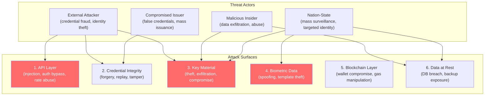
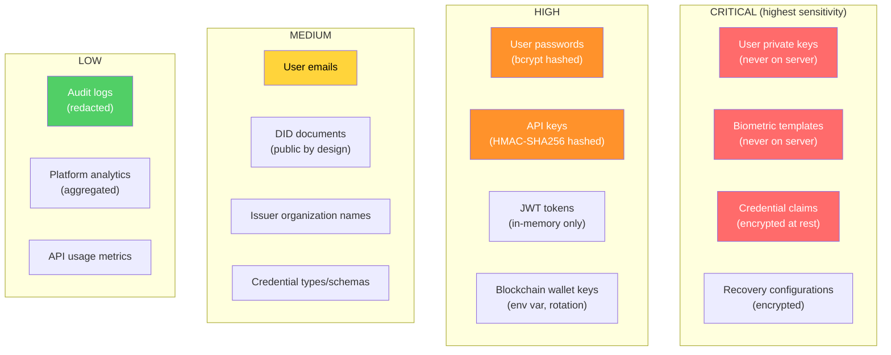
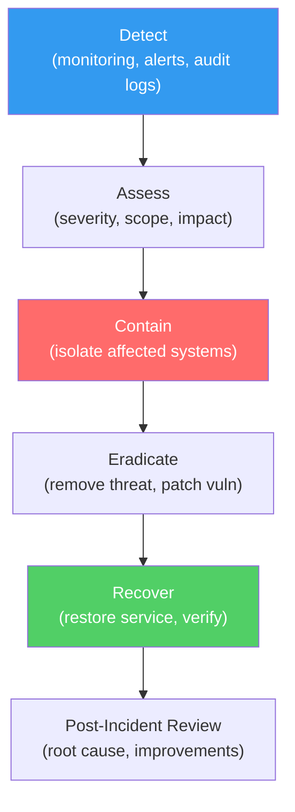

# HumanID -- Security Considerations

**Version**: 1.0
**Date**: February 19, 2026
**Author**: Architect + Security Engineer, ConnectSW
**Classification**: Internal -- Sensitive

---

## 1. Threat Model Overview

HumanID is a security-critical identity platform. A breach could compromise user identities, expose personal data, or enable identity fraud. The threat model covers six attack surfaces.

---

## 2. Security Controls by Attack Surface

### 2.1 API Layer Security

| Threat | Control | Implementation |
|--------|---------|---------------|
| SQL Injection | Parameterized queries | Prisma ORM (all queries parameterized by design) |
| NoSQL Injection | Zod input validation | All inputs validated at route boundary with strict schemas |
| XSS | CSP headers + output encoding | Content-Security-Policy, React auto-escaping, no `dangerouslySetInnerHTML` |
| CSRF | SameSite cookies + CSRF tokens | Refresh token: `httpOnly`, `Secure`, `SameSite=Strict` |
| Authentication bypass | Dual auth (JWT + API key) | @connectsw/auth plugin with JTI blacklist |
| Authorization bypass | RBAC + resource ownership | Role check + ownership check on every protected endpoint |
| Rate limiting abuse | Tiered rate limits (Redis-backed) | @fastify/rate-limit with RedisRateLimitStore |
| DDoS | CDN + rate limiting + monitoring | Cloudflare WAF (production), Redis-backed rate limits |
| Email enumeration | Consistent error responses | "An account with this email already exists" (no differentiation) |
| Brute force login | Account lockout + exponential backoff | 5 failed attempts -> 15 min lockout |

### 2.2 Credential Integrity

| Threat | Control | Implementation |
|--------|---------|---------------|
| Credential forgery | Ed25519 digital signatures | Every VC signed by issuer's Ed25519 key; signature verified on every presentation |
| Credential tampering | Blockchain anchoring | SHA-256 hash of VC anchored on Polygon; tamper = hash mismatch |
| Credential replay | Presentation nonce + timestamp | Each VP includes verifier-provided nonce and creation timestamp |
| Expired credential use | Expiry check in verification flow | Four-check verification: signature -> trust -> revocation -> expiry |
| Revoked credential use | On-chain revocation registry | Revocation anchored on Polygon; checked in every verification |
| Untrusted issuer | Trusted issuer registry | Issuers must be admin-approved; credentials from untrusted issuers fail verification |
| Mass false credential issuance | Issuer rate limits + monitoring | Alert on unusual issuance volume; revokable trust status |

### 2.3 Key Material Security

| Threat | Control | Implementation |
|--------|---------|---------------|
| User private key theft | Non-extractable WebCrypto keys | `extractable: false`; key material never accessible to JavaScript |
| Server key theft | Environment variables + rotation | Keys in env vars, not in code; 90-day rotation for JWT keys |
| XSS key exfiltration | In-memory token storage | JWT stored in memory only (never localStorage); @connectsw/auth TokenManager |
| Key loss (user) | Three recovery methods | Recovery phrase, social recovery (Shamir 2-of-3), encrypted cloud backup |
| Blockchain wallet compromise | Hot wallet with spending limits | Alert at low balance; daily tx limit; multi-sig for production |

### 2.4 Biometric Data Security

| Threat | Control | Implementation |
|--------|---------|---------------|
| Biometric template theft | On-device only storage | Templates NEVER transmitted to server; only SHA-256 hash stored server-side |
| Face spoofing | Liveness detection | 3-pose face capture with active liveness check (< 3s rejection) |
| Fingerprint spoofing | FIDO2/WebAuthn | Hardware-backed biometric via platform authenticator |
| Biometric data breach | No server-side biometric data | Server stores only template hash; no biometric data to breach |
| Device compromise | Encrypted biometric storage | Templates encrypted with device key (AES-256) |

### 2.5 Blockchain Layer Security

| Threat | Control | Implementation |
|--------|---------|---------------|
| Wallet key compromise | Environment variable + spending limits | Daily tx limit, low-balance alerts, separate hot/cold wallets |
| Gas price manipulation | Dynamic gas pricing with cap | 1.5x escalation on retry, maximum gas cap, alert on high gas |
| Transaction front-running | Anchoring is hash-only | No value transfer in anchoring txs; front-running has no benefit |
| Chain reorganization | Wait for confirmation | Poll for receipt (confirmations: 3 blocks on Polygon) |

### 2.6 Data at Rest Security

| Threat | Control | Implementation |
|--------|---------|---------------|
| Database breach | Encryption at rest | Credential claims encrypted with AES-256-GCM; passwords hashed with bcrypt (12 rounds) |
| Backup exposure | Encrypted backups | Database backups encrypted; separate encryption key management |
| PII in logs | Structured logging with PII redaction | @connectsw/shared Logger auto-redacts password, token, key, SSN, etc. |
| Audit log tampering | Immutable audit logs + blockchain | Audit logs append-only; critical events anchored on-chain |

---

## 3. Data Classification

---

## 4. Encryption Standards

| Data | Algorithm | Key Size | Notes |
|------|-----------|----------|-------|
| Credential claims at rest | AES-256-GCM | 256-bit | Random 96-bit IV per encryption; 128-bit auth tag |
| User passwords | Bcrypt | 12 rounds | Salt generated per password |
| API key storage | HMAC-SHA256 | 256-bit | API_KEY_HMAC_SECRET env var |
| Recovery config | AES-256-GCM | 256-bit | Separate encryption key from claims key |
| DID signing | Ed25519 | 256-bit | User's on-device key |
| Credential signing | Ed25519Signature2020 | 256-bit | Issuer's key |
| Key agreement | X25519 | 256-bit | Derived from Ed25519 key |
| ZKP proof system | Groth16 (BN128) | 128-bit security | snarkjs |
| Document hashing | SHA-256 | 256-bit | For blockchain anchoring |
| Session tokens | Cryptographic random | 256-bit | crypto.randomBytes(32) |

---

## 5. Compliance Requirements

### 5.1 GDPR (General Data Protection Regulation)

| Right | Implementation |
|-------|---------------|
| Right to Access | GET /api/v1/wallet/credentials -- user can export all their data |
| Right to Rectification | Credential re-issuance by issuer (old credential revoked) |
| Right to Erasure | DID deactivation -> 30-day PII purge queue; blockchain hashes remain (non-PII) |
| Right to Portability | W3C VC format is portable by design; credentials are standard JSON-LD |
| Right to Object | Holder can deny any presentation request |
| Consent | Explicit consent for each credential presentation; consent recorded in audit log |
| Data Minimization | Selective disclosure via ZKP -- share only required attributes |
| Data Protection Officer | DPO contact in privacy policy |

### 5.2 CCPA (California Consumer Privacy Act)

| Right | Implementation |
|-------|---------------|
| Right to Know | Privacy dashboard showing what data is collected and why |
| Right to Delete | Same as GDPR Right to Erasure |
| Right to Opt-Out | No data selling; opt-out of analytics tracking |
| Non-Discrimination | No service degradation for exercising rights |

### 5.3 Security Standards

| Standard | Status | Notes |
|----------|--------|-------|
| OWASP Top 10 | Implemented | See Section 7.5 of architecture.md |
| SOC 2 Type II | Phase 2 | Requires 6 months of operational data |
| ISO 27001 | Future | Planned for enterprise customers |
| eIDAS 2.0 | Phase 2 | EU digital identity framework compliance |
| FIDO2 Certification | MVP | WebAuthn Level 1 compliance |

---

## 6. Incident Response

### 6.1 Security Event Categories

| Category | Examples | Response Time |
|----------|---------|--------------|
| P0 - Critical | Key compromise, data breach, credential forgery | Immediate (< 1 hour) |
| P1 - High | Authentication bypass, unauthorized access, mass revocation | < 4 hours |
| P2 - Medium | Rate limit bypass, failed brute force, suspicious activity | < 24 hours |
| P3 - Low | Failed login attempts, configuration drift | < 72 hours |

### 6.2 Response Flow

### 6.3 Specific Scenarios

| Scenario | Immediate Action |
|----------|-----------------|
| **Blockchain wallet compromised** | Freeze wallet, rotate keys, audit all recent anchors |
| **JWT signing key leaked** | Rotate JWT key, invalidate all sessions, force re-login |
| **Issuer compromised** | Revoke issuer trust, flag all their credentials, notify holders |
| **Database breach** | Rotate encryption key, force password reset, credential re-encryption |
| **Credential forgery detected** | Revoke forged credential, investigate issuer, alert affected verifiers |

---

## 7. Security Testing Requirements

| Test Type | Frequency | Tool |
|-----------|-----------|------|
| SAST (Static Analysis) | Every PR | ESLint security plugin, CodeGuardian |
| Dependency Audit | Every PR | npm audit, Dependabot |
| DAST (Dynamic Analysis) | Weekly | OWASP ZAP |
| Penetration Testing | Quarterly | External firm |
| Cryptographic Review | Pre-launch | External cryptographer |
| ZKP Circuit Audit | Pre-launch | Specialized ZKP auditor |
| Key Management Review | Quarterly | Internal security team |

---

## 8. Security Monitoring

### 8.1 Alerts

| Alert | Trigger | Severity |
|-------|---------|----------|
| Failed login spike | > 50 failed logins/min from same IP | P1 |
| Mass credential revocation | > 100 revocations/hour from same issuer | P1 |
| Blockchain wallet low balance | < 0.5 MATIC | P2 |
| API key abuse | > 10x normal volume for an API key | P2 |
| Unusual DID creation volume | > 1000 DIDs/hour | P2 |
| Failed verification spike | > 80% failure rate for an issuer's credentials | P2 |
| Database connection exhaustion | Pool usage > 90% | P1 |

### 8.2 Audit Events (Logged for Compliance)

| Event | Logged Data | Retention |
|-------|-------------|-----------|
| DID created | DID, user ID, timestamp, IP | 7 years |
| Credential issued | Credential type, holder DID, issuer DID, timestamp | 7 years |
| Credential revoked | Credential ID, reason, timestamp, actor | 7 years |
| Credential presented | Credential ID, verifier, attributes disclosed, proof type | 7 years |
| Verification completed | Request ID, result (pass/fail), reason, timestamp | 7 years |
| Issuer trust changed | Issuer ID, old status, new status, actor, reason | 7 years |
| API key created/revoked | Key prefix, environment, actor, timestamp | 7 years |
| Login/logout | User ID, IP, device info, success/failure | 7 years |
| Account status changed | User ID, old status, new status, actor, reason | 7 years |
| Blockchain anchor | Entity type, entity ID, tx hash, chain, status | 7 years |

---

*Security document prepared by Architect + Security Engineer, ConnectSW*
*Last updated: February 19, 2026*
*Classification: Internal -- Sensitive*
