# LinkedIn Agent — Architecture

## 1. Business Context

LinkedIn Agent is an AI-powered content assistant for Arab tech professionals who want to build thought leadership on LinkedIn. It analyzes trends, generates bilingual posts (Arabic + English), recommends optimal content formats, and creates carousel slides — all powered by multi-model AI routing through OpenRouter.

**Target users**: Arab tech professionals, bilingual content creators, GRC/cybersecurity thought leaders.

**Key differentiator**: Arabic-first AI content generation with format intelligence and multi-model cost optimization.

---

## 2. C4 Level 1 — System Context

```mermaid
graph TD
    User["👤 Content Creator<br/>(Arab Tech Professional)"]
    LA["<b>LinkedIn Agent</b><br/>AI Content Assistant<br/>Ports: 3114 / 5010"]
    OR["☁️ OpenRouter API<br/>(AI Gateway)"]
    LI["☁️ LinkedIn<br/>(Manual post via copy-paste)"]
    PG["🗄️ PostgreSQL<br/>(Database)"]

    User -->|"Paste articles,<br/>configure posts"| LA
    LA -->|"AI inference requests<br/>(Claude, Gemini, GPT)"| OR
    LA -->|"Stores drafts,<br/>trends, usage logs"| PG
    User -->|"Copy-paste<br/>generated content"| LI
    OR -->|"Generated text,<br/>analysis results"| LA

    style LA fill:#7950f2,color:#fff,stroke:#5c3dba,stroke-width:3px
    style User fill:#339af0,color:#fff
    style OR fill:#ff922b,color:#fff
    style LI fill:#0a66c2,color:#fff
    style PG fill:#339af0,color:#fff
```

---

## 3. C4 Level 2 — Container Diagram

```mermaid
graph TD
    subgraph "LinkedIn Agent System"
        WEB["🌐 Next.js 15 Frontend<br/>React 19, Tailwind CSS<br/>Port: 3114"]
        API["⚡ Fastify API<br/>TypeScript, Prisma ORM<br/>Port: 5010"]
        DB["🗄️ PostgreSQL<br/>4 tables<br/>Port: 5432"]
    end

    subgraph "External Services"
        OR["☁️ OpenRouter API"]
        CLAUDE["🤖 Claude Sonnet 4.5<br/>(Writing, Translation)"]
        GEMINI["🤖 Gemini 2.0 Flash<br/>(Trend Analysis)"]
        GPT["🤖 GPT-4o-mini<br/>(Quick Edits)"]
    end

    User["👤 Content Creator"] -->|"HTTPS"| WEB
    WEB -->|"REST API calls<br/>/api/*"| API
    API -->|"Prisma queries"| DB
    API -->|"POST /chat/completions"| OR
    OR --> CLAUDE
    OR --> GEMINI
    OR --> GPT

    style WEB fill:#339af0,color:#fff
    style API fill:#7950f2,color:#fff
    style DB fill:#20c997,color:#fff
    style OR fill:#ff922b,color:#fff
    style CLAUDE fill:#d4a574,color:#333
    style GEMINI fill:#4285f4,color:#fff
    style GPT fill:#10a37f,color:#fff
```

---

## 4. Sequence Diagram — Post Generation Flow

---

## 5. Sequence Diagram — Trend Analysis Flow

---

## 6. Entity-Relationship Diagram

---

## 7. State Diagram — Post Draft Lifecycle

---

## 8. AI Model Routing

```mermaid
flowchart LR
    subgraph "Task Types"
        W["✍️ Writing"]
        A["📊 Analysis"]
        T["🌐 Translation"]
        I["🎨 Image Prompts"]
        E["✏️ Quick Edits"]
    end

    subgraph "Models (via OpenRouter)"
        C["Claude Sonnet 4.5<br/>Best Arabic quality"]
        G["Gemini 2.0 Flash<br/>Long context, fast"]
        GPT["GPT-4o-mini<br/>Cost-effective"]
    end

    W --> C
    T --> C
    I --> C
    A --> G
    E --> GPT

    style C fill:#d4a574,color:#333
    style G fill:#4285f4,color:#fff
    style GPT fill:#10a37f,color:#fff
```

---

## 9. API Endpoints Summary

| Method | Endpoint | Purpose |
|--------|----------|---------|
| `GET` | `/health` | Health check |
| `POST` | `/api/trends/analyze` | Analyze content for trends |
| `GET` | `/api/trends` | List analyzed trends |
| `POST` | `/api/posts/generate` | Generate AI post |
| `GET` | `/api/posts` | List post drafts |
| `GET` | `/api/posts/:id` | Get single post |
| `PATCH` | `/api/posts/:id` | Update post |
| `DELETE` | `/api/posts/:id` | Delete post |
| `POST` | `/api/posts/:id/translate` | Translate post (AR↔EN) |
| `POST` | `/api/posts/:id/carousel` | Generate carousel slides |
| `GET` | `/api/posts/:id/carousel` | Get carousel for post |
| `GET` | `/api/models` | List available AI models |
| `GET` | `/api/models/usage` | Usage stats and costs |

---

## 10. Security

- **CORS**: Restricted to frontend origin (`http://localhost:3114`)
- **Rate Limiting**: 100 req/15min global; endpoint-specific limits (10/min for analysis, 20/hr for generation)
- **Headers**: X-Content-Type-Options, X-Frame-Options, CSP, HSTS (production)
- **Error Format**: RFC 7807 Problem Details
- **Input Validation**: Zod schemas on all endpoints
