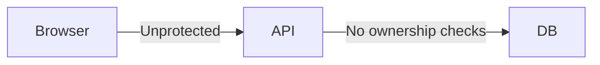
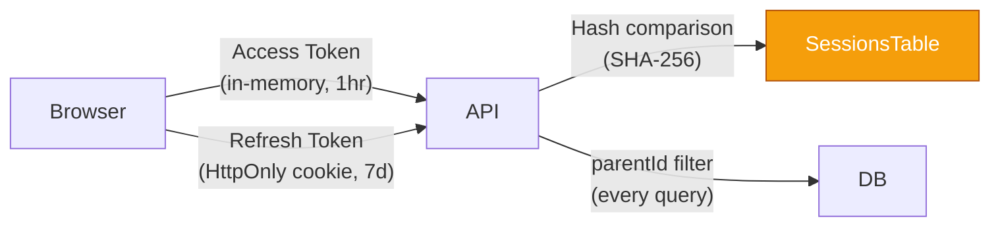

# ADR-004: Authentication Strategy

## Status

Accepted

## Context

Mu'aththir needs an authentication system that:

1. Protects sensitive child development data (COPPA/GDPR)
2. Supports email+password login (no OAuth in MVP)
3. Provides session management with secure token storage
4. Handles password reset flows
5. Enforces rate limiting on auth endpoints
6. Is consistent with ConnectSW patterns

The key design questions are:
- How to store and transmit tokens securely
- How to handle session lifecycle (expiry, rotation, revocation)
- Password hashing cost factor vs. user experience
- Whether to use the shared `@connectsw/auth` package or build custom

### Before (No Auth)

### After (JWT + Refresh Token)

## Decision

Use **custom JWT access tokens (1hr) + HttpOnly refresh token cookies (7d)** with refresh token rotation and SHA-256 hash storage, adapted from `@connectsw/auth`.

### Token Architecture

| Token | Type | Expiry | Storage (Client) | Storage (Server) |
|-------|------|--------|-------------------|------------------|
| Access Token | JWT (HS256) | 1 hour | In-memory (TokenManager) | Not stored |
| Refresh Token | Random 256-bit | 7 days | HttpOnly, Secure, SameSite=Strict cookie | SHA-256 hash in `sessions` table |

### Password Handling

- **Hashing**: bcrypt with cost factor 12
- **Validation**: Min 8 chars, 1 uppercase letter, 1 number (FR-002)
- **Reset**: Random token, 1-hour expiry, single-use, stored as hash (FR-003)
- **On change**: All sessions except current invalidated

### Rate Limiting

| Endpoint | Limit | Window | Scope |
|----------|-------|--------|-------|
| POST /api/auth/register | 10 | 1 minute | Per IP |
| POST /api/auth/login | 20 | 1 minute | Per IP |
| POST /api/auth/forgot-password | 5 | 1 minute | Per IP |
| All other auth endpoints | 30 | 1 minute | Per IP |
| All authenticated endpoints | 200 | 1 minute | Per user |

### Why Adapt @connectsw/auth (Not Use Directly)

The shared auth package provides the foundation but needs adaptation:
- **JWT payload**: Muaththir includes `tier` (subscription level) for middleware checks
- **Fastify version**: @connectsw/auth targets Fastify 4.x; Muaththir uses 5.x
- **No API keys**: Muaththir has no programmatic API access (no dual auth)
- **Session table**: Uses `tokenHash` (SHA-256) not plaintext `token`

## Consequences

### Positive

- **XSS protection**: Access tokens never in localStorage. TokenManager holds in memory only.
- **CSRF protection**: HttpOnly, SameSite=Strict cookies prevent CSRF on refresh endpoint.
- **Token rotation**: Each refresh issues new tokens, limiting window if token is compromised.
- **Hash storage**: DB breach does not expose valid tokens (PATTERN-018).
- **Consistent patterns**: Follows ConnectSW auth patterns.

### Negative

- **Token refresh complexity**: Client must handle 401 responses and retry with refreshed token.
- **bcrypt cost 12**: ~250ms per hash operation. Acceptable for auth but not for bulk operations.
- **No OAuth**: Users must create passwords. May reduce signup conversion vs. "Login with Google".

### Neutral

- In-memory rate limiting for MVP. Will need Redis-backed rate limiting at scale.
- No multi-factor authentication in MVP. Can be added later.

## Alternatives Considered

### Alternative 1: Session-Only (No JWT)

- **Pros**: Simpler, immediate revocation, no token expiry management
- **Cons**: Every request hits session table (DB round-trip), no stateless scaling
- **Why rejected**: JWT allows stateless verification for most requests. Score calculation and dashboard calls would be too slow with per-request DB session lookup.

### Alternative 2: OAuth (Google/Apple)

- **Pros**: No password management, higher conversion
- **Cons**: Dependency on external providers, privacy concerns (Google tracking), not all target users have Google accounts
- **Why rejected**: MVP simplicity. Muslim families in some regions prefer not to use Google OAuth. Can be added in Phase 2.

### Alternative 3: Passcode/Magic Link

- **Pros**: No password to remember, no password breach risk
- **Cons**: Depends on email delivery speed, frustrating on mobile, no offline access
- **Why rejected**: Target users (parents) will use the app at bedtime/quiet moments. Email magic link adds friction to a time-sensitive usage context.

## References

- PATTERN-017: Token Rotation with JTI Blacklist
- PATTERN-018: Session-Based Auth with Token Hash Storage
- PATTERN-020: Timing-Safe Token Comparison
- PRD v2.0, Section 9.1: FR-001 through FR-007
- PRD v2.0, Section 9.2: NFR-006 through NFR-014
