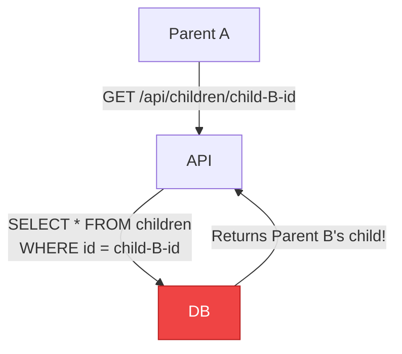
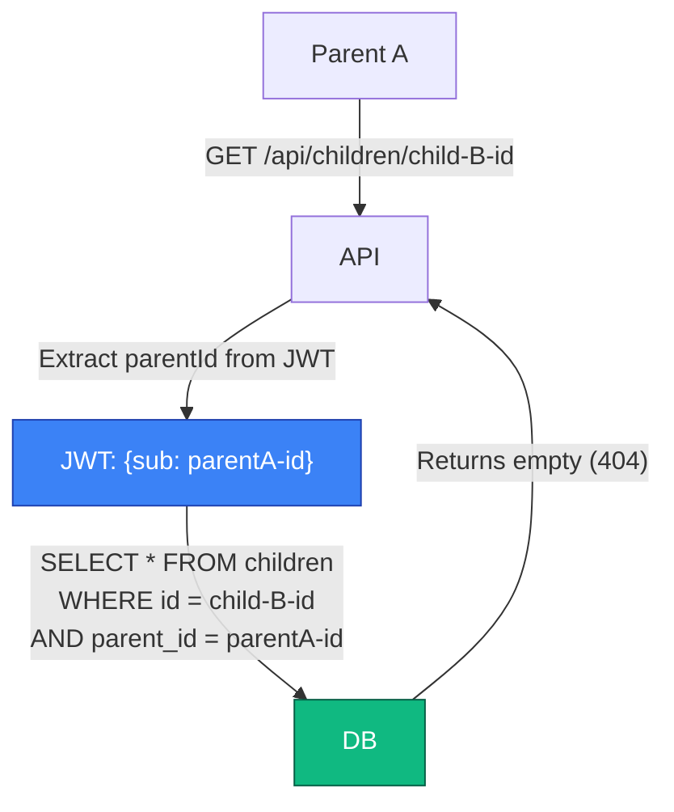
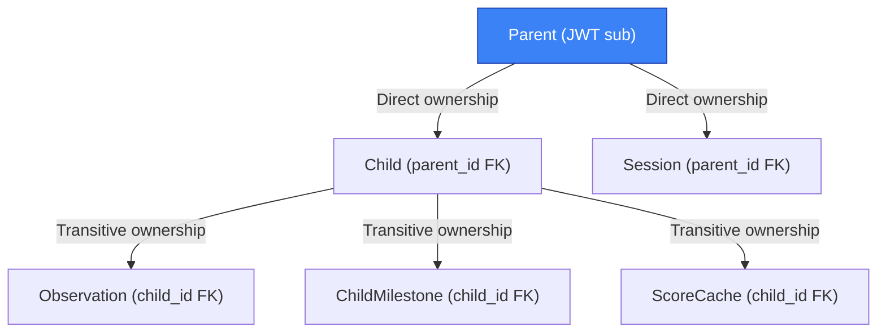
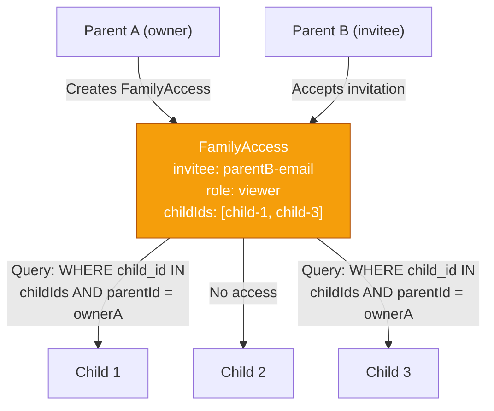

# ADR-005: Multi-Tenancy and Data Isolation

## Status

Accepted

## Context

Mu'aththir stores sensitive child development data (observations, milestones, medical notes). Data isolation between families is a critical security and privacy requirement:

- **COPPA**: Children's data must be protected regardless of jurisdiction (NFR-033)
- **GDPR**: Parents must be able to export and delete all their data (FR-048, FR-049)
- **Trust**: Parents sharing intimate developmental observations must trust that no other parent can access their data
- **Phase 2**: Family sharing (FR-050-052) must be possible without compromising isolation

The key question: how to enforce that Parent A can never access Parent B's children, observations, or milestones.

### Before (No Isolation)



### After (Ownership Filter)



## Decision

Use **application-level row ownership filtering** (single-database, shared schema) where every query includes the authenticated `parentId` as a filter.

### Implementation Pattern

Every service method receives `parentId` from the JWT and includes it in every database query:

```typescript
// Service layer - EVERY method follows this pattern
class ChildrenService {
  async getChild(childId: string, parentId: string) {
    const child = await prisma.child.findFirst({
      where: { id: childId, parentId }  // BOLA prevention
    });
    if (!child) throw new NotFoundError('Child not found');
    return child;
  }

  async getObservations(childId: string, parentId: string, filters: Filters) {
    // First verify child ownership
    await this.getChild(childId, parentId);
    // Then query observations (child_id is FK, so ownership is transitive)
    return prisma.observation.findMany({
      where: { childId, deletedAt: null, ...filters }
    });
  }
}
```

### Ownership Chain



All ownership flows through `Parent -> Child`. Observations, milestones, and scores are owned transitively through the child's `parentId`. Every query that accesses child-owned data first verifies the child belongs to the requesting parent.

### Enforcement Layers

| Layer | Mechanism | Purpose |
|-------|-----------|---------|
| **Route** | `request.currentUser.id` from JWT | Extract authenticated parentId |
| **Handler** | Pass parentId to service methods | Ensure parentId reaches every query |
| **Service** | `WHERE parentId = ?` on every query | BOLA prevention |
| **Database** | `ON DELETE CASCADE` on foreign keys | Cascading deletion on account delete |
| **Test** | Integration tests verify cross-tenant isolation | Catch regressions |

### Phase 2: Family Sharing

The `FamilyAccess` table enables controlled data sharing without breaking isolation:



Shared access is additive (invitee gets READ or READ+WRITE on specific children) and never modifies the ownership model. The owner's `parentId` still gates all queries.

## Consequences

### Positive

- **Simple**: No per-tenant database, no schema isolation overhead
- **GDPR-friendly**: `DELETE FROM parents WHERE id = X` cascades to all child data
- **Export-friendly**: `SELECT * FROM children WHERE parent_id = X` gets everything
- **Testable**: Integration tests can create two parents and verify cross-tenant isolation
- **Phase 2 ready**: FamilyAccess model enables sharing without changing the ownership model

### Negative

- **Developer discipline required**: Every new service method must include parentId filter. A missing filter is a data breach.
- **No database-level enforcement**: PostgreSQL Row-Level Security (RLS) would provide stronger guarantees but adds complexity.
- **Performance**: Additional WHERE clause on every query (negligible with indexed parentId column).

### Neutral

- All `children.parent_id` queries are indexed, so the filter adds no measurable overhead.
- Cascading deletes simplify account deletion but require careful testing.

## Alternatives Considered

### Alternative 1: PostgreSQL Row-Level Security (RLS)

```sql
ALTER TABLE children ENABLE ROW LEVEL SECURITY;
CREATE POLICY parent_isolation ON children
  USING (parent_id = current_setting('app.current_parent_id'));
```

- **Pros**: Database-level enforcement, impossible to bypass in application code
- **Cons**: Requires setting session variable per request, complicates Prisma usage, harder to debug, connection pooling complications (PgBouncer)
- **Why rejected**: Prisma does not natively support RLS session variables. Would require raw SQL for every connection setup, losing type safety. Application-level filtering with integration tests is sufficient for MVP scale.

### Alternative 2: Separate Database Per Tenant

- **Pros**: Strongest isolation, easy GDPR compliance (drop database)
- **Cons**: Operational nightmare at scale, expensive, complex connection management, no cross-tenant queries for analytics
- **Why rejected**: Massive over-engineering for a consumer product. Muaththir will have thousands of parents, not enterprise tenants.

### Alternative 3: Schema-Per-Tenant

- **Pros**: Good isolation, single database, easier than separate DBs
- **Cons**: Schema migrations multiply by tenant count, connection pooling issues, Prisma does not support dynamic schemas
- **Why rejected**: Same issues as separate databases, slightly less severe. Still massive overkill.

## References

- OWASP API Security: BOLA (Broken Object Level Authorization) - #1 API vulnerability
- PRD v2.0, Section 9.2: NFR-010 (resource ownership enforcement)
- PRD v2.0, Section 9.2: NFR-032-036 (GDPR compliance)
- ConnectSW addendum: "All queries filtered by parent_id"
