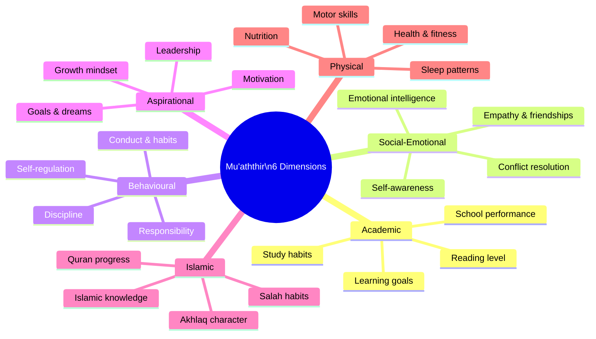
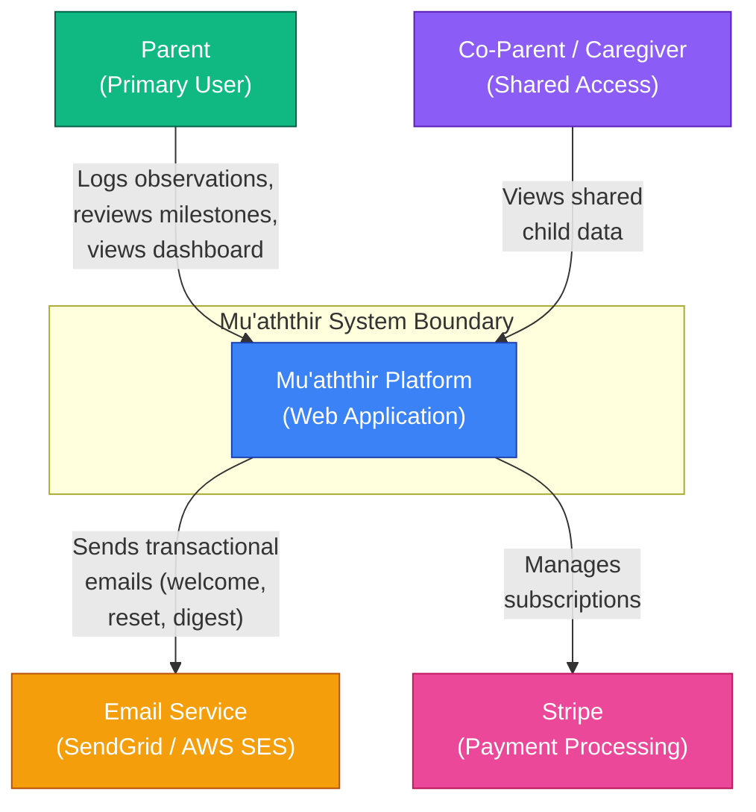
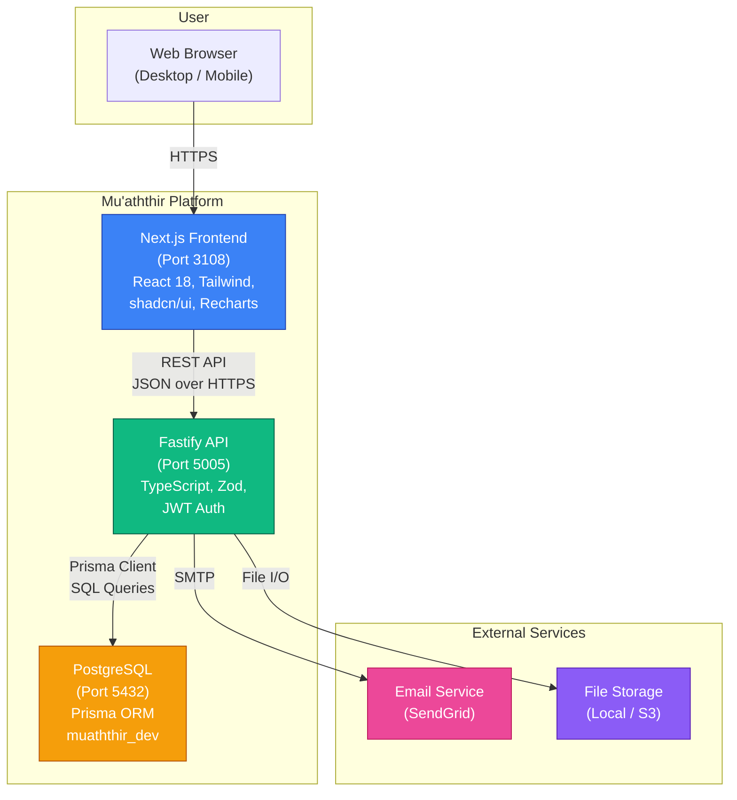
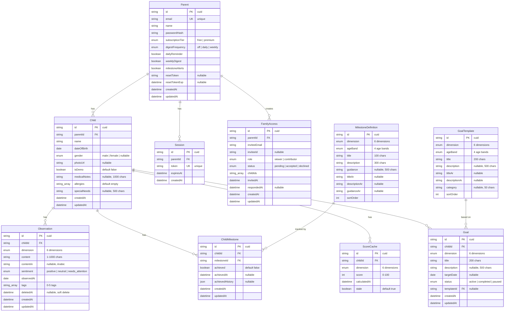
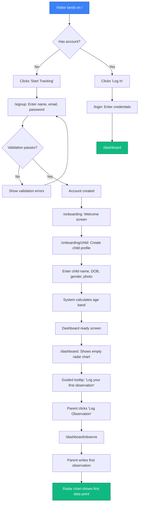
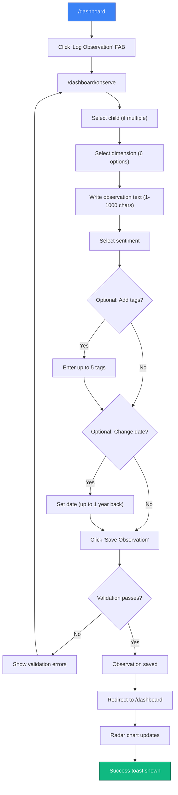
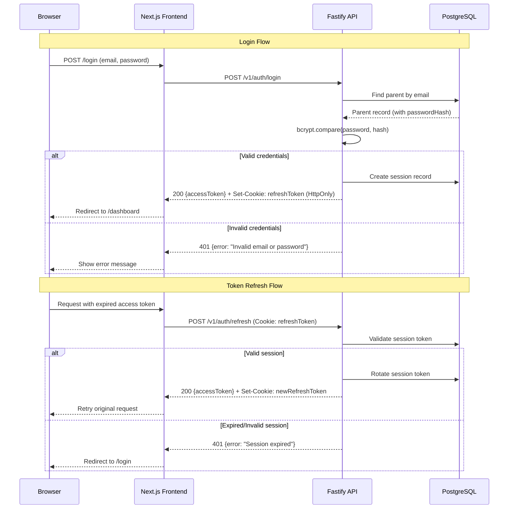
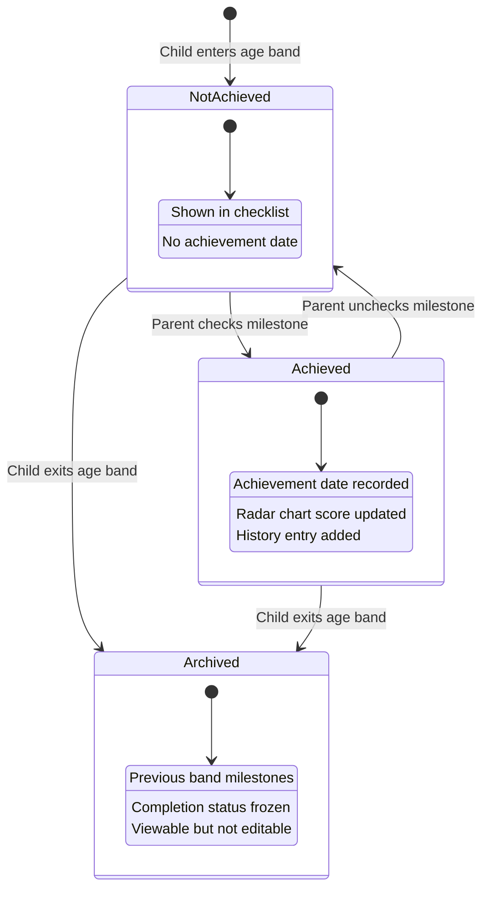

# Mu'aththir -- Product Requirements Document

**Version**: 2.0
**Status**: Active
**Last Updated**: 2026-03-06
**Product Manager**: Claude Product Manager
**Task ID**: PRD-01

---

## 1. Executive Summary

### 1.1 Vision

Mu'aththir is a holistic child development platform that helps parents track and nurture their children across six interconnected dimensions: Academic, Social-Emotional, Behavioural, Aspirational, Islamic, and Physical. Rather than reducing a child to a grade or a report card, Mu'aththir treats every child as a complete human being -- intellectually, emotionally, spiritually, and physically.

The name "Mu'aththir" means "influential" or "impactful" in Arabic. The platform embodies the belief that intentional, holistic parenting creates children who grow into adults of genuine impact.

### 1.2 Problem Statement

Parents lack a unified system to track their children's development across the dimensions that matter. Current tools are fragmented and one-dimensional:

**Core Problems We Solve**:
- **Fragmented tracking**: Parents use separate apps for grades, health, Quran progress, and behaviour charts. No tool connects these dimensions into a coherent picture of the child.
- **Missing dimensions**: Mainstream tools ignore spiritual development, aspirational growth, and social-emotional intelligence entirely. Parents who care about Islamic tarbiyah (upbringing) have zero digital support.
- **Age-inappropriate expectations**: Parents lack guidance on what developmental milestones are appropriate for a 5-year-old versus a 12-year-old across all dimensions, leading to either under-stimulation or burnout.
- **No longitudinal view**: Parents can describe yesterday but not the trajectory. Without historical tracking, they cannot see patterns, regressions, or breakthroughs across months and years.
- **Reactive parenting**: Without structured observation, parents respond to crises (bad grade, behavioural incident) rather than proactively nurturing strengths and addressing gaps before they become problems.

**The Opportunity**: The Muslim parenting market is underserved by technology. There are 1.8 billion Muslims globally, with a young demographic skew. Muslim parents invest heavily in their children's development -- both worldly and spiritual. No platform exists that honours all six dimensions of a child's growth in a single, integrated experience. Furthermore, five of the six dimensions (all except Islamic) are universal, making the platform relevant to any parent who wants a holistic approach.

### 1.3 Target Market

**Primary**: Muslim parents with children ages 3-16
- Families who prioritize both academic achievement and Islamic values
- Parents seeking structured approaches to child development
- Homeschooling families and weekend Islamic school families
- Families in Western countries navigating dual-culture upbringing

**Secondary**: Any parent seeking holistic child development tracking
- Parents dissatisfied with grade-only school tracking
- Parents interested in social-emotional learning (SEL)
- Parents of children with developmental goals across multiple areas

**Initial Launch Market**: English-speaking Muslim families globally (US, UK, Canada, Australia, Gulf states)

### 1.4 Success Metrics

**Business KPIs**:

| Metric | Target | Measurement Period |
|--------|--------|-------------------|
| Registered Families | 1,000 | First 6 months |
| Active Monthly Users | 40% of registered families log 2+ observations/week | Monthly |
| Paid Conversions | 8% free-to-paid within 90 days | Rolling 90-day |
| MRR | $3,000 (375+ paid users at $8/month) | By month 6 |
| Monthly Churn | <6% on paid plans | Monthly |

**Product KPIs**:

| Metric | Target | Measurement Method |
|--------|--------|-------------------|
| Time to First Observation | <5 minutes from completing onboarding | Analytics funnel |
| Observations Per Child Per Week | 3+ average across active users | Database query |
| Dimension Coverage | 80%+ active users log in 4+ dimensions/month | Database query |
| Milestone Engagement | 60%+ parents review milestones in first week | Analytics event |
| Dashboard Return Rate | 70%+ active users view radar chart weekly | Analytics event |

**User Experience KPIs**:

| Metric | Target |
|--------|--------|
| NPS | >55 |
| User Satisfaction | >4.5/5 on holistic tracking value |
| Support Ticket Volume | <2% of active users per month |

---

## 2. User Personas

### Persona 1: Fatima -- Engaged Muslim Mother

**Demographics**:
- Age: 34
- Role: Stay-at-home mother, part-time freelance writer
- Children: 3 (ages 5, 8, and 12)
- Location: London, UK
- Technical Skill: Medium (uses WhatsApp, Instagram, Google Docs)
- Current Tracking: Paper notebook, scattered WhatsApp voice notes to herself

**Goals**:
- Track each child's Quran memorization progress alongside their school performance
- Identify when her 8-year-old's social difficulties at school are getting better or worse
- Set age-appropriate goals for each child that balance dunya (worldly) and akhirah (hereafter)
- Have a record of her children's growth to look back on as they get older

**Pain Points**:
- Her 12-year-old is struggling academically but thriving in Islamic studies; she has no way to see this balance and communicate it to her husband or the child
- She suspects her 5-year-old has exceptional social-emotional intelligence but has no structured way to document it
- She forgets observations within days; her paper notebook is disorganized and unsearchable
- She feels guilty about not tracking physical development (nutrition, sleep, activity) for any of her children

**Usage Context**:
- Logs observations in the evening after children go to bed, or during quiet moments
- Wants to quickly record something she noticed ("Ahmed shared his lunch with the new boy today -- empathy growing")
- Reviews the dashboard on weekends to plan the coming week's focus areas
- Shares progress with her husband monthly

**What Fatima Says**:
_"I can see my children growing every day, but I have no way to capture it. By the time I want to talk to their teacher or plan for next month, I have forgotten the specific moments that mattered."_

---

### Persona 2: Yusuf -- Professional Muslim Father

**Demographics**:
- Age: 41
- Role: Software engineer at a tech company
- Children: 2 (ages 7 and 10)
- Location: Toronto, Canada
- Technical Skill: High
- Current Tracking: Spreadsheet with grades and Quran progress only

**Goals**:
- Track his children's development with data, not gut feeling
- Ensure his children develop strong Islamic identity while succeeding in Canadian society
- Monitor screen time, physical activity, and sleep patterns alongside academic progress
- Set aspirational goals (career exploration, leadership skills) early and track progress

**Pain Points**:
- His spreadsheet only captures grades and surah memorization; everything else is in his head
- His wife and he disagree on whether their 10-year-old's behaviour is improving; they have no objective record
- He wants to encourage his 7-year-old's interest in science but does not know if it is a passing phase or genuine aptitude
- He knows his children need more physical activity but has no system to track or motivate it

**Usage Context**:
- Reviews data weekly, prefers charts and visual summaries
- Logs observations quickly on his phone during the week
- Wants to see trends over months, not just daily snapshots
- Values the radar chart to see which dimensions need attention

**What Yusuf Says**:
_"I track my fitness, my finances, and my work projects with data. Why do I not have the same for the most important project of my life -- raising my children?"_

---

### Persona 3: Aisha -- Homeschooling Mother

**Demographics**:
- Age: 29
- Role: Full-time homeschooling parent
- Children: 1 (age 6)
- Location: Houston, Texas, USA
- Technical Skill: Medium-High
- Current Tracking: Multiple apps (ClassDojo for behaviour, Khan Academy for academics, scattered notes for Islamic studies)

**Goals**:
- Replace her 4 separate tracking tools with one unified platform
- Document homeschool progress for annual state reporting requirements
- Track her daughter's development across all areas to ensure homeschooling covers the whole child
- Have milestone checklists to know if her daughter is on track developmentally

**Pain Points**:
- Using 4 different apps means nothing connects; she cannot see the full picture
- She worries she is over-emphasizing academics and under-emphasizing social-emotional development because she has no benchmark
- State reporting requires showing "adequate progress" but she has no structured records
- She wants milestone guidance for physical development (gross motor, fine motor) but medical apps are clinical, not parental

**Usage Context**:
- Logs observations throughout the school day as part of her homeschool routine
- Uses milestone checklists weekly to plan curriculum
- Exports or prints progress reports monthly
- Would use the platform daily as a teaching companion

**What Aisha Says**:
_"I chose to homeschool so I could give my daughter a complete education -- academic, spiritual, emotional, physical. But I have no single tool that understands what 'complete' means."_

---

## 3. The Six Dimensions Model

The six dimensions are the intellectual foundation of Mu'aththir. Each dimension represents a facet of child development that parents can observe, track, and nurture. The dimensions are interconnected, not siloed.

### 3.1 Academic

**What it covers**: School and learning progress, grades, subject mastery, curriculum milestones, learning style observations, homework habits, reading level, mathematical reasoning.

**Example observations**:
- "Completed multiplication tables up to 12. Confident and fast."
- "Struggles with reading comprehension but loves being read to."
- "Showed interest in astronomy after watching a documentary."

**Age-appropriate milestones** (examples):
- Age 3-5: Recognises letters, counts to 20, writes own name
- Age 6-9: Reads independently, basic multiplication, writes paragraphs
- Age 10-12: Research projects, pre-algebra, critical reading
- Age 13-16: Subject specialisation, exam preparation, independent study habits

### 3.2 Social-Emotional

**What it covers**: Emotional intelligence, empathy, friendship skills, conflict resolution, self-awareness, emotional regulation, relationship building, communication skills.

**Example observations**:
- "Comforted a crying friend at the park without being prompted."
- "Had a meltdown when plans changed; still working on flexibility."
- "Used words to express anger instead of hitting -- first time!"

**Connection to Islamic values**: Husn al-khuluq (good character), rahma (mercy), ihsan in relationships.

### 3.3 Behavioural

**What it covers**: Conduct, habits, discipline, self-regulation, screen time management, chore completion, routine adherence, impulse control, responsibility.

**Example observations**:
- "Completed morning routine without reminders for the third day in a row."
- "Screen time exceeded limit; became argumentative when asked to stop."
- "Took responsibility for breaking a glass without being caught."

**Connection to Islamic values**: Sabr (patience), taqwa (self-discipline), amana (trustworthiness).

### 3.4 Aspirational

**What it covers**: Goals, dreams, motivation, career exploration, role models, leadership development, growth mindset, ambition, project completion.

**Example observations**:
- "Said she wants to be a doctor. Asked her what kind -- she said 'the kind that helps people who cannot afford it.'"
- "Finished building his first Lego set without help. Proud of the perseverance."
- "Talked about wanting to memorise the entire Quran by age 15."

**Connection to Islamic values**: Tawakkul (trust in Allah while taking action), himma (high aspiration), ikhlas (sincerity of intention).

### 3.5 Islamic

**What it covers**: Quran memorization and recitation progress, prayer habits and quality, Islamic knowledge (seerah, fiqh, aqeedah), values and akhlaq, dua memorization, Ramadan engagement, charity/sadaqah habits.

**Example observations**:
- "Memorised Surah Al-Mulk. Recitation is clear but tajweed needs work on idgham."
- "Prayed Fajr on time every day this week without being woken up."
- "Asked a thoughtful question about why Allah tests people."
- "Chose to give part of his Eid money to charity without being asked."

**Sub-categories**:
- **Quran**: Surah/ayah memorised, tajweed quality, recitation regularity
- **Salah**: Consistency, punctuality, khushu (focus), understanding of meaning
- **Knowledge**: Seerah, fiqh basics, aqeedah understanding, Arabic learning
- **Character (Akhlaq)**: Truthfulness, generosity, respect for elders, kindness
- **Ibadah (Worship)**: Dua, dhikr, fasting (age-appropriate), sadaqah

### 3.6 Physical

**What it covers**: Health metrics, fitness activities, motor skill development, sports participation, nutrition habits, sleep patterns, growth tracking.

**Example observations**:
- "Learned to ride a bicycle without training wheels."
- "Sleep has been irregular -- averaging 8 hours but bedtime varies by 2 hours."
- "Joined the school football team. Attends practice twice a week."
- "Eating more vegetables this month after we started a family garden."

**Connection to Islamic values**: The body as an amanah (trust) from Allah, cleanliness (taharah), moderation in eating.

---

## 4. System Architecture

### 4.1 C4 Context Diagram

### 4.2 C4 Container Diagram

---

## 5. Data Model

### 5.1 Entity-Relationship Diagram

---

## 6. Features and User Stories

### 6.1 MVP Features (Must Have)

| ID | Feature | User Story | Priority |
|----|---------|------------|----------|
| US-01 | Parent Registration | As a parent, I want to create an account with email and password so that my family's data is private and secure | P0 |
| US-02 | Parent Login | As a parent, I want to log in to my account so that I can access my children's development data | P0 |
| US-03 | Password Reset | As a parent, I want to reset my password via email so that I can recover access if I forget my password | P0 |
| US-04 | Child Profile Creation | As a parent, I want to create a profile for my child with their name, date of birth, and photo so I can track their development | P0 |
| US-05 | Child Profile Editing | As a parent, I want to edit my child's profile information so that I can keep it accurate as they grow | P0 |
| US-06 | Radar Chart Dashboard | As a parent, I want to see a radar chart showing my child's development across all 6 dimensions so I can understand their holistic profile at a glance | P0 |
| US-07 | Observation Logging | As a parent, I want to record observations about my child tagged to a specific dimension so I build a rich developmental record over time | P0 |
| US-08 | Observation Editing | As a parent, I want to edit or delete observations I have recorded so I can correct mistakes or update details | P0 |
| US-09 | Milestone Checklists | As a parent, I want to see age-appropriate developmental milestones for each dimension so I know what to look for and where my child stands | P0 |
| US-10 | Milestone Achievement | As a parent, I want to mark milestones as achieved so I can track my child's progress against developmental benchmarks | P0 |
| US-11 | Progress Timeline | As a parent, I want to see a chronological timeline of all observations for my child so I can review their journey and spot patterns | P0 |
| US-12 | Timeline Filtering | As a parent, I want to filter the timeline by dimension, sentiment, date range, and text search so I can find specific observations | P0 |
| US-13 | Dimension Detail View | As a parent, I want to drill into a single dimension to see all observations, milestones, and trends specific to that area | P0 |
| US-14 | Account Settings | As a parent, I want to manage my account settings including profile, password, and notification preferences | P0 |
| US-15 | Onboarding Flow | As a new parent, I want to be guided through creating my first child profile and logging my first observation so I understand how to use the platform | P0 |
| US-16 | Landing Page | As a visitor, I want to understand what Mu'aththir offers and how it works so I can decide whether to sign up | P0 |
| US-17 | Subscription Management | As a parent, I want to view and upgrade my subscription plan so I can access premium features | P0 |
| US-18 | Data Export | As a parent, I want to export all my data as JSON so I have ownership of my information (GDPR compliance) | P0 |

**MVP Scope**: US-01 through US-18

### 6.2 Phase 2 Features (Should Have)

| ID | Feature | User Story | Priority |
|----|---------|------------|----------|
| US-19 | AI Insights | As a parent, I want AI-generated insights about my child's development patterns so I get actionable guidance without being an expert | P1 |
| US-20 | Multi-Child Family View | As a parent with multiple children, I want a family dashboard comparing all children's profiles so I can allocate attention where it is needed | P1 |
| US-21 | Goal Setting | As a parent, I want to set specific goals per dimension and track progress toward them | P1 |
| US-22 | Progress Reports | As a parent, I want to generate printable/PDF progress reports summarising my child's development over a period | P1 |
| US-23 | Observation Photos | As a parent, I want to attach photos to observations so I can capture moments more richly | P1 |
| US-24 | Reminders | As a parent, I want configurable reminders to log observations so I maintain consistency | P1 |
| US-25 | Family Sharing | As a parent, I want to invite a co-parent or caregiver to view or contribute to my child's development data | P1 |
| US-26 | Weekly Email Digest | As a parent, I want to receive a weekly email summarizing my children's recent activity and milestones | P1 |

### 6.3 Future Considerations (Nice to Have)

- Teacher/tutor collaboration (shared view with permissions)
- Community features (anonymous benchmarking, tips from other parents)
- Gamification for children (age-appropriate achievement badges)
- Mobile app (iOS/Android)
- Arabic language support (full RTL)
- Quran memorization tracker with audio recitation
- Integration with school learning management systems
- AI-powered activity suggestions per dimension
- Developmental concern flagging (e.g., "speech milestones behind for age")
- Ramadan special tracking mode (fasting, extra ibadah, Quran khatm)
- Streak tracking and engagement incentives

---

## 7. Site Map

| Route | Status | Description |
|-------|--------|-------------|
| `/` | MVP | Landing page -- product value proposition, dimension overview, CTA to sign up |
| `/signup` | MVP | Parent registration (email/password) |
| `/login` | MVP | Parent login |
| `/forgot-password` | MVP | Password reset request |
| `/reset-password` | MVP | Password reset with token |
| `/onboarding` | MVP | Post-signup flow: guided setup |
| `/onboarding/child` | MVP | Child profile creation during onboarding |
| `/dashboard` | MVP | Main dashboard -- child selector + 6-dimension radar chart + recent observations + quick-log button |
| `/dashboard/observe` | MVP | New observation form -- select dimension, write observation, optional tags |
| `/dashboard/timeline` | MVP | Chronological timeline of all observations for the selected child |
| `/dashboard/dimensions` | MVP | Grid view of all 6 dimensions with summary cards |
| `/dashboard/dimensions/academic` | MVP | Academic dimension detail -- observations, milestones, trends |
| `/dashboard/dimensions/social-emotional` | MVP | Social-Emotional dimension detail |
| `/dashboard/dimensions/behavioural` | MVP | Behavioural dimension detail |
| `/dashboard/dimensions/aspirational` | MVP | Aspirational dimension detail |
| `/dashboard/dimensions/islamic` | MVP | Islamic dimension detail -- includes Quran tracker sub-section |
| `/dashboard/dimensions/physical` | MVP | Physical dimension detail |
| `/dashboard/milestones` | MVP | All milestone checklists organised by dimension and age band |
| `/dashboard/milestones/:dimension` | MVP | Milestone checklist for a specific dimension |
| `/dashboard/child/:id` | MVP | Child profile view |
| `/dashboard/child/:id/edit` | MVP | Edit child profile |
| `/dashboard/settings` | MVP | Account settings (profile, email, password) |
| `/dashboard/settings/notifications` | MVP | Notification preferences |
| `/dashboard/settings/subscription` | MVP | Subscription plan management |
| `/dashboard/analytics` | MVP | Analytics overview (page skeleton with empty state) |
| `/pricing` | MVP | Pricing page (Free, Premium tiers) |
| `/about` | MVP | About the Mu'aththir methodology and team |
| `/privacy` | MVP | Privacy policy |
| `/terms` | MVP | Terms of service |
| `/dashboard/family` | Phase 2 | Multi-child family overview with comparative radar charts |
| `/dashboard/goals` | Phase 2 | Goal setting and tracking |
| `/dashboard/goals/new` | Phase 2 | Create new goal |
| `/dashboard/goals/:id` | Phase 2 | Goal detail and progress |
| `/dashboard/reports` | Phase 2 | Progress report generation |
| `/dashboard/reports/generate` | Phase 2 | Report configuration and download |
| `/dashboard/insights` | Phase 2 | AI-powered developmental insights |
| `/dashboard/settings/sharing` | Phase 2 | Family sharing and permissions |
| `/dashboard/compare` | Phase 2 | Compare children across dimensions |
| `/dashboard/streaks` | Phase 2 | Streak tracking and engagement |

---

## 8. User Flows

### 8.1 Onboarding Flow

**Time to Complete**: <5 minutes from signup to first observation

### 8.2 Core Loop: Log Observation

**Time to Complete**: <1 minute per observation

### 8.3 Authentication Flow

### 8.4 Milestone State Diagram

---

## 9. Requirements

### 9.1 Functional Requirements

**Authentication and Accounts**:
- FR-001: Parents can sign up with email and password
- FR-002: Passwords require minimum 8 characters, 1 uppercase letter, 1 number
- FR-003: Parents can reset their password via email link (valid 1 hour)
- FR-004: Sessions expire after 7 days of inactivity
- FR-005: Parents can update their profile (name, email, password)
- FR-006: Parents can delete their account and all associated data
- FR-007: Rate limiting on auth endpoints: 30 requests/minute per IP

**Child Profiles**:
- FR-008: Parents can create a child profile with: name (required), date of birth (required), gender (optional), photo (optional)
- FR-009: The system calculates the child's age band from their date of birth: 3-5 (Early Years), 6-9 (Primary), 10-12 (Upper Primary), 13-16 (Secondary)
- FR-010: Parents can edit child profile information at any time
- FR-011: Free tier limited to 1 child profile; premium allows unlimited
- FR-012: Deleting a child profile requires confirmation and deletes all associated observations and milestone data
- FR-013: Child profile photos are resized to 200x200 pixels on upload
- FR-014: Child profiles support medical notes, allergies, and special needs fields

**Observation Logging**:
- FR-015: Parents can create an observation with: dimension (required, one of 6), text (required, 1-1,000 characters), sentiment (required: positive, neutral, needs_attention), date (defaults to today, can be backdated up to 1 year), tags (optional, free-form, up to 5 per observation)
- FR-016: Each observation is associated with exactly one child and one dimension
- FR-017: Parents can edit an observation's text, sentiment, and tags after creation
- FR-018: Parents can delete an observation (soft delete; recoverable within 30 days)
- FR-019: The system records creation timestamp and last-modified timestamp for every observation
- FR-020: Observations are displayed in reverse chronological order by default
- FR-021: Observations support Arabic text content (bidirectional text rendering)

**Six-Dimension Dashboard**:
- FR-022: The dashboard displays a radar/spider chart with 6 axes, one per dimension
- FR-023: Each axis value is calculated using the formula: `score = (min(obs_count, 10)/10 * 40) + (achieved/total * 40) + (positive/total * 20)`, normalised to a 0-100 scale
- FR-024: The radar chart updates when observations are logged or milestones are checked
- FR-025: Below the radar chart, the dashboard shows the 5 most recent observations across all dimensions
- FR-026: The dashboard shows a "Milestones Due" section listing the next 3 unchecked milestones for the child's current age band
- FR-027: If the parent has multiple children, a child selector appears at the top of the dashboard
- FR-028: Dashboard scores are cached per child per dimension with a staleness flag

**Milestone Checklists**:
- FR-029: The system provides pre-defined milestone checklists for each of the 6 dimensions, segmented by 4 age bands (3-5, 6-9, 10-12, 13-16)
- FR-030: Each milestone has: title, description, dimension, age band, and optional guidance text
- FR-031: Parents can mark a milestone as achieved; the date of achievement is recorded automatically
- FR-032: Parents can unmark a previously achieved milestone (with the original achievement date preserved in history)
- FR-033: Milestone completion percentage is calculated per dimension per age band
- FR-034: When a child's age crosses into a new age band, the system shows new milestones while preserving previous band's completion history
- FR-035: The system ships with a minimum of 10 milestones per dimension per age band (240 milestones total minimum)
- FR-036: Milestones support Arabic translations for title, description, and guidance

**Dimension Detail View**:
- FR-037: Each dimension has a dedicated detail page accessible from the dashboard
- FR-038: The detail page shows: all observations for this dimension (paginated, 20 per page), milestone checklist for the child's current age band, a trend graph showing observation count and sentiment distribution over the last 6 months
- FR-039: The trend graph shows monthly data points with: total observations (bar), positive percentage (line), and a "needs attention" count (highlight)

**Progress Timeline**:
- FR-040: The timeline page displays all observations for a child across all dimensions in reverse chronological order
- FR-041: Each timeline entry shows: date, dimension (colour-coded badge), sentiment icon, observation text (first 150 characters with expand), and tags
- FR-042: The timeline supports filtering by: dimension (multi-select), sentiment, date range, and free-text search
- FR-043: The timeline supports infinite scroll pagination (20 entries per load)

**Settings and Account**:
- FR-044: Parents can update their name and email
- FR-045: Parents can change their password (requires current password)
- FR-046: Parents can manage notification preferences (email digest frequency: daily, weekly, off; daily reminder; milestone alerts)
- FR-047: Parents can view and manage their subscription (free or premium)
- FR-048: Parents can export all their data as JSON (GDPR compliance)
- FR-049: Parents can delete their account with all associated data

**Family Sharing (Phase 2)**:
- FR-050: Parents can invite co-parents or caregivers by email
- FR-051: Invitees can be assigned viewer or contributor roles
- FR-052: Sharing can be limited to specific children

### 9.2 Non-Functional Requirements

**Performance**:
- NFR-001: Dashboard (including radar chart) loads in <2 seconds (LCP) for a child with up to 500 observations
- NFR-002: Observation save completes in <500ms (p95)
- NFR-003: Timeline loads first page in <1 second for up to 2,000 observations
- NFR-004: API response time <200ms (p95) for non-aggregation endpoints
- NFR-005: Radar chart calculation completes in <300ms server-side (cached <5ms)

**Security**:
- NFR-006: All communication over HTTPS with TLS 1.3
- NFR-007: Passwords hashed with bcrypt (cost factor 12)
- NFR-008: JWT tokens with 1-hour expiry, refresh tokens with 7-day expiry stored in HttpOnly cookies
- NFR-009: Rate limiting: 200 requests/minute per user for general endpoints, 30/minute for auth endpoints
- NFR-010: All database queries filtered by parent_id (resource ownership enforcement)
- NFR-011: Input sanitization on all user-provided text (XSS prevention)
- NFR-012: CSRF protection on all state-changing endpoints
- NFR-013: Child data (names, observations) encrypted at rest
- NFR-014: Security headers via @fastify/helmet (CSP, HSTS, X-Frame-Options)

**Reliability**:
- NFR-015: API uptime SLA of 99.9%
- NFR-016: Database backups daily with 30-day retention
- NFR-017: Soft-deleted observations recoverable for 30 days
- NFR-018: Graceful degradation: if radar chart calculation fails, show observations without the chart
- NFR-019: Graceful shutdown with in-flight request completion

**Scalability**:
- NFR-020: System supports 5,000 concurrent users
- NFR-021: Database design supports 100,000+ children and 10M+ observations
- NFR-022: Radar chart calculation is cacheable and invalidated on observation/milestone changes

**Accessibility**:
- NFR-023: Web application meets WCAG 2.1 Level AA
- NFR-024: Full keyboard navigation support
- NFR-025: Colour contrast ratio >= 4.5:1 for all text
- NFR-026: Screen reader compatible (ARIA labels on all interactive elements)
- NFR-027: Radar chart has a text-based alternative for screen readers (table of dimension scores)

**Internationalisation**:
- NFR-028: All UI text externalised for future translation
- NFR-029: Date formatting respects user locale
- NFR-030: Arabic text in observations renders correctly (bidirectional text support)
- NFR-031: Unicode support for Arabic names, observations, and milestone text

**Data and Privacy**:
- NFR-032: GDPR-compliant data handling (consent, right to deletion, data portability)
- NFR-033: Children's data receives extra protection (COPPA principles applied even if not legally required)
- NFR-034: No child data shared with third parties under any circumstances
- NFR-035: Parent can export all data as JSON within 24 hours of request
- NFR-036: All data deleted within 30 days of account deletion request
- NFR-037: No analytics or tracking pixels on pages displaying child data

---

## 10. Acceptance Criteria

### US-01: Parent Registration

- [ ] Given a new visitor on `/signup`, when they enter a valid name, email, and password (8+ chars, 1 uppercase, 1 number), then an account is created and they are redirected to `/onboarding`
- [ ] Given a visitor on `/signup`, when they enter an email that is already registered, then the error message says "An account with this email already exists"
- [ ] Given a visitor on `/signup`, when they enter a password shorter than 8 characters, then a validation error says "Password must be at least 8 characters"
- [ ] Given a visitor on `/signup`, when they enter a password without an uppercase letter, then a validation error says "Password must contain at least 1 uppercase letter"
- [ ] Given a visitor on `/signup`, when they enter a password without a number, then a validation error says "Password must contain at least 1 number"

### US-02: Parent Login

- [ ] Given a registered parent on `/login`, when they enter valid credentials, then they are redirected to `/dashboard` and a session is created (JWT + refresh token)
- [ ] Given a visitor on `/login`, when they enter an email that does not exist or a wrong password, then the error message says "Invalid email or password" (does not reveal which is wrong)
- [ ] Given a visitor on `/login`, when they fail 5 login attempts in 15 minutes, then further attempts are rate-limited for 15 minutes
- [ ] Given a logged-in parent, when they click "Log Out", then their session is invalidated and they are redirected to `/login`

### US-03: Password Reset

- [ ] Given a parent who forgot their password, when they enter their email on `/forgot-password`, then a reset link is emailed (valid for 1 hour, single-use)
- [ ] Given a parent with a valid reset link, when they click the link, then `/reset-password` loads where they set a new password meeting the password requirements
- [ ] Given a parent with an expired or used reset link, when they click the link, then an error message says "This reset link has expired. Please request a new one."

### US-04: Child Profile Creation

- [ ] Given a logged-in parent on `/onboarding/child` or `/dashboard`, when they enter a child name and date of birth, then a child profile is created and the age band is calculated automatically
- [ ] Given a child born on 2020-03-15 and the current date is 2026-03-06, then the child's age is 5 years, 11 months and the age band is "Early Years (3-5)"
- [ ] Given a parent creating a child profile, when they upload a photo (JPEG or PNG, max 5MB), then the photo is resized to 200x200 pixels and displayed in the dashboard
- [ ] Given a parent on the free tier with 1 child profile, when they try to create a 2nd child profile, then they see a message: "Free plan supports 1 child. Upgrade to Premium for unlimited profiles."
- [ ] Given a child whose age crosses from 5 to 6, when the child's 6th birthday passes, then the age band changes from "Early Years (3-5)" to "Primary (6-9)" and new milestones become visible

### US-05: Child Profile Editing

- [ ] Given a logged-in parent viewing `/dashboard/child/:id/edit`, when they update the child's name and save, then the name updates across the application
- [ ] Given a parent editing a child profile, when they change the date of birth, then the age band recalculates and milestones update accordingly
- [ ] Given a parent, when they delete a child profile and confirm, then all associated observations and milestones are deleted

### US-06: Radar Chart Dashboard

- [ ] Given a parent with a child who has observations across 4 dimensions, when they view `/dashboard`, then a radar chart is displayed with 6 axes and the 4 dimensions with data show calculated scores while the 2 without data show 0
- [ ] Given a child with 8 observations in Academic in the last 30 days (6 positive, 1 neutral, 1 needs_attention) and 5 of 12 milestones completed, then the Academic score = `(min(8,10)/10 * 40) + (5/12 * 40) + (6/8 * 20) = 32 + 16.67 + 15 = 64` (rounded)
- [ ] Given a child with 20 observations across multiple dimensions, when the parent views `/dashboard`, then the 5 most recent observations are shown below the radar chart with dimension badge, date, text preview, and sentiment icon
- [ ] Given a parent with 3 children, when they view `/dashboard`, then a dropdown/toggle shows all children's names and selecting a different child loads that child's data

### US-07: Observation Logging

- [ ] Given a parent on `/dashboard/observe`, when they select dimension "Islamic", type "Recited Surah Al-Kahf on Friday without mistakes" (50 chars), select sentiment "Positive", and click Save, then the observation is saved and they are redirected to `/dashboard` with the radar chart updated
- [ ] Given a parent on `/dashboard/observe`, when they change the date to 3 days ago, then the observation is saved with the backdated timestamp and appears in the correct chronological position
- [ ] Given a parent on `/dashboard/observe`, when they do not select a dimension, then the Save button is disabled and a message shows: "Please select a dimension"
- [ ] Given a parent on `/dashboard/observe`, when they leave the text empty, then the Save button is disabled and a message shows: "Please describe what you observed"
- [ ] Given a parent typing an observation, when the text exceeds 1,000 characters, then a character counter shows the overflow in red and the Save button is disabled

### US-08: Observation Editing

- [ ] Given a parent viewing an observation on the timeline, when they click "Edit", then the observation text, sentiment, and tags become editable and they can save changes with the last-modified timestamp updated
- [ ] Given a parent viewing an observation, when they click "Delete" and confirm, then the observation is soft-deleted, disappears from the timeline and dashboard, and the radar chart score updates

### US-09: Milestone Checklists

- [ ] Given a parent on `/dashboard/milestones/academic` with a 7-year-old child (Primary 6-9 age band), then the Academic milestones for "Primary (6-9)" are displayed with title, description, checkbox, and completion date (if achieved)
- [ ] Given the system has milestone data loaded, then there are at least 10 milestones per dimension per age band (240+ total) and milestones are ordered by typical developmental progression

### US-10: Milestone Achievement

- [ ] Given a parent viewing a milestone "Can read a chapter book independently", when they check the checkbox, then the milestone is marked as achieved with today's date, the completion percentage updates, and the radar chart recalculates
- [ ] Given a parent who previously marked a milestone as achieved, when they uncheck the checkbox, then the milestone returns to "not achieved" status, the original achievement date is preserved in history, and the completion percentage and radar chart update

### US-11: Progress Timeline

- [ ] Given a child with 50 observations across all dimensions, when the parent visits `/dashboard/timeline`, then the first 20 observations are shown in reverse chronological order and scrolling to the bottom loads the next 20

### US-12: Timeline Filtering

- [ ] Given a parent on `/dashboard/timeline`, when they select "Islamic" and "Academic" from the dimension filter, then only observations tagged to those 2 dimensions are shown
- [ ] Given a parent on `/dashboard/timeline`, when they select "Needs Attention" from the sentiment filter, then only observations with sentiment "needs_attention" are shown
- [ ] Given a parent on `/dashboard/timeline`, when they type "Quran" in the search box, then only observations containing "Quran" in the text are shown
- [ ] Given a parent on `/dashboard/timeline`, when they select dimension "Islamic" AND sentiment "Positive" AND search "Fajr", then only Islamic observations with positive sentiment containing "Fajr" are shown

### US-13: Dimension Detail View

- [ ] Given a parent navigating to `/dashboard/dimensions/academic`, then they see: a header with "Academic" and the dimension icon, a trend graph for the last 6 months, a list of all Academic observations (paginated, 20 per page), and the Academic milestone checklist for the child's age band
- [ ] Given a child with observations over the last 4 months, when the parent views a dimension detail page, then the trend graph shows monthly bars for observation count, a line for positive sentiment percentage, and months with no observations show zero

### US-14: Account Settings

- [ ] Given a parent on `/dashboard/settings`, when they change their name and click Save, then the name updates across the application
- [ ] Given a parent on `/dashboard/settings`, when they enter their current password and a new password (meeting requirements), then the password is updated and all existing sessions except the current one are invalidated
- [ ] Given a parent on `/dashboard/settings`, when they click "Delete Account" and type "DELETE" to confirm, then all their data is marked for deletion, they are logged out, and data is permanently deleted within 30 days

### US-15: Onboarding Flow

- [ ] Given a newly registered parent, when they are redirected to `/onboarding`, then they see a welcome screen explaining the 6-dimension model
- [ ] Given a parent completing onboarding, when they create their first child profile and log their first observation, then the dashboard shows a radar chart with the first data point and a success message

### US-16: Landing Page

- [ ] Given a visitor on `/`, then they see: the Mu'aththir value proposition, an explanation of the 6-dimension model, example observations, pricing information, and a "Start Tracking" CTA button
- [ ] Given a visitor on `/`, when they click "Start Tracking", then they are redirected to `/signup`

### US-17: Subscription Management

- [ ] Given a parent on the free tier viewing `/dashboard/settings/subscription`, then they see their current plan and an option to upgrade to Premium ($8/month or $77/year)
- [ ] Given a parent on the premium tier, then they see their subscription details and an option to manage billing through Stripe

### US-18: Data Export

- [ ] Given a parent on `/dashboard/settings`, when they click "Export Data", then a JSON file is generated containing all their children, observations, milestones, and goals
- [ ] Given a parent requesting data export, then the export completes within 24 hours

---

## 11. Out of Scope

**Explicitly NOT included in MVP**:
- AI-powered insights or recommendations (Phase 2 -- US-19)
- Multi-child comparative family dashboard (Phase 2 -- US-20)
- Goal setting and tracking (Phase 2 -- US-21)
- Progress report generation/PDF export (Phase 2 -- US-22)
- Photo/media attachments on observations (Phase 2 -- US-23)
- Reminders and notification prompts to log observations (Phase 2 -- US-24)
- Family sharing / co-parent access (Phase 2 -- US-25)
- Teacher or tutor collaboration features
- Community features or forums
- Gamification or child-facing features
- Mobile app (iOS/Android)
- Arabic or other non-English language support (UI)
- Google/Apple OAuth (email/password only for MVP)
- Quran audio recitation recording
- Integration with school systems
- Automated developmental concern flagging
- Real-time collaboration (multiple parents editing simultaneously)
- Offline mode
- Data import from other apps
- Custom milestones (parents use pre-defined only in MVP)

---

## 12. Dependencies

**External Services**:
- **Email Service**: SendGrid or AWS SES for transactional emails (welcome, password reset, weekly digest)
- **Image Storage**: Local filesystem for MVP (S3-compatible storage post-MVP) for child profile photos
- **Payment Processing**: Stripe Billing for subscription management
- **Authentication**: Custom JWT implementation (no OAuth providers in MVP)

**Infrastructure**:
- **Database**: PostgreSQL 15+ (database: `muaththir_dev`)
- **Backend**: Fastify 5.x (port 5005)
- **Frontend**: Next.js 14+ with React 18 (port 3108)
- **ORM**: Prisma 6.x
- **Hosting**: To be determined (likely Vercel + Render)

**Data**:
- **Milestone Definitions**: A seed dataset of 240+ milestones (10 per dimension per age band) must be authored and loaded into the database before launch. This is original content, not sourced from copyrighted developmental assessment tools. Milestones should be informed by general child development literature and Islamic educational principles.

---

## 13. Risks and Mitigations

| Risk | Impact | Likelihood | Mitigation |
|------|--------|------------|------------|
| Milestone content quality is inadequate or culturally insensitive | High -- undermines core value proposition | Medium | Have milestones reviewed by Islamic educators and child development professionals before launch. Iterate based on early user feedback. |
| Parents find observation logging too time-consuming and stop using the app | High -- retention collapse | Medium | Keep observation form to 3 fields (dimension, text, sentiment). Offer quick-log from dashboard. Target <1 minute per observation. |
| Radar chart scoring feels arbitrary or inaccurate to parents | Medium -- loss of trust in the dashboard | Medium | Document the scoring formula transparently. Allow parents to understand what affects each axis. Iterate the formula based on feedback. |
| Islamic dimension excludes non-Muslim families or feels alienating | Medium -- limits addressable market | Low | Position dimensions 1-4 and 6 as universal. Make Islamic dimension optional during onboarding. Clear messaging that the platform works for any family. |
| Privacy concerns about storing children's developmental data in the cloud | High -- prevents adoption | Medium | Encryption at rest for child data. Clear privacy policy. GDPR and COPPA-aligned practices. No third-party data sharing. |
| Insufficient milestone coverage across all dimensions and age bands | Medium -- milestones feel incomplete or generic | Medium | Launch with 10+ milestones per dimension per age band (240+ total). Prioritise Islamic and Academic dimensions where parent expectations are highest. |
| Low engagement in less-familiar dimensions (Aspirational, Social-Emotional) | Medium -- radar chart skews to 2-3 dimensions | High | Provide example observations and guidance prompts for each dimension. Highlight under-observed dimensions with gentle nudges on dashboard. |
| Free tier is too generous, preventing paid conversion | Medium -- revenue shortfall | Low | Free tier limited to 1 child profile. Monitor conversion rates and adjust. |
| Competitor launches similar product targeting Muslim families | Low -- market share loss | Low | First-mover advantage + deep Islamic integration that surface-level competitors cannot replicate. Community trust is a moat. |

---

## 14. Monetization Details

### Pricing Tiers

| Tier | Price | Children | Features |
|------|-------|----------|----------|
| Free | $0 | 1 child | 6-dimension dashboard, unlimited observations, milestones, timeline |
| Premium | $8/month | Unlimited | All Free features + unlimited children, data export, email digests, priority support |
| Premium Annual | $77/year | Unlimited | Same as Premium monthly (20% discount) |

### Revenue Model

- Primary revenue: Monthly/annual subscriptions (Premium tier)
- No advertising; child data is never monetised
- No transaction fees or hidden costs

### Free Tier Economics

- 1 child profile is enough to evaluate the product for a single child but insufficient for families with multiple children (most target users have 2-4 children)
- Cost per free user: approximately $0.02/month (server + database costs per user)
- Target: 8:1 free-to-paid ratio sustains unit economics
- Natural upgrade trigger: second child drives conversion

---

## 15. Timeline

**MVP Development** (5 weeks):
- Week 1: Backend foundation (auth, database schema, API structure, child profiles)
- Week 2: Observation logging API, milestone data model and seed data, radar chart calculation engine
- Week 3: Frontend foundation (Next.js app, dashboard layout, radar chart component, observation form)
- Week 4: Dimension detail pages, milestone checklists UI, timeline page, settings
- Week 5: Integration testing, onboarding flow, landing page, polish, security hardening

**MVP Launch** (Week 6):
- Deploy to production
- Onboard first 30 beta families (from Muslim parenting communities)
- Collect feedback, iterate on milestone content and radar chart scoring

**Phase 2** (Weeks 7-12):
- AI-powered insights (US-19)
- Multi-child family dashboard (US-20)
- Goal setting (US-21)
- Progress report generation (US-22)
- Photo/media attachments (US-23)
- Reminders (US-24)
- Family sharing (US-25)
- Email digest (US-26)

**Key Milestones**:
- **Week 2**: Observation logging works end-to-end, radar chart calculates from real data
- **Week 3**: Full dashboard with all 6 dimension views functional
- **Week 4**: Complete milestone checklists loaded, timeline with filtering works
- **Week 5**: Onboarding flow complete, all tests passing, security reviewed
- **Week 6**: MVP launched with 30 beta families

---

## 16. Glossary

| Term | Definition |
|------|-----------|
| Dimension | One of the 6 developmental areas tracked by Mu'aththir (Academic, Social-Emotional, Behavioural, Aspirational, Islamic, Physical) |
| Observation | A parent's written record of something they noticed about their child, tagged to a dimension with a sentiment indicator |
| Milestone | A pre-defined developmental achievement appropriate for a specific age band and dimension |
| Age Band | One of 4 developmental stages: Early Years (3-5), Primary (6-9), Upper Primary (10-12), Secondary (13-16) |
| Radar Chart | A hexagonal chart with 6 axes showing a child's holistic development profile |
| Sentiment | A parent's classification of an observation as positive, neutral, or needs_attention |
| Tarbiyah | Arabic term for holistic upbringing/education, encompassing both worldly and spiritual dimensions |
| Ihsan | Excellence, doing one's best in all things; a concept that spans all 6 dimensions |
| Sabr | Patience and perseverance; relevant to behavioural and aspirational dimensions |
| Akhlaq | Character and manners; core to the Social-Emotional and Islamic dimensions |
| Tajweed | Rules governing the correct recitation of the Quran |
| Surah | A chapter of the Quran (114 total) |
| Fajr/Isha | Dawn and night prayers, two of the five daily Islamic prayers |
| Dua | Personal supplication/prayer to Allah |
| Khushu | Mindful presence and concentration during prayer |
| Seerah | The biography and life example of Prophet Muhammad (peace be upon him) |

---

**End of Document**
