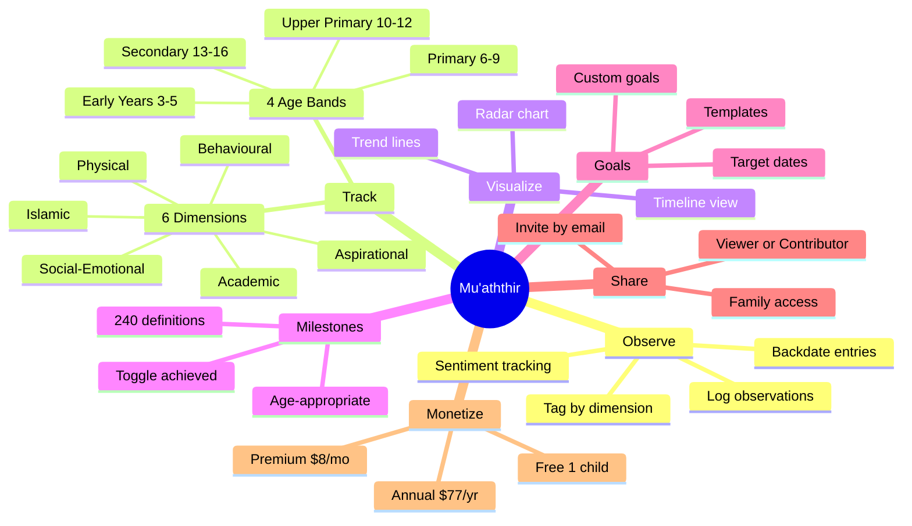
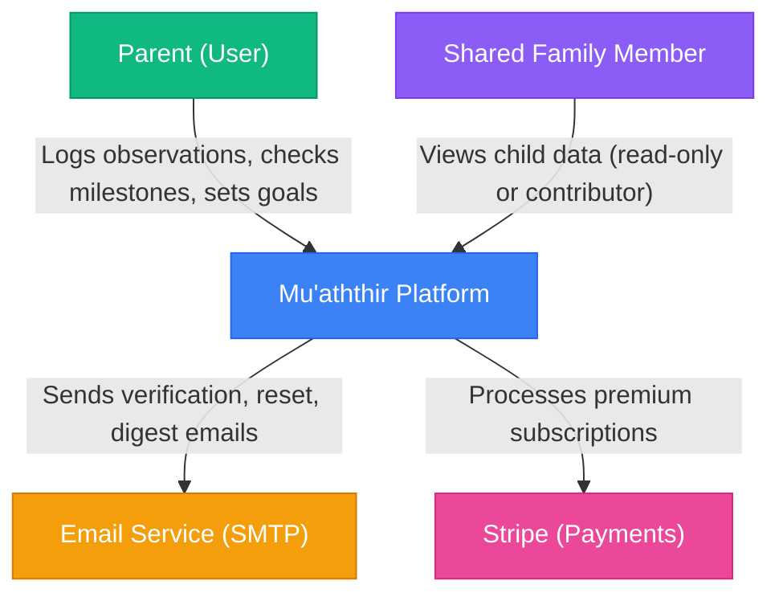
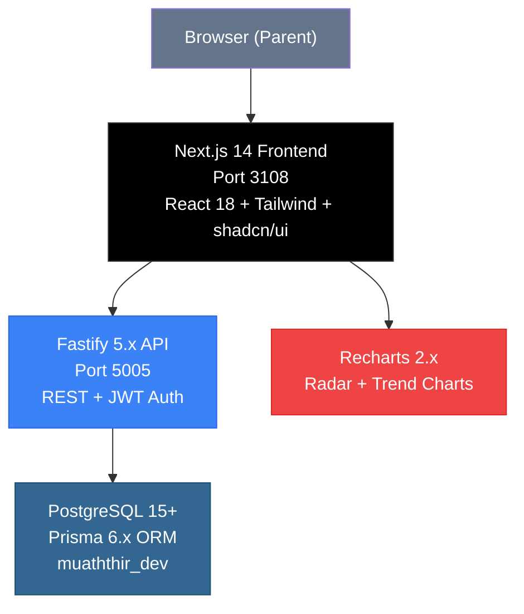
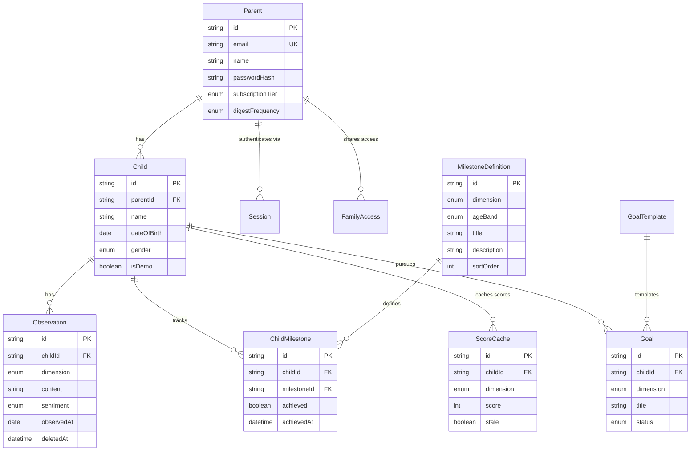
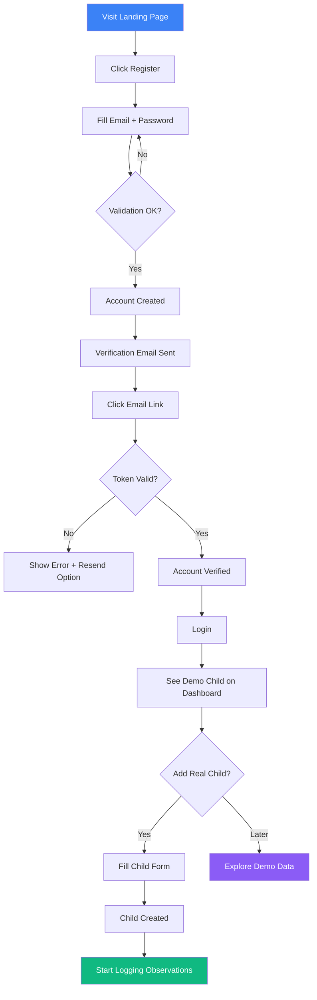
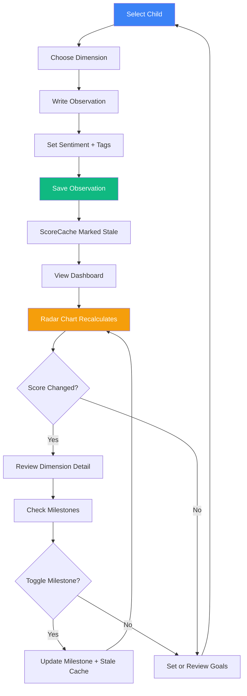
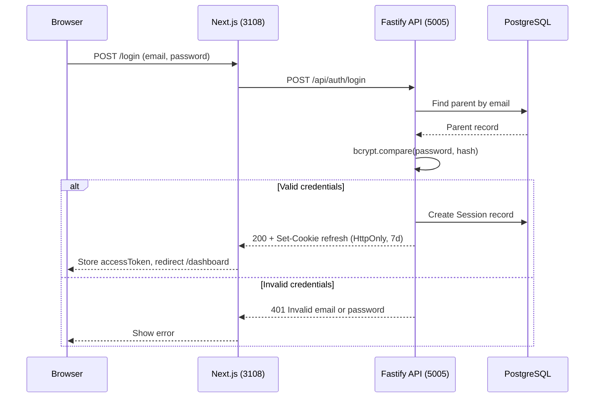
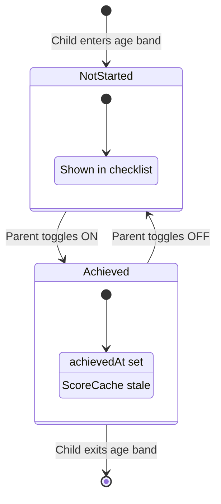

# Mu'aththir -- Product Requirements Document

**Version**: 2.0
**Status**: Active
**Last Updated**: 2026-03-06
**Product Manager**: Claude Product Manager
**Traceability**: US-XX (user stories), FR-XXX (functional), NFR-XXX (non-functional)

---

## 1. Executive Summary

### 1.1 Vision

Mu'aththir is a holistic child development platform that helps parents track and nurture their children across six interconnected dimensions: Academic, Social-Emotional, Behavioural, Aspirational, Islamic, and Physical.

The name "Mu'aththir" means "influential" or "impactful" in Arabic. The platform embodies the belief that intentional, holistic parenting creates children who grow into adults of genuine impact.

### 1.2 Problem Statement

Parents lack a unified system to track their children's development across the dimensions that matter:

- **Fragmented tracking**: Parents use separate apps for grades, health, Quran progress, and behaviour charts.
- **Missing dimensions**: Mainstream tools ignore spiritual development, aspirational growth, and social-emotional intelligence.
- **Age-inappropriate expectations**: Parents lack guidance on what developmental milestones are appropriate for different ages.
- **No longitudinal view**: Parents cannot see patterns, regressions, or breakthroughs across months and years.

### 1.3 Product Concept



### 1.4 Success Metrics

| Metric | Target | Measurement |
|--------|--------|-------------|
| Weekly active parents | 500 by month 6 | Login + observation in 7-day window |
| Observations per parent per week | >= 3 | Average across active parents |
| Free-to-premium conversion | 5% by month 6 | Premium / total registered |
| Milestone engagement | 60% check milestones monthly | Milestone page visits |
| Retention (30-day) | >= 40% | Parents returning after first month |
| NPS | >= 50 | Quarterly survey |

---

## 2. Target Users

### Persona 1: Amina (Primary User)

- **Role**: Stay-at-home mother, 2 children ages 4 and 8
- **Goals**: Track Quran memorization alongside school performance; catch social-emotional gaps early
- **Pain Points**: Uses 4 separate apps/notebooks; loses context; no way to see the whole child
- **Usage Context**: Logs observations after school, reviews radar chart weekly, checks milestones monthly
- **Tier**: Premium (2 children)

### Persona 2: Omar (Secondary User)

- **Role**: Working father, 1 child age 6
- **Goals**: Stay involved despite limited time; see weekly summary; set goals for his son
- **Pain Points**: Feels disconnected from child's development; overwhelmed by data
- **Usage Context**: Reviews weekly digest email; logs weekend observations; checks goals
- **Tier**: Free (1 child)

### Persona 3: Grandparent Fatima (Shared Access)

- **Role**: Grandmother invited by Amina as viewer
- **Goals**: See grandchildren's progress; celebrate milestones remotely
- **Pain Points**: Not tech-savvy; needs simple read-only view
- **Usage Context**: Views radar chart and milestone list; does not log observations
- **Tier**: N/A (shared viewer access)

---

## 3. Architecture Overview

### 3.1 C4 Context Diagram (Level 1)



### 3.2 C4 Container Diagram (Level 2)



### 3.3 Entity-Relationship Diagram



---

## 4. The Six Dimensions

| # | Dimension | Slug | Colour | Description |
|---|-----------|------|--------|-------------|
| 1 | Academic | `academic` | Blue #3B82F6 | School performance, learning progress |
| 2 | Social-Emotional | `social_emotional` | Pink #EC4899 | Emotional intelligence, empathy, friendships |
| 3 | Behavioural | `behavioural` | Amber #F59E0B | Conduct, habits, discipline |
| 4 | Aspirational | `aspirational` | Purple #8B5CF6 | Goals, dreams, motivation |
| 5 | Islamic | `islamic` | Emerald #10B981 | Quran, salah, Islamic knowledge |
| 6 | Physical | `physical` | Red #EF4444 | Health, fitness, nutrition |

## 5. Age Bands

| Band | Ages | Slug | Milestone Count |
|------|------|------|-----------------|
| Early Years | 3-5 | `early_years` | 60 (10 per dimension) |
| Primary | 6-9 | `primary` | 60 |
| Upper Primary | 10-12 | `upper_primary` | 60 |
| Secondary | 13-16 | `secondary` | 60 |

Age band is computed from DOB, never stored.

---

## 6. User Stories -- MVP (P0)

### US-01: Parent Registration

**As a** parent, **I want** to create an account with email and password, **so that** I can securely access my children's development data.

**Acceptance Criteria:**
- Given a valid email and password (8+ chars, 1 uppercase, 1 number), when I submit registration, then my account is created and I receive a verification email
- Given an already-registered email, when I submit registration, then I see an error "Email already registered"
- Given an invalid password, when I submit registration, then I see specific validation errors

### US-02: Email Verification

**As a** registered parent, **I want** to verify my email address, **so that** my account is activated.

**Acceptance Criteria:**
- Given a valid verification token, when I click the email link, then my account is verified and I am redirected to login
- Given an expired or invalid token, when I click the link, then I see an error with option to resend

### US-03: Login and Session Management

**As a** verified parent, **I want** to log in with email and password, **so that** I can access the platform securely.

**Acceptance Criteria:**
- Given valid credentials, when I log in, then I receive a JWT access token (1hr) and HttpOnly refresh cookie (7d)
- Given invalid credentials, when I log in, then I see "Invalid email or password" (no credential enumeration)
- Given an expired access token, when the frontend makes a request, then it silently refreshes using the cookie

### US-04: Password Reset

**As a** parent who forgot my password, **I want** to reset it via email, **so that** I can regain access.

**Acceptance Criteria:**
- Given a registered email, when I request a reset, then I receive a reset email with a time-limited token
- Given a valid reset token, when I submit a new password, then my password is updated and all sessions are invalidated
- Given an unregistered email, when I request a reset, then I see the same success message (no email enumeration)

### US-05: Add Child Profile

**As a** parent, **I want** to add a child profile with name, date of birth, and optional details, **so that** I can start tracking their development.

**Acceptance Criteria:**
- Given valid child data (name, DOB within 3-16 age range), when I submit, then the child profile is created
- Given I am on the free tier with 1 existing child, when I try to add another, then I see a prompt to upgrade to premium
- Given a DOB, when the profile is created, then the age band is computed automatically (never stored)

### US-06: Log Observation

**As a** parent, **I want** to log an observation about my child in a specific dimension, **so that** I can build a record of their development over time.

**Acceptance Criteria:**
- Given I select a child and dimension, when I write an observation (1-1000 chars) with sentiment and optional tags (up to 5), then the observation is saved
- Given I want to record something from the past, when I backdate an observation, then the date is accepted (up to 1 year back)
- Given I log an observation, when the save completes, then the ScoreCache for that dimension is marked stale

### US-07: View Radar Chart

**As a** parent, **I want** to see a radar chart showing my child's scores across all 6 dimensions, **so that** I can see a holistic snapshot of their development.

**Acceptance Criteria:**
- Given a child with observations and milestones, when I view the dashboard, then I see a 6-axis radar chart with dimension scores 0-100
- Given score formula `(min(obs,10)/10 * 40) + (achieved/total * 40) + (positive/total * 20)`, when scores are recalculated, then the chart reflects the computed values
- Given a stale ScoreCache, when the radar chart loads, then scores are recalculated and cache is updated

### US-08: View Milestones

**As a** parent, **I want** to see age-appropriate milestones for my child across each dimension, **so that** I know what to focus on.

**Acceptance Criteria:**
- Given a child with DOB that maps to "primary" age band, when I view milestones, then I see 60 milestones (10 per dimension) for ages 6-9
- Given a milestone, when I toggle it as achieved, then the achievement date is recorded and the ScoreCache is marked stale
- Given a milestone was toggled in error, when I un-toggle it, then the history is preserved in achievedHistory JSON

### US-09: View Observation Timeline

**As a** parent, **I want** to see a chronological list of all observations for a child, **so that** I can review their development history.

**Acceptance Criteria:**
- Given a child with observations, when I view the timeline, then observations are listed newest-first with dimension, date, sentiment, and tags
- Given I want to filter, when I select a dimension or date range, then the timeline filters accordingly
- Given I want to find something specific, when I search by keyword, then matching observations are returned

### US-10: Edit and Delete Observation

**As a** parent, **I want** to edit or delete an observation, **so that** I can correct mistakes or remove irrelevant entries.

**Acceptance Criteria:**
- Given an existing observation, when I edit the content, sentiment, or tags, then the changes are saved with updatedAt timestamp
- Given I delete an observation, when the delete completes, then it is soft-deleted (deletedAt set) and hidden from views
- Given a soft-deleted observation, when 30 days pass, then it is eligible for permanent deletion

### US-11: Dashboard Overview

**As a** parent, **I want** a dashboard that summarizes each child's development at a glance.

**Acceptance Criteria:**
- Given I have children, when I view the dashboard, then I see each child with their radar chart, recent observations, and milestone progress
- Given I have no children yet, when I view the dashboard, then I see an onboarding prompt to add my first child
- Given I am a free user with the demo child, when I view the dashboard, then the demo child is clearly labeled

### US-12: Set Goals for Child

**As a** parent, **I want** to set development goals for my child in specific dimensions.

**Acceptance Criteria:**
- Given I select a dimension, when I create a goal with title and optional target date, then the goal is created with status "active"
- Given goal templates exist for my child's age band, when I browse templates, then I can create a goal from a template
- Given an active goal, when I mark it complete, then the status changes to "completed" with timestamp

### US-13: Child Selector and Navigation

**As a** parent with multiple children, **I want** to easily switch between children in the UI.

**Acceptance Criteria:**
- Given I have multiple children, when I use the child selector, then I can switch between children and the dashboard updates
- Given I select a child, when I navigate to observations, milestones, or goals, then data is filtered to that child

### US-14: Settings and Notifications

**As a** parent, **I want** to configure my notification preferences.

**Acceptance Criteria:**
- Given the settings page, when I toggle daily reminder, weekly digest, or milestone alerts, then my preferences are saved
- Given I set digest frequency to "weekly", when the weekly digest runs, then I receive a summary email

### US-15: Responsive Mobile Layout

**As a** parent using my phone, **I want** the app to work well on mobile screens.

**Acceptance Criteria:**
- Given a mobile viewport (< 768px), when I use the app, then all features are accessible with touch-friendly controls
- Given the observation form, when I use it on mobile, then the form is easy to fill out with proper input types

### US-16: Demo Child (Onboarding)

**As a** new parent, **I want** to see a pre-populated demo child with sample data, **so that** I understand how the platform works.

**Acceptance Criteria:**
- Given I just registered, when I log in for the first time, then I see a demo child with sample observations, milestones, and a populated radar chart
- Given I add my first real child, when I view the dashboard, then the demo child is clearly distinguished or can be hidden

### US-17: Observation Trend Chart

**As a** parent, **I want** to see how my child's dimension scores change over time.

**Acceptance Criteria:**
- Given a child with observations spanning multiple weeks, when I view the trend chart, then I see score progression over time for each dimension
- Given I select a specific dimension, when I view the trend, then I see a focused line chart for that dimension

### US-18: Logout and Security

**As a** parent, **I want** to securely log out and manage my sessions.

**Acceptance Criteria:**
- Given I am logged in, when I click logout, then my session is invalidated and tokens are cleared
- Given my refresh cookie is stolen, when the attacker tries to use it after I log out, then the session is rejected

---

## 7. User Stories -- Phase 2 (P1)

### US-19: Family Sharing
**As a** parent, **I want** to invite family members to view or contribute to my children's profiles.

### US-20: Premium Subscription (Stripe)
**As a** parent with multiple children, **I want** to upgrade to premium ($8/month or $77/year).

### US-21: Data Export (CSV/PDF)
**As a** premium parent, **I want** to export my child's data as CSV or PDF.

### US-22: Weekly Digest Email
**As a** parent, **I want** to receive a weekly email summarizing each child's progress.

### US-23: Arabic Language Support (i18n)
**As an** Arabic-speaking parent, **I want** to use the platform in Arabic with RTL layout.

### US-24: Bulk Milestone Seeding (Admin)
**As an** admin, **I want** to seed all 240 milestone definitions from a structured data source.

### US-25: Photo Upload for Child Profile
**As a** parent, **I want** to upload a photo for each child's profile.

### US-26: Offline Support (PWA)
**As a** parent in an area with unreliable internet, **I want** to log observations offline and sync when connectivity returns.

---

## 8. User Flows

### 8.1 Onboarding Flow



### 8.2 Core Loop: Observe-Track-Review



### 8.3 Authentication Flow



### 8.4 Milestone Lifecycle



---

## 9. Functional Requirements

### 9.1 Authentication (FR-001 to FR-008)

| ID | Requirement |
|----|-------------|
| FR-001 | System shall support parent registration with email, name, and password |
| FR-002 | System shall send email verification on registration |
| FR-003 | System shall issue JWT access tokens (1hr TTL) and HttpOnly refresh cookies (7d TTL) |
| FR-004 | System shall silently refresh access tokens using the refresh cookie |
| FR-005 | System shall support password reset via time-limited email token |
| FR-006 | System shall invalidate all sessions on password reset |
| FR-007 | System shall hash passwords with bcrypt cost factor 12 |
| FR-008 | System shall prevent credential enumeration on login and reset flows |

### 9.2 Child Management (FR-009 to FR-015)

| ID | Requirement |
|----|-------------|
| FR-009 | System shall allow parents to create child profiles with name, DOB (ages 3-16), and optional gender, photo URL, medical notes, allergies, special needs |
| FR-010 | System shall compute age band from DOB (never store it) |
| FR-011 | System shall enforce free tier limit of 1 child (excluding demo child) |
| FR-012 | System shall create a demo child with sample data on first registration |
| FR-013 | System shall allow editing child profile details |
| FR-014 | System shall allow deleting a child profile (cascade) |
| FR-015 | System shall filter all child queries by parent_id (resource ownership) |

### 9.3 Observations (FR-016 to FR-025)

| ID | Requirement |
|----|-------------|
| FR-016 | System shall allow logging observations with dimension, content (1-1000 chars), sentiment, and observed date |
| FR-017 | System shall support up to 5 tags per observation |
| FR-018 | System shall allow backdating observations up to 1 year |
| FR-019 | System shall support optional Arabic content field (contentAr, up to 2000 chars) |
| FR-020 | System shall mark ScoreCache as stale when an observation is created, updated, or deleted |
| FR-021 | System shall support soft deletion of observations (set deletedAt) |
| FR-022 | System shall exclude soft-deleted observations from all queries |
| FR-023 | System shall allow recovery of soft-deleted observations within 30 days |
| FR-024 | System shall support filtering observations by dimension, date range, and sentiment |
| FR-025 | System shall support pagination for observation lists |

### 9.4 Milestones (FR-026 to FR-032)

| ID | Requirement |
|----|-------------|
| FR-026 | System shall store 240 milestone definitions (10 per dimension per age band) |
| FR-027 | System shall display milestones filtered by child's computed age band |
| FR-028 | System shall allow toggling a milestone as achieved (sets achievedAt) |
| FR-029 | System shall preserve toggle history in achievedHistory JSON field |
| FR-030 | System shall mark ScoreCache as stale when a milestone is toggled |
| FR-031 | System shall support optional Arabic text for milestone title, description, and guidance |
| FR-032 | System shall sort milestones by dimension and sortOrder |

### 9.5 Scoring and Visualization (FR-033 to FR-038)

| ID | Requirement |
|----|-------------|
| FR-033 | System shall calculate dimension scores using formula: `(min(obs_count,10)/10 * 40) + (achieved/total * 40) + (positive/total * 20)` |
| FR-034 | System shall use write-through cache with staleness flag for scores |
| FR-035 | System shall recalculate stale scores on dashboard load |
| FR-036 | System shall render a 6-axis radar chart using Recharts |
| FR-037 | System shall render dimension trend lines over time |
| FR-038 | System shall display score values 0-100 per dimension |

### 9.6 Goals (FR-039 to FR-044)

| ID | Requirement |
|----|-------------|
| FR-039 | System shall allow creating goals with title (200 chars), optional description (500 chars), dimension, and optional target date |
| FR-040 | System shall support goal statuses: active, completed, paused |
| FR-041 | System shall provide goal templates filtered by dimension and age band |
| FR-042 | System shall allow creating goals from templates |
| FR-043 | System shall support editing and deleting goals |
| FR-044 | System shall display goals grouped by dimension and status |

### 9.7 Settings (FR-045 to FR-048)

| ID | Requirement |
|----|-------------|
| FR-045 | System shall allow parents to configure daily reminder, weekly digest, and milestone alert preferences |
| FR-046 | System shall support digest frequency: off, daily, weekly |
| FR-047 | System shall allow parents to update their name and email |
| FR-048 | System shall allow parents to change their password (requires current password) |

### 9.8 Family Sharing -- Phase 2 (FR-049 to FR-052)

| ID | Requirement |
|----|-------------|
| FR-049 | System shall allow parents to invite family members by email with viewer or contributor role |
| FR-050 | System shall support invitation statuses: pending, accepted, declined |
| FR-051 | System shall scope shared access to specific children (childIds array) |
| FR-052 | System shall allow revoking shared access |

---

## 10. Non-Functional Requirements

### 10.1 Performance (NFR-001 to NFR-006)

| ID | Requirement |
|----|-------------|
| NFR-001 | Dashboard shall load in < 2 seconds |
| NFR-002 | Observation list pagination shall return in < 500ms |
| NFR-003 | Score recalculation shall complete in < 200ms |
| NFR-004 | API responses shall be < 100KB |
| NFR-005 | Frontend bundle shall be < 300KB gzipped |
| NFR-006 | Lighthouse performance score shall be >= 80 on mobile |

### 10.2 Security (NFR-007 to NFR-016)

| ID | Requirement |
|----|-------------|
| NFR-007 | All API endpoints (except auth) shall require valid JWT |
| NFR-008 | All data queries shall enforce parent_id ownership filter |
| NFR-009 | Passwords shall be hashed with bcrypt cost factor 12 |
| NFR-010 | Refresh tokens shall be HttpOnly, Secure, SameSite=Strict cookies |
| NFR-011 | All inputs shall be validated with Zod at API boundary |
| NFR-012 | API shall implement rate limiting: 100 req/min general, 10 req/min auth |
| NFR-013 | System shall prevent SQL injection via Prisma parameterized queries |
| NFR-014 | System shall prevent XSS via React escaping + CSP |
| NFR-015 | System shall log authentication events |
| NFR-016 | System shall use HTTPS in production |

### 10.3 Reliability (NFR-017 to NFR-021)

| ID | Requirement |
|----|-------------|
| NFR-017 | System shall target 99.5% uptime |
| NFR-018 | Database shall have daily automated backups |
| NFR-019 | Soft-deleted data shall be recoverable for 30 days |
| NFR-020 | API shall return structured error responses with error codes |
| NFR-021 | System shall handle graceful degradation if email service is unavailable |

### 10.4 Usability (NFR-022 to NFR-027)

| ID | Requirement |
|----|-------------|
| NFR-022 | App shall be fully responsive (mobile, tablet, desktop) |
| NFR-023 | App shall support touch interactions on mobile |
| NFR-024 | App shall meet WCAG 2.1 AA accessibility standards |
| NFR-025 | Dimension colors shall maintain sufficient contrast ratios |
| NFR-026 | App shall provide clear empty states with call-to-action |
| NFR-027 | App shall provide loading skeletons during data fetches |

### 10.5 Scalability (NFR-028 to NFR-032)

| ID | Requirement |
|----|-------------|
| NFR-028 | System shall support 1,000 concurrent parents |
| NFR-029 | Database schema shall support indexing for common query patterns |
| NFR-030 | Observation table shall use composite indexes on (childId, dimension), (childId, observedAt), (childId, deletedAt) |
| NFR-031 | ScoreCache shall use unique constraint on (childId, dimension) |
| NFR-032 | Tags shall use GIN index for array containment queries |

### 10.6 Maintainability (NFR-033 to NFR-037)

| ID | Requirement |
|----|-------------|
| NFR-033 | Codebase shall use TypeScript with strict mode |
| NFR-034 | API shall follow Route-Handler-Service separation pattern |
| NFR-035 | Database migrations shall be managed by Prisma |
| NFR-036 | Test coverage shall be >= 80% |
| NFR-037 | Code shall follow ESLint + Prettier formatting standards |

---

## 11. Site Map

| Route | Status | Description |
|-------|--------|-------------|
| `/` | MVP | Landing page |
| `/register` | MVP | Registration form |
| `/verify-email` | MVP | Email verification handler |
| `/login` | MVP | Login form |
| `/forgot-password` | MVP | Password reset request |
| `/reset-password` | MVP | Password reset form |
| `/dashboard` | MVP | Main dashboard with radar chart |
| `/dashboard/child/:id` | MVP | Child-specific dashboard |
| `/children` | MVP | Child list management |
| `/children/new` | MVP | Add child form |
| `/children/:id/edit` | MVP | Edit child profile |
| `/observations` | MVP | Observation timeline |
| `/observations/new` | MVP | Log new observation |
| `/observations/:id` | MVP | View single observation |
| `/observations/:id/edit` | MVP | Edit observation |
| `/milestones` | MVP | Milestone checklist |
| `/milestones/:dimension` | MVP | Dimension milestone view |
| `/goals` | MVP | Goals list |
| `/goals/new` | MVP | Create goal |
| `/goals/:id/edit` | MVP | Edit goal |
| `/goals/templates` | MVP | Browse goal templates |
| `/trends` | MVP | Trend charts |
| `/trends/:dimension` | MVP | Dimension trend view |
| `/settings` | MVP | Settings hub |
| `/settings/profile` | MVP | Edit parent profile |
| `/settings/password` | MVP | Change password |
| `/settings/notifications` | MVP | Notification preferences |
| `/settings/subscription` | Deferred | Subscription management (skeleton) |
| `/help` | MVP | Help/FAQ page |
| `/sharing` | Deferred | Family sharing (skeleton) |
| `/sharing/invite` | Deferred | Invite family member (skeleton) |
| `/export` | Deferred | Data export (skeleton) |
| `/admin/milestones` | Deferred | Milestone management (skeleton) |
| `/privacy` | MVP | Privacy policy |
| `/terms` | MVP | Terms of service |
| `/404` | MVP | Not found page |
| `/500` | MVP | Server error page |
| `/offline` | Deferred | Offline fallback (PWA) |

**Total**: 38 routes (30 MVP + 8 Deferred)

---

## 12. Business Rules

### 12.1 Subscription Tiers

| Rule | Free | Premium |
|------|------|---------|
| Child profiles | 1 (+ demo) | Unlimited |
| Observations | Unlimited | Unlimited |
| Family sharing | No | Yes |
| Data export | No | Yes |
| Weekly digest | No | Yes |
| Price | $0 | $8/month or $77/year |

### 12.2 Score Calculation

```
dimension_score = (min(obs_count, 10) / 10 * 40) + (achieved / total * 40) + (positive / total * 20)
```

Cached in ScoreCache with `stale` flag. Recalculated on dashboard load when stale = true.

### 12.3 Soft Delete Policy

Observations use soft delete (deletedAt). 30-day recovery window. Permanent deletion after 30 days via scheduled job.

### 12.4 Resource Ownership

All queries filtered by `parent_id`. No parent can access another parent's data unless shared via FamilyAccess.

---

## 13. Out of Scope (MVP)

- Mobile native apps (iOS/Android)
- AI-generated recommendations
- Teacher/school integration
- Multi-language beyond English
- Social features
- Gamification
- Video/image attachments on observations
- Real-time collaboration
- Push notifications
- Calendar integration

---

## 14. Dependencies

| Dependency | Purpose | Status |
|------------|---------|--------|
| PostgreSQL 15+ | Primary data store | Available |
| Prisma 6.x | ORM and migrations | Available |
| Fastify 5.x | API framework | Available |
| Next.js 14 | Frontend framework | Available |
| Recharts 2.x | Charts | Available |
| shadcn/ui + Radix | UI components | Available |
| Zod 3.x | Input validation | Available |
| Stripe API | Payment processing | Phase 2 |
| Email service (SMTP) | Transactional emails | Phase 2 (mock in MVP) |

---

## 15. Risks and Mitigations

| Risk | Impact | Likelihood | Mitigation |
|------|--------|------------|------------|
| Parents find 6 dimensions overwhelming | High | Medium | Demo child; onboarding tooltips; start with 1-2 dimensions |
| Islamic dimension limits market | Medium | Low | 5 of 6 dimensions are universal; Islamic is optional |
| Low observation frequency | High | Medium | Daily reminders; minimum threshold for score display |
| Milestone definitions culturally biased | Medium | Medium | Expert review; community feedback |
| Score formula unintuitive | High | Low | A/B test weights; qualitative labels alongside scores |
| Free tier too generous | Medium | Medium | Gate export, digest, sharing behind premium |

---

## 16. Timeline

| Phase | Scope | User Stories |
|-------|-------|-------------|
| MVP | Auth, child mgmt, observations, milestones, radar chart, goals, trends, settings | US-01 through US-18 |
| Phase 2 | Family sharing, Stripe, export, digest, Arabic, seeding, photo upload | US-19 through US-26 |
| Future | PWA, AI insights, mobile native, teacher integration, gamification | Backlog |

---

## Appendix A: Glossary

| Term | Definition |
|------|-----------|
| Dimension | One of 6 developmental categories |
| Age Band | Age grouping: early_years (3-5), primary (6-9), upper_primary (10-12), secondary (13-16) |
| Observation | A text entry logged by a parent about a child in a specific dimension |
| Milestone | A predefined developmental checkpoint for a dimension and age band |
| Radar Chart | A 6-axis spider chart showing a child's scores |
| ScoreCache | Database table caching computed dimension scores with staleness flag |
| Sentiment | Observation tone: positive, neutral, or needs_attention |
| Tarbiyah | Arabic for holistic upbringing/education |
| Soft Delete | Marking a record as deleted without removing from database |
| Resource Ownership | Security pattern ensuring queries are filtered by parent_id |
