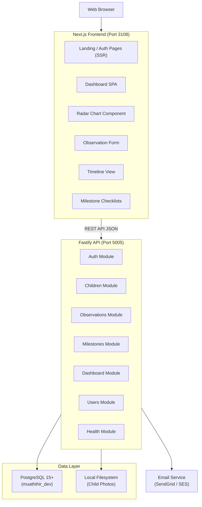
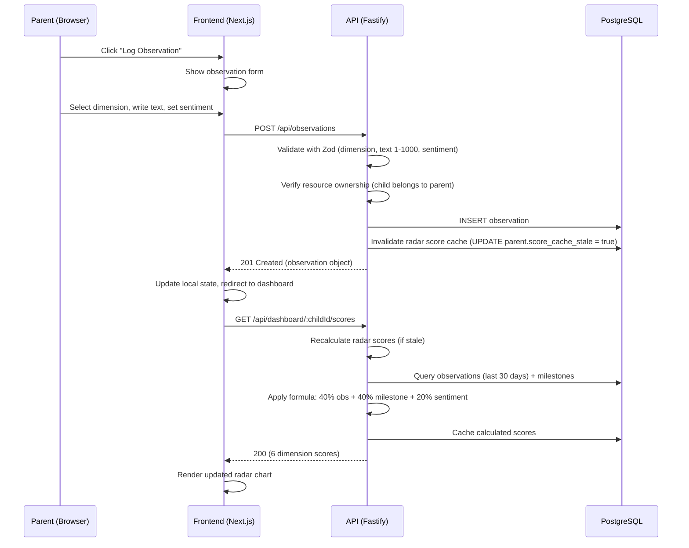
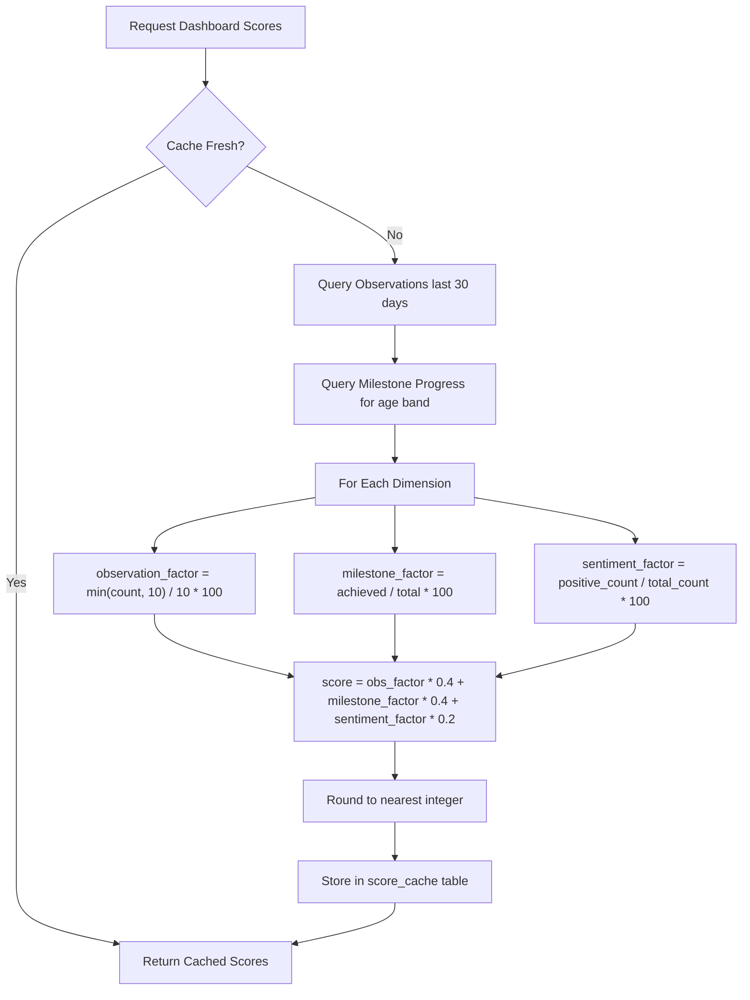
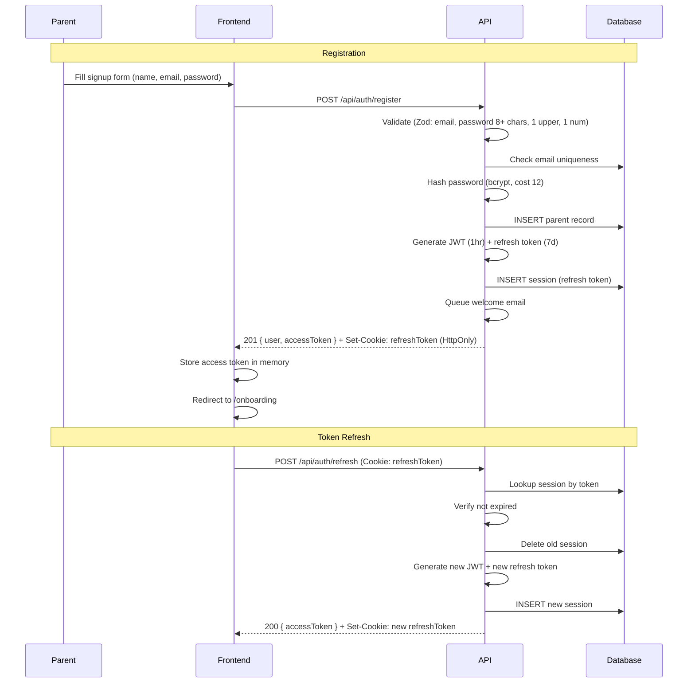
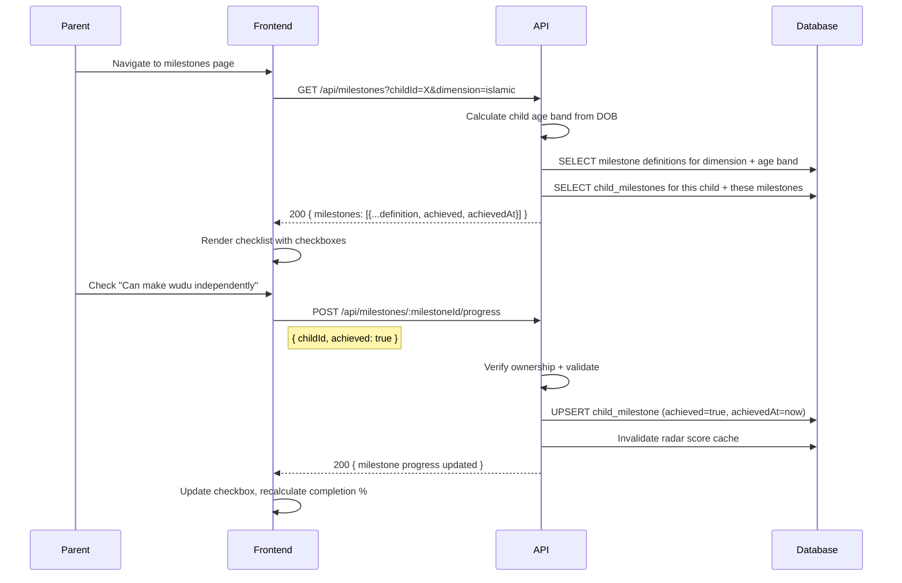
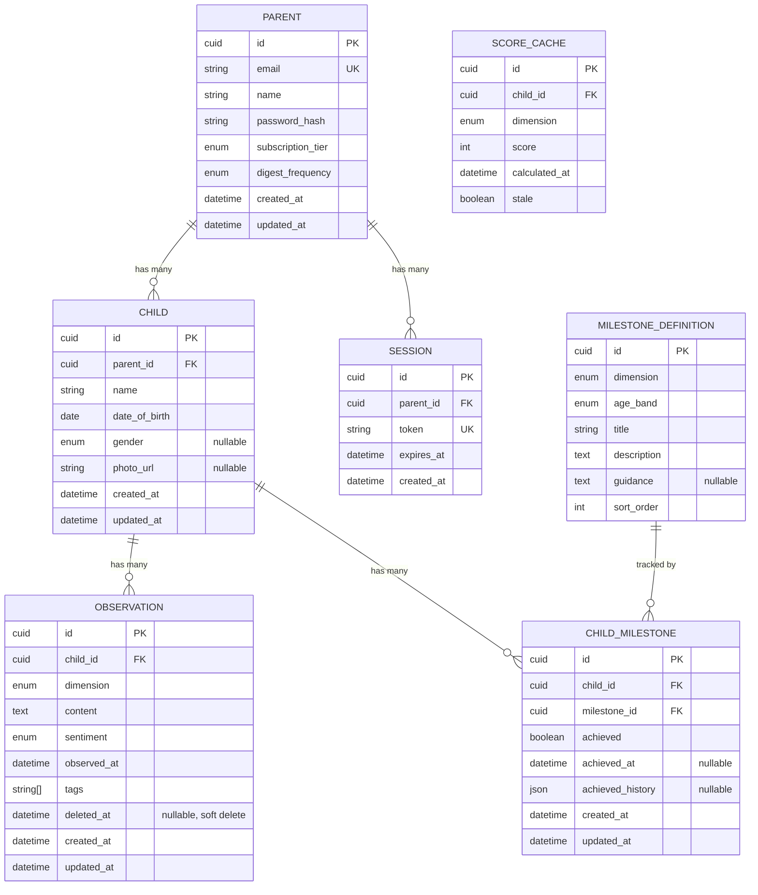

# Mu'aththir -- System Architecture

**Version**: 1.0
**Status**: Accepted
**Architect**: Claude Architect
**Last Updated**: 2026-02-07

---

## 1. System Overview

Mu'aththir is a monolith web application with clean module separation. The system has three main layers: a Next.js frontend, a Fastify API backend, and a PostgreSQL database. The only external service in MVP is an email provider for transactional emails (password reset, welcome, weekly digest).

### 1.1 High-Level System Diagram



### 1.2 Component Architecture

```
                         +---------------------+
                         |     Web Browser      |
                         +----------+----------+
                                    |
                                    | HTTPS
                                    v
                  +-----------------+------------------+
                  |         Next.js Frontend           |
                  |         (Port 3108)                |
                  |                                    |
                  |  Public Pages (SSR):               |
                  |  - Landing, Pricing, About         |
                  |  - Login, Signup, Password Reset   |
                  |                                    |
                  |  Dashboard (CSR):                  |
                  |  - Radar Chart + Recent Obs        |
                  |  - Observation Form                |
                  |  - Timeline with Filters           |
                  |  - 6 Dimension Detail Pages        |
                  |  - Milestone Checklists            |
                  |  - Child Profile Management        |
                  |  - Settings & Subscription         |
                  +-----------------+------------------+
                                    |
                                    | REST API (JSON)
                                    v
                  +-----------------+------------------+
                  |         Fastify Backend            |
                  |         (Port 5005)                |
                  |                                    |
                  |  Plugins:                          |
                  |  - observability (logging, metrics)|
                  |  - prisma (DB lifecycle)           |
                  |  - auth (JWT + refresh tokens)     |
                  |  - rate-limit                      |
                  |                                    |
                  |  Modules:                          |
                  |  - auth/     (register, login,     |
                  |               password reset)      |
                  |  - children/ (CRUD, photo upload,  |
                  |               age band calc)       |
                  |  - observations/ (CRUD, soft del,  |
                  |                   tag mgmt)        |
                  |  - milestones/ (definitions, child |
                  |                  progress tracking)|
                  |  - dashboard/ (radar chart scores, |
                  |                aggregations)       |
                  |  - users/    (profile, settings,   |
                  |               subscription)        |
                  |  - health/   (readiness, liveness) |
                  +-+--------+--------+--------+------+
                    |        |        |        |
           +--------+   +---+    +---+    +---+------+
           v             v        v        v
  +--------+---+ +------+--+ +--+----+ +--+--------+
  | PostgreSQL | | Email    | | File  | | (Future)  |
  | (Prisma)   | | Service  | | Store | | Redis     |
  | Port 5432  | | SendGrid | | Local | | Cache     |
  +------------+ +----------+ +-------+ +-----------+
```

### 1.3 Component Descriptions

| Component | Purpose | Technology |
|-----------|---------|------------|
| Frontend | SPA with SSR for public pages. Dashboard, radar chart, observation forms, milestone checklists. | Next.js 14, React 18, Tailwind CSS, shadcn/ui |
| Backend | REST API server. Business logic, score calculation, auth, resource ownership enforcement. | Fastify 5.x, TypeScript, Node.js 20+ |
| Database | Persistent storage for parents, children, observations, milestones, sessions. | PostgreSQL 15+, Prisma 6.x |
| File Store | Child profile photos (resized to 200x200). Local filesystem for MVP. | Local FS (migrate to S3 post-MVP) |
| Email | Transactional emails: welcome, password reset, weekly digest (Premium). | SendGrid or AWS SES |
| Charting | Radar/spider chart for 6-dimension visualization. | Recharts (React-native charting library) |

---

## 2. Tech Stack

| Layer | Technology | Version | Rationale |
|-------|-----------|---------|-----------|
| **Runtime** | Node.js | 20+ | LTS, stable, company standard |
| **Language** | TypeScript | 5+ | Type safety, company standard |
| **Frontend** | Next.js | 14 | SSR for public pages, App Router, company standard |
| **UI Library** | React | 18 | Company standard |
| **Styling** | Tailwind CSS | 3 | Utility-first, company standard |
| **Components** | shadcn/ui | latest | Accessible, Radix UI based, company standard |
| **Charting** | Recharts | 2.x | React-native, excellent radar chart support (see ADR-001) |
| **Backend** | Fastify | 5.x | Latest stable, aligns with InvoiceForge (see ADR-001) |
| **ORM** | Prisma | 6.x | Latest stable, aligns with InvoiceForge (see ADR-001) |
| **Database** | PostgreSQL | 15+ | Company standard |
| **Auth** | Custom JWT + bcrypt | - | 1hr access, 7d refresh, bcrypt cost 12 |
| **Validation** | Zod | 3.x | Runtime type validation at API boundaries |
| **Image Processing** | sharp | latest | Child photo resizing (200x200) |
| **Date Handling** | date-fns | 3.x | Age band calculation, date formatting |
| **Testing (Unit)** | Jest | 29 | Company standard |
| **Testing (Component)** | React Testing Library | 14 | Company standard |
| **Testing (E2E)** | Playwright | latest | Company standard |

### Key Libraries

| Library | Purpose |
|---------|---------|
| `bcrypt` | Password hashing (cost factor 12) |
| `jsonwebtoken` | JWT creation and verification |
| `zod` | Schema validation for API inputs |
| `date-fns` | Age calculation, date formatting, locale support |
| `recharts` | Radar chart, trend line charts, bar charts |
| `sharp` | Image resizing for child profile photos |
| `@fastify/cors` | CORS middleware |
| `@fastify/helmet` | Security headers |
| `@fastify/rate-limit` | Rate limiting |
| `@fastify/cookie` | Cookie handling for refresh tokens |
| `@fastify/multipart` | File upload handling (child photos) |

---

## 3. Data Flow Diagrams

### 3.1 Observation Logging Flow (Core Loop)



### 3.2 Radar Chart Score Calculation Flow



### 3.3 Authentication Flow



### 3.4 Milestone Progress Flow



---

## 4. Backend Module Structure

The backend follows clean module separation within a monolith. Each domain has its own directory with routes, handlers, services, and validation schemas.

### Plugin Registration Order (PATTERN-009)

```
1. observability  (logging, correlation IDs, metrics)
2. prisma         (database connection, lifecycle)
3. auth           (JWT verification, refresh token handling)
4. rate-limit     (request throttling)
5. routes         (module route registration)
```

### Module Layout

```
apps/api/src/
  +-- server.ts              # Fastify instance, plugin registration
  +-- config.ts              # Environment variables, app config
  +-- plugins/
  |   +-- observability.ts   # Structured logging, correlation IDs (copy from registry)
  |   +-- prisma.ts          # PrismaClient lifecycle (copy from registry)
  |   +-- auth.ts            # JWT + refresh token auth (adapted from registry)
  +-- modules/
  |   +-- auth/
  |   |   +-- auth.routes.ts       # POST register, login, logout, refresh,
  |   |   |                        #      forgot-password, reset-password
  |   |   +-- auth.handlers.ts     # Request parsing, response formatting
  |   |   +-- auth.service.ts      # Password hashing, JWT gen, email triggers
  |   |   +-- auth.schemas.ts      # Zod: signup, login, password reset schemas
  |   |   +-- auth.test.ts
  |   +-- children/
  |   |   +-- children.routes.ts   # CRUD + photo upload
  |   |   +-- children.handlers.ts
  |   |   +-- children.service.ts  # Age band calc, photo processing, profile limits
  |   |   +-- children.schemas.ts  # Zod: create/update child, photo upload
  |   |   +-- children.test.ts
  |   +-- observations/
  |   |   +-- observations.routes.ts    # CRUD + list with filters
  |   |   +-- observations.handlers.ts
  |   |   +-- observations.service.ts   # Validation, soft delete, score invalidation
  |   |   +-- observations.schemas.ts   # Zod: create/update obs, filter params
  |   |   +-- observations.test.ts
  |   +-- milestones/
  |   |   +-- milestones.routes.ts      # List definitions, mark/unmark progress
  |   |   +-- milestones.handlers.ts
  |   |   +-- milestones.service.ts     # Progress tracking, completion calculation
  |   |   +-- milestones.schemas.ts
  |   |   +-- milestones.test.ts
  |   +-- dashboard/
  |   |   +-- dashboard.routes.ts       # Radar scores, recent obs, milestones due
  |   |   +-- dashboard.handlers.ts
  |   |   +-- dashboard.service.ts      # Score calculation, caching, aggregation
  |   |   +-- dashboard.schemas.ts
  |   |   +-- dashboard.test.ts
  |   +-- users/
  |   |   +-- users.routes.ts           # Profile, password, notifications, subscription
  |   |   +-- users.handlers.ts
  |   |   +-- users.service.ts
  |   |   +-- users.schemas.ts
  |   |   +-- users.test.ts
  |   +-- health/
  |       +-- health.routes.ts          # GET /api/health
  |       +-- health.test.ts
  +-- lib/
  |   +-- errors.ts            # AppError classes (copy from registry)
  |   +-- pagination.ts        # Pagination helpers (copy from registry)
  |   +-- score-calculator.ts  # Radar chart score formula (pure function)
  +-- utils/
  |   +-- logger.ts            # Structured logging (copy from registry)
  |   +-- crypto.ts            # Password hashing, token generation (adapted)
  +-- types/
      +-- index.ts             # Shared TypeScript types, dimension enum
```

### Frontend Structure (Next.js App Router)

```
apps/web/src/
  +-- app/
  |   +-- layout.tsx                         # Root layout
  |   +-- page.tsx                           # Landing page (/)
  |   +-- (auth)/
  |   |   +-- login/page.tsx
  |   |   +-- signup/page.tsx
  |   |   +-- forgot-password/page.tsx
  |   |   +-- reset-password/page.tsx
  |   +-- onboarding/
  |   |   +-- page.tsx                       # Onboarding flow
  |   |   +-- child/page.tsx                 # Create first child
  |   +-- dashboard/
  |   |   +-- layout.tsx                     # Dashboard layout (sidebar, child selector)
  |   |   +-- page.tsx                       # Main dashboard (radar chart)
  |   |   +-- observe/page.tsx               # Observation form
  |   |   +-- timeline/page.tsx              # Timeline with filters
  |   |   +-- dimensions/
  |   |   |   +-- page.tsx                   # Grid view of all 6 dimensions
  |   |   |   +-- [slug]/page.tsx            # Dimension detail (dynamic route)
  |   |   +-- milestones/
  |   |   |   +-- page.tsx                   # All milestones overview
  |   |   |   +-- [dimension]/page.tsx       # Milestones for one dimension
  |   |   +-- child/
  |   |   |   +-- [id]/
  |   |   |       +-- page.tsx               # Child profile view
  |   |   |       +-- edit/page.tsx          # Edit child profile
  |   |   +-- settings/
  |   |       +-- page.tsx                   # General settings
  |   |       +-- notifications/page.tsx
  |   |       +-- subscription/page.tsx
  |   +-- pricing/page.tsx
  |   +-- about/page.tsx
  |   +-- privacy/page.tsx
  |   +-- terms/page.tsx
  +-- components/
  |   +-- ui/                     # shadcn/ui primitives
  |   +-- charts/
  |   |   +-- RadarChart.tsx      # 6-dimension radar chart (Recharts)
  |   |   +-- TrendChart.tsx      # Monthly observation/sentiment trend
  |   +-- dashboard/
  |   |   +-- Sidebar.tsx         # Navigation sidebar
  |   |   +-- ChildSelector.tsx   # Child dropdown selector
  |   |   +-- RecentObservations.tsx
  |   |   +-- MilestonesDue.tsx
  |   |   +-- DimensionCard.tsx   # Summary card for dimension grid
  |   +-- observation/
  |   |   +-- ObservationForm.tsx
  |   |   +-- ObservationCard.tsx
  |   |   +-- SentimentBadge.tsx
  |   +-- milestone/
  |   |   +-- MilestoneChecklist.tsx
  |   |   +-- MilestoneItem.tsx
  |   +-- timeline/
  |   |   +-- TimelineEntry.tsx
  |   |   +-- TimelineFilters.tsx
  |   +-- shared/
  |       +-- DimensionBadge.tsx   # Colour-coded dimension label
  |       +-- LoadingSpinner.tsx
  |       +-- ErrorBoundary.tsx    # (copy from registry)
  +-- lib/
  |   +-- api-client.ts           # HTTP client with auth (adapted from registry)
  |   +-- token-manager.ts        # XSS-safe JWT storage (copy from registry)
  |   +-- dimensions.ts           # Dimension metadata (slugs, colours, icons)
  |   +-- age-bands.ts            # Age band definitions and utilities
  |   +-- utils.ts                # Date formatting, text truncation
  +-- hooks/
  |   +-- useAuth.tsx             # Authentication state (adapted from registry)
  |   +-- useTheme.ts             # Dark/light mode (copy from registry)
  |   +-- useChildren.ts          # Child CRUD + active child state
  |   +-- useObservations.ts      # Observation CRUD
  |   +-- useMilestones.ts        # Milestone progress
  |   +-- useDashboard.ts         # Radar scores + recent data
  +-- types/
      +-- index.ts                # Frontend TypeScript types
```

---

## 5. API Design

All endpoints are prefixed with `/api`. Authentication is via Bearer token (JWT) in the Authorization header unless otherwise noted. Full OpenAPI 3.0 spec is in `api-schema.yml`.

### 5.1 Endpoint Summary

| Method | Path | Auth | Description |
|--------|------|------|-------------|
| POST | /api/auth/register | None | Create parent account |
| POST | /api/auth/login | None | Authenticate |
| POST | /api/auth/logout | Required | Invalidate session |
| POST | /api/auth/refresh | Cookie | Refresh access token |
| POST | /api/auth/forgot-password | None | Request password reset |
| POST | /api/auth/reset-password | None | Reset password with token |
| GET | /api/children | Required | List parent's children |
| POST | /api/children | Required | Create child profile |
| GET | /api/children/:id | Required | Get child profile |
| PUT | /api/children/:id | Required | Update child profile |
| DELETE | /api/children/:id | Required | Delete child + all data |
| POST | /api/children/:id/photo | Required | Upload child photo |
| GET | /api/observations | Required | List observations (filtered) |
| POST | /api/observations | Required | Create observation |
| GET | /api/observations/:id | Required | Get single observation |
| PUT | /api/observations/:id | Required | Update observation |
| DELETE | /api/observations/:id | Required | Soft-delete observation |
| GET | /api/milestones | Required | List milestone definitions |
| POST | /api/milestones/:id/progress | Required | Mark/unmark milestone |
| GET | /api/milestones/:id/progress | Required | Get milestone progress for child |
| GET | /api/dashboard/:childId/scores | Required | Radar chart scores |
| GET | /api/dashboard/:childId/recent | Required | Recent observations |
| GET | /api/dashboard/:childId/milestones-due | Required | Upcoming milestones |
| GET | /api/dimensions/:slug | Required | Dimension detail + trend data |
| GET | /api/timeline | Required | Paginated timeline with filters |
| GET | /api/users/me | Required | Get parent profile |
| PUT | /api/users/me | Required | Update parent profile |
| PUT | /api/users/me/password | Required | Change password |
| GET | /api/users/me/notifications | Required | Get notification preferences |
| PUT | /api/users/me/notifications | Required | Update notification preferences |
| GET | /api/users/me/subscription | Required | Get subscription info |
| POST | /api/users/me/export | Required | Request data export (GDPR) |
| DELETE | /api/users/me | Required | Delete account |
| GET | /api/health | None | Health check |

### 5.2 Rate Limiting

| Endpoint Pattern | Limit | Window |
|-----------------|-------|--------|
| POST /api/auth/register | 10 | 1 minute per IP |
| POST /api/auth/login | 20 | 1 minute per IP |
| POST /api/auth/forgot-password | 5 | 1 minute per IP |
| All other authenticated endpoints | 200 | 1 minute per user |

### 5.3 Error Response Format (RFC 7807)

All errors follow the RFC 7807 problem details format:

```json
{
  "type": "https://muaththir.app/errors/validation-error",
  "title": "Validation Error",
  "status": 422,
  "detail": "Observation text must be between 1 and 1000 characters",
  "instance": "/api/observations",
  "errors": {
    "text": "Must be between 1 and 1000 characters"
  }
}
```

### 5.4 Pagination Format

All list endpoints use offset-based pagination:

```json
{
  "data": [...],
  "pagination": {
    "page": 1,
    "limit": 20,
    "total": 147,
    "totalPages": 8,
    "hasMore": true
  }
}
```

---

## 6. Database Schema

### 6.1 Entity Relationship Diagram



### 6.2 Key Design Decisions

- **CUID primary keys**: Collision-resistant, sortable, URL-safe. Consistent with company standard.
- **Dimension as PostgreSQL enum**: `academic`, `social_emotional`, `behavioural`, `aspirational`, `islamic`, `physical`. Enforced at DB level.
- **Age band is never stored**: Always calculated from `date_of_birth` at query time. Avoids stale data.
- **Soft deletes on observations**: `deleted_at` timestamp. Hard delete via scheduled job after 30 days.
- **Score cache table**: Pre-calculated radar scores invalidated on observation/milestone changes. Avoids expensive aggregation on every dashboard load.
- **Milestone history as JSON**: The `achieved_history` field stores an array of `{achieved_at, unmarked_at}` objects, preserving the full mark/unmark history without additional tables.
- **Tags as string array**: PostgreSQL native array type. Supports indexing with GIN for tag-based queries.
- **Timestamps**: All tables use `created_at`/`updated_at` with timezone.

### 6.3 Prisma Schema (Source of Truth)

```prisma
generator client {
  provider = "prisma-client-js"
}

datasource db {
  provider = "postgresql"
  url      = env("DATABASE_URL")
}

enum SubscriptionTier {
  free
  premium
}

enum DigestFrequency {
  off
  daily
  weekly
}

enum Dimension {
  academic
  social_emotional
  behavioural
  aspirational
  islamic
  physical
}

enum Sentiment {
  positive
  neutral
  needs_attention
}

enum AgeBand {
  early_years
  primary
  upper_primary
  secondary
}

enum Gender {
  male
  female
}

model Parent {
  id              String           @id @default(cuid())
  email           String           @unique
  name            String
  passwordHash    String           @map("password_hash")
  subscriptionTier SubscriptionTier @default(free) @map("subscription_tier")
  digestFrequency DigestFrequency  @default(off) @map("digest_frequency")
  resetToken      String?          @map("reset_token")
  resetTokenExp   DateTime?        @map("reset_token_exp")
  createdAt       DateTime         @default(now()) @map("created_at")
  updatedAt       DateTime         @updatedAt @map("updated_at")

  children Child[]
  sessions Session[]

  @@map("parents")
}

model Child {
  id          String    @id @default(cuid())
  parentId    String    @map("parent_id")
  name        String
  dateOfBirth DateTime  @map("date_of_birth") @db.Date
  gender      Gender?
  photoUrl    String?   @map("photo_url")
  createdAt   DateTime  @default(now()) @map("created_at")
  updatedAt   DateTime  @updatedAt @map("updated_at")

  parent       Parent           @relation(fields: [parentId], references: [id], onDelete: Cascade)
  observations Observation[]
  milestones   ChildMilestone[]
  scoreCache   ScoreCache[]

  @@index([parentId])
  @@map("children")
}

model Observation {
  id         String    @id @default(cuid())
  childId    String    @map("child_id")
  dimension  Dimension
  content    String    @db.VarChar(1000)
  sentiment  Sentiment
  observedAt DateTime  @map("observed_at") @db.Date
  tags       String[]  @default([])
  deletedAt  DateTime? @map("deleted_at")
  createdAt  DateTime  @default(now()) @map("created_at")
  updatedAt  DateTime  @updatedAt @map("updated_at")

  child Child @relation(fields: [childId], references: [id], onDelete: Cascade)

  @@index([childId, dimension])
  @@index([childId, observedAt])
  @@index([childId, deletedAt])
  @@index([tags], type: Gin)
  @@map("observations")
}

model MilestoneDefinition {
  id          String    @id @default(cuid())
  dimension   Dimension
  ageBand     AgeBand   @map("age_band")
  title       String    @db.VarChar(100)
  description String    @db.VarChar(300)
  guidance    String?   @db.VarChar(500)
  sortOrder   Int       @map("sort_order")

  childMilestones ChildMilestone[]

  @@unique([dimension, ageBand, sortOrder])
  @@index([dimension, ageBand])
  @@map("milestone_definitions")
}

model ChildMilestone {
  id              String    @id @default(cuid())
  childId         String    @map("child_id")
  milestoneId     String    @map("milestone_id")
  achieved        Boolean   @default(false)
  achievedAt      DateTime? @map("achieved_at")
  achievedHistory Json?     @map("achieved_history")
  createdAt       DateTime  @default(now()) @map("created_at")
  updatedAt       DateTime  @updatedAt @map("updated_at")

  child     Child               @relation(fields: [childId], references: [id], onDelete: Cascade)
  milestone MilestoneDefinition @relation(fields: [milestoneId], references: [id], onDelete: Cascade)

  @@unique([childId, milestoneId])
  @@index([childId])
  @@index([milestoneId])
  @@map("child_milestones")
}

model ScoreCache {
  id           String    @id @default(cuid())
  childId      String    @map("child_id")
  dimension    Dimension
  score        Int       @default(0)
  calculatedAt DateTime  @map("calculated_at") @default(now())
  stale        Boolean   @default(true)

  child Child @relation(fields: [childId], references: [id], onDelete: Cascade)

  @@unique([childId, dimension])
  @@index([childId, stale])
  @@map("score_cache")
}

model Session {
  id        String   @id @default(cuid())
  parentId  String   @map("parent_id")
  token     String   @unique
  expiresAt DateTime @map("expires_at")
  createdAt DateTime @default(now()) @map("created_at")

  parent Parent @relation(fields: [parentId], references: [id], onDelete: Cascade)

  @@index([token])
  @@index([parentId])
  @@map("sessions")
}
```

---

## 7. Security Architecture

### 7.1 Authentication

```
Access Token (JWT):
  - Algorithm: HS256
  - Expiry: 1 hour
  - Payload: { sub: parentId, email, tier }
  - Stored: Client memory only (not localStorage -- XSS protection)

Refresh Token:
  - Format: Random 256-bit token (rt_<base64>)
  - Expiry: 7 days
  - Stored: HttpOnly, Secure, SameSite=Strict cookie + sessions table
  - Rotation: New refresh token issued on each use
  - Revocation: Delete from sessions table on logout or password change

Password:
  - Hash: bcrypt with cost factor 12
  - Validation: Min 8 chars, 1 uppercase, 1 number
  - Reset: Token-based, 1-hour expiry, single-use
```

### 7.2 Authorization (Resource Ownership)

Every database query is filtered by `parentId` extracted from the JWT. A parent can only access their own children, observations, and milestones. This is enforced at the service layer, not just the route layer.

```typescript
// PATTERN: Every service method receives parentId from the JWT
async getChild(childId: string, parentId: string): Promise<Child> {
  const child = await prisma.child.findFirst({
    where: { id: childId, parentId }  // ownership filter
  });
  if (!child) throw new NotFoundError('Child not found');
  return child;
}
```

### 7.3 Input Validation

- All API inputs validated with Zod schemas before reaching handlers
- Observation text: 1-1000 characters, HTML entities escaped on output
- Tags: max 5 per observation, max 50 characters each
- Child name: max 100 characters
- Date validation: cannot backdate more than 1 year

### 7.4 Rate Limiting

| Endpoint Pattern | Limit | Window |
|-----------------|-------|--------|
| POST /api/auth/register | 10 | 1 minute per IP |
| POST /api/auth/login | 20 | 1 minute per IP |
| POST /api/auth/forgot-password | 5 | 1 minute per IP |
| All other authenticated endpoints | 200 | 1 minute per user |

In-memory rate limiting for MVP. Can upgrade to Redis-backed (from component registry) when scaling.

### 7.5 Security Headers

Applied via `@fastify/helmet`:

- `Content-Security-Policy`: Restrict script/style sources
- `X-Content-Type-Options`: nosniff
- `X-Frame-Options`: DENY
- `Strict-Transport-Security`: max-age=31536000
- `Referrer-Policy`: strict-origin-when-cross-origin

### 7.6 Data Protection

- **Child data at rest**: PostgreSQL column-level encryption for observation content and child names using `pgcrypto` or application-level AES-256-GCM (using Encryption Utils from component registry).
- **No analytics on child data pages**: No tracking pixels, no third-party scripts on any `/dashboard` route.
- **Transport**: TLS 1.3 for all connections in production.
- **Photo storage**: Child photos stored in local filesystem (MVP), accessible only via authenticated API endpoint (no direct URL access).
- **GDPR**: Data export endpoint returns all parent + child data as JSON. Account deletion soft-deletes immediately, hard-deletes after 30 days.
- **COPPA alignment**: All child data treated as sensitive regardless of jurisdiction.

---

## 8. Caching Strategy

### 8.1 Radar Chart Score Caching

The radar chart requires aggregating observations and milestone progress across 6 dimensions. To meet the <300ms server-side calculation target (NFR-005), scores are cached and invalidated on write.

**Strategy**: Write-through cache with staleness flag (see ADR-002 for full rationale).

1. **On observation create/update/delete**: Mark `ScoreCache` rows for the affected child as `stale = true`.
2. **On milestone mark/unmark**: Mark `ScoreCache` rows for the affected child as `stale = true`.
3. **On dashboard load**: Check `ScoreCache` for the child.
   - If all 6 dimensions have `stale = false`: return cached scores immediately (<10ms).
   - If any dimension is stale: recalculate all 6 scores, update cache, set `stale = false`.
4. **Recalculation** runs two queries: (a) count observations by dimension for last 30 days with sentiment breakdown, (b) count milestones achieved vs total for child's age band.

**Why not Redis**: For MVP scale (5,000 users), PostgreSQL-based caching is sufficient and avoids adding infrastructure complexity. The `ScoreCache` table is small (max 6 rows per child) and queries are fast with the `[childId, stale]` index.

**Scaling path**: When user count exceeds 50,000, migrate to Redis-backed caching with TTL-based expiry.

### 8.2 Milestone Definitions

Milestone definitions are static seed data (240+ records, read-only in MVP). They can be cached in application memory at startup since they never change at runtime.

```typescript
// Load once at startup, serve from memory
const milestoneCache = new Map<string, MilestoneDefinition[]>();

async function getMilestones(dimension: Dimension, ageBand: AgeBand) {
  const key = `${dimension}:${ageBand}`;
  if (!milestoneCache.has(key)) {
    const milestones = await prisma.milestoneDefinition.findMany({
      where: { dimension, ageBand },
      orderBy: { sortOrder: 'asc' }
    });
    milestoneCache.set(key, milestones);
  }
  return milestoneCache.get(key)!;
}
```

---

## 9. Image Storage Architecture

### 9.1 MVP: Local Filesystem

Child profile photos are stored on the local filesystem for MVP:

```
apps/api/uploads/
  +-- children/
      +-- {childId}/
          +-- photo.jpg    # Resized to 200x200 by sharp
```

**Access**: Photos are served through an authenticated API endpoint `GET /api/children/:id/photo`, not via direct URL. This ensures resource ownership is enforced.

**Processing pipeline**:
1. Parent uploads photo via `POST /api/children/:id/photo` (multipart/form-data)
2. Backend validates: JPEG or PNG, max 5MB raw size
3. Backend resizes to 200x200 pixels using `sharp`
4. Backend saves to filesystem, updates `photoUrl` on child record
5. Old photo deleted if replacing

### 9.2 Post-MVP: S3 Migration

When moving to production at scale, migrate to S3-compatible storage:
- Pre-signed URLs for upload (bypass backend for large files)
- Pre-signed URLs for download (time-limited access)
- CDN in front for caching
- The `photoUrl` field already stores a relative path, making the migration a config change

---

## 10. Scalability Considerations

### 10.1 Current Design (MVP, single-instance)

The MVP runs as a single Fastify instance with a single PostgreSQL database. This is sufficient for the initial target of 5,000 concurrent users, 100,000 children, and 10M+ observations.

### 10.2 Database Indexes

Key indexes for query performance:

- `parents.email` (unique, login lookups)
- `children.parent_id` (child list queries)
- `observations.child_id, dimension` (dimension detail queries)
- `observations.child_id, observed_at` (timeline queries, date range filters)
- `observations.child_id, deleted_at` (active observation queries, soft delete filter)
- `observations.tags` (GIN index for tag-based search)
- `milestone_definitions.dimension, age_band` (milestone list queries)
- `child_milestones.child_id` (milestone progress queries)
- `child_milestones.child_id, milestone_id` (unique constraint, upsert operations)
- `score_cache.child_id, stale` (cache lookup, invalidation)
- `sessions.token` (auth middleware lookups)

### 10.3 Scaling Path

**Horizontal scaling** (when needed):

1. **API servers**: Fastify is stateless (JWT auth). Add instances behind a load balancer. Refresh token rotation needs to handle race conditions (optimistic locking on session table).
2. **Database**: Add read replicas for dashboard score queries. Primary handles writes. Connection pooling via PgBouncer.
3. **Score calculation**: Move from PostgreSQL-based cache to Redis with pub/sub invalidation.
4. **Photo storage**: Migrate from local filesystem to S3 + CDN.
5. **Email**: Move from synchronous sends to a job queue (BullMQ + Redis).

**Not needed for MVP**:
- Redis (PostgreSQL cache is sufficient at MVP scale)
- CDN (local file serving is fine for profile photos)
- Background job queue (all operations are synchronous)
- WebSocket/SSE (polling or optimistic updates are sufficient)
- Full-text search engine (PostgreSQL `ILIKE` with index is sufficient for observation search)

---

## 11. Development and Deployment

### 11.1 Local Development

```bash
# Prerequisites
- Node.js 20+
- PostgreSQL 15 (local or Docker)

# Database
createdb muaththir_dev
cd products/muaththir/apps/api && npx prisma migrate dev

# Seed milestone data
cd products/muaththir/apps/api && npx prisma db seed

# Backend
cd products/muaththir/apps/api && npm run dev      # Port 5005

# Frontend
cd products/muaththir/apps/web && npm run dev      # Port 3108
```

### 11.2 Environment Variables

```
# Database
DATABASE_URL=postgresql://postgres@localhost:5432/muaththir_dev

# Auth
JWT_SECRET=<random-256-bit-hex>
JWT_EXPIRY=1h
REFRESH_TOKEN_EXPIRY=7d

# Email (optional for local dev)
SENDGRID_API_KEY=SG...
FROM_EMAIL=noreply@muaththir.app

# Encryption (for child data at rest)
ENCRYPTION_KEY=<64-hex-chars>

# App
APP_URL=http://localhost:3108
API_URL=http://localhost:5005
NODE_ENV=development
```

### 11.3 Deployment Target

- **Frontend**: Vercel (Next.js native hosting)
- **Backend**: Render or Railway (Fastify, auto-deploy from main)
- **Database**: Render PostgreSQL (with daily backups, 30-day retention)
- **Monitoring**: Health check endpoint + provider built-in metrics

### 11.4 Testing Strategy

| Level | Tool | Scope | Target |
|-------|------|-------|--------|
| Unit | Jest | Service functions, score calculation, validation schemas | 80%+ coverage |
| Integration | Jest + real DB | API endpoints with real PostgreSQL (PATTERN-011: buildApp()) | All endpoints |
| Component | React Testing Library | UI components, form behavior, radar chart rendering | Key components |
| E2E | Playwright | Full user flows: signup, onboarding, log observation, view dashboard | Core flows |

**Key test scenarios**:
1. Radar chart score calculation with various data combinations
2. Observation CRUD with soft delete and recovery
3. Milestone mark/unmark with history preservation
4. Age band calculation and transitions
5. Auth flows: register, login, refresh, password reset
6. Subscription enforcement: free tier child limit
7. Timeline filtering: dimension, sentiment, date range, text search
8. Resource ownership: parent cannot access another parent's children

---

## 12. Cross-Product Compatibility

| Concern | Mu'aththir | Pulse | InvoiceForge | Stablecoin GW |
|---------|-----------|-------|--------------|---------------|
| Frontend port | 3108 | 3106 | 3109 | 3104 |
| Backend port | 5005 | 5003 | 5004 | 5001 |
| Database | muaththir_dev | pulse_dev | invoiceforge_dev | stablecoin_dev |
| Fastify | 5.x | 4.x | 5.x | 4.x |
| Prisma | 6.x | 5.x | 6.x | 5.x |
| Next.js | 14 | 14.2 | 14 | - (React SPA) |

Each product has its own `package.json` and lockfile. No shared dependency constraints. CI workflows are path-scoped to avoid cross-product interference.

---

**End of Architecture Document**
