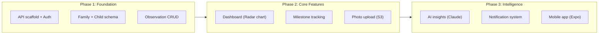

# Implementation Plan: Mu'aththir — Core Features

**Product**: muaththir
**Spec**: docs/specs/core-features.md
**Created**: 2026-02-07
**Status**: Complete
**Architect**: Claude Architect

## Constitution Check

| Article | Requirement | Status |
|---------|------------|--------|
| I. Spec-First | Spec approved (core-features.md) | PASS |
| II. Component Reuse | Auth, audit, notifications from registry | PASS |
| III. TDD | Tests before implementation | PASS |
| IV. TypeScript | Strict mode, Zod validation | PASS |
| V. Default Stack | Fastify + Prisma + PostgreSQL + Next.js + Expo | PASS |
| VI. Traceability | All phases map to FR requirements | PASS |
| VII. Port Registry | API: 5004, Web: 3104 registered | PASS |
| VIII. Git Safety | Feature branch strategy | PASS |
| IX. Diagram-First | C4, ER, sequence diagrams in spec | PASS |
| X. Quality Gates | All gates planned | PASS |

## Architecture Overview

## Component Reuse Plan

| Component | Source | Used For |
|-----------|--------|----------|
| Auth Plugin | packages/auth | Family user authentication |
| Audit Log | packages/audit | Observation and milestone audit trail |
| Email Service | packages/notifications | Milestone alerts |
| Redis Plugin | packages/shared | Session + insight caching |
| BullMQ Queue | packages/webhooks (pattern) | Insight generation queue |

## Phase Breakdown

### Phase 1: Foundation (Days 1-3)

| Task ID | Task | Agent | FR Refs |
|---------|------|-------|---------|
| T001 | Write auth + family tests | Backend | FR-007 |
| T002 | Fastify API scaffold (port 5004) | Backend | — |
| T003 | Prisma schema: Family, User, Child, Observation, Milestone | Data | FR-001, FR-002 |
| T004 | Auth plugin integration (packages/auth) | Backend | FR-007 |
| T005 | Family CRUD API | Backend | FR-007 |
| T006 | Child CRUD API | Backend | FR-001 |
| T007 | Verify auth + family tests pass | Backend | FR-007 |

### Phase 2: Observations + Dashboard (Days 4-6)

| Task ID | Task | Agent | FR Refs |
|---------|------|-------|---------|
| T010 | Write observation + dashboard tests | Backend + Frontend | FR-002, FR-004 |
| T011 | Observation CRUD API (6 dimensions) | Backend | FR-002 |
| T012 | Photo upload endpoint + S3 integration | Backend | FR-003 |
| T013 | Next.js dashboard scaffold (port 3104) | Frontend | — |
| T014 | Observation recording form | Frontend | FR-002 |
| T015 | Radar chart dashboard (Recharts) | Frontend | FR-004 |
| T016 | Verify observation + dashboard tests pass | QA | FR-002, FR-004 |

### Phase 3: Milestones + Intelligence (Days 7-9)

| Task ID | Task | Agent | FR Refs |
|---------|------|-------|---------|
| T020 | Write milestone + insights tests | Backend | FR-005, FR-006 |
| T021 | Milestone CRUD API | Backend | FR-005 |
| T022 | AI insights service (Claude API integration) | Backend | FR-006 |
| T023 | BullMQ insight generation queue (debounced) | Backend | FR-006 |
| T024 | Email notifications (packages/notifications) | Backend | FR-010 |
| T025 | Milestone UI (list, progress, celebration) | Frontend | FR-005 |
| T026 | Insights display UI | Frontend | FR-006 |
| T027 | Verify milestone + insights tests pass | QA | FR-005, FR-006 |

### Phase 4: Mobile App (Days 10-12)

| Task ID | Task | Agent | FR Refs |
|---------|------|-------|---------|
| T030 | Expo mobile app scaffold | Mobile | FR-009 |
| T031 | Mobile auth (SecureStore for tokens) | Mobile | FR-009 |
| T032 | Mobile observation recording screen | Mobile | FR-002 |
| T033 | Mobile dashboard (radar chart native) | Mobile | FR-004 |
| T034 | Mobile milestone list | Mobile | FR-005 |

### Phase 5: Quality Gates (Day 13)

| Task ID | Task | Agent |
|---------|------|-------|
| T040 | Spec consistency gate | QA |
| T041 | Security audit | Security |
| T042 | Performance audit | Performance |
| T043 | E2E tests (Playwright web + Expo detox mobile) | QA |

## Security Considerations

- Family data isolation: all queries scoped to familyId
- Child data: never publicly accessible — authenticated family members only
- Photo uploads: signed S3 URLs with 1-hour expiry
- AI prompts: child observation data anonymised before sending to Claude API
- Subscription gating: AI insights require paid tier check on every request
