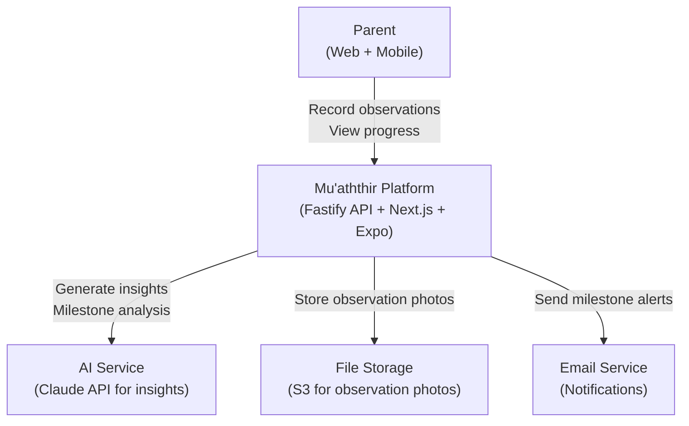
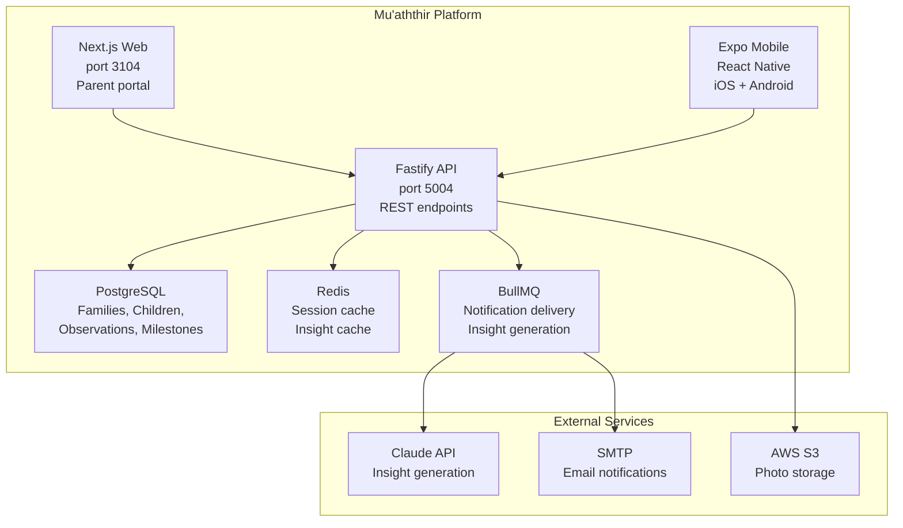
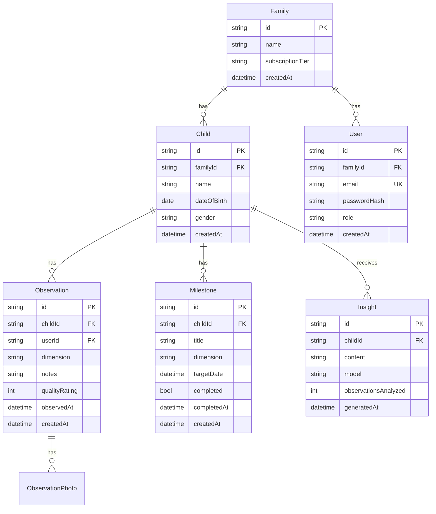
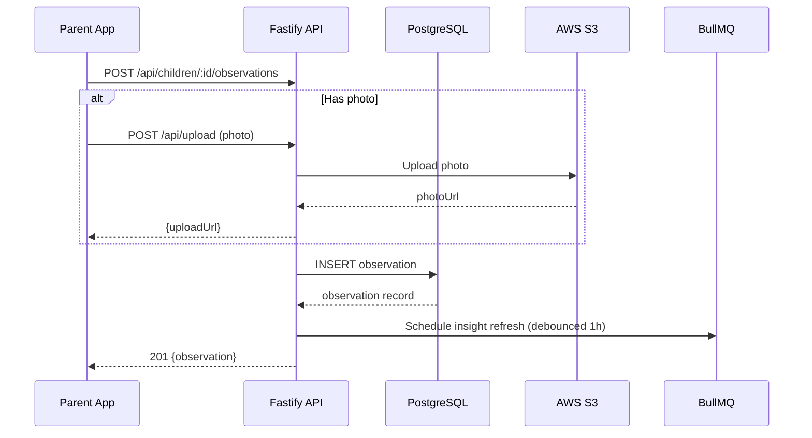

# Feature Specification: Mu'aththir — Core Features

**Product**: muaththir
**Feature Branch**: `feature/muaththir/core-mvp`
**Created**: 2026-02-07
**Status**: Accepted
**Version**: 1.0

## Business Context

### Problem Statement

Parents lack a unified system to track their children's holistic development across six dimensions: Academic, Social-Emotional, Behavioural, Aspirational, Islamic, and Physical. Mainstream tools are fragmented, one-dimensional, and ignore spiritual development entirely. Muslim parents — 1.8 billion globally with young demographic skew — have zero digital support for Islamic tarbiyah alongside worldly development.

### Target Users

| Persona | Role | Pain Point | Expected Outcome |
|---------|------|-----------|-----------------|
| Fatima (Parent) | Mother of 3 children (ages 5, 9, 12) | Uses 5 separate apps for grades, Quran, health, chores, and goals | Single platform showing the whole child across all dimensions |
| Omar (Parent) | Father focused on Islamic upbringing | No digital tools connect deen and academic development | Integrated tracking where Quran memorisation and academic progress appear together |
| Layla (Parent) | Working mother, limited time | Tracking is too time-consuming with current methods | Quick observation entry (< 2 minutes) with AI-assisted insights |

### Business Value

- **Revenue Impact**: Subscription model. Target: 1,000 families in Year 1 at $15/month = $180K ARR
- **User Retention**: Longitudinal data creates deep lock-in. 2+ years of observations is irreplaceable
- **Competitive Position**: Only platform covering all six dimensions including Islamic development
- **Strategic Alignment**: Underserved Muslim family tech market with global scale potential

## System Context (C4 Level 1)

## Container Diagram (C4 Level 2)

## User Scenarios & Testing

### User Story 1 — Observation Recording (Priority: P1)

**As a** parent, **I want to** quickly record an observation about my child across any of the six dimensions, **so that** I build a longitudinal picture of their development over time.

**Acceptance Criteria**:

1. **Given** a logged-in parent with a child profile, **When** they tap "Add Observation", **Then** they see a form with dimension selector, date, notes, and photo upload
2. **Given** an observation form is submitted, **When** the API processes it, **Then** the observation is saved with timestamp and appears in the child's timeline within 1 second
3. **Given** an observation includes a photo, **When** it is saved, **Then** the photo is stored in S3 and accessible at a signed URL

### User Story 2 — Development Dashboard (Priority: P1)

**As a** parent, **I want to** see a visual dashboard of my child's development across all six dimensions, **so that** I can identify strengths and areas needing attention at a glance.

**Acceptance Criteria**:

1. **Given** a child with at least 5 observations, **When** a parent views the dashboard, **Then** they see a hexagonal radar chart showing activity across all 6 dimensions
2. **Given** a parent views the dashboard, **When** they select a time range, **Then** the charts update to show trends for that period
3. **Given** a dimension has no observations in 14 days, **When** the parent views the dashboard, **Then** that dimension is highlighted as needing attention

### User Story 3 — Milestone Tracking (Priority: P2)

**As a** parent, **I want to** set and track milestones for my child (e.g., "memorise Surah Al-Mulk", "ride a bike"), **so that** I can celebrate achievements and plan the next step.

**Acceptance Criteria**:

1. **Given** a parent creates a milestone with target date, **When** they save it, **Then** it appears in the child's milestone list with progress indicator
2. **Given** a milestone is marked complete, **When** the parent confirms, **Then** a celebration moment displays and a summary entry is added to the observation timeline
3. **Given** a milestone target date passes without completion, **When** a parent views milestones, **Then** overdue milestones are flagged in red

### User Story 4 — AI-Powered Insights (Priority: P2)

**As a** parent, **I want to** receive AI-generated insights about my child's development patterns, **so that** I get actionable guidance without needing to analyse the data myself.

**Acceptance Criteria**:

1. **Given** a child has 20+ observations, **When** a parent requests insights, **Then** the AI generates a narrative summary identifying patterns, strengths, and suggestions
2. **Given** an insight is generated, **When** the parent views it, **Then** each suggestion links to relevant observations that support it
3. **Given** the AI identifies a potential concern, **When** displaying the insight, **Then** the concern is framed constructively with resources for the parent

## Data Model

## Observation Recording Flow

## Functional Requirements

| ID | Requirement | Priority |
|----|-------------|----------|
| FR-001 | Child profile creation and management | P1 |
| FR-002 | Observation recording (6 dimensions) | P1 |
| FR-003 | Photo upload for observations | P2 |
| FR-004 | Development dashboard with radar chart | P1 |
| FR-005 | Milestone creation and tracking | P2 |
| FR-006 | AI-generated development insights | P2 |
| FR-007 | Family multi-user support | P1 |
| FR-008 | Subscription and billing (Stripe) | P2 |
| FR-009 | Mobile app (iOS + Android via Expo) | P1 |
| FR-010 | Email notifications for milestones | P2 |
