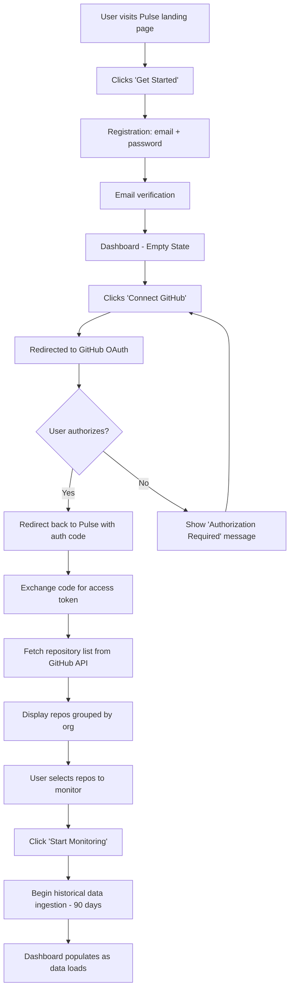
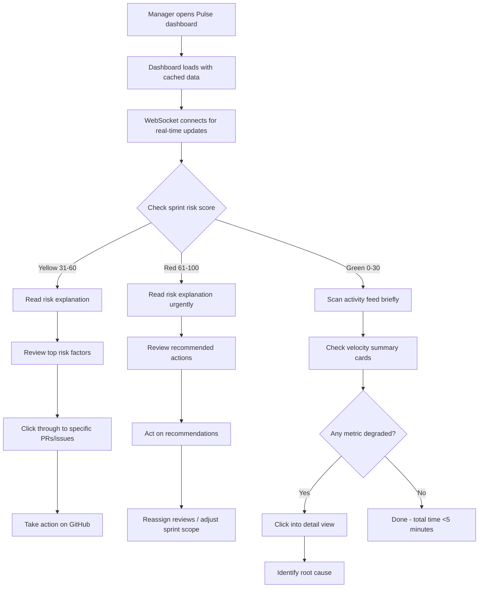
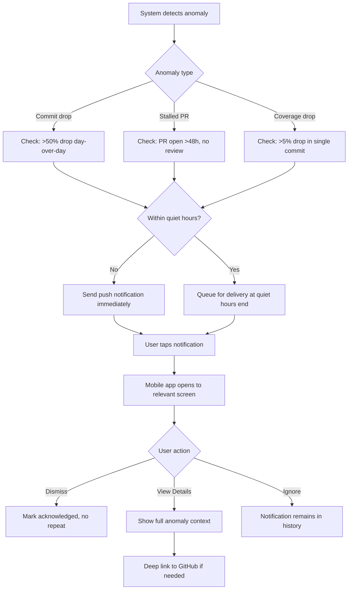
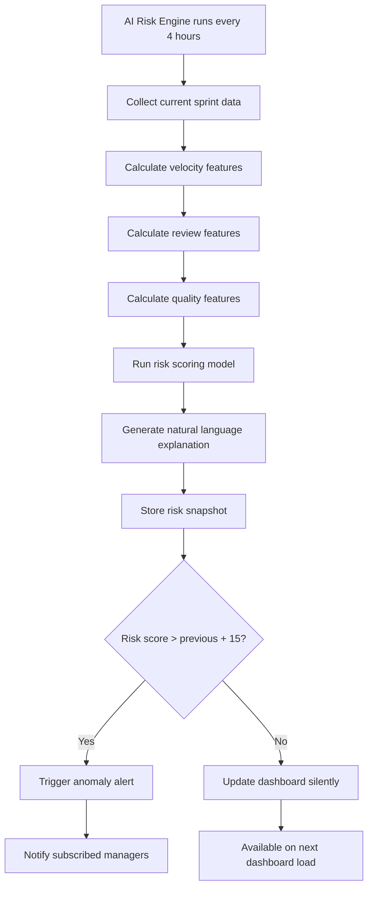

# Pulse - Product Requirements Document

**Version**: 1.0
**Status**: Draft
**Last Updated**: 2026-02-07
**Product Manager**: Claude Product Manager

---

## 1. Executive Summary

### 1.1 Vision

Pulse is an AI-Powered Developer Intelligence Platform that gives engineering leaders real-time visibility into team health, code quality trends, deployment velocity, and sprint risks. It connects to GitHub repositories and transforms raw development activity into actionable insights delivered through a web dashboard, real-time feeds, and mobile push notifications.

### 1.2 Problem Statement

Engineering managers and tech leads operate with limited visibility into their team's actual development patterns. They rely on gut feeling, weekly standups, and manual spreadsheet tracking to answer critical questions: Is the team slowing down? Are PRs getting stuck in review? Will we hit our sprint goals? By the time problems surface in standups, they are already 2-3 days old.

**Core Problems We Solve**:
- **Delayed visibility**: Managers learn about bottlenecks days after they form, during standups or retros
- **Manual metric tracking**: Teams spend 2-4 hours/week assembling velocity data from GitHub, Jira, and spreadsheets
- **No predictive signals**: Current tools show what happened but not what is likely to happen next
- **Review bottlenecks hidden**: PRs languishing in review go unnoticed until developers complain
- **Code quality drift**: Test coverage and code health degrade silently over weeks until a production incident exposes the rot
- **Context switching for leaders**: Managers check GitHub, CI dashboards, and project boards separately to piece together the full picture

**The Opportunity**: GitHub hosts 100M+ developers and stores rich activity data (commits, PRs, reviews, deployments) that most teams never analyze beyond basic PR counts. Tools like LinearB and Jellyfish have proven $10M+ ARR serving engineering intelligence, but they are enterprise-priced ($30k+/year) and complex to set up. Pulse delivers 80% of the value at a fraction of the cost with an AI-first approach that predicts risks rather than just reporting history.

### 1.3 Target Market

**Primary**: Software engineering teams of 5-50 developers
- Startups with 2-5 engineering squads
- Mid-size companies scaling their engineering org
- Engineering managers who report to VPs/CTOs
- Tech leads managing 3-10 direct reports

**Secondary**: Individual developers and open-source maintainers tracking personal productivity

**Initial Launch Market**: GitHub-connected teams, English-only

### 1.4 Success Metrics

**Business KPIs**:
- **Teams Onboarded**: 50 teams in first 3 months
- **Connected Repos**: 500+ repos ingested in first quarter
- **Weekly Active Users**: 200+ WAU by month 3
- **Paid Conversion**: 10% free-to-paid within 60 days
- **MRR**: $3,000 MRR by month 3 (based on $15/seat team plan)

**Product KPIs**:
- **Time to First Insight**: <5 minutes from GitHub OAuth connect to seeing first dashboard
- **Data Freshness**: Activity feed updates within 10 seconds of GitHub event
- **AI Risk Accuracy**: Sprint risk predictions correlate with actual outcomes at >70% accuracy after 4 sprints of calibration data
- **Dashboard Load Time**: Initial dashboard render in <2 seconds on 3G connection
- **Mobile Notification Delivery**: Anomaly alerts delivered within 60 seconds of detection

**User Experience KPIs**:
- **NPS**: >40
- **Daily Active Rate**: 60%+ of registered users visit dashboard at least once per workday
- **Alert Action Rate**: 30%+ of anomaly notifications result in user taking action within 1 hour
- **Support Ticket Volume**: <5% of active users per month

---

## 2. User Personas

### Persona 1: Alex - Engineering Manager

**Demographics**:
- Age: 35
- Role: Engineering Manager, leading 2 squads (12 developers)
- Company: Series B SaaS startup (150 employees)
- Technical Skill: Medium (former developer, now mostly in meetings)
- Reports to: VP of Engineering

**Goals**:
- Get a daily pulse on team health without interrupting developers
- Identify review bottlenecks before they block sprint delivery
- Prepare data-driven updates for leadership meetings in <5 minutes
- Detect when a team member is overloaded or disengaged (based on activity patterns)
- Predict sprint risks early enough to adjust scope or add resources

**Pain Points**:
- Spends 3 hours/week manually compiling velocity metrics from GitHub and Jira
- Learns about PR review delays only when developers escalate in Slack
- Cannot quantify "team health" for leadership; relies on anecdotes
- Sprint retros reveal problems that could have been caught mid-sprint
- No single view shows commits, PRs, reviews, and deployments together

**Usage Context**:
- Checks dashboard every morning at 9am on laptop, scans for anomalies
- Reviews weekly velocity report on Friday afternoons
- Gets mobile push notifications for anomalies (unusual commit pattern, stalled PRs)
- Shares dashboard screenshots in leadership Slack channel

**What Alex Says**:
_"I need to know if we are on track by Wednesday, not find out we are behind on Friday. By then it is too late to do anything about it."_

---

### Persona 2: Priya - Tech Lead

**Demographics**:
- Age: 30
- Role: Tech Lead, responsible for a backend services squad (5 developers)
- Company: Growth-stage fintech (80 employees)
- Technical Skill: High (still writes code 40% of the time)
- Reports to: Engineering Manager

**Goals**:
- Monitor code quality trends (test coverage, PR size, review thoroughness)
- Ensure PRs get reviewed within 4 hours of opening
- Track deployment frequency and rollback rate
- Identify which repos or services are accumulating tech debt
- Keep cycle time (PR open to merge) under 24 hours

**Pain Points**:
- Manually checks GitHub notifications to track PR review status, misses items
- Test coverage data lives in CI logs that nobody reviews regularly
- No historical view of whether code quality is improving or degrading over time
- Large PRs sneak through because there is no automated size alert
- Cannot correlate deployment frequency with incident rate

**Usage Context**:
- Keeps Pulse open in a browser tab alongside IDE, checks throughout the day
- Uses code quality trends during weekly 1:1s with team members
- Sets up alerts for PRs open longer than 8 hours without review
- Reviews cycle time metrics during sprint planning to calibrate estimates

**What Priya Says**:
_"I want to catch the test coverage dropping before it becomes a crisis. By the time someone notices in a PR, the damage is already spread across 20 commits."_

---

### Persona 3: Jordan - Senior Developer

**Demographics**:
- Age: 27
- Role: Senior Full-Stack Developer on a product team
- Company: Early-stage startup (25 employees)
- Technical Skill: Very High
- Reports to: Tech Lead

**Goals**:
- See personal productivity trends without being micromanaged
- Know when their PRs are reviewed so they can context-switch efficiently
- Understand their review load relative to teammates
- Get notified when a deployment they contributed to goes live
- Identify patterns in their own work (best coding hours, PR turnaround)

**Pain Points**:
- Gets too many GitHub email notifications, most irrelevant
- No way to see "my PRs waiting for review" vs "PRs waiting for my review" at a glance
- Feels like review load is unevenly distributed but has no data to prove it
- Context switches constantly between coding and checking PR status
- Wants to optimize personal workflow but lacks data

**Usage Context**:
- Checks mobile app 3-4 times per day for PR status updates
- Glances at personal activity feed between tasks
- Reviews weekly personal stats for self-improvement
- Receives push notifications only for PRs that need their attention

**What Jordan Says**:
_"I do not need a manager watching my commits. I want a personal dashboard that helps me work smarter and waste less time waiting on reviews."_

---

### Persona 4: Dana - VP of Engineering

**Demographics**:
- Age: 42
- Role: VP of Engineering, overseeing 4 engineering managers and 40+ developers
- Company: Series C enterprise SaaS (500 employees)
- Technical Skill: Low-Medium (strategic, not hands-on)
- Reports to: CTO

**Goals**:
- Get a high-level view of engineering velocity across all teams
- Identify which teams are thriving and which are struggling
- Justify headcount requests with quantitative data
- Track engineering investment (features vs. tech debt vs. bugs)
- Present board-ready engineering metrics quarterly

**Pain Points**:
- Each manager reports metrics differently, making cross-team comparison impossible
- No standardized definition of "velocity" across the org
- Board asks for engineering ROI metrics; has no automated way to produce them
- Cannot tell if adding headcount actually improved output

**Usage Context**:
- Reviews cross-team dashboard weekly on Monday mornings
- Exports charts for board presentations quarterly
- Delegates daily monitoring to managers but wants anomaly alerts
- Uses AI risk scores to prioritize which teams need attention

**What Dana Says**:
_"I need one number per team that tells me if they are healthy or if I should dig deeper. I do not have time to look at 200 individual PRs."_

---

## 3. Features

### 3.1 MVP Features (Phase 1)

#### MVP-01: GitHub OAuth Connect and Repo Ingestion

Connect GitHub accounts via OAuth, list available repositories, and ingest historical and real-time activity data.

**User Stories**:

**US-01.1**: As an Engineering Manager, I want to connect my GitHub organization via OAuth so that Pulse can access repository activity data without manual configuration.

**Acceptance Criteria**:
- Given I am on the Pulse settings page and not connected to GitHub, when I click "Connect GitHub", then I am redirected to GitHub's OAuth authorization page requesting `repo`, `read:org`, and `read:user` scopes.
- Given I authorize Pulse on GitHub, when I am redirected back to Pulse, then my GitHub account appears as "Connected" with my GitHub username and avatar displayed within 3 seconds.
- Given my GitHub account is connected, when I view the repository selection page, then all repositories I have access to (personal + organization) are listed within 5 seconds, grouped by organization.

**US-01.2**: As a Tech Lead, I want to select specific repositories for Pulse to monitor so that I only see data relevant to my team.

**Acceptance Criteria**:
- Given I am on the repository selection page with my GitHub connected, when I see the repository list, then each repository shows its name, organization, language, last activity date, and a toggle switch.
- Given I toggle on 3 repositories, when I click "Start Monitoring", then Pulse begins ingesting the last 90 days of commit, PR, and deployment data for those repositories, and a progress bar shows ingestion status.
- Given ingestion is in progress, when I navigate to the dashboard, then I see a "Syncing..." indicator on repositories still being ingested, and already-ingested data is visible immediately.

**US-01.3**: As an Engineering Manager, I want to disconnect a repository from Pulse so that I can stop monitoring repos that are no longer relevant.

**Acceptance Criteria**:
- Given I am on the settings page with 5 connected repositories, when I click "Disconnect" on a repository, then a confirmation dialog appears warning that historical data for that repo will be retained for 30 days before deletion.
- Given I confirm disconnection, when the action completes, then the repository no longer appears in dashboards, real-time feeds stop, and webhooks for that repo are removed within 60 seconds.

---

#### MVP-02: Real-Time Activity Feed via WebSocket

Display a live stream of commit, PR, and deployment events that updates in real-time without page refresh.

**User Stories**:

**US-02.1**: As a Tech Lead, I want to see a real-time feed of all commits, PR events, and deployments across my monitored repositories so that I have instant awareness of team activity.

**Acceptance Criteria**:
- Given I am on the dashboard with 3 monitored repositories, when a developer pushes a commit to any of those repos, then a new commit event appears in the activity feed within 10 seconds, showing author avatar, commit message (first 72 characters), repository name, and branch name.
- Given the activity feed is visible, when a PR is opened, reviewed, or merged, then a corresponding event appears with the PR title, author, reviewer (if applicable), and status badge (open/approved/merged/closed).
- Given the activity feed is visible, when a deployment event is received, then it appears with the environment (staging/production), status (success/failure), and the associated commit SHA.

**US-02.2**: As a Senior Developer, I want to filter the activity feed by repository, event type, or author so that I can focus on the events relevant to me.

**Acceptance Criteria**:
- Given the activity feed is showing 50+ events, when I select "Pull Requests" from the event type filter, then only PR events are displayed and the filter persists until I clear it.
- Given I select a specific repository from the repo filter dropdown, when new events arrive via WebSocket, then only events matching my filter are displayed; non-matching events are silently received but hidden.
- Given I filter by "My Activity" (my GitHub username), when I view the feed, then only events where I am the author, reviewer, or assignee are shown.

**US-02.3**: As an Engineering Manager, I want the activity feed to reconnect automatically if my connection drops so that I do not miss events.

**Acceptance Criteria**:
- Given I am viewing the activity feed and my network connection drops for 15 seconds, when connectivity is restored, then the WebSocket reconnects automatically within 5 seconds and backfills any missed events from the disconnection window.
- Given the WebSocket is reconnecting, when the feed UI is visible, then a "Reconnecting..." banner appears at the top of the feed, and it disappears once the connection is re-established.

---

#### MVP-03: Team Velocity Dashboard

Display team performance metrics including PRs merged per week, cycle time, and review time with interactive charts.

**User Stories**:

**US-03.1**: As an Engineering Manager, I want to see a weekly trend of PRs merged per developer so that I can track team throughput over time.

**Acceptance Criteria**:
- Given I am on the velocity dashboard with at least 4 weeks of data, when the page loads, then a bar chart displays PRs merged per week for the last 12 weeks, with each bar segmented by team member using distinct colors.
- Given I hover over a bar segment, when the tooltip appears, then it shows the developer's name, number of PRs merged that week, and the percentage change from the previous week.
- Given I select a different time range (4 weeks, 8 weeks, 12 weeks, 6 months), when the chart re-renders, then the data updates within 1 second and the x-axis labels adjust accordingly.

**US-03.2**: As a Tech Lead, I want to see the median cycle time (PR open to merge) for my team so that I can identify if delivery speed is improving or degrading.

**Acceptance Criteria**:
- Given I am on the velocity dashboard, when the page loads, then a summary card displays the current week's median cycle time in hours, with a trend arrow (up/down) and percentage change compared to the 4-week average.
- Given the cycle time card is visible, when I click it, then a detail view expands showing a line chart of daily median cycle time for the selected period, with a horizontal reference line at 24 hours (team target).
- Given cycle time exceeds 48 hours for 3 consecutive days, when this threshold is crossed, then the metric card border turns amber and a "Slow Review" label appears.

**US-03.3**: As a Tech Lead, I want to see the median time-to-first-review for PRs so that I can ensure my team is reviewing code promptly.

**Acceptance Criteria**:
- Given I am on the velocity dashboard, when the page loads, then a summary card displays the current week's median time-to-first-review in hours, with a trend arrow and percentage change from the 4-week average.
- Given I click the review time card, when the detail view opens, then a chart shows daily median review time with individual PR data points as a scatter overlay.
- Given a specific PR has been open for more than 8 hours without a review, when it appears in the detail view scatter plot, then it is highlighted in red with a tooltip showing the PR title, author, and hours waiting.

---

#### MVP-04: Code Quality Trends

Track and visualize test coverage over time and surface code quality signals from PR data.

**User Stories**:

**US-04.1**: As a Tech Lead, I want to see test coverage trends for each monitored repository so that I can detect quality degradation before it becomes a problem.

**Acceptance Criteria**:
- Given I am on the code quality page with at least 2 weeks of coverage data, when the page loads, then an area chart displays test coverage percentage over time for each repository as a separate line, with the y-axis ranging from 0% to 100%.
- Given the chart shows a repository's coverage dropping below 80%, when this threshold is crossed, then the line for that repository turns red and a warning badge appears on the repository card.
- Given I hover over a data point on the coverage chart, when the tooltip appears, then it shows the date, exact coverage percentage, the commit SHA that triggered the measurement, and the delta from the previous measurement.

**US-04.2**: As an Engineering Manager, I want to see a summary of code quality signals (average PR size, review comments per PR, merge-without-review rate) so that I can monitor overall code health.

**Acceptance Criteria**:
- Given I am on the code quality page, when the page loads, then three metric cards display: (1) Average PR size in lines changed (with trend), (2) Average review comments per PR (with trend), (3) Percentage of PRs merged without at least 1 approval (with trend).
- Given the "merged without approval" percentage exceeds 10%, when this threshold is crossed, then the card background turns red and the text reads "Policy Violation: X% of PRs merged without review".
- Given I click any metric card, when the detail view opens, then a table lists the individual PRs contributing to that metric for the selected time period, sorted by the most extreme values first.

---

#### MVP-05: AI Sprint Risk Score

Use AI to analyze velocity data, PR patterns, and historical trends to generate a sprint risk score with natural language explanation.

**User Stories**:

**US-05.1**: As an Engineering Manager, I want to see an AI-generated sprint risk score (0-100) with an explanation so that I can proactively address delivery risks.

**Acceptance Criteria**:
- Given I am on the sprint risk page with at least 2 sprints of historical data, when the page loads, then a risk score gauge displays a value from 0 (no risk) to 100 (high risk), color-coded: green (0-30), yellow (31-60), red (61-100).
- Given the risk score is displayed, when I read the explanation panel below it, then a 2-4 sentence natural language summary explains the top 3 contributing factors (e.g., "Review times have increased 40% this week, 3 PRs have been open >48 hours, and commit frequency dropped 25% compared to the sprint average").
- Given the risk score updates, when I compare it to yesterday's score, then the change is shown as a delta (e.g., "+12 from yesterday") with a mini sparkline of the last 7 days' scores.

**US-05.2**: As a Tech Lead, I want to see a breakdown of individual risk factors and their weights so that I can understand which specific issues to address.

**Acceptance Criteria**:
- Given the sprint risk page is loaded, when I scroll to the risk factors section, then a ranked list shows each factor with: (1) factor name (e.g., "PR Review Backlog"), (2) current value (e.g., "5 PRs waiting >24h"), (3) impact score (how much it contributes to the overall risk), and (4) a trend indicator.
- Given a risk factor has a "High" impact score, when I click on it, then a detail panel opens showing the specific PRs, commits, or metrics driving that factor, with direct links to GitHub.
- Given the risk score is above 60, when the page loads, then a "Recommended Actions" section appears with 2-3 specific suggestions (e.g., "Assign reviewer to PR #142 -- open 52 hours", "Consider reducing sprint scope by 2 story points based on current velocity").

**US-05.3**: As a VP of Engineering, I want to see sprint risk scores for all teams on a single view so that I can identify which teams need attention.

**Acceptance Criteria**:
- Given I am on the cross-team overview page, when the page loads, then a card grid shows each team with their current sprint risk score, team name, sprint name, and a color-coded indicator.
- Given one team's risk score is above 60, when viewing the grid, then that team's card has a red border and appears first in the sort order (highest risk first).
- Given I click on a team card, when the detail view loads, then I am navigated to that team's sprint risk page with the full explanation and risk factors.

---

#### MVP-06: Mobile Push Notifications for Anomalies

Deliver real-time push notifications to the mobile app when anomalous patterns are detected (unusual commit drops, stalled PRs, coverage drops).

**User Stories**:

**US-06.1**: As an Engineering Manager, I want to receive push notifications on my phone when an anomaly is detected so that I can respond to issues even when I am not at my desk.

**Acceptance Criteria**:
- Given I have the Pulse mobile app installed and notifications enabled, when the system detects an anomaly (commit frequency drop >50% day-over-day, PR open >48 hours without review, test coverage drop >5% in a single commit), then I receive a push notification within 60 seconds containing the anomaly type, affected repository, and severity level.
- Given I receive a push notification, when I tap on it, then the mobile app opens directly to the relevant detail screen (activity feed filtered to the anomaly, or the specific PR, or the code quality chart).
- Given I receive an anomaly notification, when I view it in the app, then a "Dismiss" action marks the anomaly as acknowledged and prevents repeat notifications for the same event.

**US-06.2**: As a Senior Developer, I want to configure which types of notifications I receive so that I am not overwhelmed by irrelevant alerts.

**Acceptance Criteria**:
- Given I am on the notification preferences screen in the mobile app, when I view the settings, then I see toggles for each notification category: (1) PR waiting for my review, (2) My PR reviewed/merged, (3) Deployment events, (4) Anomaly alerts, (5) Sprint risk changes.
- Given I disable "Deployment events" notifications, when a deployment occurs, then I do not receive a push notification for that event, but the event still appears in my in-app activity feed.
- Given I set "quiet hours" from 10pm to 7am, when an anomaly is detected at 11pm, then the notification is queued and delivered at 7am the next day.

**US-06.3**: As a Tech Lead, I want to see a notification history in the mobile app so that I can review what anomalies occurred overnight.

**Acceptance Criteria**:
- Given I open the mobile app notification center, when the list loads, then I see all notifications from the last 30 days, sorted newest first, with unread notifications visually distinct (bold text, blue dot).
- Given I have 5 unread notifications, when I view the notification list, then a badge on the app icon shows "5" and clears as I view each notification.
- Given I tap on a historical notification, when the detail view loads, then I see the full anomaly description plus the current status (resolved/ongoing).

---

### 3.2 Phase 2 Features (Post-MVP)

| Feature | Description | Priority |
|---------|-------------|----------|
| Jira/Linear Integration | Import sprint data for more accurate risk predictions | High |
| Custom Metrics Builder | Let users define and track custom engineering metrics | High |
| Slack Integration | Send alerts and weekly digests to Slack channels | High |
| Team Comparison | Compare velocity/quality across multiple teams | Medium |
| Goal Setting | Set team targets (e.g., cycle time <24h) with progress tracking | Medium |
| DORA Metrics | Full DORA metrics (deployment frequency, lead time, MTTR, change failure rate) | Medium |
| Export & Reporting | PDF/CSV export, scheduled email reports | Medium |
| SSO/SAML | Enterprise single sign-on | Medium |
| GitLab Support | Extend beyond GitHub to GitLab repositories | Low |
| Bitbucket Support | Extend to Bitbucket repositories | Low |

### 3.3 Future Features (Not in Scope)

| Feature | Rationale for Deferral |
|---------|----------------------|
| Code Review AI (auto-review) | Different product category; focus on intelligence not automation |
| Project Management | Overlap with Jira/Linear; Pulse is analytics, not task management |
| Cost Attribution | Requires billing/infrastructure data beyond GitHub |
| Developer Compensation Insights | Ethical concerns with tying metrics to compensation |
| Custom AI Model Training | Requires significant ML infrastructure; use pre-trained models first |

---

## 4. User Flows

### 4.1 Onboarding Flow (GitHub Connect)

### 4.2 Daily Dashboard Check Flow

### 4.3 Anomaly Notification Flow (Mobile)

### 4.4 Sprint Risk Assessment Flow

---

## 5. Site Map

### 5.1 Web Application Routes

| Route | Status | Purpose | Key Elements |
|-------|--------|---------|--------------|
| `/` | MVP | Landing page | Value proposition, feature highlights, CTA to sign up, pricing preview |
| `/signup` | MVP | User registration | Email/password form, GitHub OAuth option, terms checkbox |
| `/login` | MVP | User login | Email/password form, GitHub OAuth option, forgot password link |
| `/forgot-password` | MVP | Password reset request | Email input, submit button, confirmation message |
| `/reset-password` | MVP | Password reset with token | New password input, confirm password, submit |
| `/verify-email` | MVP | Email verification | Token verification, success/error message, redirect to dashboard |
| `/dashboard` | MVP | Main dashboard overview | Sprint risk score, velocity summary cards, recent activity feed, repo status cards |
| `/dashboard/activity` | MVP | Real-time activity feed | WebSocket-powered event stream, filters (repo, type, author), infinite scroll |
| `/dashboard/velocity` | MVP | Team velocity metrics | PR merge chart, cycle time trend, review time trend, time range selector |
| `/dashboard/quality` | MVP | Code quality trends | Coverage area chart, PR size metrics, review comment metrics, merge-without-review rate |
| `/dashboard/risk` | MVP | AI sprint risk | Risk gauge (0-100), explanation text, risk factor breakdown, recommended actions, history sparkline |
| `/dashboard/risk/history` | MVP | Risk score history | Line chart of daily risk scores, event correlation overlay |
| `/dashboard/repos` | MVP | Connected repositories | Repo cards with status, language, last activity, sync status, add/remove toggles |
| `/dashboard/repos/:id` | MVP | Single repository detail | Repo-specific activity, velocity, and quality metrics |
| `/dashboard/team` | MVP | Team overview | Team member list, individual velocity cards, review load distribution |
| `/dashboard/team/:id` | MVP | Individual member view | Personal velocity, PRs authored/reviewed, activity timeline |
| `/dashboard/settings` | MVP | Account settings | Profile (name, email, avatar), GitHub connection status, disconnect option |
| `/dashboard/settings/notifications` | MVP | Notification preferences | Toggle per category, quiet hours, email digest frequency |
| `/dashboard/settings/team` | MVP | Team management | Invite members, assign roles (admin/member/viewer), remove members |
| `/dashboard/overview` | MVP | Cross-team overview (VP view) | Team cards with risk scores, velocity comparisons, health indicators |
| `/pricing` | MVP | Pricing page | Plan comparison table (Free/Pro/Team/Enterprise), FAQ, CTA |
| `/docs` | MVP | Documentation | API docs, setup guide, FAQ |
| `/dashboard/settings/billing` | Phase 2 | Subscription management | Current plan, upgrade/downgrade, payment method, invoices |
| `/dashboard/integrations` | Phase 2 | Third-party integrations | Jira, Linear, Slack connection setup |
| `/dashboard/goals` | Phase 2 | Team goals and targets | Goal creation, progress tracking, alerts |
| `/dashboard/reports` | Phase 2 | Scheduled reports | Report builder, schedule configuration, export options |

### 5.2 Mobile Application Screens

| Screen | Status | Purpose | Key Elements |
|--------|--------|---------|--------------|
| Login | MVP | Authentication | GitHub OAuth button, email/password option |
| Dashboard Summary | MVP | Quick overview | Risk score, top metrics, recent activity count |
| Activity Feed | MVP | Real-time events | Scrollable event list, pull-to-refresh, filters |
| Sprint Risk | MVP | Risk assessment | Risk gauge, explanation text, top factors |
| Notifications | MVP | Notification center | Notification list, read/unread indicators, dismiss action |
| Settings | MVP | App preferences | Notification toggles, quiet hours, logout |
| Repository List | MVP | Connected repos | Repo cards with sync status |
| PR Detail | MVP | Pull request view | PR info, reviewers, timeline, link to GitHub |

### 5.3 API Endpoints

| Endpoint | Method | Purpose |
|----------|--------|---------|
| `/api/v1/auth/register` | POST | User registration |
| `/api/v1/auth/login` | POST | User login |
| `/api/v1/auth/github` | GET | GitHub OAuth initiation |
| `/api/v1/auth/github/callback` | GET | GitHub OAuth callback |
| `/api/v1/auth/refresh` | POST | Token refresh |
| `/api/v1/auth/forgot-password` | POST | Password reset request |
| `/api/v1/auth/reset-password` | POST | Password reset execution |
| `/api/v1/auth/verify-email` | GET | Email verification |
| `/api/v1/repos` | GET | List connected repositories |
| `/api/v1/repos/available` | GET | List available GitHub repos |
| `/api/v1/repos/:id` | GET | Single repo detail |
| `/api/v1/repos/:id/connect` | POST | Start monitoring a repo |
| `/api/v1/repos/:id/disconnect` | POST | Stop monitoring a repo |
| `/api/v1/repos/:id/sync-status` | GET | Check ingestion progress |
| `/api/v1/activity` | GET | Activity feed (paginated) |
| `/api/v1/activity/ws` | WS | WebSocket activity stream |
| `/api/v1/velocity` | GET | Team velocity metrics |
| `/api/v1/velocity/cycle-time` | GET | Cycle time detail |
| `/api/v1/velocity/review-time` | GET | Review time detail |
| `/api/v1/quality` | GET | Code quality metrics |
| `/api/v1/quality/coverage` | GET | Test coverage trends |
| `/api/v1/risk` | GET | Current sprint risk score |
| `/api/v1/risk/history` | GET | Risk score history |
| `/api/v1/risk/factors` | GET | Risk factor breakdown |
| `/api/v1/team` | GET | Team members list |
| `/api/v1/team/:id` | GET | Individual member metrics |
| `/api/v1/team/invite` | POST | Invite team member |
| `/api/v1/team/:id/role` | PATCH | Update member role |
| `/api/v1/team/:id` | DELETE | Remove team member |
| `/api/v1/notifications` | GET | Notification history |
| `/api/v1/notifications/preferences` | GET | Get notification preferences |
| `/api/v1/notifications/preferences` | PUT | Update notification preferences |
| `/api/v1/notifications/:id/dismiss` | POST | Dismiss notification |
| `/api/v1/settings/profile` | GET | Get user profile |
| `/api/v1/settings/profile` | PUT | Update user profile |
| `/api/v1/webhooks/github` | POST | GitHub webhook receiver |
| `/api/v1/health` | GET | Health check |
| `/api/v1/overview/teams` | GET | Cross-team overview (VP view) |

---

## 6. Requirements

### 6.1 Functional Requirements

| ID | Requirement | Priority | Feature |
|----|-------------|----------|---------|
| FR-01 | System shall authenticate users via GitHub OAuth 2.0 with `repo`, `read:org`, and `read:user` scopes | Must | MVP-01 |
| FR-02 | System shall also support email/password registration with bcrypt (cost 12) password hashing | Must | MVP-01 |
| FR-03 | System shall ingest the last 90 days of commit, PR, and deployment history upon first repo connection | Must | MVP-01 |
| FR-04 | System shall receive GitHub webhook events for push, pull_request, deployment, and deployment_status | Must | MVP-01 |
| FR-05 | System shall broadcast activity events via WebSocket within 10 seconds of receiving a GitHub webhook | Must | MVP-02 |
| FR-06 | System shall support room-based WebSocket channels scoped to team or repository | Must | MVP-02 |
| FR-07 | WebSocket connections shall authenticate via JWT token passed in the connection handshake | Must | MVP-02 |
| FR-08 | System shall calculate PRs merged per week, per team, per developer | Must | MVP-03 |
| FR-09 | System shall calculate median cycle time (PR open to merge) daily | Must | MVP-03 |
| FR-10 | System shall calculate median time-to-first-review daily | Must | MVP-03 |
| FR-11 | System shall track test coverage percentage per repository from CI reports | Must | MVP-04 |
| FR-12 | System shall calculate average PR size (lines changed) per repository | Must | MVP-04 |
| FR-13 | System shall calculate the percentage of PRs merged without at least 1 approval | Must | MVP-04 |
| FR-14 | System shall generate a sprint risk score (0-100) using velocity, review, and quality signals | Must | MVP-05 |
| FR-15 | System shall produce a natural language explanation of the top 3 risk factors | Must | MVP-05 |
| FR-16 | Risk scores shall be recalculated every 4 hours during work hours (8am-8pm in team timezone) | Must | MVP-05 |
| FR-17 | System shall send push notifications via APNs (iOS) and FCM (Android) for anomaly events | Must | MVP-06 |
| FR-18 | System shall detect anomalies: >50% commit drop day-over-day, PR open >48h without review, >5% coverage drop in single commit | Must | MVP-06 |
| FR-19 | System shall respect user notification preferences and quiet hours | Must | MVP-06 |
| FR-20 | System shall support RBAC with three roles: Admin (full access), Member (team data), Viewer (read-only) | Must | All |

### 6.2 Non-Functional Requirements

| ID | Category | Requirement | Target |
|----|----------|-------------|--------|
| NFR-01 | Performance | Dashboard initial load time | <2 seconds on 3G connection |
| NFR-02 | Performance | API response time (p95) for all REST endpoints | <200ms |
| NFR-03 | Performance | WebSocket event delivery latency (webhook receive to client) | <10 seconds |
| NFR-04 | Performance | Database query execution time (p95) | <100ms |
| NFR-05 | Scalability | Concurrent WebSocket connections supported per server instance | 500+ |
| NFR-06 | Scalability | GitHub API rate limit budget per connected org | <80% of rate limit consumed |
| NFR-07 | Scalability | Historical data ingestion throughput | 10,000 events per minute |
| NFR-08 | Reliability | API uptime | 99.9% (43 minutes downtime/month max) |
| NFR-09 | Reliability | WebSocket reconnection time after server restart | <5 seconds with automatic backfill |
| NFR-10 | Security | GitHub OAuth tokens stored encrypted at rest (AES-256) | Required |
| NFR-11 | Security | All API endpoints require authentication except health check and public landing pages | Required |
| NFR-12 | Security | Rate limiting on authentication endpoints | 10 requests per minute per IP |
| NFR-13 | Security | Rate limiting on API endpoints | 100 requests per minute per user |
| NFR-14 | Security | Webhook signature verification for all incoming GitHub webhooks | Required |
| NFR-15 | Accessibility | WCAG 2.1 AA compliance for all web pages | Required |
| NFR-16 | Accessibility | Charts provide text alternatives (screen reader descriptions, data tables) | Required |
| NFR-17 | Accessibility | Color is never the sole indicator; all color-coded elements have secondary indicators (icons, labels) | Required |
| NFR-18 | Usability | Support keyboard navigation for all interactive elements | Required |
| NFR-19 | Compatibility | Web dashboard functions on Chrome, Firefox, Safari, Edge (latest 2 versions) | Required |
| NFR-20 | Compatibility | Mobile app supports iOS 16+ and Android 13+ | Required |
| NFR-21 | Data | Retain raw activity data for 12 months, aggregated metrics indefinitely | Required |
| NFR-22 | Data | Support data export in CSV format for all metric views | Required |
| NFR-23 | Observability | Structured JSON logging with correlation IDs for all API requests | Required |
| NFR-24 | Observability | Application health metrics exposed via `/api/v1/health` (database, Redis, GitHub API status) | Required |

---

## 7. Out of Scope

The following items are explicitly NOT included in MVP and will not be built, designed, or planned during Phase 1:

| Item | Reason |
|------|--------|
| Jira/Linear integration | Requires separate OAuth flows and data models; defer to Phase 2 |
| GitLab or Bitbucket support | MVP focuses on GitHub only to reduce complexity |
| Custom metric definitions | Users cannot create custom metrics in MVP; we ship a curated set |
| Slack or Teams notifications | Mobile push covers real-time alerts; Slack integration is Phase 2 |
| SSO/SAML authentication | Enterprise feature; email/password + GitHub OAuth sufficient for initial launch |
| PDF/CSV scheduled reports | Manual export is sufficient for MVP; scheduled delivery is Phase 2 |
| White-label or custom branding | Not needed for initial launch |
| On-premise deployment | SaaS-only in MVP; self-hosted is a future enterprise offering |
| Code review quality analysis (AI-powered review) | Different product category; Pulse is intelligence, not automation |
| Developer compensation or performance review features | Ethical concerns; Pulse is a team intelligence tool, not a surveillance tool |
| GitHub Enterprise Server (self-hosted GitHub) | Cloud-hosted GitHub.com only in MVP |
| Billing and payment processing | Free tier only in MVP; paid plans start in Phase 2 |
| Multi-language support (i18n) | English only in MVP |

---

## 8. Risks and Mitigation

### 8.1 Technical Risks

| Risk | Likelihood | Impact | Mitigation |
|------|-----------|--------|------------|
| **GitHub API rate limits** block data ingestion for large organizations with 100+ repos | High | High | Implement token rotation across multiple OAuth tokens; use conditional requests (ETags); prioritize webhook-driven data over polling; cache aggressively |
| **WebSocket scalability** under load -- 500+ concurrent connections causes memory pressure | Medium | High | Use WebSocket connection pooling; implement room-based subscriptions to reduce broadcast scope; set up horizontal scaling with sticky sessions; load test at 2x expected capacity |
| **AI sprint risk model accuracy** too low to be useful (<50% correlation with actual outcomes) | Medium | High | Start with a rule-based scoring system (weighted factors) rather than ML; collect ground truth data during MVP; iterate model based on user feedback; clearly label as "experimental" |
| **Historical data ingestion** for repos with 10,000+ PRs takes >1 hour, causing poor first-time experience | Medium | Medium | Paginate ingestion with progress indicators; load most recent 30 days first (visible immediately), then backfill older data in background; set hard limit of 90 days |
| **Test coverage data unavailable** for repos that do not publish coverage to GitHub checks API | High | Medium | Support multiple coverage input methods: GitHub Checks API, manual upload, CI artifact parsing; degrade gracefully (hide coverage chart if no data) |

### 8.2 Business Risks

| Risk | Likelihood | Impact | Mitigation |
|------|-----------|--------|------------|
| **Perception as surveillance tool** causes developer resistance and negative word-of-mouth | Medium | High | Position explicitly as "team intelligence" not "developer monitoring"; never show individual ranking or comparison leaderboards; give developers their own private dashboard; include developer persona in marketing |
| **Low willingness to pay** because GitHub Insights and free tools provide basic metrics | Medium | High | Differentiate on AI risk prediction (unique), real-time WebSocket feed (unique), and mobile push (unique); offer generous free tier to build habit before conversion |
| **Enterprise competitors** (LinearB, Jellyfish, Pluralsight Flow) launch free tiers that undercut Pulse | Low | High | Move fast on developer experience; enterprise tools are complex and slow to onboard -- Pulse wins on "5 minutes to first insight" |
| **GitHub changes API terms** or deprecates endpoints Pulse depends on | Low | Medium | Abstract GitHub integration behind a provider interface to support future migration; monitor GitHub changelog actively; maintain relationship with GitHub Developer Relations |

### 8.3 User Adoption Risks

| Risk | Likelihood | Impact | Mitigation |
|------|-----------|--------|------------|
| **Managers adopt but developers do not** leading to low data quality feedback loop | Medium | High | Build developer-specific value (personal dashboard, PR notification optimization, review load visibility); do not require developer accounts for basic team metrics |
| **Alert fatigue** from too many notifications causes users to disable all alerts | Medium | Medium | Default to conservative notification thresholds; let users tune thresholds per metric; batch non-urgent alerts into daily digest; track alert-to-action rate and auto-reduce if low |
| **First-time experience fails** because repos have insufficient data for meaningful insights | Medium | Medium | Detect data sparsity and show a "Building your insights" state with estimated time; offer sample/demo data to showcase the product while real data loads |

---

## 9. Monetization (Future)

Pulse will ship as free-only for MVP. The following pricing model is planned for Phase 2:

| Plan | Price | Limits | Target Persona |
|------|-------|--------|----------------|
| Free | $0/month | 3 repos, 1 team, 7-day data retention, no mobile app | Individual developers, evaluation |
| Pro | $15/user/month | 20 repos, unlimited teams, 90-day retention, mobile app, AI risk | Tech leads, small teams |
| Team | $25/user/month | Unlimited repos, unlimited teams, 12-month retention, mobile + Slack, custom alerts | Engineering managers |
| Enterprise | Custom | Everything + SSO/SAML, on-prem, SLA, dedicated support | VP Engineering, large orgs |

---

## 10. Technical Constraints

| Constraint | Detail |
|-----------|--------|
| Backend Port | 5003 (registered in PORT-REGISTRY.md) |
| Frontend Port | 3106 (registered in PORT-REGISTRY.md) |
| Mobile Port | 8081 (Expo default) |
| Database | PostgreSQL 15+ (database name: `pulse_dev`) |
| Backend Framework | Fastify with TypeScript |
| Frontend Framework | Next.js 14+ with React 18+ |
| Mobile Framework | React Native (Expo) |
| ORM | Prisma |
| Real-time | fastify-websocket (not Socket.io) |
| Styling | Tailwind CSS |
| Charts | Recharts or Chart.js (Architect to decide in ADR) |
| Testing | Jest (unit/integration), React Testing Library (components), Playwright (E2E) |

---

## 11. Glossary

| Term | Definition |
|------|-----------|
| Cycle Time | The elapsed time from when a pull request is opened to when it is merged |
| Time-to-First-Review | The elapsed time from when a pull request is opened to when the first review (comment or approval) is submitted |
| Sprint Risk Score | An AI-generated score from 0-100 indicating the likelihood that the current sprint will not meet its goals, based on velocity and quality signals |
| Anomaly | A statistically significant deviation from normal patterns (e.g., 50%+ drop in commit frequency) |
| Activity Event | A discrete GitHub action: commit push, PR opened/reviewed/merged/closed, deployment created |
| Ingestion | The process of fetching historical data from GitHub API and storing it in the Pulse database |
| Webhook | An HTTP callback from GitHub to Pulse triggered by repository events |
| RBAC | Role-Based Access Control: Admin, Member, Viewer |
| DORA Metrics | DevOps Research and Assessment metrics: deployment frequency, lead time, MTTR, change failure rate |

---

**Created by**: Product Manager
**Last Updated**: 2026-02-07
**Status**: Draft - Pending CEO Review
