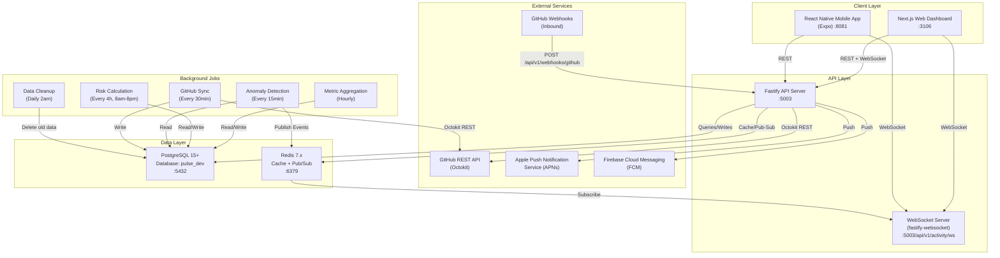
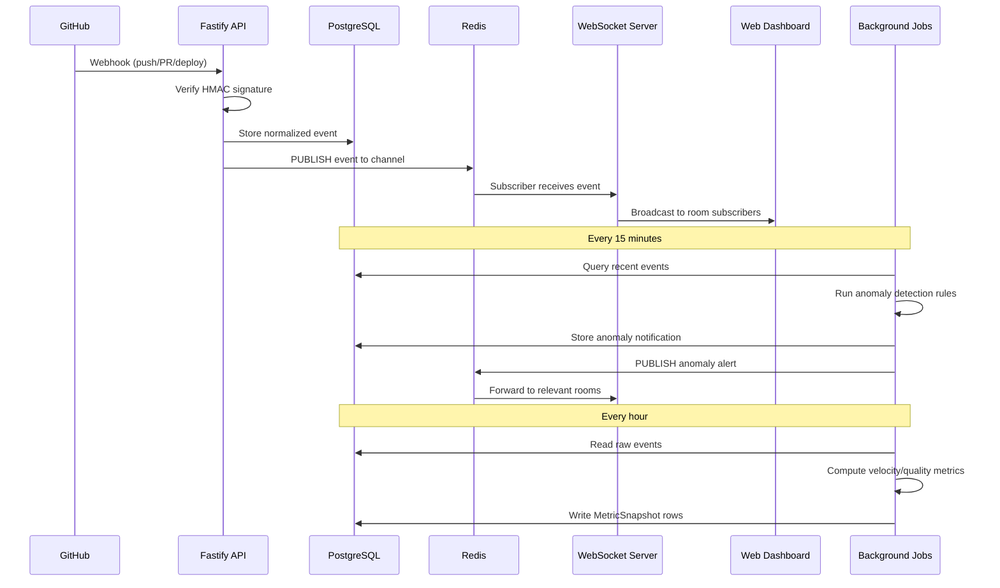
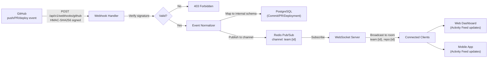
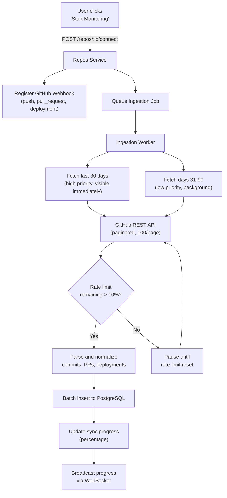
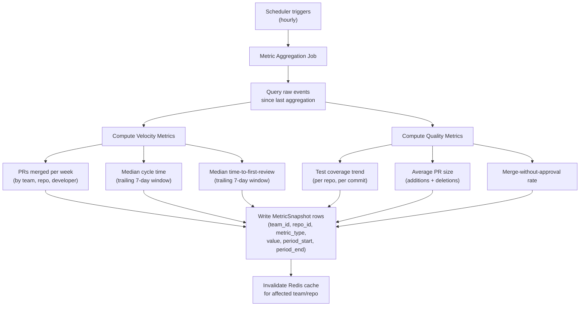
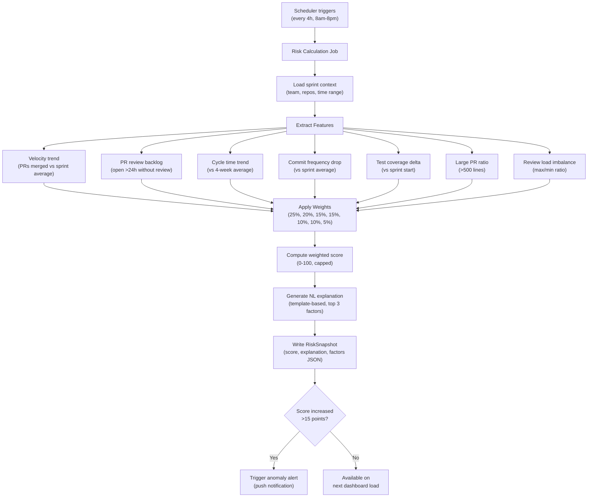
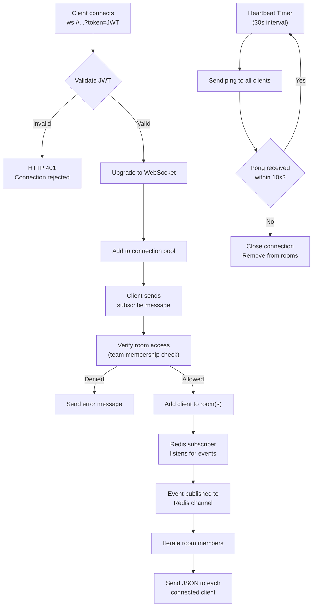
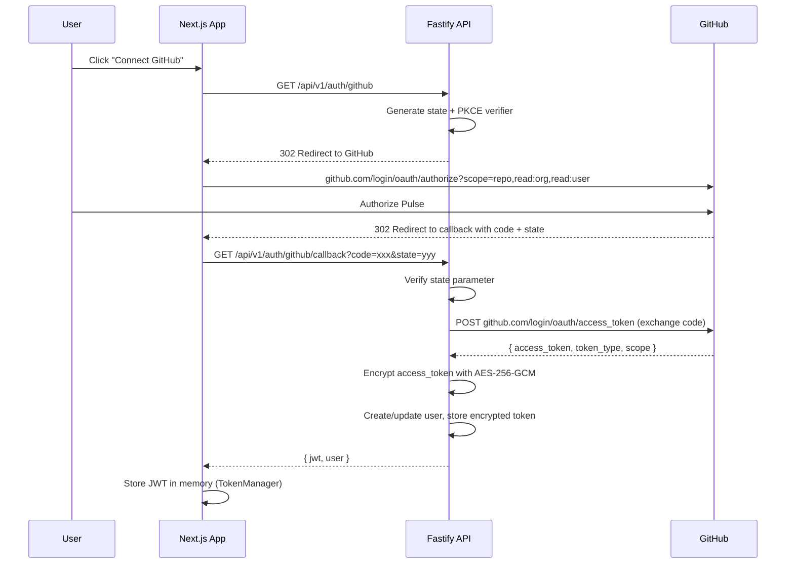
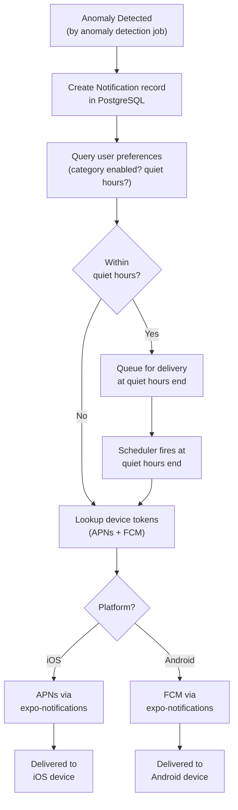
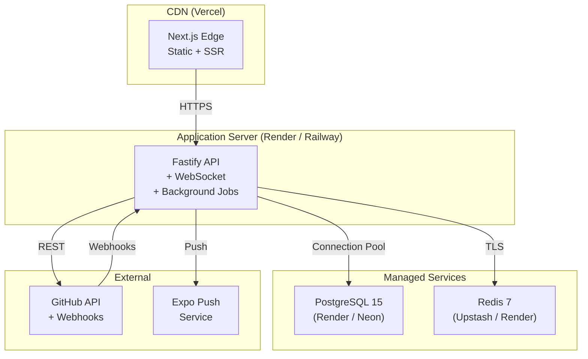

# Pulse - System Architecture

**Version**: 1.0
**Status**: Design
**Last Updated**: 2026-02-07
**Architect**: Claude Architect

---

## 1. Executive Summary

Pulse is an AI-Powered Developer Intelligence Platform that connects to GitHub repositories and transforms raw development activity into actionable dashboards for engineering leaders. This document defines the system architecture: a monolithic Fastify API with real-time WebSocket capabilities, a Next.js web dashboard with interactive charts, a React Native mobile app for push notifications, and background job infrastructure for metric aggregation and anomaly detection.

**Key Architecture Principles**:
- **Simplicity First**: Monolithic Fastify app (not microservices) until scale demands otherwise
- **Real-Time by Default**: WebSocket-first for live activity feeds, with REST fallback
- **Progressive Loading**: Cached aggregates load instantly, real-time data hydrates via WebSocket
- **Secure by Design**: AES-256 encrypted GitHub tokens, JWT auth, RBAC on every query
- **Event-Driven Internals**: GitHub webhooks trigger a pipeline: receive, normalize, store, aggregate, broadcast, detect anomalies

---

## 2. System Architecture

### 2.1 High-Level System Diagram



### 2.2 Component Communication Overview



---

## 3. Component Breakdown

### 3.1 Backend API (Fastify)

The backend is a single Fastify application organized into domain modules. Each module follows the Route-Handler-Service pattern.

**Directory Structure**:
```
apps/api/src/
  app.ts                    # Fastify app factory (buildApp)
  server.ts                 # Server startup (listen on :5003)
  plugins/
    prisma.ts               # PrismaClient lifecycle (from Component Registry)
    redis.ts                # Redis connection (from Component Registry)
    auth.ts                 # JWT + GitHub OAuth (adapted from Component Registry)
    observability.ts        # Correlation IDs + metrics (from Component Registry)
    websocket.ts            # fastify-websocket + room manager
    rate-limit.ts           # @fastify/rate-limit + Redis store
    cors.ts                 # @fastify/cors config
    helmet.ts               # @fastify/helmet security headers
  modules/
    auth/
      routes.ts             # POST /register, /login, GET /github, /github/callback, /refresh, etc.
      handlers.ts           # Request parsing, response formatting
      service.ts            # Business logic (bcrypt, JWT, GitHub OAuth exchange)
      schemas.ts            # Zod validation schemas
    repos/
      routes.ts             # GET /repos, /repos/available, POST /repos/:id/connect, etc.
      handlers.ts
      service.ts            # GitHub API calls, webhook registration, ingestion orchestration
      schemas.ts
      ingestion.ts          # Background ingestion job logic
    activity/
      routes.ts             # GET /activity, WS /activity/ws
      handlers.ts
      service.ts            # Activity event storage, WebSocket broadcast
      schemas.ts
      ws-handler.ts         # WebSocket connection handler, room subscriptions
    velocity/
      routes.ts             # GET /velocity, /velocity/cycle-time, /velocity/review-time
      handlers.ts
      service.ts            # Metric aggregation queries
      schemas.ts
    quality/
      routes.ts             # GET /quality, /quality/coverage
      handlers.ts
      service.ts            # Coverage tracking, PR size analysis
      schemas.ts
    risk/
      routes.ts             # GET /risk, /risk/history, /risk/factors
      handlers.ts
      service.ts            # Risk scoring algorithm, NL explanation generator
      schemas.ts
      scoring.ts            # Weighted factor scoring engine
    team/
      routes.ts             # GET /team, POST /team/invite, PATCH /team/:id/role, etc.
      handlers.ts
      service.ts            # RBAC enforcement, invitations
      schemas.ts
    notifications/
      routes.ts             # GET /notifications, PUT /preferences, POST /:id/dismiss
      handlers.ts
      service.ts            # Push notification delivery (APNs/FCM), preference management
      schemas.ts
      anomaly-detector.ts   # Anomaly detection rules engine
    health/
      routes.ts             # GET /health
      handlers.ts
    overview/
      routes.ts             # GET /overview/teams
      handlers.ts
      service.ts            # Cross-team aggregation for VP view
      schemas.ts
    settings/
      routes.ts             # GET/PUT /settings/profile
      handlers.ts
      service.ts
      schemas.ts
    webhooks/
      routes.ts             # POST /webhooks/github
      handlers.ts           # GitHub webhook signature verification
      service.ts            # Event normalization and storage
      schemas.ts
  jobs/
    scheduler.ts            # Job scheduler (setInterval-based, no external deps)
    metric-aggregation.ts   # Hourly metric computation
    risk-calculation.ts     # 4-hourly sprint risk scoring
    anomaly-detection.ts    # 15-minute anomaly checks
    github-sync.ts          # 30-minute polling failsafe
    data-cleanup.ts         # Daily data archival
  utils/
    crypto.ts               # Password hashing, encryption (from Component Registry)
    encryption.ts           # AES-256-GCM for GitHub tokens (from Component Registry)
    logger.ts               # Structured JSON logging (from Component Registry)
    errors.ts               # AppError with RFC 7807 (from Component Registry)
    pagination.ts           # Pagination helpers (from Component Registry)
    redis-rate-limit.ts     # Redis rate limit store (from Component Registry)
```

**Plugin Registration Order** (per PATTERN-009):
1. Observability (correlation IDs, request logging)
2. Prisma (database connection)
3. Redis (cache, pub/sub)
4. Auth (JWT verification, GitHub OAuth)
5. Rate Limit (Redis-backed)
6. CORS, Helmet (security headers)
7. WebSocket (real-time)
8. Module Routes (domain endpoints)

### 3.2 Frontend Web Dashboard (Next.js)

**Directory Structure**:
```
apps/web/src/
  app/
    layout.tsx              # Root layout (HTML, body, providers)
    page.tsx                # Landing page (/)
    login/page.tsx          # Login page
    signup/page.tsx         # Registration page
    forgot-password/page.tsx
    reset-password/page.tsx
    verify-email/page.tsx
    pricing/page.tsx
    docs/page.tsx
    dashboard/
      layout.tsx            # Dashboard shell (sidebar, header)
      page.tsx              # Main dashboard overview
      activity/page.tsx     # Real-time activity feed
      velocity/page.tsx     # Team velocity charts
      quality/page.tsx      # Code quality trends
      risk/
        page.tsx            # Sprint risk score
        history/page.tsx    # Risk history
      repos/
        page.tsx            # Connected repositories
        [id]/page.tsx       # Single repo detail
      team/
        page.tsx            # Team overview
        [id]/page.tsx       # Individual member
      overview/page.tsx     # Cross-team VP view
      settings/
        page.tsx            # Account settings
        notifications/page.tsx
        team/page.tsx       # Team management
  components/
    charts/
      VelocityChart.tsx     # Bar chart: PRs merged per week
      CycleTimeChart.tsx    # Line chart: median cycle time
      ReviewTimeChart.tsx   # Line + scatter: review time
      CoverageChart.tsx     # Area chart: test coverage
      RiskGauge.tsx         # Gauge: 0-100 risk score
      RiskSparkline.tsx     # Mini sparkline: 7-day risk
    dashboard/
      Sidebar.tsx           # Navigation sidebar (adapted from Component Registry)
      StatCard.tsx          # KPI metric card (from Component Registry)
      ActivityFeed.tsx      # Real-time event stream
      ActivityEvent.tsx     # Single event row
      RepoCard.tsx          # Repository status card
      RiskFactorList.tsx    # Risk factor breakdown
      TeamMemberCard.tsx    # Individual member velocity
    ui/                     # shadcn/ui components (Button, Card, Badge, etc.)
    common/
      ErrorBoundary.tsx     # Error boundary (from Component Registry)
      ProtectedRoute.tsx    # Auth guard (adapted for Next.js middleware)
      ThemeToggle.tsx       # Dark/light mode (from Component Registry)
      TimeRangeSelector.tsx # 4w/8w/12w/6m range picker
  hooks/
    useAuth.ts              # Auth state (adapted from Component Registry)
    useTheme.ts             # Theme toggle (from Component Registry)
    useWebSocket.ts         # WebSocket connection with auto-reconnect
    useActivityFeed.ts      # Activity events with filtering
    useVelocity.ts          # Velocity metrics data
    useQuality.ts           # Quality metrics data
    useRisk.ts              # Risk score data
    useTeam.ts              # Team data
    useNotifications.ts     # Notification preferences
  lib/
    api-client.ts           # HTTP client (adapted from Component Registry)
    token-manager.ts        # JWT storage (from Component Registry)
    ws-client.ts            # WebSocket client with reconnection
    chart-config.ts         # Shared Recharts theme/config
```

### 3.3 Mobile App (React Native / Expo)

**Directory Structure**:
```
apps/mobile/
  app/
    _layout.tsx             # Root layout (Expo Router)
    (auth)/
      login.tsx             # GitHub OAuth via WebView
    (tabs)/
      _layout.tsx           # Tab navigator
      index.tsx             # Dashboard summary
      activity.tsx          # Activity feed
      risk.tsx              # Sprint risk
      notifications.tsx     # Notification center
    settings.tsx            # App preferences
    repo/[id].tsx           # Repository detail
    pr/[id].tsx             # PR detail
  components/
    ActivityList.tsx
    RiskGauge.tsx
    NotificationItem.tsx
  hooks/
    useAuth.ts
    usePushNotifications.ts
    useWebSocket.ts
  lib/
    api-client.ts
    storage.ts              # SecureStore for tokens
```

---

## 4. Data Flow Diagrams

### 4.1 GitHub Webhook to Dashboard

This is the primary real-time data flow. GitHub pushes a webhook event, the API processes it, and the dashboard updates within 10 seconds.



### 4.2 Historical Data Ingestion

When a user connects a repository, historical data is fetched in the background.



### 4.3 Metric Aggregation Pipeline

Raw events are aggregated into pre-computed snapshots for fast dashboard queries.



### 4.4 Sprint Risk Scoring Pipeline



---

## 5. WebSocket Architecture

### 5.1 Protocol Design

Pulse uses `@fastify/websocket` (which wraps the `ws` library) for real-time communication. The protocol uses JSON messages over a single WebSocket connection per client.

**Connection URL**: `wss://api.pulse.dev/api/v1/activity/ws?token=<JWT>`

**Authentication**: JWT token passed as a query parameter during the WebSocket handshake. The server validates the token before upgrading the connection. If the token is invalid or expired, the server responds with HTTP 401 and does not upgrade.

### 5.2 Room-Based Subscriptions

Each WebSocket connection can subscribe to multiple rooms. Events are broadcast only to rooms the client has joined.

**Room Types**:
| Room Pattern | Description | Example |
|-------------|-------------|---------|
| `team:{teamId}` | All activity for a team | `team:clx1abc123` |
| `repo:{repoId}` | Activity for a specific repo | `repo:clx2def456` |
| `user:{userId}` | Personal notifications | `user:clx3ghi789` |

### 5.3 Message Protocol

All WebSocket messages are JSON with a `type` field for routing.

**Client-to-Server Messages**:

```json
// Subscribe to room(s)
{
  "type": "subscribe",
  "rooms": ["team:clx1abc123", "repo:clx2def456"]
}

// Unsubscribe from room(s)
{
  "type": "unsubscribe",
  "rooms": ["repo:clx2def456"]
}

// Heartbeat (client pong)
{
  "type": "pong"
}
```

**Server-to-Client Messages**:

```json
// Activity event broadcast
{
  "type": "activity",
  "room": "team:clx1abc123",
  "data": {
    "id": "evt_abc123",
    "eventType": "pull_request.opened",
    "repoName": "backend-api",
    "repoFullName": "acme/backend-api",
    "author": {
      "username": "priya-dev",
      "avatarUrl": "https://avatars.githubusercontent.com/u/123"
    },
    "title": "Add user authentication middleware",
    "number": 142,
    "url": "https://github.com/acme/backend-api/pull/142",
    "timestamp": "2026-02-07T10:30:00Z"
  }
}

// Heartbeat (server ping)
{
  "type": "ping"
}

// Sync progress update
{
  "type": "sync_progress",
  "data": {
    "repoId": "clx2def456",
    "repoName": "backend-api",
    "progress": 67,
    "status": "syncing"
  }
}

// Anomaly alert
{
  "type": "anomaly",
  "room": "team:clx1abc123",
  "data": {
    "id": "alert_xyz789",
    "anomalyType": "stalled_pr",
    "severity": "high",
    "title": "PR #142 has been open 52 hours without review",
    "repoName": "backend-api",
    "timestamp": "2026-02-07T10:30:00Z"
  }
}

// Risk score update
{
  "type": "risk_update",
  "room": "team:clx1abc123",
  "data": {
    "score": 72,
    "previousScore": 58,
    "explanation": "Sprint risk is 72 (high). Top factors: ..."
  }
}

// Error
{
  "type": "error",
  "data": {
    "code": "INVALID_ROOM",
    "message": "Room 'team:invalid' does not exist or you lack permission"
  }
}
```

### 5.4 Heartbeat and Reconnection

- **Server Ping**: Every 30 seconds, the server sends `{"type": "ping"}`
- **Client Pong**: Client must respond with `{"type": "pong"}` within 10 seconds
- **Stale Connection Cleanup**: If no pong received within 10 seconds, the server closes the connection
- **Client Reconnection**: Client implements exponential backoff reconnection:
  - Attempt 1: immediate
  - Attempt 2: 1 second
  - Attempt 3: 2 seconds
  - Attempt 4: 4 seconds
  - Maximum: 30 seconds between attempts
- **Backfill on Reconnect**: After reconnection, client sends a `last_event_id` to request missed events:
  ```json
  {
    "type": "subscribe",
    "rooms": ["team:clx1abc123"],
    "lastEventId": "evt_abc122"
  }
  ```
  The server replays events after `lastEventId` from the database (up to 100 events, within the last 5 minutes).

### 5.5 WebSocket Server Architecture



---

## 6. Background Job Architecture

Background jobs run within the same Fastify process using `setInterval`. This keeps the architecture simple (no external job queue like BullMQ) for MVP. Each job is idempotent and uses database timestamps to track last execution.

### 6.1 Job Schedule

| Job | Frequency | Window | Duration Target | Purpose |
|-----|-----------|--------|----------------|---------|
| Metric Aggregation | Every 60 min | 24/7 | <30s | Compute velocity + quality metrics from raw events |
| Risk Calculation | Every 4 hours | 8am-8pm team TZ | <15s | Run sprint risk scoring algorithm |
| Anomaly Detection | Every 15 min | 24/7 | <10s | Check for anomalous patterns in recent data |
| GitHub Sync | Every 30 min | 24/7 | <60s | Poll GitHub for events missed by webhooks |
| Data Cleanup | Daily at 2am | 2am-3am UTC | <5min | Archive/delete data older than retention period |

### 6.2 Job Scheduler Implementation

```typescript
// jobs/scheduler.ts (simplified)
interface ScheduledJob {
  name: string;
  fn: () => Promise<void>;
  intervalMs: number;
  windowStart?: number; // hour (0-23)
  windowEnd?: number;   // hour (0-23)
  lastRun?: Date;
}

class JobScheduler {
  private jobs: Map<string, NodeJS.Timer> = new Map();

  register(job: ScheduledJob): void {
    const timer = setInterval(async () => {
      if (job.windowStart !== undefined) {
        const hour = new Date().getUTCHours();
        if (hour < job.windowStart || hour >= job.windowEnd!) return;
      }
      try {
        await job.fn();
        job.lastRun = new Date();
      } catch (err) {
        logger.error({ job: job.name, err }, 'Job failed');
      }
    }, job.intervalMs);
    this.jobs.set(job.name, timer);
  }

  shutdown(): void {
    for (const [name, timer] of this.jobs) {
      clearInterval(timer);
    }
  }
}
```

### 6.3 Job Idempotency

Each job reads a `last_processed_at` timestamp from the database to determine the window of events to process. This ensures that:
- Jobs can safely overlap (no double-counting)
- Server restarts do not cause data gaps
- Multiple instances can run the same job without conflict (using `SELECT FOR UPDATE` advisory locks)

---

## 7. Authentication and Security Architecture

### 7.1 Authentication Flow

Pulse supports two authentication methods:

**Method 1: Email/Password**
1. User registers with email + password
2. Password hashed with bcrypt (cost factor 12)
3. Email verification token sent
4. On login: JWT access token (1hr) + HttpOnly refresh token cookie (7d)

**Method 2: GitHub OAuth**
1. User clicks "Login with GitHub" or "Connect GitHub"
2. Redirect to `https://github.com/login/oauth/authorize` with scopes: `repo`, `read:org`, `read:user`
3. GitHub redirects back with authorization code
4. Backend exchanges code for access token via `POST https://github.com/login/oauth/access_token`
5. Access token encrypted with AES-256-GCM and stored in database
6. If user does not exist: create account from GitHub profile
7. Issue JWT + refresh token



### 7.2 Token Architecture

| Token Type | Lifetime | Storage | Purpose |
|-----------|----------|---------|---------|
| JWT Access Token | 1 hour | In-memory (TokenManager) | API authentication |
| Refresh Token | 7 days | HttpOnly Secure cookie | Silent token renewal |
| GitHub OAuth Token | Until revoked | PostgreSQL (AES-256 encrypted) | GitHub API access |
| WebSocket Token | Same as JWT | Query parameter on connect | WebSocket auth |

### 7.3 RBAC Model

Three roles with hierarchical permissions:

| Permission | Admin | Member | Viewer |
|-----------|-------|--------|--------|
| View dashboards | Yes | Yes | Yes |
| View activity feed | Yes | Yes | Yes |
| Connect/disconnect repos | Yes | Yes (own) | No |
| Manage team members | Yes | No | No |
| Change team settings | Yes | No | No |
| Configure notifications | Yes | Yes (own) | Yes (own) |
| Invite members | Yes | No | No |
| Delete team | Yes | No | No |

RBAC is enforced at the service layer, not just the route layer. Every database query includes a team membership check to prevent data leakage.

### 7.4 Security Controls

| Control | Implementation |
|---------|---------------|
| Token Encryption | AES-256-GCM for GitHub tokens at rest |
| Password Hashing | bcrypt cost factor 12 |
| JWT Signing | HS256 with server secret (256-bit) |
| Webhook Verification | HMAC-SHA256 signature on all GitHub webhooks |
| Rate Limiting | Auth: 10/min/IP, API: 100/min/user, Webhooks: 1000/min |
| Input Validation | Zod schemas on all endpoints |
| Security Headers | @fastify/helmet (HSTS, CSP, X-Frame-Options) |
| CORS | Restrict to frontend origin only |
| SQL Injection | Prisma ORM (parameterized queries) |
| XSS Prevention | React auto-escaping + CSP |

---

## 8. Caching Strategy

### 8.1 Redis Cache Layers

| Cache Key Pattern | TTL | Purpose |
|-------------------|-----|---------|
| `metrics:velocity:{teamId}:{range}` | 5 min | Pre-computed velocity dashboard data |
| `metrics:quality:{teamId}:{range}` | 5 min | Pre-computed quality dashboard data |
| `metrics:risk:{teamId}` | Until next calculation | Current risk score + explanation |
| `repos:available:{userId}` | 10 min | GitHub repo list (expensive API call) |
| `repos:sync:{repoId}` | Until complete | Ingestion progress percentage |
| `ws:rooms:{roomId}` | Session | Room membership for WebSocket routing |
| `rate:{type}:{identifier}` | Window size | Rate limit counters |

### 8.2 Cache Invalidation Strategy

- **Metric caches** are invalidated when the metric aggregation job completes
- **Risk cache** is replaced when the risk calculation job runs
- **Repo list cache** is invalidated when a user connects/disconnects a repo
- **WebSocket room state** is stored in Redis to support future horizontal scaling

### 8.3 Redis Pub/Sub Channels

| Channel | Publishers | Subscribers | Message Type |
|---------|-----------|-------------|-------------|
| `events:team:{teamId}` | Webhook handler, Sync job | WebSocket server | Activity events |
| `events:repo:{repoId}` | Webhook handler, Sync job | WebSocket server | Repo-specific events |
| `alerts:team:{teamId}` | Anomaly detector | WebSocket server | Anomaly alerts |
| `sync:repo:{repoId}` | Ingestion worker | WebSocket server | Sync progress |

---

## 9. Mobile Push Notification Architecture

### 9.1 Push Notification Flow



### 9.2 Device Token Management

- Mobile app registers for push notifications on startup using `expo-notifications`
- Device token (APNs token for iOS, FCM token for Android) sent to backend: `POST /api/v1/notifications/device-token`
- Token stored in `DeviceToken` table (userId, platform, token, lastUsedAt)
- Tokens refreshed on each app launch
- Stale tokens (no app launch in 30 days) are cleaned up

### 9.3 Notification Payload Structure

```json
{
  "to": "ExponentPushToken[xxx]",
  "title": "Stalled PR Alert",
  "body": "PR #142 in backend-api has been open 52 hours without review",
  "data": {
    "type": "anomaly",
    "anomalyType": "stalled_pr",
    "repoId": "clx2def456",
    "prNumber": 142,
    "deepLink": "/dashboard/repos/clx2def456?pr=142"
  },
  "sound": "default",
  "badge": 1,
  "priority": "high"
}
```

---

## 10. Deployment Architecture

### 10.1 Production Topology



### 10.2 Environment Configuration

| Variable | Required | Description |
|----------|----------|-------------|
| `DATABASE_URL` | Yes | PostgreSQL connection string |
| `REDIS_URL` | Yes | Redis connection string |
| `JWT_SECRET` | Yes | 256-bit secret for JWT signing |
| `GITHUB_CLIENT_ID` | Yes | GitHub OAuth App client ID |
| `GITHUB_CLIENT_SECRET` | Yes | GitHub OAuth App client secret |
| `GITHUB_WEBHOOK_SECRET` | Yes | Secret for webhook HMAC verification |
| `ENCRYPTION_KEY` | Yes | 32-byte hex key for AES-256-GCM |
| `FRONTEND_URL` | Yes | Frontend origin for CORS + OAuth callback |
| `PORT` | No | API port (default: 5003) |
| `NODE_ENV` | No | Environment (development/production) |
| `LOG_LEVEL` | No | Logging level (default: info) |
| `EXPO_ACCESS_TOKEN` | Prod | Expo push notification token |

### 10.3 Local Development Setup

```bash
# Prerequisites: Node.js 20+, PostgreSQL 15+, Redis 7+

# Database
createdb pulse_dev

# Environment
cp .env.example .env
# Fill in GITHUB_CLIENT_ID, GITHUB_CLIENT_SECRET, etc.

# Install dependencies
cd products/pulse && npm install

# Generate Prisma client and run migrations
cd apps/api && npx prisma generate && npx prisma migrate dev

# Seed test data
npx prisma db seed

# Start backend (port 5003)
cd apps/api && npm run dev

# Start frontend (port 3106)
cd apps/web && npm run dev

# Start mobile (port 8081)
cd apps/mobile && npx expo start
```

---

## 11. Technology Decisions Summary

| Decision | Choice | Rationale | ADR |
|----------|--------|-----------|-----|
| Real-time transport | `@fastify/websocket` | Native Fastify integration, lightweight, room-based pub/sub via Redis | ADR-001 |
| GitHub data strategy | Webhooks + polling hybrid | Webhooks for real-time, polling as failsafe for missed events | ADR-002 |
| Risk scoring approach | Rule-based weighted factors | Simpler, explainable, no ML infra needed for MVP; iterate with data | ADR-003 |
| Chart library | Recharts | React-native, composable, good TypeScript support, lighter than alternatives | ADR-004 |
| Caching / real-time state | Redis pub/sub + metric caching | Single Redis instance serves dual purpose; proven pattern from stablecoin-gateway | ADR-005 |
| Job scheduling | In-process setInterval | Simple, no external deps; upgrade to BullMQ if needed at scale | -- |
| Mobile framework | React Native (Expo) | Cross-platform, shared JS codebase, expo-notifications for push | -- |
| Authentication | JWT + bcrypt + GitHub OAuth | Proven ConnectSW pattern, adapted from Component Registry | -- |

---

**Created by**: Architect
**Last Updated**: 2026-02-07
**Status**: Design Complete - Pending Review
