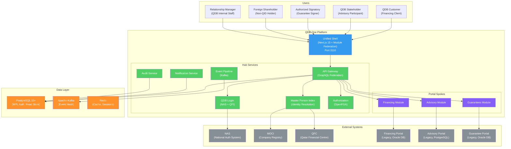

# QDB One -- Unified Portal Platform for Qatar Development Bank

QDB One is an enterprise integration platform that unifies Qatar Development Bank's three separate portals -- Direct Financing, Advisory Services, and Guarantees -- into a single application. A user logs in once, sees every relationship they hold with QDB in a unified dashboard, and navigates between services without re-authenticating or maintaining separate identities.

## Why QDB One Exists

QDB currently operates three portals with independent databases, authentication methods, and user models. The same individual may appear as a "customer" in Direct Financing (CR-based login), a "stakeholder" in Advisory Services (email-based login), and an "authorized signatory" in Guarantees (NAS-based login). This creates:

- **Identity Fragmentation**: The same person exists as 3+ separate records with no shared identifier
- **Authentication Confusion**: Users must remember which login method corresponds to which portal
- **No Cross-Portal Visibility**: A relationship manager cannot see that a lending client is also enrolled in advisory programs
- **Duplicate Data Entry**: Company information is re-entered across portals
- **Inconsistent Data**: An address updated in one portal remains stale in others

QDB One eliminates these problems by introducing a Master Person Index (MPI) for identity resolution, a consolidated NAS-backed login, and a unified presentation layer with seamless cross-portal navigation.

## Architecture Overview



## Architecture Principles

| # | Principle | Rationale |
|---|-----------|-----------|
| AP-1 | No premature database consolidation | Portal databases remain independent; QDB One reads from them |
| AP-2 | Event-driven integration | Portals communicate through Kafka events, not direct API calls |
| AP-3 | CQRS for cross-portal views | Dashboards use materialized read store; detail views query portal DBs |
| AP-4 | Identity as a first-class service | MPI is the single source of truth for cross-portal identity |
| AP-5 | Authorization is relationship-based | OpenFGA models person-organization-role relationships |
| AP-6 | Seamless, not stitched | Module Federation with shared shell; no iframes or page reloads |
| AP-7 | Data sovereignty | All data stays in Qatar; QDB-managed encryption keys |
| AP-8 | Strangler Fig migration | Replace legacy portals incrementally with parallel-run validation |

## Tech Stack

| Layer | Technology | Version |
|-------|-----------|---------|
| Runtime | Node.js | 20+ |
| Language | TypeScript | 5+ |
| Frontend | Next.js (App Router) | 15+ |
| UI Library | React | 18+ |
| Styling | Tailwind CSS | Latest |
| Micro-Frontends | Module Federation | Webpack 5 |
| API Layer | GraphQL Federation | Apollo |
| Identity | Master Person Index (MPI) | Custom |
| Authentication | NAS (SAML 2.0/OIDC) | -- |
| Authorization | OpenFGA | Latest |
| Database | PostgreSQL | 15+ |
| Event Streaming | Apache Kafka | Latest |
| Cache | Redis | 7+ |
| Testing | Jest, Playwright | Latest |

## Port Assignments

| Service | Port |
|---------|------|
| Frontend (Unified Shell) | 3110 |
| Backend (API Gateway) | 5010 |
| PostgreSQL | 5432 |
| Redis | 6379 |
| Kafka | 9092 |

## Getting Started

### Prerequisites

- Node.js 20+
- Docker and Docker Compose
- PostgreSQL 15+ (or use Docker)
- Redis 7+ (or use Docker)

### Quick Start

```bash
# 1. Navigate to product
cd products/qdb-one

# 2. Install frontend dependencies
cd apps/web && npm install && cd ../..

# 3. Start the development server
cd apps/web && npm run dev
# Web: http://localhost:3110
```

**Note**: QDB One is in early development. The frontend shell is initialized with Next.js 15. Backend services (MPI, Auth, API Gateway) are in the architecture phase and do not yet have runnable code.

## Development Commands

```bash
# Start frontend dev server
cd products/qdb-one/apps/web && npm run dev

# Build for production
cd apps/web && npm run build

# Lint
cd apps/web && npm run lint
```

## Project Structure

```
products/qdb-one/
├── apps/
│   └── web/                            # Next.js 15 frontend (port 3110)
│       ├── src/
│       │   ├── app/
│       │   │   ├── dashboard/page.tsx   # Unified dashboard
│       │   │   ├── financing/page.tsx   # Financing module
│       │   │   ├── advisory/page.tsx    # Advisory module
│       │   │   ├── guarantees/page.tsx  # Guarantees module
│       │   │   ├── documents/page.tsx   # Document management
│       │   │   ├── notifications/page.tsx
│       │   │   ├── profile/page.tsx
│       │   │   ├── search/page.tsx
│       │   │   ├── login/page.tsx
│       │   │   └── m/                   # Mobile-optimized layout
│       │   ├── components/
│       │   │   └── landing/LandingPage.tsx
│       │   └── contexts/
│       │       ├── AuthContext.tsx
│       │       └── LanguageContext.tsx
│       ├── next.config.ts
│       └── package.json
├── docs/
│   ├── PRD.md                          # Product Requirements (comprehensive)
│   ├── architecture.md                 # System Architecture (C4 model)
│   ├── data-model.md                   # Data model documentation
│   ├── infrastructure.md               # Infrastructure design
│   ├── api-contracts.md                # API contract definitions
│   ├── tasks.md                        # Task tracking
│   └── ADRs/                           # 10 Architecture Decision Records
│       ├── ADR-001-identity-resolution.md
│       ├── ADR-002-authentication.md
│       ├── ADR-003-data-access-cqrs-graphql.md
│       ├── ADR-004-authorization-openfga.md
│       ├── ADR-005-frontend-module-federation.md
│       ├── ADR-006-event-pipeline.md
│       ├── ADR-007-unified-read-store.md
│       ├── ADR-008-api-layer-graphql-federation.md
│       ├── ADR-009-deployment-on-premise-kubernetes.md
│       └── ADR-010-observability-stack.md
└── README.md                           # This file
```

## Key Features (Planned)

| Feature | Phase | Description |
|---------|-------|-------------|
| Master Person Index (MPI) | Phase 0 | Cross-portal identity resolution; deterministic + probabilistic matching |
| QDB Login | Phase 0 | Unified NAS-backed authentication; QFI for foreign shareholders |
| Authorization Model | Phase 0 | OpenFGA relationship-based access; person-organization-role |
| Event Pipeline | Phase 0 | Kafka event mesh for cross-portal integration |
| Unified Dashboard | Phase 1 | Single dashboard with financing, advisory, guarantees data |
| Financing Integration | Phase 1 | Direct Financing portal integration via read store |
| Advisory Integration | Phase 2 | Advisory Services portal integration |
| Guarantee Integration | Phase 2 | Guarantee portal integration |
| Cross-Portal Linking | Phase 2 | See related items across portals inline |
| Legacy Portal Sunset | Phase 3 | Decommission legacy portals after migration |

## Timeline

| Phase | Duration | Scope |
|-------|----------|-------|
| Phase 0: Foundation | Months 1-6 | MPI, QDB Login, Authorization, Event Pipeline, Design System |
| Phase 1: First Portal | Months 7-10 | Direct Financing integration, Unified Dashboard, Pilot |
| Phase 2: Full Integration | Months 11-16 | Advisory + Guarantee integration, Cross-Portal Linking |
| Phase 3: Decommission | Months 17-18+ | Legacy portal sunset, archival, infrastructure cleanup |

## Documentation

| Document | Path | Description |
|----------|------|-------------|
| PRD | [docs/PRD.md](docs/PRD.md) | Comprehensive product requirements with personas and acceptance criteria |
| Architecture | [docs/architecture.md](docs/architecture.md) | System architecture with C4 diagrams |
| Data Model | [docs/data-model.md](docs/data-model.md) | Entity-relationship documentation |
| API Contracts | [docs/api-contracts.md](docs/api-contracts.md) | GraphQL and REST API definitions |
| Infrastructure | [docs/infrastructure.md](docs/infrastructure.md) | Kubernetes, on-premise deployment |
| ADRs | [docs/ADRs/](docs/ADRs/) | 10 Architecture Decision Records |

## License

UNLICENSED -- ConnectSW Internal / QDB Confidential
