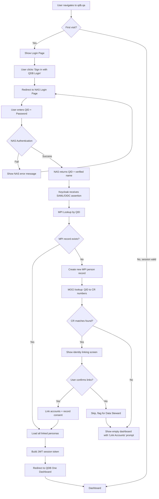
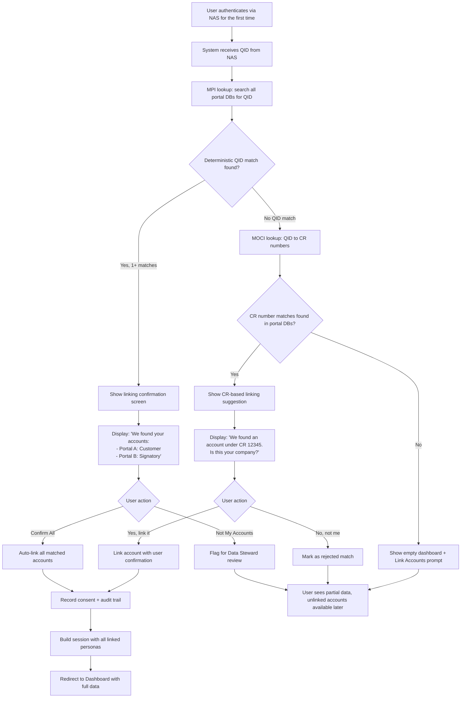
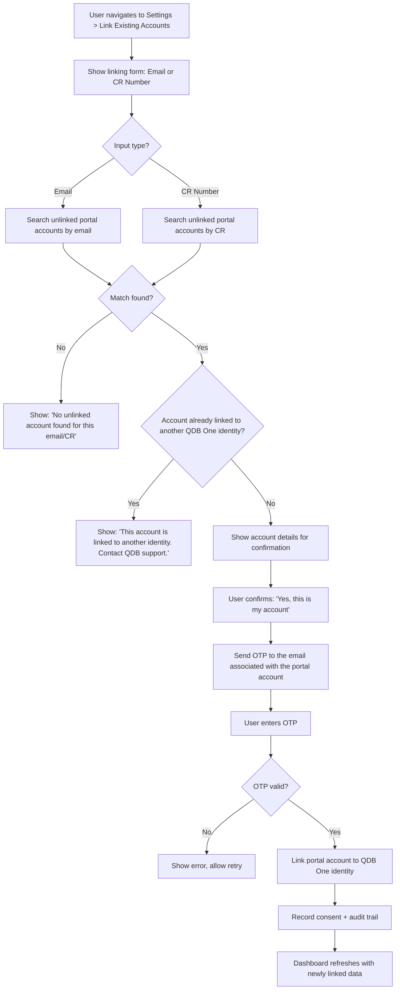
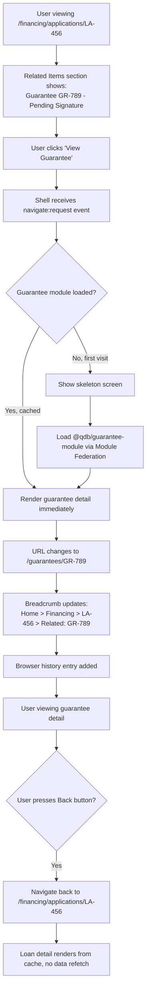
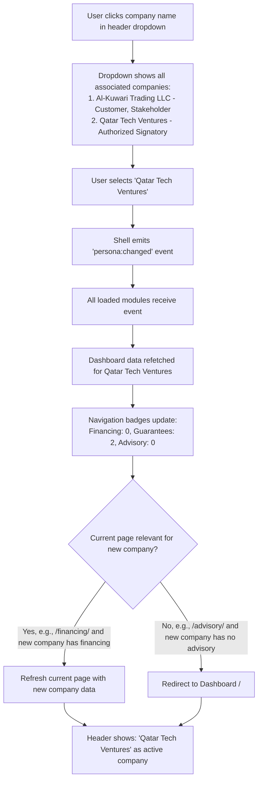
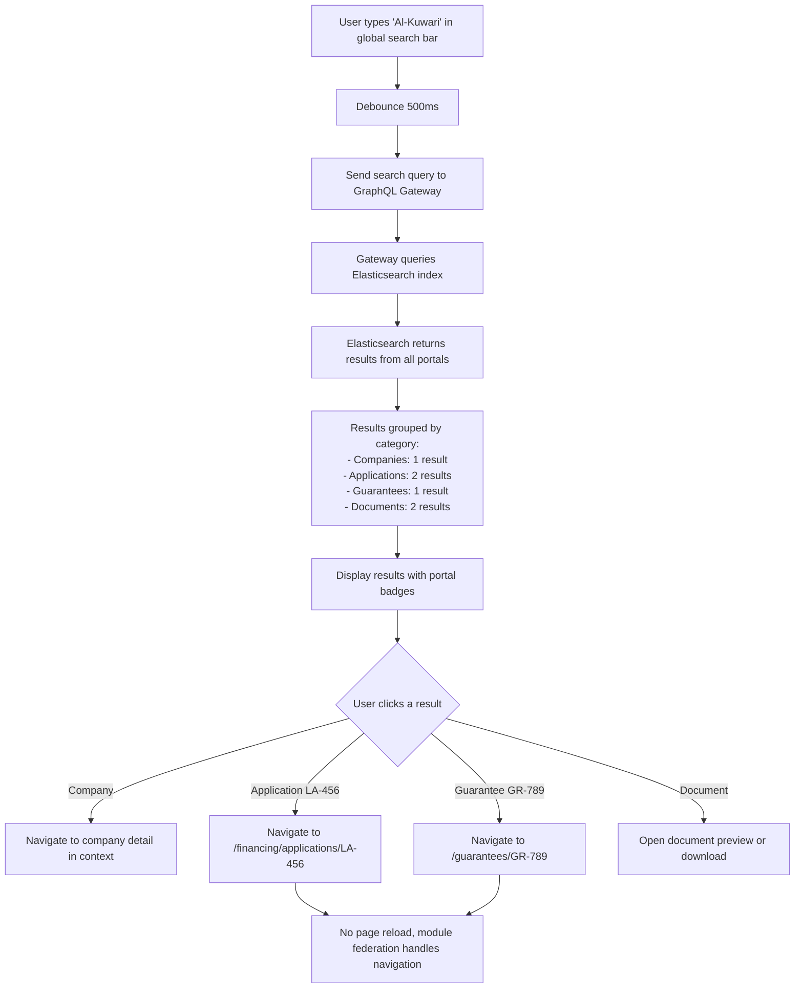
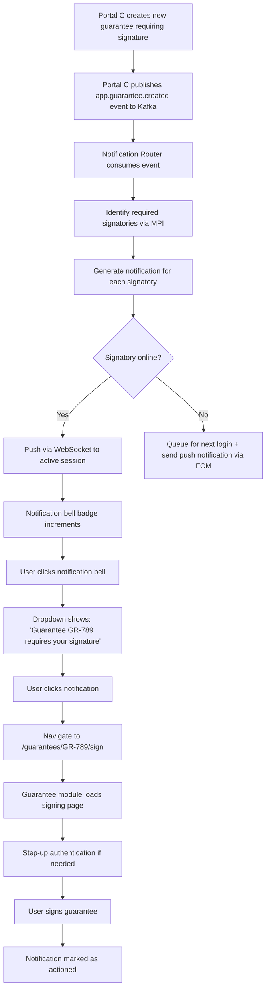

# QDB One: Unified Portal Platform - Product Requirements Document

**Product**: QDB One
**Client**: Qatar Development Bank (QDB)
**Version**: 1.0
**Date**: February 15, 2026
**Classification**: Confidential - Internal Use Only
**Author**: ConnectSW Product Management
**Status**: Draft

---

## Table of Contents

1. [Executive Summary](#1-executive-summary)
2. [Personas](#2-personas)
3. [MVP Features (Phase 0-1)](#3-mvp-features-phase-0-1)
4. [Phase 2 Features](#4-phase-2-features)
5. [Phase 3 / Future Features](#5-phase-3--future-features)
6. [User Flows](#6-user-flows)
7. [Site Map](#7-site-map)
8. [Functional Requirements](#8-functional-requirements)
9. [Non-Functional Requirements](#9-non-functional-requirements)
10. [Acceptance Criteria](#10-acceptance-criteria)
11. [External Integrations](#11-external-integrations)
12. [Out of Scope](#12-out-of-scope)
13. [Risks & Mitigations](#13-risks--mitigations)
14. [Success Metrics](#14-success-metrics)

---

## 1. Executive Summary

### 1.1 What QDB One Is

QDB One is an enterprise integration platform that unifies Qatar Development Bank's three separate portals -- Direct Financing, Advisory Services, and Guarantees -- into a single application. A user logs in once, sees every relationship they hold with QDB in a single dashboard, and navigates between services without re-authenticating or maintaining separate identities.

### 1.2 Why QDB One Exists

QDB currently operates three portals with independent databases, authentication methods, and user models. The same individual may appear as a "customer" in Direct Financing (CR-based login), a "stakeholder" in Advisory Services (email-based login), and an "authorized signatory" in Guarantees (NAS-based login). There is no cross-portal awareness:

- **Identity Fragmentation**: The same person exists as 3+ separate records with no shared identifier.
- **Authentication Confusion**: Users must remember which login method corresponds to which portal.
- **No Cross-Portal Visibility**: A relationship manager cannot see that a lending client is also enrolled in an advisory program and has a pending guarantee.
- **Duplicate Data Entry**: Company information is re-entered across portals.
- **Inconsistent Data**: An address updated in one portal remains stale in others.
- **Integration Duplication**: External integrations (QFC, MOCI) are implemented independently per portal.

QDB One eliminates these problems by introducing a Master Person Index (MPI) for identity resolution, a consolidated NAS-backed login, and a unified presentation layer with seamless cross-portal navigation.

### 1.3 Success Metrics Summary

| Metric | Target | Measurement Method |
|--------|--------|-------------------|
| Single login adoption | 95% of active users within 6 months of launch | Authentication system telemetry |
| Cross-portal dashboard load time | < 3 seconds (95th percentile) | Application Performance Monitoring |
| Identity match accuracy | > 98% deterministic match rate | MPI reconciliation reports |
| User satisfaction (pilot) | > 80% positive on post-pilot survey | Structured survey (Likert scale) |
| Support ticket reduction | 40% reduction in login/access-related tickets | Helpdesk ticketing system |
| Legacy portal sunset | All legacy portals decommissioned by month 18 | Infrastructure monitoring |

### 1.4 Timeline Overview

| Phase | Duration | Scope |
|-------|----------|-------|
| Phase 0: Foundation | Months 1-6 | MPI, QDB Login, Authorization Model, Event Pipeline, Design System |
| Phase 1: First Portal | Months 7-10 | Direct Financing integration, Unified Dashboard (financing only), Pilot |
| Phase 2: Full Integration | Months 11-16 | Advisory + Guarantee integration, Cross-Portal Linking, Full Dashboard |
| Phase 3: Decommission | Months 17-18+ | Legacy portal sunset, archival, infrastructure cleanup |

---

## 2. Personas

### 2.1 QDB Customer

**Description**: An individual or authorized representative of a company that has an active financing relationship with QDB (loans, credit lines, or pending applications).

**Demographics**: Business owners, CFOs, financial controllers of Qatari-registered companies.

**Current Experience**: Logs into the Direct Financing portal using a CR-based login. Can only see financing-related data. Unaware that their company may also have a guarantee or advisory relationship visible in other portals.

**QDB One Experience**: Logs in once with QDB Login (NAS). Sees all financing data alongside any guarantee or advisory relationships for the same company. Receives notifications for pending actions across all services.

**Key Goals**:
- View all active loans, payment schedules, and application statuses in one place
- Submit new financing applications without re-entering company information
- Track related guarantees linked to their loans

**Frustrations with Current State**:
- Must use a separate CR-based login that differs from other portal logins
- Cannot see if a guarantee linked to a loan requires action
- Must re-enter company details when applying for advisory services

---

### 2.2 QDB Stakeholder

**Description**: An individual associated with a company enrolled in QDB's SME advisory programs (training, mentorship, business development).

**Demographics**: Entrepreneurs, SME founders, business development managers.

**Current Experience**: Logs into the Advisory Services portal using an email-based login. Sees advisory program enrollments, session schedules, and assessment results. Has no visibility into financing or guarantee relationships.

**QDB One Experience**: Logs in once with QDB Login (NAS). Sees advisory sessions alongside any financing or guarantee data for their company. Can navigate from an advisory session to a related loan application without switching portals.

**Key Goals**:
- View upcoming advisory sessions and program progress
- Access assessment results and recommended action plans
- See related financing options recommended during advisory sessions

**Frustrations with Current State**:
- Email-based login is different from the CR login used in Financing
- Cannot act on financing recommendations from advisory sessions without logging into a separate portal
- No unified view of all QDB engagement

---

### 2.3 Authorized Signatory

**Description**: An individual authorized by a company's board or management to sign guarantee documents, approve large financial transactions, or act as the company's legal representative with QDB.

**Demographics**: CEOs, board members, authorized representatives of companies with active guarantees.

**Current Experience**: Logs into the Guarantee portal using NAS. Can only see guarantees requiring their signature. Unaware of related loan applications that triggered the guarantee requirement.

**QDB One Experience**: Logs in once with QDB Login (NAS). Dashboard highlights pending signature actions across all portals. Can view the loan application that prompted a guarantee requirement directly from the guarantee detail page.

**Key Goals**:
- See all documents awaiting their signature in one place
- Understand the context behind each guarantee (which loan, which advisory recommendation)
- Delegate signing authority to deputies when unavailable

**Frustrations with Current State**:
- Cannot see the financing context behind a guarantee request without logging into a separate portal
- No delegation mechanism; must physically be available to sign
- No notification when new items require their signature

---

### 2.4 Multi-Role User (Primary Persona)

**Description**: An individual who holds two or more roles across QDB portals. This is the persona QDB One is primarily designed for. A multi-role user might be a Customer in Financing, a Stakeholder in Advisory, and an Authorized Signatory in Guarantees -- potentially for multiple companies.

**Demographics**: Senior business leaders, serial entrepreneurs, company representatives with diverse QDB relationships.

**Current Experience**: Maintains 2-3 separate logins across portals. Must manually correlate information between portals. Has no unified view of their total QDB relationship.

**QDB One Experience**: Logs in once. A unified dashboard shows all roles across all portals grouped by company. The company switcher allows viewing data for different organizations. Cross-portal linking shows related items inline (e.g., a loan with its linked guarantee and advisory session).

**Key Goals**:
- Single login to access all QDB services
- Unified dashboard showing all pending actions across portals
- Switch between company contexts without logging out
- See cross-portal relationships (loan -> guarantee -> advisory session)

**Frustrations with Current State**:
- Three separate logins with three different authentication methods
- No awareness that actions in one portal affect items in another
- Must manually track relationships between loans, guarantees, and advisory sessions
- Cannot delegate access to deputies across portals

**Quantification**: Multi-role users are estimated at 15-25% of the total user base but generate a disproportionate share of support tickets (estimated 40-50% of login/access issues).

---

### 2.5 Foreign Shareholder

**Description**: A non-Qatari individual who holds equity in a Qatari-registered company but does not possess a Qatar ID (QID). Primarily foreign investors, expatriate shareholders, or international partners.

**Demographics**: International investors, expatriate business partners. Estimated 3-8% of total user base.

**Current Experience**: May have limited portal access via email-based login in Advisory, or may interact exclusively through a QDB relationship manager. No NAS login capability.

**QDB One Experience**: Onboarded by a QDB Relationship Manager who creates a QDB Foreign ID (QFI). Logs in using QFI + email OTP. Sees the same dashboard as QID-based users but with restricted signing authority for operations requiring government-grade identity verification.

**Key Goals**:
- Access QDB services without a Qatar ID
- View company data for organizations where they hold shares
- Participate in advisory programs and view guarantee status

**Constraints**:
- Cannot sign documents that require QID-level identity verification without a QID-holding co-signer
- Must complete annual passport re-verification to maintain access
- Account suspended automatically if passport expires

**Frustrations with Current State**:
- Often excluded from portal access entirely
- Dependent on relationship managers for all information
- No self-service capability

---

### 2.6 QDB Relationship Manager (Internal Staff)

**Description**: A QDB employee responsible for managing client relationships across one or more service lines. Serves as the primary point of contact for QDB customers.

**Demographics**: QDB staff in client-facing roles. Estimated 50-100 users.

**Current Experience**: Accesses each portal's admin interface separately. Must manually look up the same client across 3 systems to get a full picture. Lacks a unified CRM view.

**QDB One Experience**: Logs in with internal credentials (NAS or QDB AD). Admin dashboard shows a 360-degree view of each client across all portals. Can onboard foreign shareholders, manage identity linking conflicts, and view a client's complete activity timeline.

**Key Goals**:
- View a 360-degree client profile from a single screen
- Onboard foreign shareholders with QDB Foreign IDs
- Monitor client activity across all portals
- Resolve identity linking questions escalated by the system

**Frustrations with Current State**:
- Must switch between 3 admin portals to answer a single client question
- Cannot easily see if a client has pending actions in other portals
- Foreign shareholder onboarding is manual and paper-based

---

### 2.7 Data Steward

**Description**: A QDB staff member responsible for managing the quality and accuracy of identity data in the Master Person Index. Reviews probabilistic matches, resolves duplicates, and handles identity linking conflicts.

**Demographics**: 2-5 dedicated staff within QDB's data management or compliance team.

**Current Experience**: This role does not currently exist. Identity data is managed independently per portal with no reconciliation process.

**QDB One Experience**: Uses a dedicated Data Steward interface within the admin panel. Reviews flagged identity matches (confidence 70-85%), compares records side-by-side, makes link/no-link decisions with audit trail documentation.

**Key Goals**:
- Review and resolve ambiguous identity matches within 48 hours of flagging
- Maintain MPI golden record accuracy above 98%
- Document all identity linking decisions for audit compliance
- Escalate unresolvable conflicts to the compliance team

**Frustrations (anticipated)**:
- Arabic name transliteration variants will generate frequent false positives
- Volume of manual review during initial migration wave may be high (estimated 2-5% of total records)

---

## 3. MVP Features (Phase 0-1)

### 3.1 QDB Login (NAS-Backed Authentication)

#### 3.1.1 Consolidated Login Page

**User Story**: As a QDB user, I want a single login page for all QDB services so that I do not need to remember which login method corresponds to which portal.

**Description**: A single login page at `qdb.qa/auth/login` with two paths: (1) "Sign in with QDB Login" for QID holders, which delegates to NAS; and (2) "Sign in as Foreign Shareholder" for QFI holders, which uses QDB Foreign ID + email OTP.

**Acceptance Criteria**:

- Given a user navigates to `qdb.qa/auth/login`, when the page loads, then they see exactly two sign-in options: "Sign in with QDB Login" and "Sign in as Foreign Shareholder."
- Given a user clicks "Sign in with QDB Login," when NAS authentication completes successfully, then the user is redirected to the QDB One dashboard within 3 seconds.
- Given a user clicks "Sign in with QDB Login," when NAS returns a QID, then the system performs an MPI lookup and loads all linked personas within 2 seconds.
- Given NAS is unavailable (circuit breaker open), when a user attempts to sign in, then the system displays a message: "National Authentication System is temporarily unavailable. Please try again in [X] minutes."

#### 3.1.2 Foreign Shareholder Login

**User Story**: As a foreign shareholder without a Qatar ID, I want to log in using my QDB Foreign ID and email OTP so that I can access QDB services without NAS.

**Description**: Foreign shareholders enter their QFI number and registered email, receive a 6-digit OTP, and enter it to authenticate.

**Acceptance Criteria**:

- Given a foreign shareholder enters a valid QFI and registered email, when they click "Send OTP," then a 6-digit OTP is sent to the email within 30 seconds.
- Given a valid OTP is entered within 5 minutes of issuance, when the user clicks "Login," then they are authenticated and redirected to the dashboard.
- Given an OTP has expired (older than 5 minutes), when the user enters it, then the system displays "OTP expired. Please request a new one."
- Given a user enters an incorrect OTP 5 times consecutively, when the 5th attempt fails, then the account is locked for 30 minutes and the assigned Relationship Manager is notified.
- Given a foreign shareholder's passport has expired, when they attempt to log in, then the system displays "Your account requires re-verification. Please contact your QDB Relationship Manager."

#### 3.1.3 Post-Authentication Enrichment

**User Story**: As the QDB One system, I want to enrich the user session after NAS authentication so that the dashboard can display all of the user's roles and relationships.

**Description**: After NAS returns a QID, the system: (1) performs an MPI lookup to find all linked portal identities; (2) queries MOCI for associated CR numbers; (3) loads all personas (role-organization combinations); (4) builds a JWT session token.

**Acceptance Criteria**:

- Given a user authenticates via NAS with QID "28400000000," when the MPI lookup completes, then the session contains all persona objects for linked portal accounts.
- Given the MOCI lookup returns CR numbers ["12345", "67890"], when enrichment completes, then both organizations appear in the persona list.
- Given the MPI has no record for the authenticated QID, when enrichment completes, then a new MPI person record is created and the user sees an empty dashboard with a prompt to link existing accounts.

#### 3.1.4 Session Management

**User Story**: As a QDB user, I want my session to remain active for a reasonable period so that I do not need to re-authenticate frequently during a working session.

**Description**: Sessions last 60 minutes of inactivity. Active sessions extend automatically. Step-up authentication is required for sensitive operations.

**Acceptance Criteria**:

- Given a user has been inactive for 55 minutes, when the session nears expiry, then the system displays a warning: "Your session will expire in 5 minutes. [Extend Session]."
- Given a user clicks "Extend Session," when the system processes the request, then the session is extended by 60 minutes without re-authentication.
- Given a user has been inactive for 60 minutes, when the session expires, then the user is redirected to the login page with a message: "Your session has expired. Please sign in again."
- Given a user attempts to sign a guarantee (sensitive operation), when the system checks the MFA level, then it requests step-up authentication if the current NAS MFA level is below "Enhanced."

#### 3.1.5 Identity Linking at First Login (Migration Wave 2)

**User Story**: As an existing portal user logging into QDB One for the first time, I want the system to find and link my existing portal accounts so that I see all my data immediately.

**Description**: On first QDB One login, the system checks if the user's QID matches any existing portal records. If matches are found, the user is shown a confirmation screen. If no QID match exists, the system tries CR number matching via MOCI lookup.

**Acceptance Criteria**:

- Given a user logs in for the first time and the MPI finds a deterministic match (QID) to 2 portal accounts, when the linking screen is displayed, then the user sees: "We found your accounts: [Portal A - Role], [Portal B - Role]. Your data will be combined. [Confirm] [Not My Accounts]."
- Given a user logs in for the first time and no QID match exists but a CR match is found, when the linking screen is displayed, then the user sees: "We found a [Portal Name] account under CR [number]. Is this your company? [Yes, link it] [No, not me]."
- Given a user confirms account linking, when the link is established, then the decision is recorded in the audit log with timestamp, method (auto/confirmed), and consent version.
- Given a user rejects a suggested link, when the rejection is recorded, then the match is excluded from future auto-linking and flagged for Data Steward review.

#### 3.1.6 Manual Account Linking (Migration Wave 3)

**User Story**: As a QDB user with orphaned portal accounts (email-only or CR-only accounts not automatically linked), I want to manually link them to my QDB One identity so that I can see all my data.

**Description**: Users navigate to Settings > "Link Existing Accounts," enter an email or CR number from an old portal account, and verify ownership via OTP.

**Acceptance Criteria**:

- Given a user navigates to Settings > "Link Existing Accounts," when the page loads, then they see input fields for "Email from old portal account" and "CR Number from old portal account."
- Given a user enters an email that matches an unlinked portal account, when they click "Verify," then an OTP is sent to that email.
- Given the user enters the correct OTP, when the verification succeeds, then the portal account is linked to their QDB One identity and the dashboard refreshes to include the newly linked data.
- Given a user attempts to link an account that is already linked to another QDB One identity, when they submit the request, then the system displays: "This account is already linked to another QDB One identity. Please contact QDB support."

---

### 3.2 Master Person Index (Identity Resolution)

#### 3.2.1 Golden Record Creation

**User Story**: As the QDB One system, I want to create and maintain a golden record for every person and organization so that all portal identities are reconciled into a single authoritative profile.

**Description**: The MPI service maintains a Person, Organization, Person_Identity, and Person_Org_Role data model. It receives identity events from all portals via CDC (Tier 1) and application events (Tier 2) and applies matching algorithms to link records.

**Acceptance Criteria**:

- Given a CDC event arrives from financing_core.customers with CR number "12345," when the MPI processes it, then it creates or updates a Person record and links it to the Organization with CR "12345."
- Given a CDC event arrives from guarantee_main.signatories with QID "28400000000," when the MPI processes it and finds an existing Person record with the same QID, then it links the guarantee identity to the existing golden record with confidence 100%.
- Given the MPI receives two records with matching email + last name but no QID match, when the composite confidence exceeds 90%, then the records are auto-linked with an audit log entry.
- Given the MPI receives two records with composite confidence between 70% and 85%, when the match is evaluated, then it is placed in the manual review queue for Data Steward resolution.

#### 3.2.2 Arabic Name Matching

**User Story**: As the MPI matching service, I want to handle Arabic name transliteration variants so that the same person is not duplicated due to spelling differences.

**Description**: The MPI uses transliteration normalization tables, Levenshtein distance for Arabic/English name variants, and phonetic matching adapted for Arabic. A canonical Arabic form is stored as the golden record, with all transliterations stored as aliases.

**Acceptance Criteria**:

- Given two records with names "Mohammed Al-Thani" and "Muhammad Al-Thani," when the name matcher runs, then the match confidence is at least 95%.
- Given two records with names "Ahmed bin Khalid Al-Thani" and "Ahmad Khalid Al-Thani," when the name matcher runs, then the match confidence is at least 85%.
- Given a record with Arabic name "فاطمة الكواري" and another with English transliteration "Fatima Al-Kuwari," when the name matcher runs, then the match confidence is at least 90%.
- Given two records with names "Al-Thani" and "Thani" (with and without the definite article), when the name matcher runs, then the name normalization treats them as equivalent.

#### 3.2.3 Data Steward Review Interface

**User Story**: As a Data Steward, I want to review ambiguous identity matches side-by-side so that I can make informed link/no-link decisions.

**Description**: A dedicated interface in the admin panel shows pending matches with confidence scores. Each match displays source records side-by-side with highlighted differences. The steward can approve, reject, or defer the match with a mandatory justification field.

**Acceptance Criteria**:

- Given there are 15 pending matches in the review queue, when a Data Steward opens the review interface, then they see a list of 15 matches sorted by confidence score (highest first) with source system, name, and match confidence displayed.
- Given a Data Steward opens a specific match, when the detail view loads, then both source records are displayed side-by-side with differing fields highlighted in amber.
- Given a Data Steward approves a match with justification "Same person confirmed via CR registry verification," when they click "Approve Link," then the MPI merges the records, logs the decision with the steward's identity and justification, and removes the item from the queue.
- Given a Data Steward rejects a match, when they click "Reject Link" with justification, then the pair is marked as "confirmed different" and will not appear in future matching runs.

#### 3.2.4 Golden Record Survivorship

**User Story**: As the MPI system, I want to apply survivorship rules when merging records so that the most accurate data becomes the golden record.

**Description**: When records from multiple portals are linked, the MPI applies field-level survivorship rules to determine which value becomes the golden record.

**Acceptance Criteria**:

- Given two linked records have different legal names, when the golden record is created, then the name most recently verified by government ID (NAS/QID) wins.
- Given two linked records have different email addresses, when the golden record is created, then the email most recently confirmed via OTP/verification wins, and the other is stored as an alias.
- Given a CR number is present in any linked record, when the golden record is created, then the CR number is sourced from MOCI integration as the authoritative value.
- Given all survivorship rules have been applied, when the golden record is saved, then a merge_history JSONB field records which values came from which source systems.

---

### 3.3 Unified Dashboard

#### 3.3.1 Dashboard Home

**User Story**: As a multi-role user, I want to see all my QDB relationships in a single dashboard so that I can understand my complete QDB engagement at a glance.

**Description**: The dashboard at `/` shows cards grouped by portal service, with pending actions highlighted. Data is sourced from the Unified Read Store (CQRS materialized views), ensuring fast load times even if individual portal systems are temporarily unavailable.

**Acceptance Criteria**:

- Given a user with 2 active loans, 1 pending guarantee signature, and 1 upcoming advisory session logs in, when the dashboard loads, then they see 4 cards: 2 loan cards under "Financing," 1 guarantee card under "Guarantees" with an action badge, and 1 advisory card under "Advisory."
- Given the dashboard data is sourced from the Unified Read Store, when a portal DB is temporarily unavailable, then the dashboard still renders using the last-synced data with a "Last updated: [timestamp]" indicator on affected cards.
- Given the dashboard loads, when all data is fetched, then the total load time is under 3 seconds (95th percentile).
- Given a user has no data in a portal (e.g., no advisory relationships), when the dashboard loads, then that portal section is hidden (not shown as an empty state).

#### 3.3.2 Pending Actions Widget

**User Story**: As a QDB user, I want to see all items requiring my action across all portals so that I do not miss deadlines or hold up processes.

**Description**: A "Requires Your Action" section at the top of the dashboard highlights items across all portals that need the user's attention: documents to sign, applications to complete, payments due, sessions to confirm.

**Acceptance Criteria**:

- Given a user has 3 pending actions (1 guarantee signature, 1 incomplete application, 1 payment due), when the dashboard loads, then the "Requires Your Action" section shows exactly 3 items sorted by urgency (nearest deadline first).
- Given a pending action has a deadline within 48 hours, when it is displayed, then it shows an "urgent" visual indicator (red badge).
- Given a user clicks on a pending action, when the click is processed, then the user is navigated to the exact page where they can complete the action (deep-link).
- Given a user has no pending actions, when the dashboard loads, then the "Requires Your Action" section displays: "No items require your action."

#### 3.3.3 Activity Timeline

**User Story**: As a QDB user, I want to see a chronological timeline of all activity across my QDB relationships so that I can track progress and history.

**Description**: A reverse-chronological feed showing actions taken across all portals: application submissions, approvals, payments, signatures, session bookings.

**Acceptance Criteria**:

- Given a user has 20 activity items across portals, when the timeline loads, then the 10 most recent items are displayed with a "Load More" control for pagination.
- Given each activity item, when it is rendered, then it shows: timestamp, action description, source portal (color-coded badge), and a link to the related entity.
- Given an activity item is "Guarantee GR-2024-789 signed," when the user clicks the link, then they are navigated to `/guarantees/GR-2024-789`.

---

### 3.4 Financing Portal Integration (First Portal)

#### 3.4.1 Financing Overview

**User Story**: As a QDB financing customer, I want to see all my loan applications and active loans within QDB One so that I do not need to log into the legacy Financing portal.

**Description**: The Financing module at `/financing/` displays a summary of active loans, pending applications, and payment schedules. Data flows from the financing_core database via application events (Tier 2) to the Unified Read Store, with detail views querying the Finance subgraph directly.

**Acceptance Criteria**:

- Given a user has 3 active loans and 1 pending application, when they navigate to `/financing/`, then they see a summary showing "3 Active Loans" and "1 Pending Application" with total outstanding balance.
- Given a user clicks on an active loan, when the detail view loads, then it shows: loan ID, principal amount, outstanding balance, interest rate, payment schedule, next payment date, and payment history.
- Given a user clicks on a pending application, when the detail view loads, then it shows: application ID, requested amount, submission date, current status, required documents checklist, and assigned relationship manager.

#### 3.4.2 Loan Application Submission

**User Story**: As a QDB customer, I want to submit a new loan application within QDB One so that I do not need to switch to the legacy Financing portal.

**Description**: The loan application form pre-populates company information from the MPI golden record. Documents can be uploaded. Submission publishes a `LoanApplicationSubmitted` event to Kafka.

**Acceptance Criteria**:

- Given a user starts a new loan application, when the form loads, then company name, CR number, and registered address are pre-populated from the MPI golden record.
- Given a user completes all required fields and uploads all required documents, when they click "Submit Application," then the application is created in the financing_core database and a `LoanApplicationSubmitted` event is published to Kafka within 5 seconds.
- Given a user submits an application, when the submission succeeds, then the dashboard updates to show the new application within 30 seconds (eventual consistency window).
- Given a user has a draft application, when they navigate away and return, then the draft is preserved and can be resumed.

#### 3.4.3 Payment Schedule & History

**User Story**: As a QDB customer with active loans, I want to view my payment schedule and history so that I can plan my payments and verify past transactions.

**Description**: Each active loan shows a payment schedule with upcoming due dates and a history of past payments.

**Acceptance Criteria**:

- Given a user views an active loan, when the payment schedule section loads, then it shows the next 12 monthly payments with date, amount, and status (upcoming/overdue/paid).
- Given a payment is overdue, when it is displayed, then it shows an "overdue" badge with the number of days past due.
- Given a user views payment history, when the list loads, then it shows each payment with date, amount, method, and confirmation number, sorted most recent first.

---

### 3.5 Unified Search

#### 3.5.1 Cross-Portal Search

**User Story**: As a QDB user, I want to search across all portals from a single search bar so that I can find any entity regardless of which portal it belongs to.

**Description**: A global search bar in the shell header queries the Elasticsearch index (fed by the event pipeline from all portals). Results are grouped by category (Companies, Applications, Guarantees, Advisory Sessions, Documents) and link directly to the entity detail page.

**Acceptance Criteria**:

- Given a user types "Al-Kuwari" in the search bar, when they press Enter or wait 500ms (debounced), then results appear grouped by category (Companies, Applications, Guarantees, Documents).
- Given search results include items from 3 different portals, when the results are displayed, then each result shows a portal badge (Financing/Advisory/Guarantees) indicating the source.
- Given a user clicks on a guarantee result, when the click is processed, then the user is navigated to `/guarantees/[id]` without a page reload.
- Given a search query returns no results, when the empty state is displayed, then it shows "No results found for '[query]'. Try a different search term."
- Given a user types an Arabic query "الكواري", when the search executes, then the Elasticsearch Arabic analyzer returns matches including transliteration variants.
- Given search results load, when timing is measured, then results appear within 1 second of query submission for the 95th percentile.

#### 3.5.2 Search Filters

**User Story**: As a QDB user, I want to filter search results by portal, status, and date range so that I can narrow down results.

**Description**: Search results can be filtered by source portal, entity type, status, and date range.

**Acceptance Criteria**:

- Given search results are displayed, when the user clicks "Financing" in the portal filter, then only results from the Direct Financing portal are shown.
- Given search results are displayed, when the user selects status "Pending," then only items with a pending status are shown.
- Given search results are displayed, when the user selects a date range, then only items created or updated within that range are shown.

---

### 3.6 Notifications

#### 3.6.1 Unified Notification Inbox

**User Story**: As a QDB user, I want a single notification inbox that aggregates notifications from all portals so that I do not miss important updates regardless of which service they originate from.

**Description**: A notification bell icon in the shell header shows unread count. Clicking it reveals a dropdown with recent notifications. A full notifications page at `/notifications/` shows all notifications with filtering.

**Acceptance Criteria**:

- Given a user has 5 unread notifications, when the shell header renders, then the notification bell shows a badge with "5."
- Given a user clicks the notification bell, when the dropdown opens, then it shows the 5 most recent notifications with title, source portal badge, timestamp (relative, e.g., "2 hours ago"), and a preview of the notification body.
- Given a notification is "Guarantee GR-2024-789 requires your signature," when the user clicks it, then they are navigated to `/guarantees/GR-2024-789/sign`.
- Given a user clicks "Mark all as read," when the action completes, then all notifications are marked as read and the badge count resets to 0.
- Given a new notification arrives while the user is online, when the WebSocket message is received, then the notification badge increments and the notification appears at the top of the dropdown without a page refresh.

#### 3.6.2 Notification Preferences

**User Story**: As a QDB user, I want to configure which notifications I receive and how I receive them so that I am not overwhelmed by low-priority alerts.

**Description**: Users can configure notification preferences per portal and per notification type (action required, status update, informational).

**Acceptance Criteria**:

- Given a user navigates to `/profile/notifications`, when the page loads, then they see toggles for each notification type per portal (e.g., "Financing - Status Updates: [On/Off]").
- Given a user disables "Advisory - Informational" notifications, when an informational advisory notification is generated, then it is NOT delivered to that user (neither in-app nor email).
- Given a user's preference is to receive "Action Required" notifications only, when a new guarantee requires their signature, then they receive the notification (action required notifications cannot be disabled).

---

### 3.7 Profile & Settings

#### 3.7.1 Unified Profile

**User Story**: As a QDB user, I want to view and manage my profile from a single page so that I do not need to update my information in multiple portals.

**Description**: The profile page at `/profile/` shows the user's golden record data (name, email, phone, linked organizations) and allows editing of non-government-verified fields.

**Acceptance Criteria**:

- Given a user navigates to `/profile/`, when the page loads, then it shows: legal name (from NAS, read-only), email (editable), phone (editable), linked organizations with roles, and linked portal accounts.
- Given a user updates their email, when they click "Save," then an OTP is sent to the new email for verification before the change takes effect.
- Given a user updates their phone number, when the update is saved, then the change propagates to all linked portal accounts within 5 minutes.

#### 3.7.2 Language & Preferences

**User Story**: As a QDB user, I want to switch between Arabic and English so that I can use the platform in my preferred language.

**Description**: A language toggle in the profile settings switches the entire application between Arabic (RTL) and English (LTR) without a page reload.

**Acceptance Criteria**:

- Given a user is viewing the platform in English, when they select Arabic from the language toggle, then the entire interface switches to Arabic with RTL layout within 1 second, without a page reload.
- Given a user switches to Arabic, when dates and numbers are displayed, then they use Arabic-Indic numerals and the Hijri calendar option is available.
- Given a user sets a language preference, when they log in again in a new session, then the platform loads in their preferred language.

#### 3.7.3 Linked Accounts Management

**User Story**: As a QDB user, I want to view all portal accounts linked to my QDB One identity and link additional accounts so that I have a complete view of my QDB relationships.

**Description**: The "Linked Accounts" section in the profile shows all linked portal identities and provides the manual linking flow (Migration Wave 3).

**Acceptance Criteria**:

- Given a user has accounts linked from Financing and Guarantee portals, when they view "Linked Accounts," then they see 2 entries: "Direct Financing - Customer (linked via QID)" and "Guarantee Portal - Authorized Signatory (linked via QID)."
- Given a user clicks "Link Another Account," when the linking form loads, then they can enter an email or CR number from an unlinked portal account to initiate the verification process.

---

## 4. Phase 2 Features

### 4.1 Guarantee Portal Integration

#### 4.1.1 Guarantee Overview & Management

**User Story**: As an authorized signatory, I want to view and manage all guarantees for my organizations within QDB One so that I do not need to use the legacy Guarantee portal.

**Description**: The Guarantee module at `/guarantees/` displays active guarantees, pending signatures, claims, and collateral information.

**Acceptance Criteria**:

- Given a user has 3 active guarantees across 2 organizations, when they navigate to `/guarantees/`, then they see all 3 guarantees with status, amount, beneficiary, and expiry date.
- Given a guarantee has status "pending_signature," when it is displayed, then it shows an "Action Required" badge and a "Sign Now" button.
- Given a user clicks "Sign Now," when the signing page loads, then it shows the guarantee document, terms, and a signature confirmation form that requires step-up authentication (NAS Enhanced MFA).

#### 4.1.2 Digital Signature

**User Story**: As an authorized signatory, I want to digitally sign guarantee documents within QDB One so that I do not need to visit a QDB branch.

**Description**: The signing flow requires step-up authentication (NAS Enhanced or High MFA level), presents the document for review, and records the signature with a tamper-evident audit trail.

**Acceptance Criteria**:

- Given a user clicks "Sign" on a guarantee, when the system checks their MFA level, then it requests step-up authentication if the current level is below "Enhanced."
- Given step-up authentication succeeds, when the user reviews and confirms the signature, then the signature is recorded with: timestamp, MFA level used, IP address, user agent, and a hash of the signed document.
- Given a foreign shareholder (QFI holder) attempts to sign a guarantee, when the system checks their identity type, then it displays: "This operation requires a Qatar ID holder as a co-signer. Please contact your company's authorized signatory."

---

### 4.2 Advisory Portal Integration

#### 4.2.1 Advisory Programs & Sessions

**User Story**: As an SME stakeholder, I want to view my advisory program enrollments and upcoming sessions within QDB One so that I do not need to use the legacy Advisory portal.

**Description**: The Advisory module at `/advisory/` displays enrolled programs, upcoming sessions, past sessions with notes, and assessment results.

**Acceptance Criteria**:

- Given a user is enrolled in 2 advisory programs, when they navigate to `/advisory/`, then they see both programs with: program name, enrollment date, progress percentage, and next session date.
- Given a user clicks on an upcoming session, when the detail view loads, then it shows: session date/time, advisor name, topic, location (or virtual meeting link), preparation materials, and a "Cancel Session" option (if cancellation is allowed).
- Given a user views a past session, when the detail loads, then it shows: session summary, action items, related documents, and links to any financing applications recommended during the session.

#### 4.2.2 Assessment Results

**User Story**: As an SME stakeholder, I want to view my company's assessment results and recommendations so that I can act on QDB's advisory guidance.

**Description**: Assessment results from the advisory_assess database are presented with scores, recommendations, and links to related QDB services.

**Acceptance Criteria**:

- Given a user views an assessment, when the results page loads, then it shows: overall score, category breakdown (financial health, operational readiness, market position), and specific recommendations.
- Given a recommendation includes "Consider QDB financing for expansion," when the user clicks the recommendation, then they are navigated to `/financing/applications/new` with the application pre-populated with advisory context.

---

### 4.3 Cross-Portal Linking (Related Items)

#### 4.3.1 Related Items Display

**User Story**: As a multi-role user, I want to see related items from other portals on any entity detail page so that I understand the full context of each QDB relationship.

**Description**: Every entity detail page (loan, guarantee, advisory session) shows a "Related Items" section with cross-portal links. A loan shows its linked guarantee; a guarantee shows the loan it secures; an advisory session shows recommended financing options.

**Acceptance Criteria**:

- Given a loan application LA-456 has a linked guarantee GR-789, when the user views LA-456, then a "Related Items" section shows: "Guarantee GR-789 - Pending Signature - QAR 1,000,000 [View Guarantee]."
- Given a guarantee GR-789 is linked to loan LA-456, when the user views GR-789, then a "Related Items" section shows: "Loan Application LA-456 - Approved - QAR 2,000,000 [View Loan]."
- Given the user clicks "[View Guarantee]" from the loan detail page, when the navigation completes, then the URL changes to `/guarantees/GR-789`, the content area shows the guarantee detail, the breadcrumb shows "Home > Financing > LA-456 > Related: GR-789," and no full page reload occurs.

#### 4.3.2 Cross-Portal Navigation Breadcrumb

**User Story**: As a user navigating between portals, I want breadcrumbs that span portal boundaries so that I know where I came from and can navigate back.

**Description**: The breadcrumb trail preserves the navigation path across portal boundaries, enabling the user to return to any point in their navigation history.

**Acceptance Criteria**:

- Given a user navigates from Dashboard > Financing > LA-456 > Related: GR-789, when the breadcrumb is rendered, then it shows all 4 levels as clickable links.
- Given the user clicks "LA-456" in the breadcrumb, when the navigation completes, then they return to the loan detail page without a page reload.
- Given the user presses the browser back button from GR-789, when the navigation completes, then they return to LA-456 (standard browser history behavior preserved).

---

### 4.4 Document Center

#### 4.4.1 Unified Document View

**User Story**: As a QDB user, I want a single place to view all documents I have uploaded or received across all portals so that I can find any document without remembering which portal it belongs to.

**Description**: The Document Center at `/documents/` aggregates documents from all portals (via Tier 3 API-on-demand queries to portal document stores). Documents are categorized by type and tagged with their source portal.

**Acceptance Criteria**:

- Given a user has 10 documents across 3 portals, when they navigate to `/documents/`, then they see all 10 documents with: file name, document type, upload date, source portal badge, and associated entity (e.g., "Loan LA-456").
- Given a user filters by "Guarantees," when the filter is applied, then only documents associated with guarantee entities are shown.
- Given a user clicks "Download" on a document, when the download starts, then the file is served from the portal's document storage (financing_docs or equivalent) via the Documents subgraph.
- Given a user uploads a new document for a loan application, when the upload completes, then the document appears in both the Document Center and the loan application's document list within 30 seconds.

---

### 4.5 Company Switcher (Full)

#### 4.5.1 Company Context Switching

**User Story**: As a user associated with multiple companies, I want to switch between company contexts so that I see the relevant data for each organization.

**Description**: The company switcher in the header dropdown shows all organizations the user is associated with. Switching company context refreshes the dashboard and navigation badges to reflect the selected company's data. All roles for the active company are visible simultaneously (no role switching within the same company).

**Acceptance Criteria**:

- Given a user is associated with "Al-Kuwari Trading LLC" (Customer, Stakeholder) and "Qatar Tech Ventures" (Authorized Signatory), when they open the company switcher, then both companies are listed with their associated roles.
- Given a user switches from "Al-Kuwari Trading LLC" to "Qatar Tech Ventures," when the switch completes, then the dashboard refreshes to show only data relevant to "Qatar Tech Ventures," the navigation badges update, and the active company name appears in the header.
- Given a user switches company context while viewing `/financing/applications/LA-456`, when the new company has no financing relationship, then the user is redirected to the dashboard.
- Given a user switches company context while viewing `/financing/`, when the new company has financing data, then the financing overview refreshes with the new company's data without navigating away from `/financing/`.

---

## 5. Phase 3 / Future Features

### 5.1 Legacy Portal Decommission

**Description**: After 3+ months of stable QDB One operation with all portals integrated, legacy portal endpoints are set to read-only, then fully decommissioned. Legacy databases become archive-only.

**Success Criteria**:
- All traffic routed through QDB One for 3 consecutive months with no critical incidents
- All user accounts migrated (< 1% orphaned accounts remaining)
- Legacy infrastructure costs eliminated
- Archival copies of all legacy databases created and stored per retention policy

### 5.2 Mobile Native App

**Description**: Evaluate whether a dedicated QDB One mobile app is needed beyond the responsive web application. If responsive web provides sufficient mobile experience, defer native app development. If native app is justified (push notifications, biometric login, offline access), build with React Native sharing business logic with the web application.

**Decision Criteria**:
- Mobile web usage exceeds 30% of total traffic
- Users report specific friction points that only native capabilities can solve
- Business case justifies native development cost (estimated 6-8 months)

### 5.3 AI-Powered Insights

**Description**: Leverage the unified data across portals to provide AI-powered insights:
- Predictive financing recommendations based on company profile and advisory assessment results
- Risk scoring across the portfolio using cross-portal data
- Automated anomaly detection (e.g., company in advisory program with deteriorating loan performance)
- Natural language search ("Show me companies with overdue loans enrolled in SME Growth Program")

### 5.4 Advanced Reporting Dashboards

**Description**: Executive dashboards for QDB internal staff providing:
- Portfolio-wide analytics across all services
- Cross-portal correlation reports (e.g., advisory program impact on loan performance)
- Geographic and industry distribution of QDB services
- Exportable reports for board presentations and regulatory submissions

### 5.5 Delegation Management

**Description**: A formal delegation system allowing authorized users to:
- Grant temporary signing authority to deputies with time bounds
- Require board resolution references for permanent delegation
- Audit all delegated actions with full chain visibility
- Set monetary limits on delegated authority

---

## 6. User Flows

### 6.1 First-Time QDB Login (NAS Flow)

### 6.2 Foreign Shareholder Onboarding + Login

```mermaid
flowchart TD
    subgraph Onboarding [One-Time Onboarding by RM]
        A1[RM opens Admin > Foreign Shareholders] --> A2[RM enters: passport, nationality, name, email, phone]
        A2 --> A3[RM links to organization via CR number]
        A3 --> A4[RM uploads passport copy]
        A4 --> A5[Video KYC or in-person verification]
        A5 --> A6{Verification passed?}
        A6 -->|No| A7[Flag for compliance review]
        A6 -->|Yes| A8[System generates QDB Foreign ID: QFI-XXXXXX]
        A8 --> A9[MPI record created with QFI as identifier]
        A9 --> A10[Email sent to shareholder with QFI and login instructions]
    end

    subgraph Login [Ongoing Login]
        B1[User navigates to qdb.qa] --> B2[Clicks 'Sign in as Foreign Shareholder']
        B2 --> B3[Enters QFI number + registered email]
        B3 --> B4{QFI + email valid?}
        B4 -->|No| B5[Show error: Invalid QFI or email]
        B4 -->|Yes| B6{Passport expired?}
        B6 -->|Yes| B7[Show error: Account requires re-verification]
        B6 -->|No| B8[Send 6-digit OTP to email]
        B8 --> B9[User enters OTP]
        B9 --> B10{OTP valid and not expired?}
        B10 -->|No, expired| B11[Show error: OTP expired, request new one]
        B10 -->|No, wrong| B12{Attempts remaining?}
        B12 -->|Yes| B9
        B12 -->|No, 5th failure| B13[Lock account 30 min + notify RM]
        B10 -->|Yes| B14[Authenticate user]
        B14 --> B15[MPI lookup by QFI]
        B15 --> B16[Load personas with restricted permissions]
        B16 --> B17[Redirect to Dashboard]
    end
```

### 6.3 Identity Linking at First Login (Migration Wave 2)

### 6.4 Manual Account Linking (Migration Wave 3)

### 6.5 Cross-Portal Navigation (Loan to Related Guarantee)

### 6.6 Company Context Switching

### 6.7 Unified Search with Cross-Portal Results

### 6.8 Notification to Deep-Link Action

---

## 7. Site Map

### 7.1 Public Routes (Unauthenticated)

| Route | Page | Description |
|-------|------|-------------|
| `/auth/login` | Login Page | Consolidated QDB Login with NAS and Foreign Shareholder options |
| `/auth/callback` | Auth Callback | Keycloak/NAS callback handler (invisible to user) |
| `/auth/foreign-shareholder` | Foreign Shareholder Login | QFI + email OTP login form |
| `/auth/session-expired` | Session Expired | Message and re-login prompt |
| `/auth/error` | Authentication Error | Error display with support contact information |
| `/auth/maintenance` | Maintenance Page | System maintenance notification |
| `/auth/unsupported-browser` | Unsupported Browser | Browser compatibility warning |

### 7.2 Authenticated Routes - Dashboard

| Route | Page | Description |
|-------|------|-------------|
| `/` | Dashboard Home | Unified dashboard with cards from all portals |
| `/` (empty state) | Empty Dashboard | No data linked; prompt to link accounts |

### 7.3 Authenticated Routes - Financing

| Route | Page | Description |
|-------|------|-------------|
| `/financing` | Financing Overview | Summary of active loans, pending applications, balances |
| `/financing/applications` | Applications List | All loan applications with status filters |
| `/financing/applications/new` | New Application | Loan application form (pre-populated from MPI) |
| `/financing/applications/:id` | Application Detail | Specific application: status, documents, timeline |
| `/financing/applications/:id/documents` | Application Documents | Documents attached to a specific application |
| `/financing/applications/:id/edit` | Edit Application | Edit a draft or returned application |
| `/financing/loans` | Active Loans | List of active loans with balances |
| `/financing/loans/:id` | Loan Detail | Specific loan: balance, schedule, payments, related items |
| `/financing/loans/:id/payments` | Payment History | Payment history for a specific loan |
| `/financing/loans/:id/schedule` | Payment Schedule | Upcoming payment schedule |
| `/financing/loans/:id/documents` | Loan Documents | Documents associated with a loan |
| `/financing/empty` | No Financing Data | Empty state when user has no financing relationship |

### 7.4 Authenticated Routes - Guarantees

| Route | Page | Description |
|-------|------|-------------|
| `/guarantees` | Guarantees Overview | All guarantees with status, amounts, expiry dates |
| `/guarantees/:id` | Guarantee Detail | Specific guarantee: terms, status, related items |
| `/guarantees/:id/sign` | Sign Guarantee | Digital signature flow with step-up auth |
| `/guarantees/:id/documents` | Guarantee Documents | Documents associated with a guarantee |
| `/guarantees/:id/claims` | Claims | Claims against a specific guarantee |
| `/guarantees/:id/collateral` | Collateral | Collateral information for a guarantee |
| `/guarantees/pending` | Pending Signatures | All guarantees awaiting the user's signature |
| `/guarantees/empty` | No Guarantee Data | Empty state when user has no guarantee relationship |

### 7.5 Authenticated Routes - Advisory

| Route | Page | Description |
|-------|------|-------------|
| `/advisory` | Advisory Overview | Enrolled programs and upcoming sessions |
| `/advisory/programs` | Programs List | All programs the user is enrolled in |
| `/advisory/programs/:id` | Program Detail | Program progress, milestones, assessments |
| `/advisory/sessions` | Sessions List | Upcoming and past advisory sessions |
| `/advisory/sessions/:id` | Session Detail | Session info: topic, advisor, materials, notes |
| `/advisory/sessions/:id/cancel` | Cancel Session | Session cancellation form |
| `/advisory/assessments` | Assessments | All assessment results |
| `/advisory/assessments/:id` | Assessment Detail | Detailed assessment scores and recommendations |
| `/advisory/empty` | No Advisory Data | Empty state when user has no advisory relationship |

### 7.6 Authenticated Routes - Documents

| Route | Page | Description |
|-------|------|-------------|
| `/documents` | Document Center | All documents across portals with filters |
| `/documents/:id` | Document Detail | Document metadata, preview, download |
| `/documents/upload` | Upload Document | Upload new document (associated to an entity) |
| `/documents/empty` | No Documents | Empty state when user has no uploaded documents |

### 7.7 Authenticated Routes - Notifications

| Route | Page | Description |
|-------|------|-------------|
| `/notifications` | Notification Center | All notifications with filters and read/unread state |
| `/notifications/settings` | Notification Settings | Per-portal, per-type notification preferences |

### 7.8 Authenticated Routes - Profile & Settings

| Route | Page | Description |
|-------|------|-------------|
| `/profile` | Profile Overview | Golden record data, linked organizations |
| `/profile/edit` | Edit Profile | Edit non-government-verified fields |
| `/profile/linked-accounts` | Linked Accounts | View and manage linked portal accounts |
| `/profile/linked-accounts/link` | Link Account | Manual account linking flow (Wave 3) |
| `/profile/linked-accounts/link/verify` | Verify Linking OTP | OTP verification during manual account linking |
| `/profile/language` | Language Settings | Arabic/English preference, date format |
| `/profile/notifications` | Notification Preferences | Notification settings (alias of `/notifications/settings`) |
| `/profile/security` | Security Settings | Session management, login history |
| `/profile/data` | My Data (PDPPL) | Data export/deletion request (PDPPL compliance) |
| `/profile/consent` | Consent Management | View and manage identity linking consent |

### 7.9 Authenticated Routes - Admin Panel (Internal Staff)

| Route | Page | Description |
|-------|------|-------------|
| `/admin` | Admin Dashboard | Internal staff overview: system health, key metrics |
| `/admin/users` | User Management | Search and view user profiles |
| `/admin/users/:id` | User Detail | 360-degree client view across all portals |
| `/admin/users/:id/identities` | User Identities | MPI identities linked to a user |
| `/admin/users/:id/activity` | User Activity Log | Complete activity timeline for a user |
| `/admin/foreign-shareholders` | Foreign Shareholders | Manage QFI accounts |
| `/admin/foreign-shareholders/new` | Onboard Foreign Shareholder | Create new QFI account |
| `/admin/foreign-shareholders/:id` | Foreign Shareholder Detail | QFI account management |
| `/admin/foreign-shareholders/:id/reverify` | Re-verify Shareholder | Passport re-verification flow |
| `/admin/mpi` | MPI Dashboard | MPI health metrics, match statistics |
| `/admin/mpi/review-queue` | MPI Review Queue | Pending probabilistic matches for Data Steward review |
| `/admin/mpi/review-queue/:id` | Match Review Detail | Side-by-side record comparison for link decision |
| `/admin/mpi/merge-history` | Merge History | Audit trail of all MPI merge/link decisions |
| `/admin/mpi/orphans` | Orphaned Records | Unlinked portal records requiring attention |
| `/admin/audit` | Audit Log | Searchable audit trail for compliance |
| `/admin/audit/:id` | Audit Entry Detail | Full details of a specific audit event |
| `/admin/system` | System Health | Service health dashboard, Kafka consumer lag |
| `/admin/system/events` | Event Pipeline | Kafka topic status, dead letter queue |
| `/admin/system/integrations` | Integration Status | External integration health (NAS, MOCI, QFC) |

### 7.10 Error and Utility Routes

| Route | Page | Description |
|-------|------|-------------|
| `/404` | Not Found | Page not found with navigation suggestions |
| `/403` | Forbidden | Access denied with explanation and contact info |
| `/500` | Server Error | System error with retry option and support contact |
| `/offline` | Offline Page | Network unavailable notification |
| `/module-error` | Module Load Error | Module failed to load with retry button |

---

## 8. Functional Requirements

### 8.1 Authentication

| ID | Requirement | Priority | Phase |
|----|------------|----------|-------|
| FR-001 | The system shall provide a consolidated login page with NAS-backed authentication for QID holders. | Must Have | 0 |
| FR-002 | The system shall provide QDB Foreign ID (QFI) authentication with email OTP for users without a QID. | Must Have | 0 |
| FR-003 | The system shall delegate authentication to NAS via SAML 2.0 or OIDC protocol through Keycloak. | Must Have | 0 |
| FR-004 | The system shall issue a JWT session token after successful authentication containing the MPI person UUID and authentication method. | Must Have | 0 |
| FR-005 | The system shall enforce session expiry after 60 minutes of inactivity. | Must Have | 0 |
| FR-006 | The system shall display a session expiry warning 5 minutes before timeout. | Must Have | 0 |
| FR-007 | The system shall allow session extension without re-authentication. | Must Have | 0 |
| FR-008 | The system shall support step-up authentication by redirecting to NAS with a higher assurance level request for sensitive operations. | Must Have | 1 |
| FR-009 | The system shall lock QFI accounts after 5 consecutive failed OTP attempts for 30 minutes. | Must Have | 0 |
| FR-010 | The system shall notify the assigned Relationship Manager when a QFI account is locked. | Must Have | 0 |
| FR-011 | The system shall prevent QFI login when the associated passport has expired. | Must Have | 0 |
| FR-012 | The system shall support NAS MFA levels: Standard (password), Enhanced (password + SMS OTP), High (biometric / smart card). | Must Have | 0 |
| FR-013 | The system shall display a fallback message when NAS is unavailable (circuit breaker open within 3 failures in 30 seconds). | Must Have | 0 |

### 8.2 Master Person Index

| ID | Requirement | Priority | Phase |
|----|------------|----------|-------|
| FR-014 | The system shall maintain a Master Person Index with Person, Organization, Person_Identity, and Person_Org_Role entities. | Must Have | 0 |
| FR-015 | The system shall perform deterministic matching on QID with 100% confidence. | Must Have | 0 |
| FR-016 | The system shall perform deterministic matching on CR Number with 100% confidence. | Must Have | 0 |
| FR-017 | The system shall perform deterministic matching on NAS ID with 100% confidence. | Must Have | 0 |
| FR-018 | The system shall perform semi-deterministic matching on Email + Last Name with 90% minimum confidence. | Must Have | 0 |
| FR-019 | The system shall perform fuzzy matching on Arabic/English name variants using Levenshtein distance and phonetic matching. | Must Have | 0 |
| FR-020 | The system shall route matches with confidence 70-85% to a manual review queue. | Must Have | 0 |
| FR-021 | The system shall auto-link matches with confidence above 95% and log the decision in the audit trail. | Must Have | 0 |
| FR-022 | The system shall apply golden record survivorship rules: legal name from most recent government ID verification, email from most recent OTP verification, CR from MOCI. | Must Have | 0 |
| FR-023 | The system shall maintain a merge_history for every golden record documenting which values came from which source systems. | Must Have | 0 |
| FR-024 | The system shall handle Arabic name transliteration variants including: Mohammed/Muhammad/Mohamed, Al-/al-/no article prefix, patronymic chains. | Must Have | 0 |
| FR-025 | The system shall store a canonical Arabic form as the golden record with all transliterations stored as aliases. | Must Have | 0 |
| FR-026 | The system shall consume CDC events from Tier 1 databases (identity tables) via Debezium within 5 seconds of the source change. | Must Have | 0 |
| FR-027 | The system shall provide a Data Steward interface for reviewing ambiguous matches with side-by-side record comparison. | Must Have | 0 |
| FR-028 | The system shall log every Data Steward decision with steward identity, timestamp, justification, and outcome. | Must Have | 0 |

### 8.3 Unified Dashboard

| ID | Requirement | Priority | Phase |
|----|------------|----------|-------|
| FR-029 | The system shall display a unified dashboard showing cards from all integrated portals grouped by service type. | Must Have | 1 |
| FR-030 | The system shall display a "Requires Your Action" section showing pending items sorted by deadline urgency. | Must Have | 1 |
| FR-031 | The system shall display an activity timeline in reverse chronological order with portal source badges. | Should Have | 1 |
| FR-032 | The system shall source dashboard data from the Unified Read Store (CQRS materialized views). | Must Have | 1 |
| FR-033 | The system shall display a "Last updated: [timestamp]" indicator when dashboard data may be stale due to portal unavailability. | Must Have | 1 |
| FR-034 | The system shall hide portal sections for which the user has no data (no empty sections displayed). | Must Have | 1 |

### 8.4 Financing Module

| ID | Requirement | Priority | Phase |
|----|------------|----------|-------|
| FR-035 | The system shall display all active loans with outstanding balance, interest rate, next payment date, and payment schedule. | Must Have | 1 |
| FR-036 | The system shall display all loan applications with status, amount, submission date, and required documents checklist. | Must Have | 1 |
| FR-037 | The system shall support new loan application submission with company data pre-populated from MPI golden record. | Must Have | 1 |
| FR-038 | The system shall persist draft loan applications so users can resume them in a later session. | Should Have | 1 |
| FR-039 | The system shall publish a LoanApplicationSubmitted event to Kafka within 5 seconds of submission. | Must Have | 1 |
| FR-040 | The system shall display payment history with date, amount, method, and confirmation number. | Must Have | 1 |
| FR-041 | The system shall display overdue payments with a visual "overdue" badge and number of days past due. | Must Have | 1 |

### 8.5 Guarantee Module

| ID | Requirement | Priority | Phase |
|----|------------|----------|-------|
| FR-042 | The system shall display all guarantees with status, amount, beneficiary, and expiry date. | Must Have | 2 |
| FR-043 | The system shall support digital signature of guarantee documents with step-up authentication (NAS Enhanced or High MFA). | Must Have | 2 |
| FR-044 | The system shall record each digital signature with: timestamp, MFA level, IP address, user agent, and document hash. | Must Have | 2 |
| FR-045 | The system shall prevent foreign shareholders (QFI holders) from signing guarantees without a QID-holding co-signer. | Must Have | 2 |
| FR-046 | The system shall display pending signatures with a count badge in navigation and a dedicated "Pending Signatures" view. | Must Have | 2 |
| FR-047 | The system shall display claims against guarantees with status and associated collateral. | Should Have | 2 |

### 8.6 Advisory Module

| ID | Requirement | Priority | Phase |
|----|------------|----------|-------|
| FR-048 | The system shall display enrolled advisory programs with progress percentage and next session date. | Must Have | 2 |
| FR-049 | The system shall display upcoming and past advisory sessions with topic, advisor name, and materials. | Must Have | 2 |
| FR-050 | The system shall support session cancellation when the cancellation policy permits. | Should Have | 2 |
| FR-051 | The system shall display assessment results with scores, category breakdown, and actionable recommendations. | Must Have | 2 |
| FR-052 | The system shall link advisory recommendations to relevant QDB services (e.g., "Consider financing" links to `/financing/applications/new`). | Should Have | 2 |

### 8.7 Cross-Portal Features

| ID | Requirement | Priority | Phase |
|----|------------|----------|-------|
| FR-053 | The system shall display related items from other portals on every entity detail page (e.g., loan shows linked guarantee). | Must Have | 2 |
| FR-054 | The system shall support cross-portal navigation without page reloads (client-side routing via Module Federation). | Must Have | 1 |
| FR-055 | The system shall maintain breadcrumbs across portal boundaries (e.g., Home > Financing > LA-456 > Related: GR-789). | Must Have | 2 |
| FR-056 | The system shall preserve browser back/forward navigation across portal boundary crossings. | Must Have | 1 |
| FR-057 | The system shall support deep-linkable URLs for every page (copy-paste a URL and it works). | Must Have | 1 |

### 8.8 Search

| ID | Requirement | Priority | Phase |
|----|------------|----------|-------|
| FR-058 | The system shall provide a global search bar in the shell header that queries across all portal data. | Must Have | 1 |
| FR-059 | The system shall group search results by category (Companies, Applications, Guarantees, Sessions, Documents). | Must Have | 1 |
| FR-060 | The system shall display a portal source badge on each search result. | Must Have | 1 |
| FR-061 | The system shall support Arabic search queries including transliteration variant matching. | Must Have | 1 |
| FR-062 | The system shall support search filters by portal, entity type, status, and date range. | Should Have | 1 |
| FR-063 | The system shall debounce search input by 500ms to prevent excessive queries. | Must Have | 1 |

### 8.9 Notifications

| ID | Requirement | Priority | Phase |
|----|------------|----------|-------|
| FR-064 | The system shall aggregate notifications from all portals into a single notification inbox. | Must Have | 1 |
| FR-065 | The system shall display an unread notification count badge in the shell header. | Must Have | 1 |
| FR-066 | The system shall deliver real-time notifications via WebSocket to active sessions. | Must Have | 1 |
| FR-067 | The system shall deep-link every notification to the relevant entity page. | Must Have | 1 |
| FR-068 | The system shall support "Mark all as read" functionality. | Must Have | 1 |
| FR-069 | The system shall support per-portal, per-type notification preferences (except "Action Required" which cannot be disabled). | Should Have | 1 |
| FR-070 | The system shall send push notifications via FCM when users are offline. | Should Have | 2 |

### 8.10 Profile & Settings

| ID | Requirement | Priority | Phase |
|----|------------|----------|-------|
| FR-071 | The system shall display the user's golden record data on the profile page. | Must Have | 1 |
| FR-072 | The system shall allow editing of non-government-verified fields (email, phone) with OTP verification for email changes. | Must Have | 1 |
| FR-073 | The system shall propagate profile changes to all linked portal accounts within 5 minutes. | Must Have | 1 |
| FR-074 | The system shall support Arabic/English language switching without page reload. | Must Have | 0 |
| FR-075 | The system shall persist language preference across sessions. | Must Have | 0 |
| FR-076 | The system shall display all linked portal accounts with source system and linking method. | Must Have | 1 |
| FR-077 | The system shall support manual account linking via email or CR number with OTP verification. | Must Have | 1 |
| FR-078 | The system shall provide a "My Data" section for PDPPL data export and deletion requests. | Must Have | 1 |
| FR-079 | The system shall provide a consent management page showing all identity linking consents with ability to revoke. | Must Have | 1 |

### 8.11 Company Context

| ID | Requirement | Priority | Phase |
|----|------------|----------|-------|
| FR-080 | The system shall display all roles for the active company simultaneously (no role switching within the same company). | Must Have | 1 |
| FR-081 | The system shall support company context switching for users associated with multiple organizations. | Must Have | 2 |
| FR-082 | The system shall refresh dashboard data and navigation badges when the company context is switched. | Must Have | 2 |
| FR-083 | The system shall redirect to the dashboard when the current page is not relevant for the newly selected company. | Must Have | 2 |

### 8.12 Document Center

| ID | Requirement | Priority | Phase |
|----|------------|----------|-------|
| FR-084 | The system shall display all documents across portals in a unified Document Center. | Must Have | 2 |
| FR-085 | The system shall support document filtering by portal, document type, and date range. | Must Have | 2 |
| FR-086 | The system shall support document download from the portal's document storage via the Documents subgraph. | Must Have | 2 |
| FR-087 | The system shall support document upload associated with a specific entity (loan application, guarantee). | Must Have | 2 |

### 8.13 Admin Panel

| ID | Requirement | Priority | Phase |
|----|------------|----------|-------|
| FR-088 | The system shall provide a 360-degree client view for Relationship Managers showing all portal data for a given user. | Must Have | 1 |
| FR-089 | The system shall provide a foreign shareholder onboarding interface for Relationship Managers. | Must Have | 0 |
| FR-090 | The system shall provide an MPI review queue for Data Stewards. | Must Have | 0 |
| FR-091 | The system shall provide a searchable audit log for compliance queries. | Must Have | 1 |
| FR-092 | The system shall provide a system health dashboard showing service status, Kafka consumer lag, and integration health. | Must Have | 1 |
| FR-093 | The system shall provide a dead letter queue viewer for the event pipeline. | Should Have | 1 |

### 8.14 Bilingual Support

| ID | Requirement | Priority | Phase |
|----|------------|----------|-------|
| FR-094 | The system shall support full Arabic (RTL) and English (LTR) layout switching. | Must Have | 0 |
| FR-095 | The system shall use CSS logical properties (margin-inline-start, padding-inline-end) for layout direction support. | Must Have | 0 |
| FR-096 | The system shall support Arabic-Indic numeral display as a user preference. | Should Have | 1 |
| FR-097 | The system shall support Hijri calendar date display as a user preference alongside Gregorian. | Should Have | 1 |
| FR-098 | The system shall handle bidirectional text rendering for mixed Arabic/English content. | Must Have | 0 |

### 8.15 Data Integration

| ID | Requirement | Priority | Phase |
|----|------------|----------|-------|
| FR-099 | The system shall integrate Tier 1 databases (identity tables) via CDC using Debezium with synchronization latency under 5 seconds. | Must Have | 0 |
| FR-100 | The system shall integrate Tier 2 databases (operational data) via application events published to Kafka with synchronization latency under 30 seconds. | Must Have | 1 |
| FR-101 | The system shall integrate Tier 3 databases (supporting data) via API on-demand queries through GraphQL subgraphs. | Must Have | 2 |
| FR-102 | The system shall integrate Tier 4 databases (reference data) via batch synchronization on a daily or hourly schedule. | Must Have | 1 |
| FR-103 | The system shall maintain a Unified Read Store (PostgreSQL) with materialized views for dashboard, search, and notification data. | Must Have | 1 |
| FR-104 | The system shall use JSONB for portal-specific metadata in the Unified Read Store to avoid schema migrations for portal-specific fields. | Must Have | 1 |

### 8.16 Migration

| ID | Requirement | Priority | Phase |
|----|------------|----------|-------|
| FR-105 | The system shall perform Wave 1 pre-migration: bulk deterministic matching of existing portal records by QID, NAS ID, and CR Number before launch. | Must Have | 0 |
| FR-106 | The system shall perform Wave 2 first-login linking: prompt users to confirm auto-detected account matches at first QDB One login. | Must Have | 1 |
| FR-107 | The system shall perform Wave 3 manual linking: allow users to link orphaned portal accounts via email/CR verification in Settings. | Must Have | 1 |
| FR-108 | The system shall operate legacy portal logins in parallel with QDB One login for months 1-9 of deployment. | Must Have | 1 |
| FR-109 | The system shall display a "Switch to QDB Login" banner on legacy portals from month 4. | Should Have | 1 |
| FR-110 | The system shall disable legacy login for new sessions at month 7-9. | Must Have | 2 |
| FR-111 | The system shall decommission all legacy login endpoints at month 10. | Must Have | 3 |

---

## 9. Non-Functional Requirements

### 9.1 Performance

| ID | Requirement | Metric | Target |
|----|------------|--------|--------|
| NFR-001 | Dashboard load time | Time to interactive (95th percentile) | < 3 seconds |
| NFR-002 | Search results latency | Time from query submission to results display (95th percentile) | < 1 second |
| NFR-003 | Page-to-page navigation within QDB One | Time for content area to render after click (95th percentile) | < 500 milliseconds (cached modules), < 2 seconds (first load of lazy module) |
| NFR-004 | Authentication flow completion | Time from "Sign in" click to dashboard render | < 5 seconds (excluding NAS authentication time) |
| NFR-005 | CDC synchronization latency (Tier 1) | Time from source DB change to MPI update | < 5 seconds |
| NFR-006 | Application event synchronization (Tier 2) | Time from portal event publication to Unified Read Store update | < 30 seconds |
| NFR-007 | Notification delivery (online user) | Time from event to WebSocket delivery | < 5 seconds |
| NFR-008 | API response time | GraphQL query response (95th percentile) | < 500 milliseconds |
| NFR-009 | Concurrent users | Simultaneous authenticated sessions | 5,000 minimum |
| NFR-010 | Shell application bundle size | Initial JavaScript payload (gzipped) | < 250 KB |

### 9.2 Security

| ID | Requirement | Detail |
|----|------------|--------|
| NFR-011 | All data in transit shall be encrypted using TLS 1.3. | Applies to all internal and external communication. |
| NFR-012 | All data at rest shall be encrypted using AES-256. | Applies to all databases, document storage, and backups. |
| NFR-013 | PII fields (QID, NAS ID) in the MPI shall be encrypted at the application level. | Field-level encryption with QDB-managed keys. |
| NFR-014 | API keys and secrets shall be managed via HashiCorp Vault. | No secrets in code, environment variables, or configuration files. |
| NFR-015 | Encryption keys shall be managed by QDB-controlled HSM. | No cloud provider key management. |
| NFR-016 | All API endpoints shall enforce authorization checks via OpenFGA before data access. | No endpoint shall return data without a relationship check. |
| NFR-017 | Rate limiting shall be enforced per client type: 100 req/min (web), 60 req/min (mobile), 200 req/min (admin), 30 req/min (external). | Per-user session for authenticated, per-API-key for external. |
| NFR-018 | OTP attempts shall be rate-limited: 5 attempts per OTP, 3 OTP requests per 15-minute window. | Applies to both QFI login and account linking OTPs. |
| NFR-019 | CSRF protection shall be enforced on all state-modifying endpoints. | Web BFF implements CSRF tokens. |
| NFR-020 | Content Security Policy (CSP) headers shall be set on all responses. | Prevent XSS and injection attacks. |

### 9.3 Compliance

| ID | Requirement | Detail |
|----|------------|--------|
| NFR-021 | All personal data processing shall comply with Qatar PDPPL (Law No. 13 of 2016). | Purpose limitation, data minimization, accuracy, storage limitation. |
| NFR-022 | All data shall be stored within Qatar. | No cross-border data transfer. All infrastructure in Qatar data centers. |
| NFR-023 | Audit logs shall be immutable, tamper-evident (hash chain), and retained for a minimum of 7 years. | Per QCB financial regulations. |
| NFR-024 | The system shall support data subject rights: access, rectification, erasure, portability. | "My Data" section in profile. |
| NFR-025 | A Data Protection Impact Assessment (DPIA) shall be completed before QDB One launch. | MPI processing is classified as high-risk processing. |
| NFR-026 | Identity linking shall require explicit user consent recorded with: timestamp, consent version, specific scopes. | Consent management per PDPPL. |
| NFR-027 | Breach notification capability shall be available within 72 hours of detection. | Automated incident workflow. |
| NFR-028 | The system shall maintain consent records and allow consent revocation at any time. | Revocation unlinks accounts but does not delete data from portal DBs. |

### 9.4 Availability & Reliability

| ID | Requirement | Detail |
|----|------------|--------|
| NFR-029 | QDB One shall maintain 99.5% uptime (measured monthly), excluding planned maintenance windows. | Maximum 3.6 hours of unplanned downtime per month. |
| NFR-030 | Individual portal module failures shall not bring down the entire application. | Guarantee module crash does not affect Financing module. |
| NFR-031 | The dashboard shall render with stale data when a portal database is temporarily unavailable. | Stale data flagged with "Last updated" timestamp. |
| NFR-032 | The system shall implement circuit breakers for all external integrations. | NAS: 3 failures/30s, MOCI: 3 failures/60s, QFC: 5 failures/60s. |
| NFR-033 | Kafka event pipeline shall be designed for at-least-once delivery with idempotent consumers. | Projection services handle duplicate events without data corruption. |
| NFR-034 | The system shall support feature-level rollback via feature flags. | Per-portal feature flags for instant rollback. |
| NFR-035 | The system shall support portal-level rollback to legacy via DNS/proxy change within 5-15 minutes. | Parallel-run during migration phases. |

### 9.5 Accessibility

| ID | Requirement | Detail |
|----|------------|--------|
| NFR-036 | The system shall comply with WCAG 2.1 Level AA for all user-facing pages. | Applies to both Arabic and English interfaces. |
| NFR-037 | All interactive elements shall be keyboard-navigable. | Full tab-order support, visible focus indicators. |
| NFR-038 | All images and icons shall have descriptive alt text in both Arabic and English. | Screen reader support for bilingual content. |
| NFR-039 | Color contrast ratios shall meet WCAG 2.1 Level AA minimum (4.5:1 for normal text, 3:1 for large text). | Verified for both light theme and any future dark theme. |
| NFR-040 | The system shall support screen readers (NVDA, JAWS, VoiceOver) for all critical user flows. | Login, dashboard, search, notifications, signing. |

### 9.6 Observability

| ID | Requirement | Detail |
|----|------------|--------|
| NFR-041 | All services shall log in structured JSON format with: timestamp, level, service, traceId, spanId, personId, action, portal, duration_ms. | Consistent log format across all services. |
| NFR-042 | Distributed tracing shall span all services from frontend to database using OpenTelemetry. | TraceID propagated via HTTP `traceparent` header. |
| NFR-043 | Health checks shall be deep (verify database connectivity, not just HTTP 200) and run every 30 seconds. | Deep health for all critical dependencies. |
| NFR-044 | Alerting shall be configured for: service down (P1), response time > 2 seconds for 5 minutes (P2), error rate > 1% for 5 minutes (P2), auth failure spike > 10/minute (P1). | PagerDuty + SMS for P1, Slack + Email for P2. |

---

## 10. Acceptance Criteria

### 10.1 QDB Login (NAS-Backed)

| AC-ID | Scenario | Given | When | Then |
|-------|----------|-------|------|------|
| AC-001 | Successful NAS login | A user with QID "28400000000" has linked portal accounts | The user authenticates via NAS and is redirected to QDB One | The dashboard loads within 3 seconds showing all linked portal data |
| AC-002 | First-time login with deterministic match | A user logs in for the first time and MPI finds 2 portal accounts matching their QID | The linking screen is displayed | The user sees both accounts listed with portal name and role, and can confirm or reject |
| AC-003 | First-time login with no match | A user logs in for the first time and no portal records match their QID or CR numbers | The empty dashboard loads | The user sees a prompt: "Link your existing QDB accounts" with instructions |
| AC-004 | Foreign shareholder login | A foreign shareholder enters valid QFI "QFI-123456" and registered email | They click "Send OTP" and enter the correct OTP within 5 minutes | They are authenticated and redirected to the dashboard with restricted permissions |
| AC-005 | Foreign shareholder - expired passport | A foreign shareholder's passport expiration date has passed | They attempt to log in | The system blocks login and displays: "Your account requires re-verification. Please contact your QDB Relationship Manager." |
| AC-006 | OTP lockout | A foreign shareholder enters incorrect OTP 5 consecutive times | The 5th incorrect attempt is submitted | The account is locked for 30 minutes, and the assigned RM receives an email notification |
| AC-007 | NAS unavailable | NAS circuit breaker is open (3 failures in 30 seconds) | A user clicks "Sign in with QDB Login" | The system displays: "National Authentication System is temporarily unavailable. Please try again shortly." with an estimated recovery time |
| AC-008 | Session expiry warning | A user has been inactive for 55 minutes | The warning timer triggers | A modal displays: "Your session will expire in 5 minutes. [Extend Session] [Sign Out]" |
| AC-009 | Session extension | A user clicks "Extend Session" from the expiry warning | The extension request is processed | The session is extended by 60 minutes and the warning modal closes |
| AC-010 | Session expired | A user has been inactive for 60 minutes | The session timer expires | The user is redirected to `/auth/session-expired` with the message "Your session has expired. Please sign in again." |

### 10.2 Master Person Index

| AC-ID | Scenario | Given | When | Then |
|-------|----------|-------|------|------|
| AC-011 | Deterministic QID match | Person record exists in financing_core with QID "28400000000" and in guarantee_main with the same QID | MPI matching runs | Both records are linked to the same golden record with confidence 100% |
| AC-012 | Semi-deterministic email match | A record in advisory_main has email "fatima@co.qa" and last name "Al-Kuwari," and a record in notifications_db has the same email and name | MPI matching runs | Records are auto-linked with confidence 90% and an audit log entry is created |
| AC-013 | Fuzzy Arabic name match requiring review | A record has name "Mohammed Al-Thani" and another has "Muhammed AlThani" with no shared deterministic key | MPI matching runs and composite score is 82% | The match is placed in the manual review queue for Data Steward resolution |
| AC-014 | Data Steward approves match | A Data Steward opens a pending match with confidence 78% | They review the side-by-side comparison and click "Approve Link" with justification "Same person - confirmed via phone call" | The records are merged, the decision is logged with the steward's identity and justification, and the item is removed from the queue |
| AC-015 | Golden record survivorship | Two records are linked: one has a name verified by QID (2025-11-01), another has a name verified by email (2026-01-15) | The golden record is created | The legal name from the QID-verified record (2025-11-01) is used because government ID verification takes precedence over email verification regardless of date |

### 10.3 Unified Dashboard

| AC-ID | Scenario | Given | When | Then |
|-------|----------|-------|------|------|
| AC-016 | Full dashboard load | A user has 2 loans, 1 pending guarantee, and 1 advisory session | They log in and the dashboard renders | 4 cards are displayed: 2 under "Financing," 1 under "Guarantees" with action badge, 1 under "Advisory"; total load time is under 3 seconds |
| AC-017 | Pending actions | A user has 3 pending actions with deadlines of: tomorrow, next week, and overdue | The "Requires Your Action" section renders | Items are sorted: overdue first (red badge), then tomorrow (amber badge), then next week; clicking each item navigates to the action page |
| AC-018 | Portal unavailable | The financing_core database is temporarily unreachable | The dashboard renders | Financing cards show last-synced data with "Last updated: 10:30 AM" indicator; other portal sections render normally |
| AC-019 | No data for a portal | A user has financing data but no advisory or guarantee relationships | The dashboard renders | Only the "Financing" section is visible; "Advisory" and "Guarantees" sections are not shown |

### 10.4 Financing Module

| AC-ID | Scenario | Given | When | Then |
|-------|----------|-------|------|------|
| AC-020 | Loan application submission | A user fills in all required fields and uploads required documents | They click "Submit Application" | The application is created in financing_core, a LoanApplicationSubmitted event is published to Kafka, and the dashboard shows the new application within 30 seconds |
| AC-021 | Pre-populated company data | A user starts a new loan application | The form loads | Company name, CR number, and registered address are pre-populated from the MPI golden record |
| AC-022 | Draft persistence | A user partially fills a loan application and navigates away | They return to `/financing/applications/new` in a later session | The draft is preserved and the user can resume from where they left off |
| AC-023 | Overdue payment display | A loan has a payment due 5 days ago that has not been made | The user views the loan detail | The overdue payment shows a red "Overdue - 5 days" badge |

### 10.5 Search

| AC-ID | Scenario | Given | When | Then |
|-------|----------|-------|------|------|
| AC-024 | Cross-portal search | Portal data includes: company "Al-Kuwari Trading," loan "LA-456," guarantee "GR-789," and 2 documents mentioning "Al-Kuwari" | User searches "Al-Kuwari" | Results appear grouped: Companies (1), Applications (1), Guarantees (1), Documents (2), each with portal badges, within 1 second |
| AC-025 | Arabic search | Data includes company "الكواري للتجارة" and a person "فاطمة الكواري" | User searches "الكواري" | Both results appear, including transliteration variant matches if any exist |
| AC-026 | No results | No data matches the query "XYZ-NONEXISTENT" | User searches "XYZ-NONEXISTENT" | Empty state displays: "No results found for 'XYZ-NONEXISTENT'. Try a different search term." |
| AC-027 | Search result navigation | User finds guarantee "GR-789" in search results | User clicks the result | User navigates to `/guarantees/GR-789` without a page reload |

### 10.6 Notifications

| AC-ID | Scenario | Given | When | Then |
|-------|----------|-------|------|------|
| AC-028 | Real-time notification | A new guarantee is created requiring the user's signature | The WebSocket message arrives | The notification bell badge increments by 1, and the notification appears at the top of the dropdown without page refresh |
| AC-029 | Notification deep-link | User receives notification "Guarantee GR-789 requires your signature" | User clicks the notification | User navigates to `/guarantees/GR-789/sign` |
| AC-030 | Mark all as read | User has 5 unread notifications | User clicks "Mark all as read" | All notifications are marked as read, badge resets to 0 |

### 10.7 Cross-Portal Navigation

| AC-ID | Scenario | Given | When | Then |
|-------|----------|-------|------|------|
| AC-031 | Loan to guarantee navigation | User views loan LA-456 which has related guarantee GR-789 | User clicks "[View Guarantee]" in Related Items | URL changes to `/guarantees/GR-789`, content renders guarantee detail, breadcrumb shows "Home > Financing > LA-456 > Related: GR-789", no page reload occurs |
| AC-032 | Back button across portals | User navigated from LA-456 to GR-789 via related items | User presses browser back button | User returns to `/financing/applications/LA-456` without page reload |
| AC-033 | First module load | User has never visited the Guarantees section | User clicks "Guarantees" in navigation | Skeleton screen appears for 200-500ms, then guarantee module renders; subsequent visits are instant |
| AC-034 | Module load failure | The guarantee module fails to load (CDN error) | User clicks "Guarantees" | Error page displays: "This section is temporarily unavailable. [Retry] [Report Issue]"; other modules remain functional |

### 10.8 Bilingual Support

| AC-ID | Scenario | Given | When | Then |
|-------|----------|-------|------|------|
| AC-035 | Switch to Arabic | User is viewing the platform in English | User selects Arabic from language toggle | Entire interface switches to Arabic with RTL layout within 1 second, no page reload; language persists across sessions |
| AC-036 | Mixed content rendering | A loan application has an Arabic company name and English document titles | The detail page renders | Arabic text renders RTL, English text renders LTR, layout handles bidirectional content correctly |

### 10.9 Company Context Switching

| AC-ID | Scenario | Given | When | Then |
|-------|----------|-------|------|------|
| AC-037 | Switch company | User associated with 2 companies switches from Company A to Company B | User selects Company B in the switcher | Dashboard refreshes with Company B data, navigation badges update, header shows Company B name |
| AC-038 | Switch on irrelevant page | User views `/advisory/sessions/S-123` (Company A's session) and switches to Company B which has no advisory relationship | User selects Company B | User is redirected to `/` (dashboard) |

---

## 11. External Integrations

### 11.1 NAS (National Authentication System)

| Aspect | Detail |
|--------|--------|
| **Purpose** | Primary authentication provider for all QID-holding users |
| **Protocol** | SAML 2.0 or OIDC (NAS supports both) |
| **Integration Point** | Keycloak Identity Provider configuration |
| **Data Received** | QID, verified legal name (Arabic + English), nationality |
| **Data Sent** | Authentication request with requested assurance level |
| **Authentication** | Configured as Keycloak IDP (standard federation) |
| **MFA Levels** | Standard (password), Enhanced (password + SMS OTP), High (biometric / smart card) |
| **Step-Up** | QDB One can request higher assurance level by redirecting to NAS with `acr_values` parameter |
| **Availability SLA** | Per NAS published SLA (government infrastructure) |
| **Fallback** | Display "NAS unavailable" message; no alternative login for QID holders (by design) |
| **Circuit Breaker** | 3 failures in 30 seconds triggers open state; 15-second recovery window |

### 11.2 MOCI (Ministry of Commerce and Industry)

| Aspect | Detail |
|--------|--------|
| **Purpose** | CR (Commercial Registration) verification, company status, ownership data |
| **Data Flow** | Primarily inbound (QDB reads from MOCI) |
| **Inbound Data** | CR validation results, company status, ownership changes, trade license status |
| **Outbound Data** | None (read-only consumer) |
| **Protocol** | SOAP or REST (depends on MOCI API version) |
| **Authentication** | Government API gateway credentials |
| **Frequency** | On-demand lookup + daily batch sync for monitored CRs |
| **Use Cases** | CR validation during loan applications, golden record enrichment, KYC verification, QID-to-CR mapping during post-auth enrichment |
| **Cache Strategy** | Local cache in `moci_cache` database, refreshed daily; on-demand lookups bypass cache |
| **Circuit Breaker** | 3 failures in 60 seconds; 60-second recovery; fallback returns cached data with "manual verification required" flag |

### 11.3 QFC (Qatar Financial Centre)

| Aspect | Detail |
|--------|--------|
| **Purpose** | Company registration status and licensing for QFC-registered entities |
| **Data Flow** | Bidirectional |
| **Inbound Data** | Company registration status, licensing status, compliance flags |
| **Outbound Data** | QDB financing decisions (with consent), guarantee status |
| **Protocol** | REST API (QFC provides), webhook callbacks |
| **Authentication** | Mutual TLS + API key |
| **Frequency** | Near real-time for status changes, daily batch for reconciliation |
| **Webhook Security** | HMAC-SHA256 signature verification, idempotency check, schema validation |
| **Circuit Breaker** | 5 failures in 60 seconds; 30-second recovery; fallback returns cached data with stale flag |

### 11.4 CBQ (Commercial Bank of Qatar) / Banking Partners

| Aspect | Detail |
|--------|--------|
| **Purpose** | Payment verification, fund disbursement confirmation |
| **Data Flow** | Bidirectional |
| **Protocol** | Secure API (bank-specific) |
| **Authentication** | Mutual TLS + API key (bank-specific) |
| **Frequency** | On-demand for payment verification; batch for reconciliation |
| **Data Sensitivity** | High - financial transaction data; encrypted at all layers |

### 11.5 Ministry of Labor

| Aspect | Detail |
|--------|--------|
| **Purpose** | Employment verification, labor compliance checks |
| **Data Flow** | Primarily inbound |
| **Protocol** | Government API gateway |
| **Authentication** | Government API credentials |
| **Frequency** | On-demand during application processing |
| **Use Cases** | Verify employee count for SME eligibility, labor compliance checks for financing |

### 11.6 Integration Architecture Patterns

**Event-Driven (Preferred)**: External system sends webhook to QDB One API Gateway, which publishes to a Kafka topic. Consumer services process the event asynchronously.

**Request-Response (Real-Time Lookups)**: QDB One queries external API through a circuit breaker and cache layer (Redis, TTL-based per data type).

**Batch Sync (Reference Data)**: Scheduled jobs query external APIs and update local cache databases (e.g., `moci_cache`).

---

## 12. Out of Scope

The following items are explicitly **not** included in QDB One v1 (Phases 0-2):

### 12.1 Product Scope Exclusions

| Item | Rationale |
|------|-----------|
| Native mobile application (iOS/Android) | Responsive web application serves as the mobile experience for v1. Native app evaluated in Phase 3 based on usage data. |
| AI-powered insights and recommendations | Requires mature cross-portal data and usage patterns. Deferred to Phase 3. |
| Advanced reporting and analytics dashboards for executives | Phase 2 focus is on user-facing unification, not BI. Existing DW/reporting tools continue to serve this need. |
| Formal delegation management system | Delegation patterns modeled in OpenFGA for authorization, but the self-service delegation UI (grant/revoke/time-bound) is Phase 3. |
| Chatbot or virtual assistant | No conversational AI interface in v1. |
| E-payment integration (online payment of loan installments) | Payments continue through existing banking channels. Future integration with QPay or direct debit. |
| Multi-tenant support for QDB subsidiaries | QDB One serves QDB only. No white-label or multi-tenant capability. |
| Offline mode / Progressive Web App (PWA) | Requires significant caching architecture. Deferred unless mobile-first metrics justify it. |
| Third-party portal integrations beyond QFC, MOCI, NAS, CBQ, MOL | Additional government or private integrations addressed per business need in later phases. |
| Database consolidation | Portal databases remain independent. QDB One reads from them; it does not merge them. |

### 12.2 Process Scope Exclusions

| Item | Rationale |
|------|-----------|
| Redesign of existing portal business logic | QDB One is a unification layer; it does not change how loans are processed, guarantees are issued, or advisory sessions are conducted. |
| Changes to QDB's organizational structure or team assignments | QDB One does not require or recommend organizational changes. |
| Training of QDB staff on the new system | Training plans, materials, and rollout are a QDB operational responsibility, not a product feature. |
| Data cleanup of existing portal databases | QDB One identifies and flags duplicates via MPI; cleaning source data is a QDB operational task. |

---

## 13. Risks & Mitigations

### 13.1 Technical Risks

| Risk | Probability | Impact | Mitigation |
|------|-------------|--------|-----------|
| **Arabic name matching produces high false positive rate** | Medium | High | Invest in specialized Arabic transliteration library early in Phase 0. Benchmark against 1,000 real name pairs before production. Set conservative auto-link threshold (95%+ only). Route 70-95% to manual review. |
| **CDC from Oracle databases requires complex configuration** | Medium | Medium | Engage Oracle DBA early. Verify ARCHIVELOG mode and supplemental logging are enabled. Run proof-of-concept with Debezium Oracle connector in Phase 0 month 1. Have application-level events as fallback. |
| **Eventual consistency causes user confusion** | Medium | Medium | Display "Last updated" timestamps on all dashboard cards sourced from the read store. For critical actions (signature, submission), query the authoritative portal DB directly (not the read store). Target < 5 second sync for Tier 1, < 30 second for Tier 2. |
| **Module Federation cross-module communication failures** | Low | High | Define strict shared state contract and event bus protocol. Implement fallback UI for module load failures. Test cross-module scenarios in CI pipeline. |
| **Kafka consumer lag causes stale dashboard data** | Low | Medium | Monitor consumer lag with alerting (P2 alert if > 1,000 events for 10 minutes). Auto-scale consumers based on lag metrics. Implement replay capability from Kafka offset. |
| **Keycloak performance under load** | Low | High | Load test Keycloak with projected concurrent session count (5,000+) in Phase 0. Deploy Keycloak in clustered mode. Cache session data in Redis. |
| **Schema evolution in portal databases breaks CDC pipeline** | Medium | Medium | Use config-based column mapping (YAML) for CDC consumers. Monitor for schema drift. Alert on unrecognized columns. New portal fields go to JSONB metadata (no read store schema change). |

### 13.2 Business Risks

| Risk | Probability | Impact | Mitigation |
|------|-------------|--------|-----------|
| **User resistance to changing login method** | Medium | High | 3-phase migration with 9-month parallel operation. "Switch to QDB Login" banner (not forced) in months 4-6. Clear communication of benefits. In-person RM support for high-value clients. |
| **NAS availability issues block all authentication** | Low | Critical | Monitor NAS uptime. For planned NAS maintenance, display advance notice on login page. No workaround for unplanned NAS outage (this is the cost of consolidating to NAS -- accept it). QDB can escalate NAS issues through government channels. |
| **Stakeholder misalignment across portal teams** | Medium | High | Establish unified product governance with representatives from each portal team. Weekly cross-portal sync meetings during Phase 0-1. Clear ownership model: each portal team owns their subgraph and module. |
| **Scope creep during parallel-run period** | Medium | Medium | Strict feature freeze on legacy portals during parallel-run. New features go into QDB One only. Clear sunset timeline communicated to all teams. |
| **Regulatory changes to Qatar PDPPL** | Low | Medium | Engage QDB legal/compliance team as active stakeholders. Build consent management to be configurable (consent versions, scope definitions). Conduct DPIA before launch. |

### 13.3 User Adoption Risks

| Risk | Probability | Impact | Mitigation |
|------|-------------|--------|-----------|
| **Users cannot find their legacy portal data after migration** | Medium | High | Wave 1 pre-migration links 60-70% of accounts before launch. First-login linking (Wave 2) catches 30-40% more. Manual linking (Wave 3) handles remainder. Support team trained on linking assistance. |
| **Foreign shareholders excluded or confused by new process** | Medium | Medium | RM-initiated onboarding with clear instructions. Email notification with QFI and step-by-step login guide. Dedicated support channel for foreign shareholders. |
| **Multi-role users confused by company switcher** | Low | Medium | Show all roles for the active company simultaneously (no role switching within same company). Only switch when changing company. User testing with 10+ multi-role users during Phase 1 pilot. |
| **Pilot users report poor performance** | Low | High | Performance budget enforced from Phase 0 (NFR-001 through NFR-010). Load testing with realistic data volumes before pilot. Performance monitoring with real-time dashboards during pilot. |

### 13.4 Data Risks

| Risk | Probability | Impact | Mitigation |
|------|-------------|--------|-----------|
| **MPI incorrectly links two different people** | Low | Critical | Auto-link only at 95%+ confidence. All auto-links are audited and reversible. Data Steward review for 70-95% confidence. "Unlink" capability in admin panel. Monthly MPI accuracy audit during first 6 months. |
| **MPI fails to link accounts that belong to the same person** | Medium | Medium | Provide manual linking flow (Wave 3) in Settings. RM can initiate linking from admin panel. Track unlinked account rate as a KPI (target: < 2% after 6 months). |
| **Data inconsistency between portal DBs and Unified Read Store** | Medium | Medium | Reconciliation job runs nightly, comparing read store with portal DB source-of-truth. Discrepancies flagged for investigation. Dashboard shows "Last updated" timestamp. Detail views query portal DB directly (real-time). |
| **Loss of audit trail during migration** | Low | Critical | Audit system built and operational before any user-facing features launch (Phase 0). Every identity link, consent, and data access logged from day 1. Pre-migration matching decisions logged separately. |

---

## 14. Success Metrics

### 14.1 Primary KPIs

| KPI | Baseline (Current) | Target (6 months post-launch) | Measurement Method |
|-----|-------------------|-------------------------------|-------------------|
| **Single Login Adoption Rate** | 0% (no unified login exists) | 95% of active users authenticate via QDB Login | Keycloak authentication logs; count unique QDB Login sessions / total active users |
| **Identity Match Accuracy** | N/A (no matching exists) | > 98% deterministic match rate; < 0.1% false positive rate | MPI reconciliation reports; monthly audit of 100 random matches |
| **Cross-Portal Dashboard Load Time** | N/A (no dashboard exists) | < 3 seconds (95th percentile) | Application Performance Monitoring (Grafana + OpenTelemetry); percentile charts |
| **User Satisfaction Score** | N/A | > 80% positive (4 or 5 out of 5 on post-pilot survey) | Structured in-app survey with Likert scale; minimum 100 responses |
| **Login/Access Support Ticket Volume** | Current ticket count (baseline measured in Phase 0) | 40% reduction from baseline | QDB helpdesk ticketing system; compare monthly volumes |
| **Legacy Portal Sunset Completion** | 3 active portals | 0 active legacy portals by month 18 | Infrastructure monitoring; DNS routing verification |

### 14.2 Secondary KPIs

| KPI | Target | Measurement Method |
|-----|--------|-------------------|
| **Account Linking Completion Rate** | > 95% of active users have all portal accounts linked within 6 months | MPI records with all expected links vs. total known portal accounts |
| **Cross-Portal Navigation Usage** | > 30% of sessions include navigation between 2+ portal modules | Frontend analytics; session tracking with module transition events |
| **Notification Click-Through Rate** | > 50% of action-required notifications result in the user completing the action within 24 hours | Notification service logs; track notification → deep-link → action completion |
| **Search Usage** | > 40% of sessions include at least 1 search query | Search service logs; unique sessions with search queries / total sessions |
| **Foreign Shareholder Onboarding Time** | < 48 hours from RM initiation to QFI account activation | Admin panel timestamps; onboarding initiated → verified → active |
| **MPI Manual Review Queue Turnaround** | < 48 hours average resolution time for flagged matches | MPI review queue timestamps; flagged → resolved |
| **System Availability** | > 99.5% uptime (monthly) | Infrastructure monitoring; exclude planned maintenance |
| **API Response Time** | < 500ms (95th percentile) for GraphQL queries | API gateway metrics; percentile tracking |
| **Event Pipeline Lag** | < 30 seconds average; < 5 minutes max | Kafka consumer lag monitoring (Grafana dashboard) |
| **Concurrent Session Capacity** | 5,000+ simultaneous sessions without degradation | Load testing results; production monitoring during peak hours |

### 14.3 Measurement Schedule

| Period | Activities |
|--------|-----------|
| Phase 0 (months 1-6) | Establish baselines for support tickets; test MPI accuracy on synthetic data; load test authentication flow |
| Phase 1 Pilot (months 7-8) | Daily performance monitoring; weekly pilot user surveys; weekly MPI accuracy audits |
| Phase 1 Full (months 9-10) | Monthly KPI dashboard review; first user satisfaction survey |
| Phase 2 (months 11-16) | Monthly KPI dashboard review; quarterly user satisfaction surveys; cross-portal usage analytics |
| Phase 3 (months 17-18) | Final KPI assessment; legacy portal decommission verification; post-migration audit |

---

## Appendix A: Glossary

| Term | Definition |
|------|-----------|
| **CDC** | Change Data Capture -- capturing database-level changes (INSERT/UPDATE/DELETE) via transaction log reading |
| **CR** | Commercial Registration -- unique identifier for companies registered in Qatar |
| **CQRS** | Command Query Responsibility Segregation -- separate models for reading and writing data |
| **Golden Record** | The single authoritative record for a person or organization in the MPI, created by merging data from multiple sources |
| **MPI** | Master Person Index -- service that maintains the golden record for every person/organization across portals |
| **NAS** | National Authentication System -- Qatar's government authentication service |
| **PDPPL** | Personal Data Privacy Protection Law -- Qatar's data protection law (Law No. 13 of 2016) |
| **QDB** | Qatar Development Bank |
| **QFC** | Qatar Financial Centre |
| **QFI** | QDB Foreign ID -- credential issued by QDB for foreign shareholders without QID |
| **QID** | Qatar ID -- national identity number for Qatar residents and citizens |
| **ReBAC** | Relationship-Based Access Control -- authorization model based on entity relationships |
| **Unified Read Store** | A PostgreSQL database containing materialized views of cross-portal data for fast dashboard and search queries |

## Appendix B: Reference Documents

| Document | Location | Description |
|----------|----------|-------------|
| QDB One Architecture Advisory | `notes/advisory/qdb-one-architecture-advisory.md` | Full technical architecture advisory covering all 10 layers |
| ADR-001: Identity Resolution Strategy | Architecture Advisory, Section 14 | Decision to build custom MPI |
| ADR-002: Authentication Strategy | Architecture Advisory, Section 14 | Decision to consolidate to NAS-backed QDB Login |
| ADR-003: Cross-Portal Data Access Pattern | Architecture Advisory, Section 14 | Decision to use CQRS + GraphQL Federation hybrid |
| ADR-004: Authorization Model | Architecture Advisory, Section 14 | Decision to use OpenFGA (ReBAC + RBAC) |
| ADR-005: Frontend Architecture | Architecture Advisory, Section 14 | Decision to use Module Federation micro-frontends |

---

## Appendix C: User Stories Index

Consolidated index of all user stories defined in this PRD. Each story uses the **As a / I want / So that** format with **Given / When / Then** acceptance criteria in the referenced section.

| ID | Story | Persona | Section |
|----|-------|---------|---------|
| US-01 | As a QDB user, I want a single login page for all QDB services so that I do not need to remember which login method corresponds to which portal | QDB User | 3.1.1 |
| US-02 | As a foreign shareholder without a Qatar ID, I want to log in using my QDB Foreign ID and email OTP so that I can access QDB services without NAS | Foreign Shareholder | 3.1.2 |
| US-03 | As the QDB One system, I want to enrich the user session after NAS authentication so that the dashboard can display all of the user's roles and relationships | System | 3.1.3 |
| US-04 | As a QDB user, I want my session to remain active for a reasonable period so that I do not need to re-authenticate frequently during a working session | QDB User | 3.1.4 |
| US-05 | As an existing portal user logging into QDB One for the first time, I want the system to find and link my existing portal accounts so that I see all my data immediately | Existing User | 3.1.5 |
| US-06 | As a QDB user with orphaned portal accounts, I want to manually link them to my QDB One identity so that I can see all my data | QDB User | 3.1.6 |
| US-07 | As a multi-role user, I want to see all my QDB relationships in a single dashboard so that I have complete visibility across portals | Multi-Role User | 3.2 |
| US-08 | As a Relationship Manager, I want a unified view of a customer's cross-portal relationships so that I can provide holistic service | Relationship Manager | 3.2 |
| US-09 | As a Data Steward, I want to review and resolve identity conflicts in the MPI so that golden records remain accurate | Data Steward | 3.3 |

### Acceptance Criteria Summary

All acceptance criteria in this PRD follow the **Given / When / Then** format. Key quality attributes verified:

| Quality Attribute | Criteria Examples |
|-------------------|-------------------|
| **Performance** | NAS redirect < 3s, MPI lookup < 2s, dashboard load < 2s |
| **Security** | OTP expiry (5 min), account lockout (5 failed attempts), step-up auth for sensitive ops |
| **Availability** | NAS circuit breaker with user-facing message, graceful degradation |
| **Data Integrity** | Audit logging for all linking decisions, consent versioning, duplicate detection |
| **Usability** | Session warning at 55 min, single-click session extension, clear error messages |
