# QDB One: Technical Architecture Document

**Version**: 1.0
**Date**: February 15, 2026
**Classification**: Confidential - Internal Use Only
**Author**: ConnectSW Architecture Practice
**Status**: Draft

---

## Table of Contents

1. [Architecture Overview](#1-architecture-overview)
2. [C4 Model — System Context (Level 1)](#2-c4-model--system-context-level-1)
3. [C4 Model — Container Diagram (Level 2)](#3-c4-model--container-diagram-level-2)
4. [C4 Model — Component Diagram (Level 3)](#4-c4-model--component-diagram-level-3)
5. [Data Flow Diagrams](#5-data-flow-diagrams)
6. [Infrastructure Diagram](#6-infrastructure-diagram)
7. [Technology Stack Matrix](#7-technology-stack-matrix)
8. [Traceability Matrix](#8-traceability-matrix)

---

## 1. Architecture Overview

QDB One follows a **Hub-and-Spoke architecture with a Kafka event mesh**. The Hub contains shared platform services (identity, authentication, authorization, API gateway, event pipeline, notification, audit). Each portal (Financing, Advisory, Guarantees) operates as a Spoke with its own database(s), GraphQL subgraph, and frontend module.

### Architecture Principles

| # | Principle | Rationale |
|---|-----------|-----------|
| AP-1 | No premature database consolidation | Portal databases remain independent; QDB One reads from them. Avoids breaking existing portal logic. |
| AP-2 | Event-driven integration | Portals communicate through Kafka events, not direct API calls between spokes. Decoupled, resilient, replayable. |
| AP-3 | CQRS for cross-portal views | Dashboards use a materialized read store for speed and resilience. Detail views query authoritative portal DBs. |
| AP-4 | Identity as a first-class service | The MPI is the single source of truth for "who is this person across all systems." |
| AP-5 | Authorization is relationship-based | OpenFGA models person-organization-role relationships, not just static roles. |
| AP-6 | Seamless, not stitched | The frontend must feel like one application. Module Federation with shared shell, no iframes, no page reloads. |
| AP-7 | Data sovereignty | All data stays in Qatar. No cross-border transfer. QDB-managed encryption keys. |
| AP-8 | Strangler Fig migration | Replace legacy portals incrementally, one at a time, with parallel-run validation. |

---

## 2. C4 Model — System Context (Level 1)

This diagram shows QDB One in its environment: the users who interact with it and the external systems it depends on.

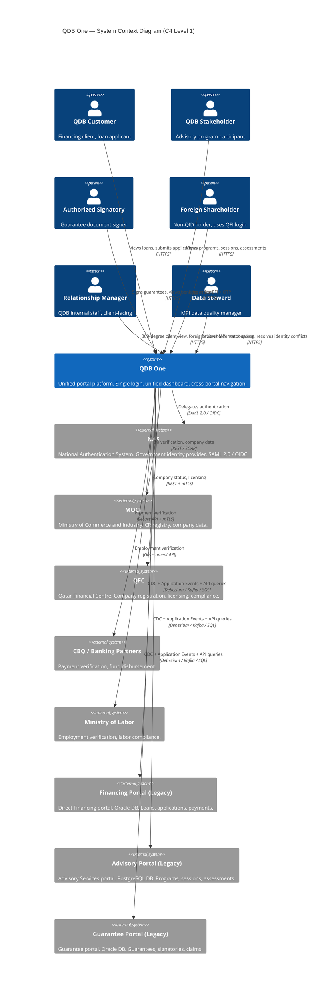

### System Boundary Summary

| Element | Type | Description |
|---------|------|-------------|
| QDB One | System under design | The unified portal platform |
| NAS | External system | National Authentication System — identity provider |
| MOCI | External system | Ministry of Commerce — CR registry |
| QFC | External system | Qatar Financial Centre — company licensing |
| CBQ | External system | Banking partners — payment verification |
| MOL | External system | Ministry of Labor — employment verification |
| Financing Portal | Existing system | Legacy Direct Financing portal and databases |
| Advisory Portal | Existing system | Legacy Advisory Services portal and databases |
| Guarantee Portal | Existing system | Legacy Guarantee portal and databases |

---

## 3. C4 Model — Container Diagram (Level 2)

This diagram shows all containers (deployable units) within QDB One and how they communicate.

```mermaid
C4Container
    title QDB One — Container Diagram (C4 Level 2)

    Person(user, "QDB User", "Any authenticated user")

    System_Boundary(qdb_one, "QDB One Platform") {

        Container(shell, "Shell Application", "React + Webpack Module Federation", "App shell: header, nav, persona switcher, search bar, notification bell")
        Container(web_bff, "Web BFF", "Next.js API Routes", "Session management, CSRF, response caching, GraphQL aggregation")
        Container(admin_bff, "Admin BFF", "Node.js + Express", "Full data access for internal staff, audit log access")

        Container(gql_gateway, "GraphQL Gateway", "Apollo Router / Cosmo", "Composes federated subgraphs into unified schema")
        Container(api_gateway, "API Gateway", "Kong Gateway", "Rate limiting, auth token validation, request routing, mTLS termination")

        Container(mpi_subgraph, "MPI Subgraph", "Node.js + GraphQL", "Person, Organization, Identity resolution queries/mutations")
        Container(fin_subgraph, "Financing Subgraph", "Node.js + GraphQL", "LoanApplication, Loan, Payment queries. Queries financing_core DB.")
        Container(guar_subgraph, "Guarantee Subgraph", "Node.js + GraphQL", "Guarantee, Signature, Claim, Collateral queries. Queries guarantee_main DB.")
        Container(adv_subgraph, "Advisory Subgraph", "Node.js + GraphQL", "Program, Session, Assessment queries. Queries advisory_main DB.")
        Container(dash_subgraph, "Dashboard Subgraph", "Node.js + GraphQL", "DashboardItem, ActionItem, ActivityFeed. Reads from Unified Read Store.")
        Container(notif_subgraph, "Notification Subgraph", "Node.js + GraphQL", "Notification queries. Reads from notification tables.")
        Container(doc_subgraph, "Document Subgraph", "Node.js + GraphQL", "Document queries. Proxies to portal document stores.")

        Container(keycloak, "Keycloak", "Keycloak 24+", "IAM: NAS delegation, QFI auth, session management, JWT issuance")
        Container(openfga, "OpenFGA", "OpenFGA 1.5+", "Authorization engine: ReBAC + RBAC. Person-Org-Role graph.")

        Container(mpi_service, "MPI Service", "Node.js / Java", "Master Person Index: matching, linking, golden record management")
        Container(mpi_db, "MPI Database", "PostgreSQL 16", "Person, Person_Identity, Organization, Person_Org_Role, match queue, merge history")

        Container(kafka, "Kafka Cluster", "Apache Kafka 3.7+", "Event mesh: CDC topics, application event topics, notification topics")
        Container(debezium, "Debezium Connect", "Debezium 2.5+", "CDC connectors for Oracle and PostgreSQL portal databases")
        Container(schema_registry, "Schema Registry", "Confluent / Apicurio", "Event schema versioning and compatibility checks")

        Container(mpi_enrichment, "MPI Enrichment Service", "Node.js / Kafka Streams", "Consumes CDC from identity tables, matches and updates MPI golden records")
        Container(dashboard_projection, "Dashboard Projection Service", "Node.js / Kafka Streams", "Consumes app events, builds materialized dashboard views in Read Store")
        Container(search_indexer, "Search Indexer", "Node.js / Kafka Streams", "Consumes events, updates OpenSearch index")
        Container(notification_router, "Notification Router", "Node.js", "Consumes portal events, generates notifications, pushes via WebSocket/FCM")

        Container(read_store, "Unified Read Store", "PostgreSQL 16", "Materialized views: person_summary, dashboard_items, activity_feed, notifications")
        Container(opensearch, "OpenSearch", "OpenSearch 2.x", "Full-text search with Arabic analyzer. Cross-portal search index.")
        Container(redis, "Redis Cache", "Redis 7+", "Session cache, hot data cache, rate limiting counters")
        Container(minio, "Object Storage", "MinIO (S3-compatible)", "Document storage for uploaded files")
        Container(vault, "HashiCorp Vault", "Vault 1.15+", "Secrets management: API keys, DB credentials, encryption keys")

        Container(audit_service, "Audit Service", "Node.js", "Tamper-evident audit trail with hash chain. Append-only. 7-year retention.")
        Container(audit_db, "Audit Database", "PostgreSQL 16", "Immutable audit log storage")

        Container(webhook_gw, "Webhook Gateway", "Node.js", "Receives webhooks from QFC, MOCI. HMAC verification, idempotency, DLQ.")

        Container(ws_server, "WebSocket Server", "Node.js + ws", "Real-time notification delivery to connected browser sessions")
    }

    System_Ext(nas, "NAS", "National Authentication System")
    System_Ext(moci, "MOCI", "CR Registry")
    System_Ext(qfc, "QFC", "Financial Centre")

    ContainerDb(fin_db, "financing_core", "Oracle", "Loans, applications, customers, payments")
    ContainerDb(fin_docs_db, "financing_docs", "Oracle", "Documents, attachments")
    ContainerDb(guar_db, "guarantee_main", "Oracle", "Guarantees, signatories")
    ContainerDb(guar_claims_db, "guarantee_claims", "Oracle", "Claims, collateral")
    ContainerDb(adv_db, "advisory_main", "PostgreSQL", "Programs, sessions, users")
    ContainerDb(adv_assess_db, "advisory_assess", "PostgreSQL", "Assessments, scores")
    ContainerDb(corp_crm, "corporate_crm", "Oracle", "Contacts, organizations")
    ContainerDb(moci_cache_db, "moci_cache", "PostgreSQL", "CR registry mirror")

    Rel(user, shell, "Uses", "HTTPS")
    Rel(shell, web_bff, "API calls", "HTTPS")
    Rel(web_bff, gql_gateway, "GraphQL queries", "HTTPS")
    Rel(web_bff, keycloak, "Auth flows", "OIDC")
    Rel(admin_bff, gql_gateway, "GraphQL queries", "HTTPS")

    Rel(gql_gateway, mpi_subgraph, "Federation", "HTTPS")
    Rel(gql_gateway, fin_subgraph, "Federation", "HTTPS")
    Rel(gql_gateway, guar_subgraph, "Federation", "HTTPS")
    Rel(gql_gateway, adv_subgraph, "Federation", "HTTPS")
    Rel(gql_gateway, dash_subgraph, "Federation", "HTTPS")
    Rel(gql_gateway, notif_subgraph, "Federation", "HTTPS")
    Rel(gql_gateway, doc_subgraph, "Federation", "HTTPS")

    Rel(mpi_subgraph, mpi_db, "Reads/Writes", "SQL")
    Rel(mpi_subgraph, openfga, "AuthZ check", "gRPC")
    Rel(fin_subgraph, fin_db, "Reads", "SQL/JDBC")
    Rel(guar_subgraph, guar_db, "Reads", "SQL/JDBC")
    Rel(adv_subgraph, adv_db, "Reads", "SQL")
    Rel(dash_subgraph, read_store, "Reads", "SQL")
    Rel(doc_subgraph, fin_docs_db, "Reads", "SQL/JDBC")
    Rel(doc_subgraph, minio, "Reads", "S3 API")

    Rel(keycloak, nas, "Delegates auth", "SAML 2.0 / OIDC")
    Rel(keycloak, mpi_service, "Post-login: QID to MPI lookup", "REST")
    Rel(mpi_service, mpi_db, "Reads/Writes", "SQL")

    Rel(debezium, fin_db, "CDC (LogMiner)", "Oracle CDC")
    Rel(debezium, guar_db, "CDC (LogMiner)", "Oracle CDC")
    Rel(debezium, adv_db, "CDC (pgoutput)", "PG Logical Replication")
    Rel(debezium, corp_crm, "CDC (LogMiner)", "Oracle CDC")
    Rel(debezium, kafka, "Publishes CDC events", "Kafka Producer")

    Rel(mpi_enrichment, kafka, "Consumes CDC events", "Kafka Consumer")
    Rel(mpi_enrichment, mpi_db, "Updates golden records", "SQL")
    Rel(dashboard_projection, kafka, "Consumes app events", "Kafka Consumer")
    Rel(dashboard_projection, read_store, "Writes materialized views", "SQL")
    Rel(search_indexer, kafka, "Consumes events", "Kafka Consumer")
    Rel(search_indexer, opensearch, "Indexes documents", "REST")
    Rel(notification_router, kafka, "Consumes events", "Kafka Consumer")
    Rel(notification_router, ws_server, "Pushes notifications", "Internal")
    Rel(ws_server, user, "Real-time notifications", "WebSocket")

    Rel(webhook_gw, kafka, "Publishes external events", "Kafka Producer")
    Rel(qfc, webhook_gw, "Sends webhooks", "HTTPS + HMAC")
    Rel(api_gateway, moci, "CR lookups", "REST/SOAP")
    Rel(api_gateway, moci_cache_db, "Cached CR data", "SQL")
```

### Container Inventory

| Container | Technology | Purpose | FR Coverage |
|-----------|-----------|---------|-------------|
| Shell Application | React + Webpack 5 MF | Unified UI shell, routing, persona switcher | FR-054, FR-055, FR-056, FR-057, FR-074, FR-094-098 |
| Web BFF | Next.js | Session, CSRF, aggregation for browser clients | NFR-019, NFR-020 |
| Admin BFF | Node.js + Express | Internal staff operations | FR-088-093 |
| GraphQL Gateway | Apollo Router / Cosmo | Federated schema composition | FR-032 (partial), all query routing |
| API Gateway | Kong | Rate limiting, token validation, mTLS | NFR-017, NFR-011 |
| MPI Subgraph | Node.js + GraphQL | Identity resolution queries | FR-014-028 |
| Financing Subgraph | Node.js + GraphQL | Loan/application queries | FR-035-041 |
| Guarantee Subgraph | Node.js + GraphQL | Guarantee/signature queries | FR-042-047 |
| Advisory Subgraph | Node.js + GraphQL | Program/session queries | FR-048-052 |
| Dashboard Subgraph | Node.js + GraphQL | Dashboard materialized views | FR-029-034 |
| Notification Subgraph | Node.js + GraphQL | Notification queries | FR-064-070 |
| Document Subgraph | Node.js + GraphQL | Cross-portal document access | FR-084-087 |
| Keycloak | Keycloak 24+ | Authentication (NAS + QFI) | FR-001-013 |
| OpenFGA | OpenFGA 1.5+ | Authorization (ReBAC + RBAC) | NFR-016, FR-080-083 |
| MPI Service | Node.js / Java | Identity matching + golden records | FR-014-028 |
| MPI Database | PostgreSQL 16 | MPI data store | FR-014, FR-023, FR-025 |
| Kafka Cluster | Apache Kafka 3.7+ | Event mesh | FR-099-102 |
| Debezium Connect | Debezium 2.5+ | CDC from portal DBs | FR-026, FR-099 |
| Schema Registry | Confluent / Apicurio | Event schema versioning | Schema evolution |
| MPI Enrichment Service | Node.js / Kafka Streams | CDC to MPI golden record updates | FR-026 |
| Dashboard Projection | Node.js / Kafka Streams | App events to read store | FR-032, FR-100, FR-103 |
| Search Indexer | Node.js / Kafka Streams | Events to OpenSearch | FR-058-063 |
| Notification Router | Node.js | Events to user notifications | FR-064-067 |
| Unified Read Store | PostgreSQL 16 | Materialized dashboard/search views | FR-032, FR-103, FR-104 |
| OpenSearch | OpenSearch 2.x | Full-text search with Arabic analyzer | FR-058-063 |
| Redis | Redis 7+ | Session cache, hot data, rate limits | NFR-017, performance |
| MinIO | MinIO (S3-compatible) | Document/attachment storage | FR-084-087 |
| Vault | HashiCorp Vault 1.15+ | Secrets management | NFR-014 |
| Audit Service | Node.js | Tamper-evident audit trail | NFR-023, FR-028, FR-091 |
| Audit Database | PostgreSQL 16 | Immutable audit log | NFR-023 |
| Webhook Gateway | Node.js | External webhook ingestion | QFC, MOCI webhooks |
| WebSocket Server | Node.js + ws | Real-time notification delivery | FR-066 |

---

## 4. C4 Model — Component Diagram (Level 3)

### 4.1 QDB One Hub — Internal Components

This diagram shows the internal structure of the Hub services.

```mermaid
C4Component
    title QDB One Hub — Component Diagram (C4 Level 3)

    Container_Boundary(hub, "QDB One Hub") {

        Component(auth_controller, "Auth Controller", "REST API", "Login initiation, NAS callback, QFI login, token refresh, session management")
        Component(qfi_service, "QFI Service", "Service", "QDB Foreign ID lifecycle: creation, OTP generation, passport verification, account locking")
        Component(session_manager, "Session Manager", "Service", "JWT issuance, session extension, expiry warning, step-up auth triggers")
        Component(keycloak_adapter, "Keycloak Adapter", "OIDC Client", "Communicates with Keycloak for NAS delegation, token exchange")

        Component(mpi_match_engine, "MPI Match Engine", "Service", "Deterministic matching (QID/CR/NAS), semi-deterministic (email+name), probabilistic (Arabic fuzzy)")
        Component(mpi_arabic_matcher, "Arabic Name Matcher", "Library", "Transliteration normalization, Levenshtein distance, phonetic matching for Arabic names")
        Component(mpi_golden_record, "Golden Record Manager", "Service", "Survivorship rules, merge execution, merge history tracking")
        Component(mpi_review_queue, "Review Queue Manager", "Service", "Pending match management, Data Steward workflow, decision recording")
        Component(mpi_cdc_consumer, "CDC Consumer", "Kafka Consumer", "Consumes CDC events from Tier 1 identity tables, feeds Match Engine")
        Component(mpi_api, "MPI API", "REST + GraphQL", "CRUD for Person, Organization, PersonIdentity, PersonOrgRole. Search. Golden record retrieval.")

        Component(authz_engine, "AuthZ Engine", "OpenFGA Client", "Wraps OpenFGA: check, write, read tuples. Caches hot paths in Redis.")
        Component(authz_sync, "AuthZ Sync", "Service", "Syncs MPI Person-Org-Role changes to OpenFGA tuples")

        Component(event_router, "Event Router", "Kafka Consumer/Producer", "Routes incoming events (CDC + app) to appropriate processors")
        Component(dash_projector, "Dashboard Projector", "Kafka Consumer", "Builds person_dashboard_items, activity_feed from portal events")
        Component(search_projector, "Search Projector", "Kafka Consumer", "Indexes entities into OpenSearch with Arabic analyzer")
        Component(notif_generator, "Notification Generator", "Kafka Consumer", "Generates notifications from portal events, identifies recipients via MPI")
        Component(notif_delivery, "Notification Delivery", "Service", "WebSocket push for online users, FCM for offline, email fallback")
        Component(notif_preferences, "Preference Engine", "Service", "Filters notifications per user preferences (per-portal, per-type)")

        Component(audit_writer, "Audit Writer", "Service", "Appends audit events with hash chain. Immutable. Validates tamper-evidence.")
        Component(audit_query, "Audit Query API", "REST", "Searchable audit log: by person, action type, time range, portal")

        Component(webhook_receiver, "Webhook Receiver", "REST API", "HMAC-SHA256 verification, idempotency dedup, schema validation")
        Component(webhook_processor, "Webhook Processor", "Kafka Consumer", "Processes validated webhooks from QFC, MOCI, banking partners")

        Component(moci_adapter, "MOCI Adapter", "Service", "CR verification, company status lookup, QID-to-CR mapping. Cache in moci_cache.")
        Component(qfc_adapter, "QFC Adapter", "Service", "Company registration status, licensing, compliance flag checks. mTLS.")
    }
```

### 4.2 Financing Spoke — Internal Components

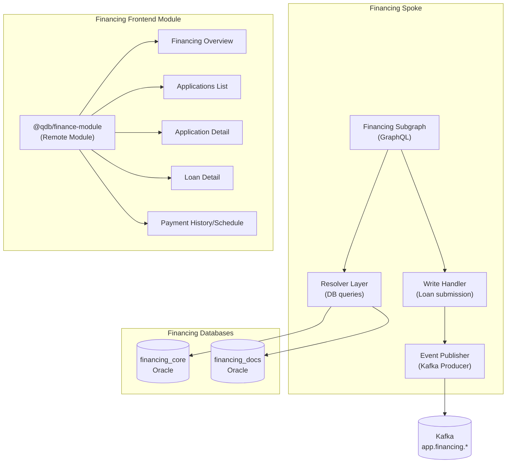

### 4.3 Guarantee Spoke — Internal Components

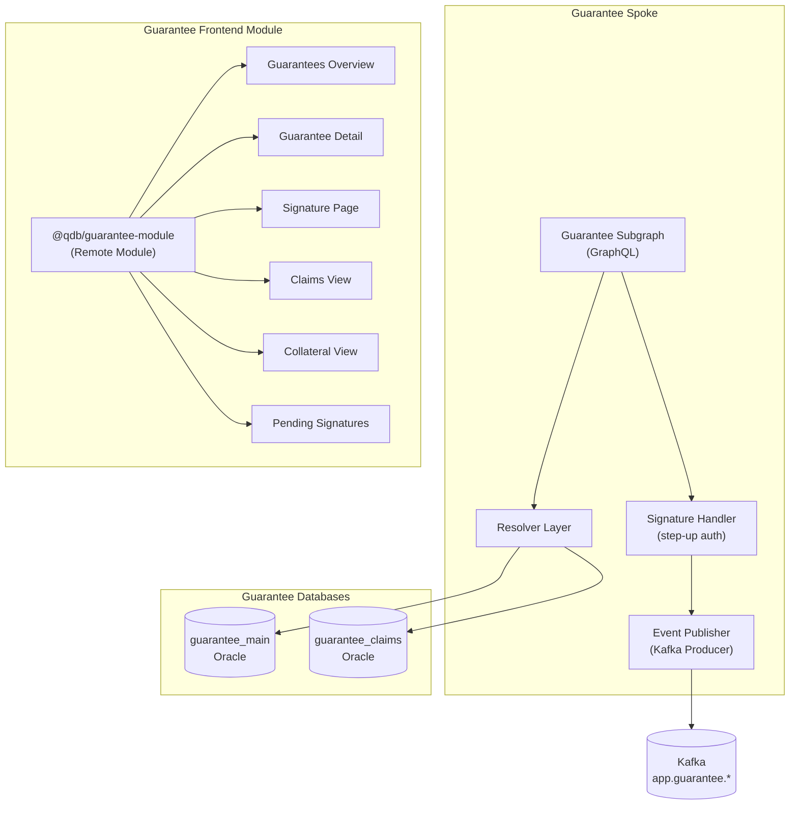

### 4.4 Advisory Spoke — Internal Components

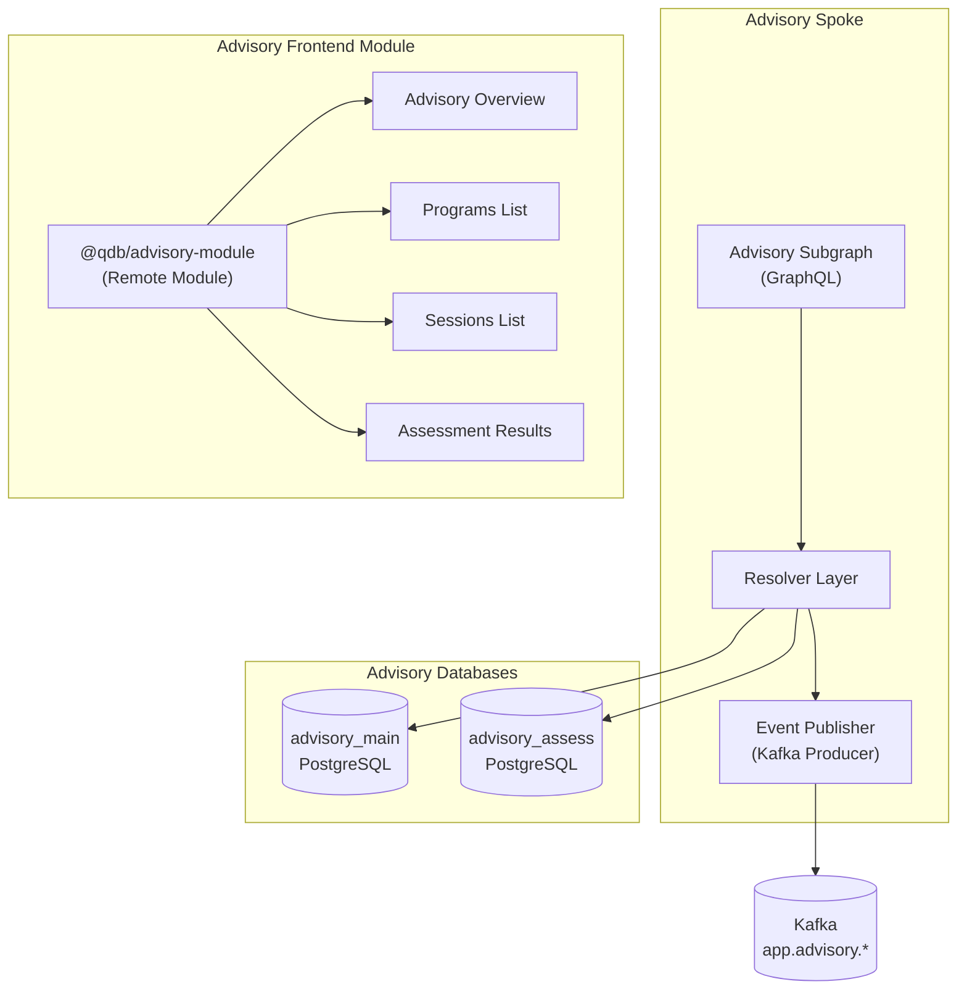

---

## 5. Data Flow Diagrams

### 5.1 Login Flow (NAS -> Keycloak -> MPI -> Session)

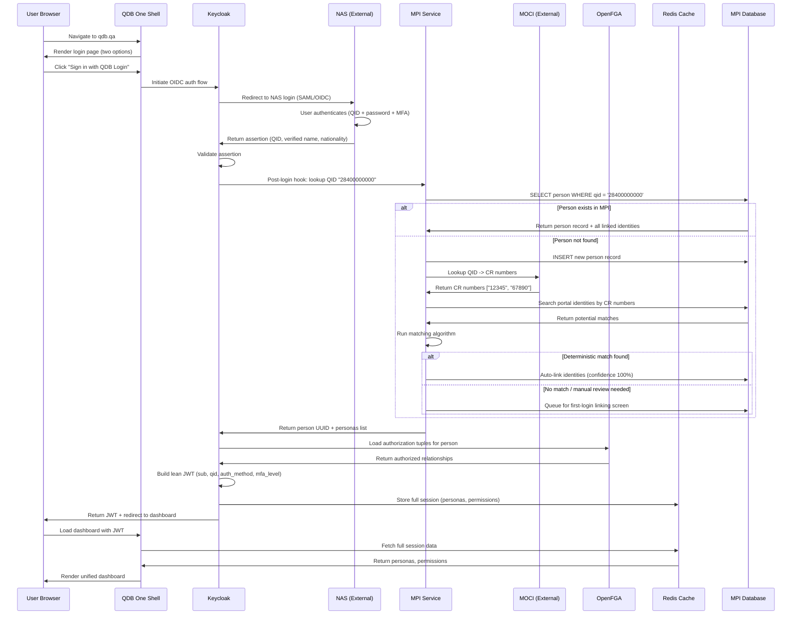

### 5.2 Foreign Shareholder Login Flow

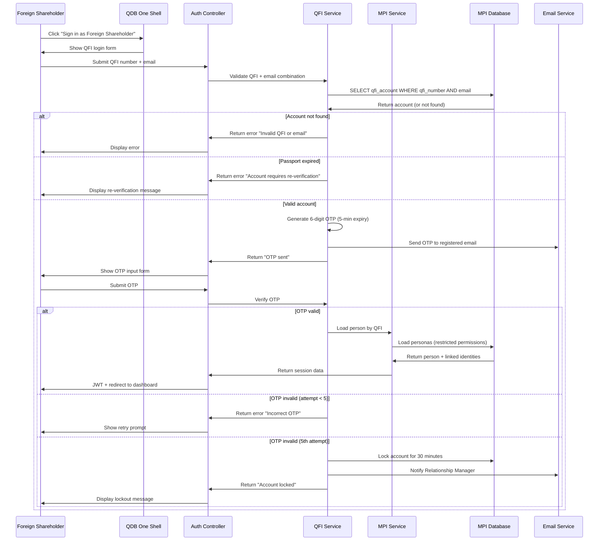

### 5.3 Dashboard Load Flow (Browser -> BFF -> GraphQL -> Read Store)

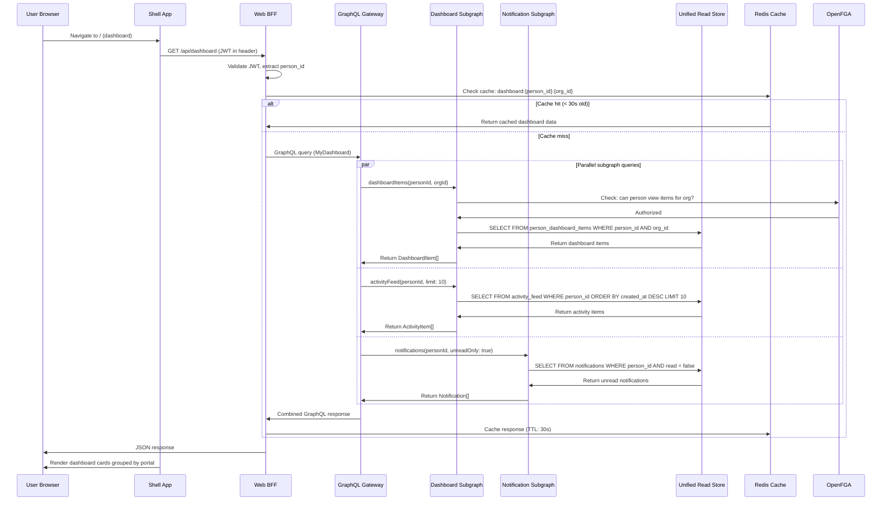

### 5.4 Cross-Portal Write Flow (Loan Application Submission)

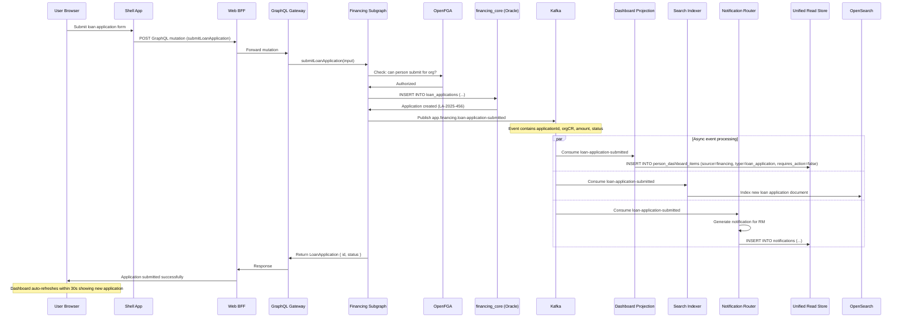

### 5.5 CDC Pipeline Flow (Portal DB -> Debezium -> Kafka -> MPI/Read Store)

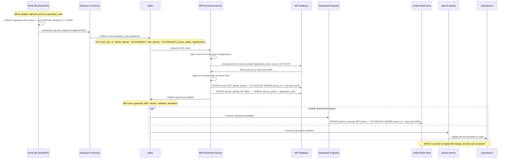

### 5.6 Notification Flow (Portal Event -> Kafka -> Notification Service -> WebSocket/Push)

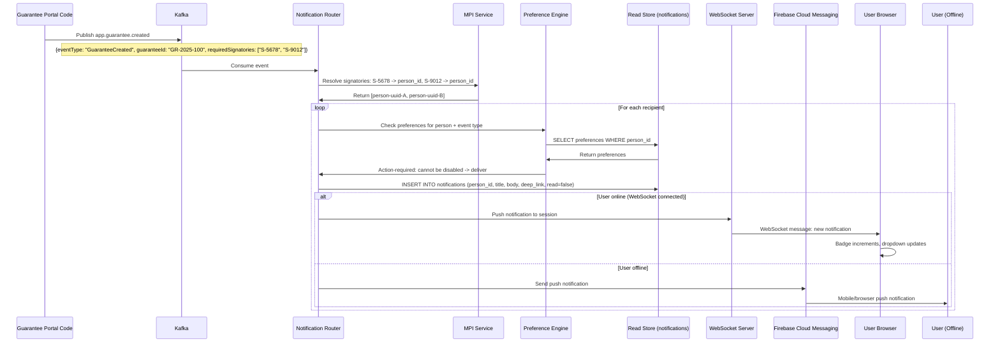

---

## 6. Infrastructure Diagram

### 6.1 Deployment Topology

All infrastructure is deployed on-premise in Qatar (QDB data center or Qatar-based private cloud) to comply with data sovereignty requirements (NFR-022).

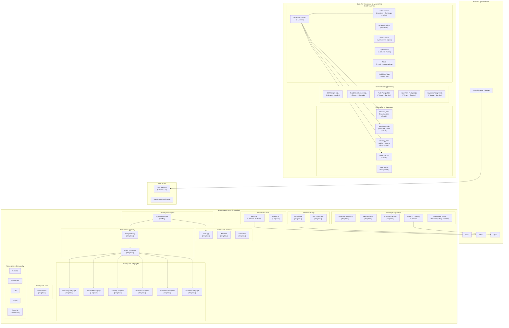

### 6.2 Network Security Zones

| Zone | Contains | Inbound From | Outbound To |
|------|----------|--------------|-------------|
| DMZ | Load Balancer, WAF | Internet (HTTPS 443 only) | Application Zone |
| Application Zone | Kubernetes cluster (all namespaces) | DMZ (via Ingress) | Data Zone, Integration Zone |
| Data Zone | All databases, Kafka, Redis, OpenSearch, MinIO | Application Zone only | None (no outbound) |
| Integration Zone | Webhook Gateway, MOCI/QFC adapters | Application Zone, External APIs | External APIs (NAS, MOCI, QFC, CBQ, MOL) |
| Management Zone | Vault, Grafana, CI/CD runners | Admin VPN only | All zones (monitoring) |

---

## 7. Technology Stack Matrix

| Component | Technology | Version | License | Justification |
|-----------|-----------|---------|---------|---------------|
| **Identity Provider** | Keycloak | 24+ | Apache 2.0 | Proven IAM platform; NAS delegation via standard SAML/OIDC. Avoids building custom auth. (FR-001-013) |
| **Authorization Engine** | OpenFGA | 1.5+ | Apache 2.0 | Zanzibar-style ReBAC models person-org-role relationships naturally. CNCF project. (NFR-016) |
| **API Gateway** | Kong Gateway | 3.x | Apache 2.0 / Enterprise | Rate limiting, mTLS termination, plugin ecosystem. (NFR-017) |
| **GraphQL Federation** | Apollo Router or Cosmo | Latest | Elastic License / Apache 2.0 | Composes subgraphs into unified schema. Cross-portal queries become natural. (FR-032) |
| **Event Bus** | Apache Kafka | 3.7+ | Apache 2.0 | Durable, ordered, replayable event mesh. Handles CDC + app events from 10+ databases. (FR-099-102) |
| **CDC Platform** | Debezium | 2.5+ | Apache 2.0 | Connectors for Oracle (LogMiner) and PostgreSQL (pgoutput). (FR-026, FR-099) |
| **Schema Registry** | Confluent / Apicurio | Latest | Community / Apache 2.0 | Event schema versioning, compatibility checks. Prevents breaking consumers. |
| **MPI Database** | PostgreSQL | 16+ | PostgreSQL License | JSONB for flexible merge_history. Full-text search. Mature. (FR-014) |
| **Unified Read Store** | PostgreSQL | 16+ | PostgreSQL License | JSONB for portal-specific metadata. Consistent with PG expertise. (FR-103, FR-104) |
| **Audit Database** | PostgreSQL | 16+ | PostgreSQL License | Append-only tables with hash chain. 7-year retention. (NFR-023) |
| **Search Engine** | OpenSearch | 2.x | Apache 2.0 | Full-text search with Arabic analyzer. Dashboard for ops. (FR-058-063) |
| **Cache** | Redis | 7+ | BSD-3 / SSPL | Session cache, hot data, rate limiting counters. (NFR-017, performance) |
| **Object Storage** | MinIO | Latest | AGPL | S3-compatible. On-premise document storage. (FR-084-087) |
| **Secrets Management** | HashiCorp Vault | 1.15+ | BSL / Enterprise | Centralized secrets. HSM integration for key management. (NFR-014, NFR-015) |
| **Frontend Framework** | Next.js (React 18+) | 14+ | MIT | SSR capability, API routes for BFF, React ecosystem. (FR-074, FR-094-098) |
| **Module Federation** | Webpack | 5+ | MIT | Independent deployment per portal module. Shared shell. (FR-054-057) |
| **UI Components** | Custom Design System | -- | Internal | QDB branding, Arabic/RTL, WCAG 2.1 AA. Cannot use off-the-shelf. (NFR-036-040) |
| **WebSocket** | Node.js + ws | Latest | MIT | Real-time notification delivery. (FR-066) |
| **Logging** | Grafana Loki | 3.x | AGPL | Structured log aggregation. Pairs with Grafana dashboards. (NFR-041) |
| **Metrics** | Prometheus + Grafana | Latest | Apache 2.0 | Metrics collection and visualization. Alerting. (NFR-041-044) |
| **Tracing** | Grafana Tempo | Latest | AGPL | Distributed tracing with OpenTelemetry. (NFR-042) |
| **Tracing SDK** | OpenTelemetry | Latest | Apache 2.0 | Vendor-neutral instrumentation. traceparent header propagation. (NFR-042) |
| **Log Shipper** | Fluent Bit | Latest | Apache 2.0 | Lightweight log collection as DaemonSet. (NFR-041) |
| **Container Orchestration** | Kubernetes | 1.29+ | Apache 2.0 | Industry standard for container orchestration. On-premise deployment. |
| **CI/CD** | GitHub Actions or Jenkins | Latest | -- | Automated build, test, deploy pipelines. |
| **Container Runtime** | containerd | Latest | Apache 2.0 | Kubernetes-native container runtime. |
| **Ingress Controller** | NGINX Ingress | Latest | Apache 2.0 | TLS termination, path-based routing. |

---

## 8. Traceability Matrix

### 8.1 Functional Requirements to Architecture Components

| FR ID | Requirement Summary | Architecture Component(s) |
|-------|---------------------|---------------------------|
| FR-001 | Consolidated login page (NAS) | Keycloak, Auth Controller, Shell App |
| FR-002 | QFI authentication (email OTP) | QFI Service, Auth Controller |
| FR-003 | NAS delegation via SAML/OIDC | Keycloak Adapter, NAS integration |
| FR-004 | JWT session token issuance | Session Manager, Keycloak, Redis |
| FR-005 | Session expiry (60 min inactivity) | Session Manager, Redis |
| FR-006 | Session expiry warning (5 min) | Shell App (frontend), Session Manager |
| FR-007 | Session extension without re-auth | Session Manager, Keycloak |
| FR-008 | Step-up authentication for sensitive ops | Keycloak, NAS (acr_values) |
| FR-009 | QFI lockout after 5 OTP failures | QFI Service |
| FR-010 | RM notification on QFI lockout | Notification Router, QFI Service |
| FR-011 | Block QFI login on expired passport | QFI Service |
| FR-012 | NAS MFA level support | Keycloak, Session Manager |
| FR-013 | NAS unavailable fallback message | Auth Controller (circuit breaker) |
| FR-014 | MPI entities (Person, Org, etc.) | MPI Service, MPI Database |
| FR-015 | Deterministic matching on QID | MPI Match Engine |
| FR-016 | Deterministic matching on CR | MPI Match Engine |
| FR-017 | Deterministic matching on NAS ID | MPI Match Engine |
| FR-018 | Semi-deterministic email+name match | MPI Match Engine |
| FR-019 | Fuzzy Arabic name matching | Arabic Name Matcher |
| FR-020 | Manual review queue (70-85%) | Review Queue Manager |
| FR-021 | Auto-link above 95% | MPI Match Engine |
| FR-022 | Golden record survivorship rules | Golden Record Manager |
| FR-023 | Merge history tracking | Golden Record Manager, MPI Database |
| FR-024 | Arabic transliteration handling | Arabic Name Matcher |
| FR-025 | Canonical Arabic form storage | Golden Record Manager, MPI Database |
| FR-026 | CDC from Tier 1 (< 5s) | Debezium, MPI CDC Consumer, Kafka |
| FR-027 | Data Steward review interface | Admin BFF, Review Queue Manager |
| FR-028 | Steward decision audit logging | Review Queue Manager, Audit Service |
| FR-029 | Unified dashboard (all portals) | Dashboard Subgraph, Shell App, Read Store |
| FR-030 | "Requires Your Action" section | Dashboard Subgraph, Read Store (requires_action) |
| FR-031 | Activity timeline | Dashboard Subgraph, Read Store (activity_feed) |
| FR-032 | Dashboard from Unified Read Store | Dashboard Subgraph, Dashboard Projection, Read Store |
| FR-033 | "Last updated" stale data indicator | Dashboard Subgraph, Shell App |
| FR-034 | Hide empty portal sections | Shell App (frontend logic) |
| FR-035 | Active loans display | Financing Subgraph, financing_core |
| FR-036 | Loan applications display | Financing Subgraph, financing_core |
| FR-037 | Loan application with MPI pre-pop | Financing Subgraph, MPI Subgraph |
| FR-038 | Draft application persistence | Financing Subgraph, financing_core |
| FR-039 | LoanApplicationSubmitted event | Financing Subgraph, Kafka |
| FR-040 | Payment history display | Financing Subgraph, financing_core |
| FR-041 | Overdue payment badge | Financing Subgraph, Dashboard Projection |
| FR-042 | Guarantees display | Guarantee Subgraph, guarantee_main |
| FR-043 | Digital signature with step-up | Guarantee Subgraph, Keycloak (step-up) |
| FR-044 | Signature audit trail | Guarantee Subgraph, Audit Service |
| FR-045 | QFI signing restriction | Guarantee Subgraph, OpenFGA |
| FR-046 | Pending signatures badge | Guarantee Subgraph, Dashboard Projection |
| FR-047 | Claims display | Guarantee Subgraph, guarantee_claims |
| FR-048 | Advisory programs display | Advisory Subgraph, advisory_main |
| FR-049 | Advisory sessions display | Advisory Subgraph, advisory_main |
| FR-050 | Session cancellation | Advisory Subgraph, advisory_main |
| FR-051 | Assessment results display | Advisory Subgraph, advisory_assess |
| FR-052 | Advisory-to-financing linking | Advisory Subgraph, Shell navigation |
| FR-053 | Related items cross-portal | All Subgraphs, Read Store (cross-references) |
| FR-054 | Client-side cross-portal nav | Shell App (Module Federation) |
| FR-055 | Cross-portal breadcrumbs | Shell App (@qdb/navigation) |
| FR-056 | Browser back/forward preserved | Shell App (History API) |
| FR-057 | Deep-linkable URLs | Shell App (unified routing) |
| FR-058 | Global search bar | Shell App, Search Indexer, OpenSearch |
| FR-059 | Grouped search results | OpenSearch (category field), Shell App |
| FR-060 | Portal badge on search results | OpenSearch (source_portal field) |
| FR-061 | Arabic search queries | OpenSearch (Arabic analyzer) |
| FR-062 | Search filters | OpenSearch (faceted search) |
| FR-063 | Search debounce (500ms) | Shell App (frontend) |
| FR-064 | Unified notification inbox | Notification Subgraph, Notification Router |
| FR-065 | Unread count badge | Shell App, Notification Subgraph |
| FR-066 | Real-time WebSocket notifications | WebSocket Server, Notification Router |
| FR-067 | Notification deep-links | Notification Router (deep_link field) |
| FR-068 | Mark all as read | Notification Subgraph |
| FR-069 | Notification preferences | Preference Engine, Notification Subgraph |
| FR-070 | FCM push (offline) | Notification Router, FCM |
| FR-071 | Golden record on profile | MPI Subgraph, Shell App |
| FR-072 | Edit non-govt fields (OTP) | MPI Subgraph, MPI Service |
| FR-073 | Profile change propagation (5 min) | MPI Service, Kafka (mpi.person.updated) |
| FR-074 | AR/EN language switch (no reload) | Shell App, Design System |
| FR-075 | Language preference persistence | Shell App, Redis/Read Store |
| FR-076 | Linked accounts display | MPI Subgraph |
| FR-077 | Manual account linking (OTP) | MPI Service, Auth Controller |
| FR-078 | PDPPL "My Data" section | MPI Subgraph, Audit Service |
| FR-079 | Consent management | MPI Service, Audit Service |
| FR-080 | All roles for active company | Shell App, OpenFGA |
| FR-081 | Company context switching | Shell App (@qdb/shared-state) |
| FR-082 | Badge refresh on company switch | Shell App, Dashboard Subgraph |
| FR-083 | Redirect on irrelevant page | Shell App (routing logic) |
| FR-084 | Unified Document Center | Document Subgraph |
| FR-085 | Document filtering | Document Subgraph |
| FR-086 | Document download | Document Subgraph, MinIO |
| FR-087 | Document upload | Document Subgraph, MinIO, Kafka |
| FR-088 | 360-degree client view (RM) | Admin BFF, MPI Subgraph, all portal subgraphs |
| FR-089 | Foreign shareholder onboarding | Admin BFF, QFI Service, MPI Service |
| FR-090 | MPI review queue (Data Steward) | Admin BFF, Review Queue Manager |
| FR-091 | Searchable audit log | Admin BFF, Audit Query API |
| FR-092 | System health dashboard | Admin BFF, Prometheus, Grafana |
| FR-093 | Dead letter queue viewer | Admin BFF, Kafka DLQ |
| FR-094 | Arabic RTL layout | Shell App, Design System (CSS logical properties) |
| FR-095 | CSS logical properties | Design System |
| FR-096 | Arabic-Indic numerals | Design System, Shell App |
| FR-097 | Hijri calendar | Design System, Shell App |
| FR-098 | Bidirectional text | Design System |
| FR-099 | Tier 1 CDC (< 5s) | Debezium, Kafka, MPI Enrichment |
| FR-100 | Tier 2 app events (< 30s) | Portal event publishers, Kafka, Dashboard Projection |
| FR-101 | Tier 3 API on-demand | Portal subgraphs (direct DB query) |
| FR-102 | Tier 4 batch sync | Batch jobs, moci_cache |
| FR-103 | Unified Read Store | Read Store PostgreSQL, Dashboard Projection |
| FR-104 | JSONB for portal metadata | Read Store schema design |
| FR-105 | Wave 1 bulk matching | MPI Match Engine (batch mode) |
| FR-106 | Wave 2 first-login linking | MPI Service, Keycloak post-login hook |
| FR-107 | Wave 3 manual linking | MPI Service, Shell App (Settings) |
| FR-108 | Parallel legacy login | Keycloak (legacy IDPs), DNS routing |
| FR-109 | "Switch to QDB Login" banner | Legacy portals (frontend change) |
| FR-110 | Disable legacy new sessions | Keycloak IDP configuration |
| FR-111 | Decommission legacy endpoints | Infrastructure (DNS, proxy) |

### 8.2 Site Map Routes to Frontend Modules

| Route Pattern | Frontend Module | Loaded |
|---------------|----------------|--------|
| `/auth/*` | Shell App (built-in) | Eager |
| `/` | @qdb/dashboard-module | Prefetch |
| `/financing/*` | @qdb/finance-module | Prefetch (if user has financing persona) |
| `/guarantees/*` | @qdb/guarantee-module | Lazy |
| `/advisory/*` | @qdb/advisory-module | Lazy |
| `/documents/*` | @qdb/documents-module | Lazy |
| `/notifications/*` | Shell App (built-in) | Eager |
| `/profile/*` | @qdb/profile-module | Lazy |
| `/admin/*` | @qdb/admin-module | Lazy (separate deploy) |
| `/404`, `/403`, `/500`, `/offline`, `/module-error` | Shell App (built-in) | Eager |

---

## Appendix A: Key Terminology

| Term | Definition |
|------|-----------|
| Hub | QDB One shared platform services (MPI, Auth, AuthZ, Gateway, Event Pipeline) |
| Spoke | A portal integration unit (subgraph + DB + frontend module) |
| Golden Record | The single authoritative record for a person/org in the MPI |
| Read Store | PostgreSQL database with materialized views for dashboard and search |
| BFF | Backend For Frontend — an API layer tailored to a specific client type |
| Subgraph | A GraphQL service that owns a portion of the federated schema |
| CDC | Change Data Capture — capturing DB changes via transaction log reading |
| CQRS | Command Query Responsibility Segregation — separate read and write models |
