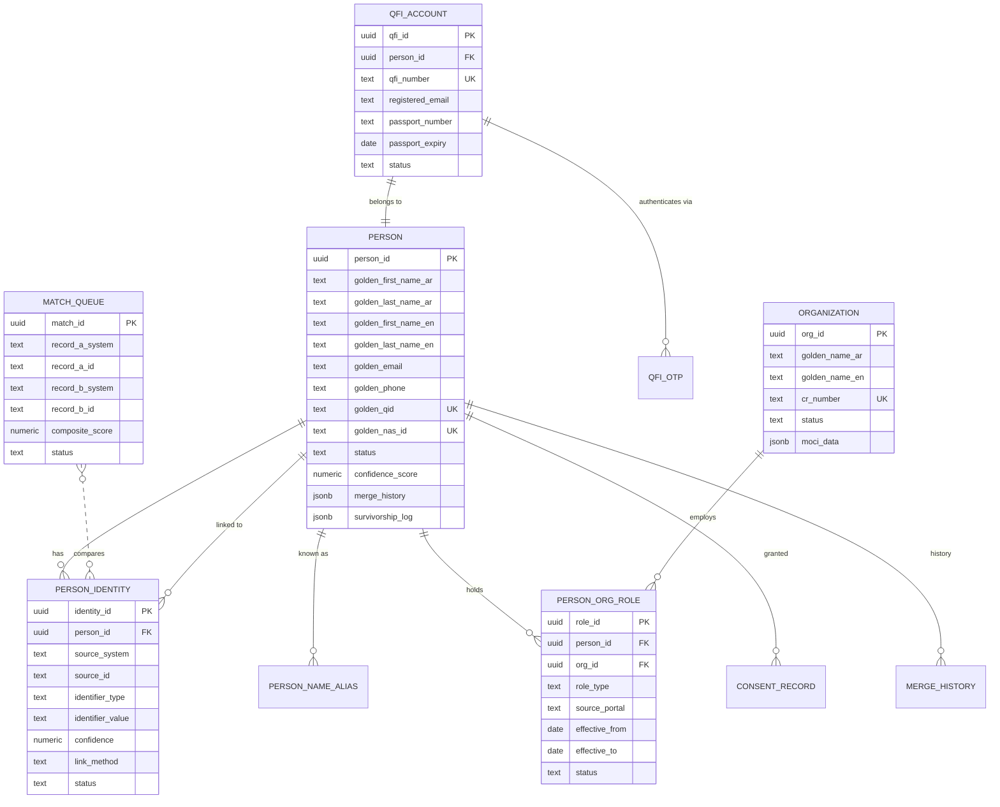

# QDB One: Data Model

**Version**: 1.0
**Date**: February 15, 2026
**Classification**: Confidential - Internal Use Only

---

## Table of Contents

1. [MPI Database Schema](#1-mpi-database-schema)
2. [Unified Read Store Schema](#2-unified-read-store-schema)
3. [Auth / Session Store](#3-auth--session-store)
4. [OpenFGA Authorization Model](#4-openfga-authorization-model)
5. [Event Schemas](#5-event-schemas)

---

## 1. MPI Database Schema

**Database**: `qdb_mpi` (PostgreSQL 16)
**Purpose**: Master Person Index — the single source of truth for identity across all portals.

### 1.1 Core Identity Tables

```sql
-- =============================================================
-- PERSON: The golden record for every individual
-- =============================================================
CREATE TABLE person (
    person_id           UUID PRIMARY KEY DEFAULT gen_random_uuid(),
    golden_first_name_ar TEXT,           -- Canonical Arabic given name
    golden_last_name_ar  TEXT,           -- Canonical Arabic family name
    golden_first_name_en TEXT,           -- English given name (best available)
    golden_last_name_en  TEXT,           -- English family name (best available)
    golden_email         TEXT,           -- Most recently verified email
    golden_phone         TEXT,           -- Most recently verified phone
    golden_qid           TEXT UNIQUE,    -- Qatar ID (encrypted at application level)
    golden_nas_id        TEXT UNIQUE,    -- NAS identifier (encrypted)
    nationality          TEXT,
    date_of_birth        DATE,
    gender               TEXT CHECK (gender IN ('male', 'female', 'unspecified')),
    status               TEXT NOT NULL DEFAULT 'active'
                         CHECK (status IN ('active', 'inactive', 'merged', 'suspended')),
    confidence_score     NUMERIC(5,2),   -- Overall golden record confidence (0-100)
    merge_history        JSONB NOT NULL DEFAULT '[]'::jsonb,
                         -- Array of {merged_from, merged_at, fields_from_source, steward_id}
    survivorship_log     JSONB NOT NULL DEFAULT '{}'::jsonb,
                         -- Per-field: {field: {source_system, source_id, verified_at, method}}
    created_at           TIMESTAMPTZ NOT NULL DEFAULT now(),
    updated_at           TIMESTAMPTZ NOT NULL DEFAULT now(),
    created_by           TEXT NOT NULL DEFAULT 'system',
    updated_by           TEXT NOT NULL DEFAULT 'system'
);

CREATE INDEX idx_person_qid ON person (golden_qid) WHERE golden_qid IS NOT NULL;
CREATE INDEX idx_person_nas_id ON person (golden_nas_id) WHERE golden_nas_id IS NOT NULL;
CREATE INDEX idx_person_email ON person (golden_email) WHERE golden_email IS NOT NULL;
CREATE INDEX idx_person_phone ON person (golden_phone) WHERE golden_phone IS NOT NULL;
CREATE INDEX idx_person_name_en ON person (golden_last_name_en, golden_first_name_en);
CREATE INDEX idx_person_status ON person (status);

-- =============================================================
-- PERSON_IDENTITY: Every portal-specific identity linked to a person
-- =============================================================
CREATE TABLE person_identity (
    identity_id          UUID PRIMARY KEY DEFAULT gen_random_uuid(),
    person_id            UUID NOT NULL REFERENCES person(person_id),
    source_system        TEXT NOT NULL,
                         -- 'financing_core', 'guarantee_main', 'advisory_main',
                         -- 'corporate_crm', 'qdb_one'
    source_id            TEXT NOT NULL,
                         -- The primary key in the source system (customer_id, signatory_id, etc.)
    identifier_type      TEXT NOT NULL,
                         -- 'qid', 'nas_id', 'cr_number', 'email', 'phone',
                         -- 'qfi_number', 'passport_number'
    identifier_value     TEXT NOT NULL,
                         -- The actual identifier value (encrypted for PII)
    confidence           NUMERIC(5,2) NOT NULL DEFAULT 100.00,
                         -- Confidence of this identity link (100 = deterministic)
    link_method          TEXT NOT NULL DEFAULT 'system',
                         -- 'deterministic', 'semi_deterministic', 'probabilistic',
                         -- 'manual_steward', 'user_confirmed', 'system'
    linked_at            TIMESTAMPTZ NOT NULL DEFAULT now(),
    linked_by            TEXT NOT NULL DEFAULT 'system',
                         -- 'system', 'steward:{steward_id}', 'user:{person_id}'
    verified_at          TIMESTAMPTZ,
    verification_method  TEXT,
                         -- 'nas_assertion', 'otp_email', 'otp_sms', 'steward_review',
                         -- 'passport_kyc', 'moci_lookup'
    raw_data             JSONB,
                         -- Original source record snapshot at time of linking
    status               TEXT NOT NULL DEFAULT 'active'
                         CHECK (status IN ('active', 'inactive', 'unlinked', 'disputed')),
    created_at           TIMESTAMPTZ NOT NULL DEFAULT now(),
    updated_at           TIMESTAMPTZ NOT NULL DEFAULT now(),

    UNIQUE (source_system, source_id, identifier_type)
);

CREATE INDEX idx_pi_person ON person_identity (person_id);
CREATE INDEX idx_pi_source ON person_identity (source_system, source_id);
CREATE INDEX idx_pi_identifier ON person_identity (identifier_type, identifier_value);
CREATE INDEX idx_pi_status ON person_identity (status);

-- =============================================================
-- PERSON_NAME_ALIAS: All name variants for a person (Arabic transliterations)
-- =============================================================
CREATE TABLE person_name_alias (
    alias_id             UUID PRIMARY KEY DEFAULT gen_random_uuid(),
    person_id            UUID NOT NULL REFERENCES person(person_id),
    name_ar              TEXT,           -- Arabic form
    name_en              TEXT,           -- English transliteration
    source_system        TEXT NOT NULL,
    is_canonical         BOOLEAN NOT NULL DEFAULT false,
    created_at           TIMESTAMPTZ NOT NULL DEFAULT now()
);

CREATE INDEX idx_pna_person ON person_name_alias (person_id);
CREATE INDEX idx_pna_name_en ON person_name_alias (name_en);
CREATE INDEX idx_pna_name_ar ON person_name_alias (name_ar);

-- =============================================================
-- ORGANIZATION: Golden record for every company/entity
-- =============================================================
CREATE TABLE organization (
    org_id               UUID PRIMARY KEY DEFAULT gen_random_uuid(),
    golden_name_ar       TEXT,
    golden_name_en       TEXT,
    cr_number            TEXT UNIQUE,    -- Commercial Registration number (from MOCI)
    trade_license_number TEXT,
    establishment_date   DATE,
    industry_code        TEXT,
    legal_form           TEXT,           -- LLC, WLL, QSC, Branch, etc.
    status               TEXT NOT NULL DEFAULT 'active'
                         CHECK (status IN ('active', 'inactive', 'dissolved', 'suspended')),
    registered_address   JSONB,
                         -- {street, city, zone, po_box, country}
    moci_data            JSONB,          -- Cached MOCI registry data
    moci_last_synced     TIMESTAMPTZ,
    merge_history        JSONB NOT NULL DEFAULT '[]'::jsonb,
    created_at           TIMESTAMPTZ NOT NULL DEFAULT now(),
    updated_at           TIMESTAMPTZ NOT NULL DEFAULT now()
);

CREATE INDEX idx_org_cr ON organization (cr_number) WHERE cr_number IS NOT NULL;
CREATE INDEX idx_org_name_en ON organization (golden_name_en);
CREATE INDEX idx_org_status ON organization (status);

-- =============================================================
-- PERSON_ORG_ROLE: The person-organization-role relationship
-- =============================================================
CREATE TABLE person_org_role (
    role_id              UUID PRIMARY KEY DEFAULT gen_random_uuid(),
    person_id            UUID NOT NULL REFERENCES person(person_id),
    org_id               UUID NOT NULL REFERENCES organization(org_id),
    role_type            TEXT NOT NULL,
                         -- 'customer', 'stakeholder', 'authorized_signatory',
                         -- 'guarantor', 'authorized_representative', 'shareholder',
                         -- 'financial_controller', 'employee', 'owner', 'viewer'
    source_portal        TEXT NOT NULL,
                         -- 'direct_financing', 'advisory', 'guarantee', 'corporate_crm'
    source_record_id     TEXT,           -- FK to the source portal record
    effective_from       DATE NOT NULL DEFAULT CURRENT_DATE,
    effective_to         DATE,           -- NULL = currently active
    status               TEXT NOT NULL DEFAULT 'active'
                         CHECK (status IN ('active', 'inactive', 'pending', 'revoked')),
    granted_by           TEXT,           -- Who granted this role (person_id or 'system')
    grant_reference      TEXT,           -- Board resolution, delegation document ref
    metadata             JSONB,          -- Portal-specific extra data
    created_at           TIMESTAMPTZ NOT NULL DEFAULT now(),
    updated_at           TIMESTAMPTZ NOT NULL DEFAULT now(),

    UNIQUE (person_id, org_id, role_type, source_portal)
);

CREATE INDEX idx_por_person ON person_org_role (person_id);
CREATE INDEX idx_por_org ON person_org_role (org_id);
CREATE INDEX idx_por_role ON person_org_role (role_type);
CREATE INDEX idx_por_active ON person_org_role (person_id, status) WHERE status = 'active';
```

### 1.2 Matching and Review Tables

```sql
-- =============================================================
-- MATCH_QUEUE: Pending matches awaiting review
-- =============================================================
CREATE TABLE match_queue (
    match_id             UUID PRIMARY KEY DEFAULT gen_random_uuid(),
    record_a_system      TEXT NOT NULL,
    record_a_id          TEXT NOT NULL,
    record_a_snapshot    JSONB NOT NULL,  -- Snapshot of record A at time of matching
    record_b_system      TEXT NOT NULL,
    record_b_id          TEXT NOT NULL,
    record_b_snapshot    JSONB NOT NULL,  -- Snapshot of record B at time of matching
    composite_score      NUMERIC(5,2) NOT NULL,
    score_breakdown      JSONB NOT NULL,
                         -- {qid_match: 0, cr_match: 0, email_match: 85, name_match: 78, ...}
    match_algorithm      TEXT NOT NULL DEFAULT 'v1',
    status               TEXT NOT NULL DEFAULT 'pending'
                         CHECK (status IN ('pending', 'approved', 'rejected',
                                          'deferred', 'auto_linked', 'expired')),
    assigned_steward     UUID,           -- person_id of assigned Data Steward
    priority             INTEGER NOT NULL DEFAULT 50,
                         -- Higher = more urgent. 100 = critical, 1 = low
    resolution           TEXT,           -- 'link', 'no_link', 'deferred'
    resolution_justification TEXT,
    resolved_by          UUID,           -- person_id of resolver
    resolved_at          TIMESTAMPTZ,
    created_at           TIMESTAMPTZ NOT NULL DEFAULT now(),
    updated_at           TIMESTAMPTZ NOT NULL DEFAULT now(),
    expires_at           TIMESTAMPTZ     -- Auto-expire if not reviewed within threshold
);

CREATE INDEX idx_mq_status ON match_queue (status);
CREATE INDEX idx_mq_score ON match_queue (composite_score DESC);
CREATE INDEX idx_mq_steward ON match_queue (assigned_steward) WHERE assigned_steward IS NOT NULL;
CREATE INDEX idx_mq_pending ON match_queue (status, priority DESC, created_at)
    WHERE status = 'pending';

-- =============================================================
-- MATCH_EXCLUSION: Pairs confirmed as NOT the same person
-- =============================================================
CREATE TABLE match_exclusion (
    exclusion_id         UUID PRIMARY KEY DEFAULT gen_random_uuid(),
    record_a_system      TEXT NOT NULL,
    record_a_id          TEXT NOT NULL,
    record_b_system      TEXT NOT NULL,
    record_b_id          TEXT NOT NULL,
    excluded_by          UUID NOT NULL,   -- steward person_id
    justification        TEXT NOT NULL,
    created_at           TIMESTAMPTZ NOT NULL DEFAULT now(),

    UNIQUE (record_a_system, record_a_id, record_b_system, record_b_id)
);

-- =============================================================
-- MERGE_HISTORY: Audit trail for all merge/link/unlink operations
-- =============================================================
CREATE TABLE merge_history (
    history_id           UUID PRIMARY KEY DEFAULT gen_random_uuid(),
    action               TEXT NOT NULL,
                         -- 'link', 'unlink', 'merge', 'split', 'update_golden'
    person_id            UUID NOT NULL REFERENCES person(person_id),
    affected_identity_id UUID,           -- person_identity that was linked/unlinked
    source_match_id      UUID,           -- match_queue entry that triggered this
    before_state         JSONB NOT NULL,  -- Golden record before change
    after_state          JSONB NOT NULL,  -- Golden record after change
    performed_by         TEXT NOT NULL,   -- 'system', 'steward:{id}', 'user:{id}'
    method               TEXT NOT NULL,
                         -- 'auto_deterministic', 'auto_probabilistic',
                         -- 'steward_approved', 'user_confirmed', 'user_manual_link'
    justification        TEXT,
    created_at           TIMESTAMPTZ NOT NULL DEFAULT now()
);

CREATE INDEX idx_mh_person ON merge_history (person_id);
CREATE INDEX idx_mh_action ON merge_history (action);
CREATE INDEX idx_mh_created ON merge_history (created_at);
```

### 1.3 Consent Tables

```sql
-- =============================================================
-- CONSENT_RECORD: Identity linking consent per PDPPL
-- =============================================================
CREATE TABLE consent_record (
    consent_id           UUID PRIMARY KEY DEFAULT gen_random_uuid(),
    person_id            UUID NOT NULL REFERENCES person(person_id),
    consent_type         TEXT NOT NULL,
                         -- 'identity_linking', 'data_combination', 'notification',
                         -- 'cross_portal_visibility', 'data_export'
    consent_version      TEXT NOT NULL,   -- 'v1.0', 'v1.1', etc.
    scope                JSONB NOT NULL,
                         -- {portals: ["financing", "advisory"], data_types: ["profile", "activity"]}
    granted              BOOLEAN NOT NULL,
    granted_at           TIMESTAMPTZ NOT NULL DEFAULT now(),
    revoked_at           TIMESTAMPTZ,
    revoked_reason       TEXT,
    ip_address           INET,
    user_agent           TEXT,
    method               TEXT NOT NULL,
                         -- 'click_through', 'explicit_form', 'api'
    created_at           TIMESTAMPTZ NOT NULL DEFAULT now()
);

CREATE INDEX idx_consent_person ON consent_record (person_id);
CREATE INDEX idx_consent_active ON consent_record (person_id, consent_type)
    WHERE revoked_at IS NULL;
```

### 1.4 QDB Foreign ID Tables

```sql
-- =============================================================
-- QFI_ACCOUNT: Foreign shareholder credentials
-- =============================================================
CREATE TABLE qfi_account (
    qfi_id               UUID PRIMARY KEY DEFAULT gen_random_uuid(),
    person_id            UUID NOT NULL REFERENCES person(person_id),
    qfi_number           TEXT UNIQUE NOT NULL,  -- 'QFI-XXXXXX'
    registered_email     TEXT NOT NULL,
    passport_number      TEXT NOT NULL,          -- Encrypted
    passport_country     TEXT NOT NULL,
    passport_expiry      DATE NOT NULL,
    passport_document_id TEXT,                   -- Reference to uploaded passport in MinIO
    kyc_method           TEXT NOT NULL,
                         -- 'video_kyc', 'in_person'
    kyc_verified_at      TIMESTAMPTZ,
    kyc_verified_by      UUID,                   -- RM person_id who verified
    status               TEXT NOT NULL DEFAULT 'pending_verification'
                         CHECK (status IN ('pending_verification', 'active', 'suspended',
                                          'locked', 'passport_expired', 'deactivated')),
    locked_until         TIMESTAMPTZ,
    failed_otp_count     INTEGER NOT NULL DEFAULT 0,
    last_login_at        TIMESTAMPTZ,
    assigned_rm          UUID,                   -- Relationship Manager person_id
    created_at           TIMESTAMPTZ NOT NULL DEFAULT now(),
    updated_at           TIMESTAMPTZ NOT NULL DEFAULT now()
);

CREATE INDEX idx_qfi_number ON qfi_account (qfi_number);
CREATE INDEX idx_qfi_email ON qfi_account (registered_email);
CREATE INDEX idx_qfi_status ON qfi_account (status);
CREATE INDEX idx_qfi_passport_expiry ON qfi_account (passport_expiry);

-- =============================================================
-- QFI_OTP: One-time password records for QFI login
-- =============================================================
CREATE TABLE qfi_otp (
    otp_id               UUID PRIMARY KEY DEFAULT gen_random_uuid(),
    qfi_id               UUID NOT NULL REFERENCES qfi_account(qfi_id),
    otp_hash             TEXT NOT NULL,          -- bcrypt hash of 6-digit OTP
    purpose              TEXT NOT NULL DEFAULT 'login',
                         -- 'login', 'account_linking', 'email_change'
    expires_at           TIMESTAMPTZ NOT NULL,
    used_at              TIMESTAMPTZ,
    attempt_count        INTEGER NOT NULL DEFAULT 0,
    created_at           TIMESTAMPTZ NOT NULL DEFAULT now()
);

CREATE INDEX idx_qfi_otp_active ON qfi_otp (qfi_id, purpose)
    WHERE used_at IS NULL AND expires_at > now();
```

---

## 2. Unified Read Store Schema

**Database**: `qdb_read_store` (PostgreSQL 16)
**Purpose**: Materialized views for the unified dashboard, search, and notifications. Written by projection services, read by dashboard and notification subgraphs.

```sql
-- =============================================================
-- PERSON_SUMMARY: Denormalized person view for fast lookups
-- =============================================================
CREATE TABLE person_summary (
    person_id            UUID PRIMARY KEY,
    qid                  TEXT,
    full_name_ar         TEXT,
    full_name_en         TEXT,
    email                TEXT,
    phone                TEXT,
    linked_identities    JSONB NOT NULL DEFAULT '{}'::jsonb,
                         -- {"financing": "C-1234", "guarantee": "S-5678", "advisory": "U-9012"}
    linked_organizations JSONB NOT NULL DEFAULT '[]'::jsonb,
                         -- [{org_id, cr_number, name_en, name_ar, roles: ["customer","stakeholder"]}]
    active_org_count     INTEGER NOT NULL DEFAULT 0,
    last_activity_at     TIMESTAMPTZ,
    last_login_at        TIMESTAMPTZ,
    is_foreign           BOOLEAN NOT NULL DEFAULT false,
    updated_at           TIMESTAMPTZ NOT NULL DEFAULT now(),
    projection_version   BIGINT NOT NULL DEFAULT 0    -- Idempotency version
);

CREATE INDEX idx_ps_qid ON person_summary (qid) WHERE qid IS NOT NULL;
CREATE INDEX idx_ps_email ON person_summary (email) WHERE email IS NOT NULL;

-- =============================================================
-- ORGANIZATION_SUMMARY: Denormalized org view
-- =============================================================
CREATE TABLE organization_summary (
    org_id               UUID PRIMARY KEY,
    cr_number            TEXT,
    name_ar              TEXT,
    name_en              TEXT,
    status               TEXT,
    industry             TEXT,
    linked_systems       JSONB NOT NULL DEFAULT '{}'::jsonb,
                         -- {"financing": "ORG-111", "guarantee": "ORG-222", "advisory": "ORG-333"}
    member_count         INTEGER NOT NULL DEFAULT 0,
    active_loans_count   INTEGER NOT NULL DEFAULT 0,
    active_guarantees_count INTEGER NOT NULL DEFAULT 0,
    active_programs_count INTEGER NOT NULL DEFAULT 0,
    total_outstanding    NUMERIC(18,2) DEFAULT 0,
    updated_at           TIMESTAMPTZ NOT NULL DEFAULT now(),
    projection_version   BIGINT NOT NULL DEFAULT 0
);

CREATE INDEX idx_os_cr ON organization_summary (cr_number) WHERE cr_number IS NOT NULL;
CREATE INDEX idx_os_name ON organization_summary (name_en);

-- =============================================================
-- DASHBOARD_ITEM: The core dashboard card data
-- =============================================================
CREATE TABLE dashboard_item (
    item_id              UUID PRIMARY KEY DEFAULT gen_random_uuid(),
    person_id            UUID NOT NULL,
    org_id               UUID NOT NULL,
    source_portal        TEXT NOT NULL,
                         -- 'financing', 'advisory', 'guarantee'
    item_type            TEXT NOT NULL,
                         -- 'loan_application', 'active_loan', 'guarantee',
                         -- 'advisory_program', 'advisory_session', 'document',
                         -- 'payment_due', 'pending_signature', 'claim'
    source_record_id     TEXT NOT NULL,   -- ID in the source portal system
    status               TEXT NOT NULL,   -- Normalized status across portals
    title                TEXT NOT NULL,   -- Human-readable description
    title_ar             TEXT,            -- Arabic title
    amount               NUMERIC(18,2),  -- Financial amount (if applicable)
    currency             TEXT DEFAULT 'QAR',
    due_date             TIMESTAMPTZ,     -- Deadline (if applicable)
    requires_action      BOOLEAN NOT NULL DEFAULT false,
    action_type          TEXT,
                         -- 'sign', 'upload', 'review', 'pay', 'confirm', 'complete'
    action_label         TEXT,            -- "Sign Now", "Upload Documents", etc.
    action_deep_link     TEXT,            -- Deep link URL for the action
    urgency              TEXT DEFAULT 'normal',
                         -- 'critical' (overdue), 'high' (due within 48h), 'normal'
    related_items        JSONB DEFAULT '[]'::jsonb,
                         -- [{portal, type, id, title, status}]
    metadata             JSONB DEFAULT '{}'::jsonb,
                         -- Portal-specific extra data (no schema migration needed)
    last_synced_at       TIMESTAMPTZ NOT NULL DEFAULT now(),
    created_at           TIMESTAMPTZ NOT NULL DEFAULT now(),
    updated_at           TIMESTAMPTZ NOT NULL DEFAULT now(),
    projection_version   BIGINT NOT NULL DEFAULT 0,

    UNIQUE (source_portal, source_record_id, person_id)
);

CREATE INDEX idx_di_person_action ON dashboard_item (person_id, requires_action)
    WHERE requires_action = true;
CREATE INDEX idx_di_person_portal ON dashboard_item (person_id, source_portal);
CREATE INDEX idx_di_person_org ON dashboard_item (person_id, org_id);
CREATE INDEX idx_di_org_portal ON dashboard_item (org_id, source_portal);
CREATE INDEX idx_di_urgency ON dashboard_item (urgency, due_date)
    WHERE requires_action = true;

-- =============================================================
-- ACTIVITY_FEED: Reverse-chronological activity timeline
-- =============================================================
CREATE TABLE activity_feed (
    activity_id          UUID PRIMARY KEY DEFAULT gen_random_uuid(),
    person_id            UUID NOT NULL,
    org_id               UUID,
    source_portal        TEXT NOT NULL,
    action               TEXT NOT NULL,
                         -- 'submitted', 'approved', 'rejected', 'signed', 'booked',
                         -- 'cancelled', 'paid', 'uploaded', 'linked', 'updated'
    description          TEXT NOT NULL,
    description_ar       TEXT,
    source_record_type   TEXT,
    source_record_id     TEXT,
    deep_link            TEXT,            -- URL to the related entity
    actor_name           TEXT,            -- Who performed the action
    actor_person_id      UUID,
    metadata             JSONB DEFAULT '{}'::jsonb,
    created_at           TIMESTAMPTZ NOT NULL DEFAULT now()
);

CREATE INDEX idx_af_person_time ON activity_feed (person_id, created_at DESC);
CREATE INDEX idx_af_org_time ON activity_feed (org_id, created_at DESC)
    WHERE org_id IS NOT NULL;

-- =============================================================
-- NOTIFICATION: User notifications from all portals
-- =============================================================
CREATE TABLE notification (
    notification_id      UUID PRIMARY KEY DEFAULT gen_random_uuid(),
    person_id            UUID NOT NULL,
    source_portal        TEXT NOT NULL,
    notification_type    TEXT NOT NULL,
                         -- 'action_required', 'status_update', 'informational'
    title                TEXT NOT NULL,
    title_ar             TEXT,
    body                 TEXT NOT NULL,
    body_ar              TEXT,
    deep_link            TEXT,            -- e.g., "/guarantees/GR-789/sign"
    read                 BOOLEAN NOT NULL DEFAULT false,
    read_at              TIMESTAMPTZ,
    actioned             BOOLEAN NOT NULL DEFAULT false,
    actioned_at          TIMESTAMPTZ,
    priority             TEXT NOT NULL DEFAULT 'normal',
                         -- 'urgent', 'normal', 'low'
    source_event_id      TEXT,            -- Kafka event ID for dedup
    expires_at           TIMESTAMPTZ,
    created_at           TIMESTAMPTZ NOT NULL DEFAULT now()
);

CREATE INDEX idx_notif_person_unread ON notification (person_id, created_at DESC)
    WHERE read = false;
CREATE INDEX idx_notif_person ON notification (person_id, created_at DESC);
CREATE INDEX idx_notif_dedup ON notification (source_event_id)
    WHERE source_event_id IS NOT NULL;

-- =============================================================
-- NOTIFICATION_PREFERENCE: Per-user notification configuration
-- =============================================================
CREATE TABLE notification_preference (
    preference_id        UUID PRIMARY KEY DEFAULT gen_random_uuid(),
    person_id            UUID NOT NULL,
    source_portal        TEXT NOT NULL,
    notification_type    TEXT NOT NULL,
    channel_in_app       BOOLEAN NOT NULL DEFAULT true,
    channel_email        BOOLEAN NOT NULL DEFAULT true,
    channel_push         BOOLEAN NOT NULL DEFAULT true,
    -- Note: action_required type cannot be disabled (enforced in application logic)
    updated_at           TIMESTAMPTZ NOT NULL DEFAULT now(),

    UNIQUE (person_id, source_portal, notification_type)
);

CREATE INDEX idx_np_person ON notification_preference (person_id);
```

---

## 3. Auth / Session Store

### 3.1 Keycloak Realm Configuration (Conceptual)

Keycloak is configured, not custom-coded. Below is the conceptual configuration.

```yaml
# Keycloak Realm: qdb-one
realm: qdb-one
displayName: QDB One
enabled: true
sslRequired: all
registrationAllowed: false     # No self-registration; accounts via MPI
loginTheme: qdb-one-theme      # Custom QDB branded login page

# Identity Provider: NAS
identityProviders:
  - alias: nas
    providerId: saml            # or oidc
    enabled: true
    config:
      singleSignOnServiceUrl: "https://nas.gov.qa/saml/sso"
      singleLogoutServiceUrl: "https://nas.gov.qa/saml/slo"
      nameIDPolicyFormat: "urn:oasis:names:tc:SAML:2.0:nameid-format:persistent"
      wantAssertionsSigned: true
      wantAuthnRequestsSigned: true
      postBindingResponse: true
      validateSignature: true
      signingCertificate: "${NAS_SIGNING_CERT}"
    mappers:
      - name: qid-mapper
        identityProviderMapper: saml-user-attribute-idp-mapper
        config:
          attribute.name: "QatarID"
          user.attribute: "qid"
      - name: name-ar-mapper
        identityProviderMapper: saml-user-attribute-idp-mapper
        config:
          attribute.name: "FullNameAr"
          user.attribute: "full_name_ar"
      - name: name-en-mapper
        identityProviderMapper: saml-user-attribute-idp-mapper
        config:
          attribute.name: "FullNameEn"
          user.attribute: "full_name_en"
      - name: mfa-level-mapper
        identityProviderMapper: saml-user-attribute-idp-mapper
        config:
          attribute.name: "MFALevel"
          user.attribute: "mfa_level"

# Clients
clients:
  - clientId: qdb-one-web
    protocol: openid-connect
    publicClient: false
    standardFlowEnabled: true
    directAccessGrantsEnabled: false
    rootUrl: "https://qdb.qa"
    redirectUris:
      - "https://qdb.qa/auth/callback"
      - "https://qdb.qa/auth/callback/*"
    webOrigins:
      - "https://qdb.qa"
    defaultClientScopes:
      - openid
      - profile
      - qdb-personas

  - clientId: qdb-one-admin
    protocol: openid-connect
    publicClient: false
    standardFlowEnabled: true
    rootUrl: "https://admin.qdb.qa"
    redirectUris:
      - "https://admin.qdb.qa/auth/callback"

  - clientId: qdb-one-api
    protocol: openid-connect
    publicClient: false
    serviceAccountsEnabled: true     # For system-to-system calls
    standardFlowEnabled: false

# Client Scopes
clientScopes:
  - name: qdb-personas
    protocol: openid-connect
    mappers:
      - name: mpi-person-id
        protocolMapper: oidc-usermodel-attribute-mapper
        config:
          user.attribute: "mpi_person_id"
          claim.name: "sub"
          jsonType.label: "String"
      - name: auth-method
        protocolMapper: oidc-usermodel-attribute-mapper
        config:
          user.attribute: "auth_method"
          claim.name: "auth_method"

# Session Configuration
ssoSessionIdleTimeout: 3600          # 60 minutes idle timeout (FR-005)
ssoSessionMaxLifespan: 36000         # 10 hours absolute max
```

### 3.2 Session Data (Redis)

Session data is stored in Redis for fast access. The JWT is lean (sub, qid, auth_method, mfa_level). Full session data lives in Redis.

```json
// Redis key: session:{person_id}:{session_id}
// TTL: 3600 seconds (60 minutes, refreshed on activity)
{
  "person_id": "mpi-uuid-12345",
  "session_id": "sess-uuid-67890",
  "qid": "28400000000",
  "auth_method": "nas",
  "mfa_level": "enhanced",
  "authenticated_at": "2026-02-15T10:00:00Z",
  "last_activity_at": "2026-02-15T10:45:00Z",
  "expires_at": "2026-02-15T11:45:00Z",
  "ip_address": "10.0.1.50",
  "user_agent": "Mozilla/5.0...",

  "person": {
    "full_name_ar": "فاطمة الكواري",
    "full_name_en": "Fatima Al-Kuwari",
    "email": "fatima@company.qa",
    "is_foreign": false
  },

  "personas": [
    {
      "org_id": "org-uuid-111",
      "org_cr": "12345",
      "org_name_en": "Al-Kuwari Trading LLC",
      "org_name_ar": "شركة الكواري للتجارة",
      "roles": ["customer", "stakeholder"],
      "source_portals": ["direct_financing", "advisory"]
    },
    {
      "org_id": "org-uuid-222",
      "org_cr": "67890",
      "org_name_en": "Qatar Tech Ventures",
      "org_name_ar": "مشاريع قطر التقنية",
      "roles": ["authorized_signatory"],
      "source_portals": ["guarantee"]
    }
  ],

  "active_persona_index": 0,
  "language": "en",
  "pending_action_counts": {
    "financing": 0,
    "advisory": 1,
    "guarantee": 2
  },
  "unread_notification_count": 5
}
```

### 3.3 QFI Session Extension

For foreign shareholder (QFI) logins, the session includes additional fields:

```json
// Additional fields for QFI sessions
{
  "auth_method": "qfi",
  "mfa_level": "qfi_otp",
  "qfi_number": "QFI-123456",
  "passport_country": "GB",
  "passport_expiry": "2027-06-15",
  "signing_restricted": true,
  "restriction_reason": "qfi_no_qid"
}
```

---

## 4. OpenFGA Authorization Model

### 4.1 Complete Authorization Model (OpenFGA DSL)

```
model
  schema 1.1

# ─────────────────────────────────────────────
# TYPE: person
# Represents an individual in the QDB ecosystem
# ─────────────────────────────────────────────
type person
  relations
    define self: [person]

# ─────────────────────────────────────────────
# TYPE: organization
# Represents a company/entity registered with QDB
# ─────────────────────────────────────────────
type organization
  relations
    define owner: [person]
    define authorized_signatory: [person]
    define financial_controller: [person]
    define employee: [person]
    define shareholder: [person]
    define viewer: [person] or employee or owner or shareholder
    define member: owner or authorized_signatory or financial_controller or employee or shareholder

# ─────────────────────────────────────────────
# TYPE: loan_application
# A financing application submitted to QDB
# ─────────────────────────────────────────────
type loan_application
  relations
    define applicant_org: [organization]
    define submitter: [person]
    define assigned_rm: [person]
    define can_view: submitter or owner from applicant_org or employee from applicant_org or assigned_rm
    define can_edit: submitter or financial_controller from applicant_org
    define can_submit: submitter or owner from applicant_org or financial_controller from applicant_org
    define can_sign: authorized_signatory from applicant_org
    define can_delete: submitter

# ─────────────────────────────────────────────
# TYPE: loan
# An active loan (post-approval)
# ─────────────────────────────────────────────
type loan
  relations
    define borrower_org: [organization]
    define can_view: owner from borrower_org or employee from borrower_org or financial_controller from borrower_org
    define can_view_payments: can_view
    define can_make_payment: financial_controller from borrower_org or owner from borrower_org

# ─────────────────────────────────────────────
# TYPE: guarantee
# A bank guarantee issued by QDB
# ─────────────────────────────────────────────
type guarantee
  relations
    define beneficiary_org: [organization]
    define guarantor_org: [organization]
    define can_view: owner from beneficiary_org or owner from guarantor_org or viewer from beneficiary_org or viewer from guarantor_org
    define can_sign: authorized_signatory from beneficiary_org
    define can_view_claims: can_view
    define can_view_collateral: can_view

# ─────────────────────────────────────────────
# TYPE: advisory_program
# An SME advisory program enrollment
# ─────────────────────────────────────────────
type advisory_program
  relations
    define client_org: [organization]
    define can_view: employee from client_org or owner from client_org or shareholder from client_org
    define can_manage: owner from client_org

# ─────────────────────────────────────────────
# TYPE: advisory_session
# An individual advisory session
# ─────────────────────────────────────────────
type advisory_session
  relations
    define client_org: [organization]
    define can_view: employee from client_org or owner from client_org
    define can_book: employee from client_org or owner from client_org
    define can_cancel: owner from client_org

# ─────────────────────────────────────────────
# TYPE: document
# A document uploaded to or generated by QDB
# ─────────────────────────────────────────────
type document
  relations
    define owner_org: [organization]
    define uploader: [person]
    define can_view: uploader or viewer from owner_org
    define can_download: can_view
    define can_delete: uploader or owner from owner_org

# ─────────────────────────────────────────────
# TYPE: notification
# A user notification
# ─────────────────────────────────────────────
type notification
  relations
    define recipient: [person]
    define can_view: recipient
    define can_mark_read: recipient

# ─────────────────────────────────────────────
# TYPE: admin_panel
# Administrative access control
# ─────────────────────────────────────────────
type admin_panel
  relations
    define relationship_manager: [person]
    define data_steward: [person]
    define system_admin: [person]
    define can_view_users: relationship_manager or data_steward or system_admin
    define can_manage_qfi: relationship_manager or system_admin
    define can_review_matches: data_steward or system_admin
    define can_view_audit: system_admin
    define can_view_system_health: system_admin

# ─────────────────────────────────────────────
# TYPE: portal
# Portal-level access control
# ─────────────────────────────────────────────
type portal
  relations
    define user: [person]
    define can_access: user
```

### 4.2 Example Authorization Tuples

```
// Fatima is owner of Al-Kuwari Trading
organization:org-uuid-111#owner@person:mpi-uuid-12345

// Fatima is a shareholder of Qatar Tech Ventures
organization:org-uuid-222#shareholder@person:mpi-uuid-12345

// Fatima is authorized signatory of Qatar Tech Ventures
organization:org-uuid-222#authorized_signatory@person:mpi-uuid-12345

// Loan application LA-456 belongs to Al-Kuwari Trading
loan_application:LA-456#applicant_org@organization:org-uuid-111

// Fatima submitted loan application LA-456
loan_application:LA-456#submitter@person:mpi-uuid-12345

// Guarantee GR-789 — beneficiary is Qatar Tech Ventures
guarantee:GR-789#beneficiary_org@organization:org-uuid-222

// RM Ahmed is assigned to LA-456
loan_application:LA-456#assigned_rm@person:rm-ahmed-uuid

// Ahmed is a relationship manager in admin panel
admin_panel:qdb-one#relationship_manager@person:rm-ahmed-uuid

// Sara is a data steward
admin_panel:qdb-one#data_steward@person:steward-sara-uuid

// Fatima has access to financing portal
portal:direct_financing#user@person:mpi-uuid-12345

// Delegation: CEO delegates signing to CFO (time-bound via condition)
organization:org-uuid-111#authorized_signatory@person:cfo-uuid
// Note: time-bound conditions handled via OpenFGA conditions or
// application-level check against person_org_role.effective_to
```

### 4.3 Authorization Check Examples

```
// Can Fatima view loan application LA-456?
Check(person:mpi-uuid-12345, can_view, loan_application:LA-456)
// Resolution: Fatima is submitter of LA-456 -> YES

// Can Fatima sign guarantee GR-789?
Check(person:mpi-uuid-12345, can_sign, guarantee:GR-789)
// Resolution: GR-789.beneficiary_org = org-uuid-222
//             Fatima is authorized_signatory of org-uuid-222 -> YES

// Can Foreign Shareholder sign guarantee GR-789?
// Application-level check: if session.auth_method == 'qfi' AND
//   action requires QID-level identity -> BLOCK with co-signer message
// This is a policy check (not pure ReBAC), handled in application code

// Can RM Ahmed view MPI review queue?
Check(person:rm-ahmed-uuid, can_review_matches, admin_panel:qdb-one)
// Resolution: Ahmed is relationship_manager, not data_steward -> NO
```

---

## 5. Event Schemas

### 5.1 Event Envelope Format

All events (CDC and application) use a consistent envelope:

```json
{
  "$schema": "https://json-schema.org/draft/2020-12/schema",
  "$id": "https://qdb.qa/schemas/event-envelope/v1",
  "title": "QDB One Event Envelope",
  "type": "object",
  "required": ["eventId", "eventType", "schemaVersion", "source", "timestamp", "data"],
  "properties": {
    "eventId": {
      "type": "string",
      "format": "uuid",
      "description": "Unique event identifier for idempotency"
    },
    "eventType": {
      "type": "string",
      "description": "Dot-notation event type (e.g., 'financing.loan_application.submitted')"
    },
    "schemaVersion": {
      "type": "string",
      "pattern": "^\\d+\\.\\d+$",
      "description": "Schema version (e.g., '1.0')"
    },
    "source": {
      "type": "object",
      "required": ["system", "service"],
      "properties": {
        "system": { "type": "string", "description": "Source system (financing_core, guarantee_main, etc.)" },
        "service": { "type": "string", "description": "Service that produced the event" },
        "instance": { "type": "string", "description": "Service instance ID" }
      }
    },
    "timestamp": {
      "type": "string",
      "format": "date-time",
      "description": "ISO 8601 timestamp of when the event occurred"
    },
    "correlationId": {
      "type": "string",
      "format": "uuid",
      "description": "Trace/correlation ID for distributed tracing"
    },
    "causationId": {
      "type": "string",
      "format": "uuid",
      "description": "ID of the event that caused this event"
    },
    "actor": {
      "type": "object",
      "properties": {
        "personId": { "type": "string", "format": "uuid" },
        "authMethod": { "type": "string" },
        "ipAddress": { "type": "string" }
      }
    },
    "data": {
      "type": "object",
      "description": "Event-specific payload"
    }
  }
}
```

### 5.2 Kafka Topic Naming Convention

```
Pattern: {origin}.{domain}.{entity}.{action}

CDC topics (Debezium):
  cdc.financing_core.customers
  cdc.financing_core.loans
  cdc.financing_core.loan_applications
  cdc.financing_core.payments
  cdc.guarantee_main.signatories
  cdc.guarantee_main.guarantees
  cdc.guarantee_claims.claims
  cdc.guarantee_claims.collateral
  cdc.advisory_main.users
  cdc.advisory_main.programs
  cdc.advisory_main.sessions
  cdc.corporate_crm.contacts
  cdc.corporate_crm.organizations

Application event topics:
  app.financing.loan-application-submitted
  app.financing.loan-application-approved
  app.financing.loan-application-rejected
  app.financing.loan-disbursed
  app.financing.payment-received
  app.financing.payment-overdue
  app.guarantee.created
  app.guarantee.signed
  app.guarantee.expired
  app.guarantee.claim-filed
  app.guarantee.claim-resolved
  app.advisory.program-enrolled
  app.advisory.session-booked
  app.advisory.session-cancelled
  app.advisory.session-completed
  app.advisory.assessment-completed

MPI internal topics:
  mpi.person.created
  mpi.person.updated
  mpi.person.merged
  mpi.identity.linked
  mpi.identity.unlinked
  mpi.match.auto-linked
  mpi.match.queued-for-review
  mpi.match.steward-resolved

Notification topics:
  notification.generated
  notification.delivered
  notification.read

External integration topics:
  ext.qfc.company-status-changed
  ext.qfc.compliance-flag-updated
  ext.moci.cr-status-changed
  ext.moci.ownership-changed

Dead letter topics:
  dlq.mpi-enrichment
  dlq.dashboard-projection
  dlq.search-indexer
  dlq.notification-router
```

### 5.3 Domain Event Schemas

#### Financing Events

```json
{
  "$schema": "https://json-schema.org/draft/2020-12/schema",
  "$id": "https://qdb.qa/schemas/events/financing/loan-application-submitted/v1.0",
  "title": "LoanApplicationSubmitted",
  "description": "Published when a user submits a new loan application",
  "allOf": [{ "$ref": "https://qdb.qa/schemas/event-envelope/v1" }],
  "properties": {
    "eventType": { "const": "financing.loan_application.submitted" },
    "data": {
      "type": "object",
      "required": ["applicationId", "orgCrNumber", "applicantPersonId", "requestedAmount", "currency", "loanType"],
      "properties": {
        "applicationId": { "type": "string", "description": "Loan application ID (e.g., LA-2025-456)" },
        "orgCrNumber": { "type": "string", "description": "CR number of the applying company" },
        "orgId": { "type": "string", "format": "uuid", "description": "MPI org UUID" },
        "applicantPersonId": { "type": "string", "format": "uuid", "description": "MPI person UUID of submitter" },
        "requestedAmount": { "type": "number", "description": "Requested loan amount" },
        "currency": { "type": "string", "default": "QAR" },
        "loanType": { "type": "string", "description": "Type of loan (term, working_capital, credit_line)" },
        "status": { "type": "string", "const": "submitted" },
        "documentsUploaded": { "type": "integer", "description": "Count of uploaded documents" },
        "requiredDocumentsComplete": { "type": "boolean" }
      }
    }
  }
}
```

```json
{
  "$id": "https://qdb.qa/schemas/events/financing/loan-application-approved/v1.0",
  "title": "LoanApplicationApproved",
  "properties": {
    "eventType": { "const": "financing.loan_application.approved" },
    "data": {
      "type": "object",
      "required": ["applicationId", "approvedAmount", "interestRate", "termMonths"],
      "properties": {
        "applicationId": { "type": "string" },
        "approvedAmount": { "type": "number" },
        "interestRate": { "type": "number" },
        "termMonths": { "type": "integer" },
        "approvedBy": { "type": "string", "description": "Internal approver reference" },
        "conditions": { "type": "array", "items": { "type": "string" } },
        "linkedGuaranteeRequired": { "type": "boolean" },
        "linkedGuaranteeId": { "type": "string" }
      }
    }
  }
}
```

```json
{
  "$id": "https://qdb.qa/schemas/events/financing/payment-received/v1.0",
  "title": "PaymentReceived",
  "properties": {
    "eventType": { "const": "financing.payment.received" },
    "data": {
      "type": "object",
      "required": ["loanId", "paymentId", "amount", "paymentDate"],
      "properties": {
        "loanId": { "type": "string" },
        "paymentId": { "type": "string" },
        "amount": { "type": "number" },
        "currency": { "type": "string", "default": "QAR" },
        "paymentDate": { "type": "string", "format": "date" },
        "paymentMethod": { "type": "string" },
        "confirmationNumber": { "type": "string" },
        "remainingBalance": { "type": "number" }
      }
    }
  }
}
```

#### Guarantee Events

```json
{
  "$id": "https://qdb.qa/schemas/events/guarantee/created/v1.0",
  "title": "GuaranteeCreated",
  "properties": {
    "eventType": { "const": "guarantee.guarantee.created" },
    "data": {
      "type": "object",
      "required": ["guaranteeId", "beneficiaryOrgId", "amount", "requiredSignatories"],
      "properties": {
        "guaranteeId": { "type": "string" },
        "beneficiaryOrgId": { "type": "string", "format": "uuid" },
        "beneficiaryCrNumber": { "type": "string" },
        "guarantorOrgId": { "type": "string", "format": "uuid" },
        "amount": { "type": "number" },
        "currency": { "type": "string", "default": "QAR" },
        "guaranteeType": { "type": "string" },
        "expiryDate": { "type": "string", "format": "date" },
        "status": { "type": "string", "const": "pending_signature" },
        "requiredSignatories": {
          "type": "array",
          "items": { "type": "string" },
          "description": "Source system signatory IDs"
        },
        "linkedLoanApplicationId": { "type": "string" }
      }
    }
  }
}
```

```json
{
  "$id": "https://qdb.qa/schemas/events/guarantee/signed/v1.0",
  "title": "GuaranteeSigned",
  "properties": {
    "eventType": { "const": "guarantee.guarantee.signed" },
    "data": {
      "type": "object",
      "required": ["guaranteeId", "signatoryPersonId", "signatureTimestamp"],
      "properties": {
        "guaranteeId": { "type": "string" },
        "signatoryPersonId": { "type": "string", "format": "uuid" },
        "signatureTimestamp": { "type": "string", "format": "date-time" },
        "mfaLevel": { "type": "string" },
        "documentHash": { "type": "string", "description": "SHA-256 hash of signed document" },
        "allSignaturesComplete": { "type": "boolean" },
        "newStatus": { "type": "string" }
      }
    }
  }
}
```

#### Advisory Events

```json
{
  "$id": "https://qdb.qa/schemas/events/advisory/session-booked/v1.0",
  "title": "AdvisorySessionBooked",
  "properties": {
    "eventType": { "const": "advisory.session.booked" },
    "data": {
      "type": "object",
      "required": ["sessionId", "programId", "clientOrgId", "scheduledAt"],
      "properties": {
        "sessionId": { "type": "string" },
        "programId": { "type": "string" },
        "clientOrgId": { "type": "string", "format": "uuid" },
        "clientCrNumber": { "type": "string" },
        "advisorName": { "type": "string" },
        "topic": { "type": "string" },
        "scheduledAt": { "type": "string", "format": "date-time" },
        "duration": { "type": "integer", "description": "Duration in minutes" },
        "location": { "type": "string" },
        "virtualMeetingLink": { "type": "string" }
      }
    }
  }
}
```

```json
{
  "$id": "https://qdb.qa/schemas/events/advisory/assessment-completed/v1.0",
  "title": "AssessmentCompleted",
  "properties": {
    "eventType": { "const": "advisory.assessment.completed" },
    "data": {
      "type": "object",
      "required": ["assessmentId", "programId", "clientOrgId", "overallScore"],
      "properties": {
        "assessmentId": { "type": "string" },
        "programId": { "type": "string" },
        "clientOrgId": { "type": "string", "format": "uuid" },
        "overallScore": { "type": "number", "minimum": 0, "maximum": 100 },
        "categories": {
          "type": "array",
          "items": {
            "type": "object",
            "properties": {
              "category": { "type": "string" },
              "score": { "type": "number" }
            }
          }
        },
        "recommendations": {
          "type": "array",
          "items": {
            "type": "object",
            "properties": {
              "text": { "type": "string" },
              "linkedService": { "type": "string" },
              "deepLink": { "type": "string" }
            }
          }
        }
      }
    }
  }
}
```

#### MPI Events

```json
{
  "$id": "https://qdb.qa/schemas/events/mpi/person-created/v1.0",
  "title": "MPIPersonCreated",
  "properties": {
    "eventType": { "const": "mpi.person.created" },
    "data": {
      "type": "object",
      "required": ["personId"],
      "properties": {
        "personId": { "type": "string", "format": "uuid" },
        "qid": { "type": "string" },
        "fullNameAr": { "type": "string" },
        "fullNameEn": { "type": "string" },
        "email": { "type": "string" },
        "source": { "type": "string", "description": "How the person was created (nas_login, cdc_import, rm_onboarding)" }
      }
    }
  }
}
```

```json
{
  "$id": "https://qdb.qa/schemas/events/mpi/identity-linked/v1.0",
  "title": "MPIIdentityLinked",
  "properties": {
    "eventType": { "const": "mpi.identity.linked" },
    "data": {
      "type": "object",
      "required": ["personId", "identityId", "sourceSystem", "sourceId", "linkMethod", "confidence"],
      "properties": {
        "personId": { "type": "string", "format": "uuid" },
        "identityId": { "type": "string", "format": "uuid" },
        "sourceSystem": { "type": "string" },
        "sourceId": { "type": "string" },
        "identifierType": { "type": "string" },
        "identifierValue": { "type": "string" },
        "linkMethod": { "type": "string" },
        "confidence": { "type": "number" },
        "linkedBy": { "type": "string" }
      }
    }
  }
}
```

### 5.4 CDC Event Schema (Debezium)

Debezium events follow the standard Debezium format. Below is the expected structure:

```json
{
  "$id": "https://qdb.qa/schemas/events/cdc/debezium-envelope/v1.0",
  "title": "Debezium CDC Event",
  "type": "object",
  "properties": {
    "schema": { "type": "object", "description": "Debezium schema descriptor" },
    "payload": {
      "type": "object",
      "properties": {
        "op": {
          "type": "string",
          "enum": ["c", "u", "d", "r"],
          "description": "c=create, u=update, d=delete, r=read (snapshot)"
        },
        "before": {
          "type": ["object", "null"],
          "description": "Row state before the change (null for inserts)"
        },
        "after": {
          "type": ["object", "null"],
          "description": "Row state after the change (null for deletes)"
        },
        "source": {
          "type": "object",
          "properties": {
            "version": { "type": "string" },
            "connector": { "type": "string" },
            "name": { "type": "string" },
            "ts_ms": { "type": "integer" },
            "db": { "type": "string" },
            "schema": { "type": "string" },
            "table": { "type": "string" }
          }
        },
        "ts_ms": { "type": "integer", "description": "Timestamp of the event processing" }
      }
    }
  }
}
```

---

## Appendix: Entity Relationship Diagram


