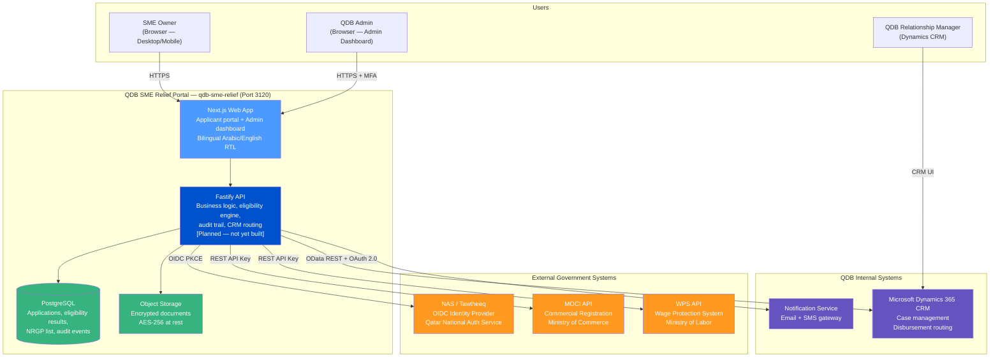
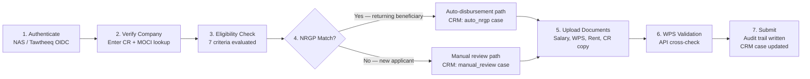

# QDB SME Relief Portal

An emergency financing portal that enables Qatari SMEs affected by geopolitical disruption to apply
for relief under the National Relief and Guarantee Program (NRGP), with automated eligibility
checking, WPS-validated salary verification, and direct routing into QDB's Dynamics CRM.

---

## Business Context

### The Problem

Qatar's SME sector is under acute cash flow stress from the Iran-Israel regional conflict. Trade
routes are disrupted, supply chains are fragmented, and regional demand is suppressed. Affected
SMEs face simultaneous fixed obligations: salary payments legally mandated under Qatar's Wage
Protection System (WPS) and commercial lease obligations.

Without emergency financing, these businesses face:

- WPS violations — QAR 6,000 per employee per late salary cycle (QAR 300,000 for a 50-person SME)
- Lease defaults and potential eviction from commercial premises
- Staff layoffs and business closure

### The Program

The National Relief and Guarantee Program (NRGP) is an existing QDB financing instrument with
board-level approval, an active beneficiary list from prior activations (COVID-19), and
pre-negotiated guarantee structures. QDB is not creating a new financial product — it is
digitalising delivery of an approved, standing program under an emergency activation mandate.

### The Portal's Purpose

A structured digital workflow replaces a manual, paper-heavy process that takes 15-30 business
days to process a single application. The portal:

1. Authenticates applicants via Tawtheeq (Qatar's National Authentication Service / NAS)
2. Retrieves verified company data from the Ministry of Commerce and Industry (MOCI)
3. Evaluates eligibility automatically against NRGP rules
4. Validates salary obligations against WPS payroll records
5. Routes disbursement requests into Microsoft Dynamics CRM — automatically for returning NRGP
   beneficiaries, or for manual QDB review for new applicants

**Urgency**: A 6-8 week delivery target is required. Every month of delay exposes SMEs to WPS
violations and irreversible business harm.

### Who It Serves

| Persona | Role | Primary Need |
|---------|------|--------------|
| Khalid (SME Owner) | Applies for relief on behalf of his company | Fast, Arabic-language portal that confirms eligibility upfront and guides document submission |
| Fatima (QDB RM) | Reviews manual disbursement cases in Dynamics CRM | CRM cases that arrive pre-populated with all data, correctly routed, WPS-flagged |
| Mohammed (QDB Admin) | Manages NRGP list, eligibility rules, program lifecycle | Admin interface with full control over program parameters without engineering |

### Success Metrics

| Metric | Target |
|--------|--------|
| Auto-disbursement end-to-end time | < 1 business day |
| Manual review processing time | < 5 business days |
| Document re-submission rate | < 10% (down from 40-60% manual) |
| Applications processed per week | 500+ (up from ~20 manual) |
| Portal uptime during program window | > 99.5% |
| Duplicate application detection | 100% |
| Audit trail completeness | 100% of steps logged |

---

## Architecture Overview

The portal is delivered as a Next.js web application (current prototype stage), with a planned
Fastify API service, PostgreSQL database, object storage, and Dynamics CRM integration.



---

## Quick Start

### Prerequisites

- Node.js 20+
- pnpm 9+

### Run the Prototype (Port 3120)

The current implementation is a Next.js prototype (frontend only — no backend API yet).

```bash
# From the product root
cd products/qdb-sme-relief/apps/web

# Install dependencies
pnpm install

# Start the development server
pnpm dev
```

The portal will be available at `http://localhost:3120`.

### What the Prototype Includes

The prototype demonstrates the full applicant journey as a UI walkthrough:

- Language selection (Arabic / English with RTL toggle)
- NAS/Tawtheeq authentication flow (mocked)
- CR number entry and MOCI company data display (mocked)
- Eligibility evaluation result screen
- NRGP list check and CRM routing decision
- Document upload UI (all document types)
- WPS validation result screen
- Application submission confirmation and status tracking

> **Note**: All external API calls (NAS, MOCI, WPS, CRM) are mocked in the prototype.
> Production integration requires a live Fastify API service (see [docs/ARCHITECTURE.md](./docs/ARCHITECTURE.md)).

---

## Application Flow

The portal guides SMEs through a structured seven-step journey from authentication to submission.



---

## Key Integrations

### NAS / Tawtheeq (Authentication)

- Protocol: OpenID Connect (OIDC) with PKCE
- Purpose: Authenticate applicants using their existing Qatar national digital identity
- No user passwords stored in the portal — NAS is the sole identity source
- QID claim extracted from the NAS ID Token is used for all subsequent signatory checks

### MOCI (Company Registration)

- Protocol: REST API with API key authentication
- Purpose: Retrieve verified company data (name, CR status, sector, registration date, signatories)
- CR number entered by the applicant is the lookup key
- Signatory list cross-referenced against the authenticated QID to confirm authorization

### WPS (Wage Protection System)

- Protocol: REST API with API key authentication
- Purpose: Validate declared salary obligations against Ministry of Labor payroll records
- Discrepancies exceeding 10% flag the CRM case for manual review (not a block)
- Applicants may also upload a WPS CSV file as evidence

### Microsoft Dynamics CRM

- Protocol: OData REST API with Azure AD service principal (OAuth 2.0)
- Purpose: Create case records routed to QDB operations for disbursement processing
- Two case types: `auto_nrgp` (pre-vetted, fast path) and `manual_review` (new applicant)
- Portal polls CRM every 5 minutes to sync application status back to the applicant

---

## Prototype vs Production Scope

| Capability | Prototype (Current) | Production (Planned) |
|-----------|--------------------|--------------------|
| UI / UX flows | Complete | Complete + refined from testing |
| NAS / Tawtheeq auth | Mocked | Live OIDC integration |
| MOCI CR lookup | Mocked | Live REST API |
| WPS validation | Mocked | Live API + file parser |
| Dynamics CRM routing | Mocked | Live OData REST integration |
| Document upload | UI only | S3-compatible object storage + virus scan |
| Eligibility engine | Frontend simulation | Rule-engine in Fastify API, DB-backed config |
| Audit trail | None | Append-only PostgreSQL table |
| Bilingual / RTL | Implemented | Professionally translated Arabic strings |
| Admin dashboard | Not started | Full NRGP list mgmt, eligibility rule config |
| Notifications | None | Email + SMS via gateway |
| Program lifecycle | None | Admin-controlled open/paused/closed states |

---

## Eligibility Criteria

An SME must pass all seven criteria to proceed:

| Criterion | Rule |
|-----------|------|
| EC-001 | CR status is "active" in MOCI |
| EC-002 | Company registered for at least 12 months |
| EC-003 | Meets QDB SME definition (employees or revenue threshold) |
| EC-004 | Enrolled in WPS (employee count > 0) |
| EC-005 | Operates in an impacted sector OR declares a measurable revenue decline |
| EC-006 | No active QDB loan in default |
| EC-007 | No judicial dissolution order in MOCI records |

All criteria parameters are admin-configurable without a code deployment (production).

---

## Security and Compliance

- All data in transit secured with TLS 1.3 minimum
- Documents encrypted at rest using AES-256 with KMS-managed keys
- Document access via signed, time-limited URLs (1-hour expiry)
- All uploaded files virus-scanned before activation
- Audit trail is append-only — UPDATE and DELETE are prevented at the database constraint level
- Documents retained for 7 years minimum per QDB policy and Qatar PDPA requirements
- Admin access requires multi-factor authentication
- Rate limiting: maximum 3 application attempts per CR number per 24 hours

---

## Full Documentation

| Document | Description |
|----------|-------------|
| [docs/PRD.md](./docs/PRD.md) | Full Product Requirements Document with all user stories and acceptance criteria |
| [docs/ARCHITECTURE.md](./docs/ARCHITECTURE.md) | C4 architecture diagrams, sequence diagrams, ER diagram, security architecture |
| [docs/API.md](./docs/API.md) | API reference for the planned Fastify backend |
| [docs/USER-GUIDE.md](./docs/USER-GUIDE.md) | End-user guide for SME applicants |
| [docs/ADMIN-GUIDE.md](./docs/ADMIN-GUIDE.md) | QDB admin operations guide |
| [docs/business-analysis.md](./docs/business-analysis.md) | Business analysis, feasibility assessment, risk register |
| [docs/ADRs/](./docs/ADRs/) | Architecture Decision Records |
