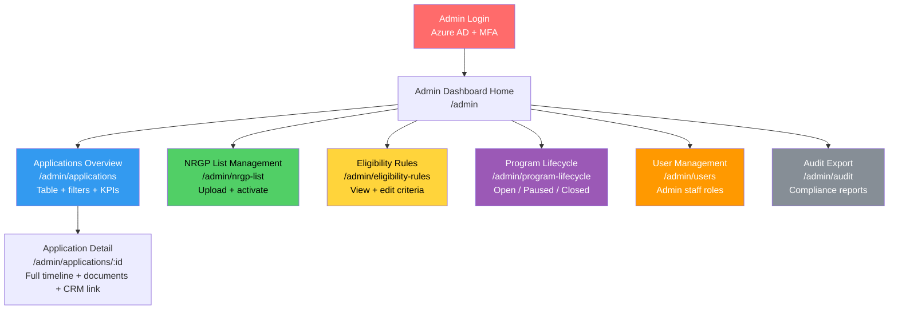
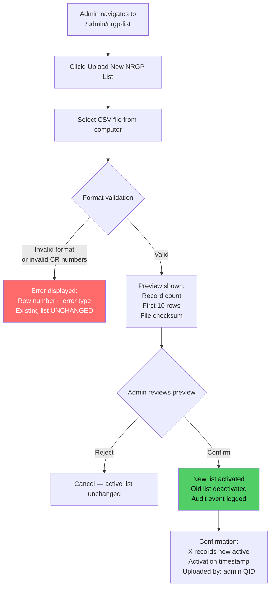
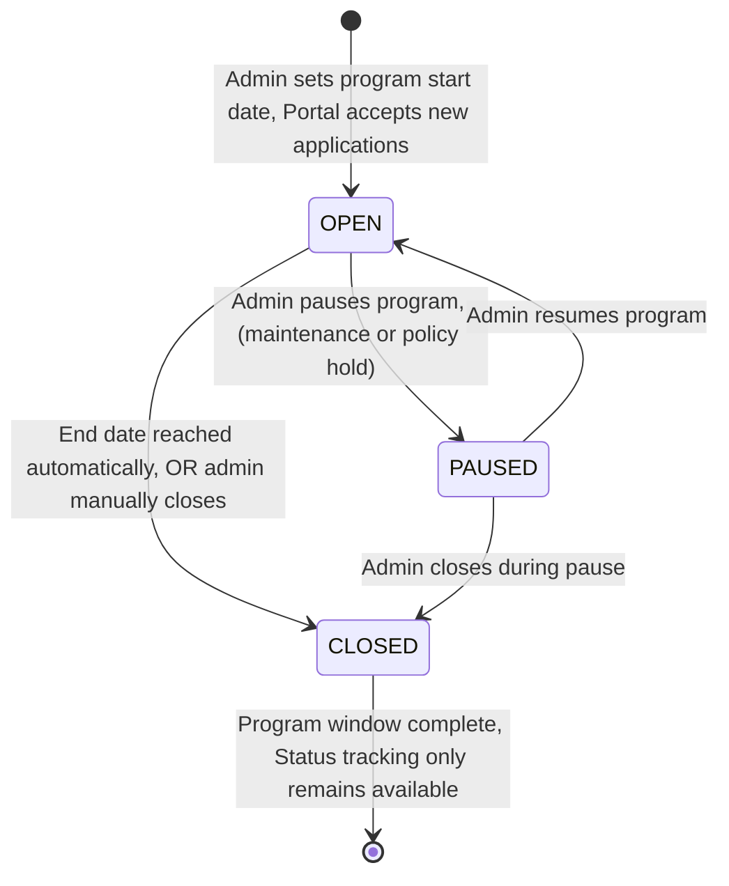
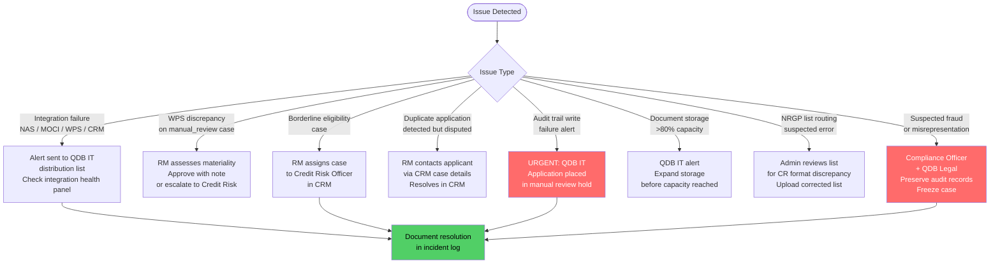

# QDB SME Relief Portal — Administrator and Relationship Manager Guide

**For**: QDB Administrators, Program Managers, and Relationship Managers
**Classification**: Confidential — QDB Internal Use Only
**Version**: 1.1 | March 2026

> **Prototype Notice**: The QDB SME Relief Portal is currently a Next.js prototype
> (port 3120). Backend integrations (NAS, MOCI, WPS, CRM) are planned but not yet
> built. This guide reflects the intended production behaviour as specified in the PRD.

---

## Table of Contents

1. [Role Overview](#1-role-overview)
2. [Admin Dashboard Overview](#2-admin-dashboard-overview)
3. [Application Review Process](#3-application-review-process)
4. [Document Verification](#4-document-verification)
5. [WPS Validation Review](#5-wps-validation-review)
6. [Eligibility Override Process](#6-eligibility-override-process)
7. [CRM Case Management](#7-crm-case-management)
8. [Managing the NRGP Beneficiary List](#8-managing-the-nrgp-beneficiary-list)
9. [Configuring Eligibility Criteria](#9-configuring-eligibility-criteria)
10. [Audit Trail Access and Reporting](#10-audit-trail-access-and-reporting)
11. [User Management and Access Control](#11-user-management-and-access-control)
12. [Program Lifecycle Management](#12-program-lifecycle-management)
13. [Key Performance Indicators](#13-key-performance-indicators)
14. [Escalation Procedures](#14-escalation-procedures)
15. [Integration Health Monitoring](#15-integration-health-monitoring)
16. [Common Issues and Resolutions](#16-common-issues-and-resolutions)

---

## 1. Role Overview

Three internal roles interact with the portal and its downstream systems.

```mermaid
graph TD
    subgraph "Portal Admin Dashboard /admin"
        ADMIN["QDB Administrator<br/>("Mohammed — Program Manager")<br/>Full admin access"]
        COMP["QDB Compliance Officer<br/>Audit export + read-only"]
    end

    subgraph "Dynamics 365 CRM"
        RM["QDB Relationship Manager<br/>("Fatima")<br/>Manual case review + decision"]
        CR["QDB Credit Risk Officer<br/>Borderline case escalation"]
    end

    ADMIN -->|"Manages"| NRGP["NRGP List<br/>Eligibility Rules<br/>Program Lifecycle"]
    ADMIN -->|"Monitors"| KPI["KPI Dashboard<br/>Integration Health"]
    COMP -->|"Exports"| AUDIT["Audit Trail<br/>Compliance Reports"]
    RM -->|"Reviews"| CASES["manual_review CRM Cases"]
    CR -->|"Decides"| BORDER["Borderline Eligibility Cases"]

    style ADMIN fill:#339af0,color:#fff
    style RM fill:#51cf66,color:#000
    style COMP fill:#ffd43b,color:#000
    style CR fill:#ff9900,color:#fff
```

### QDB Administrator (Program Manager — Mohammed)

**Responsibilities**:
- Upload and activate NRGP beneficiary lists
- Configure and update eligibility criteria
- Open, pause, or close the relief program
- Monitor application volumes and KPI dashboard
- Export audit reports for compliance
- Manage admin user access (add / remove QDB staff with admin role)

**Access**: Full admin dashboard (`/admin`). All sections accessible.

**Authentication**: QDB Azure AD credentials + mandatory MFA.

### QDB Relationship Manager (Fatima)

**Responsibilities**:
- Review `manual_review` CRM cases for companies not on the NRGP beneficiary list
- Assess application documents and WPS validation results
- Approve or reject applications with reason codes
- Escalate borderline cases to Credit Risk

**Access**: Dynamics 365 CRM only. The Relationship Manager does not log into the portal
directly — they work entirely within CRM using portal-created case records.

### QDB Compliance Officer

**Responsibilities**:
- Access audit trail exports for individual applications or date ranges
- Review audit completeness as part of NRGP program audits
- Report to external auditors and QDB Board

**Access**: Admin dashboard — read-only. Can export audit records. Cannot modify
application data, eligibility rules, or program settings.

---

## 2. Admin Dashboard Overview

The admin dashboard is accessible at:

```
https://sme-relief.qdb.com.qa/admin
```

Login uses QDB Azure AD credentials. MFA is mandatory.

### Dashboard Navigation



### KPI Summary Panel

The dashboard home shows real-time KPIs (see Section 13 for full definitions):

| KPI | Description |
|-----|-------------|
| Total Applications | All applications submitted since program opened |
| By Status | Count per status: submitted, under review, approved, rejected, disbursed |
| Auto vs Manual Split | Count of `auto_nrgp` vs `manual_review` cases |
| Average Processing Time | Hours from submission to CRM case creation (auto) and to RM decision (manual) |
| Document Re-submission Rate | Percentage of applications where a document was replaced after initial upload |
| WPS Discrepancy Rate | Percentage of applications flagged with `wps_discrepancy` |
| NAS Auth Success Rate | Percentage of authentication attempts that succeeded |

---

## 3. Application Review Process

### 3.1 End-to-End Admin Workflow

The following flowchart shows how applications move through the system from submission
to resolution, and where admin or RM intervention is required.

```mermaid
flowchart TD
    SUB("["Application Submitted<br/>by SME via Portal"]") --> ROUTE{"NRGP List<br/>Match?"}

    ROUTE -->|"CR found in NRGP list"| AUTO["Auto CRM Case Created<br/>Type: auto_nrgp<br/>Status: pending_disbursement"]
    ROUTE -->|"CR NOT in NRGP list"| MANUAL["Manual Review CRM Case Created<br/>Type: manual_review<br/>Status: pending_review"]

    AUTO --> AUTO_REVIEW["QDB Operations verifies<br/>auto-disbursement case<br/>in CRM — typically no action needed<br/>unless system flag present"]
    AUTO_REVIEW -->|"No flags"| DISBURSE["Status: disbursed<br/>Applicant notified"]
    AUTO_REVIEW -->|"Flag detected<br/>WPS or document issue"| ESCALATE_AUTO["Escalate to RM<br/>for manual assessment"]
    ESCALATE_AUTO --> RM_REVIEW

    MANUAL --> RM_QUEUE["Case appears in<br/>RM queue in CRM"]
    RM_QUEUE --> RM_REVIEW["RM opens case<br/>Reviews eligibility + docs + WPS"]

    RM_REVIEW --> DOC_OK{"Documents<br/>complete and<br/>verified?"}
    DOC_OK -->|"Missing documents"| CONTACT_APP["Contact applicant<br/>via CRM case contact<br/>Request missing items"]
    CONTACT_APP --> RM_REVIEW

    DOC_OK -->|"Documents complete"| WPS_OK{"WPS discrepancy<br/>flag set?"}
    WPS_OK -->|"wps_discrepancy_flag = true"| WPS_ASSESS["Assess WPS discrepancy<br/>See Section 5"]
    WPS_ASSESS --> DECISION
    WPS_OK -->|"No flag"| DECISION

    DECISION{"RM Decision"} -->|"Approve"| APPROVE["Update CRM: approved<br/>Add approval note"]
    DECISION -->|"Reject"| REJECT["Update CRM: rejected<br/>Select rejection reason code"]
    DECISION -->|"Escalate"| CR_REVIEW["Assign to Credit Risk<br/>for borderline decision"]

    APPROVE --> NOTIFY["Portal syncs status<br/>within 5 minutes<br/>Email + SMS to applicant"]
    REJECT --> NOTIFY
    CR_REVIEW --> DECISION

    style SUB fill:#ffa94d,color:#000
    style DISBURSE fill:#51cf66,color:#000
    style REJECT fill:#ff6b6b,color:#fff
    style ESCALATE_AUTO fill:#ffd43b,color:#000
    style CONTACT_APP fill:#ffd43b,color:#000
```

### 3.2 Application States

| Status | Meaning | Who Sets It |
|--------|---------|------------|
| `submitted` | Application received; CRM case created | System (automatic) |
| `pending_disbursement` | Auto-NRGP case; ready for disbursement processing | System (automatic) |
| `pending_review` | Manual review case; awaiting RM attention | System (automatic) |
| `under_review` | RM has opened and is reviewing the case | RM (in CRM) |
| `approved` | RM or Credit Risk has approved disbursement | RM / Credit Risk (in CRM) |
| `rejected` | Application rejected; reason code attached | RM / Credit Risk (in CRM) |
| `disbursed` | Funds have been processed through banking system | QDB Operations (in CRM) |

### 3.3 Accessing Application Detail (Admin)

From `/admin/applications`:
1. Use the filter bar to narrow by status, date range, case type, or CR number
2. Click any row to open `/admin/applications/:id`
3. The detail view shows the full application timeline, eligibility result, NRGP list match
   result, document upload status, WPS validation result, and a direct link to the CRM case

---

## 4. Document Verification

### 4.1 Required Documents by Application

Each application must include the following documents before the "Submit Application"
button becomes active:

| Document Type | Format | Max Size | Required? |
|--------------|--------|----------|-----------|
| Salary Payment Evidence | PDF, JPEG, PNG, TIFF | 10 MB | Mandatory |
| WPS File | CSV (Ministry of Labor format) | 10 MB | Mandatory |
| Commercial Registration Copy | PDF, JPEG | 10 MB | Mandatory |
| Rent Payment Evidence | PDF, JPEG, PNG, TIFF | 10 MB | Conditional (required if commercial lease exists) |
| Business Licenses | PDF, JPEG, PNG, TIFF | 10 MB each, up to 5 files | Optional |

Total application package limit: **50 MB**.

### 4.2 Document Verification Workflow

```mermaid
flowchart TD
    REC["RM receives CRM case<br/>Document links visible in case record"] --> OPEN["Click document link<br/>Signed URL opens secure browser view<br/>("1-hour expiry")"]

    OPEN --> CHECK_SALARY{"Salary evidence<br/>verified?"}
    CHECK_SALARY -->|"Bank statement shows<br/>consistent payroll"| SAL_OK["Salary: Accepted"]
    CHECK_SALARY -->|"Statements unclear<br/>or period mismatch"| SAL_FAIL["Note in CRM:<br/>Request clarification<br/>or updated evidence"]

    SAL_OK --> CHECK_WPS{"WPS CSV<br/>verified?"}
    CHECK_WPS -->|"Format correct<br/>Employee count matches<br/>Payment dates within 90 days"| WPS_DOC_OK["WPS File: Accepted"]
    CHECK_WPS -->|"Format issue<br/>or period out of range"| WPS_DOC_FAIL["Note in CRM:<br/>Request new WPS file"]

    WPS_DOC_OK --> CHECK_CR{"CR copy<br/>matches MOCI data?"}
    CHECK_CR -->|"CR number visible<br/>company name matches<br/>status active"| CR_OK["CR Copy: Accepted"]
    CHECK_CR -->|"Illegible<br/>or CR number unclear"| CR_FAIL["Note in CRM:<br/>Request clearer scan"]

    CR_OK --> CHECK_RENT{"Rent evidence<br/>applicable?"}
    CHECK_RENT -->|"Commercial lease<br/>and rent receipts present"| RENT_OK["Rent Evidence: Accepted"]
    CHECK_RENT -->|"Not applicable<br/>("no commercial lease")"| RENT_NA["Rent: Not Applicable<br/>Rent relief = QAR 0"]

    SAL_FAIL --> CONTACT_APP
    WPS_DOC_FAIL --> CONTACT_APP
    CR_FAIL --> CONTACT_APP
    RENT_OK --> ALL_DOCS_OK["All Documents Verified<br/>Proceed to Decision"]
    RENT_NA --> ALL_DOCS_OK
    ALL_DOCS_OK --> DECISION

    CONTACT_APP["Contact applicant via<br/>CRM case contact details<br/>Request resubmission"] --> WAIT["Wait for resubmission<br/>monitor case in CRM"]
    WAIT --> REC

    style ALL_DOCS_OK fill:#51cf66,color:#000
    style CONTACT_APP fill:#ffd43b,color:#000
    style SAL_FAIL fill:#ff6b6b,color:#fff
    style WPS_DOC_FAIL fill:#ff6b6b,color:#fff
    style CR_FAIL fill:#ff6b6b,color:#fff
```

### 4.3 What to Look for in Each Document Type

**Salary Payment Evidence**
- Bank transfer confirmations or payroll run reports covering the last 3 months
- Employee names or payroll batch references must be visible (for WPS cross-check)
- The total monthly payroll figure must be reconcilable with the declared salary relief amount
- Date of payment must fall within the 90-day window before application date

**WPS CSV File**
- Must conform to the Ministry of Labor WPS standard format (columns: employee ID, month, payroll amount, payment date)
- Payment dates must be within the last 90 days (Business Rule BR-010)
- Employee count in the file must be consistent with MOCI-sourced employee headcount
- Total payroll figure is automatically compared to the declared salary amount by the system

**Commercial Registration Copy**
- CR number must be legible and match the CR number entered during application
- Company name must match the MOCI-sourced company name
- CR status should show "active" (MOCI verification already confirms this, but the scanned copy is the physical evidence)
- Registration date must be visible (verifies minimum 12-month operating history)

**Rent Payment Evidence**
- Lease agreement showing the commercial property address, monthly rent amount, and lease term
- Rent payment receipts or bank transfer records for the last 1–3 months
- The monthly rent figure drives the rent relief component of the disbursement

### 4.4 Document Access

Document URLs in CRM are **signed and time-limited** (1-hour expiry). If a URL has
expired when you click it:
1. Return to the CRM case
2. Click the refresh icon next to the document link to generate a new signed URL
3. The new URL is valid for 60 minutes from generation

All document access events are logged in the audit trail.

---

## 5. WPS Validation Review

### 5.1 WPS Validation Overview

The portal automatically validates salary claims against Ministry of Labor WPS
(Wage Protection System) data. The result appears on every CRM case.

```mermaid
flowchart TD
    START("["WPS Validation Runs<br/>After Document Upload"]") --> API{"WPS API<br/>Available?"}

    API -->|"API responds"| COMPARE["Compare:<br/>Declared salary amount<br/>vs WPS payroll figure<br/>("last 90 days")"]
    API -->|"API unavailable"| FALLBACK["Use uploaded WPS file only<br/>Flag: wps_api_fallback<br/>Manual salary verification required"]

    COMPARE --> DIFF{"Discrepancy<br/>>10%?"}
    DIFF -->|"Within 10%<br/>cleaned"| PASS["WPS Status: PASS<br/>No manual review needed"]
    DIFF -->|"Exceeds 10%"| FLAG["WPS Status: DISCREPANCY<br/>Flag: wps_discrepancy<br/>Discrepancy % shown in CRM"]

    API_NO_REC["WPS returns no records<br/>for this CR number"] --> NO_REC["WPS Status: NO_RECORDS<br/>Flag: wps_no_records<br/>Manual salary verification required"]

    style PASS fill:#51cf66,color:#000
    style FLAG fill:#ffd43b,color:#000
    style FALLBACK fill:#ff9900,color:#fff
    style NO_REC fill:#ff9900,color:#fff
```

### 5.2 Interpreting WPS Validation Statuses

| WPS Status | CRM Flag | Meaning | RM Action Required |
|------------|----------|---------|-------------------|
| `PASS` | None | Declared salary within 10% of WPS payroll | No WPS action needed; proceed to decision |
| `DISCREPANCY` | `wps_discrepancy_flag = true` | Declared amount differs from WPS by >10% | Review and assess (see 5.3) |
| `NO_RECORDS` | `wps_no_records = true` | No WPS payroll records found for this CR | Verify salary via supporting documents only |
| `API_FALLBACK` | `wps_api_fallback = true` | WPS API was unavailable; file-only validation | Review uploaded WPS CSV manually |

### 5.3 Handling WPS Discrepancy Cases

When `wps_discrepancy_flag = true` is set on a case:

1. **Open the WPS validation note** on the CRM case — it shows:
   - WPS-validated payroll figure (from Ministry of Labor records)
   - Applicant's declared salary relief amount
   - Discrepancy percentage (e.g., 18.5%)
   - Number of employees per WPS records vs declared

2. **Assess the discrepancy** — common acceptable explanations:
   - Bonus or commission payments included in the declared figure but not in WPS base salary
   - Timing difference: WPS records may lag a payroll cycle
   - Employee additions or departures between WPS snapshot and application date

3. **Make a decision**:
   - **Accept the declared amount** with a note explaining why the discrepancy is acceptable
   - **Approve a lower amount** (capped to the WPS-validated figure) if the applicant cannot justify the difference
   - **Request the applicant resubmit** a corrected WPS file via QDB Operations
   - **Reject** if the discrepancy is material and cannot be explained (use REJ-002)

4. **Record your decision reasoning** in the CRM case notes before updating the status.

### 5.4 WPS Thresholds and Business Rules

- The 10% discrepancy threshold is configured in the eligibility rules panel and can be
  adjusted by a QDB Administrator without a code deployment.
- WPS data must not be older than **90 days** from the application date (Business Rule BR-010).
  If the WPS API returns records older than 90 days, the system treats this as a `NO_RECORDS`
  result and flags for manual verification.
- The relief quantum for salaries **cannot exceed** the WPS-validated payroll figure for the
  last three months, per Business Rule BR-003.

---

## 6. Eligibility Override Process

### 6.1 When an Override is Appropriate

The automatic eligibility engine evaluates seven criteria (EC-001 to EC-007). In most
cases, its result is final. However, overrides are permitted in the following circumstances:

| Scenario | Override Authority | Process |
|----------|------------------|---------|
| MOCI signatory data gap (applicant is owner but not listed) | RM + Compliance Officer sign-off | Statutory declaration captured; case proceeds with manual authorization flag |
| Company age slightly below 12-month threshold but has exceptional impact evidence | Credit Risk Officer | Credit Risk updates criterion via admin panel or approves case with override note |
| EC-005 sector not in covered list but impact is demonstrable | Credit Risk Officer | Credit Risk approves exception; documented in CRM case notes |
| EC-006 false positive (QDB loan in default is disputed or error) | QDB Relationship Banking team | RM escalates to Relationship Banking to resolve data issue; loan status corrected |

**Important**: Eligibility overrides must never be applied by an RM without the
required second authority. All overrides must be documented in the CRM case notes
with the approver's name, QID, and rationale.

### 6.2 Override Workflow

```mermaid
flowchart TD
    ELIG_FAIL("["Eligibility Result:<br/>INELIGIBLE<br/>or borderline case"]") --> RM_ASSESS["RM assesses<br/>whether override criteria apply"]

    RM_ASSESS -->|"Override not applicable"| REJECT_FINAL["Reject application<br/>REJ-003: Not eligible<br/>under current NRGP criteria"]

    RM_ASSESS -->|"Override applicable"| DOC_REASON["Document reason<br/>in CRM case notes:<br/>Which criterion<br/>Why exception applies<br/>Evidence reference"]

    DOC_REASON --> AUTH{"Required<br/>authority?"}

    AUTH -->|"EC-001, EC-004, EC-006<br/>("mandatory criteria")"| BLOCK["CANNOT be overridden<br/>These are NRGP policy mandates<br/>Reject or resolve data issue"]

    AUTH -->|"EC-002, EC-003, EC-005, EC-007<br/>("configurable criteria")"| SECOND_SIGN["Obtain second sign-off:<br/>Credit Risk Officer<br/>or Compliance Officer"]

    SECOND_SIGN --> APPROVE_OVERRIDE["Credit Risk updates<br/>CRM status to 'approved'<br/>with override documentation"]

    APPROVE_OVERRIDE --> AUDIT_LOG["Override event logged<br/>in audit trail:<br/>Approver QID<br/>Criterion overridden<br/>Rationale"]

    style REJECT_FINAL fill:#ff6b6b,color:#fff
    style BLOCK fill:#ff6b6b,color:#fff
    style APPROVE_OVERRIDE fill:#51cf66,color:#000
```

### 6.3 Mandatory Criteria Cannot Be Overridden

The following eligibility criteria are **hard-coded as mandatory** under NRGP policy
and cannot be overridden by any staff member at any level:

- **EC-001**: Active Commercial Registration in Qatar
- **EC-004**: Minimum 1 employee enrolled in WPS
- **EC-006**: No active QDB financing in default or restructuring

Attempting to override these criteria will be rejected by the system. If the data
appears incorrect (e.g., a loan default flag is wrong), the data issue must be resolved
at the source system before the application can proceed.

---

## 7. CRM Case Management

### 7.1 CRM Case Structure

Every application that reaches the NRGP check step results in a CRM case. Two types exist:

| Case Type | Trigger | Initial Status | RM Action Needed |
|-----------|---------|---------------|-----------------|
| `auto_nrgp` | CR found in NRGP beneficiary list | `pending_disbursement` | Normally no — unless a system flag exists |
| `manual_review` | CR not found in NRGP list | `pending_review` | Yes — RM must review and decide |

### 7.2 CRM Case Fields

Each portal-created CRM case contains:

| Field | Source | Content |
|-------|--------|---------|
| Case Type | System | `auto_nrgp` or `manual_review` |
| Initial Status | System | `pending_disbursement` or `pending_review` |
| Company Name (EN) | MOCI API | English company name |
| Company Name (AR) | MOCI API | Arabic company name |
| CR Number | Applicant + MOCI | Verified 10-digit CR |
| Applicant QID | NAS (Tawtheeq) | Qatar Identification Number |
| NRGP Match Result | System | `true`/`false` + list version checked |
| Eligibility Result | System | All 7 criteria with pass/fail + reason codes |
| Eligibility Criteria Snapshot | System | Exact rule values in effect at evaluation time |
| WPS Validation Status | System | `PASS`, `DISCREPANCY`, `NO_RECORDS`, or `API_FALLBACK` |
| WPS Discrepancy % | System | Populated if `DISCREPANCY` |
| Document Links | System | Signed URLs to salary evidence, WPS file, rent evidence, CR copy |
| Submission Timestamp | System | UTC timestamp of application submission |
| Portal Application ID | System | Internal reference ID |

### 7.3 Updating Case Status in CRM

RMs update case status directly within Dynamics 365 CRM:

1. Open the case from the RM queue
2. Navigate to the **Status** field
3. Select the new status (`under_review`, `approved`, `rejected`, `disbursed`)
4. For `rejected`: select the rejection reason code from the dropdown (see 7.4)
5. Add any notes to the **Case Notes** field
6. Save the record

The portal polls CRM every **5 minutes** for status changes on active applications
and updates the applicant-facing status page accordingly.

### 7.4 Rejection Reason Codes

When rejecting a case, select one of the following codes. The code and its plain-language
description are displayed to the applicant on their status page.

| Code | Reason Shown to Applicant |
|------|--------------------------|
| REJ-001 | Missing required documentation — contact QDB Operations to resubmit |
| REJ-002 | WPS salary discrepancy exceeds acceptable threshold |
| REJ-003 | Company not eligible under current NRGP criteria |
| REJ-004 | Authorized signatory declaration could not be verified |
| REJ-005 | Application submitted outside program window |
| REJ-006 | Duplicate application detected |
| REJ-007 | Internal credit assessment — contact QDB RM for details |

### 7.5 Escalation to Credit Risk

From the CRM case:
1. Click **Assign Case**
2. Select the Credit Risk Officer or Credit Risk queue
3. Add an escalation note explaining the borderline issue
4. Save the record

The case remains visible in the RM queue with status `under_review` until Credit
Risk resolves it and updates the status.

---

## 8. Managing the NRGP Beneficiary List

The NRGP beneficiary list determines whether an eligible applicant receives
automatic or manual review disbursement routing. Only QDB Administrators can
upload or activate lists.

### NRGP List CSV Format

```csv
cr_number
1234567890
0987654321
1122334455
```

**Requirements**:
- Header row must be exactly: `cr_number`
- Each CR number must be exactly 10 numeric digits
- One CR number per row
- No blank rows or duplicate CR numbers within the same file
- File encoding: UTF-8
- Maximum file size: 50 MB (accommodates up to ~500,000 records)

### Import Workflow



### Viewing the Active List

The NRGP List Management page shows:
- **Active list details**: filename, upload date, record count, uploaded by, checksum
- **Upload history**: all previous lists with activation and deactivation dates
- A **Download** button to export the current active list as CSV

### Critical Rules

- **Never activate an unverified file.** Always cross-check the record count against
  the source data from QDB Operations before confirming.
- Activating a new list **immediately deactivates the previous list**. Submitted
  applications are not retroactively affected.
- The list version at time of each lookup is recorded in the audit trail — routing
  decisions are always traceable.
- Fuzzy-match candidates (Levenshtein distance ≤ 1 from a list entry) are flagged in
  the CRM case as "possible NRGP match" for RM review rather than auto-routed.

---

## 9. Configuring Eligibility Criteria

Eligibility criteria are stored in a database configuration table and can be updated
through the admin interface without a code deployment.

### Navigate to Eligibility Rules

```
/admin/eligibility-rules
```

The page shows all 7 active criteria with their current parameter values and effective dates.

### Mandatory vs Configurable Criteria

| Code | Criterion | Mandatory? | Configurable Parameter |
|------|-----------|-----------|----------------------|
| EC-001 | Active CR status in Qatar | Yes — cannot be disabled | None |
| EC-002 | Company registration age | No | Minimum months registered (default: 12) |
| EC-003 | SME classification | No | Max employees (default: 250); max revenue QAR (default: 30M) |
| EC-004 | Active WPS enrollment | Yes — cannot be disabled | None |
| EC-005 | Impacted sector or revenue decline | No | Covered sector codes list; revenue decline % threshold |
| EC-006 | No active QDB NPL | Yes — cannot be disabled | None |
| EC-007 | No judicial dissolution | No | None (binary check from MOCI status) |

**EC-001, EC-004, and EC-006 are mandatory** and cannot be disabled. Attempting to
disable them results in an error: "This criterion is mandatory under NRGP policy
and cannot be removed."

### Editing a Criterion

1. Click **Edit** next to the criterion you want to modify
2. Update the parameter value (e.g., change minimum months from 12 to 6)
3. Update the plain-language reason text if the applicant-facing message should change
4. Click **Save Changes**

The change takes effect **immediately** for all subsequent eligibility evaluations.
Applications already evaluated are not retroactively affected.

A confirmation email is sent to your QDB email address summarising the change for
compliance records.

### Criterion Change Audit

Every criterion change is recorded in the audit log:
- Admin QID
- Changed criterion code
- Old parameter value and new parameter value
- Timestamp of change

---

## 10. Audit Trail Access and Reporting

### 10.1 What the Audit Trail Records

Every material system event during an application lifecycle is logged to an
append-only audit table. The following events are captured:

| Event Type | When Logged |
|------------|------------|
| `auth_success` / `auth_failure` | NAS authentication attempt |
| `session_terminated` | User logout or session timeout |
| `cr_lookup` | MOCI CR number query |
| `eligibility_result` | Eligibility engine evaluation completes |
| `nrgp_check` | NRGP beneficiary list lookup |
| `crm_case_created` | CRM case creation (auto or manual) |
| `document_uploaded` | Each document upload |
| `document_virus_result` | Virus scan outcome |
| `wps_validation` | WPS API query and comparison |
| `status_change` | CRM status update synced to portal |
| `notification_sent` | Email or SMS notification dispatched |
| `admin_rule_change` | Eligibility criterion updated by admin |
| `nrgp_list_upload` | New NRGP list activated |
| `program_lifecycle_change` | Program state changed (open/paused/closed) |
| `document_access` | QDB staff accessed a document via signed URL |

### 10.2 Audit Record Fields

Each audit record contains:

| Field | Description |
|-------|-------------|
| `event_type` | One of the event types above |
| `timestamp_utc` | ISO 8601 timestamp in UTC |
| `actor_qid` | QID of the user who triggered the event (or `"system"` for automated events) |
| `session_id` | Portal session identifier |
| `application_id` | Internal application reference |
| `input_summary` | Non-PII summary of the input data (e.g., CR number, document type) |
| `output_summary` | Result of the operation (e.g., `ELIGIBLE`, `PASS`, CRM Case ID) |
| `data_source_id` | Identifier of the external system queried (MOCI, WPS, NAS, NRGP list version) |
| `criteria_snapshot` | For eligibility events: the exact rule values in effect at evaluation time |

### 10.3 Accessing Audit Records

**For a single application**:
1. Navigate to `/admin/applications/:id`
2. Click **View Audit Trail** to see the chronological event log in the browser
3. Click **Export Audit Log** to download as JSON or CSV

**For a date range or bulk export**:
1. Navigate to `/admin/audit`
2. Set the date range filter and optionally filter by event type
3. Click **Export** to download a CSV containing all matching audit events

### 10.4 Audit Integrity

Audit records are written to an **append-only table** with database-level constraints
that prevent UPDATE and DELETE operations. Any attempt to modify audit records at the
database level triggers an alert to QDB IT.

The audit log write is **transactional** — if a log write fails, the application step
is not marked complete. The system retries 3 times. After 3 failures, an alert is
raised to QDB IT and the application is placed in a manual review hold.

---

## 11. User Management and Access Control

### 11.1 Admin Roles

| Role | Access Level | Who Assigns |
|------|-------------|------------|
| `admin` | Full admin dashboard access | QDB IT or existing admin |
| `compliance` | Audit export + read-only dashboard | QDB IT or admin |
| `rm` | Dynamics 365 CRM only (no portal admin access) | CRM admin / QDB IT |

### 11.2 Adding a QDB Staff Member to the Admin Dashboard

```mermaid
flowchart TD
    A["Admin navigates to<br/>/admin/users"] --> B["Click: Add User"]
    B --> C["Enter staff QDB email address<br/>("must be @qdb.com.qa domain")"]
    C --> D["Select role:<br/>admin or compliance"]
    D --> E["Click: Send Invitation"]
    E --> F["Staff receives email<br/>with access instructions"]
    F --> G["Staff logs in via Azure AD + MFA<br/>Role is applied on first login"]

    style G fill:#51cf66,color:#000
```

### 11.3 Removing Access

1. Navigate to `/admin/users`
2. Find the staff member in the user list
3. Click **Revoke Access**
4. Confirm the action

The staff member's active session (if any) is terminated immediately. The revocation
event is logged in the audit trail.

**Important**: When a QDB staff member leaves the organisation or changes role, their
admin dashboard access must be revoked immediately. Azure AD deprovisioning alone does
not revoke portal roles — the portal user list must also be updated.

### 11.4 MFA Requirements

All admin dashboard access requires MFA. This is enforced by the Azure AD Conditional
Access policy. MFA cannot be bypassed via the portal UI. If a staff member is unable
to complete MFA, they must contact QDB IT — the portal admin cannot override this
requirement.

---

## 12. Program Lifecycle Management

### 12.1 Lifecycle States



| State | Effect on Portal |
|-------|-----------------|
| **OPEN** | Portal accepts new applications normally |
| **PAUSED** | New applications blocked: "Portal temporarily paused. Try again shortly." Submitted applications are unaffected. |
| **CLOSED** | New applications blocked: "Program has closed." In-progress applications started before close date have a 48-hour grace period to submit. Status tracking for existing applications remains available. |

### 12.2 Setting the Program End Date

1. Navigate to `/admin/program-lifecycle`
2. Under **Program End Date**, select the date
3. Click **Save End Date**

The portal automatically transitions to CLOSED at midnight on the configured end date
(Qatar time, UTC+3). No manual intervention is needed.

### 12.3 Pre-Close Notifications

The system automatically sends email alerts to the QDB Program Administrator and
Compliance Officer:
- 14 days before the end date
- 7 days before the end date

These alerts prompt review of any in-progress applications that may not be submitted
before closure.

### 12.4 Manual Close (Emergency)

If the program must be closed before the scheduled end date:
1. Navigate to `/admin/program-lifecycle`
2. Click **Close Program Now**
3. Confirm the action

This is reversible — the program can be re-opened by an admin at any time.
All close/open/pause events are recorded in the audit trail with the admin QID
and timestamp.

---

## 13. Key Performance Indicators

### 13.1 Dashboard KPI Definitions

| KPI | Definition | Target |
|-----|------------|--------|
| **Total Applications** | Count of all applications where a CRM case was successfully created | — |
| **Auto-Disbursement Rate** | `auto_nrgp` cases as % of total eligible applications | Depends on NRGP list coverage |
| **Manual Review Backlog** | Count of `manual_review` cases in `pending_review` status | < 2 days average age |
| **Auto-Path Processing Time** | Hours from application submission to CRM `pending_disbursement` status | < 24 hours |
| **Manual-Path Processing Time** | Business days from CRM creation to RM decision (approved/rejected) | < 5 business days |
| **Document Re-submission Rate** | % of applications where any document was replaced after initial upload | < 10% |
| **WPS Discrepancy Rate** | % of applications with `wps_discrepancy_flag = true` | Monitored; no target threshold |
| **NAS Auth Success Rate** | % of authentication attempts that resulted in a valid session | > 98% |
| **MOCI API Success Rate** | % of CR number lookups that returned data within 3 seconds | > 99.5% |
| **CRM Case Creation Failure Rate** | % of eligible applications where CRM case creation failed after 3 retries | < 0.1% |
| **WPS Validation Completion Rate** | % of submitted applications that received a WPS validation result | > 95% |
| **Applicant Satisfaction Score** | Post-application satisfaction survey (sent on disbursement) | > 4.0 / 5.0 |

### 13.2 KPI Monitoring Cadence

| Cadence | KPIs Reviewed | By Whom |
|---------|--------------|--------|
| Real-time | Integration health, CRM failure alerts | QDB IT / Operations |
| Daily | Application volume, backlog, processing times | Program Manager |
| Weekly | All KPIs, WPS discrepancy trend, auth success rate | Program Manager + Credit Risk |
| At program close | Full audit completeness, total disbursed, rejection analysis | Compliance Officer + QDB Board |

---

## 14. Escalation Procedures

### 14.1 Escalation Matrix



### 14.2 Integration Failure Response

When an integration is flagged as unhealthy:

| Integration | Immediate Impact | Admin Action |
|-------------|-----------------|-------------|
| **NAS / Tawtheeq** | No new applicants can authenticate | Display "NAS temporarily unavailable" banner. Alert QDB IT. Contact NAS helpdesk. |
| **MOCI API** | Applicants cannot pass company verification | Display "Verification temporarily unavailable" message. Alert QDB IT. Monitor MOCI service status. |
| **WPS API** | WPS validation falls back to uploaded file only | Cases automatically flagged `wps_api_fallback`. No portal action needed — RMs review manually. Alert QDB IT. |
| **Dynamics CRM** | CRM cases queue for retry | Applications enter retry queue. After 3 failed retries, QDB Operations receives alert. Monitor integration health panel. |
| **Document Storage** | Document uploads fail | Applicants receive upload error. Alert QDB IT immediately — this blocks application completion. |

### 14.3 Suspected Fraud or Misrepresentation

If a case shows signs of fraud (fabricated documents, implausible WPS data, duplicate
company identity):

1. **Do not reject the case immediately** — preserve evidence.
2. Set the case to `under_review` in CRM with an internal note indicating suspected fraud.
3. **Contact the QDB Compliance Officer** immediately (do not use external channels).
4. **Do not contact the applicant** pending compliance review.
5. The Compliance Officer coordinates with QDB Legal and initiates a formal investigation.
6. The full audit trail for the application is preserved and exported as legal evidence.

---

## 15. Integration Health Monitoring

The admin dashboard includes an integration health panel showing the current status
of all external APIs at `/admin` (visible on the dashboard home).

### Integration Status Indicators

| Integration | Status Checks |
|-------------|--------------|
| NAS / Tawtheeq | Latest successful authentication; error rate (last 1 hour) |
| MOCI API | Latest successful CR lookup; error rate; average latency |
| WPS API | Latest successful query; error rate; MOU status indicator |
| Dynamics CRM | Latest successful case creation; error rate; queue depth |
| Document Storage | Upload success rate; storage capacity used (alert at 80%) |
| Notification Service | Email delivery rate; SMS delivery rate; failed notification count |

### Alert Thresholds

| Integration | Alert Trigger |
|-------------|--------------|
| NAS | Auth success rate drops below 95% in a 1-hour window |
| MOCI | Error rate above 5% in a 30-minute window |
| WPS | 3 or more consecutive failures |
| CRM | Any single case creation failure after 3 retries |
| Document Storage | Storage above 80% capacity |
| Notification Service | Email delivery failure rate above 5% |

Alerts are sent to the QDB IT email distribution list and logged in the Azure
Application Insights dashboard.

---

## 16. Common Issues and Resolutions

| Issue | Likely Cause | Resolution |
|-------|-------------|-----------|
| Applicant reports "You are not listed as authorized signatory" but they are the company owner | MOCI signatory data is outdated or not yet updated after a recent change | Ask applicant to contact MOCI to update records, then retry. The statutory declaration pathway is available as a fallback — contact QDB Operations. |
| NRGP list lookup is routing a known beneficiary to manual review | CR number in NRGP list does not exactly match MOCI-returned CR number (formatting difference) | Check the NRGP list for the company; compare CR formats. A fuzzy match is flagged in CRM for review. Correct the CR format in the next list upload. |
| WPS discrepancy flag on an application that appears clean | Timing difference between WPS API records and company payroll cycle | RM reviews manually; if the discrepancy is explainable (bonuses, timing), approve with a note. |
| CRM case creation failed — applicant received "case being registered" message | CRM API was temporarily unavailable; case is queued for retry | Check integration health panel. Cases are retried automatically (3x with exponential backoff). If all retries fail, QDB Operations receives an alert. Manually create CRM case from portal data if needed. |
| Applicant submitted a duplicate application from a different device | Session management edge case | Duplicate detection catches this at the NRGP check step. Check portal audit log for both sessions; close the duplicate manually in portal admin. |
| Program closed but a submitted application is stuck in "submitted" status | CRM sync lag or CRM case creation retry in progress | Check CRM case status directly. If CRM case exists, portal status syncs within 5 minutes. If not, check failed case creation queue in portal admin. |
| Admin criteria change not reflected in new applications | Browser cache showing old data | Criteria changes take effect immediately in the database. Have the admin refresh the page and re-check. If still old, check audit log for most recent change. |
| NRGP list upload fails validation | Invalid CR number format in CSV | Open error details — row number and invalid value are shown. Fix source data and re-upload. Save the CSV as UTF-8 to avoid encoding issues. |
| Document signed URL expired when RM tries to open it | 1-hour URL expiry has passed | Click the refresh icon next to the document link in CRM to generate a new signed URL valid for 60 minutes. |
| WPS API shows `NO_RECORDS` for a company with known employees | Company may use a different legal entity or contractor structure | RM reviews salary evidence documents manually. If payroll is confirmed via documents, RM can approve with a note. |

---

*This guide is a confidential internal document. Not for distribution to applicants or external parties.*
*For applicant-facing guidance, see USER-GUIDE.md.*
