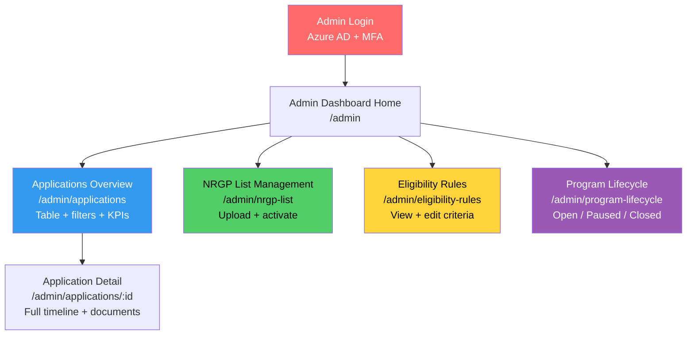
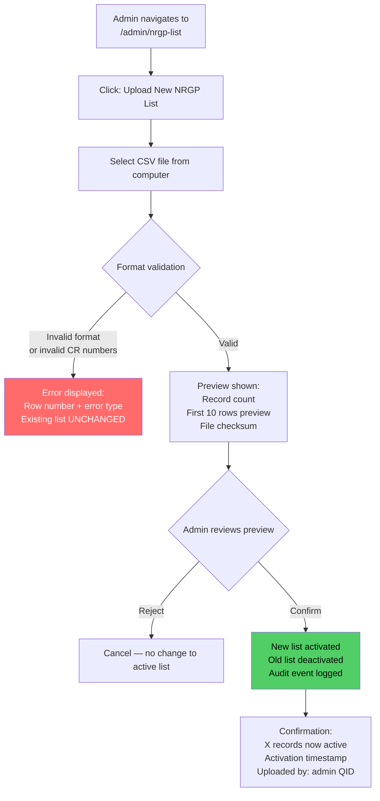
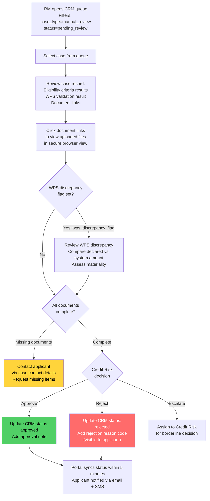
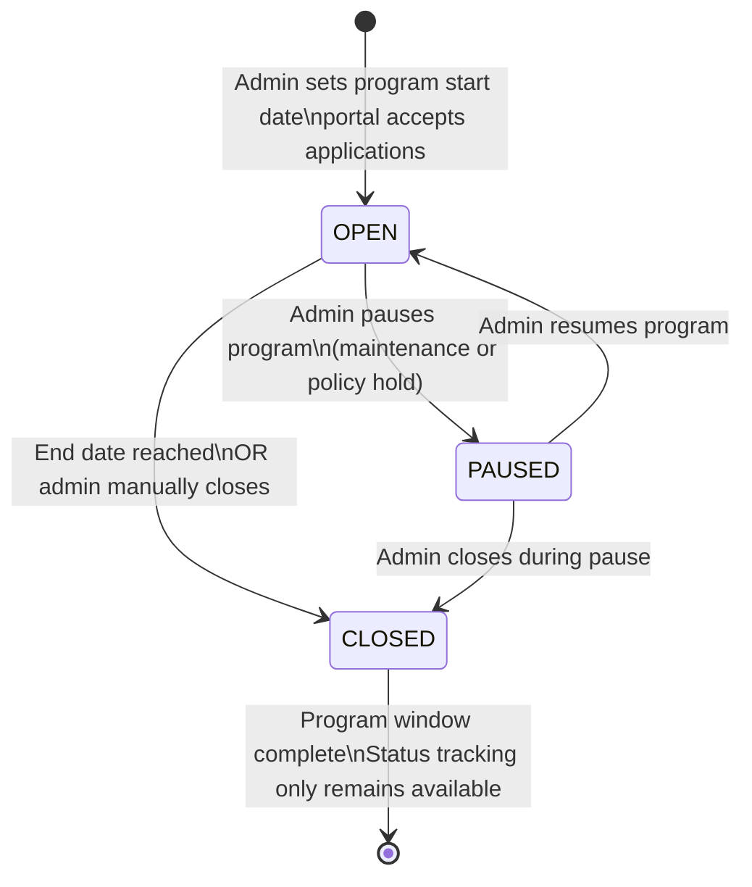

# QDB SME Relief Portal — Administrator and Relationship Manager Guide

**For**: QDB Administrators, Program Managers, and Relationship Managers
**Classification**: Confidential — QDB Internal Use Only
**Version**: 1.0 | March 2026

---

## Table of Contents

1. [Role Overview](#1-role-overview)
2. [Admin Dashboard Overview](#2-admin-dashboard-overview)
3. [Managing the NRGP Beneficiary List](#3-managing-the-nrgp-beneficiary-list)
4. [Configuring Eligibility Criteria](#4-configuring-eligibility-criteria)
5. [Application Review Workflow (Manual Disbursement Cases)](#5-application-review-workflow-manual-disbursement-cases)
6. [Exporting Reports](#6-exporting-reports)
7. [Program Lifecycle Management](#7-program-lifecycle-management)
8. [Integration Health Monitoring](#8-integration-health-monitoring)
9. [Common Issues and Resolutions](#9-common-issues-and-resolutions)

---

## 1. Role Overview

### QDB Administrator (Program Manager — Mohammed)

**Responsibilities**:
- Upload and activate NRGP beneficiary lists
- Configure and update eligibility criteria
- Open, pause, or close the relief program
- Monitor application volumes and KPI dashboard
- Export audit reports for compliance

**Access**: Full admin dashboard (`/admin`). All sections accessible.

**Authentication**: QDB staff credentials via Azure AD + mandatory MFA.

### QDB Relationship Manager (Fatima)

**Responsibilities**:
- Review `manual_review` CRM cases in Dynamics CRM
- Assess applications for companies not on the NRGP beneficiary list
- Approve or reject applications with reason codes
- Escalate borderline cases to Credit Risk

**Access**: Dynamics CRM only. The Relationship Manager does not log into the portal directly —
they access portal-created case records in CRM.

---

## 2. Admin Dashboard Overview

The admin dashboard is accessible at:

```
https://sme-relief.qdb.com.qa/admin
```

Login uses QDB Azure AD credentials. MFA is required.

### Dashboard Navigation



### KPI Summary Panel

The dashboard home shows real-time KPIs:

| KPI | Description |
|-----|-------------|
| Total Applications | All applications submitted since program opened |
| By Status | Count per status: submitted, under review, approved, rejected, disbursed |
| Auto vs Manual Split | Count of auto_nrgp vs manual_review cases |
| Average Processing Time | Hours from submission to CRM case creation (auto path) and to RM decision (manual path) |
| Document Re-submission Rate | Percentage of applications where a document was replaced |
| WPS Discrepancy Rate | Percentage of applications flagged with WPS discrepancy |
| NAS Auth Success Rate | Percentage of authentication attempts that succeeded |

---

## 3. Managing the NRGP Beneficiary List

The NRGP beneficiary list determines whether an eligible applicant receives automatic or manual
review disbursement routing. Only QDB Administrators can upload or activate lists.

### NRGP List CSV Format

The import file must be a CSV with the following structure:

```csv
cr_number
1234567890
0987654321
1122334455
```

**Requirements**:
- Header row must be exactly: `cr_number`
- Each CR number must be exactly 10 numeric digits
- One CR number per row
- No blank rows
- No duplicate CR numbers within the same file
- File encoding: UTF-8
- Maximum file size: 50 MB (accommodates up to ~500,000 records)

### Import Workflow



### Viewing the Active List

The NRGP List Management page shows:
- **Active list details**: filename, upload date, record count, uploaded by, program cycle label, checksum
- **Upload history**: all previous lists with activation and deactivation dates
- A **Download** button to export the current active list as CSV (for verification)

### Critical Rules

- **Never activate an unverified file.** Always preview and cross-check the record count against
  the source data from QDB Operations before confirming.
- Activating a new list **immediately deactivates the previous list**. All new NRGP lookups use
  the newly activated list. Applications already submitted are not retroactively affected.
- The list version at time of each lookup is recorded in the audit trail — routing decisions are
  always traceable.

---

## 4. Configuring Eligibility Criteria

Eligibility criteria are stored in a database table and can be updated through the admin interface
without a code deployment. Only QDB Administrators with admin role can edit criteria.

### Navigate to Eligibility Rules

```
/admin/eligibility-rules
```

The page shows all 7 active criteria with their current parameter values and effective dates.

### Mandatory vs Configurable Criteria

| Code | Criterion | Mandatory? | Configurable Parameter |
|------|-----------|-----------|----------------------|
| EC-001 | Active CR status | Yes — cannot be disabled | None |
| EC-002 | Company registration age | No | Minimum months registered (default: 12) |
| EC-003 | SME classification | No | Max employees (default: 250); max revenue QAR (default: 30M) |
| EC-004 | WPS enrollment | Yes — cannot be disabled | None |
| EC-005 | Impacted sector / revenue decline | No | Covered sector codes list |
| EC-006 | No QDB NPL | Yes — cannot be disabled | None |
| EC-007 | No judicial dissolution | No | None |

EC-001, EC-004, and EC-006 are **mandatory** and cannot be disabled. Attempting to disable them
results in an error: "This criterion is mandatory under NRGP policy and cannot be removed."

### Editing a Criterion

1. Click **Edit** next to the criterion you want to modify
2. Update the parameter value in the form (e.g., change minimum months from 12 to 6)
3. Update the description if the plain-language reason should change for applicants
4. Click **Save Changes**

The change takes effect **immediately** for all subsequent eligibility evaluations. Applications
already evaluated are not retroactively affected.

A confirmation email is sent to your QDB email address summarising the change for compliance records.

### Change Audit Trail

Every criterion change is recorded in the audit log:
- Admin QID
- Changed criterion code
- Old parameter value
- New parameter value
- Timestamp

---

## 5. Application Review Workflow (Manual Disbursement Cases)

### For QDB Relationship Managers (Fatima)

QDB Relationship Managers do not log into the portal. Their work happens in Dynamics 365 CRM.
When an eligible applicant is not on the NRGP beneficiary list, the portal automatically creates
a `manual_review` CRM case assigned to the RM queue.

### CRM Case Structure

Each portal-created `manual_review` case in CRM contains:

| Field | Content |
|-------|---------|
| Case Type | `manual_review` |
| Initial Status | `pending_review` |
| Company Name (EN) | From MOCI API |
| Company Name (AR) | From MOCI API |
| CR Number | From applicant entry + MOCI verification |
| Applicant QID | From NAS authentication |
| NRGP Match Result | `false` + list version checked |
| Eligibility Result | All 7 criteria with pass/fail + reason codes |
| WPS Validation | Status (pass/discrepancy/no_records) + discrepancy %; employee count |
| Document Links | Signed URLs to uploaded salary evidence, WPS file, rent evidence, CR copy |
| Submission Timestamp | UTC timestamp |
| Portal Application ID | Internal reference |

### Review Workflow for RMs



### WPS Discrepancy Flag Handling

If a case has `wps_discrepancy_flag = true`:
- The WPS discrepancy percentage is shown in the case (e.g., 18.5%)
- The RM must assess whether the discrepancy is explainable (e.g., bonuses, timing differences)
- The RM can accept the declared amount with a note, request the applicant to resubmit a corrected
  WPS file (contact QDB Operations), or reject if the discrepancy suggests misrepresentation

### Rejection Reason Codes

When rejecting a case, select one of the following reason codes (displayed to the applicant):

| Code | Reason |
|------|--------|
| REJ-001 | Missing required documentation — contact QDB Operations to resubmit |
| REJ-002 | WPS salary discrepancy exceeds acceptable threshold |
| REJ-003 | Company not eligible under current NRGP criteria |
| REJ-004 | Authorized signatory declaration could not be verified |
| REJ-005 | Application submitted outside program window |
| REJ-006 | Duplicate application detected |
| REJ-007 | Internal credit assessment — contact QDB RM for details |

---

## 6. Exporting Reports

### Application Export (Admin)

From `/admin/applications`:
1. Apply any filters (status, date range, route, CR number)
2. Click **Export to CSV**
3. A CSV download begins containing all matching applications with all visible columns

The export includes: Application ID, CR Number, Company Name, Submission Date, Status, CRM Case Type,
CRM Case ID, WPS Discrepancy Flag, Documents Complete flag, Days Since Submission.

### Audit Export (Compliance)

For compliance officer audit requests:
1. Navigate to `/admin/applications/:id` for the specific application
2. Click **Export Audit Log**
3. Download: all audit events for that application in chronological JSON or CSV format

The audit export includes: event type, timestamp, actor QID (or "system"), input summary,
output summary, data source (MOCI/WPS/NAS/NRGP list version), criteria snapshot at time of evaluation.

> **Note**: Audit records are append-only and tamper-evident. They cannot be modified through
> any interface. Any modification attempt at the database level triggers an alert to QDB IT.

---

## 7. Program Lifecycle Management

The program has three lifecycle states managed from `/admin/program-lifecycle`.

### Lifecycle States



| State | Effect on Portal |
|-------|-----------------|
| **OPEN** | Portal accepts new applications normally |
| **PAUSED** | New applications blocked: "Portal temporarily paused. Try again shortly." Submitted applications are unaffected. |
| **CLOSED** | New applications blocked: "Program has closed." In-progress applications (started before close date) have a 48-hour grace period to submit. Status tracking for existing applications remains available. |

### Setting the Program End Date

1. Navigate to `/admin/program-lifecycle`
2. Under **Program End Date**, select the date
3. Click **Save End Date**

The portal automatically transitions to CLOSED state at midnight on the configured end date (Qatar
time, AST/UTC+3). No manual intervention is needed.

### Pre-Close Notifications

The system automatically sends email alerts to the QDB Program Administrator and Compliance Officer:
- 14 days before the end date
- 7 days before the end date

These alerts prompt review of any in-progress applications that may not be submitted before closure.

### Manual Close (Emergency)

If the program must be closed before the scheduled end date:
1. Navigate to `/admin/program-lifecycle`
2. Click **Close Program Now**
3. Confirm the action (irreversible except by re-opening, which requires another admin action)

---

## 8. Integration Health Monitoring

The admin dashboard includes an integration health panel showing the current status of all external
APIs.

### Integration Status Indicators

| Integration | Status Checks |
|-------------|--------------|
| NAS / Tawtheeq | Latest successful authentication; error rate (last 1 hour) |
| MOCI API | Latest successful CR lookup; error rate; average latency |
| WPS API | Latest successful query; error rate; MOU status indicator |
| Dynamics CRM | Latest successful case creation; error rate; queue depth |
| Document Storage | Upload success rate; storage capacity used |
| Notification Service | Email delivery rate; SMS delivery rate; failed notification count |

### Alert Thresholds

| Integration | Alert Trigger |
|-------------|--------------|
| NAS | Auth success rate drops below 95% in a 1-hour window |
| MOCI | Error rate above 5% in a 30-minute window |
| WPS | 3+ consecutive failures |
| CRM | Case creation failure — any single failure (retried 3x then alerted) |
| Document Storage | Storage above 80% capacity |

Alerts are sent to the QDB IT email distribution list and logged in the Azure Application Insights
dashboard.

---

## 9. Common Issues and Resolutions

| Issue | Likely Cause | Resolution |
|-------|-------------|-----------|
| Applicant reports "You are not listed as authorized signatory" but they are the company owner | MOCI signatory data is outdated or not yet updated after a recent change | Ask applicant to contact MOCI to update records, then retry. Or contact QDB Operations — a statutory declaration pathway exists. |
| NRGP list lookup is routing a known beneficiary to manual review | CR number in NRGP list does not exactly match MOCI-returned CR number (formatting difference) | Check the NRGP list for the company; compare CR formats. If a fuzzy match exists, it will be flagged in CRM for review. Correct the CR in the next list upload. |
| WPS discrepancy flag on an application that should be clean | Timing difference between WPS API records and company's payroll cycle | RM reviews manually; if explainable, approve with note. |
| CRM case creation failed — applicant received "case being registered" message | CRM API was temporarily unavailable; case is queued for retry | Check integration health panel. Cases are retried automatically (3x exponential backoff). If all retries fail, QDB Operations receives an alert. Manually create CRM case from portal data if required. |
| Applicant submitted duplicate application from a different device | Session management edge case | Duplicate detection catches this at the NRGP check step. Check portal audit log for both sessions; close the duplicate manually in the portal admin. |
| Program closed but a submitted application is stuck in "submitted" status | CRM sync lag or CRM case creation retry in progress | Check CRM case status directly. If CRM case exists, portal status will sync within 5 minutes. If CRM case does not exist, check failed case creation queue in portal admin. |
| Admin criteria change not reflected in new applications | Browser cache showing old data | Criteria changes take effect immediately in the database. Have the admin refresh the page and re-check. If still showing old value, check the audit log for the most recent change. |
| NRGP list upload fails validation | Invalid CR number format in the CSV | Open error details — the row number and invalid value are shown. Fix the source data and re-upload. Do not modify the CSV with a text editor if it causes encoding issues. |

---

*This guide is a confidential internal document. Not for distribution to applicants or external parties.*
*For applicant-facing guidance, see USER-GUIDE.md.*
