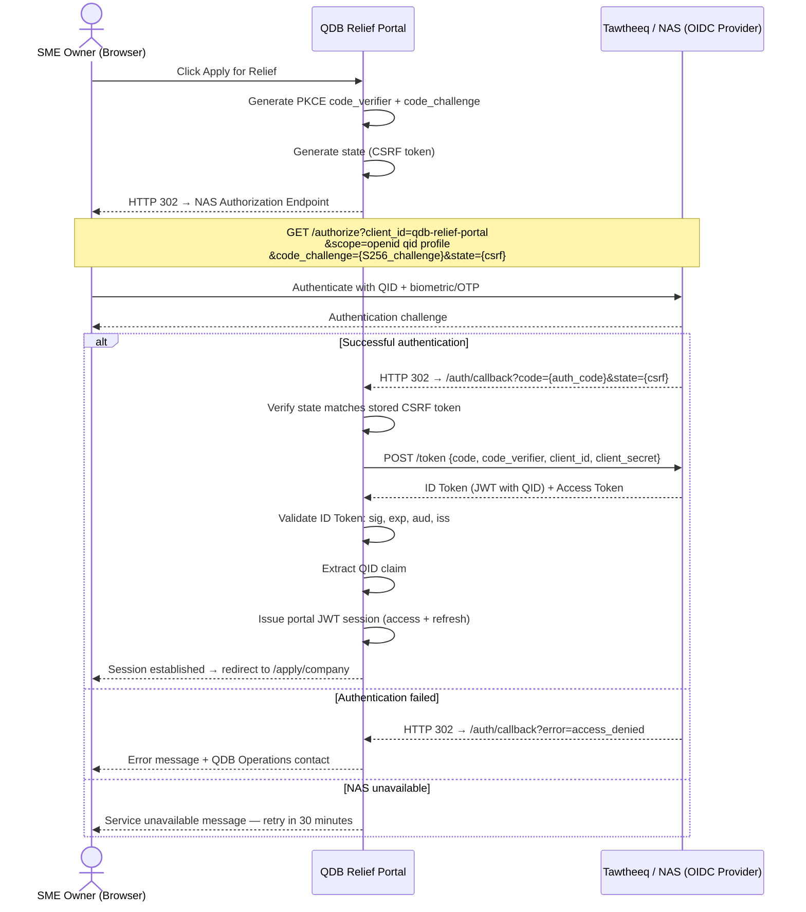

# ADR-001: Use Tawtheeq (NAS) as the Sole Authentication Provider

**Status**: Accepted
**Date**: March 3, 2026
**Deciders**: Architect, Product Manager, QDB IT, QDB Legal
**Related**: FR-001, US-01, US-02, NFR-007, OQ-002

---

## Context

The QDB SME Relief Portal must authenticate applicants who are SME owners or authorized signatories
of Qatar-registered companies. Authentication determines:

1. **Identity assurance**: The portal must confirm the user's Qatar ID (QID) to enforce that
   applications are submitted by real individuals.
2. **Authorized signatory enforcement**: The QID is cross-referenced against the MOCI company
   signatory list to prevent unauthorized submissions.
3. **Legal defensibility**: Applications result in financial disbursements. Identity authentication
   must be robust enough to stand as evidence in any future dispute or audit.
4. **Fraud prevention**: Relief funds are finite. Ensuring only one authentic application per company
   per relief period is a core control.

Qatar has a national digital identity infrastructure: **Tawtheeq / NAS (National Authentication Service)**.
NAS is operated by the Ministry of Interior and provides QID-linked digital identity with biometric
and OTP authentication factors. It is the government's standard identity layer for digital services.

---

## Decision

**Use Tawtheeq / NAS as the sole authentication provider for the QDB SME Relief Portal.**

The portal will implement OIDC Authorization Code Flow with PKCE. After successful NAS authentication,
the portal:
- Receives a signed ID Token containing the QID claim
- Validates the token (signature, expiry, audience, issuer)
- Extracts the QID and stores it in a portal-issued JWT session
- Does not store any NAS credentials or raw tokens

The portal does not store user passwords. There is no alternative authentication path in MVP.

---

## Authentication Flow

---

## Consequences

### Positive

- **No credential management**: The portal never stores passwords, PIN codes, or biometric data.
  All credential security is delegated to QDB's trusted national identity infrastructure.
- **Legal-grade identity assurance**: NAS provides assurance level 2 (biometric + QID), which is
  defensible in legal and audit contexts.
- **Single sign-on alignment**: Users with Tawtheeq accounts for other government services can
  reuse their existing digital identity. No new account creation friction.
- **QID claim enables MOCI cross-reference**: The QID from the NAS token is directly cross-referenced
  against MOCI's authorized signatory list. This chain of trust from NAS to MOCI is the portal's
  primary fraud control.
- **PDPA-aligned**: No PII is stored beyond what is necessary; credentials are managed by the
  government's own infrastructure.

### Negative

- **NAS availability dependency**: If NAS is unavailable, no user can authenticate. There is no
  fallback authentication path. The portal must display clear error messaging and QDB Operations
  contact details. (Mitigation: 99.5% NAS availability per government SLA.)
- **SME population without Tawtheeq accounts**: A portion of eligible SMEs may not have Tawtheeq
  accounts. The portal provides NAS registration guidance but does not facilitate the registration
  itself. (See OQ-007 — must be quantified in Sprint 0.)
- **NAS sandbox dependency for development**: Development and testing require NAS sandbox credentials
  issued by QDB IT. Until received (OQ-002), development uses a mock OIDC provider.
- **NAS client onboarding timeline**: Production launch requires NAS client provisioning by QDB IT,
  which may have a lead time of 2–4 weeks.

---

## Alternatives Considered

### Alternative A: Custom Email + Password Authentication

- Portal creates and manages its own user accounts with email/password.
- **Rejected** because: (1) creates a new attack surface (credential theft, phishing); (2) adds
  identity verification burden — the portal would need to separately verify that the user is who
  they claim; (3) does not provide QID linkage needed for MOCI signatory cross-reference; (4) violates
  the Qatar government mandate that government-adjacent digital services use NAS.

### Alternative B: MOCI-Based Authentication via CR Number + Declaration

- Users are authenticated solely by entering a CR number and making a statutory declaration.
- **Rejected** because: (1) no real identity assurance — anyone knowing a CR number could apply;
  (2) enables fraudulent applications from individuals with no legal relationship to the company;
  (3) legally indefensible for disbursement purposes; (4) violates QDB compliance requirements.

### Alternative C: QDB Staff Login (Azure AD) for all Users

- Extend QDB's existing Azure AD identity to cover applicant users.
- **Rejected** because: (1) Azure AD is QDB's internal staff identity; SME owners are not QDB
  employees; (2) would require individual Azure AD account provisioning for thousands of applicants;
  (3) no mechanism for automated QID claim extraction for MOCI cross-reference.

---

## Implementation Notes

- NAS OIDC base URL (Tawtheeq): `https://nas.gov.qa/auth/realms/tawtheeq`
- Required scope: `openid qid profile`
- PKCE: `code_challenge_method=S256` (mandatory — plain not accepted)
- Token validation: Use NAS JWKS endpoint for public key retrieval; validate at every request
- Session: Portal JWT pair (access token 30 min; refresh token httpOnly cookie; 8-hour absolute limit)
- Audit: Every auth event (success and failure) is written to the audit log with QID and timestamp
- Reference: QDB One portal (separate product) used NAS OIDC with same approach — reference ADR-002
  of that product for implementation patterns

---

## Resolution Required

**OQ-002** must be resolved before Sprint 1: NAS sandbox credentials for development environment
and production onboarding timeline must be confirmed with QDB IT.

---

*ADR-001 — Confidential — QDB Internal Use Only*
