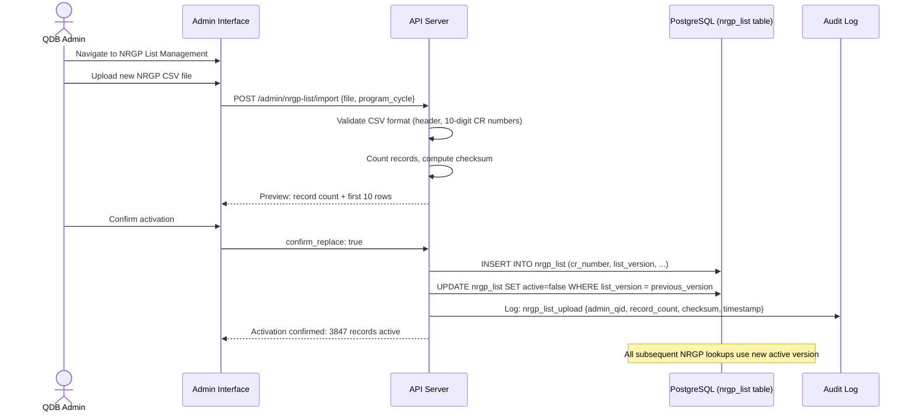

# ADR-002: Dual-Path Disbursement Routing via NRGP List Matching

**Status**: Accepted
**Date**: March 3, 2026
**Deciders**: Architect, Product Manager, QDB Credit Risk, QDB Operations
**Related**: FR-004, FR-005, US-08, US-09, OQ-003, OQ-004

---

## Context

The National Relief and Guarantee Program (NRGP) is an existing QDB financing instrument with two
distinct populations of eligible applicants:

1. **Returning NRGP beneficiaries**: Companies that were approved under the COVID-19 activation of
   the NRGP. QDB has already performed credit assessment and program eligibility verification for
   these companies. They carry lower risk and can be disbursed with minimal additional review.

2. **New applicants**: Companies that meet the eligibility criteria for this activation but were
   not part of the prior NRGP cycle. They require individual QDB Relationship Manager review before
   any disbursement decision.

The NRGP beneficiary list from the COVID-19 cycle exists as a structured dataset (format to be
confirmed per OQ-004). The key architectural question is: **how does the system determine which
path an applicant should follow, and how is that decision encoded in the system?**

---

## Decision

**Implement dual-path disbursement routing: automatic for NRGP-listed companies, manual for unlisted.**

The routing decision is made by an exact CR number lookup against a versioned NRGP beneficiary list
stored in PostgreSQL. The list is uploaded by a QDB Admin as a CSV file through the admin interface.

- **Exact match found** → `auto_nrgp` CRM case created with status `pending_disbursement`
- **No exact match** → `manual_review` CRM case created with status `pending_review`

A fuzzy match (Levenshtein distance ≤ 1) is treated as a "possible match" flagged for admin review —
not as an automatic disbursement trigger. This prevents a one-character transcription error from
incorrectly routing an unlisted company to the auto path.

---

## Routing Decision Flowchart

```mermaid
flowchart TD
    START("["Eligible Application"]") --> DUP{Duplicate CR in this relief period?}
    DUP -->|Yes| BLOCK["Block: Show existing Case ID<br/>No new application created"]
    DUP -->|No| NRGP_LOOKUP["Query NRGP List<br/>Exact CR number match"]

    NRGP_LOOKUP -->|Exact match| AUTO_PATH["AUTO-DISBURSEMENT PATH<br/>Create CRM case: auto_nrgp<br/>Status: pending_disbursement<br/>No RM review required"]

    NRGP_LOOKUP -->|Fuzzy match only Levenshtein ≤ 1| FUZZY_FLAG["Flag as possible match<br/>Create CRM case: auto_nrgp<br/>Flag: fuzzy_match_review<br/>Admin notified"]

    NRGP_LOOKUP -->|No match| MANUAL_PATH["MANUAL REVIEW PATH<br/>Create CRM case: manual_review<br/>Status: pending_review<br/>QDB RM assigned"]

    AUTO_PATH --> CRM_AUTO["CRM Case Created<br/>case_type: auto_nrgp<br/>Case ID returned to portal<br/>SME shown: Automatic processing"]

    FUZZY_FLAG --> CRM_AUTO_REVIEW["CRM Case Created<br/>case_type: auto_nrgp<br/>fuzzy_match_review: true<br/>QDB Admin reviews before disbursement"]

    MANUAL_PATH --> CRM_MANUAL["CRM Case Created<br/>case_type: manual_review<br/>Case ID returned to portal<br/>SME shown: 5 business days review"]

    AUTO_PATH --> DOC_UPLOAD[Proceed to Document Upload]
    FUZZY_FLAG --> DOC_UPLOAD
    MANUAL_PATH --> DOC_UPLOAD

    CRM_AUTO --> CRM_UPDATE["CRM case updated<br/>with document IDs<br/>after upload"]
    CRM_AUTO_REVIEW --> CRM_UPDATE
    CRM_MANUAL --> CRM_UPDATE

    style AUTO_PATH fill:#51cf66,color:#000
    style MANUAL_PATH fill:#9b59b6,color:#fff
    style BLOCK fill:#ff6b6b,color:#fff
    style FUZZY_FLAG fill:#ffd43b,color:#000
```

---

## CRM Case Payload Comparison

| Field | auto_nrgp case | manual_review case |
|-------|---------------|-------------------|
| `qdb_casetypecode` | `"auto_nrgp"` | `"manual_review"` |
| `statuscode` | `1` (pending_disbursement) | `2` (pending_review) |
| `qdb_nrgplistmatch` | `true` | `false` |
| `qdb_nrgplistversion` | e.g., `"v3"` | e.g., `"v3"` |
| QDB RM Assignment | Not assigned — auto processed | Assigned to RM queue |
| Expected duration | < 1 business day | < 5 business days |

---

## Consequences

### Positive

- **Speed for returning beneficiaries**: NRGP-listed companies that went through full credit
  assessment in the COVID-19 cycle are not subjected to a second manual review. This is the majority
  of the expected applicant population, enabling the portal to meet the sub-1-day disbursement target.
- **Risk-proportionate processing**: New applicants who have not been through NRGP credit assessment
  receive appropriate human review before disbursement decisions.
- **Admin controllable**: The NRGP list is a PostgreSQL table loaded from a CSV upload. QDB Operations
  can update the list without engineering involvement.
- **Full audit trail**: The exact NRGP list version at the time of each lookup is stored in the audit
  log. This means every routing decision can be traced to the specific list data that was active at
  decision time.
- **CRM-native routing**: The case type (`auto_nrgp` vs `manual_review`) is encoded in the CRM case
  record, enabling QDB Relationship Managers to filter and prioritize their queue natively in Dynamics.

### Negative

- **NRGP list quality dependency**: The routing accuracy depends entirely on the quality of the
  NRGP beneficiary list data. If CR numbers in the list are incorrect or outdated, companies may be
  wrongly routed. (Mitigation: Admin preview before activation; record count validation; version
  tracking.)
- **No real-time eligibility re-check for auto path**: NRGP-listed companies are assumed to remain
  eligible based on the 7 criteria checked at application time. There is no additional CRM-side
  re-verification of their NRGP status before disbursement. (Accepted: QDB Credit Risk made this
  risk decision — NRGP-listed companies are pre-vetted.)
- **Fuzzy match edge cases**: The Levenshtein ≤ 1 fuzzy match requires admin review, which introduces
  a processing delay for a small number of cases. This is deliberate — precision over recall for
  auto-disbursement.

---

## Alternatives Considered

### Alternative A: All Applications to Manual Review

- Every application, regardless of NRGP list status, goes to a QDB RM for review.
- **Rejected** because: (1) the portal's primary value proposition for QDB Operations is processing
  speed. If all 3,000+ expected applications require manual review, the portal cannot meet the 500
  applications per week throughput target; (2) defeats the purpose of maintaining the NRGP beneficiary
  list from the COVID-19 cycle.

### Alternative B: Eligibility Score-Based Auto-Approval

- A scoring model determines auto vs manual based on a weighted eligibility score across all criteria.
- **Rejected** because: (1) QDB Credit Risk has not defined or approved a scoring model; (2) scoring
  models require validation data and calibration that does not exist in this timeline; (3) the NRGP
  list is a simpler, cleaner signal — prior beneficiary status is directly relevant to current
  program eligibility.

### Alternative C: Sector-Based Routing

- Auto-disbursement for companies in high-impact sectors (e.g., logistics, import/export) and manual
  review for all others.
- **Rejected** because: (1) sector impact assessment is subjective and contested; (2) QDB Credit
  Risk's preference is prior-beneficiary status as the primary routing signal, not sector alone;
  (3) the NRGP list already encodes the credit assessment history — this alternative would duplicate
  that assessment work.

---

## NRGP List Management Process



---

## Resolution Required

- **OQ-003**: Eligibility criteria (EC-001 through EC-007) must be formally signed off by QDB Credit
  Risk before the eligibility engine can be implemented.
- **OQ-004**: NRGP beneficiary list format and record count must be confirmed. The Data Engineer
  must assess if the list requires cleansing before first import.

---

*ADR-002 — Confidential — QDB Internal Use Only*
