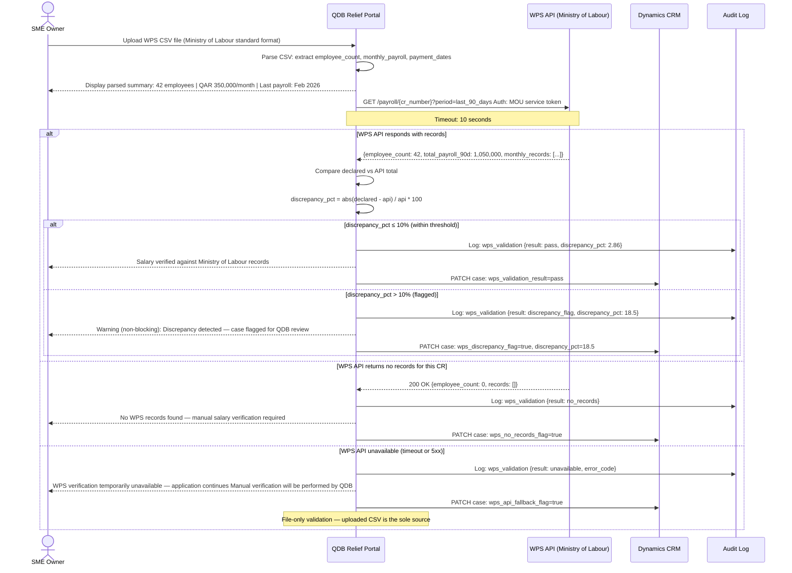
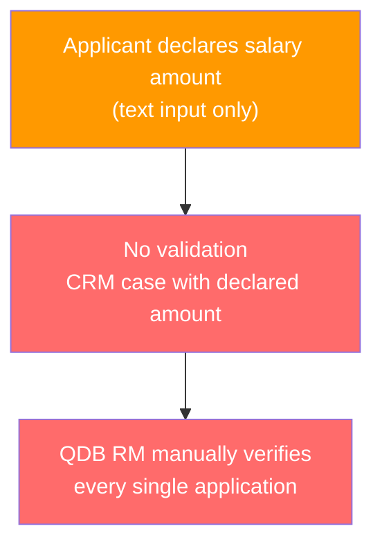
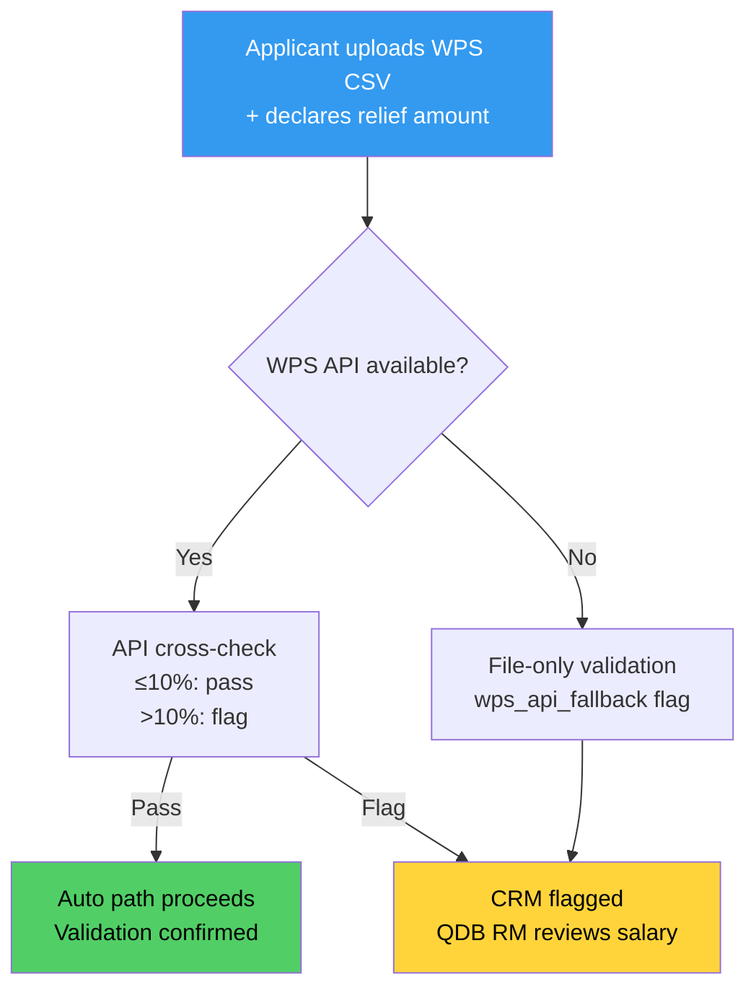

# ADR-003: WPS File-Based Salary Validation with API Fallback Strategy

**Status**: Accepted (pending OQ-001 resolution)
**Date**: March 3, 2026
**Deciders**: Architect, Product Manager, QDB Credit Risk, QDB Legal
**Related**: FR-007, US-11, US-15, US-16, NFR-001, OQ-001

---

## Context

Relief disbursements under the NRGP include a **salary relief component** covering a portion of the
applicant company's monthly payroll obligations. The relief quantum is anchored to actual Ministry
of Labour Wage Protection System (WPS) records rather than the applicant's self-declared figures.
This is a fraud control and program integrity requirement from QDB Credit Risk.

The WPS (Wage Protection System) is operated by Qatar's Ministry of Labour. It mandates that employers
in Qatar pay salaries through the WPS and maintains payroll records per company (by CR number) for
a rolling 90-day window.

**The challenge**: The availability of a WPS API for third-party integration is unconfirmed (OQ-001).
A data-sharing MOU between QDB and the Ministry of Labour may or may not already exist. The portal's
architecture must account for three scenarios:

1. **WPS API is fully available**: Automated real-time salary validation via REST API
2. **WPS API has limited availability**: File-based validation with API cross-check where possible
3. **WPS API is unavailable**: File-based validation only, with manual follow-up flag set on CRM case

---

## Decision

**Implement primary WPS CSV file upload from the applicant, with WPS API cross-validation where available,
and a graceful fallback to file-only validation when the API is unavailable.**

The architecture has three layers:

**Layer 1 (Primary)**: Applicant uploads their WPS export file in the Ministry of Labour standard CSV
format. The portal parses this file and displays a summary to the applicant.

**Layer 2 (Validation)**: The portal queries the WPS API using the company's CR number to retrieve
the live payroll records for the last 90 days. The file-declared amount is compared to the API figure.
If the discrepancy exceeds 10%, a `wps_discrepancy` flag is set on the CRM case (non-blocking).

**Layer 3 (Fallback)**: If the WPS API is unavailable (timeout, 5xx, MOU not yet in place), the portal
proceeds using the uploaded file only. A `wps_api_fallback` flag is set on the CRM case. QDB Credit
Risk reviews flagged cases manually.

---

## WPS Validation Flow

---

## WPS CSV Format

The Ministry of Labour WPS export CSV follows this structure:

| Column | Type | Description |
|--------|------|-------------|
| `employee_id` | string | Unique employee identifier within the company |
| `month` | string | Payment month (format: `YYYY-MM`) |
| `payroll_amount` | numeric | Gross salary payment (QAR) |
| `payment_date` | date | Actual payment date (ISO 8601) |

**Validation rules applied to the uploaded CSV**:
- Data must be no older than 90 days (BR-010)
- All payment dates must be from the same CR number (no cross-company mixing)
- Employee count must be consistent across months (flagged if sudden drops over 20%)

---

## Discrepancy Threshold Rationale

The 10% discrepancy threshold is set by QDB Credit Risk to accommodate:
- Minor rounding differences between the applicant's payroll software and Ministry of Labour records
- End-of-month timing differences where a payment made in the last days of a month may appear in
  the next month's WPS records
- Legitimate one-off payments (bonuses, allowances) that appear in the file but not in WPS

Discrepancies over 10% are flagged as potentially material and routed for QDB RM review. They do
not block the application — an SME should not be denied the opportunity to explain a discrepancy.

---

## Consequences

### Positive

- **Graceful degradation**: If the WPS API is not yet integrated (OQ-001), the portal still
  functions using applicant-uploaded files. The MOU can be formalized in parallel with portal
  development without blocking launch.
- **Fraud deterrence**: Even without live API validation, requiring a WPS CSV upload creates
  accountability — falsified files leave an evidence trail.
- **Compliance**: CRM case flags (`wps_discrepancy`, `wps_no_records`, `wps_api_fallback`) ensure
  QDB RMs can identify and prioritize cases needing manual salary verification.
- **Non-blocking for applicants**: WPS discrepancies are warnings, not rejections. This prevents
  legitimate SMEs with minor WPS recording differences from being blocked.

### Negative

- **File falsification risk**: Without live API validation, an applicant could submit a falsified
  WPS CSV. (Mitigation: QDB Credit Risk accepts this risk for the auto-path; manual path always
  includes QDB RM review. MOU with Ministry of Labour to be pursued as priority.)
- **Applicant burden**: Requiring applicants to locate and download their WPS CSV file adds a step.
  For SMEs using payroll software, this may require IT assistance.
- **10% threshold gaming**: A sophisticated actor could declare a salary amount precisely 9.9% below
  the true WPS figure to avoid the discrepancy flag. (Accepted: QDB Credit Risk calibrated the
  threshold based on program risk tolerance.)

---

## Architecture Before/After

### Before This Decision (considered alternatives)

### After This Decision (implemented)

---

## Alternatives Considered

### Alternative A: API-Only Validation (Block Application if WPS API Unavailable)

- WPS validation is mandatory; application cannot proceed without live API confirmation.
- **Rejected** because: (1) WPS API availability is unconfirmed (OQ-001); blocking launch on this
  dependency would miss the 6–8 week target; (2) if WPS API has intermittent outages, applicants
  are blocked from a time-critical process.

### Alternative B: No WPS Validation — Self-Declaration Only

- Applicant declares salary obligation; no file upload or API check.
- **Rejected** because: (1) QDB Credit Risk explicitly rejected this — salary amounts would be
  inflated by some applicants; (2) creates QDB legal exposure if challenged; (3) undermines program
  integrity.

### Alternative C: WPS API Integration with No CSV Fallback

- Only live WPS API; no applicant file upload.
- **Rejected** because: (1) MOU with Ministry of Labour is not confirmed; (2) removes applicant
  as a validation layer; (3) applicants can see and confirm their WPS summary before submission
  (US-16 user story requirement).

---

## Resolution Required

**OQ-001** is a Sprint 0 blocker: WPS API availability, REST/SOAP protocol, and MOU status must
be confirmed with QDB Legal and the Ministry of Labour. If the API is not available by Sprint 2,
the architecture defaults to Layer 1 (file-only) with manual QDB verification of all salary claims.

---

*ADR-003 — Confidential — QDB Internal Use Only*
