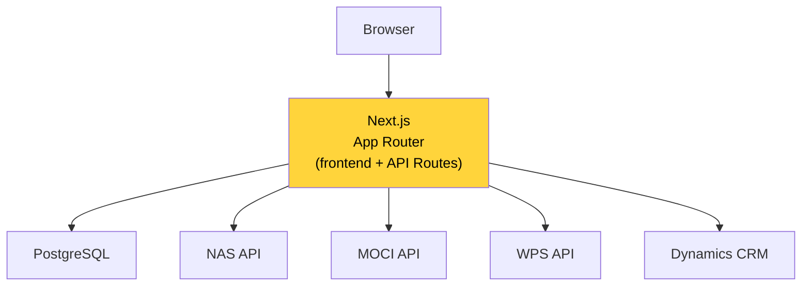
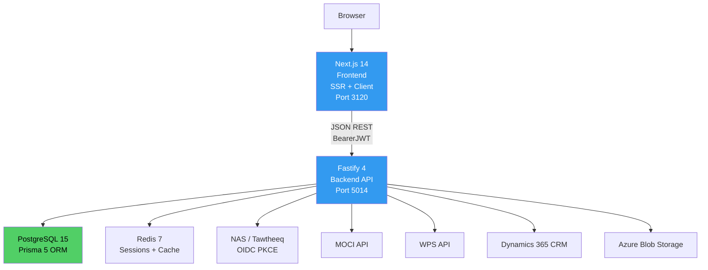
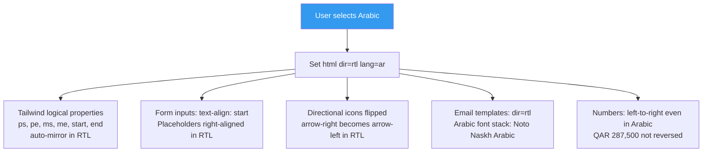

# ADR-004: Next.js 14 + Fastify + PostgreSQL + Prisma Stack

**Status**: Accepted
**Date**: March 3, 2026
**Deciders**: Architect, Frontend Engineer, Backend Engineer, DevOps Engineer
**Related**: NFR-001, NFR-002, NFR-010, NFR-021, NFR-023

---

## Context

The QDB SME Relief Portal is a government-adjacent web application with the following constraints
that drive technology selection:

1. **6–8 week delivery target**: Tight deadline demands a stack where the team has high confidence
   and strong existing tooling. Prototype iteration speed matters.
2. **Arabic RTL requirement**: The portal must render perfectly in Arabic with right-to-left layout
   mirroring (NFR-023). This is a hard requirement and influences frontend choices.
3. **WCAG 2.1 AA accessibility**: Government portal serving potentially diverse user base including
   users with disabilities (NFR-021).
4. **Government security posture**: The portal handles QID-linked identity, financial disbursement
   routing, and sensitive company data. Security is non-negotiable.
5. **High-concurrency peak**: 500 concurrent sessions with a 200-simultaneous launch spike
   (NFR-001, NFR-006).
6. **Audit-grade data integrity**: The audit trail must be tamper-evident at the database constraint
   level (NFR-015).
7. **Existing ConnectSW team stack**: The team building this portal has deep familiarity with
   Next.js, Fastify, PostgreSQL, and Prisma from other products.

---

## Decision

**Adopt the ConnectSW standard technology stack: Next.js 14 + Fastify 4 + PostgreSQL 15 + Prisma 5.**

| Layer | Technology | Version |
|-------|-----------|---------|
| Frontend Framework | Next.js | 14+ |
| UI Library | React | 18+ |
| Language | TypeScript | 5+ |
| Styling | Tailwind CSS | 3+ |
| Backend Framework | Fastify | 4+ |
| ORM | Prisma | 5+ |
| Database | PostgreSQL | 15+ |
| Session Cache | Redis | 7+ |
| Document Storage | Azure Blob Storage | — |
| Testing (unit + integration) | Jest | — |
| Testing (E2E) | Playwright | — |
| CI/CD | GitHub Actions | — |

---

## Architecture Comparison (Before/After)

### Before: Considered Alternative — Monolithic Next.js App (No Separate Backend)

Concerns: API Routes in Next.js have cold-start limitations; integration orchestration in a
monolith makes independent scaling difficult; no separation between frontend concerns and backend
security logic.

### After: Chosen Architecture — Separate Frontend + Backend

---

## Technology Selection Rationale

### Next.js 14 (Frontend)

| Requirement | How Next.js Addresses It |
|-------------|-------------------------|
| Arabic RTL | `<html dir="rtl" lang="ar">` + Tailwind CSS logical properties (e.g., `ps-4` instead of `pl-4`) for automatic RTL mirroring |
| WCAG 2.1 AA | React's ARIA ecosystem; `@axe-core/react` for automated accessibility testing |
| SEO / Government portal | App Router + Server-Side Rendering ensures all content is crawlable and initial loads are server-rendered |
| Time to interactive | SSR with hydration; no blank page on slow connections |
| i18n bilingual | `next-intl` or `next-i18next`; locale routing for Arabic and English |
| Responsiveness | Tailwind CSS responsive utilities; WCAG-compliant responsive breakpoints |
| TypeScript | First-class TypeScript support |

Next.js 14's App Router is used rather than Pages Router for:
- Layout-level loading states (important for multi-step application flow)
- Server Actions for form mutations (reduces client-side boilerplate)
- Streaming for long-running eligibility checks

### Fastify 4 (Backend API)

| Requirement | How Fastify Addresses It |
|-------------|------------------------|
| High concurrency (500 sessions) | Fastify is benchmarked as the fastest Node.js HTTP framework; ~76,000 req/s vs Express ~15,000 |
| Security | Fastify's JSON Schema validation prevents injection attacks at the schema level; no body parsing without explicit schema |
| Audit-grade logging | Pino logger (built into Fastify) with structured JSON logs; every request logged |
| Plugin architecture | Integration adapters (NAS, MOCI, WPS, CRM) encapsulated as Fastify plugins; testable in isolation |
| TypeScript | Full TypeScript support via `@fastify/type-provider-typebox` |
| JWT management | `@fastify/jwt` plugin for session token validation |
| Rate limiting | `@fastify/rate-limit` plugin for per-CR rate limiting (max 3 attempts per 24h, NFR-014) |

### PostgreSQL 15 + Prisma 5 (Database + ORM)

| Requirement | How PostgreSQL + Prisma Address It |
|-------------|----------------------------------|
| Tamper-evident audit trail | PostgreSQL row-level security + REVOKE UPDATE/DELETE on audit_log table at database level |
| Append-only audit | PostgreSQL CHECK constraints prevent modification; trigger-based alerting on bypass attempts |
| NRGP list versioning | Table-based list management with activation flags; full history preserved |
| Eligibility criteria config | Admin-editable PostgreSQL table with version tracking |
| Concurrent writes (application submissions) | PostgreSQL MVCC handles concurrent writes without locking |
| Type safety | Prisma generates TypeScript types from schema; eliminates runtime type errors in DB queries |
| Migrations | Prisma Migrate with version-controlled migration history |

### Tailwind CSS (Styling)

Tailwind CSS with logical properties provides automatic RTL support:
- `ps-4` (padding-inline-start) → `padding-left: 1rem` in LTR, `padding-right: 1rem` in RTL
- `ms-auto` (margin-inline-start) → works correctly in both directions
- No need for separate RTL stylesheet or PostCSS plugin for RTL mirroring
- Government portal colour system easily implemented via `tailwind.config.js` theme extension

---

## Arabic RTL Implementation Approach

Arabic RTL is a first-class requirement, not an afterthought. The following decisions ensure correct RTL:

Key RTL rules implemented:
- All CSS uses logical properties (start/end/inline/block) not physical (left/right/top/bottom)
- Arabic text uses Noto Naskh Arabic font (government-standard legibility)
- Numeric values and CR numbers remain LTR within RTL context (`dir="ltr"` on numeric inputs)
- WCAG colour contrast ratios maintained in both language modes
- Screen reader announcements in the active language

---

## Alternatives Considered

### Alternative A: Django + React (Python Backend)

| Factor | Django + React | Next.js + Fastify |
|--------|---------------|------------------|
| Team familiarity | Low — no Python expertise on current team | High |
| RTL support | Moderate — requires additional work | Native via Tailwind logical properties |
| Time to MVP | Longer — new toolchain | Shorter — existing tooling |
| ConnectSW component reuse | None | Full access to COMPONENT-REGISTRY.md |
| Performance at 500 concurrent | Adequate with Gunicorn workers | Better — event-loop architecture |
| **Verdict** | **Rejected** | **Selected** |

### Alternative B: Ruby on Rails (Monolith)

| Factor | Rails Monolith | Next.js + Fastify |
|--------|---------------|------------------|
| Team familiarity | None on current team | High |
| Arabic RTL | No native support | Native |
| OIDC integration | Requires additional gems | `@fastify/oauth2` plugin |
| Scalability | Requires significant tuning | Horizontal scale-out is straightforward |
| **Verdict** | **Rejected** | **Selected** |

### Alternative C: Next.js App Router with API Routes Only (No Fastify)

| Factor | Next.js API Routes | Next.js + Fastify |
|--------|--------------------|------------------|
| Integration complexity | All integrations in Next.js API routes | Clean separation |
| Independent scaling | Cannot scale API independently of frontend | Can scale API tier separately |
| Security surface | Larger — frontend and backend in same process | Smaller — API tier is isolated |
| Performance | Cold-start issues on serverless deployment | Fastify is always-on, consistent performance |
| **Verdict** | **Rejected** | **Selected** |

### Alternative D: NestJS (Instead of Fastify)

| Factor | NestJS | Fastify |
|--------|--------|---------|
| Team familiarity | Moderate | High |
| Performance | Good | Excellent (benchmark advantage) |
| Complexity | Higher — decorator-based DI | Lower — plugin-based |
| Boot time | Slower (DI container) | Faster |
| ConnectSW precedent | Limited | Used in multiple products |
| **Verdict** | **Rejected** | **Selected** |

---

## Security Considerations for Government Portal

The government context imposes additional requirements that the stack must support:

| Concern | Stack Response |
|---------|---------------|
| OWASP Top 10 | Fastify JSON Schema validation; Prisma parameterized queries; CSP headers via `@fastify/helmet` |
| XSS | React's JSX escapes by default; Tailwind prevents style injection |
| CSRF | PKCE state parameter for auth; `@fastify/csrf-protection` for non-auth forms |
| Sensitive data in logs | Prisma query logging redacts parameters; Pino `redact` option for PII fields |
| SQL injection | Prisma ORM prevents raw SQL; all DB access via Prisma client |
| Rate limiting | `@fastify/rate-limit` per CR number (3 attempts/24h per NFR-014) |
| TLS 1.3 | Enforced at load balancer / WAF layer; Node.js TLS config minimum version set |

---

*ADR-004 — Confidential — QDB Internal Use Only*
