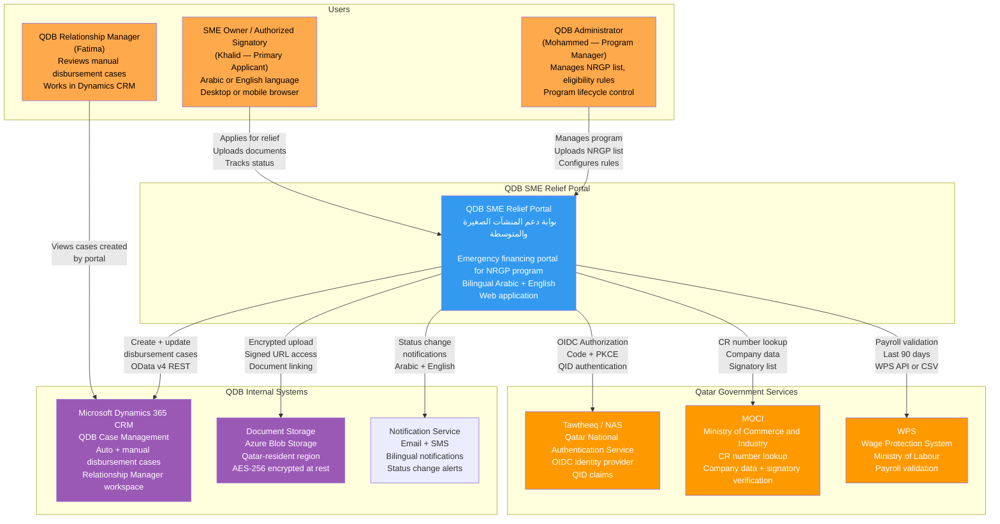
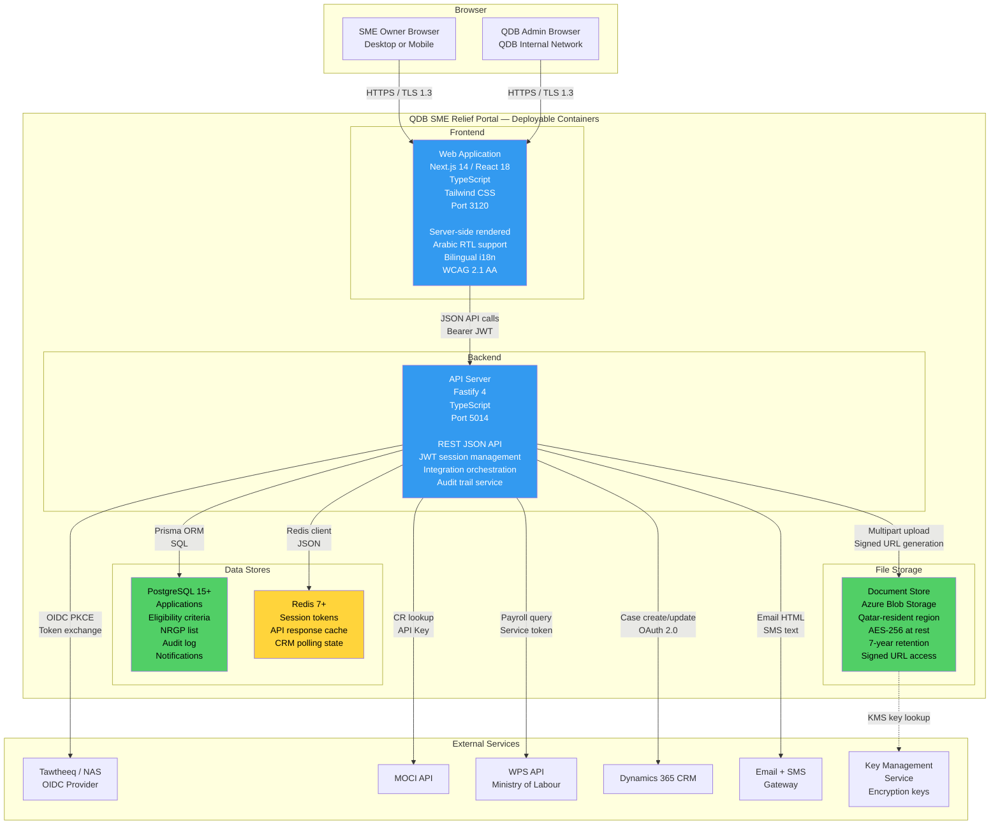
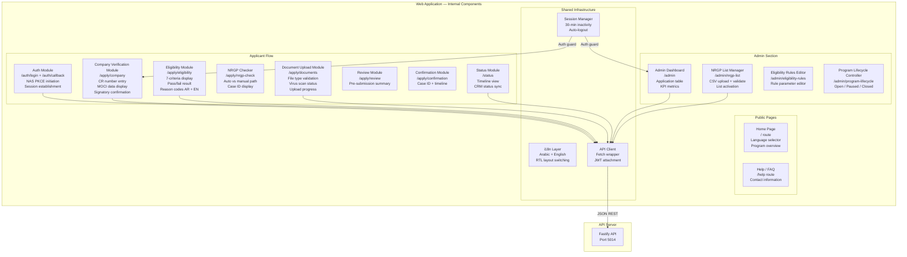
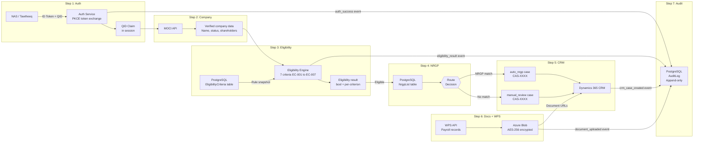
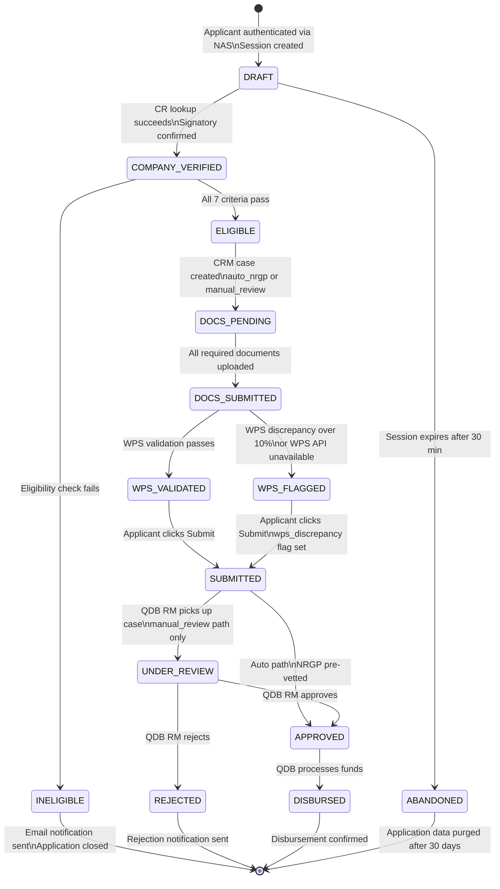
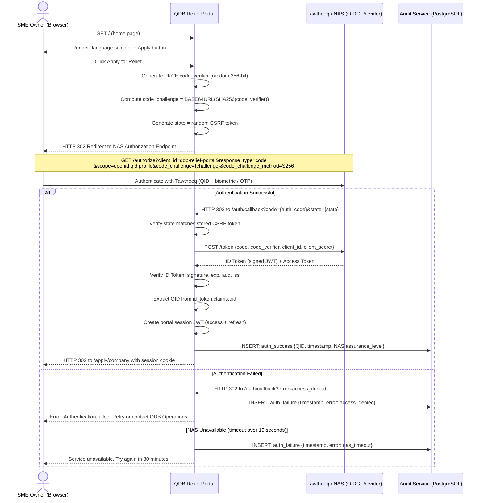
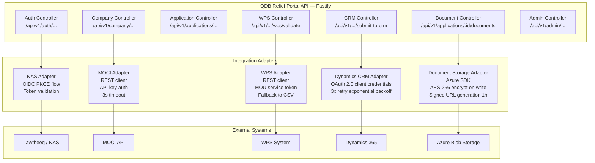
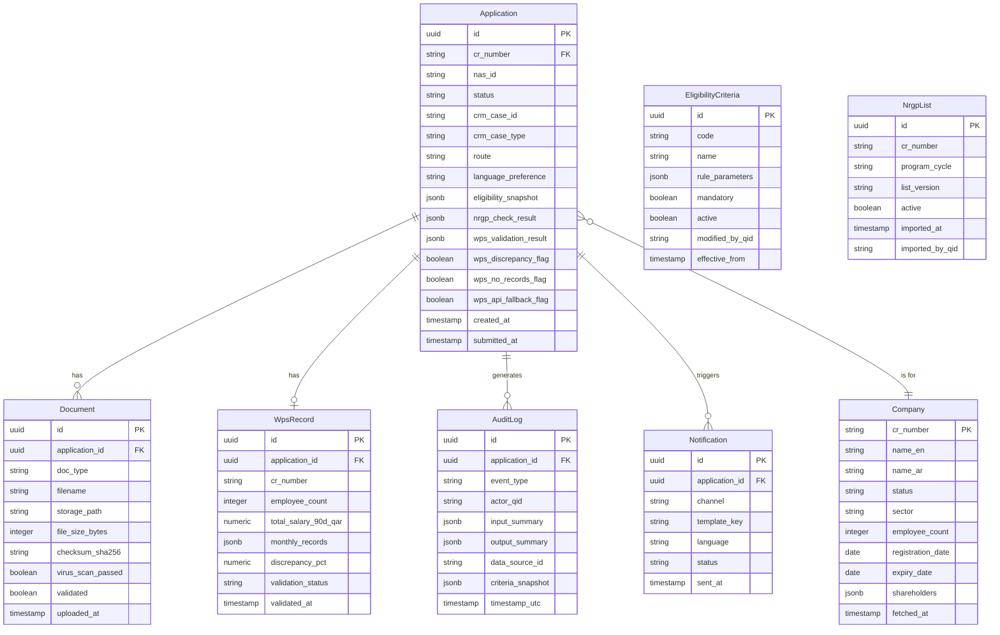
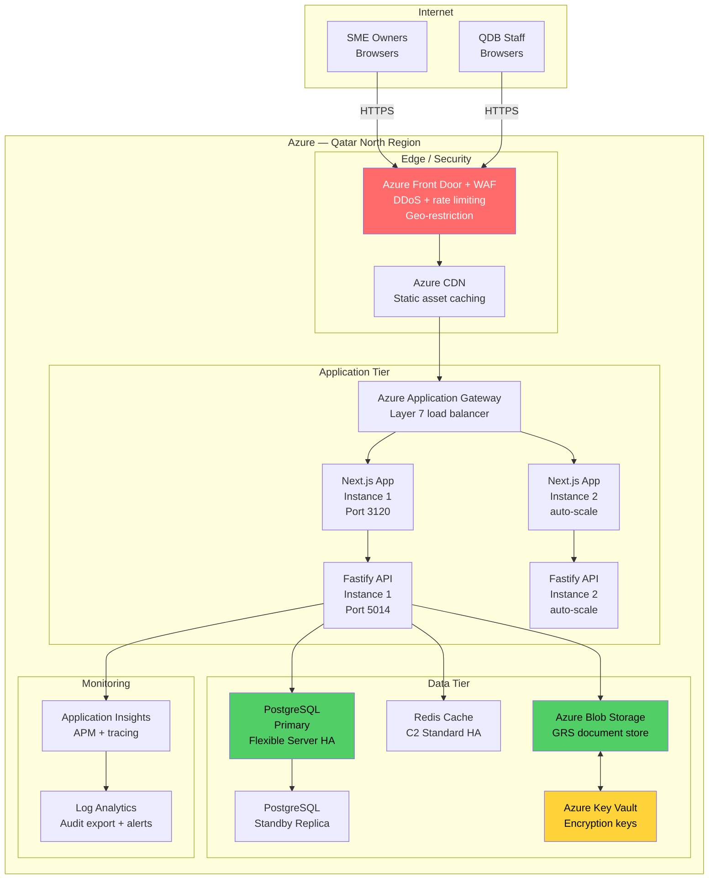

# QDB SME Relief Portal — Architecture Document

**Product**: QDB SME Relief Portal
**Version**: 1.0
**Date**: March 3, 2026
**Status**: Sprint 0 — Architecture Review Complete

---

## Table of Contents

1. [C4 Level 1 — System Context](#c4-level-1--system-context)
2. [C4 Level 2 — Container Diagram](#c4-level-2--container-diagram)
3. [C4 Level 3 — Component Diagram (Web App)](#c4-level-3--component-diagram-web-app)
4. [Data Flow Diagram](#data-flow-diagram)
5. [Application State Machine](#application-state-machine)
6. [Authentication Sequence — NAS PKCE OIDC](#authentication-sequence--nas-pkce-oidc)
7. [Integration Architecture](#integration-architecture)
8. [Database Schema — ER Diagram](#database-schema--er-diagram)
9. [Deployment Architecture](#deployment-architecture)
10. [Key Architectural Decisions](#key-architectural-decisions)
11. [Non-Functional Requirements — Architecture Implications](#non-functional-requirements--architecture-implications)

---

## C4 Level 1 — System Context

---

## C4 Level 2 — Container Diagram

---

## C4 Level 3 — Component Diagram (Web App)

---

## Data Flow Diagram

---

## Application State Machine

---

## Authentication Sequence — NAS PKCE OIDC

---

## Integration Architecture

---

## Database Schema — ER Diagram

---

## Deployment Architecture

---

## Key Architectural Decisions

| Decision | Choice | ADR |
|----------|--------|-----|
| Authentication provider | Tawtheeq / NAS OIDC only — no alternative auth path | ADR-001 |
| Disbursement routing | Dual-path via NRGP list exact match (auto) vs no-match (manual) | ADR-002 |
| WPS salary validation | File-based with API cross-check; fallback to file-only | ADR-003 |
| Technology stack | Next.js 14 + Fastify + PostgreSQL + Prisma + Azure | ADR-004 |
| Session management | Portal-issued JWT pair; 30-min inactivity; 8-hour absolute limit | — |
| Audit trail | Append-only PostgreSQL table; audit write blocks step on failure | — |
| Document storage | Azure Blob Storage (Qatar-resident); AES-256; signed URLs 1h expiry | — |

---

## Non-Functional Requirements — Architecture Implications

| NFR | Requirement | Architecture Response |
|-----|-------------|----------------------|
| NFR-001 | 500 concurrent sessions | Horizontal scaling of API; Redis session store |
| NFR-002 | Page load under 2s | Next.js SSR + CDN; Redis caching for MOCI |
| NFR-007 | No user passwords stored | NAS handles all credentials |
| NFR-008 | TLS 1.3 minimum | Enforced at WAF + Application Gateway |
| NFR-009 | AES-256 documents | Azure Blob + Key Vault KMS |
| NFR-011 | Qatar PDPA compliance | Qatar North region; PII minimization; 7-year retention |
| NFR-015 | Append-only audit trail | PostgreSQL REVOKE UPDATE/DELETE for app role |
| NFR-017 | 99.5% availability | 2+ API instances; PostgreSQL standby; Redis cluster |

---

*This document is confidential — QDB Internal Use Only.*
