# QDB SME Relief Portal — Architecture

**Product**: QDB SME Relief Portal
**Version**: 1.0
**Date**: March 3, 2026
**Status**: Prototype complete — Production architecture planned
**Classification**: Confidential — QDB Internal Use Only

---

## Table of Contents

1. [Architecture Overview](#1-architecture-overview)
2. [C4 Level 1 — Context Diagram](#2-c4-level-1--context-diagram)
3. [C4 Level 2 — Container Diagram](#3-c4-level-2--container-diagram)
4. [C4 Level 3 — Component Diagram](#4-c4-level-3--component-diagram)
5. [Integration Sequence Diagrams](#5-integration-sequence-diagrams)
6. [End-to-End Data Flow](#6-end-to-end-data-flow)
7. [Data Model — ER Diagram](#7-data-model--er-diagram)
8. [Application State Machine](#8-application-state-machine)
9. [Security Architecture](#9-security-architecture)

---

## 1. Architecture Overview

The QDB SME Relief Portal is a time-bounded emergency program portal with a hard delivery
requirement of 6-8 weeks from brief to live. The architecture is optimised for:

- **Speed of delivery**: Next.js full-stack with server-side rendering; a Fastify API service
  added in the production phase when real external API integrations are required
- **Government integration**: NAS (OIDC), MOCI (REST), WPS (REST), Dynamics CRM (OData REST)
  are all existing government/QDB APIs — the portal is an orchestration layer over them
- **Auditability**: Every material decision is captured in an append-only audit table; this is
  a compliance requirement for a government-administered financial relief program
- **Program sunset**: The architecture supports a defined program window with lifecycle states
  (Open / Paused / Closed) and automatic enforcement of the program end date

### Technology Stack

| Layer | Technology | Rationale |
|-------|-----------|-----------|
| Frontend | Next.js 14 + React 18 + Tailwind CSS | SSR for bilingual RTL rendering; ConnectSW standard |
| Backend API | Fastify 4 (Node.js 20, TypeScript) | High-throughput JSON API; ConnectSW standard |
| Database | PostgreSQL 15 | ACID compliance for audit trail; Prisma ORM |
| Document storage | S3-compatible object storage | AES-256 at rest; signed URLs; 7-year retention |
| Auth | NAS/Tawtheeq OIDC + PKCE | Qatar national identity; no passwords stored in portal |
| CRM | Microsoft Dynamics 365 (OData REST) | QDB's existing case management platform |
| Ports | Web: 3120, API: 5010 | Per ConnectSW PORT-REGISTRY |

---

## 2. C4 Level 1 — Context Diagram

This diagram shows the system in its environment: the people who use it and the external systems
it depends on.

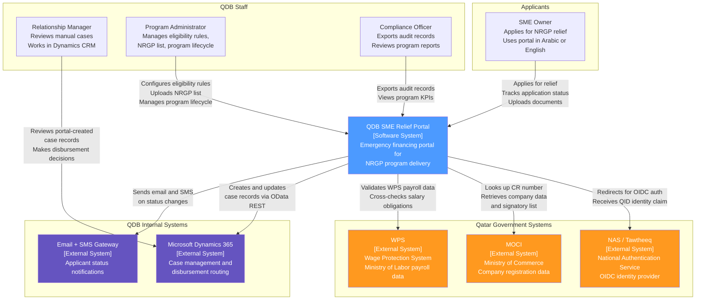

---

## 3. C4 Level 2 — Container Diagram

This diagram shows the high-level technical building blocks: applications, databases, and
storage systems that make up the QDB SME Relief Portal.

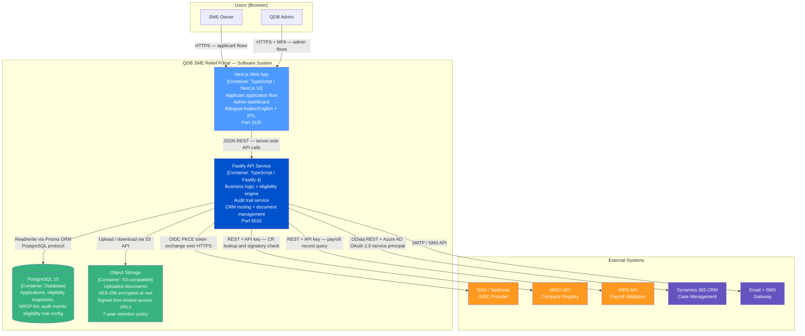

> **Current State**: The prototype consists of the Next.js Web App only (port 3120). All external
> API calls and the Fastify API Service, PostgreSQL, and object storage are planned for the
> production build. The prototype mocks all external integrations.

---

## 4. C4 Level 3 — Component Diagram

This diagram shows the internal structure of the two primary containers: the Next.js Web App and
the Fastify API Service.

### 4.1 Next.js Web App — Components

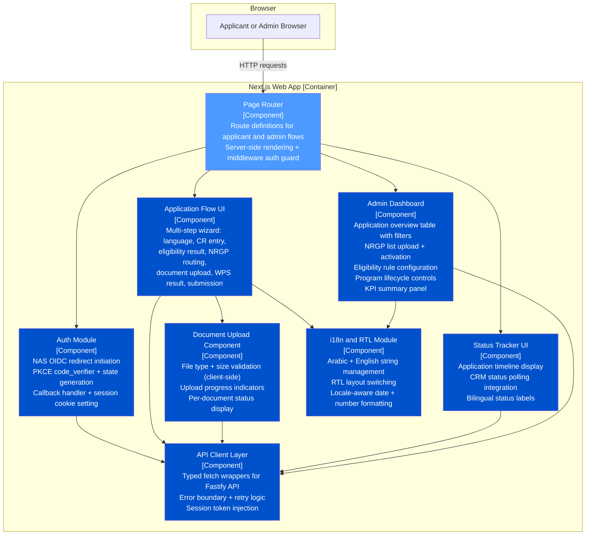

### 4.2 Fastify API Service — Components

```mermaid
graph TD
    subgraph FastifyAPI["Fastify API Service [Container]"]
        ROUTER["Route Handler Layer<br/>[Component]<br/>REST endpoints: auth, application,<br/>documents, admin, status<br/>Request validation with JSON Schema"]

        AUTH_SVC["Auth Service<br/>[Component]<br/>NAS token exchange (PKCE)<br/>ID token verification + QID extraction<br/>Portal JWT issuance (access + refresh)<br/>Session management + inactivity timeout"]

        ELIG_ENGINE["Eligibility Engine<br/>[Component]<br/>EC-001 to EC-007 rule evaluation<br/>Rule config loaded from DB<br/>Criteria snapshot for audit<br/>Duplicate application detection"]

        NRGP_SVC["NRGP List Service<br/>[Component]<br/>CSV upload + format validation<br/>CR number lookup (exact + fuzzy)<br/>List versioning + activation<br/>Admin list management"]

        DOC_SVC["Document Service<br/>[Component]<br/>File validation (format + size)<br/>Virus scan integration<br/>S3 upload with AES-256<br/>Signed URL generation<br/>Access control by role"]

        WPS_SVC["WPS Validation Service<br/>[Component]<br/>WPS API query by CR number<br/>CSV file parser (MoL standard format)<br/>Discrepancy calculation<br/>CRM flag generation"]

        CRM_SVC["CRM Integration Service<br/>[Component]<br/>Dynamics 365 OData REST client<br/>auto_nrgp and manual_review case creation<br/>Exponential back-off retry (3 attempts)<br/>Status polling for sync back to portal DB"]

        AUDIT_SVC["Audit Trail Service<br/>[Component]<br/>Append-only event writer<br/>16 event types (auth to lifecycle)<br/>Transactional write guard<br/>Export API for compliance"]

        NOTIF_SVC["Notification Service<br/>[Component]<br/>Email template engine (Arabic + English)<br/>SMS gateway adapter<br/>Retry with 10-min intervals<br/>3-failure escalation to QDB Ops"]

        ADMIN_SVC["Admin Service<br/>[Component]<br/>Eligibility rule CRUD + audit<br/>NRGP list management delegation<br/>Program lifecycle state machine<br/>Application overview + KPI queries"]
    end

    subgraph Data["Data Layer"]
        DB[("PostgreSQL via Prisma ORM")]
        STORE["Object Storage S3-compatible"]
    end

    subgraph Ext["External APIs"]
        NAS_API["NAS OIDC"]
        MOCI_API["MOCI REST"]
        WPS_API["WPS REST"]
        CRM_API["Dynamics 365 OData"]
        GW["Email + SMS Gateway"]
    end

    ROUTER --> AUTH_SVC
    ROUTER --> ELIG_ENGINE
    ROUTER --> NRGP_SVC
    ROUTER --> DOC_SVC
    ROUTER --> WPS_SVC
    ROUTER --> CRM_SVC
    ROUTER --> ADMIN_SVC
    ROUTER --> AUDIT_SVC

    AUTH_SVC --> AUDIT_SVC
    ELIG_ENGINE --> AUDIT_SVC
    ELIG_ENGINE --> DB
    NRGP_SVC --> DB
    DOC_SVC --> STORE
    DOC_SVC --> AUDIT_SVC
    WPS_SVC --> AUDIT_SVC
    CRM_SVC --> DB
    CRM_SVC --> AUDIT_SVC
    NOTIF_SVC --> AUDIT_SVC
    ADMIN_SVC --> DB
    ADMIN_SVC --> AUDIT_SVC
    AUDIT_SVC --> DB

    AUTH_SVC -->|"Token exchange"| NAS_API
    ELIG_ENGINE -->|"Company data"| MOCI_API
    WPS_SVC -->|"Payroll query"| WPS_API
    CRM_SVC -->|"Case creation + polling"| CRM_API
    NOTIF_SVC -->|"Send messages"| GW

    style ROUTER fill:#4c9aff,color:#fff
    style AUTH_SVC fill:#0052cc,color:#fff
    style ELIG_ENGINE fill:#0052cc,color:#fff
    style NRGP_SVC fill:#0052cc,color:#fff
    style DOC_SVC fill:#0052cc,color:#fff
    style WPS_SVC fill:#0052cc,color:#fff
    style CRM_SVC fill:#0052cc,color:#fff
    style AUDIT_SVC fill:#0052cc,color:#fff
    style NOTIF_SVC fill:#0052cc,color:#fff
    style ADMIN_SVC fill:#0052cc,color:#fff
```

---

## 5. Integration Sequence Diagrams

### 5.1 NAS / Tawtheeq OIDC Authentication

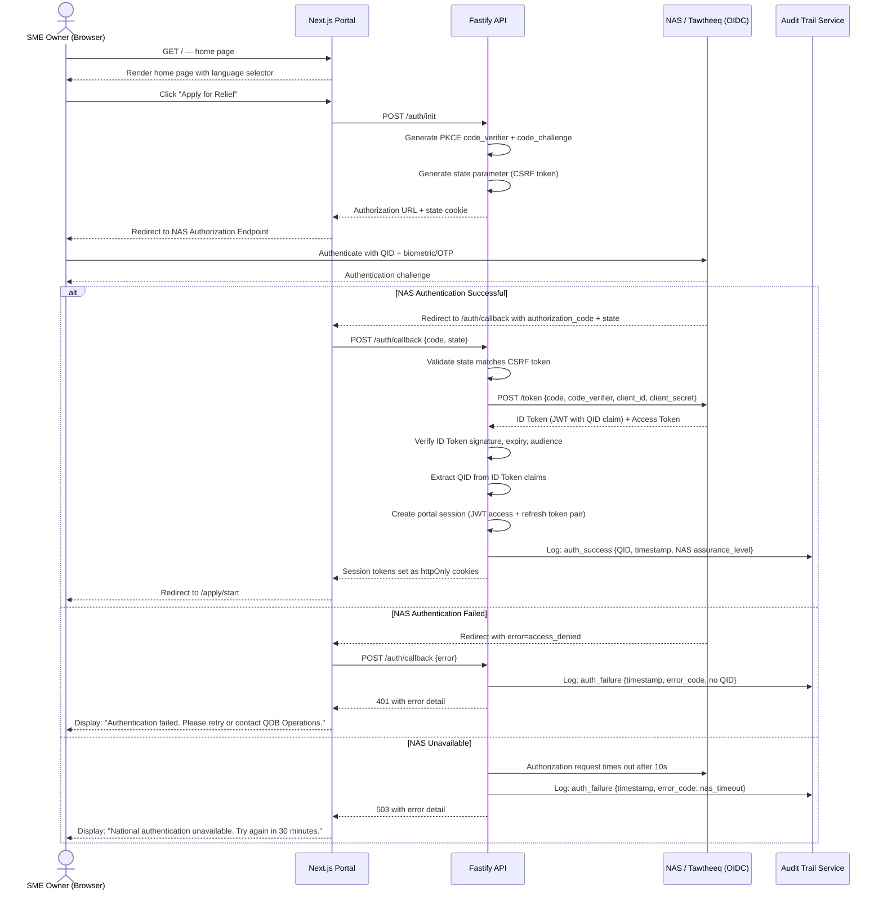

---

### 5.2 MOCI Commercial Registration Lookup

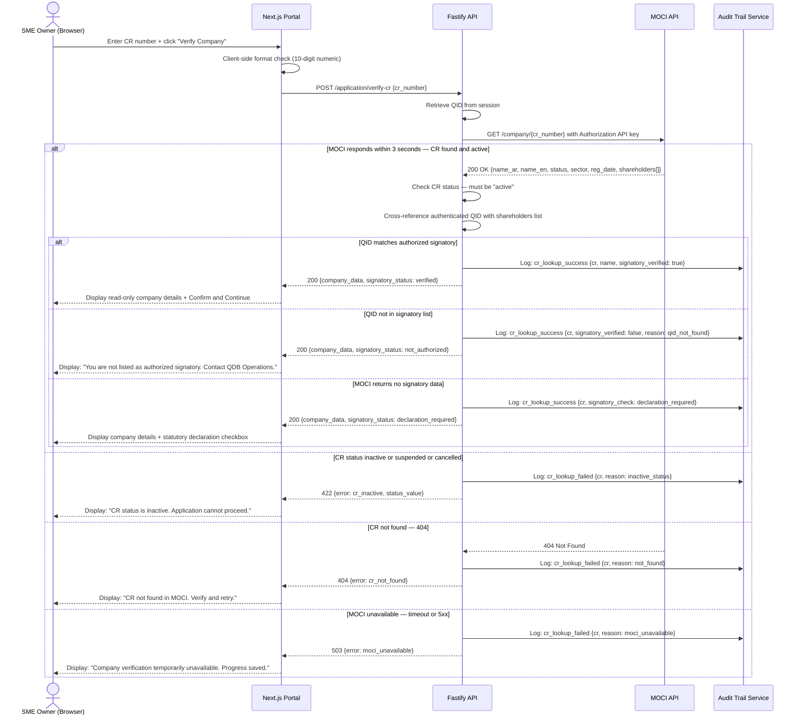

---

### 5.3 WPS Payroll Validation

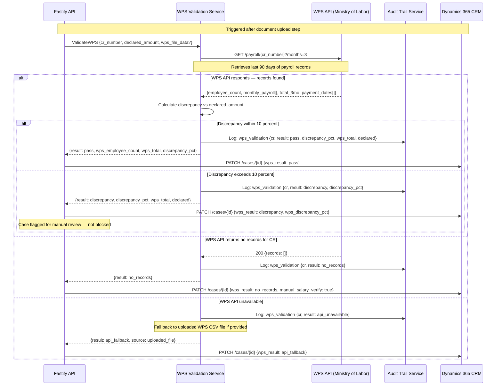

---

### 5.4 Dynamics CRM Case Creation and Routing

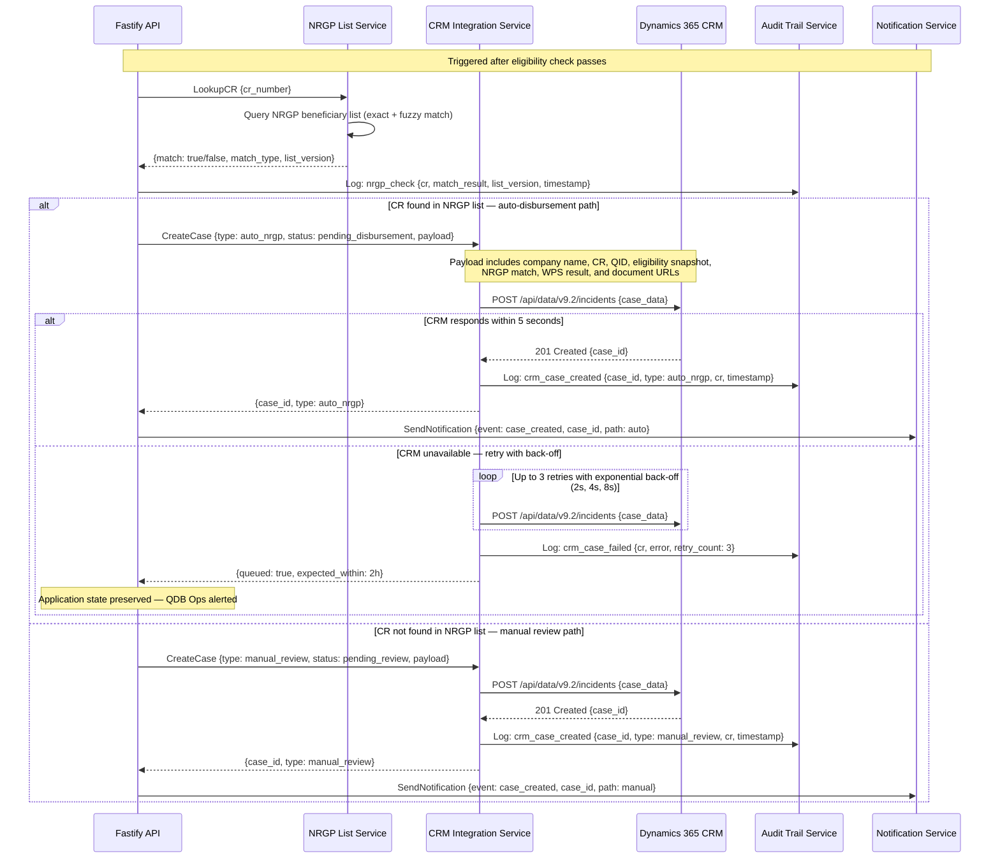

---

## 6. End-to-End Data Flow

This diagram shows how data moves through the system from the moment an applicant starts to the
point their case is ready for disbursement in Dynamics CRM.

```mermaid
flowchart TD
    A["SME Owner visits portal"] --> B{"Language selected?"}
    B -->|"Arabic"| C["Load Arabic RTL layout"]
    B -->|"English"| D["Load English LTR layout"]
    C --> E["NAS OIDC redirect"]
    D --> E

    E --> F{"NAS auth result?"}
    F -->|"Success"| G["QID extracted from ID Token<br/>Portal session created<br/>Audit: auth_success"]
    F -->|"Failure"| Z1["Error displayed — no session<br/>Application ends"]

    G --> H["SME enters CR number"]
    H --> I["MOCI API query — company data retrieved"]
    I --> J{"CR status?"}
    J -->|"Active + signatory OK"| K["Company data displayed (read-only)<br/>Audit: cr_lookup_success"]
    J -->|"Inactive"| Z2["Application blocked<br/>Audit: cr_lookup_failed"]
    J -->|"Signatory mismatch"| Z3["Blocked or declaration captured<br/>Audit: signatory_check"]

    K --> L["Eligibility Engine runs EC-001 through EC-007"]
    L --> M{"All criteria pass?"}
    M -->|"No"| Z4["Ineligible result — reason codes shown<br/>Email notification sent<br/>Audit: eligibility_result"]
    M -->|"Yes"| N["Duplicate check — same CR in current period?"]
    N -->|"Duplicate"| Z5["Existing case referenced<br/>No new application created"]
    N -->|"No duplicate"| O["NRGP list lookup by CR number"]

    O --> P{"NRGP match?"}
    P -->|"Yes — returning beneficiary"| Q["CRM: auto_nrgp case<br/>status: pending_disbursement"]
    P -->|"No — new applicant"| R["CRM: manual_review case<br/>status: pending_review"]

    Q --> S["Document upload step"]
    R --> S

    S --> T["Files virus scanned<br/>Format + size validated<br/>AES-256 encrypted to S3"]
    T --> U["WPS validation — API query + CSV cross-check"]
    U --> V{"WPS result?"}
    V -->|"Pass"| W["WPS validated<br/>Audit: wps_validation pass"]
    V -->|"Discrepancy"| X["WPS discrepancy flag set on CRM case<br/>Non-blocking warning shown<br/>Audit: wps_validation discrepancy"]
    V -->|"Unavailable"| Y["WPS fallback flag — manual salary verification<br/>Audit: wps_api_fallback"]

    W --> AA["Applicant clicks Submit"]
    X --> AA
    Y --> AA

    AA --> BB["Audit trail finalised<br/>All events written transactionally"]
    BB --> CC["CRM case updated with document URLs + WPS result"]
    CC --> DD["Email + SMS notification sent in applicant language"]
    DD --> EE["Applicant monitors status via portal<br/>Portal polls CRM every 5 minutes"]

    style G fill:#36b37e,color:#fff
    style K fill:#36b37e,color:#fff
    style Q fill:#4c9aff,color:#fff
    style R fill:#6554c0,color:#fff
    style EE fill:#36b37e,color:#fff
    style Z1 fill:#ff6b6b,color:#fff
    style Z2 fill:#ff6b6b,color:#fff
    style Z3 fill:#ff991f,color:#fff
    style Z4 fill:#ff6b6b,color:#fff
    style Z5 fill:#ff991f,color:#fff
```

---

## 7. Data Model — ER Diagram

The planned PostgreSQL data model for the production system. All tables use UUID primary keys
except `audit_events` which uses sequential IDs for ordered export.

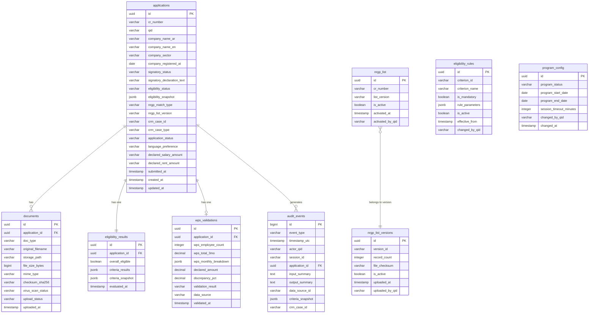

---

## 8. Application State Machine

An application moves through a defined set of states from draft to final outcome. State
transitions are enforced by the API and recorded in the audit trail at every step.

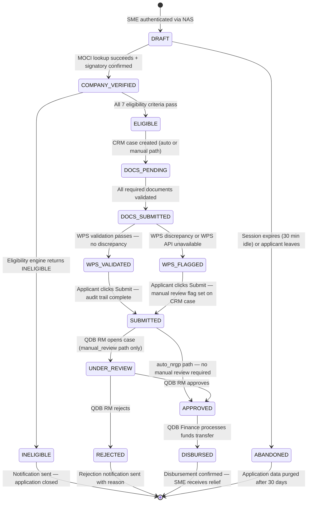

---

## 9. Security Architecture

### 9.1 Authentication and Session Management

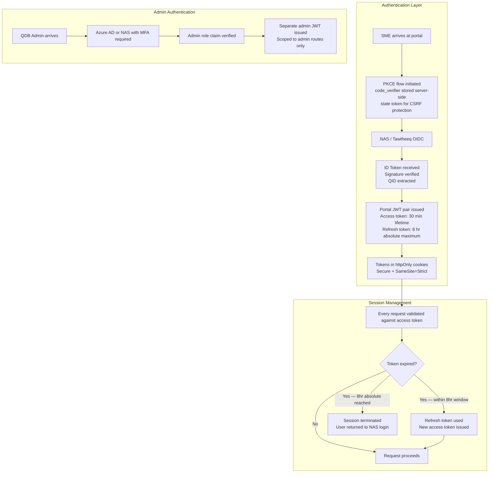

### 9.2 Document Security Model

| Layer | Control | Implementation |
|-------|---------|----------------|
| Transport | TLS 1.3 minimum | All HTTP requests rejected and redirected to HTTPS |
| Storage encryption | AES-256 at rest | Applied before write, verified on read |
| Key management | KMS — not co-located with data | Keys rotated per KMS policy |
| Access URLs | Signed, time-limited | 1-hour expiry; scoped to requesting user's case |
| Virus scanning | Pre-activation scan | Files quarantined on detection; applicant notified |
| Retention | Enforced at storage tier | 7-year minimum per QDB policy and Qatar PDPA |
| Role-based access | Applicant: own docs only | QDB staff: all docs by case; Audit: read-only export |

### 9.3 Audit Trail Integrity

The audit trail is a core compliance requirement for a government-administered financial relief
program. Its integrity is enforced at multiple levels.

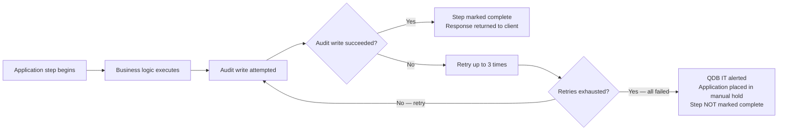

Database-level protections on `audit_events`:

- `REVOKE UPDATE, DELETE ON audit_events FROM application_role` — the application service account
  cannot modify or delete audit records
- Only the append-only writer role holds INSERT permissions
- Any direct UPDATE or DELETE attempt against the audit table triggers a monitoring alert
- Full export available to the Compliance Officer via admin API as JSON or CSV, in chronological
  order with criteria snapshots

### 9.4 Rate Limiting and Fraud Controls

| Control | Rule | Enforcement |
|---------|------|-------------|
| Application rate limit | Max 3 attempts per CR per 24 hours | API-level rate limiter keyed on CR number |
| Duplicate detection | One active application per CR per program period | Eligibility engine check before NRGP lookup |
| Document URL forgery | Signed URLs with 1-hour TTL | S3 pre-signed URL with HMAC signature |
| Admin brute force | MFA required; account lockout after 5 failed attempts | Azure AD or NAS policy |
| Session fixation | New session ID issued after NAS auth callback | PKCE state parameter invalidated after use |
| CR format injection | Strict 10-digit numeric validation | Client and API-level schema validation |

### 9.5 Qatar PDPA Compliance

| Requirement | Implementation |
|-------------|----------------|
| Data minimisation | MOCI company data not persisted beyond session; only summary stored in DB |
| Purpose limitation | Data collected solely for NRGP application processing |
| Retention limits | 7-year minimum; automated purge policy after retention period |
| Data subject access | Applicant can view own application data and status via the portal |
| Consent | Explicit consent captured at application start and recorded in audit trail |
| Cross-border transfers | All data stored within Qatar or QDB-approved jurisdiction |
| PDPA impact assessment | Required before production launch (NFR-011) — must be signed off by DPO |
