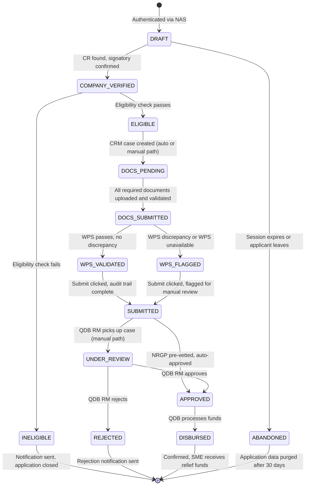
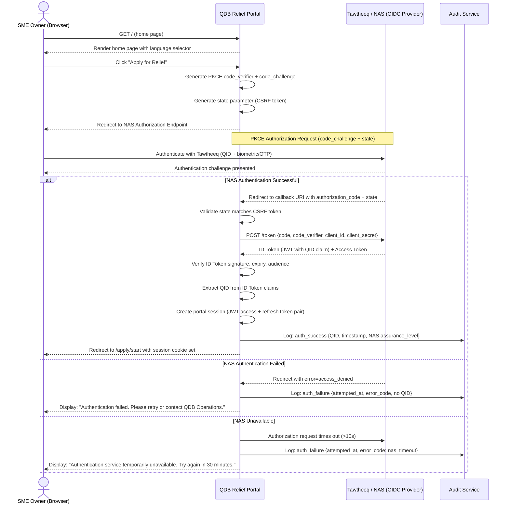
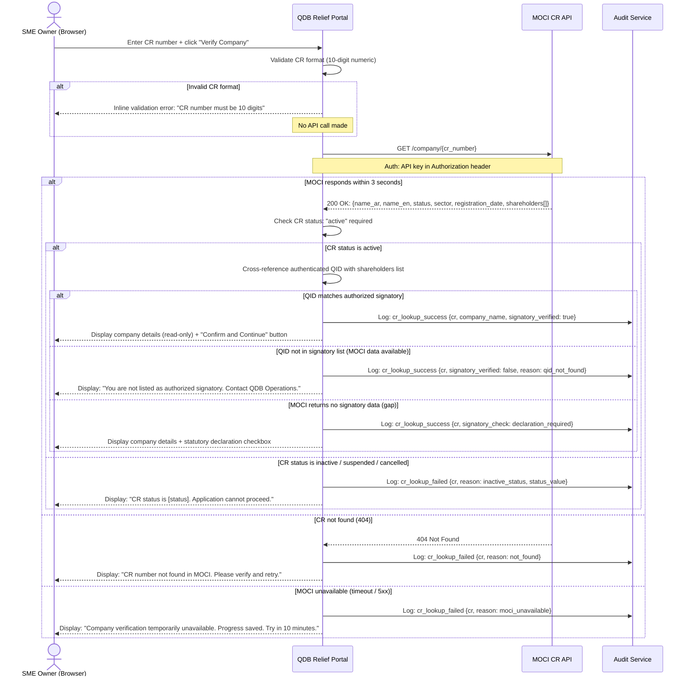
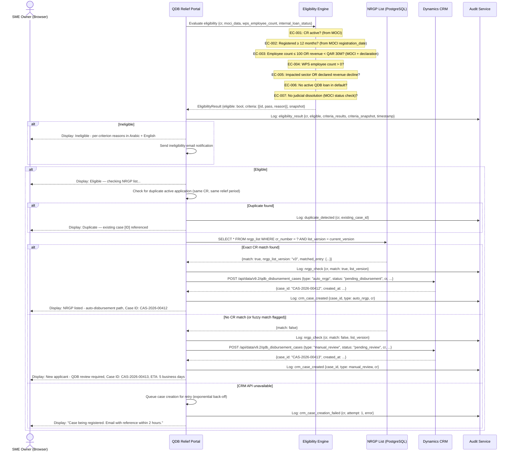
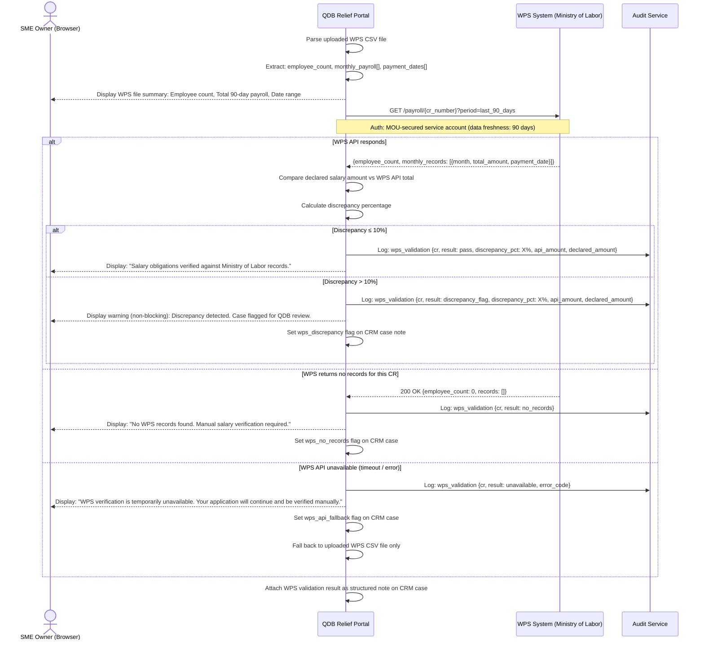
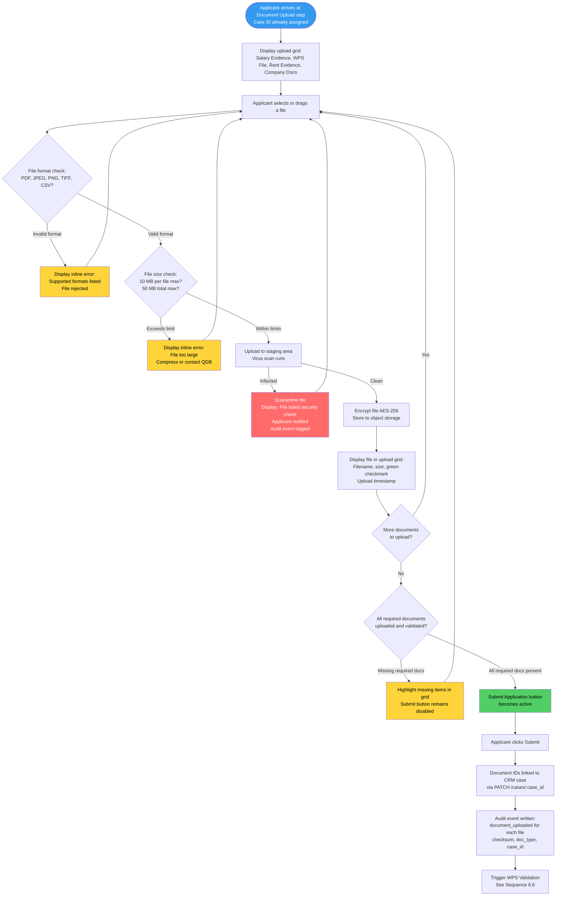

# QDB SME Relief Portal — Product Requirements Document

**Product**: QDB SME Relief Portal
**Version**: 1.0
**Date**: March 3, 2026
**Classification**: Confidential — QDB Internal Use Only
**Author**: ConnectSW Product Manager
**Status**: Final Draft — Ready for Architecture Review

---

## Table of Contents

1. [Product Overview](#1-product-overview)
2. [User Personas](#2-user-personas)
3. [User Stories and Acceptance Criteria](#3-user-stories-and-acceptance-criteria)
4. [Functional Requirements](#4-functional-requirements)
5. [Non-Functional Requirements](#5-non-functional-requirements)
6. [Mermaid Diagrams](#6-mermaid-diagrams)
7. [Integration Specifications](#7-integration-specifications)
8. [Acceptance Criteria Summary](#8-acceptance-criteria-summary)
9. [Site Map](#9-site-map)
10. [Out of Scope](#10-out-of-scope)
11. [Open Questions and Assumptions Requiring Resolution](#11-open-questions-and-assumptions-requiring-resolution)
12. [Traceability Matrix](#12-traceability-matrix)

---

## 1. Product Overview

### 1.1 Product Name

**QDB SME Relief Portal**

### 1.2 One-Line Description

An emergency financing portal that enables Qatari SMEs affected by geopolitical disruption to apply for relief under the National Relief and Guarantee Program (NRGP), with automated eligibility checking, WPS-validated salary verification, and direct routing into QDB's Dynamics CRM case management system.

### 1.3 Business Context

**The problem**: Qatar's SME sector is experiencing acute cash flow stress due to the Iran-Israel geopolitical conflict. Trade routes are disrupted, supply chains fragmented, and regional demand suppressed. Affected SMEs face simultaneous fixed obligations: salary payments legally mandated under Qatar's Wage Protection System (WPS) and commercial lease obligations. Without emergency financing, these businesses face WPS violations (QAR 6,000 per employee per late cycle), lease defaults, and closure.

**The program**: The National Relief and Guarantee Program (NRGP) is an existing QDB financing instrument with board-level approval, an active beneficiary list from prior activations (COVID-19), and pre-negotiated guarantee structures. QDB is not creating a new product — it is digitising delivery of an approved, standing program under an emergency activation mandate.

**The portal's purpose**: A structured digital workflow replaces a manual, paper-heavy process that takes 15–30 business days to process a single application. The portal authenticates applicants via Tawtheeq (Qatar's National Authentication Service), retrieves verified company data from the Ministry of Commerce and Industry (MOCI), evaluates eligibility automatically against NRGP rules, validates salary obligations against WPS payroll records, and routes disbursement requests — automatically for returning NRGP beneficiaries, or for manual QDB review for new applicants — into Microsoft Dynamics CRM.

**Urgency**: Every month of delay exposes SMEs to WPS violations and irreversible business harm. A 6–8 week delivery target is required.

### 1.4 Target Users

- SME owners or authorized signatories of Qatar-registered companies with active Tawtheeq accounts
- QDB Relationship Managers reviewing manual disbursement cases in Dynamics CRM
- QDB Administrators managing eligibility rules, the NRGP list, and program lifecycle

### 1.5 Success Metrics

| Metric | Target |
|--------|--------|
| Auto-disbursement path end-to-end time | < 1 business day from submission to CRM case creation |
| Manual review path processing time | < 5 business days from submission to QDB decision |
| Document re-submission rate | < 10% (down from 40–60% manual) |
| Eligible applications processed per week | 500+ (up from ~20 manual) |
| NAS authentication success rate | > 98% |
| MOCI API success rate | > 99.5% |
| WPS validation completion rate | > 95% of submitted applications |
| CRM case creation failure rate | < 0.1% |
| Portal uptime during program window | > 99.5% |
| Duplicate application detection rate | 100% |
| Audit trail completeness | 100% of application steps logged |
| Applicant satisfaction score | > 4.0 / 5.0 |

---

## 2. User Personas

### Persona 1: Khalid — SME Owner (Primary Applicant)

- **Role**: Owner and authorized signatory of a mid-size Qatari trading company (25–60 employees). Also represents the financial controller archetype at larger SMEs who delegates submission.
- **Demographics**: Qatari national or long-term resident. Operates primarily in Arabic. May have limited experience with government digital portals.
- **Goals**:
  - Access emergency financing before the next salary cycle to avoid WPS violations
  - Understand eligibility quickly without waiting days for a QDB response
  - Submit all required documents in a single sitting without needing to revisit
  - Track application status without calling QDB
- **Pain Points (current)**:
  - No clarity on whether his business qualifies before investing hours in paperwork
  - Multiple back-and-forth email rounds with QDB for missing documents
  - No visibility on application status; must phone QDB to get updates
  - English-only portal creates friction for Arabic-preferring users
- **Usage Context**: Applies once, via desktop or laptop, during business hours. Returns to the portal 1–3 times to check status and receive notifications. Motivated by urgency — a salary deadline is approaching.
- **Key Need**: A fast, clear, Arabic-language portal that tells him upfront whether he qualifies, guides him to upload the right documents the first time, and then keeps him informed.

### Persona 2: Fatima — QDB Relationship Manager

- **Role**: Senior RM responsible for reviewing manual disbursement cases for SMEs not on the existing NRGP list. Reviews cases in Dynamics CRM. Makes recommendations to Credit Risk for borderline cases.
- **Goals**:
  - Access complete application information (company data, eligibility result, documents, WPS validation) in one CRM view without going back to the applicant
  - Process cases quickly to meet program throughput targets
  - Identify and escalate cases with discrepancies (WPS mismatches, incomplete documents)
- **Pain Points (current)**:
  - Currently receives email bundles of scanned documents; manual data entry into CRM
  - Frequently contacts applicants to request missing items
  - No structured audit trail to rely on for compliance reporting
- **Usage Context**: Uses Dynamics CRM daily. Does not log into the portal directly — views portal-created case records and linked documents.
- **Key Need**: CRM cases that arrive with all information pre-populated, correctly routed, and flagged for any WPS or document discrepancies requiring her attention.

### Persona 3: Mohammed — QDB Admin / Program Manager

- **Role**: QDB Operations lead responsible for the NRGP activation. Manages eligibility rule configuration, uploads updated NRGP beneficiary lists, monitors application volumes, and enforces the program lifecycle (open/close).
- **Goals**:
  - Update eligibility rules if QDB policy changes during the program window — without requesting a code deployment
  - See real-time dashboard of application volumes, statuses, and processing bottlenecks
  - Upload a new NRGP beneficiary list when QDB operations provides an updated version
  - Close the program on the agreed end date and confirm no new applications enter after that point
- **Pain Points (current)**:
  - Eligibility changes require IT involvement and delay; no admin interface
  - No consolidated view of the program — must query multiple spreadsheets and email trails
  - No automated program sunset; risk of unauthorized applications after the window closes
- **Usage Context**: Logs into a QDB admin section of the portal. Uses it primarily for configuration, monitoring, and lifecycle management — not applicant-facing tasks.
- **Key Need**: An admin interface that gives him full control of program parameters without requiring engineering.

---

## 3. User Stories and Acceptance Criteria

### Authentication Flow (BN-001)

---

**US-01** — Tawtheeq Login
> As an SME owner, I want to log in with my existing Tawtheeq account so that I do not need to create a new credential to access the QDB relief portal.

**Priority**: P0
**Maps to**: BN-001, FR-001

**Acceptance Criteria**:
- **Given** a user visits the portal home page and clicks "Apply for Relief",
  **When** they are redirected to NAS/Tawtheeq and complete authentication successfully,
  **Then** the portal receives the QID claim, establishes a session, and lands the user on the application start page.
- **Given** a user fails NAS authentication (wrong credentials, locked account),
  **When** they return to the portal after a failed NAS attempt,
  **Then** the portal displays a clear message: "Authentication failed. Please retry Tawtheeq login or contact QDB Operations at [phone]." No partial session is created.
- **Given** a user does not have a Tawtheeq account,
  **When** they land on the portal and select "I don't have a Tawtheeq account",
  **Then** the portal displays guided instructions for NAS registration and a QDB Operations contact for assisted onboarding.
- **Given** NAS/Tawtheeq is temporarily unavailable,
  **When** the portal attempts to initiate the OIDC flow and receives a timeout or error,
  **Then** the portal displays: "The national authentication service is temporarily unavailable. Please try again in 30 minutes or contact QDB Operations." No session is created and no sensitive data is exposed.

---

**US-02** — Session Management and Logout
> As an SME owner, I want my portal session to remain active while I am completing my application and to expire automatically after inactivity so that my company data is not left exposed on a shared device.

**Priority**: P0
**Maps to**: BN-001, FR-001

**Acceptance Criteria**:
- **Given** an authenticated user is active in the portal,
  **When** they perform any action (page navigation, form input, file upload),
  **Then** the session timer resets and they remain authenticated.
- **Given** an authenticated user has been idle for 30 minutes,
  **When** the inactivity timer expires,
  **Then** the portal displays a "Session expiring in 2 minutes" warning with an option to extend. If not extended, the session is terminated, the user is redirected to the login page, and application progress saved to that point is persisted.
- **Given** an authenticated user clicks "Logout",
  **When** the logout action is confirmed,
  **Then** the portal invalidates the session token, clears all session data from the browser, logs the logout event to the audit trail, and redirects to the portal home page.
- **Given** a user attempts to access a protected page without a valid session,
  **When** the request is made,
  **Then** the user is redirected to the NAS login flow and returned to their intended page after successful authentication.

---

### Company Verification Flow (BN-002)

---

**US-03** — Enter CR Number and Fetch MOCI Data
> As an SME owner, I want to enter my Commercial Registration number and have the system retrieve my verified company details from MOCI so that I do not need to manually type company information that could introduce errors.

**Priority**: P0
**Maps to**: BN-002, FR-002

**Acceptance Criteria**:
- **Given** an authenticated user enters a valid, active 10-digit CR number,
  **When** they click "Verify Company",
  **Then** the portal queries the MOCI API within 3 seconds and displays: company name (Arabic and English), CR status (active), sector classification, and registration date.
- **Given** an authenticated user enters a CR number that does not exist in MOCI,
  **When** they click "Verify Company",
  **Then** the portal displays: "This CR number was not found in MOCI records. Please verify the number and try again. If the issue persists, contact MOCI at [link]." The field is cleared and ready for re-entry.
- **Given** an authenticated user enters a CR number for a company with inactive, suspended, or cancelled status,
  **When** MOCI returns the record,
  **Then** the portal displays: "Your company's CR status is [status] and is not eligible for NRGP relief. If this is incorrect, please contact MOCI." The application cannot proceed.
- **Given** the MOCI API is unavailable at the time of lookup,
  **When** the API request times out or returns an error,
  **Then** the portal displays: "Company verification is temporarily unavailable. Please try again in 10 minutes. Your progress has been saved." The portal does not allow manual entry of company details as a bypass.
- **Given** a valid CR number is fetched successfully,
  **When** the user reviews the company details,
  **Then** all displayed fields are read-only; the user cannot modify MOCI-sourced company data.

---

**US-04** — Confirm Authorized Signatory Status
> As an SME owner, I want the system to confirm that I am an authorized signatory for the CR I have entered so that the application is legally valid and I am not inadvertently submitting on behalf of a company I do not represent.

**Priority**: P0
**Maps to**: BN-002, BN-008, FR-002

**Acceptance Criteria**:
- **Given** a user has successfully fetched company data for CR-X,
  **When** the portal cross-references the authenticated QID against the MOCI signatory list for CR-X,
  **Then** if the QID matches an authorized signatory, the user proceeds to the eligibility step without additional friction.
- **Given** the MOCI signatory data does not include the authenticated QID for CR-X,
  **When** the check fails,
  **Then** the portal displays: "You are not listed as an authorized signatory for this company in MOCI records. If you are authorized, please contact QDB Operations with your authorization documentation." The application is blocked.
- **Given** MOCI does not return signatory data (data gap),
  **When** the check cannot be completed automatically,
  **Then** the portal prompts the user to make a statutory declaration: "I confirm that I am legally authorized to submit this application on behalf of [Company Name]." The declaration is captured in the audit trail with timestamp and QID. The portal proceeds but flags the case for QDB authorization verification.
- **Given** any company authorization event occurs,
  **When** the result is determined,
  **Then** the audit trail records: QID, CR number, check result, data source, timestamp.

---

### Eligibility Check Flow (BN-003)

---

**US-05** — Automatic Eligibility Evaluation
> As an SME owner, I want the system to automatically evaluate my company's eligibility for NRGP relief immediately after company verification so that I know whether to proceed before investing time in document preparation.

**Priority**: P0
**Maps to**: BN-003, FR-003

**Acceptance Criteria**:
- **Given** company verification is complete and the authorized signatory check passes,
  **When** the eligibility engine runs,
  **Then** all six eligibility criteria (EC-001 through EC-006) are evaluated in sequence and a pass/fail result is produced within 5 seconds.
- **Given** the eligibility engine produces an ELIGIBLE result,
  **When** the result is displayed,
  **Then** the user sees a clear "Eligible" confirmation and is automatically advanced to the NRGP list check step.
- **Given** the eligibility engine produces an INELIGIBLE result,
  **When** the result is displayed,
  **Then** the portal shows each failed criterion with a plain-language reason in both Arabic and English, a reference to the relevant NRGP policy section, and contact details for QDB to discuss borderline cases.
- **Given** any eligibility evaluation,
  **When** the result is determined,
  **Then** the audit trail records: CR number, evaluation timestamp, criteria snapshot (the exact rule values in effect at evaluation time), and each criterion result (pass/fail with reason).

---

**US-06** — View Eligibility Result with Reason Codes
> As an SME owner, I want to see a detailed eligibility result with specific reason codes so that I understand exactly why my application was accepted or rejected and what action I can take.

**Priority**: P0
**Maps to**: BN-003, BN-009, FR-003

**Acceptance Criteria**:
- **Given** an ineligible result is returned,
  **When** the result page renders,
  **Then** each failed criterion is presented with:
  - A short reason code (e.g., ELIG-003: Company age below 12 months)
  - A plain-language explanation in both Arabic and English
  - The specific MOCI or WPS data value that caused the failure
  - A recommended action if one exists
- **Given** the eligibility result is displayed,
  **When** the user refreshes or returns to the page,
  **Then** the result persists for the duration of the session and is accessible via the application status page.
- **Given** an eligible result is returned,
  **When** the result page renders,
  **Then** the page shows a summary of criteria passed and moves the user forward automatically — it does not require a manual "Continue" click on the eligibility result page.

---

**US-07** — Admin Configures Eligibility Criteria
> As a QDB Admin, I want to update eligibility criteria through the admin interface without requiring a code deployment so that policy changes can be reflected on the same day QDB Credit Risk approves them.

**Priority**: P2
**Maps to**: BN-016, FR-003

**Acceptance Criteria**:
- **Given** a QDB Admin is authenticated to the admin dashboard,
  **When** they navigate to "Eligibility Rules",
  **Then** they see a list of all active criteria (EC-001 through EC-007) with their current values and effective dates.
- **Given** a QDB Admin modifies a criterion value (e.g., changes minimum company age from 12 to 6 months),
  **When** they save the change,
  **Then** the new rule takes effect for all subsequent eligibility evaluations. Evaluations already completed are not retroactively affected. The change is recorded in the audit trail with the admin's identity and timestamp.
- **Given** a QDB Admin attempts to delete a mandatory criterion (EC-001, EC-002, EC-004),
  **When** they attempt the deletion,
  **Then** the system prevents the action and displays: "This criterion is mandatory under NRGP policy and cannot be removed."
- **Given** any criterion change is saved,
  **When** the save is confirmed,
  **Then** a confirmation email is sent to the admin's QDB email address listing the change details for record-keeping.

---

### NRGP Check and Disbursement Routing Flow (BN-004, BN-005)

---

**US-08** — NRGP List Match — Auto Disbursement Path
> As a QDB Operations Officer, I want auto-disbursement CRM cases to be created automatically for eligible NRGP-listed companies so that pre-vetted applicants receive relief with minimal QDB intervention.

**Priority**: P0
**Maps to**: BN-004, FR-004, FR-005

**Acceptance Criteria**:
- **Given** an eligible company's CR number is found in the NRGP beneficiary list,
  **When** the NRGP check completes,
  **Then** the portal creates a CRM case of type `auto_nrgp` with status `pending_disbursement` and the CRM Case ID is returned to the portal within 5 seconds.
- **Given** the auto-disbursement CRM case is created,
  **When** the case is queried in Dynamics CRM,
  **Then** it contains: company name, CR number, QID, NRGP list match confirmation, eligibility result snapshot, timestamp, and a placeholder for document IDs (to be populated after upload).
- **Given** the CRM case ID is returned,
  **When** the portal displays the next step to the applicant,
  **Then** the applicant sees their CRM Case ID as their application reference number and is directed to the document upload step.
- **Given** the CRM API is unavailable at the time of case creation,
  **When** the API returns an error or times out,
  **Then** the portal retries up to 3 times with exponential back-off. If all retries fail, the application state is stored in the portal database and a QDB Operations alert is triggered. The applicant is shown: "Your case is being registered. You will receive an email with your case reference within 2 hours."

---

**US-09** — NRGP List No Match — Manual Review Path
> As a QDB Relationship Manager, I want manual review CRM cases to arrive with all application data and supporting context pre-populated so that I can make an informed decision without contacting the applicant for basic information.

**Priority**: P0
**Maps to**: BN-005, FR-004, FR-005

**Acceptance Criteria**:
- **Given** an eligible company's CR number is NOT found in the NRGP beneficiary list,
  **When** the NRGP check completes,
  **Then** the portal creates a CRM case of type `manual_review` with status `pending_review` and the CRM Case ID is returned to the portal.
- **Given** the manual review CRM case is created,
  **When** a QDB Relationship Manager opens it in Dynamics CRM,
  **Then** the case shows: company name, CR number, MOCI company data (sector, registration date, shareholder summary), eligibility criteria result for each criterion, WPS validation result, and links to all uploaded documents.
- **Given** the CRM case ID is returned to the portal,
  **When** the applicant views their application summary,
  **Then** they see a message explaining: "Your application is assigned to a QDB Relationship Manager for review. Expected review time is 5 business days. Your case reference is [CASE-ID]."

---

### Document Upload Flow (BN-006, BN-007)

---

**US-10** — Upload Salary Payment Evidence
> As an SME owner, I want to upload salary payment evidence so that QDB has proof of my payroll obligations and can calculate the correct salary relief amount.

**Priority**: P0
**Maps to**: BN-006, FR-006

**Acceptance Criteria**:
- **Given** an applicant is on the document upload step,
  **When** they upload a salary payment evidence file (bank transfer confirmation, payroll run report),
  **Then** the portal accepts PDF, JPEG, PNG, and TIFF formats up to 10 MB per file. Files larger than 10 MB are rejected with a clear size error.
- **Given** a salary evidence file is uploaded successfully,
  **When** the upload completes,
  **Then** the portal displays a thumbnail or filename, an upload status indicator ("Uploaded"), and a checksum confirmation. The file is stored in encrypted document storage under `{case_id}/salary_evidence/`.
- **Given** a salary evidence file upload fails (network error, unsupported format),
  **When** the failure occurs,
  **Then** the portal displays a specific error message (e.g., "File format not supported. Please upload PDF, JPEG, PNG, or TIFF") and allows immediate retry without losing other uploaded files.
- **Given** an applicant uploads multiple salary evidence files,
  **When** the upload step is complete,
  **Then** all files appear in a list with individual status indicators. The applicant can remove any file before final submission.

---

**US-11** — Upload WPS File for Salary Validation
> As an SME owner, I want to upload my WPS payroll file so that the system can cross-validate my salary claims against Ministry of Labor records.

**Priority**: P0
**Maps to**: BN-007, FR-006, FR-007

**Acceptance Criteria**:
- **Given** an applicant is on the document upload step,
  **When** they upload a WPS file,
  **Then** the portal accepts the WPS-standard CSV format and rejects any other format with a message: "Please upload the WPS file in the standard Ministry of Labor CSV format."
- **Given** a valid WPS file is uploaded,
  **When** the file is processed,
  **Then** the portal parses the file, displays a summary: employee count, total monthly payroll figure (last 90 days), and earliest/latest payment date in the file. The applicant can confirm or flag a discrepancy before proceeding.
- **Given** the WPS file data differs from the live WPS API query by more than 10%,
  **When** the discrepancy is detected,
  **Then** the CRM case is flagged with a `wps_discrepancy` note and the applicant is shown a warning (not a block): "There is a discrepancy between your uploaded WPS file and Ministry of Labor records. Your application will continue but will be flagged for QDB review."
- **Given** no WPS file is provided by the applicant,
  **When** the system attempts WPS validation via the WPS API,
  **Then** if the API is available, validation proceeds automatically using API data. If unavailable, the case is flagged for manual salary verification and the applicant is notified.

---

**US-12** — Upload Rent Payment Evidence
> As an SME owner, I want to upload rent payment evidence so that QDB can calculate the rent relief component of my application.

**Priority**: P0
**Maps to**: BN-006, FR-006

**Acceptance Criteria**:
- **Given** an applicant is on the document upload step,
  **When** they upload rent evidence (lease agreement, rent payment receipts, landlord invoice),
  **Then** the portal accepts PDF, JPEG, PNG, and TIFF formats up to 10 MB per file, stores files under `{case_id}/rent_evidence/`, and displays upload confirmation.
- **Given** an applicant uploads both a lease agreement and payment receipts,
  **When** both are uploaded,
  **Then** both appear in the rent evidence section with individual status indicators.
- **Given** an applicant indicates they do not have a commercial lease (e.g., home-based business),
  **When** they skip the rent evidence section,
  **Then** the portal allows the application to proceed and sets the rent relief component to QAR 0 on the CRM case.

---

**US-13** — Upload Company Documents
> As an SME owner, I want to upload my commercial registration copy and business licenses so that QDB has the official documentation to support my application.

**Priority**: P0
**Maps to**: BN-006, FR-006

**Acceptance Criteria**:
- **Given** an applicant is on the document upload step,
  **When** they upload a CR copy (scanned PDF or JPEG),
  **Then** the portal validates the format, stores the file under `{case_id}/company_docs/`, and displays a confirmation. Files under 10 MB are accepted.
- **Given** an applicant uploads additional business licenses,
  **When** they upload up to 5 license files,
  **Then** all files are accepted, individually listed, and linked to the CRM case.
- **Given** the total document upload package for a single application exceeds 50 MB,
  **When** the applicant attempts to add another file that would breach the limit,
  **Then** the portal displays: "Your total upload package has reached the 50 MB limit. Please compress files or contact QDB Operations for assistance."

---

**US-14** — View Upload Status and Validation Results
> As an SME owner, I want to see the status of each uploaded document so that I know which uploads were accepted and which need to be retried before I submit.

**Priority**: P0
**Maps to**: BN-006, BN-011, FR-006

**Acceptance Criteria**:
- **Given** a document has been uploaded successfully,
  **When** the applicant views the upload section,
  **Then** each successfully uploaded document shows a green checkmark, the filename, upload timestamp, and file size.
- **Given** a document has failed validation (wrong format, too large, virus detected),
  **When** the applicant views the upload section,
  **Then** the failed document shows a red error icon, the filename, and a specific error message. The "Submit Application" button is disabled until all required documents have passed validation.
- **Given** an optional document category has no uploads,
  **When** the applicant views the upload section,
  **Then** the optional category shows as "Not provided" with a neutral indicator. The application can still be submitted.
- **Given** all required documents are uploaded and validated,
  **When** the applicant views the upload section,
  **Then** the "Submit Application" button becomes active and a checklist summary is displayed.

---

### WPS Validation Flow (BN-007)

---

**US-15** — System Validates WPS File Format and Data
> As a QDB Credit Officer, I want the portal to validate salary obligations against WPS data automatically so that relief amounts are anchored to Ministry of Labor payroll records and cannot be inflated.

**Priority**: P0
**Maps to**: BN-007, FR-007

**Acceptance Criteria**:
- **Given** the portal initiates a WPS API query for a given CR number,
  **When** the WPS system responds,
  **Then** the portal retrieves: employee count, total monthly payroll (last 90 days), per-month breakdown, and payment dates. This data is no older than 90 days (BR-010).
- **Given** WPS API data is returned,
  **When** the data is compared to the applicant's declared salary relief amount,
  **Then** if the declared amount is within 10% of the WPS figure, validation passes. If the discrepancy exceeds 10%, a `wps_discrepancy` flag is set on the CRM case.
- **Given** the WPS API returns no records for the CR number,
  **When** the query completes,
  **Then** the portal flags the case with `wps_no_records` and sets a manual salary verification requirement on the CRM case. The application is not blocked.
- **Given** WPS validation completes (pass, flag, or no records),
  **When** the result is written,
  **Then** the audit trail records: CR number, WPS query timestamp, WPS response summary, declared amount, discrepancy percentage (if applicable), and validation outcome.

---

**US-16** — View WPS Validation Results and Discrepancies
> As an SME owner, I want to see the WPS validation result so that I understand how my declared salary amount compares to Ministry of Labor records and can address any discrepancy before final submission.

**Priority**: P1
**Maps to**: BN-007, BN-009, FR-007

**Acceptance Criteria**:
- **Given** WPS validation has run,
  **When** the applicant reaches the WPS result step,
  **Then** they see: WPS-validated employee count, WPS-validated total payroll (last 3 months), their declared salary amount, and a comparison showing whether the amounts match or differ.
- **Given** a WPS discrepancy flag is set,
  **When** the applicant views the WPS result,
  **Then** the portal shows a non-blocking warning with a plain-language explanation: "There is a difference between your declared salary amount and Ministry of Labor records. Your application will proceed but will be reviewed by a QDB officer."
- **Given** WPS validation passes without discrepancy,
  **When** the applicant views the WPS result,
  **Then** the portal shows a confirmation: "Your salary obligations have been verified against Ministry of Labor records."

---

### Application Status Flow (BN-009)

---

**US-17** — View Application Status and History
> As an SME owner, I want to see my application status and a log of key events so that I know exactly where my application is in the process without needing to contact QDB.

**Priority**: P1
**Maps to**: BN-009, FR-008

**Acceptance Criteria**:
- **Given** an applicant has submitted an application,
  **When** they log into the portal and navigate to "My Application",
  **Then** they see: case reference number, current status, status change history (chronological list of status events with timestamps), and the expected next step.
- **Given** the application status is updated in Dynamics CRM (by a QDB RM),
  **When** the applicant next views their status page,
  **Then** the portal reflects the updated CRM status within 5 minutes of the CRM update. Status labels are displayed in both Arabic and English.
- **Given** a status of "Rejected" is displayed,
  **When** the applicant views their status,
  **Then** the portal shows the rejection reason (provided by the QDB RM in CRM) and next steps (e.g., appeal contact).
- **Given** a status of "Disbursed" is displayed,
  **When** the applicant views their status,
  **Then** the portal shows the disbursement confirmation and directs the applicant to contact their QDB relationship manager for bank transfer details.

---

**US-18** — Receive Notifications on Status Changes
> As an SME owner, I want to receive email and SMS notifications when my application status changes so that I am informed without having to poll the portal.

**Priority**: P1
**Maps to**: BN-012, FR-009

**Acceptance Criteria**:
- **Given** an application status changes in the system (submitted, under review, approved, rejected, disbursed),
  **When** the status change event fires,
  **Then** the portal sends a notification via email and (if mobile number provided) SMS within 5 minutes of the status change.
- **Given** a notification is sent,
  **When** the notification is delivered,
  **Then** the message includes: applicant name, company name, case reference, new status, plain-language description of what the status means, and a link to the status page in the portal.
- **Given** a notification is sent in Arabic,
  **When** the applicant's language preference is Arabic,
  **Then** the email and SMS are delivered in Arabic with correct RTL text direction in the email body.
- **Given** a notification delivery fails (invalid email, network error),
  **When** the failure is detected,
  **Then** the failure is logged, a retry is scheduled after 10 minutes, and after 3 failed attempts the case is flagged for QDB Operations manual outreach.

---

### QDB Management (BN-013)

---

**US-19** — QDB Dashboard — View All Applications
> As a QDB Operations Manager, I want a dashboard showing all applications with their current status, submission time, and processing timelines so that I can manage team capacity and report program progress to the QDB board.

**Priority**: P1
**Maps to**: BN-013, FR-011

**Acceptance Criteria**:
- **Given** a QDB Admin is authenticated to the admin dashboard,
  **When** they view the Applications Overview panel,
  **Then** they see a table of all applications with columns: Case ID, Company Name, CR Number, Submission Date, Current Status, CRM Case Type (auto/manual), and Days Since Submission.
- **Given** the dashboard is loaded,
  **When** an admin filters by status (all, under review, approved, rejected, disbursed),
  **Then** the table filters in real time and displays a count of records matching the filter.
- **Given** the dashboard displays application data,
  **When** an admin views the KPI summary panel,
  **Then** they see: total applications submitted, count by status, average processing time (auto vs. manual paths), document re-submission rate, and WPS discrepancy rate.
- **Given** an admin clicks on a specific application row,
  **When** the detail view opens,
  **Then** they see the full application timeline, eligibility result, NRGP list match result, document upload status, WPS validation result, and a link to the corresponding CRM case.

---

**US-20** — QDB Admin — Upload and Update NRGP List
> As a QDB Admin, I want to upload an updated NRGP beneficiary list through the admin interface so that the system immediately uses the latest list for all subsequent applications.

**Priority**: P1
**Maps to**: BN-013, FR-004, FR-011

**Acceptance Criteria**:
- **Given** a QDB Admin is on the "NRGP List Management" admin page,
  **When** they upload a new NRGP list file (CSV format, CR numbers, one per row),
  **Then** the portal validates the file format, counts the records, displays a preview of the first 10 rows, and asks for confirmation before activating.
- **Given** the admin confirms the new NRGP list upload,
  **When** the list is activated,
  **Then** all subsequent NRGP lookup steps use the new list. Applications already submitted are not retroactively affected. The activation event is recorded in the audit trail with the admin's identity, timestamp, record count (old and new), and a checksum of the uploaded file.
- **Given** the uploaded file has a format error (missing header, invalid CR format),
  **When** the validation runs,
  **Then** the portal rejects the file, displays the specific error and row number, and the existing NRGP list remains active.
- **Given** a QDB Admin views the NRGP List Management page,
  **When** the page loads,
  **Then** they can see the active list's upload date, record count, and the identity of the admin who last uploaded it.

---

**US-21** — QDB Admin — Configure Eligibility Rules
> As a QDB Admin, I want to modify eligibility rule parameters without a code deployment so that policy changes are reflected immediately.

**Priority**: P2
**Maps to**: BN-016, FR-003, FR-011

**Acceptance Criteria**: See US-07 — Acceptance criteria are shared. This story is the admin-facing complement.

---

### Audit and Compliance (BN-008, BN-018)

---

**US-22** — Tamper-Evident Audit Trail for All Actions
> As a QDB Compliance Officer, I want every application action, system decision, and data source to be logged in a tamper-evident audit record so that the NRGP program can be fully audited by government authorities.

**Priority**: P0
**Maps to**: BN-008, FR-008

**Acceptance Criteria**:
- **Given** any application step occurs (login, CR lookup, eligibility check, NRGP lookup, CRM case creation, document upload, WPS validation, status change, notification send),
  **When** the step completes (success or failure),
  **Then** an audit record is written containing: event type, timestamp (UTC), actor QID or system identifier, input data summary (not raw PII), output/result, data source identifier (MOCI, WPS, NRGP list version, CRM case ID), and application session ID.
- **Given** an audit record is written,
  **When** it is stored,
  **Then** the record is written to an append-only table. Updates and deletes on audit records are prevented at the database constraint level. Any attempt to modify an audit record triggers an alert.
- **Given** a QDB Compliance Officer requests an audit export for a specific application,
  **When** they use the admin export function,
  **Then** they receive a structured export (JSON or CSV) of all audit events for that application in chronological order, including all system decisions with the criteria snapshot in effect at decision time.
- **Given** the audit log write fails for any reason,
  **When** the failure is detected,
  **Then** the application step that triggered it is not marked as complete until the audit write succeeds. The system retries the write 3 times. If all retries fail, an alert is raised to QDB IT and the application is placed in a manual review hold.

---

**US-23** — Document Encryption and Access Control
> As a QDB Data Protection Officer, I want uploaded documents to be encrypted at rest and accessible only to the applicant and authorized QDB staff so that PDPA obligations are met and commercially sensitive documents are protected.

**Priority**: P1
**Maps to**: BN-018, FR-006

**Acceptance Criteria**:
- **Given** a document is uploaded to the portal,
  **When** the file is written to storage,
  **Then** the file is encrypted at rest using AES-256. Encryption is applied before the file is written and is verified on read. The encryption key is managed via a key management service (not stored alongside the file).
- **Given** a document is in transit between the user's browser and the portal,
  **When** the upload occurs,
  **Then** the transport is secured with TLS 1.3 minimum. Any request over HTTP is rejected and redirected to HTTPS.
- **Given** an attempt to access a document via a direct storage URL,
  **When** the request is made without a valid portal session and document access token,
  **Then** the request is denied with HTTP 403. Document URLs are signed, time-limited (expiry: 1 hour), and scoped to the requesting user's case.
- **Given** an uploaded document passes virus scanning,
  **When** the scan completes,
  **Then** the document is moved to the active storage tier and the upload status is updated to "Validated". Documents that fail virus scanning are quarantined, the applicant is notified, and the event is logged.
- **Given** a document is requested by a QDB staff member via a CRM document link,
  **When** the request is made,
  **Then** the portal's document access service validates the staff member's role and generates a signed time-limited URL. The access event is recorded in the audit trail.

---

### Bilingual Interface (BN-010)

---

**US-24** — Bilingual Portal (Arabic RTL and English)
> As an Arabic-speaking SME owner, I want to use the portal entirely in Arabic so that language is not a barrier to accessing relief funding.

**Priority**: P1
**Maps to**: BN-010, FR-010

**Acceptance Criteria**:
- **Given** a user visits the portal home page,
  **When** they select their language preference (Arabic or English),
  **Then** all subsequent pages, labels, error messages, buttons, notifications, and system messages are rendered in the selected language.
- **Given** a user selects Arabic,
  **When** any page renders,
  **Then** the page layout is mirrored to RTL: text alignment is right, navigation flows right-to-left, and all Arabic text is typographically correct (no machine translation artifacts).
- **Given** a field contains data from an external system (e.g., MOCI returns company name in Arabic),
  **When** the field is displayed,
  **Then** the system-supplied Arabic text is displayed without modification. English equivalents are displayed alongside where MOCI provides both.
- **Given** a user's language preference is set to Arabic,
  **When** they receive an email or SMS notification,
  **Then** the notification content is in Arabic with correct RTL formatting in the email body.
- **Given** the language toggle is changed mid-session,
  **When** the new language is selected,
  **Then** the portal immediately re-renders the current page in the new language without losing form data or application progress.

---

### Program Lifecycle (BN-015)

---

**US-25** — Program Lifecycle Management (Open / Paused / Closed)
> As a QDB Program Administrator, I want the portal to enforce program lifecycle states so that applications are only accepted during the approved program window and the portal closes gracefully on the program end date.

**Priority**: P2
**Maps to**: BN-015, FR-012

**Acceptance Criteria**:
- **Given** the program end date is configured by a QDB Admin,
  **When** a user attempts to start a new application after the program end date,
  **Then** the portal displays: "The QDB SME Relief Program has closed. New applications are no longer accepted. If you have an existing application, you can track its status below." No new application session is created.
- **Given** an in-progress application was started before the program end date,
  **When** the applicant attempts to complete and submit it after the end date,
  **Then** the portal allows them to complete and submit. The grace period for in-progress applications is 48 hours after the program end date.
- **Given** a QDB Admin pauses the program (e.g., for system maintenance),
  **When** a user attempts to start or continue an application,
  **Then** the portal displays: "The portal is temporarily paused. Please try again shortly." Existing submitted applications are unaffected.
- **Given** the program is 14 days from its end date,
  **When** the notification threshold is reached,
  **Then** the QDB Compliance Officer and Program Admin receive an automated email alert: "The NRGP Relief Portal is scheduled to close on [DATE]. Review in-progress applications."

---

### Duplicate Detection (BN-017)

---

**US-26** — Detect and Reject Duplicate Applications
> As a system, I must detect and reject duplicate applications from the same CR number within the same relief period so that a single company cannot receive multiple disbursements.

**Priority**: P2
**Maps to**: BN-017, FR-003

**Acceptance Criteria**:
- **Given** a CR number has an active or completed application in the current relief period,
  **When** the same CR number is entered during a new application session,
  **Then** the portal displays: "An application for [Company Name] (CR: [NUMBER]) is already in progress. Your existing case reference is [CASE-ID]. You cannot submit a second application for the same relief period."
- **Given** the duplicate detection triggers,
  **When** the applicant views the duplicate notice,
  **Then** the portal provides a link to their existing application status page and a QDB Operations contact for exception handling.
- **Given** a duplicate is detected,
  **When** the event is logged,
  **Then** the audit trail records: detecting QID, CR number, existing case ID, detection timestamp.

---

## 4. Functional Requirements

### FR-001 — NAS / Tawtheeq OAuth Integration

| Attribute | Detail |
|-----------|--------|
| ID | FR-001 |
| User Stories | US-01, US-02 |
| Description | The portal integrates with Qatar's National Authentication Service (NAS) via OIDC (preferred) or SAML 2.0 for user authentication. The portal does not store user credentials — it issues its own JWT session after receiving a validated NAS identity claim. |
| Inputs | OIDC authorization code; QID claim from NAS ID Token |
| Outputs | Portal JWT session (access token + refresh token); QID stored in session |
| Session Duration | 30-minute inactivity timeout; maximum 8-hour absolute session limit |
| Error Handling | NAS unavailable → display fallback message with QDB Operations contact; auth failure → clear error with retry option |
| Dependency | QDB IT must provision NAS client credentials for this portal; reference QDB One ADR-002 |

### FR-002 — MOCI CR Number Lookup Integration

| Attribute | Detail |
|-----------|--------|
| ID | FR-002 |
| User Stories | US-03, US-04 |
| Description | Given a CR number entered by the applicant, the portal queries the MOCI API to retrieve verified company data. The portal cross-references the authenticated QID against the returned signatory/shareholder list. |
| Inputs | CR number (10-digit); authenticated QID |
| Outputs | Company name (Arabic + English), CR status, sector, registration date, shareholder/signatory list |
| Latency | API response < 3 seconds |
| Error Handling | CR not found → display error; CR inactive/suspended → block application; MOCI unavailable → display error, do not allow manual bypass |
| Data Retention | Company data cached for current session only; not persisted post-submission |

### FR-003 — Eligibility Engine

| Attribute | Detail |
|-----------|--------|
| ID | FR-003 |
| User Stories | US-05, US-06, US-07, US-26 |
| Description | A rule-based engine that evaluates a company against seven eligibility criteria (EC-001 through EC-007). Rules are stored in a configuration table and are admin-editable without code deployment. Results include a per-criterion pass/fail with reason codes. |
| Criteria | EC-001: Active CR; EC-002: ≥12 months registered; EC-003: SME by QDB definition; EC-004: WPS enrollment; EC-005: Impacted sector or declared revenue decline; EC-006: No QDB loan in default; EC-007: No judicial dissolution |
| Inputs | MOCI company data; WPS employee count; QDB internal loan status flag; sector classification |
| Outputs | ELIGIBLE or INELIGIBLE; per-criterion result with reason code; criteria snapshot (stored in audit) |
| Admin Interface | Criteria parameters configurable via admin UI (FR-011); changes logged with admin identity |
| Duplicate Detection | Checks existing active applications for same CR number in same relief period before proceeding |

### FR-004 — NRGP List Matching

| Attribute | Detail |
|-----------|--------|
| ID | FR-004 |
| User Stories | US-08, US-09, US-20 |
| Description | The NRGP beneficiary list is stored in a PostgreSQL table loaded from a CSV uploaded by QDB Admin. On each eligible application, the CR number is looked up in the list. Exact match → auto-disbursement path. No match → manual review path. |
| Match Logic | Exact CR number match; fuzzy matching (Levenshtein distance ≤ 1) flagged as "possible match" for admin review |
| List Management | Admin uploads CSV; system validates format; lists are versioned; active list is the most recently confirmed upload |
| Latency | Lookup < 1 second |
| Audit | NRGP list version at time of lookup is recorded in the audit trail |

### FR-005 — Dynamics CRM Integration

| Attribute | Detail |
|-----------|--------|
| ID | FR-005 |
| User Stories | US-08, US-09 |
| Description | The portal creates and updates case records in Microsoft Dynamics 365 CRM via the Dynamics 365 Web API (REST/OData) using OAuth 2.0 with an Azure AD service principal. |
| Case Types | `auto_nrgp` (initial status: `pending_disbursement`); `manual_review` (initial status: `pending_review`) |
| Case Payload | Company name, CR number, QID, NRGP match result, eligibility snapshot, WPS result, document storage URLs, audit log reference |
| Status Sync | Portal polls CRM for status updates every 5 minutes for active applications; updates applicant-facing status |
| Retry Logic | Up to 3 retries with exponential back-off on CRM write failure; failure alert to QDB Operations after all retries fail |
| Authentication | Azure AD service principal; secret rotation every 90 days |

### FR-006 — Document Upload and Storage

| Attribute | Detail |
|-----------|--------|
| ID | FR-006 |
| User Stories | US-10, US-11, US-12, US-13, US-14, US-23 |
| Description | Applicants upload salary evidence, WPS files, rent evidence, CR copies, and business licenses. Each file is virus-scanned, validated, encrypted, and stored in secure object storage linked to the CRM case. |
| Accepted Formats | PDF, JPEG, PNG, TIFF (general documents); CSV (WPS file) |
| Size Limits | 10 MB per file; 50 MB per application total |
| Storage Path | `{case_id}/{doc_type}/{timestamp}_{filename}` |
| Encryption | AES-256 at rest; TLS 1.3 in transit |
| Access Control | Signed, time-limited URLs (1-hour expiry); role-based access: applicant (own docs only), QDB staff (all docs by case), audit (read-only) |
| Retention | 7-year minimum (BR-008) |
| Virus Scan | All files scanned before activation; infected files quarantined and applicant notified |

### FR-007 — WPS File Parser and Validator

| Attribute | Detail |
|-----------|--------|
| ID | FR-007 |
| User Stories | US-11, US-15, US-16 |
| Description | The portal parses uploaded WPS CSV files and cross-validates payroll data against the live WPS API. Discrepancies exceeding 10% trigger a manual review flag on the CRM case. WPS API failure results in a `wps_unavailable` flag (not a block). |
| WPS CSV Format | Ministry of Labor standard: columns for employee ID, month, payroll amount, payment date |
| Validation Rules | Data no older than 90 days (BR-010); declared amount within 10% of WPS figure (else flag) |
| Fallback | WPS API unavailable → use uploaded WPS file only; set `wps_api_fallback` flag on CRM case |
| Output | WPS validation result (pass/discrepancy/no_records/unavailable); discrepancy percentage; stored in CRM as a structured note |

### FR-008 — Audit Trail Service

| Attribute | Detail |
|-----------|--------|
| ID | FR-008 |
| User Stories | US-22 |
| Description | An append-only audit log capturing every material system event, decision, and actor action during an application lifecycle. Written transactionally — application steps are not marked complete until the audit write succeeds. |
| Event Types | auth_success, auth_failure, cr_lookup, eligibility_result, nrgp_check, crm_case_created, document_uploaded, document_virus_result, wps_validation, status_change, notification_sent, session_terminated, admin_rule_change, nrgp_list_upload, program_lifecycle_change |
| Record Fields | event_type, timestamp_utc, actor_qid (or "system"), session_id, application_id, input_summary, output_summary, data_source_id, criteria_snapshot (for eligibility events) |
| Tamper Prevention | Append-only table constraints; no UPDATE/DELETE permissions on audit table; access monitored by alerting |
| Export | Admin can export all audit records for a given application or date range as JSON or CSV |

### FR-009 — Notification Service

| Attribute | Detail |
|-----------|--------|
| ID | FR-009 |
| User Stories | US-18 |
| Description | The portal sends email and SMS notifications to applicants on key status changes. Notifications are sent in the applicant's language preference. Delivery failures trigger retry and, after 3 failures, a QDB Operations alert. |
| Trigger Events | Application submitted, eligibility result (eligible/ineligible), CRM case created, status changed to under_review, approved, rejected, disbursed |
| Email | Standard SMTP with HTML email template in Arabic and English; RTL layout for Arabic |
| SMS | SMS gateway integration; message < 160 characters; language-aware |
| Retry | 3 retries with 10-minute intervals; failure after 3 attempts → QDB Operations alert |

### FR-010 — Bilingual UI (Arabic RTL + English)

| Attribute | Detail |
|-----------|--------|
| ID | FR-010 |
| User Stories | US-24 |
| Description | All portal UI text is available in Arabic and English. Language preference is stored in the user's session and profile. Arabic mode triggers full RTL layout mirroring. Translations are professionally reviewed — not machine-translated. |
| Coverage | All page labels, button text, error messages, validation messages, status labels, notifications, email templates |
| RTL Support | CSS logical properties; full layout mirroring; icon/form element directionality |
| Language Persistence | Language selection persists for the session; stored in user profile for return visits |
| Admin Interface | Admin UI is English-only in MVP; Arabic admin UI deferred |

### FR-011 — QDB Admin Dashboard

| Attribute | Detail |
|-----------|--------|
| ID | FR-011 |
| User Stories | US-07, US-19, US-20, US-21 |
| Description | A secured admin section of the portal accessible only to QDB staff with the admin role. Provides: application overview, KPI dashboard, NRGP list management, eligibility rule configuration, and program lifecycle controls. |
| Authentication | Separate admin login (QDB staff credentials via Azure AD or NAS); multi-factor authentication required |
| Application Management | Table with filter/search; click-through to full application detail; export to CSV |
| KPI Dashboard | Total applications, status counts, average processing time, WPS discrepancy rate, document re-submission rate |
| NRGP List | Upload/validate/activate new list; view active list details; download current list |
| Eligibility Rules | View/edit rule parameters; rule change history |
| Program Lifecycle | Set program status (open/paused/closed) and end date |

### FR-012 — Program Lifecycle Management

| Attribute | Detail |
|-----------|--------|
| ID | FR-012 |
| User Stories | US-25 |
| Description | The portal enforces program lifecycle states: Open (accepting applications), Paused (temporarily suspended), Closed (no new applications; read-only for status tracking). Lifecycle is managed by QDB Admin via FR-011. |
| Lifecycle States | OPEN, PAUSED, CLOSED |
| Program End Date | Configured by admin; hard-coded enforcement at midnight on end date |
| Grace Period | 48-hour grace for in-progress applications started before end date |
| Notifications | 14-day and 7-day pre-close alerts to QDB Admin and Compliance Officer |
| Post-Close Behavior | Portal home page shows closure message; status tracking remains available |

---

## 5. Non-Functional Requirements

### 5.1 Performance

| ID | Requirement |
|----|-------------|
| NFR-001 | The portal must support 500 concurrent applicant sessions without response time degradation. |
| NFR-002 | All page load times must be < 2 seconds under normal load (100 concurrent users). |
| NFR-003 | MOCI CR lookup response must complete within 3 seconds (end-to-end, including API roundtrip). |
| NFR-004 | The eligibility engine must return a result within 5 seconds of initiating evaluation. |
| NFR-005 | CRM case creation must complete and return a Case ID within 5 seconds. |
| NFR-006 | The portal must handle a peak submission spike of 200 simultaneous sessions (program launch surge) without error rate exceeding 0.5%. |

### 5.2 Security

| ID | Requirement |
|----|-------------|
| NFR-007 | All authentication must be via NAS/Tawtheeq OIDC; the portal stores no user passwords. |
| NFR-008 | All data in transit must be secured with TLS 1.3 minimum. HTTP requests must be rejected and redirected to HTTPS. |
| NFR-009 | Documents must be encrypted at rest using AES-256 with keys managed by a dedicated key management service. |
| NFR-010 | Document access URLs must be signed and time-limited (maximum 1-hour expiry). |
| NFR-011 | The portal must comply with Qatar's Personal Data Protection Act (PDPA). A PDPA impact assessment must be completed and signed off before launch. |
| NFR-012 | All uploaded documents must be virus-scanned before being moved to active storage. |
| NFR-013 | Admin access must require multi-factor authentication. |
| NFR-014 | Rate limiting must be applied per CR number (max 3 application attempts per CR per 24 hours). |
| NFR-015 | The audit trail must be append-only. Database-level constraints must prevent UPDATE and DELETE on audit records. |
| NFR-016 | Document retention must be enforced for a minimum of 7 years in accordance with QDB policy (BR-008). |

### 5.3 Availability and Reliability

| ID | Requirement |
|----|-------------|
| NFR-017 | Portal availability must be ≥ 99.5% during the program window (business hours, Sunday–Thursday, 08:00–18:00 AST, Qatar timezone). |
| NFR-018 | The portal must gracefully degrade when external APIs (MOCI, WPS, CRM) are unavailable — displaying informative error messages and, where applicable, flagging for manual follow-up rather than returning unhandled errors. |
| NFR-019 | CRM case creation failures must be queued for retry; the portal must not lose application data due to transient CRM unavailability. |
| NFR-020 | Audit log write failures must block application step completion. The system must not silently skip audit events. |

### 5.4 Accessibility

| ID | Requirement |
|----|-------------|
| NFR-021 | The portal must meet WCAG 2.1 AA compliance for all applicant-facing pages. |
| NFR-022 | All form fields must have accessible labels. All error messages must be announced by screen readers. |
| NFR-023 | The Arabic RTL layout must be fully tested and functional. Arabic text must be professionally translated (not machine-translated). |
| NFR-024 | The portal must be responsive and usable on desktop, tablet, and mobile viewports. |

### 5.5 Maintainability

| ID | Requirement |
|----|-------------|
| NFR-025 | Eligibility criteria must be admin-configurable without code deployment (FR-003, FR-011). |
| NFR-026 | The NRGP beneficiary list must be updatable via admin upload without engineer intervention (FR-004, FR-011). |
| NFR-027 | Program lifecycle (open/paused/closed) must be controllable via admin UI without code deployment (FR-012). |

---

## 6. Mermaid Diagrams

### 6.1 Full End-to-End Applicant Journey Flowchart

```mermaid
flowchart TD
    START([SME Owner visits QDB SME Relief Portal]) --> LANG[Select language: Arabic or English]
    LANG --> CLICK[Click 'Apply for Relief']
    CLICK --> NAS_REDIRECT[Redirect to NAS / Tawtheeq login]
    NAS_REDIRECT -->|Auth failure| AUTH_FAIL["Display error + QDB Operations contact<br/>No session created"]
    NAS_REDIRECT -->|No Tawtheeq account| NO_ACCOUNT[Display NAS registration guide]
    NAS_REDIRECT -->|NAS unavailable| NAS_DOWN["Display: Try again in 30 min<br/>QDB Operations contact"]
    NAS_REDIRECT -->|Auth success| SESSION_START["Portal creates session<br/>QID received from NAS"]
    SESSION_START --> CR_ENTRY[SME enters 10-digit CR number]
    CR_ENTRY --> MOCI_QUERY[System queries MOCI API]
    MOCI_QUERY -->|CR not found| CR_NOT_FOUND["Display: CR not found, link to MOCI<br/>Retry entry"]
    MOCI_QUERY -->|CR inactive| CR_INACTIVE[Display: CR inactive, application blocked]
    MOCI_QUERY -->|MOCI unavailable| MOCI_DOWN["Display: Verification unavailable<br/>Saved progress, retry later"]
    MOCI_QUERY -->|CR found and active| CR_FOUND["Display verified company data<br/>Read-only review by applicant"]
    CR_FOUND --> SIGNATORY_CHECK{"Is authenticated QID<br/>an authorized signatory?"}
    SIGNATORY_CHECK -->|Not authorized via MOCI| AUTH_BLOCK["Block: Not authorized<br/>QDB Operations contact"]
    SIGNATORY_CHECK -->|MOCI data gap| DECLARATION["Prompt statutory declaration<br/>Audit trail records declaration"]
    SIGNATORY_CHECK -->|Authorized| ELIG_ENGINE["Run Eligibility Engine<br/>EC-001 through EC-007"]
    DECLARATION --> ELIG_ENGINE
    ELIG_ENGINE -->|Any criterion fails| INELIGIBLE["Display: Ineligible<br/>Per-criterion reason codes in Arabic + English<br/>Email notification sent"]
    ELIG_ENGINE -->|All criteria pass| ELIGIBLE_RESULT["Display: Eligible<br/>Auto-advance to NRGP check"]
    ELIGIBLE_RESULT --> DEDUP_CHECK{"Duplicate application<br/>for this CR in this period?"}
    DEDUP_CHECK -->|Duplicate found| DUPLICATE["Display: Existing case reference<br/>No new application"]
    DEDUP_CHECK -->|No duplicate| NRGP_LOOKUP["NRGP Beneficiary List Lookup<br/>by CR number"]
    NRGP_LOOKUP -->|CR found in NRGP list| AUTO_CRM["Create auto_nrgp CRM case<br/>Case ID returned"]
    NRGP_LOOKUP -->|CR not in NRGP list| MANUAL_CRM["Create manual_review CRM case<br/>Case ID returned"]
    AUTO_CRM --> DOC_UPLOAD["Proceed to Document Upload<br/>Case ID displayed as reference"]
    MANUAL_CRM --> DOC_UPLOAD
    DOC_UPLOAD --> UPLOAD_SALARY["Upload Salary Payment Evidence<br/>PDF/JPEG/PNG/TIFF up to 10 MB"]
    UPLOAD_SALARY --> UPLOAD_WPS["Upload WPS File<br/>CSV format"]
    UPLOAD_WPS --> UPLOAD_RENT["Upload Rent Evidence<br/>Optional - skip if no commercial lease"]
    UPLOAD_RENT --> UPLOAD_COMPANY[Upload CR Copy + Business Licenses]
    UPLOAD_COMPANY --> DOC_VALIDATE{"Document Validation<br/>Format, size, virus scan"}
    DOC_VALIDATE -->|Any document fails| DOC_ERROR["Display per-document error<br/>Retry upload<br/>Submit button disabled"]
    DOC_ERROR --> DOC_UPLOAD
    DOC_VALIDATE -->|All required docs pass| WPS_VAL["System runs WPS Validation<br/>API query + file cross-check"]
    WPS_VAL -->|WPS passes - no discrepancy| WPS_PASS["WPS: Validated<br/>Confirmation shown"]
    WPS_VAL -->|"WPS discrepancy >10%"| WPS_FLAG["Warning: WPS discrepancy<br/>Case flagged for manual review<br/>Not blocked"]
    WPS_VAL -->|WPS unavailable| WPS_FALLBACK["Warning: WPS unavailable<br/>Manual salary verification flag set"]
    WPS_PASS --> SUBMIT
    WPS_FLAG --> SUBMIT
    WPS_FALLBACK --> SUBMIT
    SUBMIT[Applicant clicks Submit Application] --> AUDIT_WRITE["Audit trail written<br/>All steps, decisions, sources logged"]
    AUDIT_WRITE --> CRM_UPDATE["CRM case updated with<br/>document IDs and WPS result"]
    CRM_UPDATE --> CONFIRM["Display: Application submitted<br/>Case ID, expected timeline, status URL"]
    CONFIRM --> STATUS_TRACK(["Applicant monitors status via portal<br/>Email + SMS notifications on changes"])

    style START fill:#ffa94d,color:#000
    style STATUS_TRACK fill:#51cf66,color:#000
    style AUTH_FAIL fill:#ff6b6b,color:#fff
    style NO_ACCOUNT fill:#ff9900,color:#fff
    style NAS_DOWN fill:#ff6b6b,color:#fff
    style CR_NOT_FOUND fill:#ff6b6b,color:#fff
    style CR_INACTIVE fill:#ff6b6b,color:#fff
    style MOCI_DOWN fill:#ffd43b,color:#000
    style AUTH_BLOCK fill:#ff6b6b,color:#fff
    style INELIGIBLE fill:#ff6b6b,color:#fff
    style DUPLICATE fill:#ff9900,color:#fff
    style DOC_ERROR fill:#ffd43b,color:#000
    style WPS_FLAG fill:#ffd43b,color:#000
    style WPS_FALLBACK fill:#ffd43b,color:#000
```



---

### 6.2 Application State Diagram



---

### 6.3 Tawtheeq / NAS Authentication Sequence



---

### 6.4 MOCI CR Number Lookup Sequence



---

### 6.5 Eligibility Engine + NRGP Check + CRM Routing Sequence



---

### 6.6 WPS Validation Sequence



---

### 6.7 Document Upload Flow



---

## 7. Integration Specifications

### 7.1 NAS / Tawtheeq (OIDC)

**Protocol**: OpenID Connect Authorization Code Flow with PKCE

**Auth Mechanism**: Client ID + Client Secret (server-side); PKCE for CSRF protection

**Authorization Endpoint Request**:
```
GET https://nas.gov.qa/auth/realms/tawtheeq/protocol/openid-connect/auth
  ?client_id=qdb-relief-portal
  &response_type=code
  &scope=openid qid profile
  &redirect_uri=https://relief.qdb.com.qa/auth/callback
  &state={csrf_token}
  &code_challenge={pkce_challenge}
  &code_challenge_method=S256
```

**Token Request**:
```
POST https://nas.gov.qa/auth/realms/tawtheeq/protocol/openid-connect/token
Content-Type: application/x-www-form-urlencoded

grant_type=authorization_code
&code={authorization_code}
&redirect_uri=https://relief.qdb.com.qa/auth/callback
&client_id=qdb-relief-portal
&client_secret={secret}
&code_verifier={pkce_verifier}
```

**ID Token Claims (expected)**:
```json
{
  "sub": "qas-user-uuid",
  "qid": "28712345678",
  "name": "Khalid Al-Mansouri",
  "name_ar": "خالد المنصوري",
  "assurance_level": 2,
  "iat": 1740000000,
  "exp": 1740003600
}
```

**Error Handling**:
| Scenario | Behaviour |
|----------|-----------|
| Auth failed (user error) | Redirect back with `error=access_denied`; portal shows retry message |
| NAS timeout (>10s) | Display "Service temporarily unavailable" with QDB Operations contact |
| Invalid state (CSRF) | Session terminated; user redirected to start |

**Fallback**: Display QDB Operations contact information. No alternative authentication path in MVP.

---

### 7.2 MOCI CR Number Lookup (REST API)

**Protocol**: REST (JSON) — confirm SOAP availability with MOCI if REST is not available.

**Auth Mechanism**: API Key in `Authorization: Bearer {api_key}` header.

**Request**:
```
GET https://api.moci.gov.qa/v1/companies/{cr_number}
Authorization: Bearer {api_key}
Accept: application/json
```

**Success Response (200 OK)**:
```json
{
  "cr_number": "1234567890",
  "name_en": "Al Mansouri Trading LLC",
  "name_ar": "شركة المنصوري للتجارة ذ.م.م",
  "status": "active",
  "registration_date": "2021-03-15",
  "sector": "wholesale_trade",
  "employee_count": 42,
  "shareholders": [
    {
      "qid": "28712345678",
      "name_en": "Khalid Al-Mansouri",
      "name_ar": "خالد المنصوري",
      "role": "authorized_signatory"
    }
  ]
}
```

**Error Responses**:
| HTTP Status | Meaning | Portal Behaviour |
|-------------|---------|-----------------|
| 404 | CR not found | Display: "CR not found" with MOCI link |
| 200 with `status: inactive` | CR inactive | Display: "CR is inactive" — block application |
| 503 / timeout | MOCI unavailable | Display: "Temporarily unavailable" — save progress |

**Fallback**: Do not allow manual data entry. Portal does not proceed until MOCI responds.

---

### 7.3 WPS System (Salary Validation)

**Protocol**: REST API (preferred) or secure file transfer — confirm with Ministry of Labor.

**Auth Mechanism**: MOU-secured service account credentials; OAuth 2.0 or mTLS.

**Request**:
```
GET https://wps.mol.gov.qa/v1/payroll/{cr_number}?period=last_90_days
Authorization: Bearer {service_token}
```

**Success Response (200 OK)**:
```json
{
  "cr_number": "1234567890",
  "query_date": "2026-03-03",
  "employee_count": 42,
  "total_payroll_90d": 1050000.00,
  "currency": "QAR",
  "monthly_records": [
    {"month": "2025-12", "total_amount": 350000.00, "payment_date": "2025-12-28", "employees_paid": 42},
    {"month": "2026-01", "total_amount": 350000.00, "payment_date": "2026-01-27", "employees_paid": 42},
    {"month": "2026-02", "total_amount": 350000.00, "payment_date": "2026-02-26", "employees_paid": 42}
  ]
}
```

**Error Handling**:
| Scenario | Behaviour |
|----------|-----------|
| 200 with empty records | Set `wps_no_records` flag; manual verification required |
| 503 / timeout | Set `wps_api_fallback` flag; fall back to uploaded WPS CSV |
| MOU not in place | Full fallback to document-based salary verification; WPS API not called |

---

### 7.4 Microsoft Dynamics CRM (Disbursement Case Management)

**Protocol**: Dynamics 365 Web API (REST / OData v4.0)

**Auth Mechanism**: OAuth 2.0 Client Credentials (Azure AD service principal)

**Token Request**:
```
POST https://login.microsoftonline.com/{tenant_id}/oauth2/v2.0/token
Content-Type: application/x-www-form-urlencoded

grant_type=client_credentials
&client_id={sp_client_id}
&client_secret={sp_secret}
&scope=https://{crm_org}.crm.dynamics.com/.default
```

**Create Case Request**:
```
POST https://{crm_org}.crm.dynamics.com/api/data/v9.2/qdb_disbursement_cases
Authorization: Bearer {access_token}
Content-Type: application/json
OData-Version: 4.0

{
  "qdb_casetypecode": "auto_nrgp",
  "statuscode": 1,
  "qdb_crnumber": "1234567890",
  "qdb_companyname_en": "Al Mansouri Trading LLC",
  "qdb_companyname_ar": "شركة المنصوري للتجارة ذ.م.م",
  "qdb_applicantqid": "28712345678",
  "qdb_nrgplistmatch": true,
  "qdb_nrgplistversion": "v3",
  "qdb_eligibilityresult": "eligible",
  "qdb_submissiontimestamp": "2026-03-03T10:45:00Z",
  "qdb_portalapplicationid": "APP-2026-00501",
  "qdb_documenturls": "[]",
  "qdb_wpsvalidationresult": "pending"
}
```

**Success Response**:
```json
{
  "@odata.context": "...",
  "qdb_disbursementcaseid": "a1b2c3d4-e5f6-7890-abcd-ef1234567890",
  "qdb_casenumber": "CAS-2026-00412"
}
```

**Update Case (after document upload)**:
```
PATCH https://{crm_org}.crm.dynamics.com/api/data/v9.2/qdb_disbursement_cases({case_guid})
Authorization: Bearer {access_token}
Content-Type: application/json

{
  "qdb_documenturls": "[\"https://docs.qdb.internal/APP-2026-00501/salary_evidence/...\"]",
  "qdb_wpsvalidationresult": "pass",
  "qdb_applicationstatus": "submitted"
}
```

**Error Handling**:
| Scenario | Behaviour |
|----------|-----------|
| 503 / timeout | Retry 3x with exponential back-off; queue for async creation; alert QDB Ops |
| 401 Unauthorized | Refresh access token; retry; alert QDB IT if token refresh fails |
| 400 Bad Request | Log error with payload; alert QDB IT; flag application for manual case creation |

---

### 7.5 Document Storage

**Service**: Azure Blob Storage (Qatar-resident region) or equivalent on-premise object storage.

**Auth Mechanism**: Managed Identity or service account with least-privilege read/write per container.

**Upload Flow**:
```
1. Portal receives file from client (multipart/form-data)
2. Virus scan via integrated AV service
3. If clean: encrypt (AES-256) and write to storage
   Path: {container}/{case_id}/{doc_type}/{timestamp}_{sanitized_filename}
4. Return: {document_id, storage_path, checksum_sha256}
5. Link document to CRM case via PATCH (FR-005)
```

**Download (Signed URL)**:
```
GET /api/documents/{document_id}/url
Authorization: Bearer {portal_session_token}

Response:
{
  "signed_url": "https://storage.qdb.internal/...?sig={signature}&se={expiry}",
  "expires_at": "2026-03-03T11:45:00Z"
}
```

**Access Tiers**:
| Actor | Access Level |
|-------|-------------|
| Applicant | Upload to own case; read own documents (signed URL, 1h) |
| QDB Relationship Manager | Read all documents for assigned cases (signed URL via CRM link) |
| QDB Compliance / Audit | Read all documents (audit export function) |
| System | Write (upload), read (for CRM linking) |

---

## 8. Acceptance Criteria Summary

| US-XX | Title | Given | When | Then | Priority |
|-------|-------|-------|------|------|----------|
| US-01 | Tawtheeq Login | User visits portal and clicks Apply | Completes NAS authentication | Portal creates session, user reaches /apply/start | P0 |
| US-02 | Session Mgmt | User is authenticated | User idles 30 minutes | Warning shown; session expires; progress saved | P0 |
| US-03 | MOCI CR Lookup | Authenticated user enters valid CR | Verify Company clicked | MOCI data displayed read-only within 3 seconds | P0 |
| US-04 | Signatory Check | CR data returned | QID cross-referenced with MOCI | Match: proceed; Mismatch: block; Gap: declaration captured | P0 |
| US-05 | Eligibility Engine | Signatory confirmed | Engine runs | All 7 criteria evaluated; result in < 5 seconds | P0 |
| US-06 | Eligibility Result | Ineligible result returned | Result page renders | Per-criterion reasons in Arabic + English shown | P0 |
| US-07 | Admin Eligibility Config | Admin authenticated | Admin changes criterion value | Change takes effect immediately; logged in audit | P2 |
| US-08 | Auto CRM Case | CR found in NRGP list | NRGP check completes | auto_nrgp CRM case created; Case ID returned within 5s | P0 |
| US-09 | Manual CRM Case | CR not in NRGP list | NRGP check completes | manual_review CRM case created; applicant notified | P0 |
| US-10 | Salary Upload | On document upload step | File uploaded | Accepted formats/sizes validated; stored encrypted | P0 |
| US-11 | WPS File Upload | On document upload step | WPS CSV uploaded | File parsed; summary displayed; cross-checked with WPS API | P0 |
| US-12 | Rent Upload | On document upload step | Rent evidence uploaded | Files stored; optional if no commercial lease | P0 |
| US-13 | Company Docs Upload | On document upload step | CR copy + licenses uploaded | Up to 5 licenses accepted; linked to CRM case | P0 |
| US-14 | Upload Status | Documents uploaded | Applicant views upload section | Per-file status indicators; Submit enabled only when required docs pass | P0 |
| US-15 | WPS Validation | WPS API query initiated | WPS responds | Within-10% match: pass; >10%: flag on CRM; no records: manual flag | P0 |
| US-16 | WPS Result View | WPS validation complete | Applicant views result | Comparison shown; warning (non-blocking) if discrepancy | P1 |
| US-17 | Application Status | Application submitted | User views status page | Current status; history log; next step; in Arabic or English | P1 |
| US-18 | Notifications | Status changes in system | Event fires | Email + SMS sent within 5 minutes; language-aware | P1 |
| US-19 | QDB Dashboard | QDB Admin authenticated | Views Applications panel | Table with filters; KPI summary; click-through to detail | P1 |
| US-20 | NRGP List Upload | Admin on NRGP List page | Uploads new CSV | Validated; previewed; activated after confirm; old list deactivated | P1 |
| US-21 | Admin Eligibility Config | Admin authenticated | Views Eligibility Rules | See US-07 | P2 |
| US-22 | Audit Trail | Any application step occurs | Step completes | Audit record written; append-only; audit write failure blocks step | P0 |
| US-23 | Document Encryption | Document uploaded | File written to storage | AES-256 at rest; TLS 1.3 in transit; signed URL with 1h expiry | P1 |
| US-24 | Bilingual UI | User selects Arabic | Page renders | Full Arabic RTL layout; professional translation; notifications in Arabic | P1 |
| US-25 | Program Lifecycle | Program end date reached | User attempts new application | Application blocked; closure message shown; in-progress apps get 48h grace | P2 |
| US-26 | Duplicate Detection | CR has existing active application | Same CR entered in new session | Duplicate blocked; existing case ID shown | P2 |

---

## 9. Site Map

All routes must exist as real pages. Status "MVP" routes are fully implemented. Status "Deferred" routes are real pages with a skeleton and empty state — never 404 errors.

| Route | Status | Description | Auth Required |
|-------|--------|-------------|---------------|
| `/` | MVP | Portal home: language selector, Apply button, program overview | No |
| `/auth/login` | MVP | Initiates NAS OIDC flow; handles callback | No |
| `/auth/callback` | MVP | NAS redirect target; processes code; creates session | No |
| `/auth/logout` | MVP | Invalidates session; redirects to home | Yes |
| `/apply/start` | MVP | Application start page; duplicate check; CR entry form | Yes |
| `/apply/company` | MVP | MOCI company data review; signatory confirmation | Yes |
| `/apply/eligibility` | MVP | Eligibility check progress and result | Yes |
| `/apply/documents` | MVP | Document upload grid (salary, WPS, rent, company docs) | Yes |
| `/apply/review` | MVP | Application summary before submission | Yes |
| `/apply/confirmation` | MVP | Submission confirmation; Case ID; status link | Yes |
| `/application/status` | MVP | Applicant status page; history log; CRM status sync | Yes |
| `/admin` | MVP | QDB Admin dashboard home; redirects to /admin/applications | Admin only |
| `/admin/applications` | MVP | Application overview table with filters and KPIs | Admin only |
| `/admin/applications/:id` | MVP | Individual application detail view | Admin only |
| `/admin/nrgp-list` | MVP | NRGP beneficiary list management (upload, activate, view) | Admin only |
| `/admin/eligibility-rules` | MVP | Eligibility criteria configuration | Admin only |
| `/admin/program-lifecycle` | MVP | Program status control (open/paused/closed) and end date | Admin only |
| `/help` | MVP | Help/FAQ page; program overview; contact details | No |
| `/program-closed` | MVP | Displayed when program is closed; status tracking link remains | No |

---

## 10. Out of Scope

The following are explicitly excluded from this portal:

1. **Payment processing and fund transfer**: The disbursement of funds is handled by QDB's internal banking systems after CRM case approval. The portal creates and routes cases but does not initiate or track fund transfers.
2. **QDB CRM UI**: The portal does not replace or replicate the Dynamics CRM interface. QDB Relationship Managers work in CRM directly; the portal creates records and attaches documents.
3. **Mobile native application**: The portal is a web application, responsive for mobile browsers. No native iOS or Android application is in scope for this release.
4. **Appeal workflow**: The portal surfaces rejection reasons but does not manage a formal appeal process. Appeals are handled offline via QDB Operations.
5. **Loan servicing**: The portal covers the application intake phase only. Loan agreement signing, repayment scheduling, and ongoing loan management are out of scope.
6. **SME onboarding to Tawtheeq**: The portal provides guidance and a QDB contact for SMEs without Tawtheeq accounts but does not facilitate the NAS registration process itself.
7. **Integration with QDB's core banking system**: The portal integrates with Dynamics CRM only. Core banking integration (for fund disbursement) is QDB's internal responsibility.
8. **Analytics and BI reporting beyond the admin dashboard**: Detailed reporting, Excel exports beyond the admin dashboard, or Power BI integration is deferred.
9. **Multi-period applications**: An SME may only apply once per relief period. If QDB extends the program to cover multiple distinct periods, multi-period logic is a new feature.
10. **Arabic admin interface**: The admin dashboard is English-only in MVP. An Arabic admin interface is deferred.

---

## 11. Open Questions and Assumptions Requiring Resolution

These items are blockers or high-risk dependencies. They must be resolved before or during Sprint 0. The source is the BA Risk Register (RSK-XXX) and Assumptions list (ASM-XXX).

### BLOCKER — Must Resolve Before Sprint 1 Starts

| ID | Question | Risk if Unresolved | Owner | Target |
|----|----------|--------------------|-------|--------|
| OQ-001 | Is the WPS API available for integration? What is the protocol (REST / file transfer / SOAP)? Is a data sharing MOU between QDB and Ministry of Labor already in place? | WPS validation cannot be automated. Salary relief amounts rely on applicant declarations only — significant fraud risk (RSK-001) | Architect + QDB Legal | Sprint 0 |
| OQ-002 | Can QDB obtain NAS sandbox credentials for this portal's development environment? What is the timeline for production onboarding? | Auth integration cannot be tested; development must use mock OIDC; production launch may be delayed (RSK-002) | Backend Engineer + QDB IT | Sprint 0 |
| OQ-003 | Have the NRGP eligibility criteria been formally documented and signed off by QDB Credit Risk and Compliance? Specifically: SME employee threshold, revenue threshold, impacted sector list, and revenue decline percentage for EC-005 | Eligibility engine cannot be coded until criteria are signed off. Risk of rework mid-sprint (RSK-007) | Product Manager + QDB Credit Risk | Sprint 0 exit gate |
| OQ-004 | What is the format of the current NRGP beneficiary list (CSV, Excel, database export)? How many records? Is it clean and deduped? | Data Engineer needs to assess cleansing effort; NRGP list feature may be delayed (RSK-006) | Data Engineer + QDB Operations | Sprint 0 |
| OQ-005 | Does the MOCI API return shareholder / authorized signatory data? If not, the portal falls back to a statutory declaration — what is QDB's acceptance of this fallback for legal enforceability? | Authorization check is the key fraud control. If MOCI does not provide signatory data, the check is weakened (RSK-003) | Architect + QDB Legal | Sprint 0 |

### HIGH PRIORITY — Resolve Before Sprint 2 Starts

| ID | Question | Risk if Unresolved | Owner | Target |
|----|----------|--------------------|-------|--------|
| OQ-006 | What Dynamics CRM entities and schema are available for this portal? Does the CRM schema require customisation (new entities, custom fields)? What is QDB IT's change management timeline for CRM schema changes? | CRM integration may be delayed by IT change management (RSK-004) | DevOps + QDB IT | Sprint 1 |
| OQ-007 | What percentage of the target SME population already has Tawtheeq accounts? If > 20% lack accounts, an alternative authentication path or assisted onboarding must be designed — expanding scope | A significant authentication gap would mean a significant portion of eligible SMEs cannot apply (RSK-005) | Product Manager | Sprint 0 (survey) |
| OQ-008 | What are the specific relief quantum caps? Salary relief cap per employee per month, rent relief cap per month, and combined total cap per application? These values must be hard-coded or admin-configurable before launch. | Portal cannot display expected relief amounts to applicants; CRM cases will have incomplete quantum information | Product Manager + QDB Credit Risk | Sprint 1 |
| OQ-009 | What is the confirmed program start date and end date? Is the program window fixed or subject to extension by QDB board decision? | Portal lifecycle management (FR-012) cannot be configured; program end date enforcement cannot be tested | Product Manager + QDB Program Office | Sprint 0 |

### MEDIUM PRIORITY — Resolve Before Launch

| ID | Question | Risk if Unresolved | Owner | Target |
|----|----------|--------------------|-------|--------|
| OQ-010 | Has a PDPA compliance impact assessment been initiated? Who is the QDB Data Protection Officer responsible for sign-off before launch? | PDPA non-compliance is a legal risk for QDB (RSK-012) | Security Engineer + QDB Legal | Sprint 3 |
| OQ-011 | What is the Arabic translation process? Will QDB provide professional legal/financial Arabic translations for all portal copy, or is ConnectSW responsible for sourcing a translation service? | Poor Arabic translation quality undermines user trust and accessibility (RSK-011) | UI/UX Designer + QDB Comms | Sprint 2 |
| OQ-012 | What are the specific sector codes classified as "impacted" for EC-005? Which MOCI sector classifications qualify as having demonstrable geopolitical exposure? | Eligibility criterion EC-005 cannot be implemented in the automated engine without the sector list | Product Manager + QDB Credit Risk | Sprint 1 |
| OQ-013 | Is the QDB internal loan default status (EC-006) available via an API or must it be a manual QDB flag set by Operations before NRGP list processing? | EC-006 may require a manual pre-screening step rather than automated evaluation, affecting architecture | Architect + QDB IT | Sprint 1 |

---

## 12. Traceability Matrix

| US-XX | Story Title | BN-XXX (Business Need) | FR-XXX (Functional Req) | Priority |
|-------|-------------|------------------------|-------------------------|----------|
| US-01 | Tawtheeq Login | BN-001 | FR-001 | P0 |
| US-02 | Session Management | BN-001 | FR-001 | P0 |
| US-03 | MOCI CR Lookup | BN-002 | FR-002 | P0 |
| US-04 | Signatory Check | BN-002, BN-008 | FR-002 | P0 |
| US-05 | Eligibility Engine | BN-003 | FR-003 | P0 |
| US-06 | Eligibility Result Display | BN-003, BN-009 | FR-003 | P0 |
| US-07 | Admin Eligibility Config | BN-016 | FR-003, FR-011 | P2 |
| US-08 | Auto CRM Case (NRGP match) | BN-004 | FR-004, FR-005 | P0 |
| US-09 | Manual CRM Case (no NRGP match) | BN-005 | FR-004, FR-005 | P0 |
| US-10 | Salary Evidence Upload | BN-006 | FR-006 | P0 |
| US-11 | WPS File Upload | BN-007 | FR-006, FR-007 | P0 |
| US-12 | Rent Evidence Upload | BN-006 | FR-006 | P0 |
| US-13 | Company Document Upload | BN-006 | FR-006 | P0 |
| US-14 | Upload Status Display | BN-006, BN-011 | FR-006 | P0 |
| US-15 | WPS Validation (system) | BN-007 | FR-007 | P0 |
| US-16 | WPS Result View (applicant) | BN-007, BN-009 | FR-007 | P1 |
| US-17 | Application Status View | BN-009 | FR-008, FR-005 | P1 |
| US-18 | Status Change Notifications | BN-012 | FR-009 | P1 |
| US-19 | QDB Operations Dashboard | BN-013 | FR-011 | P1 |
| US-20 | NRGP List Upload (Admin) | BN-013 | FR-004, FR-011 | P1 |
| US-21 | Admin Eligibility Config (Admin) | BN-016 | FR-003, FR-011 | P2 |
| US-22 | Audit Trail | BN-008 | FR-008 | P0 |
| US-23 | Document Encryption + Access | BN-018 | FR-006 | P1 |
| US-24 | Bilingual UI (Arabic RTL) | BN-010 | FR-010 | P1 |
| US-25 | Program Lifecycle Management | BN-015 | FR-012 | P2 |
| US-26 | Duplicate Detection | BN-017 | FR-003 | P2 |

---

**Total User Stories**: 26
**P0 (Must Have — MVP)**: US-01, US-02, US-03, US-04, US-05, US-06, US-08, US-09, US-10, US-11, US-12, US-13, US-14, US-15, US-22 — **15 stories**
**P1 (Should Have — MVP)**: US-16, US-17, US-18, US-19, US-20, US-23, US-24 — **7 stories**
**P2 (Nice to Have — Phase 2)**: US-07, US-21, US-25, US-26 — **4 stories**

---

*This PRD is a confidential internal document. It is intended solely for use by ConnectSW agents and QDB authorized personnel in the development of the QDB SME Relief Portal. It must not be shared externally without QDB executive approval.*
