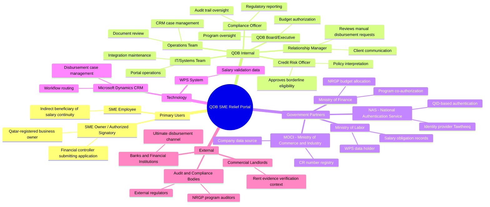
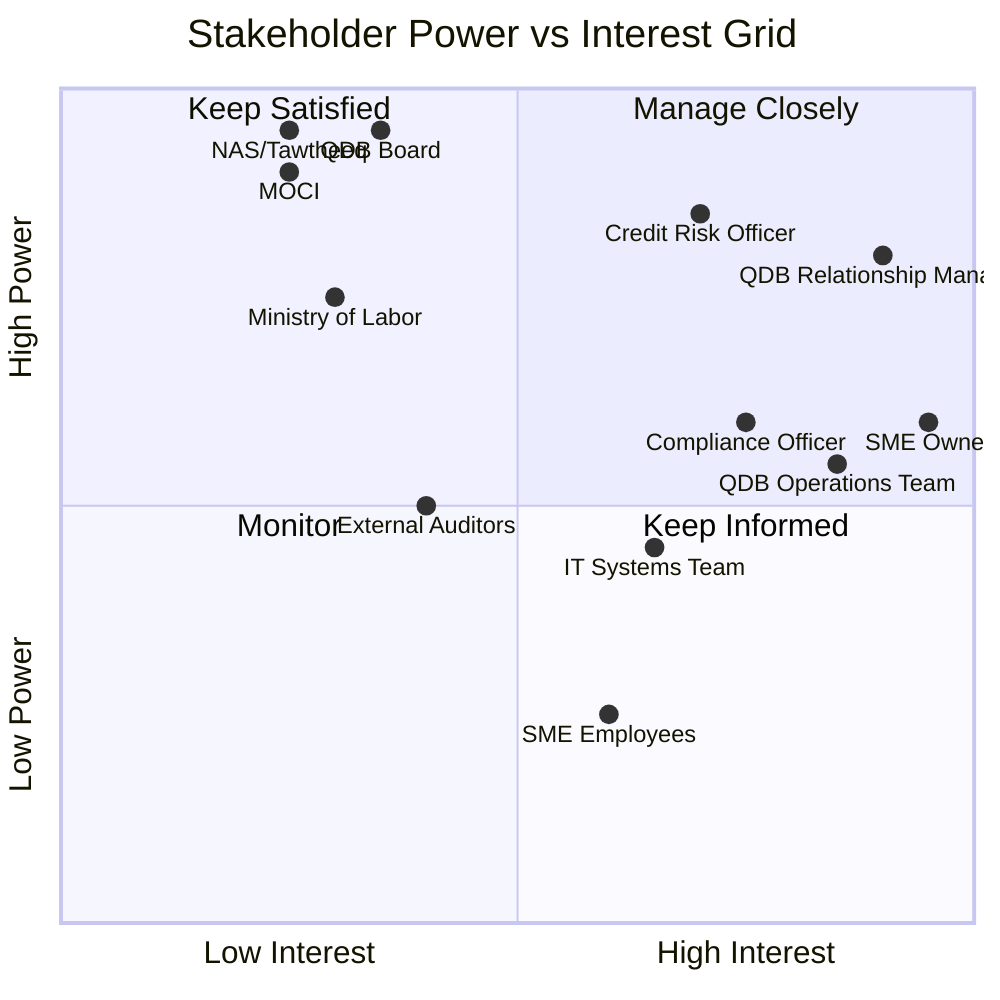
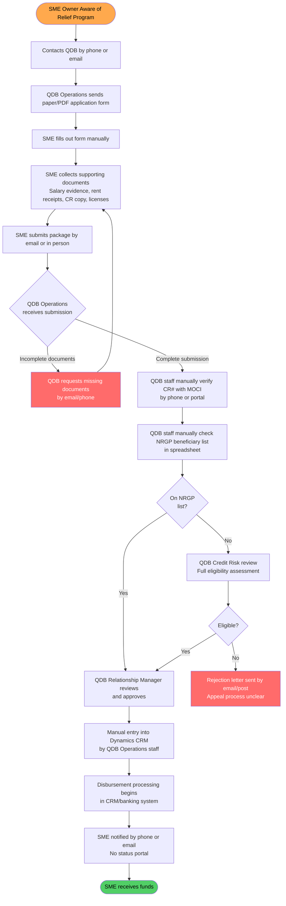
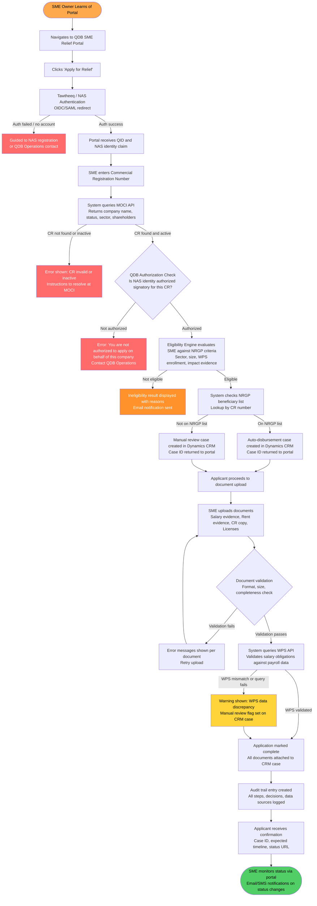
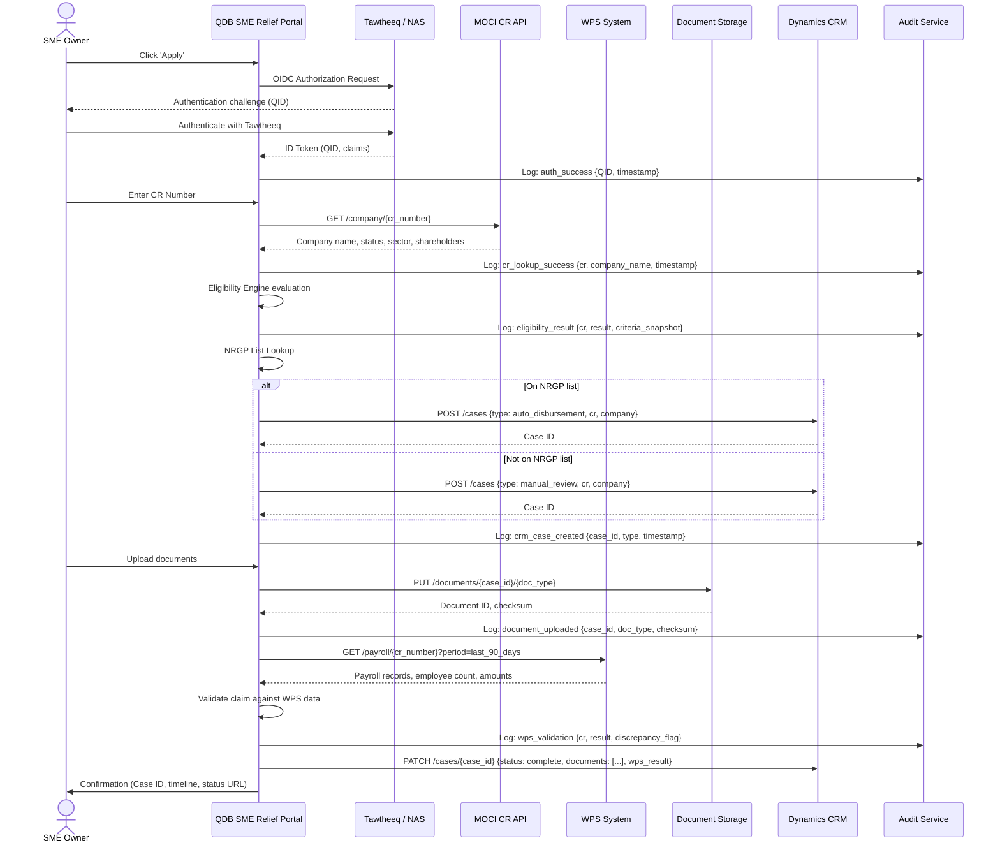
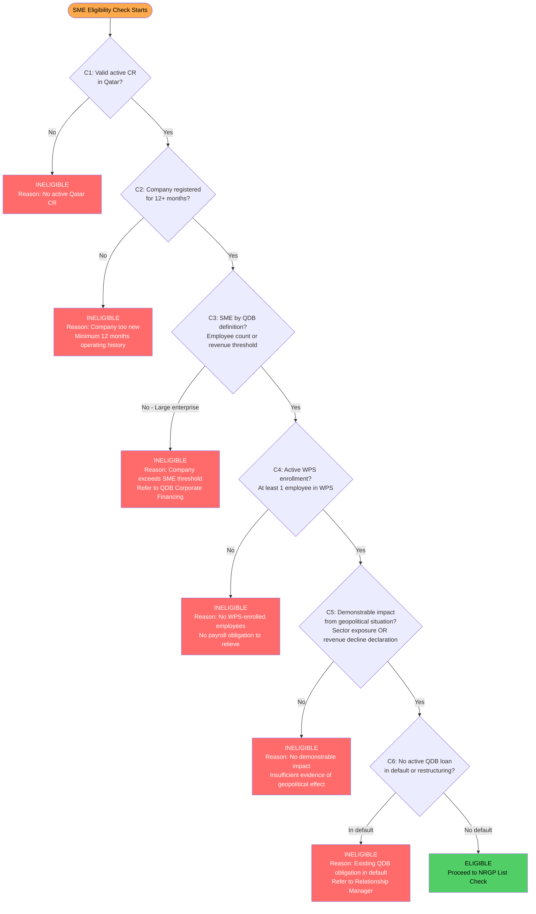
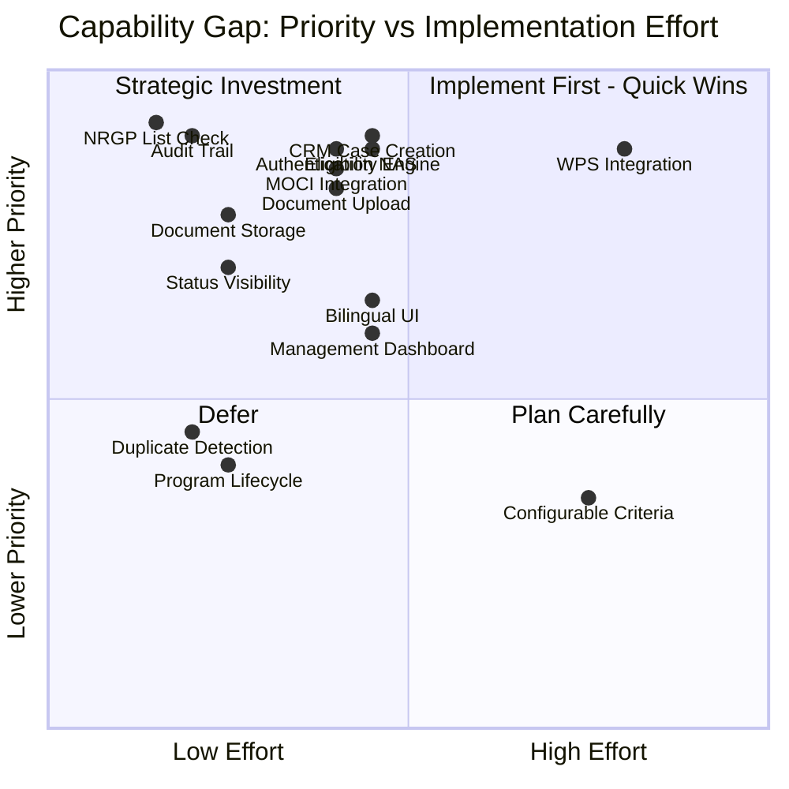
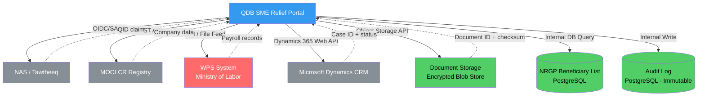

# Business Analysis Report: QDB SME Relief Portal

**Product**: QDB SME Relief Portal
**Version**: 1.0
**Date**: March 3, 2026
**Classification**: Confidential — QDB Internal Use Only
**Author**: ConnectSW Business Analyst Practice
**Status**: Final Draft — Ready for PM Handoff

---

## Table of Contents

1. [Executive Summary](#1-executive-summary)
2. [Business Context](#2-business-context)
3. [Stakeholder Analysis](#3-stakeholder-analysis)
4. [Requirements Elicitation](#4-requirements-elicitation)
5. [Process Analysis](#5-process-analysis)
6. [Integration Points Analysis](#6-integration-points-analysis)
7. [Eligibility Criteria Framework](#7-eligibility-criteria-framework)
8. [Gap Analysis](#8-gap-analysis)
9. [Competitive Analysis](#9-competitive-analysis)
10. [Feasibility Assessment](#10-feasibility-assessment)
11. [Success Metrics](#11-success-metrics)
12. [Risk Register](#12-risk-register)
13. [Recommendations](#13-recommendations)

---

## 1. Executive Summary

Qatar Development Bank (QDB) requires a dedicated digital portal to disburse emergency financial relief to Small and Medium Enterprises (SMEs) impacted by the ongoing regional conflict between Iran and Israel. SMEs are facing immediate cash flow pressures — principally salary obligations and commercial rent — that threaten business continuity and employment across Qatar's private sector.

The proposed QDB SME Relief Portal operationalises the National Relief and Guarantee Program (NRGP), transforming a manual, paper-heavy disbursement process into a structured, auditable digital workflow. The portal authenticates applicants via Tawtheeq (Qatar's National Authentication Service), fetches verified company data from MOCI, evaluates eligibility against NRGP criteria, validates salary obligations against WPS data, and routes disbursement requests — automatically for returning NRGP beneficiaries or manually for first-time applicants — into Microsoft Dynamics CRM for QDB case management.

This analysis concludes with a **strong Go recommendation**. The business case is unambiguous: a geopolitical emergency with identifiable SME victims, a pre-existing government relief framework (NRGP), and QDB's existing integration relationships with NAS/MOCI. The primary risks are integration dependency on government APIs, eligibility criteria ambiguity requiring policy clarification, and the time-bounded nature of the relief window. Delivery must be fast — a 6-to-8-week target — and the portal must be designed to sunset gracefully when the relief window closes.

---

## 2. Business Context

### 2.1 Problem Statement

**Who experiences it**: SMEs registered in Qatar whose operations depend on trade routes, supply chains, or client relationships affected by the Iran-Israel regional conflict. These businesses are generating reduced revenues while facing fixed cost obligations: employee salaries (legally mandated under Qatar's Wage Protection System) and commercial property rents.

**What the problem is**: SMEs are caught between legal obligations to pay salaries on time (WPS enforcement) and a sudden revenue shortfall caused by an external geopolitical event entirely outside their control. Without emergency financing, these businesses face:
- WPS violations and associated fines from the Ministry of Labor
- Lease defaults and potential eviction from commercial premises
- Staff layoffs, increasing national unemployment pressure
- Business closure, destroying economic value and employment in Qatar

**Cost of inaction**:
- Each month of delay: estimated hundreds of Qatar-registered SMEs at risk of WPS violation
- WPS fine per violation: QAR 6,000 per employee; for a 50-person SME, this is QAR 300,000 in fines per late salary cycle
- Business closure cascades into unemployment, reduced tax base, and demand pressure on social services
- Reputational risk to QDB: the National Relief and Guarantee Program exists; failure to operationalise it quickly undermines institutional credibility

**Why a digital portal is the right solution**: QDB cannot scale a manual paper-based review process fast enough to reach thousands of SMEs before irreversible harm occurs. A structured digital portal with automated eligibility checking, WPS integration, and CRM routing eliminates the bottleneck while maintaining auditability and fraud controls.

### 2.2 Market Landscape

**Qatar SME Ecosystem**:

| Metric | Figure | Source |
|--------|--------|--------|
| Total registered SMEs in Qatar | ~40,000 | MOCI 2025 estimates |
| SME contribution to private sector employment | ~40% | QDB Economic Research |
| SMEs in trade, import/export, logistics (most exposed) | ~8,000–12,000 | MOCI sector data |
| SMEs in retail/hospitality (secondary exposure) | ~6,000–9,000 | MOCI sector data |
| SMEs previously on NRGP beneficiary list | ~2,000–4,000 | QDB NRGP program data |
| Average monthly salary obligation (50-person SME) | QAR 250,000–500,000 | WPS aggregate data |
| Average monthly rent obligation (commercial, mid-size) | QAR 30,000–80,000 | Real estate market data |

**Geopolitical Context**:
The Iran-Israel conflict creates indirect disruption to Qatar's SME ecosystem through: trade route uncertainty affecting imports through the Strait of Hormuz, energy price volatility affecting operating costs, travel restriction impact on tourism-dependent businesses, and regional supply chain fragmentation for manufacturing and retail SMEs. Qatar itself is not a direct party to the conflict, but geographic proximity and trade relationships create real and demonstrable economic impact.

**NRGP Program Context**:
The National Relief and Guarantee Program is an existing QDB instrument established to provide emergency financing backstops during periods of economic stress. Previous activations include the COVID-19 period. The program has:
- An existing beneficiary list (companies that qualified and received relief previously)
- Pre-negotiated terms and guarantee structures
- Regulatory and board-level approval as a standing program
- Established QDB operational procedures (currently manual)

The existence of the NRGP means QDB is not creating a new financial product — it is digitising delivery of an approved, existing product under an emergency activation mandate.

### 2.3 Target Segments

**Primary Segment — Directly Impacted SMEs**:
- SMEs in import/export, logistics, freight, and trade (direct supply chain disruption)
- SMEs in tourism, hospitality, events (regional travel disruption)
- SMEs with Iran-linked commercial relationships (direct trade exposure)
- Size: estimated 8,000–12,000 businesses; eligible subset: 2,000–5,000 after criteria

**Secondary Segment — Indirectly Impacted SMEs**:
- SMEs in retail with import dependencies on affected supply chains
- SMEs in services with clients who are directly impacted
- Size: estimated 4,000–8,000 businesses; smaller eligible subset

**Excluded Segments (not served by this portal)**:
- Large enterprises (above SME threshold per QDB definition)
- Sole proprietors with no registered employees (no WPS obligation)
- SMEs in sectors with no demonstrable geopolitical impact
- Foreign companies without Qatar CR registration

---

## 3. Stakeholder Analysis

### 3.1 Stakeholder Map

### 3.2 Stakeholder Register

| Stakeholder | Role | Interest Level | Influence Level | Primary Needs | Communication Channel |
|-------------|------|---------------|-----------------|---------------|-----------------------|
| SME Owner/Signatory | Primary applicant | High | High | Fast approval, clear status, minimal documents | Portal notifications, email, SMS |
| QDB Relationship Manager | Internal reviewer (manual cases) | High | High | Clear case information, decision support tools | CRM dashboard, email |
| QDB Credit Risk Officer | Policy interpreter | Medium | High | Eligibility rule clarity, borderline guidance | Internal systems, policy docs |
| QDB Compliance Officer | Audit and regulatory | High | Medium | Complete audit trail, NRGP compliance evidence | Audit reports, CRM |
| QDB Operations Team | Day-to-day case management | High | Medium | Efficient workflow, minimal manual steps | CRM, operational dashboards |
| NAS/Tawtheeq | Authentication provider | Low | Critical | Correct SAML/OIDC integration, no misuse | API integration |
| MOCI | Company data provider | Low | Critical | Correct CR query API usage, data accuracy | API integration |
| Ministry of Labor/WPS | Salary data provider | Low | High | Correct WPS file query, data protection | API/file integration |
| QDB Board | Program owner | Low (day-to-day) | Critical | Program success, fiduciary responsibility | Executive reports |
| External Auditors | Compliance verification | Low | Medium | Complete, tamper-evident audit records | Audit exports |

### 3.3 Power/Interest Grid

---

## 4. Requirements Elicitation

### 4.1 Business Needs

| ID | Need | Source | Priority | Rationale |
|----|------|--------|----------|-----------|
| BN-001 | SMEs must be able to authenticate using their existing Tawtheeq/NAS credentials without creating a new QDB account | CEO Brief | P0 | NAS provides verified Qatari identity; no new credential store needed; consistent with QDB One strategy |
| BN-002 | The portal must retrieve verified company data from MOCI using the CR number so applicants cannot self-report company information | CEO Brief | P0 | MOCI data is authoritative; prevents fraudulent company details; eliminates manual verification of company identity |
| BN-003 | The system must evaluate SME eligibility against NRGP criteria automatically and communicate the result to the applicant | CEO Brief | P0 | Manual eligibility review cannot scale to thousands of applications within the relief window |
| BN-004 | Disbursement requests for companies on the existing NRGP beneficiary list must be created automatically in Dynamics CRM without manual QDB intervention | CEO Brief | P0 | Previous NRGP beneficiaries are pre-vetted; auto-routing eliminates queue bottleneck for known-good applicants |
| BN-005 | Disbursement requests for companies NOT on the NRGP list must land in Dynamics CRM as a manual review case with full supporting information | CEO Brief | P0 | New applicants require QDB relationship manager review before commitment; CRM is the case management system of record |
| BN-006 | Applicants must be able to upload salary payment evidence, rent payment evidence, and company documents | CEO Brief | P0 | Document evidence is required to substantiate financial impact claim and satisfy NRGP audit requirements |
| BN-007 | Salary obligations must be validated against WPS (Wage Protection System) data to verify the amount and regularity of payroll | CEO Brief | P0 | WPS is the Ministry of Labor's authoritative record; prevents inflated salary claims; ensures relief quantum is evidence-based |
| BN-008 | Every application must produce a complete, tamper-evident audit trail capturing each process step, decision, data source, and actor | Compliance | P0 | NRGP program is subject to government audit; QDB is the custodian of public relief funds; auditability is non-negotiable |
| BN-009 | The portal must display clear application status to the SME applicant throughout the process | Product Quality | P1 | Applicants need to know where they stand; reduces support call volume; builds trust in the process |
| BN-010 | The portal must be available in Arabic and English | Regulatory / User Need | P1 | Qatar's business community operates in both languages; Arabic is the official language; accessibility requirement |
| BN-011 | The portal must enforce document format validation (file type, size, completeness) at upload time to prevent incomplete submissions | Process Quality | P1 | Incomplete document packs are the primary cause of case delay; early validation reduces re-work |
| BN-012 | The portal must communicate application outcomes to the SME via email and/or SMS notification | User Need | P1 | Applicants may not poll the portal; proactive communication reduces anxiety and support load |
| BN-013 | QDB operations staff must be able to access a management dashboard showing application volumes, statuses, and processing timelines | Operational Need | P1 | Without visibility, QDB cannot manage capacity, identify bottlenecks, or report program status to the board |
| BN-014 | The portal must handle concurrent high-volume submissions without degradation during the application launch window | Technical Requirement | P1 | Program announcement will trigger a submission spike; system must not collapse under load |
| BN-015 | The portal must close gracefully at the end of the relief window, preventing new submissions after the program end date without breaking in-progress cases | Program Lifecycle | P2 | NRGP activations are time-bound; the portal must have a defined lifecycle, not run indefinitely |
| BN-016 | QDB must be able to configure eligibility criteria in the portal without a code deployment | Operational Flexibility | P2 | Policy teams may adjust criteria as the program evolves; deployment-free configuration reduces time-to-change |
| BN-017 | The portal must detect and prevent duplicate applications from the same CR number | Fraud Control | P2 | Prevents the same company from submitting multiple applications for the same relief period |
| BN-018 | Document storage must be encrypted at rest and access-controlled so only authorized QDB staff and the applicant can access uploaded files | Security / Compliance | P1 | Documents contain commercially sensitive and personally identifiable information; PDPA compliance |

### 4.2 Business Rules

| ID | Rule | Source | Impact |
|----|------|--------|--------|
| BR-001 | A company must have a valid, active Commercial Registration (CR) in Qatar to be eligible | NRGP Policy | Filters out dissolved, suspended, or foreign-registered entities |
| BR-002 | A company must have active employees enrolled in WPS to receive salary relief | NRGP Policy | Confirms employment relationship; excludes sole traders without payroll |
| BR-003 | The relief quantum for salaries cannot exceed the WPS-validated payroll figure for the last three months | NRGP Policy | Prevents over-claiming; anchors to verifiable government data |
| BR-004 | A company on the NRGP beneficiary list is auto-disbursed without additional eligibility review | QDB Decision (CEO Brief) | Reduces processing time for pre-vetted companies |
| BR-005 | A company NOT on the NRGP beneficiary list requires a manual QDB relationship manager review before disbursement | QDB Decision (CEO Brief) | Applies appropriate scrutiny to new applicants |
| BR-006 | Only the CR-registered owner or an authorized signatory (as recorded at MOCI) may submit an application | Regulatory / Fraud Control | Ensures legal authority to bind the company to a financing agreement |
| BR-007 | One active application per CR number per relief period is permitted | Fraud Control | Prevents duplicate disbursements to the same legal entity |
| BR-008 | All uploaded documents must be retained for a minimum of 7 years in accordance with QDB record retention policy | Compliance | Drives document storage architecture and lifecycle policy |
| BR-009 | Applications submitted after the program end date must be rejected with a clear communication to the applicant | Program Lifecycle | Defines behavior at program close |
| BR-010 | WPS validation must query data no older than 90 days | Data Freshness | Ensures salary relief is based on current, not historical, payroll |

### 4.3 Assumptions

| ID | Assumption | Risk if Wrong | Validation Plan |
|----|-----------|---------------|-----------------|
| ASM-001 | NAS/Tawtheeq provides a usable OIDC or SAML 2.0 API that QDB can integrate with for this portal, consistent with the QDB One architecture | Portal cannot authenticate users; entire product is blocked | Confirm with NAS integration team within Sprint 0; review QDB One ADR-002 for existing agreement |
| ASM-002 | MOCI provides a REST or SOAP API for CR number lookup that returns company name, status, sector, and registered shareholders in real time or near-real time | Company data must be entered manually, introducing fraud risk and slowing the process | Confirm MOCI API availability and SLA with QDB IT within Sprint 0 |
| ASM-003 | The Ministry of Labor / WPS provides an API or file-based data feed that can be queried by QDB with company CR number to return payroll data | WPS validation step cannot be automated; salary amounts must be taken from uploaded documents only | Confirm WPS integration mechanism with Ministry of Labor and QDB IT within Sprint 0 |
| ASM-004 | Microsoft Dynamics CRM is accessible via a documented REST API that allows creation and updating of disbursement case records programmatically | Case routing to CRM is manual; breaks the core portal workflow | Confirm Dynamics CRM API endpoint and authentication method with QDB IT within Sprint 0 |
| ASM-005 | QDB has an existing and current NRGP beneficiary list in a structured format (database or exportable file) that can be loaded into the portal for lookup | NRGP list check cannot be automated; all applications become manual review | Confirm list availability and format with QDB Operations within Sprint 0 |
| ASM-006 | The NRGP eligibility criteria are documented, agreed, and stable at product launch | Eligibility engine cannot be built; frequent criteria changes during launch create re-work | Obtain written eligibility criteria sign-off from QDB Credit Risk and Compliance before Sprint 1 ends |
| ASM-007 | SME owners or their authorized signatories have Tawtheeq accounts and can authenticate via NAS | A significant proportion of target users cannot log in, requiring an alternative authentication path | Survey a sample of target SME contacts; if >20% lack Tawtheeq, an alternative path must be designed |
| ASM-008 | QDB has authority to process WPS data from the Ministry of Labor for the purpose of relief disbursement | Legal/regulatory block on WPS integration; data cannot be used | Legal counsel confirms data sharing agreement or MOU between QDB and Ministry of Labor before sprint planning |
| ASM-009 | The portal is required for a defined, finite relief window (estimated 3–6 months) after which applications close | If the window is undefined, the portal becomes a permanent product requiring full lifecycle support | QDB program team confirms start and end dates before Sprint 0 completes |
| ASM-010 | Document uploads will be reviewed by QDB staff via Dynamics CRM or an integrated document viewer; the portal does not need to display documents to reviewers directly | If CRM cannot surface documents, a separate reviewer interface must be built, increasing scope | Confirm CRM document display capability with QDB IT within Sprint 0 |

---

## 5. Process Analysis

### 5.1 Current State (As-Is) — Manual NRGP Process

**As-Is Pain Points**:
- Average processing time: 15–30 business days (estimated)
- Document re-submission rate: estimated 40–60% due to incomplete initial packs
- No real-time status visibility for SME
- MOCI verification is manual and inconsistent
- NRGP list check is manual (spreadsheet); prone to error and version control issues
- CRM entry is double-keyed (form data re-entered by operations staff)
- No fraud detection on duplicate applications
- No automated WPS validation; salary figures taken on trust from applicant
- Audit trail exists only in paper/email records; not structured or searchable

### 5.2 Future State (To-Be) — QDB SME Relief Portal

### 5.3 Process Improvement Quantification

| Metric | As-Is (Manual) | To-Be (Portal) | Improvement |
|--------|----------------|-----------------|-------------|
| Application processing time | 15–30 business days | 1–3 business days (auto) / 5–10 days (manual review) | 70–85% reduction |
| Document re-submission rate | 40–60% | <10% (validation at upload) | 50-point reduction |
| MOCI verification time | 1–2 days (manual) | <5 seconds (API) | 99% reduction |
| NRGP list check time | Hours to days (spreadsheet) | <1 second (database) | 100% automated |
| CRM entry error rate | ~15% (double-key entry) | 0% (API-written) | Eliminated |
| Audit trail completeness | Partial (email/paper) | 100% structured and searchable | Full compliance |
| Applicant status visibility | None | Real-time | New capability |
| Duplicate application detection | None | Automated (CR-level dedup) | New capability |

---

## 6. Integration Points Analysis

### 6.1 Integration Architecture Overview

### 6.2 Tawtheeq / NAS Authentication Integration

| Attribute | Detail |
|-----------|--------|
| Protocol | OIDC (preferred) or SAML 2.0 |
| Identity Claim | QID (Qatar Identification Number) |
| Assurance Level | NAS Level 2 (minimum); request Level 3 if available for financial applications |
| Session Management | Portal issues its own JWT session after NAS assertion; NAS session not maintained |
| Established Pattern | QDB One ADR-002: NAS via Keycloak gateway, SAML 2.0/OIDC, custom post-login QID mapper |
| Key Risk | NAS availability is a single point of failure for authentication; no alternative login path for QID holders |
| Fallback | Display "NAS temporarily unavailable — try again in 30 minutes" with QDB Operations contact |
| Data Retained | QID only (not password or credentials); NAS manages credential security |
| Reference | QDB One ADR-002-authentication.md |

### 6.3 MOCI CR Number Lookup Integration

| Attribute | Detail |
|-----------|--------|
| Protocol | REST API (JSON) or SOAP (XML) — confirm with MOCI |
| Query Parameter | CR number (10-digit format) |
| Expected Response | Company name (Arabic + English), CR status (active/inactive/suspended), registration date, sector classification, authorized signatories / shareholders |
| Latency Requirement | <3 seconds (user-facing step; must be fast) |
| Error Handling | CR not found → display error, link to MOCI; MOCI API unavailable → display error, log incident, do not allow manual entry |
| Cache Strategy | Cache company data for current session only; do not persist beyond application submission (data accuracy) |
| Authorization Check | Cross-reference NAS-provided QID with MOCI-provided shareholder/signatory list to verify the applicant has authority to apply |
| Key Risk | MOCI API may not have real-time shareholder data; authorization check may have gaps |

### 6.4 WPS (Wage Protection System) Integration

| Attribute | Detail |
|-----------|--------|
| Protocol | API or file-based data feed — confirm with Ministry of Labor |
| Query Key | CR number |
| Data Returned | Employee count, total monthly payroll (last 90 days), per-month breakdown, payment dates |
| Validation Logic | Compare claimed salary relief amount to WPS payroll figure; flag discrepancies >10% as manual review |
| Data Age Limit | WPS data must be no older than 90 days (BR-010) |
| Legal Basis | Data sharing MOU between QDB and Ministry of Labor must be confirmed (ASM-008) |
| Failure Mode | If WPS query fails → flag application for manual salary verification; do not block submission |
| Key Risk | WPS API may not exist; data may be available only via secure file transfer; integration may require MOU not yet in place |

### 6.5 Microsoft Dynamics CRM Integration

| Attribute | Detail |
|-----------|--------|
| Protocol | Dynamics 365 Web API (REST/OData) |
| Authentication | OAuth 2.0 with Azure AD service principal |
| Case Creation — Auto | Entity: `qdb_disbursement_case`; type field: `auto_nrgp`; status: `pending_disbursement` |
| Case Creation — Manual | Entity: `qdb_disbursement_case`; type field: `manual_review`; status: `pending_review` |
| Document Attachment | Documents linked to CRM case by URL reference to document storage (not embedded in CRM) |
| WPS Validation Result | Attached as a structured note on the CRM case |
| Case ID | Returned to portal immediately on creation; displayed to applicant as tracking reference |
| Status Updates | CRM updates case status → portal reads status for applicant-facing display (polling or webhook) |
| Key Risk | Dynamics CRM schema may require customisation; CRM API access may require IT change management approval |

### 6.6 Document Storage

| Attribute | Detail |
|-----------|--------|
| Storage Type | Secure object storage (Azure Blob Storage or equivalent on-premise) |
| Naming Convention | `{case_id}/{doc_type}/{timestamp}_{original_filename}` |
| Accepted Formats | PDF, JPEG, PNG, TIFF (for scanned documents) |
| Max File Size | 10 MB per document, 50 MB per application package |
| Encryption | AES-256 at rest; TLS 1.3 in transit |
| Access Control | Applicant: upload only, read own documents. QDB Staff: read via CRM link. Audit: immutable read |
| Retention Policy | 7 years minimum (BR-008) |
| Document Types | Salary payment evidence, rent payment evidence, commercial registration copy, business licenses, additional impact evidence |
| Virus Scanning | All uploads scanned before storage |

---

## 7. Eligibility Criteria Framework

### 7.1 Eligibility Criteria Definition

The following criteria define whether an SME qualifies for NRGP relief. These criteria require written sign-off from QDB Credit Risk and Compliance (ASM-006) before implementation.

### 7.2 Eligibility Criteria Register

| Criterion ID | Criterion | Data Source | Automated? | Notes |
|-------------|-----------|-------------|-----------|-------|
| EC-001 | Valid active Commercial Registration in Qatar | MOCI API | Yes | CR status field must be "active" |
| EC-002 | Company registered for minimum 12 months | MOCI API (registration date) | Yes | Registration date >12 months before application date |
| EC-003 | SME classification by QDB definition | MOCI (employee count) + applicant declaration | Partial | QDB defines SME as <100 employees or <QAR 30M revenue; verify with QDB policy |
| EC-004 | Minimum 1 employee enrolled in WPS | WPS API | Yes | Employee count >0 in WPS records |
| EC-005 | Operates in an impacted sector OR declares >X% revenue decline | Sector classification (MOCI) + applicant declaration | Partial | Impacted sector list defined by QDB; revenue decline requires declaration and supporting evidence |
| EC-006 | No active QDB financing in default or restructuring | QDB internal CRM/loan system | Yes | Requires internal QDB system integration or manual check flag |
| EC-007 | Not currently under judicial dissolution or bankruptcy proceedings | MOCI API (company status) | Yes | CR status check covers this if MOCI marks dissolved companies |

### 7.3 Relief Quantum Calculation

| Relief Type | Calculation Basis | Cap | Source |
|-------------|------------------|-----|--------|
| Salary Relief | WPS-validated payroll for last 3 months | QAR [TBD by QDB policy] per employee per month | WPS + NRGP policy |
| Rent Relief | Rent evidence (lease agreement + payment proof) | QAR [TBD by QDB policy] per month | Supporting documents + NRGP policy |
| Combined Cap | Total relief per application | QAR [TBD by QDB policy] | NRGP program budget allocation |

Note: Specific cap figures require QDB Credit Risk sign-off. These are placeholders pending policy confirmation.

---

## 8. Gap Analysis

### 8.1 Capability Gap Matrix

| Capability | Current State | Desired State | Gap | Priority | Effort |
|-----------|--------------|---------------|-----|----------|--------|
| SME Authentication | No digital authentication for relief applications; manual identity verification | NAS/Tawtheeq OIDC authentication with QID-based identity | High — full gap | P0 | M |
| Company Data Lookup | Manual MOCI check by QDB staff; paper CR copies from applicant | Automated MOCI API integration returning verified company data | High — full gap | P0 | M |
| Eligibility Evaluation | Manual review by Credit Risk officer; inconsistent and slow | Rules-based eligibility engine with configurable criteria | High — full gap | P0 | M |
| NRGP List Check | Manual spreadsheet lookup by operations staff | Database lookup against structured NRGP beneficiary list | High — full gap | P0 | S |
| CRM Case Creation | Manual double-key data entry by operations staff | Automated API-driven case creation in Dynamics CRM | High — full gap | P0 | M |
| Document Collection | Email submission or in-person; no validation | Structured online upload with format/completeness validation | High — full gap | P0 | M |
| WPS Salary Validation | No validation; figures taken from applicant declaration | Automated WPS API query and cross-validation | High — full gap | P0 | L |
| Audit Trail | Partial; email and paper records only | Complete, structured, tamper-evident digital audit log | High — full gap | P0 | S |
| Applicant Status Visibility | No self-service status; phone/email enquiries only | Real-time status display in portal + notifications | Medium — full gap | P1 | S |
| Bilingual Support | English-only portal (if any digital exists) | Full Arabic and English UI | Medium — full gap | P1 | M |
| Document Storage | Email attachments; no structured storage | Encrypted, access-controlled document store linked to CRM | High — full gap | P1 | S |
| Duplicate Detection | None | CR-level deduplication per relief period | Medium — full gap | P2 | S |
| Management Dashboard | None | Application volume, status, processing time dashboard | Medium — full gap | P1 | M |
| Configurable Criteria | Hardcoded in manual process | Admin-configurable eligibility criteria | Low — full gap | P2 | L |
| Program Lifecycle Management | Manual; no defined close procedure | Automated program end date enforcement with graceful close | Low — partial gap | P2 | S |

### 8.2 Gap Visualization

**Reading the chart**: WPS Integration is the only P0 capability with high effort — it requires government API negotiation and data sharing agreements. All other P0 items are medium-to-low effort individually. The project's critical path runs through WPS and CRM integration confirmation.

---

## 9. Competitive Analysis

### 9.1 Context: Comparable Government Relief Portal Programs

This is a government-mandated emergency relief program; there is no direct commercial competitor. The relevant comparisons are other government emergency relief portals deployed in response to geopolitical or economic disruption.

| Program | Country | Year | Authentication | Processing Time | Key Feature | Weakness |
|---------|---------|------|----------------|-----------------|-------------|----------|
| COVID-19 SBA PPP Portal | USA | 2020 | IRS/banking credentials | 5–10 days (auto) | Bank-integrated auto disbursement | Fraud losses ($80B+); weak identity verification |
| COVID-19 CBILS (UK) | UK | 2020 | HMRC credentials (GOV.UK Verify) | 5–10 business days | Accredited lender network | Lender inconsistency; applicant confusion |
| Qatar NRGP (Manual, COVID) | Qatar | 2020–21 | Manual; paper-based | 15–30 days | Existing NRGP framework | Speed; no digital portal |
| UAE Economic Relief Portal | UAE | 2020 | UAE Pass (national ID) | 3–7 days | UAE Pass integration (NAS equivalent) | Limited SME-specific tools |
| Saudi Arabia KAFALAH SME Support | KSA | 2020–22 | Absher (national ID) | 7–14 days | Integration with Absher identity | Coverage limited to banked SMEs |

### 9.2 Feature Comparison Matrix

| Feature | QDB SME Relief Portal (Proposed) | Typical Government Relief Portal | UAE Economic Relief | Saudi KAFALAH |
|---------|----------------------------------|-----------------------------------|---------------------|----------------|
| National ID Authentication | Yes (NAS/Tawtheeq) | Varies | Yes (UAE Pass) | Yes (Absher) |
| Company Registry Integration | Yes (MOCI) | Rarely automated | Partial | Partial |
| Payroll/Wage System Validation | Yes (WPS) | Rarely | No | Partial (GOSI) |
| Auto-disbursement for pre-vetted | Yes (NRGP list) | No | No | No |
| CRM-integrated case management | Yes (Dynamics) | Varies | No | No |
| Bilingual (Arabic/English) | Yes | Arabic-only common | Yes | Arabic primary |
| Structured audit trail | Yes | Varies | Partial | Partial |
| Real-time applicant status | Yes | Rarely | Partial | Partial |

### 9.3 Competitive Positioning

The QDB SME Relief Portal, as specified, is materially more sophisticated than comparable emergency relief portals because it integrates:
- Government identity (NAS) for fraud prevention
- Company registry (MOCI) for verified company data — eliminating self-reported fraud
- Wage protection data (WPS) for salary quantum validation — a unique capability
- Pre-vetted beneficiary auto-routing — reducing processing time to near-zero for ~30–40% of applicants

The primary differentiator risk is WPS integration. If WPS cannot be integrated in time, the salary validation advantage is lost and the portal falls back to document-based salary verification (a significant downgrade in fraud control and processing efficiency).

---

## 10. Feasibility Assessment

### 10.1 Technical Feasibility

**Stack Alignment**:
The proposed portal uses ConnectSW's default stack (Next.js frontend, Fastify backend, PostgreSQL, Prisma) augmented with government API integrations. This aligns with:
- QDB One established NAS integration pattern (ADR-002)
- QDB One established MOCI integration pattern (architecture.md, C4 Level 1)
- ConnectSW standard document storage patterns

**Integration Complexity Assessment**:

| Integration | Complexity | Why |
|-------------|-----------|-----|
| NAS/Tawtheeq | Medium | OIDC/SAML is standardised; QDB One has done this; requires NAS sandbox access and production onboarding |
| MOCI CR API | Medium | REST/SOAP API exists (used by QDB One); requires API key/credentials and SLA confirmation |
| WPS Integration | High | WPS API may not be publicly documented; data sharing agreement required; integration format unknown |
| Dynamics CRM | Medium | Dynamics 365 Web API is well-documented; requires Azure AD service principal provisioning |
| Document Storage | Low | Standard object storage integration; well-understood patterns |
| NRGP List Lookup | Low | Load list into PostgreSQL; query by CR number; simple lookup |

**Overall Technical Complexity**: Moderate — the portal itself is a standard CRUD application with a well-defined workflow. The complexity is concentrated in the external integrations, particularly WPS, and the security requirements around government data handling.

**Technical Risks**:
- WPS integration may not be achievable in the target timeframe if an MOU does not exist
- NAS sandbox environment availability during development
- Dynamics CRM schema customisation may require QDB IT change management cycle

### 10.2 Market Feasibility

**Demand Evidence**: Strong. The geopolitical situation is ongoing; SME cash flow stress is documented and real; NRGP is an approved program awaiting operationalisation; QDB has a policy mandate to execute.

**Timing**: Critical. The longer delivery takes, the more SMEs pass the point of no return (WPS violations, lease defaults, closure). A 6–8 week delivery target is aggressive but achievable for a focused MVP.

**Go-to-Market Barriers**:
- SME awareness of the portal (requires QDB communications campaign)
- SME readiness to use Tawtheeq (if significant % lack accounts — see ASM-007)
- Language accessibility (Arabic UI is essential for some SME populations)

### 10.3 Resource Feasibility

**Estimated Agent Effort**:

| Role | Estimated Effort | Notes |
|------|-----------------|-------|
| Product Manager | 2 sprints | Spec, acceptance criteria, backlog |
| Architect | 1 sprint | Integration contracts, ADRs |
| Backend Engineer | 4 sprints | API, eligibility engine, integrations, CRM connector |
| Frontend Engineer | 3 sprints | Portal UI (bilingual), document upload, status display |
| Data Engineer | 1 sprint | NRGP list loader, audit schema, document storage |
| QA Engineer | 2 sprints (parallel) | Test coverage, integration testing |
| Security Engineer | 1 sprint | Auth flow review, document security, PDPA compliance |
| DevOps Engineer | 1 sprint | CI/CD, hosting, secrets management |

**Total Estimated Effort**: 15 sprints (parallel execution = ~6–8 calendar weeks with a team of 4–5 agents working concurrently)

**Infrastructure**:
- Hosting: On-premise at QDB (consistent with AP-7 data sovereignty) or Qatar-based cloud
- Document storage: Encrypted object storage, Qatar-resident
- Dynamics CRM: Existing QDB infrastructure; no new procurement
- NAS: Government API — no infrastructure cost

**Third-Party Dependencies**:
- NAS API access (government onboarding process)
- MOCI API credentials (government process)
- WPS data sharing agreement (requires legal/MOU process)
- Dynamics CRM API access (internal IT)

### 10.4 Feasibility Summary

| Dimension | Rating | Confidence | Key Risk |
|-----------|--------|------------|----------|
| Technical | High | Medium | WPS integration timeline and API availability unknown |
| Market | High | High | Clear demand, approved program, immediate business need |
| Resource | Medium | High | Timeline is aggressive; WPS and NAS onboarding may extend it |

---

## 11. Success Metrics

### 11.1 Key Performance Indicators

| KPI | Baseline | Target | Measurement | Frequency |
|-----|----------|--------|-------------|-----------|
| Application processing time (auto-disbursement path) | N/A (no portal) | <1 business day from submission to CRM case creation | Portal timestamp logs | Daily |
| Application processing time (manual review path) | 15–30 business days | <5 business days from submission to QDB decision | CRM case timestamps | Daily |
| Document re-submission rate | 40–60% (manual) | <10% | Portal upload success/failure logs | Weekly |
| Eligible applications processed per week | ~20 (manual capacity) | 500+ (digital capacity) | Portal application logs | Weekly |
| NAS authentication success rate | N/A | >98% | Auth service logs | Daily |
| MOCI API success rate | N/A | >99.5% | API monitoring | Daily |
| WPS validation completion rate | N/A | >95% of submitted applications | WPS integration logs | Daily |
| CRM case creation failure rate | N/A | <0.1% | CRM integration logs | Daily |
| Applicant satisfaction score (post-application survey) | N/A | >4.0/5.0 | In-portal survey | Ongoing |
| Portal uptime during business hours | N/A | >99.5% | Infrastructure monitoring | Continuous |
| Duplicate application detection rate | N/A (no control) | 100% (zero duplicate CRM cases per CR per period) | CR-level dedup logs | Daily |
| Audit trail completeness | N/A | 100% (every application step logged) | Audit log completeness check | Daily |

### 11.2 Success Criteria

The QDB SME Relief Portal is considered successful when:

1. **Operational**: The portal processes its first 100 applications end-to-end (authentication through CRM case creation) with zero manual QDB operations intervention for eligible, complete applications.
2. **Speed**: Average end-to-end processing time for auto-disbursement path is under 24 hours from application submission.
3. **Scale**: Portal handles peak load of 200 simultaneous sessions without response time degradation beyond 3 seconds per page.
4. **Completeness**: 100% of submitted applications have a structured audit trail entry for every process step.
5. **Accuracy**: Zero NRGP list check errors (confirmed against ground-truth list) in first 30 days of operation.
6. **Fraud Control**: Zero duplicate CRM cases created for the same CR number in the same relief period.

---

## 12. Risk Register

| ID | Risk | Probability | Impact | Score | Mitigation | Owner |
|----|------|-------------|--------|-------|-----------|-------|
| RSK-001 | WPS integration cannot be established within delivery timeline due to missing MOU or API unavailability | High | High | 9 | Begin MOU process in Sprint 0 in parallel with development; design portal to function without WPS (manual salary document review as fallback); clearly communicate WPS validation as a "Planned" feature | Architect + QDB Legal |
| RSK-002 | NAS/Tawtheeq sandbox environment is unavailable during development, blocking auth integration | Medium | High | 6 | Request NAS sandbox access in Sprint 0; use mock OIDC server (e.g., Keycloak local) during development; QDB One ADR-002 patterns provide a blueprint to accelerate | Backend Engineer |
| RSK-003 | MOCI API does not return authorized signatory / shareholder data, making authorization check impossible | Medium | High | 6 | Design authorization check as a declaration (applicant affirms they are authorized) with post-submission verification by QDB if MOCI data is insufficient; document limitation in audit trail | Architect |
| RSK-004 | Dynamics CRM schema requires significant customization that is blocked by QDB IT change management | Medium | High | 6 | Engage QDB IT from Sprint 0; identify existing CRM entities that can be reused; have a fallback of email-based case notification with manual CRM entry as a degraded mode | DevOps + QDB IT |
| RSK-005 | A significant percentage of SME owners do not have Tawtheeq accounts, creating an authentication gap | Medium | Medium | 4 | Survey sample of target audience in Sprint 0; if >20% lack accounts, design a QDB-assisted onboarding path (RM-assisted Tawtheeq registration) or a QDB temporary credential for those in transition | Product Manager |
| RSK-006 | NRGP beneficiary list is in an unstructured format (PDF, spreadsheet) and requires significant cleansing before it can power automated lookup | Low | High | 6 | Request list from QDB Operations in Sprint 0; allocate Data Engineer time for cleansing and loading; set a "list ready" milestone as a prerequisite for NRGP check feature | Data Engineer |
| RSK-007 | Eligibility criteria are not formally documented or agreed, causing implementation rework mid-sprint | High | Medium | 6 | Make eligibility criteria sign-off a Sprint 0 exit gate; no eligibility engine code written until criteria are signed off by Credit Risk and Compliance | Product Manager + QDB |
| RSK-008 | The portal experiences a fraud wave in the first days after launch, with ineligible companies submitting false impact evidence | Medium | High | 6 | MOCI and NAS integration already provides strong identity anchors; WPS reduces salary over-claiming; add rate limiting per CR; monitor for outlier application patterns in first 72 hours | Security Engineer |
| RSK-009 | Document storage or audit logging fails silently, producing incomplete records that invalidate the NRGP program audit | Low | Critical | 7 | Implement write-ahead logging for audit entries; use transactional writes for document storage; alert on any audit log gap; run daily completeness checks | Backend Engineer + DevOps |
| RSK-010 | The portal remains open past the intended program end date due to manual oversight, creating unauthorized applications and QDB liability | Low | Medium | 3 | Implement hard-coded program end date with automated sunset; QDB Compliance Officer notified 14 days before close; portal enters read-only mode after close | DevOps + QDB Ops |
| RSK-011 | Arabic UI translation quality is poor, causing confusion among Arabic-speaking SME owners | Low | Medium | 3 | Use professional legal/financial Arabic translation (not machine translation); conduct Arabic usability test with 3–5 native speakers before launch | UI/UX Designer + QDB Comms |
| RSK-012 | PDPA (Qatar Personal Data Protection Act) compliance issues with document storage or WPS data handling | Medium | High | 6 | Engage QDB Legal / Data Protection Officer in Sprint 0; data classification for all stored fields; encryption at rest confirmed; access control audit; PDPA impact assessment documented | Security Engineer + QDB Legal |

---

## 13. Recommendations

### 13.1 Go/No-Go Recommendation

**Recommendation: GO — proceed to product specification immediately.**

Evidence:
- Business need is clear, urgent, and quantifiable (SME cash flow stress with WPS fine exposure)
- An approved government program (NRGP) is waiting for digital operationalisation
- QDB has existing relationships with NAS and MOCI (established in QDB One)
- The technical architecture is well-understood; no novel technical risk
- The only material blocker (WPS integration) has a defined fallback path
- The cost of inaction — SME defaults, WPS violations, business closures — exceeds the cost and risk of rapid delivery

**Conditions**:
1. Eligibility criteria must be formally signed off before Sprint 1 begins (RSK-007)
2. WPS MOU/API investigation must begin immediately in Sprint 0 (RSK-001)
3. NAS sandbox access must be confirmed within 1 week of project start (RSK-002)
4. NRGP beneficiary list must be obtained and assessed within 1 week of project start (RSK-006)

### 13.2 Prioritized Action Items

1. **Sprint 0 (Week 1)**: Technical discovery on all four integrations (NAS, MOCI, WPS, Dynamics CRM); obtain NRGP beneficiary list; get eligibility criteria sign-off; confirm data sharing legal basis for WPS; assign QDB IT liaison.
2. **Sprint 1 (Weeks 2–3)**: Build NAS authentication, MOCI CR lookup, eligibility engine (based on signed-off criteria); skeleton CRM integration; bilingual UI scaffold.
3. **Sprint 2 (Weeks 4–5)**: Document upload, storage, and validation; NRGP list check; CRM auto vs. manual routing; WPS integration (or document-based fallback if WPS not ready); audit trail.
4. **Sprint 3 (Week 6)**: Status display, notifications, management dashboard, duplicate detection; full integration test with QDB IT; UAT with QDB operations staff.
5. **Sprint 4 (Weeks 7–8)**: Security audit, load testing, Arabic translation review, PDPA compliance check, deployment to QDB production environment; QDB staff training; communications campaign coordination.
6. **Post-launch (Ongoing)**: Daily audit log completeness monitoring; 72-hour fraud watch; weekly KPI reporting to QDB board; program end-date notification and graceful sunset.

### 13.3 Business Need to User Story Mapping (PM Handoff)

| Business Need | Suggested User Stories | Priority |
|--------------|----------------------|----------|
| BN-001: NAS Authentication | US-01: As an SME owner, I want to log in with my Tawtheeq account so that I do not need to create a new credential to access the relief portal. US-02: As a system, I must redirect unauthenticated users to NAS login and process the returned QID claim to establish a portal session. | P0 |
| BN-002: MOCI CR Lookup | US-03: As an SME owner, I want to enter my CR number and have the system retrieve my verified company details from MOCI so that I do not need to manually enter company information. US-04: As a system, I must verify that the authenticated NAS identity matches an authorized signatory for the CR number provided. | P0 |
| BN-003: Eligibility Check | US-05: As an SME owner, I want to know immediately whether my company is eligible for NRGP relief so that I do not waste time submitting documents for an ineligible application. US-06: As a system, I must evaluate eligibility against all defined NRGP criteria and provide a clear result with reasons for ineligibility. | P0 |
| BN-004: Auto Disbursement (NRGP listed) | US-07: As a QDB operations officer, I want auto-disbursement cases to be created in Dynamics CRM for eligible NRGP-listed companies without my manual intervention so that I can focus on new applicant reviews. | P0 |
| BN-005: Manual Review (not NRGP listed) | US-08: As a QDB relationship manager, I want manual review cases to arrive in Dynamics CRM with all application data and documents pre-populated so that I can make a decision without contacting the applicant for basic information. | P0 |
| BN-006: Document Upload | US-09: As an SME owner, I want to upload salary evidence, rent evidence, and company documents through the portal so that I have a single structured submission process. US-10: As a system, I must validate document format, size, and completeness at upload time and provide actionable error messages for any failures. | P0 |
| BN-007: WPS Validation | US-11: As a QDB credit officer, I want the portal to validate stated salary obligations against WPS data so that relief amounts are anchored to government-verified payroll records. US-12: As a system, I must flag WPS discrepancies >10% on the CRM case for manual review without blocking the application. | P0 |
| BN-008: Audit Trail | US-13: As a QDB compliance officer, I want every application step, decision, and data source to be logged in a tamper-evident audit record so that the NRGP program can be audited by government authorities. | P0 |
| BN-009: Application Status Visibility | US-14: As an SME owner, I want to see my current application status in the portal so that I do not need to call QDB to ask about my case. | P1 |
| BN-010: Bilingual UI | US-15: As an Arabic-speaking SME owner, I want to use the portal entirely in Arabic so that language is not a barrier to accessing relief funding. | P1 |
| BN-011: Document Validation | Covered by US-10 above. | P0 |
| BN-012: Notifications | US-16: As an SME owner, I want to receive email and/or SMS notifications when my application status changes so that I am informed without having to poll the portal. | P1 |
| BN-013: Management Dashboard | US-17: As a QDB operations manager, I want a dashboard showing application volumes, statuses, and processing times so that I can manage team capacity and report program progress to the board. | P1 |
| BN-014: Load Handling | US-18: As a system, I must handle 200 concurrent sessions during a launch surge without response time exceeding 3 seconds per page load. | P1 |
| BN-015: Program Lifecycle | US-19: As a QDB program administrator, I want the portal to automatically stop accepting new applications after the program end date and display a clear message to applicants who try to apply after close. | P2 |
| BN-016: Configurable Criteria | US-20: As a QDB credit risk officer, I want to update eligibility criteria through an admin interface without requiring a code deployment so that policy changes can be reflected same-day. | P2 |
| BN-017: Duplicate Detection | US-21: As a system, I must detect and reject duplicate applications from the same CR number within the same relief period, displaying a clear message to the applicant with their existing case reference. | P2 |
| BN-018: Document Security | US-22: As a QDB data protection officer, I want uploaded documents to be encrypted at rest and accessible only to the applicant and authorized QDB staff so that PDPA obligations are met. | P1 |

---

## Appendix A: Integration Dependency Map

Note: WPS is highlighted as high-risk (red) due to uncertain API availability and MOU dependency.

---

## Appendix B: NRGP Process State Diagram

```mermaid
stateDiagram-v2
    [*] --> Authenticated : NAS login success
    Authenticated --> CR_Verified : MOCI lookup success
    CR_Verified --> Ineligible : Eligibility check fails
    CR_Verified --> Eligible : Eligibility check passes
    Ineligible --> [*] : Application closed; notification sent
    Eligible --> NRGP_Listed : CR found in NRGP list
    Eligible --> NRGP_Unlisted : CR not in NRGP list
    NRGP_Listed --> Auto_Case : CRM auto-disbursement case created
    NRGP_Unlisted --> Manual_Case : CRM manual review case created
    Auto_Case --> Docs_Pending : Awaiting document upload
    Manual_Case --> Docs_Pending : Awaiting document upload
    Docs_Pending --> Docs_Submitted : All documents uploaded and validated
    Docs_Submitted --> WPS_Validated : WPS validation passes
    Docs_Submitted --> WPS_Flagged : WPS discrepancy detected
    WPS_Validated --> Complete : Audit trail written; confirmation sent
    WPS_Flagged --> Complete : Audit trail written; manual review flag set
    Complete --> Under_Review : QDB reviews (manual path only)
    Complete --> Approved : Auto path — no manual review needed
    Under_Review --> Approved : QDB approves
    Under_Review --> Rejected : QDB rejects
    Approved --> Disbursed : Funds transferred
    Rejected --> [*] : Rejection notification sent
    Disbursed --> [*] : SME receives relief funds
```

---

*This Business Analysis Report is a confidential internal document. It is intended solely for use by ConnectSW agents and QDB authorized personnel in the development of the QDB SME Relief Portal. It must not be shared externally without QDB executive approval.*

*Version 1.0 — March 3, 2026 — ConnectSW Business Analyst Practice*
