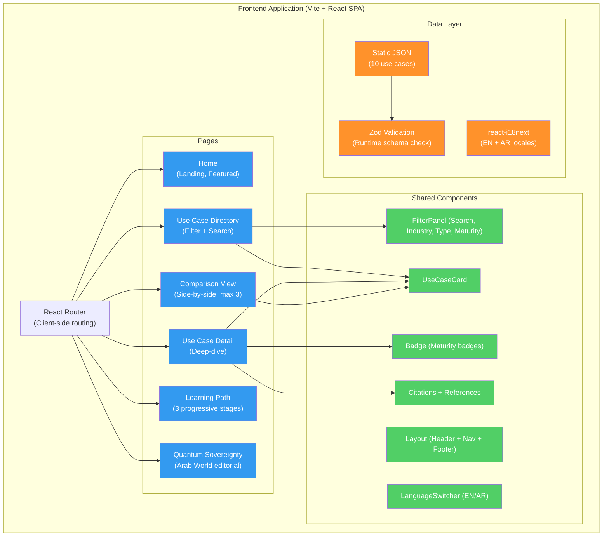

# Quantum Computing Use Cases Platform

A static web application that helps business analysts, technical leads, and executives discover, evaluate, and compare practical quantum computing applications relevant to their industry. It translates complex quantum computing research into actionable business intelligence for decision-makers evaluating quantum technology investments.

## Why This Platform Exists

Developers, researchers, and business leaders struggle to understand practical quantum computing applications relevant to their industry. Most quantum computing resources focus on theory or highly technical implementations, creating a gap for those seeking to evaluate real-world use cases and feasibility. Decision-makers need a curated, business-oriented resource that clearly communicates what quantum computing can do today, what is coming soon, and what remains theoretical.

This platform provides a catalog of 10 quantum computing use cases organized by industry, problem type, and maturity level -- with side-by-side comparison, curated learning paths, bilingual support (English and Arabic with RTL), and a dedicated editorial feature on quantum sovereignty in the Arab world.

## Architecture Overview



**Key architectural decisions**: This is a frontend-only application with zero backend dependency. All 10 use case records are stored in a static JSON file, validated at startup with Zod, and filtered/sorted client-side. No database, no API, no authentication.

## Tech Stack

| Layer | Technology | Version |
|-------|-----------|---------|
| Build Tool | Vite | 5.0+ |
| UI Framework | React | 18.2+ |
| Language | TypeScript | 5.3+ |
| Routing | React Router | 6.21+ |
| Styling | Tailwind CSS | 3.4+ |
| Data Validation | Zod | 3.22+ |
| Internationalization | react-i18next | 16.5+ |
| Testing | Vitest + React Testing Library | 1.1+ |
| DOM Simulation | happy-dom | 12.10+ |

## Port Assignments

| Service | Port |
|---------|------|
| Vite Dev Server | 3111 |

**Note**: This is a frontend-only application with no backend. There is no API server.

## Getting Started

### Prerequisites

- Node.js 20+

### Quick Start

```bash
# 1. Navigate to product
cd products/quantum-computing-usecases/apps/web

# 2. Install dependencies
npm install

# 3. Start development server
npm run dev
# Web: http://localhost:3111

# 4. Open in browser
open http://localhost:3111
```

## Development Commands

```bash
# Start dev server
cd products/quantum-computing-usecases/apps/web
npm run dev

# Run tests
npm run test

# Run tests in watch mode
npm run test:watch

# Build for production
npm run build

# Preview production build
npm run preview

# Type-check
npx tsc --noEmit
```

## Project Structure

```
products/quantum-computing-usecases/
├── apps/
│   └── web/                                # Vite + React SPA (port 3111)
│       ├── src/
│       │   ├── App.tsx                     # Route definitions
│       │   ├── main.tsx                    # React root + i18n init
│       │   ├── index.css                   # Tailwind imports
│       │   ├── components/
│       │   │   ├── layout/
│       │   │   │   └── Layout.tsx          # App shell (header, nav, footer)
│       │   │   ├── use-cases/
│       │   │   │   ├── UseCaseCard.tsx     # Use case card component
│       │   │   │   └── FilterPanel.tsx     # Search + filter sidebar
│       │   │   ├── references/
│       │   │   │   ├── Citation.tsx        # Inline superscript citation
│       │   │   │   └── References.tsx      # Numbered reference list
│       │   │   └── ui/
│       │   │       ├── Badge.tsx           # Colored label (maturity badges)
│       │   │       ├── Card.tsx            # Container component
│       │   │       └── LanguageSwitcher.tsx # EN/AR toggle
│       │   ├── pages/
│       │   │   ├── Home.tsx               # Landing page
│       │   │   ├── UseCases.tsx           # Directory with filters
│       │   │   ├── UseCaseDetail.tsx       # Individual use case
│       │   │   ├── Compare.tsx            # Side-by-side comparison
│       │   │   ├── LearningPath.tsx       # Curated progression
│       │   │   └── QuantumSovereigntyArab.tsx  # Editorial feature
│       │   ├── data/
│       │   │   └── use-cases.json         # 10 use case records
│       │   ├── hooks/
│       │   │   └── useUseCases.ts         # Data loading + validation
│       │   ├── types/
│       │   │   └── index.ts              # Zod schemas + TypeScript types
│       │   ├── utils/
│       │   │   └── filters.ts            # Filter logic + helpers
│       │   └── i18n/
│       │       ├── i18n.ts               # i18next config
│       │       └── locales/
│       │           ├── en.json           # English translations
│       │           └── ar.json           # Arabic translations
│       ├── index.html
│       ├── vite.config.ts
│       ├── tailwind.config.js
│       └── package.json
├── docs/
│   ├── PRD.md                            # Product Requirements
│   ├── CONCEPT.md                        # Original concept note
│   ├── FACTCHECK-SUMMARY.md              # Use case data verification
│   ├── FACTCHECK-sovereignty.md          # Sovereignty content verification
│   ├── quantum-computing-usecases-user-manual.md
│   ├── quantum-computing-usecases-technical-manual.md
│   └── ADRs/
│       └── ADR-001-prototype-tech.md     # Vite over Next.js decision
└── README.md                             # This file
```

## Key Features

| Feature | Route | Description |
|---------|-------|-------------|
| Landing Page | `/` | Hero section, 3 featured use cases, value proposition |
| Use Case Directory | `/use-cases` | Browse and filter all 10 use cases by industry, problem type, maturity |
| Use Case Detail | `/use-cases/:slug` | Quantum advantage, timeline, technical requirements, examples |
| Comparison View | `/compare` | Side-by-side comparison of up to 3 use cases (URL-shareable) |
| Learning Path | `/learning-path` | 3 progressive stages: Beginner, Intermediate, Advanced |
| Quantum Sovereignty | `/quantum-sovereignty-arab-world` | Editorial on Arab world quantum strategy with 21 references |
| Bilingual Support | -- | English and Arabic with RTL layout; language persisted in localStorage |

## Use Case Catalog

| ID | Title | Industry | Maturity |
|----|-------|----------|----------|
| 1 | Drug Discovery and Molecular Simulation | Pharmaceuticals | Experimental |
| 2 | Financial Portfolio Optimization | Finance | Pre-Production |
| 3 | Supply Chain and Logistics Optimization | Logistics | Experimental |
| 4 | Advanced Materials Discovery | Materials Science | Experimental |
| 5 | Post-Quantum Cryptography | Security | Pre-Production |
| 6 | Quantum Machine Learning | AI/ML | Theoretical |
| 7 | Traffic Flow and Urban Mobility Optimization | Logistics | Experimental |
| 8 | Climate and Weather Modeling | Environmental | Theoretical |
| 9 | Financial Risk Analysis and Monte Carlo Simulation | Finance | Experimental |
| 10 | Protein Folding Prediction | Pharmaceuticals | Theoretical |

## Documentation

| Document | Path | Description |
|----------|------|-------------|
| PRD | [docs/PRD.md](docs/PRD.md) | Full product requirements with personas and acceptance criteria |
| Concept | [docs/CONCEPT.md](docs/CONCEPT.md) | Original concept note and validation hypotheses |
| User Manual | [docs/quantum-computing-usecases-user-manual.md](docs/quantum-computing-usecases-user-manual.md) | End-user documentation |
| Technical Manual | [docs/quantum-computing-usecases-technical-manual.md](docs/quantum-computing-usecases-technical-manual.md) | Developer documentation |
| Fact-Check Summary | [docs/FACTCHECK-SUMMARY.md](docs/FACTCHECK-SUMMARY.md) | Use case data accuracy verification |
| ADR-001 | [docs/ADRs/ADR-001-prototype-tech.md](docs/ADRs/ADR-001-prototype-tech.md) | Why Vite over Next.js |

## License

UNLICENSED -- ConnectSW Internal
