# Quantum Computing Use Cases — Architecture

## 1. Business Context

Quantum Computing Use Cases is a static web application that helps business analysts, technical leads, and CTOs discover, evaluate, and compare practical quantum computing applications for their industries. It translates academic research into actionable business intelligence through curated use cases, side-by-side comparison tools, and structured learning paths.

**Target users**: Business analysts, technical leads, CTOs/VPs of Engineering, researchers.

**Key differentiator**: Business-oriented quantum computing intelligence with bilingual support (EN/AR), comparison tools, and curated learning paths — not another academic paper repository.

---

## 2. C4 Level 1 — System Context

```mermaid
graph TD
    BA["👤 Business Analyst<br/>Evaluates quantum potential"]
    TL["👤 Technical Lead<br/>Assesses feasibility"]
    CTO["👤 CTO / VP Engineering<br/>Strategic decisions"]

    QC["<b>Quantum Computing<br/>Use Cases Platform</b><br/>Static SPA<br/>Port: 3100"]

    BA -->|"Browse, filter,<br/>compare use cases"| QC
    TL -->|"Evaluate technical<br/>requirements"| QC
    CTO -->|"Compare maturity,<br/>share reports"| QC

    style QC fill:#7950f2,color:#fff,stroke:#5c3dba,stroke-width:3px
    style BA fill:#339af0,color:#fff
    style TL fill:#339af0,color:#fff
    style CTO fill:#339af0,color:#fff
```

> **Note**: This is a frontend-only application with no backend, database, or external API dependencies. All data is bundled as static JSON.

---

## 3. C4 Level 2 — Container Diagram

```mermaid
graph TD
    subgraph "Quantum Computing Use Cases"
        SPA["🌐 Vite + React SPA<br/>TypeScript, Tailwind CSS<br/>Port: 3100"]
        DATA["📄 Static JSON<br/>10 curated use cases<br/>Zod-validated at startup"]
        I18N["🌐 i18n Resources<br/>English + Arabic<br/>RTL support"]
    end

    User["👤 User"] -->|"HTTPS"| SPA
    SPA -->|"Static import"| DATA
    SPA -->|"react-i18next"| I18N

    subgraph "Browser APIs"
        LS["💾 localStorage<br/>Language preference"]
        URL["🔗 URL Query Params<br/>Comparison state"]
    end

    SPA -->|"Persist language"| LS
    SPA -->|"Share comparisons"| URL

    style SPA fill:#7950f2,color:#fff
    style DATA fill:#20c997,color:#fff
    style I18N fill:#339af0,color:#fff
```

---

## 4. Component Diagram

```mermaid
graph TD
    subgraph "Pages"
        HOME["🏠 Home<br/>Landing + featured use cases"]
        DIR["📋 Use Cases Directory<br/>Filters + card grid"]
        DET["📄 Use Case Detail<br/>Full description + requirements"]
        CMP["⚖️ Compare<br/>Side-by-side table (up to 3)"]
        LP["📚 Learning Path<br/>3-stage progression"]
        SOV["🌍 Quantum Sovereignty<br/>Arab world editorial"]
    end

    subgraph "Components"
        LAYOUT["Layout Shell<br/>Header + Nav + Footer"]
        CARD["UseCaseCard<br/>Summary card"]
        FILTER["FilterPanel<br/>Industry/Type/Maturity"]
        BADGE["Badge<br/>Colored labels"]
        LANG["LanguageSwitcher<br/>EN ↔ AR"]
        CIT["Citation + References<br/>Academic footnotes"]
    end

    subgraph "Data Layer"
        HOOK["useUseCases() Hook<br/>Zod validation + filtering"]
        JSON["use-cases.json<br/>10 records"]
    end

    LAYOUT --> HOME
    LAYOUT --> DIR
    LAYOUT --> DET
    LAYOUT --> CMP
    LAYOUT --> LP
    LAYOUT --> SOV

    DIR --> FILTER
    DIR --> CARD
    CARD --> BADGE
    LAYOUT --> LANG
    SOV --> CIT

    HOME --> HOOK
    DIR --> HOOK
    DET --> HOOK
    CMP --> HOOK
    LP --> HOOK
    HOOK --> JSON

    style HOME fill:#339af0,color:#fff
    style DIR fill:#339af0,color:#fff
    style DET fill:#339af0,color:#fff
    style CMP fill:#339af0,color:#fff
    style LP fill:#339af0,color:#fff
    style SOV fill:#339af0,color:#fff
```

---

## 5. User Journey — Discovery Flow

---

## 6. Data Schema

---

## 7. Technology Stack

| Layer | Technology | Purpose |
|-------|-----------|---------|
| Build | Vite 5.0+ | Sub-second dev server, optimized bundling |
| UI | React 18.2+ | Component-based SPA |
| Language | TypeScript 5.3+ | Type safety |
| Routing | React Router 6.21+ | Client-side navigation |
| Styling | Tailwind CSS 3.4+ | Utility-first responsive design |
| Validation | Zod 3.22+ | Runtime JSON schema validation |
| i18n | react-i18next 16.5+ | English + Arabic with RTL |
| Testing | Vitest + React Testing Library | Vite-native unit/component tests |
| Data | Static JSON (10 records) | No backend required |

---

## 8. Route Map

| Route | Page | Purpose |
|-------|------|---------|
| `/` | Home | Landing with hero, featured use cases, value props |
| `/use-cases` | Directory | Filterable card grid (industry, type, maturity, search) |
| `/use-cases/:slug` | Detail | Full use case with requirements, timeline, examples |
| `/compare` | Compare | Side-by-side table for up to 3 use cases (URL-shareable) |
| `/learning-path` | Learning Path | 3-stage progression: beginner → intermediate → advanced |
| `/quantum-sovereignty-arab-world` | Sovereignty | Editorial on Arab world quantum strategy (21 references) |

---

## 9. Key Architectural Decisions

| Decision | Choice | Rationale |
|----------|--------|-----------|
| No backend | Frontend-only SPA | Static content, no auth needed, simplest architecture |
| Vite over Next.js | Vite | No SSR needed, faster dev server, smaller bundle (ADR-001) |
| Static JSON over API | Bundled data | 10 curated records don't need a database |
| Zod validation at startup | Fail-fast | Catches data integrity issues before users see broken UI |
| URL params for comparison | Query string | Shareable comparisons without backend persistence |
| localStorage for language | Browser storage | Language preference survives page reloads |
