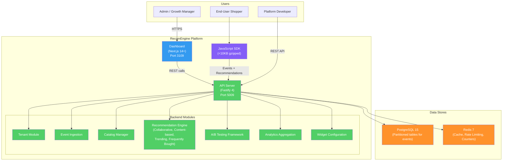

# RecomEngine -- B2B SaaS Product Recommendation Orchestrator

RecomEngine is a B2B SaaS product recommendation platform that empowers e-commerce businesses to deliver personalized product recommendations via embeddable widgets and APIs. It combines real-time behavioral event ingestion, configurable recommendation algorithms (collaborative filtering, content-based, trending, frequently bought together), and a built-in A/B testing framework.

## Why RecomEngine Exists

Mid-market e-commerce businesses ($1M-$100M annual revenue) face a critical gap in product recommendation capabilities. Enterprise solutions (Amazon Personalize, Dynamic Yield) cost $50k-$500k/year and require dedicated ML teams. Simpler tools (Nosto, Clerk.io) lack algorithmic transparency, A/B testing rigor, and multi-tenant API access for platforms.

RecomEngine delivers algorithmic power with developer-friendly APIs, embeddable widgets, and built-in experimentation -- all at a price point accessible to businesses processing 1M-100M events per month. Time to first recommendation: under 30 minutes from signup.

## Architecture Overview



## Tech Stack

| Layer | Technology | Version |
|-------|-----------|---------|
| Runtime | Node.js | 20+ |
| Language | TypeScript | 5+ |
| Backend Framework | Fastify | 4+ |
| Frontend Framework | Next.js | 14+ |
| UI Library | React | 18+ |
| Styling | Tailwind CSS | Latest |
| Database | PostgreSQL | 15+ |
| ORM | Prisma | Latest |
| Cache | Redis (ioredis) | 7+ |
| Authentication | JWT + HMAC-SHA256 API Keys | -- |
| Validation | Zod | Latest |
| Testing | Jest | Latest |
| SDK Build Tool | esbuild | Latest |

## Port Assignments

| Service | Port |
|---------|------|
| Frontend (Dashboard) | 3109 |
| Backend (API) | 5009 |
| PostgreSQL | 5432 (shared, database: `recomengine_dev`) |
| Redis | 6379 (shared) |

## Getting Started

### Prerequisites

- Node.js 20+
- Docker and Docker Compose
- PostgreSQL 15+ (or use Docker)
- Redis 7+ (or use Docker)

### Quick Start

```bash
# 1. Start infrastructure
cd products/recomengine
docker compose up -d

# 2. Set up environment
cp apps/api/.env.example apps/api/.env
# Edit .env with your database URL and secrets

# 3. Install root + app dependencies
npm install
cd apps/api && npm install && cd ../..
cd apps/web && npm install && cd ../..
cd apps/sdk && npm install && cd ../..

# 4. Run database migrations
cd apps/api && npx prisma migrate dev && cd ../..

# 5. Start development servers
npm run dev
# Dashboard: http://localhost:3109
# API: http://localhost:5009

# 6. Build the SDK
cd apps/sdk && npm run build
```

## Development Commands

```bash
# Run all tests
npm test

# Run backend tests
cd apps/api && npm test

# Run specific test file
cd apps/api && npx jest tests/integration/tenants.test.ts

# Run database migrations
cd apps/api && npx prisma migrate dev

# Open Prisma Studio
cd apps/api && npx prisma studio

# Build SDK for production
cd apps/sdk && npm run build
```

## Project Structure

```
products/recomengine/
├── apps/
│   ├── api/                        # Fastify backend (port 5009)
│   │   ├── prisma/
│   │   │   └── schema.prisma       # Tenants, Catalog, Events, Experiments, etc.
│   │   ├── src/
│   │   │   ├── plugins/            # prisma, redis, auth, observability
│   │   │   ├── routes/             # Domain-organized route modules
│   │   │   ├── utils/              # Validation, pagination, crypto
│   │   │   └── server.ts           # Server entry point
│   │   ├── tests/
│   │   │   ├── unit/               # Experiment results, assignment, pagination, crypto
│   │   │   └── integration/        # Tenants, auth, events, catalog, API keys, etc.
│   │   └── package.json
│   ├── web/                        # Next.js dashboard (port 3109)
│   │   ├── src/
│   │   │   ├── app/                # App Router pages
│   │   │   ├── hooks/              # useAuth, etc.
│   │   │   └── lib/                # API client
│   │   └── package.json
│   └── sdk/                        # Embeddable JavaScript SDK
│       ├── src/
│       │   ├── index.ts            # SDK entry point
│       │   ├── api.ts              # API communication
│       │   ├── tracker.ts          # Event tracking (impressions, clicks)
│       │   ├── renderer.ts         # Widget rendering
│       │   ├── assignment.ts       # A/B test assignment
│       │   └── config.ts           # SDK configuration
│       ├── esbuild.config.mjs
│       └── package.json
├── docs/
│   ├── PRD.md                      # Product Requirements
│   ├── architecture.md             # System Architecture
│   ├── api-schema.yml              # API Schema
│   ├── db-schema.sql               # Database Schema
│   ├── plan.md                     # Implementation Plan
│   ├── tasks.md                    # Task Tracking
│   ├── specs/                      # Feature Specifications
│   ├── ADRs/                       # Architecture Decision Records
│   └── quality-reports/            # Quality Gate Reports
├── docker-compose.yml
├── package.json                    # Root monorepo config
└── README.md                       # This file
```

## Key Features

| Feature | Description |
|---------|-------------|
| Multi-Tenant Management | Isolated data per merchant/store; tenant provisioning via API |
| Event Ingestion | Real-time behavioral events (views, clicks, cart, purchase); batch support (up to 100) |
| Catalog Management | Product catalog CRUD with batch upload (up to 500 items) |
| Recommendation Engine | Collaborative filtering, content-based, trending, frequently bought together |
| A/B Testing Framework | Split traffic between strategies; statistical significance detection |
| JavaScript SDK | Embeddable widget (<10KB); auto-tracks impressions and clicks |
| Analytics Dashboard | KPI cards, time-series charts, per-placement breakdown, CSV export |
| API Key Management | Read-only and read-write keys per tenant; HMAC-SHA256 storage |

## API Overview

All endpoints are prefixed with `/api/v1/`. Authentication via JWT (dashboard) or API key (SDK/integration).

| Domain | Key Endpoints |
|--------|---------------|
| Auth | register, login, refresh, logout |
| Tenants | CRUD, activate, suspend, list |
| API Keys | generate, revoke, list per tenant |
| Events | POST single, POST batch, list |
| Catalog | CRUD, batch upload, search |
| Recommendations | GET with strategy, user, context |
| Experiments | CRUD, start, pause, complete, results |
| Analytics | KPI cards, time-series, top products, export |
| Widgets | configuration, preview |

## Documentation

| Document | Path | Description |
|----------|------|-------------|
| PRD | [docs/PRD.md](docs/PRD.md) | Full product requirements with personas and acceptance criteria |
| Architecture | [docs/architecture.md](docs/architecture.md) | System architecture with C4 diagrams |
| API Schema | [docs/api-schema.yml](docs/api-schema.yml) | OpenAPI-style API schema |
| ADR-001 | [docs/ADRs/001-monolith-architecture.md](docs/ADRs/001-monolith-architecture.md) | Monolith architecture decision |
| ADR-002 | [docs/ADRs/002-event-storage-strategy.md](docs/ADRs/002-event-storage-strategy.md) | Event storage strategy |
| ADR-003 | [docs/ADRs/003-recommendation-caching.md](docs/ADRs/003-recommendation-caching.md) | Recommendation caching |

## License

UNLICENSED -- ConnectSW Internal
