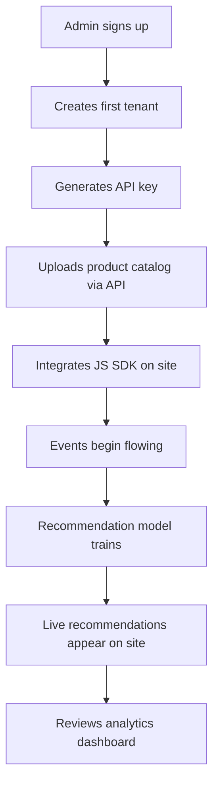
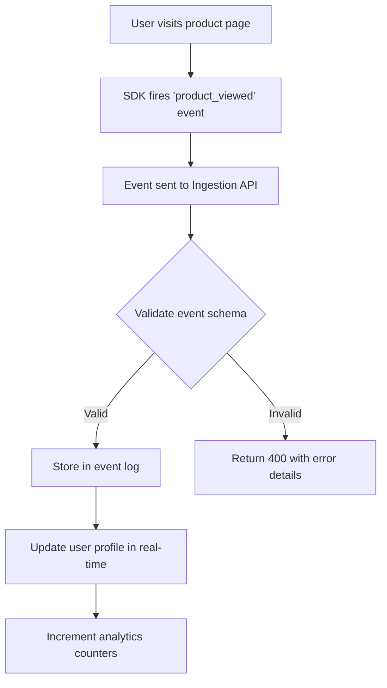
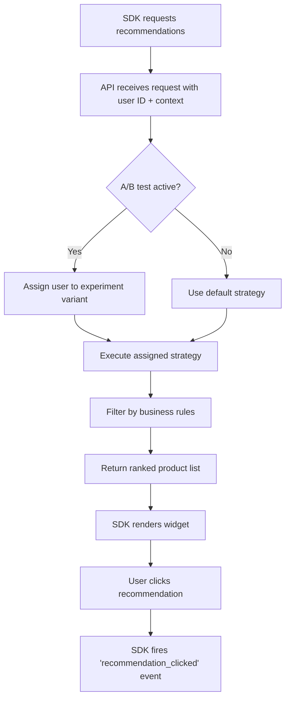
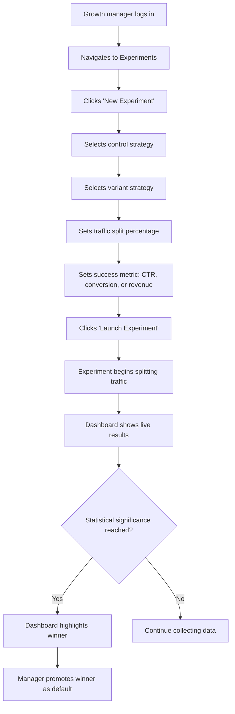
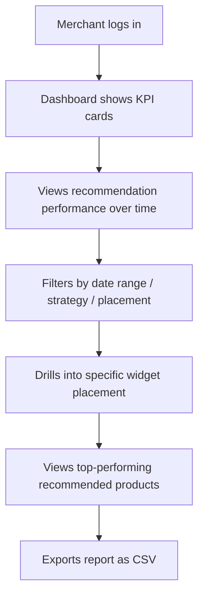

# RecomEngine - Product Requirements Document

**Version**: 1.0
**Status**: Draft
**Last Updated**: 2026-02-12
**Product Manager**: Claude Product Manager

---

## 1. Executive Summary

### 1.1 Vision

RecomEngine is a B2B SaaS product recommendation orchestrator that empowers e-commerce businesses to deliver personalized product recommendations via embeddable widgets and APIs. By combining real-time behavioral event ingestion, configurable recommendation algorithms (collaborative filtering + content-based), and a built-in A/B testing framework, RecomEngine enables merchants to increase average order value, click-through rates, and revenue per visitor without building recommendation infrastructure from scratch.

### 1.2 Problem Statement

Mid-market e-commerce businesses ($1M-$100M annual revenue) face a critical gap in product recommendation capabilities. Enterprise solutions (Amazon Personalize, Dynamic Yield) cost $50k-$500k/year and require dedicated ML teams. Simpler tools (Nosto, Clerk.io) lack algorithmic transparency, A/B testing rigor, and multi-tenant API access for platforms.

**Core Problems We Solve**:
- **High Cost of Personalization**: Enterprise recommendation engines require ML expertise and $50k+ annual investment
- **No Algorithmic Transparency**: Existing tools are black boxes with no visibility into why recommendations are made
- **Weak A/B Testing**: Most recommendation tools lack statistically rigorous experimentation frameworks to prove ROI
- **Integration Complexity**: Average integration time for recommendation engines is 2-4 weeks; merchants need days, not weeks
- **Platform Limitations**: Multi-tenant e-commerce platforms (marketplaces, SaaS storefronts) cannot offer per-tenant recommendation strategies with existing tools

**The Opportunity**: The product recommendation market is projected to reach $12B by 2028. The mid-market segment is underserved by a solution that combines algorithmic power with developer-friendly APIs, embeddable widgets, and built-in experimentation -- all at a price point accessible to businesses processing 1M-100M events per month.

### 1.3 Target Market

**Primary**: Mid-market e-commerce businesses and platforms
- Direct-to-consumer brands ($1M-$50M revenue)
- Multi-tenant marketplace platforms
- SaaS e-commerce providers (headless commerce, Shopify Plus apps)
- Subscription box services seeking churn reduction

**Secondary**: Enterprise e-commerce teams seeking cost reduction (future phase)

**Initial Launch Market**: English-language e-commerce businesses, primarily US/EU-based

### 1.4 Success Metrics

**Business KPIs**:
- **Tenants Onboarded**: 50 tenants in first 3 months
- **Events Ingested**: 100M+ events per month by end of quarter 2
- **Tenant Retention**: 85%+ after 90 days
- **Revenue**: $25k MRR by month 6 (usage-based pricing)

**Product KPIs**:
- **Recommendation Latency**: p95 response time <100ms for recommendation requests
- **Event Ingestion Throughput**: >10,000 events/second sustained per tenant
- **SDK Load Time**: JavaScript SDK loads and renders first recommendation in <500ms
- **SDK Bundle Size**: <10KB gzipped
- **A/B Test Statistical Significance**: Framework detects 5% lift at 95% confidence within 7 days for tenants with 10k+ daily visitors
- **API Uptime**: 99.9%
- **Time to First Recommendation**: <30 minutes from signup to live recommendations on tenant's site

**User Experience KPIs**:
- **Dashboard Page Load**: <2 seconds (LCP) for analytics dashboard
- **Widget Render Time**: <200ms from API response to visible recommendations
- **Integration Completion Rate**: >80% of tenants complete SDK integration within first session
- **Tenant NPS**: >50

---

## 2. User Personas

### Persona 1: Elena - E-Commerce Growth Manager

**Demographics**:
- Age: 34
- Role: Head of Growth at a DTC fashion brand
- Business: Online clothing store, $8M annual revenue
- Technical Skill: Medium (comfortable with analytics tools, basic HTML/CSS, no backend experience)

**Goals**:
- Increase average order value by 15% through cross-sell recommendations
- Reduce bounce rate on product pages by showing relevant alternatives
- Run A/B tests comparing recommendation strategies without engineering support
- Prove ROI of recommendation engine to the CFO with concrete revenue attribution data

**Pain Points**:
- Current "related products" section is manually curated and stale within days of a new product launch
- Previous recommendation vendor (Nosto) cost $2k/month with no visibility into algorithm performance
- Cannot run proper A/B tests without engineering resources
- Analytics are disconnected from recommendation performance (separate tools for site analytics vs. recommendation metrics)

**Usage Context**:
- Logs into RecomEngine dashboard 3-5 times per week
- Reviews recommendation performance metrics and A/B test results
- Adjusts recommendation strategies based on seasonal campaigns
- Exports reports for weekly growth team meetings

**What Elena Says**:
_"I need to prove that recommendations drive revenue, not just clicks. Show me the dollars, and let me test different approaches without filing an engineering ticket."_

---

### Persona 2: Raj - Platform Engineering Lead

**Demographics**:
- Age: 29
- Role: Senior Backend Engineer at a multi-vendor marketplace
- Business: Online marketplace with 500+ sellers, $30M GMV
- Technical Skill: High (full-stack, distributed systems experience)

**Goals**:
- Provide per-seller personalized recommendations across the marketplace
- Integrate recommendation API into existing product detail and search results pages
- Ensure data isolation between sellers (seller A cannot see seller B's customer behavior)
- Handle Black Friday traffic spikes (10x normal volume) without degradation

**Pain Points**:
- Built an in-house recommendation system that requires constant maintenance
- Multi-tenant data isolation is complex and error-prone with current custom solution
- No built-in A/B testing means recommendation changes are deployed as blind rollouts
- Monitoring recommendation quality requires custom dashboards that are always outdated

**Usage Context**:
- Integrates via REST API and JavaScript SDK
- Manages tenant provisioning via API (automated onboarding for new sellers)
- Monitors system health via API metrics endpoints
- Needs comprehensive API documentation and SDKs

**What Raj Says**:
_"I need an API that handles multi-tenancy correctly out of the box. Per-tenant data isolation, per-tenant rate limits, and per-tenant analytics -- without me building any of that."_

---

### Persona 3: Sophie - Product Manager at a SaaS E-Commerce Platform

**Demographics**:
- Age: 38
- Role: Director of Product at a headless commerce SaaS
- Business: Headless commerce platform serving 200+ store owners
- Technical Skill: Medium-High (understands APIs, reads code, does not write production code)

**Goals**:
- Offer "AI-powered recommendations" as a premium feature to her platform's store owners
- White-label the recommendation widget to match each store's brand
- Provide store owners with self-service analytics (no support tickets for "how are my recommendations doing?")
- Differentiate her platform from competitors (Shopify, BigCommerce) with superior personalization

**Pain Points**:
- Amazon Personalize quoted $120k/year for multi-tenant setup -- exceeds her feature budget
- Existing Shopify recommendation apps do not work with her headless architecture
- Store owners demand recommendation analytics but her team cannot build a dashboard for every store
- Each store has different product catalogs and customer bases, requiring isolated recommendation models

**Usage Context**:
- Evaluates RecomEngine during a 14-day trial
- Integrates once at the platform level, provisions tenants for each store owner
- Store owners access analytics through embedded dashboard widgets
- Needs reliable API with clear SLAs for her platform's uptime guarantees

**What Sophie Says**:
_"I need a recommendation engine I can offer to my 200 stores without hiring an ML team. Each store needs its own data silo, its own widget styles, and its own analytics -- and I need one API to manage all of them."_

---

## 3. Features

### 3.1 MVP Features (Must Have)

| ID | Feature | User Story | Priority | Phase |
|----|---------|------------|----------|-------|
| F-001 | Tenant Management | As a platform operator, I want to create and manage tenants with isolated data so that each merchant's behavioral data and recommendations remain private | P0 | MVP |
| F-002 | API Key Provisioning | As a developer, I want to generate and manage API keys per tenant so that I can authenticate requests and control access | P0 | MVP |
| F-003 | Event Ingestion API | As a developer, I want to send user behavior events (views, clicks, add-to-cart, purchases) in real-time so that recommendation models have fresh data | P0 | MVP |
| F-004 | Catalog Management API | As a developer, I want to upload and sync my product catalog so that recommendations reference accurate product data | P0 | MVP |
| F-005 | Recommendation Engine | As a merchant, I want to receive personalized product recommendations based on user behavior so that I can increase conversions | P0 | MVP |
| F-006 | Configurable Strategies | As a growth manager, I want to choose between recommendation strategies (collaborative filtering, content-based, trending, frequently bought together) so that I can optimize for different business goals | P0 | MVP |
| F-007 | Embeddable JavaScript SDK | As a developer, I want to embed a lightweight (<10KB) recommendation widget on my site with a single script tag so that integration takes less than 30 minutes | P0 | MVP |
| F-008 | A/B Testing Framework | As a growth manager, I want to split traffic between recommendation strategies and compare conversion rates so that I can make data-driven decisions about which strategy performs best | P0 | MVP |
| F-009 | Analytics Dashboard | As a merchant, I want to view real-time metrics (impressions, clicks, CTR, conversions, revenue attribution) so that I can measure the ROI of recommendations | P0 | MVP |
| F-010 | REST API | As a developer, I want full CRUD endpoints for catalogs, events, recommendations, experiments, and tenants so that I can integrate RecomEngine into any architecture | P0 | MVP |
| F-011 | Experiment Results API | As a developer, I want to query A/B test results programmatically so that I can build custom reporting or trigger automated strategy switches | P0 | MVP |
| F-012 | Widget Customization | As a merchant, I want to customize recommendation widget appearance (layout, colors, number of items) so that it matches my site's design | P0 | MVP |

### 3.2 Phase 2 Features (Should Have)

| ID | Feature | User Story | Priority | Phase |
|----|---------|------------|----------|-------|
| F-013 | Email Recommendations | As a merchant, I want to include personalized product recommendations in transactional emails (order confirmation, abandoned cart) so that I can increase repeat purchases | P1 | Phase 2 |
| F-014 | Segmentation Engine | As a growth manager, I want to create user segments (new visitors, returning customers, high-value shoppers) and apply different recommendation strategies per segment | P1 | Phase 2 |
| F-015 | Webhook Notifications | As a developer, I want to receive webhook events when experiments reach statistical significance or recommendation model retraining completes | P1 | Phase 2 |
| F-016 | White-Label Dashboard | As a platform operator, I want to embed analytics dashboards within my own platform's UI so that store owners do not leave my application | P1 | Phase 2 |
| F-017 | Bulk Event Import | As a developer, I want to upload historical event data (CSV/JSON) so that new tenants have recommendation models from day one | P1 | Phase 2 |
| F-018 | Custom Algorithm Plugins | As an advanced user, I want to define custom recommendation logic (e.g., business rules like "never recommend out-of-stock items") alongside algorithmic recommendations | P1 | Phase 2 |

### 3.3 Future Considerations (Nice to Have)

- ML model marketplace (swap in custom models trained externally)
- Visual recommendation editor (drag-and-drop widget builder)
- Search-powered recommendations (integrate with site search)
- Mobile SDK (iOS/Android native)
- Real-time collaborative filtering on streaming data (Flink/Kafka integration)
- Automated recommendation strategy optimization (multi-armed bandit)
- GraphQL API
- Shopify app, WooCommerce plugin, Magento extension
- GDPR consent management for behavioral tracking
- Revenue forecasting (predicted uplift from enabling recommendations)

---

## 4. User Flows

### 4.1 Tenant Onboarding Flow

**Time to Complete**: <30 minutes from signup to live recommendations

---

### 4.2 Event Ingestion Flow

**Latency Target**: Event accepted and acknowledged in <50ms (p95)

---

### 4.3 Recommendation Request Flow

**Latency Target**: API response in <100ms (p95)

---

### 4.4 A/B Test Creation Flow

**Time to Complete**: <5 minutes to create and launch an experiment

---

### 4.5 Analytics Review Flow

**Time to Complete**: <2 minutes to find key metrics

---

## 5. Requirements

### 5.1 Functional Requirements

**Tenant Management**:
- FR-001: Admins can create tenants with a unique name and configuration
- FR-002: Each tenant receives isolated data storage (events, catalog, recommendations, experiments)
- FR-003: Tenants can be activated, suspended, or deleted via API
- FR-004: Tenant configuration includes: default recommendation strategy, widget defaults, rate limits
- FR-005: Admin can list all tenants with pagination and filtering by status

**API Key Management**:
- FR-006: Admins can generate API keys scoped to a specific tenant
- FR-007: API keys support two permission levels: read-only (for SDK/frontend) and read-write (for backend integration)
- FR-008: API keys can be revoked without affecting other keys for the same tenant
- FR-009: API key usage is tracked (last used timestamp, request count)
- FR-010: Each tenant can have a maximum of 10 active API keys

**Event Ingestion**:
- FR-011: API accepts individual events via POST `/api/v1/events`
- FR-012: API accepts batch events (up to 100 per request) via POST `/api/v1/events/batch`
- FR-013: Supported event types: `product_viewed`, `product_clicked`, `add_to_cart`, `remove_from_cart`, `purchase`, `recommendation_clicked`, `recommendation_impressed`
- FR-014: Each event includes: `event_type`, `user_id`, `product_id`, `timestamp`, optional `session_id`, optional `metadata` (JSON, max 4KB)
- FR-015: Events are validated against schema; invalid events return 400 with field-level error details
- FR-016: Events are idempotent: duplicate events (same user_id + event_type + product_id + timestamp) are ignored with 200 response
- FR-017: JavaScript SDK auto-captures `recommendation_clicked` and `recommendation_impressed` events for recommendations it renders

**Catalog Management**:
- FR-018: API accepts product catalog items via POST `/api/v1/catalog`
- FR-019: API accepts batch catalog uploads (up to 500 items per request) via POST `/api/v1/catalog/batch`
- FR-020: Each catalog item includes: `product_id`, `name`, `description`, `category`, `price`, `image_url`, `attributes` (JSON), `available` (boolean)
- FR-021: Catalog items can be updated via PUT `/api/v1/catalog/:productId`
- FR-022: Catalog items can be soft-deleted (marked unavailable); unavailable items are excluded from recommendations
- FR-023: Catalog supports querying with pagination, filtering by category, and search by name

**Recommendation Engine**:
- FR-024: API returns recommendations via GET `/api/v1/recommendations`
- FR-025: Request parameters: `user_id` (required), `context` (optional: product page, cart page, homepage), `limit` (default 8, max 50), `strategy` (optional override)
- FR-026: Collaborative filtering strategy: recommends products based on behavior patterns of similar users
- FR-027: Content-based strategy: recommends products with similar attributes to items the user has viewed or purchased
- FR-028: Trending strategy: recommends products with the highest interaction velocity in the last 24 hours
- FR-029: Frequently bought together strategy: recommends products commonly purchased alongside a given product
- FR-030: Each recommendation response includes: `product_id`, `name`, `image_url`, `price`, `score` (0-1 confidence), `reason` (human-readable explanation)
- FR-031: Recommendations exclude products the user has already purchased (configurable per tenant)
- FR-032: Cold-start handling: for new users with <5 events, fall back to trending or category-popular recommendations

**JavaScript SDK**:
- FR-033: SDK is loadable via a single `` to their page
**When** the page loads
**Then** SDK initializes and renders recommendation widgets within 500ms
**And** the SDK bundle is <10KB gzipped

**Given** SDK is loaded on a page with a `

` element
**When** the element enters the viewport
**Then** SDK fetches recommendations and renders product cards within the container
**And** an `recommendation_impressed` event is automatically tracked

**Given** the RecomEngine API is unreachable
**When** SDK attempts to load recommendations
**Then** the widget container remains empty (no error displayed to user)
**And** the host page continues functioning without errors in the browser console

---

### F-008: A/B Testing Framework

**Given** a logged-in admin for a tenant
**When** they POST to `/api/v1/experiments` with `{ name: "Collab vs Content", control: "collaborative", variant: "content_based", trafficSplit: 50, metric: "ctr" }`
**Then** API returns 201 with experiment in `running` state
**And** subsequent recommendation requests for that tenant's users are split 50/50

**Given** a running experiment
**When** admin views experiment detail on dashboard
**Then** they see: sample size per variant, metric value per variant, confidence interval, p-value, and whether statistical significance is reached (alpha = 0.05)

**Given** user-123 is assigned to the "variant" group
**When** user-123 makes multiple recommendation requests across sessions
**Then** user-123 always receives the variant strategy (consistent assignment)

---

### F-009: Analytics Dashboard

**Given** a logged-in admin viewing a tenant's analytics
**When** the dashboard loads
**Then** KPI cards display: total impressions, total clicks, CTR (clicks/impressions), conversions, and attributed revenue for the selected date range
**And** page loads in <2 seconds (LCP)

**Given** a date range filter set to "Last 30 days"
**When** the time-series chart renders
**Then** it displays daily data points for impressions, clicks, and conversions
**And** data refreshes every 60 seconds without a full page reload

**Given** the admin clicks "Export CSV"
**When** the export completes
**Then** a CSV file downloads containing all metrics visible on the dashboard
**And** the file includes column headers matching the displayed metric names

---

### F-010: REST API

**Given** a request to any API endpoint without authentication
**When** the request is processed
**Then** API returns 401 with RFC 7807-compliant error body: `{ type, title, status, detail }`

**Given** a request to a list endpoint
**When** the response contains more items than the requested limit
**Then** the response includes `meta.pagination: { total, limit, offset, hasMore }`

---

### F-011: Experiment Results API

**Given** a completed experiment
**When** GET `/api/v1/experiments/:id/results` is called
**Then** API returns: `controlMetric`, `variantMetric`, `lift`, `pValue`, `isSignificant`, `sampleSize`, `duration`

---

### F-012: Widget Customization

**Given** a tenant's widget configuration
**When** admin sets `{ layout: "carousel", columns: 4, showPrice: true, ctaText: "Add to Cart", theme: { primaryColor: "#ff6600" } }`
**Then** SDK renders recommendations using the specified layout and styling
**And** the configuration is applied within 60 seconds of saving (no page reload required on the merchant's site)

---

## 8. Out of Scope

**Explicitly NOT included in MVP**:
- Email recommendation generation (personalized product emails)
- User segmentation engine (segment-specific strategies)
- Webhook delivery for experiment/model events
- White-label embeddable dashboard for platform operators
- Bulk historical event import (CSV/JSON upload)
- Custom algorithm plugin system
- Mobile native SDKs (iOS/Android)
- GraphQL API
- Shopify/WooCommerce/Magento plugins
- GDPR consent management UI
- Revenue forecasting / predicted uplift
- Visual drag-and-drop widget builder
- Multi-armed bandit automatic optimization
- Real-time streaming data pipeline (Kafka/Flink)
- Custom ML model hosting
- Search-powered recommendations
- Subscription billing management (Phase 2)
- Team/role management (Phase 2)

---

## 9. Dependencies

**External Services**:
- **Database**: PostgreSQL 15+ for tenant data, catalog, events, experiments, analytics
- **Cache**: Redis for recommendation caching, rate limiting, session management
- **Authentication**: Custom JWT implementation (following ConnectSW Auth Plugin pattern)
- **CDN**: Cloudflare or similar for SDK distribution
- **Monitoring**: Structured logging + observability plugin (ConnectSW pattern)

**Internal Dependencies (ConnectSW Shared Components)**:
- Auth Plugin (PATTERN-012: JWT + API Keys)
- AppError with RFC 7807 (PATTERN-013)
- Zod Input Validation (PATTERN-015)
- Fastify Plugin Registration Order (PATTERN-009)
- Prisma Plugin (database connection management)
- Redis Plugin (caching and rate limiting)
- Logger (structured logging with PII redaction)
- Crypto Utils (API key hashing, HMAC)
- Observability Plugin (metrics, correlation IDs)
- Redis Rate Limit Store (distributed rate limiting)

**Third-Party Libraries**:
- Fastify (API server)
- Prisma ORM (database access)
- Next.js + React (dashboard frontend)
- Zod (input validation)
- ioredis (Redis client)
- bcrypt (password hashing)
- date-fns (date handling)
- Tailwind CSS (dashboard styling)

---

## 10. Risks and Mitigations

| Risk | Impact | Likelihood | Mitigation |
|------|--------|------------|------------|
| Cold start problem: new tenants have no behavioral data, recommendations are irrelevant | High - tenant churns before seeing value | High | Implement trending/popular fallback strategy; support catalog-attribute-based recommendations from day one; consider offering historical data import in Phase 2 |
| Recommendation latency exceeds 100ms under load causing poor user experience on merchant sites | High - merchants remove widget | Medium | Pre-compute recommendations on event ingestion (materialized views); Redis caching with 5-minute TTL; horizontal API scaling |
| Multi-tenant data leakage: tenant A sees tenant B's data due to missing tenant_id filter | Critical - trust destruction, potential legal liability | Low | Enforce tenant_id scoping at the ORM/query level (Prisma middleware); integration tests verify isolation for every endpoint; security review by Security Engineer |
| Event ingestion throughput bottleneck during peak traffic (Black Friday) | High - lost behavioral data, degraded recommendations | Medium | Async event processing with write-ahead buffer; batch ingestion API; horizontal scaling of ingestion workers; backpressure monitoring with alerts |
| A/B test statistical validity challenged by merchants with low traffic volumes | Medium - merchants distrust results | High | Display minimum sample size warnings; show confidence intervals alongside p-values; recommend minimum test duration based on traffic volume; document statistical methodology |
| JavaScript SDK conflicts with merchant's existing scripts or frameworks | Medium - integration failures, support burden | Medium | SDK uses isolated scope (IIFE); no global namespace pollution beyond `RecomEngine`; shadow DOM for widget rendering; comprehensive compatibility testing across top 10 e-commerce platforms |
| Low adoption: merchants do not see sufficient ROI from recommendations | High - product failure | Medium | Provide clear revenue attribution in analytics; offer 14-day free trial; case study with early adopters; proactive onboarding support |
| Recommendation model quality is poor for niche product catalogs (small catalog, specialized products) | Medium - irrelevant recommendations reduce trust | Medium | Content-based strategy works well with small catalogs; trending strategy does not require collaborative data; clearly communicate minimum catalog size (50+ products) for collaborative filtering |

---

## 11. Technical Constraints

### Recommendation Algorithm Constraints

**Collaborative Filtering**:
- Requires minimum 1,000 unique users with 5+ events each before generating meaningful recommendations
- Model retraining latency: incremental updates every 15 minutes, full retrain daily
- Memory footprint: ~1KB per user-item pair in the interaction matrix
- **Implication**: New tenants must start with content-based or trending strategies

**Content-Based Filtering**:
- Requires product catalog with at least 3 populated attributes per item (category, description, price)
- Similarity computation is O(n^2) on catalog size; optimized with approximate nearest neighbors for catalogs >10,000 items
- **Implication**: Catalog quality directly determines recommendation quality

**A/B Testing**:
- Minimum sample size for 5% lift detection at 95% confidence: ~1,600 users per variant
- Experiments with <500 users per variant display a "low confidence" warning
- **Implication**: Small merchants may need 2-4 weeks to reach significance

### Infrastructure Constraints

**Event Storage**:
- 100M events/month = ~50GB raw storage per month at average 500 bytes/event
- Events older than 90 days are aggregated (daily summaries) and raw events archived
- **Implication**: Need time-partitioned tables; PostgreSQL table partitioning by month

**SDK Distribution**:
- SDK must be served from CDN with <50ms latency globally
- Version pinning: merchants include version in script URL (`/v1.js`) for stability
- **Implication**: SDK updates must be backward-compatible within major version

**Rate Limiting**:
- Per-API-key limits must be enforced across all API instances (distributed rate limiting via Redis)
- Burst allowance: 2x sustained rate for 10 seconds
- **Implication**: Redis is a hard dependency for rate limiting in production

### Port Assignments

- **Frontend (Dashboard)**: 3112 (http://localhost:3112)
- **Backend (API)**: 5008 (http://localhost:5008)
- **Database**: 5432 (shared PostgreSQL instance, database name: `recomengine_dev`)
- **Redis**: 6379 (shared Redis instance)

---

## 12. Timeline

**MVP Development** (8 weeks):
- Week 1-2: Foundation (tenant model, auth, API key provisioning, database schema, Prisma setup)
- Week 3-4: Event ingestion pipeline + catalog management API + recommendation engine (collaborative + content-based + trending)
- Week 5-6: JavaScript SDK + A/B testing framework + widget rendering
- Week 7: Analytics dashboard + experiment results visualization
- Week 8: Integration testing, E2E testing, documentation, polish

**MVP Launch** (Week 9):
- Deploy to production
- Onboard first 10 tenants (closed beta)
- Collect feedback on SDK integration experience and recommendation quality

**Phase 2** (Weeks 10-16):
- Email recommendations
- User segmentation engine
- Webhook notifications for experiments
- Bulk historical event import
- White-label dashboard embedding

**Milestones**:
- **Week 2**: Tenant management + auth + API key provisioning operational
- **Week 4**: End-to-end flow: event ingestion -> recommendation generation -> API response
- **Week 6**: SDK renders live recommendations on a test e-commerce page
- **Week 7**: A/B testing framework with live experiment results on dashboard
- **Week 8**: All MVP features complete, tests passing, documentation published
- **Week 9**: Closed beta with 10 tenants
- **Week 16**: 50 tenants, $10k MRR

---

## 13. Open Questions

**For Architect**:
- [ ] Should event storage use PostgreSQL partitioned tables or a dedicated time-series store (TimescaleDB)?
- [ ] Should recommendation model computation run in-process (Node.js) or as a separate worker service?
- [ ] How should SDK versioning work -- CDN-based immutable versions or auto-updating with cache-busting?
- [ ] Should the analytics aggregation use materialized views or a pre-computed OLAP layer?

**For CEO**:
- [ ] Should we offer a self-serve free tier, or start with sales-led onboarding only?
- [ ] What is the pricing model: per-event, per-recommendation-request, per-tenant flat fee, or usage tiers?
- [ ] Should we prioritize Shopify app store listing in Phase 2?
- [ ] Is white-labeling for platform operators a priority (Phase 2 vs. future)?

**For Security Engineer**:
- [ ] Should tenant data isolation be enforced at the PostgreSQL row-level security (RLS) level or application level?
- [ ] What is the SDK's content security policy (CSP) guidance for merchants?
- [ ] Should API keys support IP whitelisting for write operations?

---

## 14. Glossary

- **Tenant**: A customer organization using RecomEngine (e.g., an e-commerce store or marketplace)
- **Event**: A user behavior signal (product view, click, add-to-cart, purchase) sent to RecomEngine
- **Catalog**: The product inventory for a tenant, including product attributes used for content-based recommendations
- **Collaborative Filtering**: Recommendation algorithm that finds users with similar behavior patterns and recommends what similar users liked
- **Content-Based Filtering**: Recommendation algorithm that recommends products with similar attributes to ones a user has interacted with
- **Cold Start**: The challenge of making recommendations for new users or new products with insufficient behavioral data
- **A/B Test (Experiment)**: A controlled experiment comparing two recommendation strategies by splitting traffic and measuring a success metric
- **Statistical Significance**: A measure of confidence that observed differences in A/B test metrics are not due to random chance (alpha = 0.05)
- **CTR (Click-Through Rate)**: The ratio of recommendation clicks to recommendation impressions
- **Revenue Attribution**: Tracking revenue from purchases that occurred after a user clicked a recommendation
- **Impression**: An instance of a recommendation being displayed to a user (visible in viewport)
- **SDK**: Software Development Kit -- in this context, the JavaScript library embedded on merchant websites
- **Widget**: The visual component rendered by the SDK that displays product recommendations
- **Placement**: A specific location on a merchant's page where a recommendation widget is rendered (e.g., "product page sidebar", "cart page bottom")
- **Strategy**: The algorithm used to generate recommendations (collaborative, content-based, trending, frequently bought together)
- **Traffic Split**: The percentage of users assigned to each variant in an A/B test
- **Lift**: The percentage improvement of the variant metric over the control metric in an A/B test

---

**End of Document**
