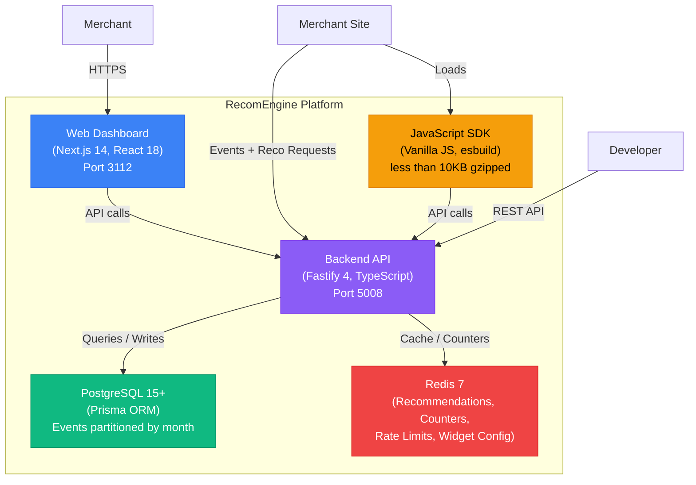
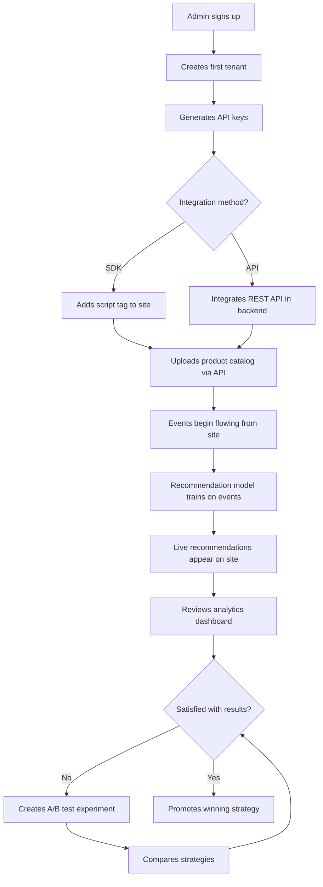
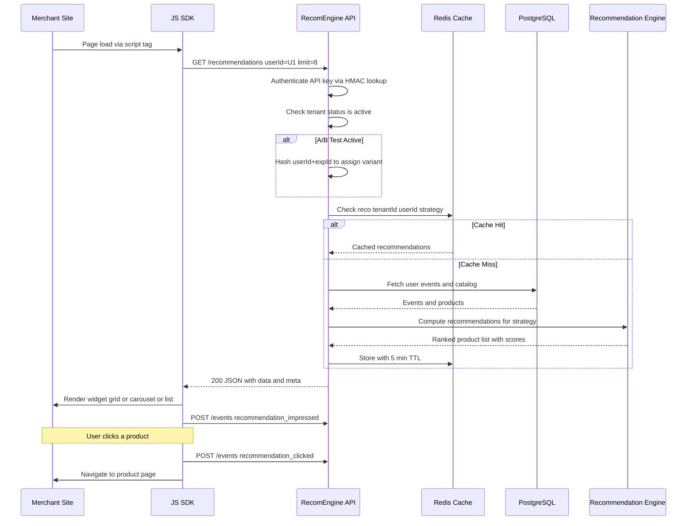
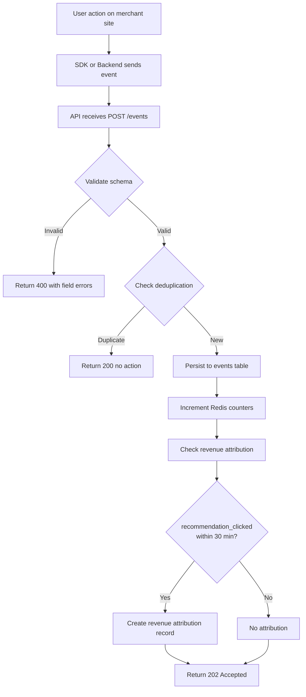
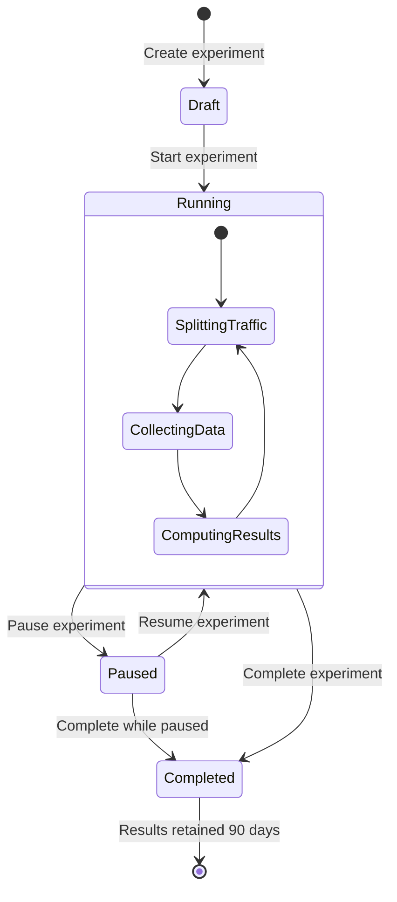
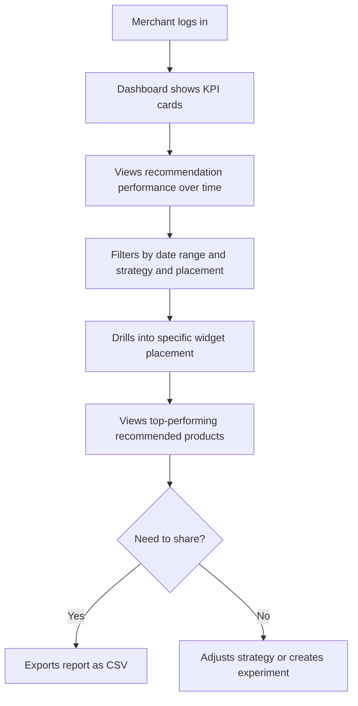
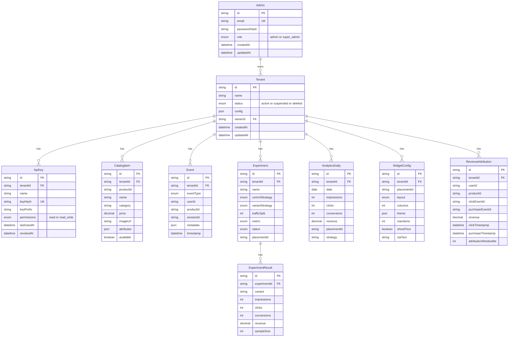

# RecomEngine - Product Requirements Document

**Version**: 2.0
**Status**: Approved
**Last Updated**: 2026-03-06
**Product Manager**: Claude Product Manager

---

## 1. Executive Summary

### 1.1 Vision

RecomEngine is a B2B SaaS product recommendation orchestrator that empowers e-commerce businesses to deliver personalized product recommendations via embeddable widgets and APIs. By combining real-time behavioral event ingestion, configurable recommendation algorithms (collaborative filtering, content-based, trending, frequently bought together), and a built-in A/B testing framework, RecomEngine enables merchants to increase average order value, click-through rates, and revenue per visitor without building recommendation infrastructure from scratch.

### 1.2 Problem Statement

Mid-market e-commerce businesses ($1M-$100M annual revenue) face a critical gap in product recommendation capabilities. Enterprise solutions (Amazon Personalize, Dynamic Yield) cost $50k-$500k/year and require dedicated ML teams. Simpler tools (Nosto, Clerk.io) lack algorithmic transparency, A/B testing rigor, and multi-tenant API access for platforms.

**Core Problems We Solve**:
- **High Cost of Personalization**: Enterprise recommendation engines require ML expertise and $50k+ annual investment
- **No Algorithmic Transparency**: Existing tools are black boxes with no visibility into why recommendations are made
- **Weak A/B Testing**: Most recommendation tools lack statistically rigorous experimentation frameworks to prove ROI
- **Integration Complexity**: Average integration time for recommendation engines is 2-4 weeks; merchants need days, not weeks
- **Platform Limitations**: Multi-tenant e-commerce platforms (marketplaces, SaaS storefronts) cannot offer per-tenant recommendation strategies with existing tools

**The Opportunity**: The product recommendation market is projected to reach $12B by 2028. The mid-market segment is underserved by a solution that combines algorithmic power with developer-friendly APIs, embeddable widgets, and built-in experimentation -- all at a price point accessible to businesses processing 1M-100M events per month.

### 1.3 Target Market

**Primary**: Mid-market e-commerce businesses and platforms
- Direct-to-consumer brands ($1M-$50M revenue)
- Multi-tenant marketplace platforms
- SaaS e-commerce providers (headless commerce, Shopify Plus apps)
- Subscription box services seeking churn reduction

**Secondary**: Enterprise e-commerce teams seeking cost reduction (future phase)

**Initial Launch Market**: English-language e-commerce businesses, primarily US/EU-based

### 1.4 Success Metrics

**Business KPIs**:

| Metric | Target | Measurement Method |
|--------|--------|--------------------|
| Tenants Onboarded | 50 tenants in first 3 months | Count of active tenants in database |
| Events Ingested | 100M+ events/month by end of Q2 | Sum of events table rows per month |
| Tenant Retention | 85%+ after 90 days | Cohort analysis of active tenants at day 90 |
| Revenue | $25k MRR by month 6 | Usage-based billing totals |

**Product KPIs**:

| Metric | Target | Measurement Method |
|--------|--------|--------------------|
| Recommendation Latency | p95 < 100ms | API response time percentiles from observability |
| Event Ingestion Throughput | 10,000 events/second sustained | Load test with k6 or similar |
| SDK Bundle Size | < 10KB gzipped | gzip -c recomengine.v1.js and wc -c |
| SDK Time to Render | < 500ms from page load | Lighthouse / RUM measurement |
| A/B Test Detection | 5% lift at 95% confidence in 7 days (10k+ daily visitors) | Statistical power analysis |
| API Uptime | 99.9% | Uptime monitoring (Pingdom / UptimeRobot) |
| Time to First Recommendation | < 30 minutes from signup | Onboarding funnel timing |

**User Experience KPIs**:

| Metric | Target | Measurement Method |
|--------|--------|--------------------|
| Dashboard Page Load (LCP) | < 2 seconds | Lighthouse / Core Web Vitals |
| Widget Render Time | < 200ms | SDK performance instrumentation |
| Integration Completion Rate | 80%+ complete SDK integration in first session | Funnel analytics |
| Tenant NPS | > 50 | Quarterly survey |

---

## 2. User Personas

### Persona 1: Elena - E-Commerce Growth Manager (Merchant)

- **Role**: Head of Growth at a DTC fashion brand ($8M annual revenue)
- **Technical Skill**: Medium (comfortable with analytics tools, basic HTML/CSS, no backend experience)
- **Goals**:
  - Increase average order value by 15% through cross-sell recommendations
  - Reduce bounce rate on product pages by showing relevant alternatives
  - Run A/B tests comparing recommendation strategies without engineering support
  - Prove ROI of recommendation engine to CFO with concrete revenue attribution data
- **Pain Points**:
  - Current "related products" section is manually curated and stale within days
  - Previous vendor (Nosto) cost $2k/month with no algorithm visibility
  - Cannot run proper A/B tests without engineering resources
  - Analytics are disconnected from recommendation performance
- **Usage Context**: Logs into dashboard 3-5x/week to review performance, adjust strategies, export reports

### Persona 2: Raj - Platform Engineering Lead (Developer)

- **Role**: Senior Backend Engineer at a multi-vendor marketplace ($30M GMV, 500+ sellers)
- **Technical Skill**: High (full-stack, distributed systems)
- **Goals**:
  - Provide per-seller personalized recommendations across the marketplace
  - Integrate recommendation API into product detail and search pages
  - Ensure data isolation between sellers
  - Handle Black Friday traffic spikes (10x normal) without degradation
- **Pain Points**:
  - In-house recommendation system requires constant maintenance
  - Multi-tenant data isolation is complex and error-prone
  - No built-in A/B testing; recommendation changes are blind rollouts
  - Custom dashboards for monitoring are always outdated
- **Usage Context**: Integrates via REST API and SDK, manages tenants programmatically, monitors via metrics

### Persona 3: Sophie - SaaS Platform Product Manager (Data Analyst)

- **Role**: Director of Product at a headless commerce SaaS (200+ store owners)
- **Technical Skill**: Medium-High (understands APIs, reads code)
- **Goals**:
  - Offer "AI-powered recommendations" as a premium platform feature
  - Customize widget appearance per store brand
  - Provide store owners with self-service analytics
  - Differentiate platform from Shopify/BigCommerce
- **Pain Points**:
  - Amazon Personalize quoted $120k/year for multi-tenant setup
  - Each store needs isolated models and analytics
  - Cannot build a dashboard for every store
- **Usage Context**: Evaluates during trial, integrates once at platform level, provisions tenants per store

### Persona 4: Marcus - Platform Administrator

- **Role**: RecomEngine internal operations / customer success
- **Technical Skill**: High
- **Goals**:
  - Monitor system health across all tenants
  - Identify and suspend abusive tenants
  - Ensure data isolation compliance
  - Track platform-wide usage metrics
- **Pain Points**:
  - Need visibility into per-tenant resource consumption
  - Must quickly respond to tenant issues
- **Usage Context**: Monitors system health dashboard, manages tenant lifecycle, reviews platform metrics

---

## 3. System Context

### 3.1 C4 Level 1: System Context Diagram

```mermaid
graph TD
    subgraph Users
        Merchant["Merchant / Growth Manager<br/>(Elena)"]
        Developer["Developer<br/>(Raj)"]
        Analyst["Data Analyst / PM<br/>(Sophie)"]
        PlatAdmin["Platform Admin<br/>(Marcus)"]
    end

    subgraph External
        MerchantSite["Merchant E-Commerce Site"]
        CDN["CDN<br/>(SDK Distribution)"]
        EmailService["Email Service<br/>(Phase 2)"]
    end

    RecomEngine["RecomEngine<br/>B2B SaaS Recommendation Platform<br/><br/>Provides personalized product<br/>recommendations via API and<br/>embeddable widgets"]

    Merchant -->|Views analytics,<br/>configures strategies,<br/>runs A/B tests| RecomEngine
    Developer -->|Integrates API,<br/>manages tenants,<br/>uploads catalogs| RecomEngine
    Analyst -->|Reviews performance,<br/>exports reports| RecomEngine
    PlatAdmin -->|Monitors health,<br/>manages tenants| RecomEngine

    MerchantSite -->|Sends events,<br/>requests recommendations| RecomEngine
    RecomEngine -->|Serves SDK bundle| CDN
    RecomEngine -.->|Sends notifications<br/>(Phase 2)| EmailService

    style RecomEngine fill:#2563EB,stroke:#1e40af,color:#fff
    style MerchantSite fill:#f59e0b,stroke:#d97706,color:#000
    style CDN fill:#10b981,stroke:#059669,color:#fff
    style EmailService fill:#6b7280,stroke:#4b5563,color:#fff
```

### 3.2 C4 Level 2: Container Diagram

```mermaid
graph TD
    subgraph RecomEnginePlatform["RecomEngine Platform"]
        WebApp["Web Dashboard<br/>(Next.js 14, React 18)<br/>Port 3112"]
        API["Backend API<br/>(Fastify 4, TypeScript)<br/>Port 5008"]
        SDK["JavaScript SDK<br/>(Vanilla JS, esbuild)<br/>less than 10KB gzipped"]
        DB["PostgreSQL 15+<br/>(Prisma ORM)<br/>Events partitioned by month"]
        Cache["Redis 7<br/>(Recommendations, Counters,<br/>Rate Limits, Widget Config)"]
    end

    Merchant["Merchant"] -->|HTTPS| WebApp
    Developer["Developer"] -->|REST API| API
    MerchantSite["Merchant Site"] -->|Events + Reco Requests| API
    MerchantSite -->|Loads| SDK

    WebApp -->|API calls| API
    SDK -->|API calls| API
    API -->|Queries / Writes| DB
    API -->|Cache / Counters| Cache

    style WebApp fill:#3b82f6,stroke:#2563eb,color:#fff
    style API fill:#8b5cf6,stroke:#7c3aed,color:#fff
    style SDK fill:#f59e0b,stroke:#d97706,color:#000
    style DB fill:#10b981,stroke:#059669,color:#fff
    style Cache fill:#ef4444,stroke:#dc2626,color:#fff
```

---

## 4. User Stories

### US-01: Admin Registration and Authentication

**As** Elena (Growth Manager),
**I want** to register an account with my email and password,
**So that** I can access the RecomEngine dashboard and manage my recommendation setup.

**Priority**: P0 | **MVP Scope**: Yes | **Feature**: F-001

**Acceptance Criteria**:
- Given a new user, when they POST to `/api/v1/auth/signup` with valid email and password (8+ chars, 1 uppercase, 1 number), then a 201 response is returned with a JWT access token (1hr) and HttpOnly refresh cookie (7d)
- Given an existing email, when signup is attempted, then a 409 response is returned with "Email already registered"
- Given valid credentials, when POST to `/api/v1/auth/login`, then a 200 response is returned with JWT access token and refresh cookie
- Given invalid credentials, when login is attempted, then a 401 response is returned with "Invalid email or password" (no indication of which is wrong)
- Given an expired access token, when POST to `/api/v1/auth/refresh` with valid refresh cookie, then a new access token and rotated refresh token are returned

---

### US-02: Tenant Creation and Management

**As** Raj (Developer),
**I want** to create and manage tenants representing merchants on my platform,
**So that** each merchant has isolated data and independent recommendation models.

**Priority**: P0 | **MVP Scope**: Yes | **Feature**: F-001

**Acceptance Criteria**:
- Given a logged-in admin, when they POST to `/api/v1/tenants` with `{ name: "Acme Store" }`, then a 201 response is returned with tenant object including `id`, `name`, `status: "active"`, `config`, `createdAt`
- Given an active tenant, when admin PUTs to `/api/v1/tenants/:id` with `{ status: "suspended" }`, then all API requests using that tenant's keys return 403 "Tenant suspended" and existing data is preserved
- Given a suspended tenant, when admin PUTs to `/api/v1/tenants/:id` with `{ status: "active" }`, then API access is restored immediately
- Given a tenant marked as deleted, when 30 days elapse, then tenant data is eligible for purging
- Given an admin with multiple tenants, when GET `/api/v1/tenants?status=active&limit=20`, then only active tenants are returned with pagination metadata

---

### US-03: API Key Provisioning

**As** Raj (Developer),
**I want** to generate API keys with specific permissions per tenant,
**So that** I can authenticate SDK requests (read-only) and server-to-server requests (read-write) separately.

**Priority**: P0 | **MVP Scope**: Yes | **Feature**: F-002

**Acceptance Criteria**:
- Given an active tenant, when admin POSTs to `/api/v1/tenants/:id/api-keys` with `{ name: "Production SDK", permissions: "read" }`, then a 201 response returns the full API key (shown only once) with prefix `rk_live_`
- Given the returned API key, when stored in the database, then only the HMAC-SHA256 hash is persisted (never plaintext)
- Given an API key with `read` permissions, when POST to `/api/v1/events`, then a 403 "Insufficient permissions: write access required" is returned
- Given a tenant with 10 active keys, when a new key creation is attempted, then a 409 "Maximum active keys (10) reached" is returned
- Given an API key, when DELETE `/api/v1/tenants/:id/api-keys/:keyId`, then the key is revoked immediately and subsequent requests with that key return 401

---

### US-04: Product Catalog Management

**As** Raj (Developer),
**I want** to upload and sync my product catalog via API,
**So that** recommendations reference accurate product data with names, images, and prices.

**Priority**: P0 | **MVP Scope**: Yes | **Feature**: F-004

**Acceptance Criteria**:
- Given a valid API key with write permissions, when POST to `/api/v1/catalog` with `{ productId: "SKU-001", name: "Blue Sneakers", category: "Shoes", price: 89.99, imageUrl: "https://..." }`, then a 201 response returns the created catalog item
- Given a batch of 500 items, when POST to `/api/v1/catalog/batch`, then all valid items are created and a response includes counts of accepted and rejected items
- Given an existing catalog item, when PUT to `/api/v1/catalog/:productId` with `{ available: false }`, then the item is marked unavailable and excluded from all future recommendations
- Given a catalog with 1000+ items, when GET `/api/v1/catalog?category=Shoes&limit=20`, then paginated results are returned filtered by category

---

### US-05: Single Event Ingestion

**As** Raj (Developer),
**I want** to send real-time behavioral events (views, clicks, purchases) via API,
**So that** recommendation models have fresh data to generate relevant suggestions.

**Priority**: P0 | **MVP Scope**: Yes | **Feature**: F-003

**Acceptance Criteria**:
- Given a valid API key with write permissions, when POST to `/api/v1/events` with `{ eventType: "product_viewed", userId: "user-123", productId: "SKU-001" }`, then a 202 response is returned within 50ms (p95)
- Given an event with a productId not in the catalog, when submitted, then the event is accepted (202) and a warning is logged (event is still persisted)
- Given a duplicate event (same tenantId + userId + eventType + productId + timestamp), when submitted, then a 200 response is returned without creating a duplicate record
- Given an event with invalid schema (missing userId), when submitted, then a 400 response with field-level error details is returned
- Given 7 supported event types (product_viewed, product_clicked, add_to_cart, remove_from_cart, purchase, recommendation_clicked, recommendation_impressed), when an unknown event type is submitted, then a 400 is returned

---

### US-06: Batch Event Ingestion

**As** Raj (Developer),
**I want** to submit up to 100 events in a single API call,
**So that** I can efficiently ingest high-volume event streams from my backend.

**Priority**: P0 | **MVP Scope**: Yes | **Feature**: F-003

**Acceptance Criteria**:
- Given a batch of 100 valid events, when POST to `/api/v1/events/batch`, then a 202 response is returned within 200ms (p95) with `{ accepted: 100, rejected: 0 }`
- Given a batch with 3 invalid events out of 50, when submitted, then a 202 response returns `{ accepted: 47, rejected: 3, errors: [{index: 5, ...}, ...] }`
- Given a batch exceeding 100 events, when submitted, then a 400 response is returned with "Batch size exceeds maximum of 100"

---

### US-07: Personalized Recommendations

**As** Elena (Growth Manager),
**I want** my site visitors to see personalized product recommendations,
**So that** they discover relevant products and I increase average order value.

**Priority**: P0 | **MVP Scope**: Yes | **Feature**: F-005

**Acceptance Criteria**:
- Given a user with 10+ behavioral events, when GET `/api/v1/recommendations?userId=user-123&limit=8`, then a 200 response with 8 products is returned within 100ms (p95), each including `productId`, `name`, `imageUrl`, `price`, `score` (0-1), `reason` (human-readable)
- Given a new user with 0 events (cold start), when recommendations are requested, then trending products are returned with `meta.strategy: "trending"` and `meta.isFallback: true`
- Given a tenant with `config.defaultStrategy: "content_based"`, when recommendations are requested without a strategy override, then content-based recommendations are returned
- Given `?strategy=frequently_bought_together&productId=SKU-001`, when processed, then products frequently co-purchased with SKU-001 are returned
- Given cached recommendations for a user, when requested again within 5 minutes, then cached results are returned with `meta.cached: true` and response time < 20ms

---

### US-08: Recommendation Strategy Configuration

**As** Elena (Growth Manager),
**I want** to choose between recommendation strategies per tenant,
**So that** I can optimize for different business goals (cross-sell vs. trending vs. similar items).

**Priority**: P0 | **MVP Scope**: Yes | **Feature**: F-006

**Acceptance Criteria**:
- Given 4 available strategies (collaborative, content_based, trending, frequently_bought_together), when admin updates tenant config with `defaultStrategy: "collaborative"`, then all recommendation requests without an explicit strategy use collaborative filtering
- Given collaborative filtering requires 1,000+ users with 5+ events each, when data is insufficient, then the system falls back to content-based or trending with `meta.isFallback: true`
- Given content-based strategy, when the user has viewed products in "Electronics", then similar electronics products are recommended based on catalog attributes

---

### US-09: A/B Testing Framework

**As** Elena (Growth Manager),
**I want** to create experiments comparing two recommendation strategies,
**So that** I can make data-driven decisions about which strategy maximizes revenue.

**Priority**: P0 | **MVP Scope**: Yes | **Feature**: F-008

**Acceptance Criteria**:
- Given a logged-in admin, when POST to `/api/v1/tenants/:id/experiments` with `{ name: "Collab vs Trending", controlStrategy: "collaborative", variantStrategy: "trending", trafficSplit: 50, metric: "ctr" }`, then a 201 response returns the experiment in `draft` state
- Given a running experiment, when recommendation requests arrive, then users are deterministically assigned to control or variant via SHA-256 hash of (userId + experimentId)
- Given user-123 assigned to "variant", when user-123 makes multiple requests across sessions, then user-123 always receives the variant strategy
- Given a placement with an active running experiment, when a second experiment is created for the same placement, then a 409 "Only one running experiment per placement" is returned
- Given experiment states (draft, running, paused, completed), when a draft experiment is started, then its status transitions to "running" and traffic splitting begins immediately

---

### US-10: A/B Test Results and Statistical Analysis

**As** Elena (Growth Manager),
**I want** to view experiment results with statistical significance indicators,
**So that** I can confidently decide which strategy to promote.

**Priority**: P0 | **MVP Scope**: Yes | **Feature**: F-011

**Acceptance Criteria**:
- Given a running experiment with data, when GET `/api/v1/tenants/:id/experiments/:expId/results`, then results include `controlMetric`, `variantMetric`, `lift`, `pValue`, `isSignificant` (alpha=0.05), `sampleSize` per variant
- Given an experiment where either variant has < 500 users, when results are displayed, then a "Low confidence" badge is shown and `meta.lowSampleSize: true` is returned
- Given CTR as the metric, when computing results, then a two-proportion z-test is used; for revenue per visitor, Welch's t-test is used

---

### US-11: Analytics Dashboard

**As** Elena (Growth Manager),
**I want** to view recommendation performance metrics on a visual dashboard,
**So that** I can measure ROI and report to stakeholders.

**Priority**: P0 | **MVP Scope**: Yes | **Feature**: F-009

**Acceptance Criteria**:
- Given a logged-in admin viewing tenant analytics, when the dashboard loads, then KPI cards display impressions, clicks, CTR, conversions, and attributed revenue for the selected date range, and page loads in < 2 seconds (LCP)
- Given a date range filter set to "Last 30 days", when the time-series chart renders, then daily data points are shown for impressions, clicks, and conversions
- Given the admin clicks "Export CSV", when the export completes, then a CSV file downloads containing all metrics visible on the dashboard
- Given real-time events flowing, when the dashboard is open, then data refreshes every 60 seconds without full page reload
- Given the top products section, when loaded, then the top 10 most-recommended and top 10 most-clicked products are displayed

---

### US-12: Embeddable JavaScript SDK

**As** Raj (Developer),
**I want** to embed a single `<script>` tag on my site that auto-initializes and renders recommendations,
**So that** integration takes less than 30 minutes without custom UI development.

**Priority**: P0 | **MVP Scope**: Yes | **Feature**: F-007

**Acceptance Criteria**:
- Given a script tag with data-api-key attribute on a page, when the page loads, then the SDK initializes and renders recommendation widgets within 500ms, and the bundle is < 10KB gzipped
- Given a div with data-recomengine-placement attribute, when it enters the viewport, then the SDK fetches recommendations and renders product cards, and a recommendation_impressed event is auto-tracked
- Given the RecomEngine API is unreachable, when the SDK attempts to load, then the widget container remains empty (no errors in console, host page unaffected)
- Given a user clicks a recommended product, then a recommendation_clicked event is auto-tracked before navigation occurs
- Given a programmatic integration, when RecomEngine.getRecommendations is called with userId and limit, then a Promise resolving to recommendation data is returned

---

### US-13: Widget Customization

**As** Elena (Growth Manager),
**I want** to customize how recommendation widgets look on my site,
**So that** they match my brand's design language.

**Priority**: P0 | **MVP Scope**: Yes | **Feature**: F-012

**Acceptance Criteria**:
- Given a tenant's widget configuration, when admin sets layout to carousel with columns 4, showPrice true, ctaText "Add to Cart", and primaryColor "#ff6600", then the SDK renders recommendations using the specified layout and styling
- Given a widget config change saved via API, when 60 seconds pass, then the SDK fetches updated config and re-renders with new styles without page reload
- Given layout options (grid, carousel, list), when each is selected, then the widget renders in the corresponding format
- Given maxItems set to 12, when recommendations are displayed, then exactly 12 items (or fewer if catalog is smaller) are shown

---

### US-14: Revenue Attribution

**As** Elena (Growth Manager),
**I want** purchases attributed to recommendation clicks,
**So that** I can measure the dollar value of the recommendation engine.

**Priority**: P0 | **MVP Scope**: Yes | **Feature**: F-009

**Acceptance Criteria**:
- Given a user clicks a recommendation for product SKU-001, when the same user purchases SKU-001 within 30 minutes, then the purchase revenue is attributed to the recommendation
- Given the 30-minute attribution window, when a purchase occurs at minute 31, then no attribution is recorded
- Given multiple recommendation clicks for different products, when a purchase matches one of them, then only the matching product's click is attributed (last-click model)
- Given the analytics dashboard, when attributed revenue is displayed, then it sums all revenue_attribution records for the selected date range

---

### US-15: Platform Admin System Health Monitoring

**As** Marcus (Platform Admin),
**I want** to monitor system health and manage tenants across the platform,
**So that** I can ensure service reliability and respond to issues quickly.

**Priority**: P0 | **MVP Scope**: Yes | **Feature**: F-001, F-010

**Acceptance Criteria**:
- Given the health endpoint, when GET `/api/v1/health`, then a 200 with `{ status: "ok" }` is returned if all dependencies are healthy
- Given the readiness endpoint, when GET `/api/v1/ready`, then it checks database and Redis connectivity and returns 200 or 503
- Given a misbehaving tenant, when admin suspends the tenant, then all their API traffic is blocked immediately and the SDK gracefully hides widgets

---

### US-16: API Documentation Pages

**As** Raj (Developer),
**I want** comprehensive API documentation available on the platform,
**So that** I can integrate RecomEngine without contacting support.

**Priority**: P0 | **MVP Scope**: Yes | **Feature**: F-010

**Acceptance Criteria**:
- Given the docs site, when navigating to `/docs`, then an overview page with links to quickstart, SDK, API reference, events, and experiments guides is displayed
- Given the quickstart guide at `/docs/quickstart`, when followed step-by-step, then a developer achieves live recommendations in < 30 minutes
- Given the API reference at `/docs/api-reference`, then every endpoint is documented with request/response examples, authentication requirements, and error codes

---

## 5. User Flows

### 5.1 Tenant Onboarding Flow

```mermaid
flowchart TD
    A[Admin signs up] --> B[Creates first tenant]
    B --> C[Generates API keys]
    C --> D{Integration method?}
    D -->|SDK| E[Adds script tag to site]
    D -->|API| F[Integrates REST API in backend]
    E --> G[Uploads product catalog via API]
    F --> G
    G --> H[Events begin flowing from site]
    H --> I[Recommendation model trains on events]
    I --> J[Live recommendations appear on site]
    J --> K[Reviews analytics dashboard]
    K --> L{Satisfied with results?}
    L -->|No| M[Creates A/B test experiment]
    M --> N[Compares strategies]
    N --> L
    L -->|Yes| O[Promotes winning strategy]
```

**Time to Complete**: < 30 minutes from signup to live recommendations

### 5.2 Recommendation Request Flow (Sequence Diagram)

```mermaid
sequenceDiagram
    participant Site as Merchant Site
    participant SDK as JS SDK
    participant API as RecomEngine API
    participant Cache as Redis Cache
    participant DB as PostgreSQL
    participant Engine as Recommendation Engine

    Site->>SDK: Page load via script tag
    SDK->>API: GET /recommendations userId=U1 limit=8
    API->>API: Authenticate API key via HMAC lookup
    API->>API: Check tenant status is active

    alt A/B Test Active
        API->>API: Hash userId+expId to assign variant
    end

    API->>Cache: Check reco tenantId userId strategy
    alt Cache Hit
        Cache-->>API: Cached recommendations
    else Cache Miss
        API->>DB: Fetch user events and catalog
        DB-->>API: Events and products
        API->>Engine: Compute recommendations for strategy
        Engine-->>API: Ranked product list with scores
        API->>Cache: Store with 5 min TTL
    end

    API-->>SDK: 200 JSON with data and meta
    SDK->>Site: Render widget grid or carousel or list
    SDK->>API: POST /events recommendation_impressed
    Note over Site,SDK: User clicks a product
    SDK->>API: POST /events recommendation_clicked
    SDK->>Site: Navigate to product page
```

### 5.3 Event Ingestion Flow

```mermaid
flowchart TD
    A[User action on merchant site] --> B[SDK or Backend sends event]
    B --> C[API receives POST /events]
    C --> D{Validate schema}
    D -->|Invalid| E[Return 400 with field errors]
    D -->|Valid| F{Check deduplication}
    F -->|Duplicate| G[Return 200 no action]
    F -->|New| H[Persist to events table]
    H --> I[Increment Redis counters]
    I --> J[Check revenue attribution]
    J --> K{recommendation_clicked<br/>within 30 min?}
    K -->|Yes| L[Create revenue attribution record]
    K -->|No| M[No attribution]
    L --> N[Return 202 Accepted]
    M --> N
```

### 5.4 A/B Test Lifecycle

```mermaid
stateDiagram-v2
    [*] --> Draft: Create experiment
    Draft --> Running: Start experiment
    Running --> Paused: Pause experiment
    Paused --> Running: Resume experiment
    Running --> Completed: Complete experiment
    Paused --> Completed: Complete while paused
    Completed --> [*]: Results retained 90 days

    state Running {
        [*] --> SplittingTraffic
        SplittingTraffic --> CollectingData
        CollectingData --> ComputingResults
        ComputingResults --> SplittingTraffic
    }
```

### 5.5 Analytics Review Flow

```mermaid
flowchart TD
    A[Merchant logs in] --> B[Dashboard shows KPI cards]
    B --> C[Views recommendation performance over time]
    C --> D[Filters by date range and strategy and placement]
    D --> E[Drills into specific widget placement]
    E --> F[Views top-performing recommended products]
    F --> G{Need to share?}
    G -->|Yes| H[Exports report as CSV]
    G -->|No| I[Adjusts strategy or creates experiment]
```

---

## 6. Data Model

### 6.1 Entity-Relationship Diagram

```mermaid
erDiagram
    Admin ||--o{ Tenant : "owns"
    Tenant ||--o{ ApiKey : "has"
    Tenant ||--o{ CatalogItem : "has"
    Tenant ||--o{ Event : "has"
    Tenant ||--o{ Experiment : "has"
    Tenant ||--o{ AnalyticsDaily : "has"
    Tenant ||--o{ WidgetConfig : "has"
    Tenant ||--o{ RevenueAttribution : "has"
    Experiment ||--o{ ExperimentResult : "has"

    Admin {
        string id PK
        string email UK
        string passwordHash
        enum role "admin or super_admin"
        datetime createdAt
        datetime updatedAt
    }

    Tenant {
        string id PK
        string name
        enum status "active or suspended or deleted"
        json config
        string ownerId FK
        datetime createdAt
        datetime updatedAt
    }

    ApiKey {
        string id PK
        string tenantId FK
        string name
        string keyHash UK
        string keyPrefix
        enum permissions "read or read_write"
        datetime lastUsedAt
        datetime revokedAt
    }

    CatalogItem {
        string id PK
        string tenantId FK
        string productId
        string name
        string category
        decimal price
        string imageUrl
        json attributes
        boolean available
    }

    Event {
        string id PK
        string tenantId FK
        enum eventType
        string userId
        string productId
        string sessionId
        json metadata
        datetime timestamp
    }

    Experiment {
        string id PK
        string tenantId FK
        string name
        enum controlStrategy
        enum variantStrategy
        int trafficSplit
        enum metric
        enum status
        string placementId
    }

    ExperimentResult {
        string id PK
        string experimentId FK
        string variant
        int impressions
        int clicks
        int conversions
        decimal revenue
        int sampleSize
    }

    AnalyticsDaily {
        string id PK
        string tenantId FK
        date date
        int impressions
        int clicks
        int conversions
        decimal revenue
        string placementId
        string strategy
    }

    WidgetConfig {
        string id PK
        string tenantId FK
        string placementId
        enum layout
        int columns
        json theme
        int maxItems
        boolean showPrice
        string ctaText
    }

    RevenueAttribution {
        string id PK
        string tenantId FK
        string userId
        string productId
        string clickEventId
        string purchaseEventId
        decimal revenue
        datetime clickTimestamp
        datetime purchaseTimestamp
        int attributionWindowMs
    }
```

---

## 7. Functional Requirements

### Tenant Management
- **FR-001**: Admins MUST be able to create tenants with a unique name and configuration
- **FR-002**: Each tenant MUST have isolated data storage; all queries scoped by tenantId
- **FR-003**: Tenants MUST support status lifecycle: active, suspended, deleted (soft delete with 30-day data retention)
- **FR-004**: Tenant configuration MUST include: default recommendation strategy, widget defaults, CORS origins, rate limit overrides
- **FR-005**: Admin MUST be able to list tenants with pagination and filtering by status

### API Key Management
- **FR-006**: Admins MUST be able to generate API keys scoped to a specific tenant with rk_live_ or rk_test_ prefix
- **FR-007**: API keys MUST support two permission levels: read (SDK/frontend) and read_write (backend)
- **FR-008**: API keys MUST be revocable without affecting other keys for the same tenant
- **FR-009**: API key usage MUST be tracked (lastUsedAt timestamp updated on each request)
- **FR-010**: Each tenant MUST have a maximum of 10 active (non-revoked) API keys

### Event Ingestion
- **FR-011**: API MUST accept individual events via POST /api/v1/events
- **FR-012**: API MUST accept batch events (up to 100 per request) via POST /api/v1/events/batch
- **FR-013**: System MUST support 7 event types: product_viewed, product_clicked, add_to_cart, remove_from_cart, purchase, recommendation_clicked, recommendation_impressed
- **FR-014**: Each event MUST include: eventType, userId (1-256 chars), productId (1-256 chars); optional: timestamp (ISO 8601), sessionId, metadata (JSON, max 4KB)
- **FR-015**: Invalid events MUST return 400 with field-level error details
- **FR-016**: Events MUST be deduplicated on (tenantId + userId + eventType + productId + timestamp); duplicates return 200
- **FR-017**: SDK MUST auto-capture recommendation_clicked and recommendation_impressed events

### Catalog Management
- **FR-018**: API MUST accept catalog items via POST /api/v1/catalog
- **FR-019**: API MUST accept batch catalog uploads (up to 500 items) via POST /api/v1/catalog/batch
- **FR-020**: Each catalog item MUST include: productId, name; optional: description, category, price, imageUrl, attributes (JSON), available (boolean, default true)
- **FR-021**: Catalog items MUST be updatable via PUT /api/v1/catalog/:productId
- **FR-022**: Unavailable catalog items (available=false) MUST be excluded from all recommendation results
- **FR-023**: Catalog MUST support querying with pagination, filtering by category, and search by name

### Recommendation Engine
- **FR-024**: API MUST return recommendations via GET /api/v1/recommendations
- **FR-025**: Request parameters: userId (required), limit (default 8, max 50), strategy (optional override), productId (required for FBT)
- **FR-026**: Collaborative filtering: recommends products based on similar user behavior via cosine similarity; requires 1,000+ users with 5+ events
- **FR-027**: Content-based: recommends products with similar catalog attributes; works with 50+ products
- **FR-028**: Trending: ranks products by interaction velocity (views=1, clicks=2, add-to-cart=3, purchases=5) in last 24 hours; global to tenant
- **FR-029**: Frequently bought together: co-occurrence analysis of products purchased in same session or by same user within 7 days; requires productId parameter
- **FR-030**: Each recommendation MUST include: productId, name, imageUrl, price, score (0-1), reason (human-readable)
- **FR-031**: Recommendations MUST exclude products the user has already purchased (configurable via tenant config excludePurchased)
- **FR-032**: Cold-start handling: users with 0-4 events receive trending fallback; new products with 0 interactions use content-based from catalog attributes; response includes meta.isFallback: true

### JavaScript SDK
- **FR-033**: SDK MUST load via single script tag with async attribute and data-api-key attribute
- **FR-034**: SDK MUST initialize automatically, reading API key from script tag
- **FR-035**: SDK MUST render product cards with image, name, price, and configurable CTA button
- **FR-036**: SDK MUST support multiple placements on the same page via data-recomengine-placement attributes
- **FR-037**: SDK MUST auto-track impressions (IntersectionObserver when widget enters viewport) and clicks
- **FR-038**: SDK MUST expose RecomEngine.getRecommendations(options) for programmatic access (returns Promise)
- **FR-039**: SDK MUST fail silently if API is unreachable (no console errors, widget container hidden)
- **FR-040**: SDK MUST expose RecomEngine.onRecommendations(callback) for headless/custom rendering
- **FR-041**: SDK bundle MUST NOT exceed 10KB gzipped

### A/B Testing Framework
- **FR-042**: Admins MUST be able to create experiments via POST /api/v1/tenants/:id/experiments
- **FR-043**: Each experiment MUST define: name, controlStrategy, variantStrategy, trafficSplit (1-99%), metric (CTR, conversion_rate, revenue_per_visitor)
- **FR-044**: User assignment MUST be deterministic via SHA-256 hash of (userId + experimentId) ensuring consistent variant across sessions
- **FR-045**: Experiment results MUST include: sampleSize, metric per variant, lift, pValue, isSignificant (alpha=0.05)
- **FR-046**: Experiments MUST support states: draft, running, paused, completed
- **FR-047**: MUST enforce max 1 running experiment per placement per tenant
- **FR-048**: Completed experiment results MUST be retained for 90 days

### Analytics Dashboard
- **FR-049**: Dashboard MUST display KPI cards: impressions, clicks, CTR, conversions, attributed revenue
- **FR-050**: Dashboard MUST display time-series chart with daily granularity
- **FR-051**: Dashboard MUST display top 10 most-recommended and top 10 most-clicked products
- **FR-052**: Dashboard MUST support date range filtering (7d, 30d, 90d, custom)
- **FR-053**: Dashboard MUST display per-placement breakdown
- **FR-054**: Dashboard MUST display experiment results with control vs variant comparison
- **FR-055**: Dashboard data MUST refresh every 60 seconds without full page reload
- **FR-056**: Dashboard MUST support CSV export of all displayed metrics

### REST API Standards
- **FR-057**: All endpoints MUST be versioned under /api/v1/
- **FR-058**: All responses MUST follow envelope: { data, meta, errors }
- **FR-059**: All list endpoints MUST support pagination (limit, offset, max 100)
- **FR-060**: All errors MUST follow RFC 7807 Problem Details format
- **FR-061**: API MUST support CORS for browser-based SDK requests (origins from tenant config)
- **FR-062**: API MUST expose OpenAPI 3.0 specification

### Revenue Attribution
- **FR-063**: A purchase event within 30 minutes of a recommendation_clicked event for the same user and product MUST be attributed to the recommendation
- **FR-064**: Attribution MUST use last-click model (a purchase can only be attributed to one recommendation click)
- **FR-065**: Attribution records MUST store click event ID, purchase event ID, revenue amount, timestamps

---

## 8. Non-Functional Requirements

### Performance
- **NFR-001**: Recommendation API MUST respond in < 100ms (p95) for requests with limit <= 50
- **NFR-002**: Single event ingestion MUST acknowledge in < 50ms (p95)
- **NFR-003**: Batch event ingestion (100 events) MUST complete in < 200ms (p95)
- **NFR-004**: Dashboard initial page load MUST complete in < 2 seconds (LCP)
- **NFR-005**: SDK JavaScript bundle MUST be < 10KB gzipped
- **NFR-006**: SDK MUST render recommendation widget within 200ms of receiving API response
- **NFR-007**: Analytics aggregation queries MUST complete in < 500ms for 30-day range

### Security
- **NFR-008**: All API communication MUST use HTTPS with TLS 1.2+
- **NFR-009**: API keys MUST be stored as HMAC-SHA256 hashes (never plaintext)
- **NFR-010**: All queries MUST be scoped by tenantId (enforced via Prisma middleware)
- **NFR-011**: Rate limiting: 1,000 reads/min, 500 writes/min per API key (distributed via Redis)
- **NFR-012**: CSRF protection on dashboard state-changing endpoints (SameSite cookies + double-submit cookie)
- **NFR-013**: SDK MUST communicate only with configured API domain (no third-party requests)
- **NFR-014**: JWT access tokens (1hr), HttpOnly refresh token cookies (7d), bcrypt cost factor 12
- **NFR-015**: All user input MUST be validated with Zod schemas

### Reliability
- **NFR-016**: API uptime 99.9% (8.7 hours max downtime/year)
- **NFR-017**: Event ingestion at-least-once delivery; duplicates handled idempotently
- **NFR-018**: Database backups daily with 30-day retention
- **NFR-019**: Recommendation engine MUST return cached/stale results if computation service is unavailable
- **NFR-020**: SDK MUST fail silently (no thrown errors, no host page breakage)

### Scalability
- **NFR-021**: Support 1,000 concurrent tenants
- **NFR-022**: Ingest 10,000 events/second sustained (aggregate)
- **NFR-023**: Serve 5,000 recommendation requests/second (aggregate)
- **NFR-024**: Database design supports 1B+ events and 10M+ catalog items (monthly partitioning)
- **NFR-025**: API layer is stateless; horizontally scalable via load balancer

### Accessibility
- **NFR-026**: Dashboard MUST meet WCAG 2.1 Level AA
- **NFR-027**: Dashboard MUST support keyboard navigation for all interactive elements
- **NFR-028**: Color contrast ratio >= 4.5:1 for all text
- **NFR-029**: Screen reader compatible (ARIA labels on charts, data tables)

### Observability
- **NFR-030**: All API requests MUST be logged with correlation ID (X-Request-ID)
- **NFR-031**: System MUST emit metrics: recommendation latency, event throughput, error rate, cache hit ratio
- **NFR-032**: Structured logging with PII redaction and 90-day retention

---

## 9. Site Map

| Route | Status | Description |
|-------|--------|-------------|
| `/` | MVP | Landing page (product marketing, feature overview, pricing) |
| `/signup` | MVP | Admin registration (email + password) |
| `/login` | MVP | Admin login |
| `/forgot-password` | MVP | Password reset request |
| `/reset-password` | MVP | Password reset with token |
| `/dashboard` | MVP | Main dashboard (KPI overview across all tenants) |
| `/dashboard/tenants` | MVP | Tenant list (create, manage, suspend) |
| `/dashboard/tenants/:id` | MVP | Tenant detail (config, API keys, usage stats) |
| `/dashboard/tenants/:id/analytics` | MVP | Per-tenant analytics (impressions, clicks, CTR, conversions, revenue) |
| `/dashboard/tenants/:id/catalog` | MVP | Per-tenant product catalog browser |
| `/dashboard/tenants/:id/events` | MVP | Per-tenant event stream viewer (recent events, search) |
| `/dashboard/tenants/:id/experiments` | MVP | Per-tenant experiment list |
| `/dashboard/tenants/:id/experiments/new` | MVP | Create new A/B test experiment |
| `/dashboard/tenants/:id/experiments/:expId` | MVP | Experiment detail (results, traffic split, status) |
| `/dashboard/tenants/:id/widgets` | MVP | Widget configuration and preview |
| `/dashboard/tenants/:id/api-keys` | MVP | API key management for the tenant |
| `/dashboard/settings` | MVP | Account settings (profile, password change) |
| `/dashboard/settings/billing` | Deferred | Subscription and usage billing (page skeleton with empty state) |
| `/dashboard/settings/team` | Deferred | Team member management (page skeleton with empty state) |
| `/docs` | MVP | API documentation overview |
| `/docs/quickstart` | MVP | Quick start integration guide |
| `/docs/sdk` | MVP | JavaScript SDK reference |
| `/docs/api-reference` | MVP | REST API endpoint reference |
| `/docs/events` | MVP | Event schema and ingestion guide |
| `/docs/experiments` | MVP | A/B testing guide |
| `/pricing` | MVP | Pricing tiers and usage calculator |

**API Endpoints**:

| Endpoint | Method | Auth | Description |
|----------|--------|------|-------------|
| /api/v1/auth/signup | POST | None | Admin registration |
| /api/v1/auth/login | POST | None | Admin login |
| /api/v1/auth/logout | POST | JWT | Admin logout |
| /api/v1/auth/refresh | POST | Cookie | Token refresh |
| /api/v1/auth/forgot-password | POST | None | Password reset request |
| /api/v1/auth/reset-password | POST | None | Password reset with token |
| /api/v1/tenants | GET, POST | JWT | Tenant list and creation |
| /api/v1/tenants/:id | GET, PUT, DELETE | JWT | Tenant detail, update, delete |
| /api/v1/tenants/:id/api-keys | GET, POST | JWT | API key list and creation |
| /api/v1/tenants/:id/api-keys/:keyId | DELETE | JWT | Revoke API key |
| /api/v1/events | POST | API Key (write) | Single event ingestion |
| /api/v1/events/batch | POST | API Key (write) | Batch event ingestion |
| /api/v1/catalog | GET, POST | API Key | Catalog list and creation |
| /api/v1/catalog/batch | POST | API Key (write) | Batch catalog upload |
| /api/v1/catalog/:productId | GET, PUT, DELETE | API Key | Catalog item CRUD |
| /api/v1/recommendations | GET | API Key (read) | Get recommendations |
| /api/v1/tenants/:id/experiments | GET, POST | JWT | Experiment list and creation |
| /api/v1/tenants/:id/experiments/:expId | GET, PUT | JWT | Experiment detail and update |
| /api/v1/tenants/:id/experiments/:expId/results | GET | JWT | Experiment results |
| /api/v1/tenants/:id/analytics/overview | GET | JWT | KPI overview |
| /api/v1/tenants/:id/analytics/timeseries | GET | JWT | Time-series data |
| /api/v1/tenants/:id/analytics/top-products | GET | JWT | Top products |
| /api/v1/tenants/:id/analytics/export | GET | JWT | CSV export |
| /api/v1/tenants/:id/widgets | GET, POST | JWT or API Key | Widget config list and creation |
| /api/v1/tenants/:id/widgets/:placementId | GET, PUT, DELETE | JWT or API Key | Widget config CRUD |
| /api/v1/health | GET | None | Liveness check |
| /api/v1/ready | GET | None | Readiness check |

---

## 10. MVP Scope Summary

**MVP includes user stories**: US-01 through US-16

**MVP Features (F-001 through F-012)**:

| ID | Feature | Stories |
|----|---------|---------|
| F-001 | Tenant Management | US-01, US-02, US-15 |
| F-002 | API Key Provisioning | US-03 |
| F-003 | Event Ingestion API | US-05, US-06 |
| F-004 | Catalog Management API | US-04 |
| F-005 | Recommendation Engine | US-07 |
| F-006 | Configurable Strategies | US-08 |
| F-007 | Embeddable JavaScript SDK | US-12 |
| F-008 | A/B Testing Framework | US-09 |
| F-009 | Analytics Dashboard | US-11, US-14 |
| F-010 | REST API | US-15, US-16 |
| F-011 | Experiment Results API | US-10 |
| F-012 | Widget Customization | US-13 |

---

## 11. Phase 2 Features (Post-MVP)

| ID | Feature | User Story | Priority |
|----|---------|------------|----------|
| F-013 | Email Recommendations | As a merchant, I want personalized recommendations in transactional emails to increase repeat purchases | P1 |
| F-014 | User Segmentation | As a growth manager, I want to apply different strategies per user segment (new, returning, high-value) | P1 |
| F-015 | Webhook Notifications | As a developer, I want webhook events when experiments reach significance or models retrain | P1 |
| F-016 | White-Label Dashboard | As a platform operator, I want embeddable analytics dashboards within my own platform | P1 |
| F-017 | Bulk Historical Import | As a developer, I want to upload historical events so new tenants have models from day one | P1 |
| F-018 | Custom Algorithm Plugins | As an advanced user, I want custom recommendation logic alongside algorithmic recommendations | P1 |
| F-019 | Subscription Billing | As a merchant, I want to manage my subscription and view usage-based billing | P1 |
| F-020 | Team Management | As an admin, I want to invite team members with role-based access | P1 |

---

## 12. Out of Scope

The following are explicitly NOT part of MVP or Phase 2:

- Mobile native SDKs (iOS/Android)
- GraphQL API
- Shopify/WooCommerce/Magento plugins
- GDPR consent management UI
- Revenue forecasting / predicted uplift
- Visual drag-and-drop widget builder
- Multi-armed bandit automatic optimization
- Real-time streaming data pipeline (Kafka/Flink)
- Custom ML model hosting
- Search-powered recommendations
- Multi-language / i18n support

---

## 13. Dependencies

| Dependency | Type | Purpose |
|-----------|------|---------|
| PostgreSQL 15+ | Infrastructure | Primary data store (events partitioned by month) |
| Redis 7 | Infrastructure | Recommendation cache, rate limits, real-time counters, widget config |
| CDN | Infrastructure | SDK distribution (recomengine.v1.js) |
| SMTP / Email Service | External (Phase 2) | Password reset emails, experiment notifications |
| DNS / TLS Certificates | Infrastructure | HTTPS for API and dashboard |

---

## 14. Risks and Mitigations

| Risk | Impact | Likelihood | Mitigation |
|------|--------|------------|------------|
| Cold-start problem: new tenants have no events for collaborative filtering | High | High | Trending and content-based fallbacks for users with < 5 events; onboarding flow encourages catalog upload first |
| Redis failure degrades recommendation latency and rate limiting | High | Low | In-memory fallback for rate limiting; synchronous DB computation on cache miss |
| Event storage volume exceeds PostgreSQL capacity | Medium | Medium | Monthly table partitioning (ADR-002); old partitions detachable/archivable; monitor with alerts at 80% disk |
| SDK errors break merchant site | Critical | Low | SDK wrapped in try/catch; fails silently; no console errors; zero external dependencies |
| Multi-tenant data leak | Critical | Low | All queries scoped by tenantId via Prisma middleware; integration tests verify isolation; security audit before launch |
| A/B test results misleading with small sample sizes | Medium | Medium | Dashboard shows Low confidence badge for variants with < 500 users |
| Recommendation quality perception | Medium | Medium | Human-readable reason field in every recommendation; transparency builds trust |
| API key leaked in client-side code | High | Medium | Read-only keys for SDK; key rotation supported; monitoring for unusual usage patterns |

---

## 15. Technical Constraints

- **Runtime**: Node.js 20+ / TypeScript 5+
- **Backend**: Fastify 4 (modular monolith architecture per ADR-001)
- **Frontend**: Next.js 14 + React 18 (App Router)
- **Database**: PostgreSQL 15+ with Prisma ORM; events table partitioned by month
- **Cache**: Redis 7 for recommendations (5-min TTL), counters, rate limits
- **SDK**: Vanilla JS/TS, esbuild bundler, < 10KB gzipped, no framework dependencies
- **Ports**: Frontend 3112, Backend 5008 (per PORT-REGISTRY)
- **Auth**: JWT (1hr access) + HttpOnly refresh cookies (7d) + bcrypt cost 12
- **API Keys**: HMAC-SHA256 hashed storage, rk_live_ / rk_test_ prefixes

---

## 16. Glossary

| Term | Definition |
|------|-----------|
| Tenant | A merchant or store whose data is isolated within RecomEngine |
| Placement | A location on a merchant site where recommendations are displayed |
| Strategy | An algorithm used to generate recommendations (collaborative, content-based, trending, FBT) |
| Cold Start | A user or product with insufficient data for personalized recommendations |
| CTR | Click-through rate: clicks / impressions |
| Revenue Attribution | Linking a purchase to a prior recommendation click within 30 minutes |
| Traffic Split | Percentage of users assigned to the variant vs control in an A/B test |
| SDK | JavaScript library embedded on merchant sites to display recommendations and track events |

---

## 17. Timeline

**MVP Milestones** (features, not dates):
- **Milestone 1 - Foundation**: Auth, tenant CRUD, API key management (US-01, US-02, US-03)
- **Milestone 2 - Data Pipeline**: Event ingestion, catalog management (US-04, US-05, US-06)
- **Milestone 3 - Core Engine**: Recommendation strategies, caching (US-07, US-08)
- **Milestone 4 - Experimentation**: A/B testing framework, results (US-09, US-10)
- **Milestone 5 - Dashboard**: Analytics UI, KPI cards, time-series, CSV export (US-11, US-14)
- **Milestone 6 - SDK**: JavaScript SDK, widget rendering, auto-tracking (US-12, US-13)
- **Milestone 7 - Docs and Polish**: API docs, quickstart guide, health checks (US-15, US-16)

**Phase 2**: F-013 through F-020 (billing, team management, webhooks, segmentation)
