# RecomEngine -- System Architecture

**Version**: 1.0
**Status**: Draft
**Last Updated**: 2026-02-12
**Author**: Architect

---

## 1. Architecture Overview

RecomEngine is a B2B SaaS product recommendation orchestrator for e-commerce. The system follows a **modular monolith** architecture: a single deployable unit with clean internal module boundaries, shared database, and Redis cache. This approach optimizes for developer velocity and operational simplicity during the MVP phase while preserving the option to extract modules into separate services in the future.

### 1.1 System Context Diagram

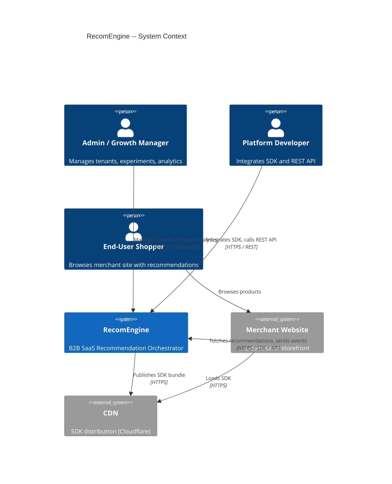

### 1.2 Container Diagram

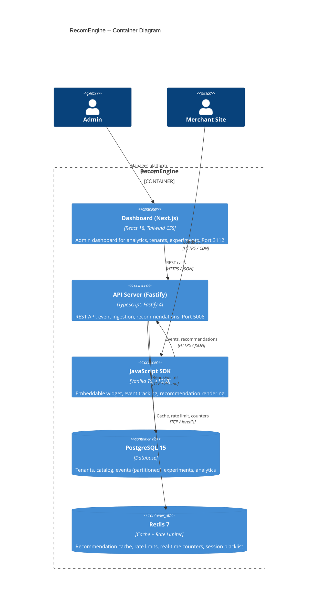

---

## 2. Component Architecture

### 2.1 Backend Module Map

The API server is organized into 10 domain modules plus shared infrastructure (plugins, utilities). Each module follows the Route-Handler-Service pattern.

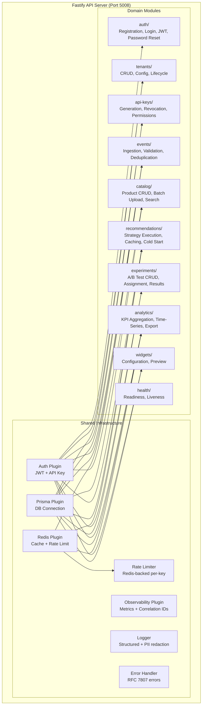

### 2.2 Module Details

| Module | Routes File | Auth Required | Auth Type | Description |
|--------|-------------|---------------|-----------|-------------|
| `auth/` | `routes.ts` | No (public) | None | Signup, login, logout, forgot/reset password |
| `tenants/` | `routes.ts` | Yes | JWT (Admin) | Tenant CRUD, config, lifecycle (activate/suspend/delete) |
| `api-keys/` | `routes.ts` | Yes | JWT (Admin) | API key generation, revocation, listing per tenant |
| `events/` | `routes.ts` | Yes | API Key (write) | Single and batch event ingestion with validation + dedup |
| `catalog/` | `routes.ts` | Yes | API Key (read-write) | Product CRUD, batch upload, search with pagination |
| `recommendations/` | `routes.ts` | Yes | API Key (read) | Fetch recommendations with strategy selection + A/B routing |
| `experiments/` | `routes.ts` | Yes | JWT (Admin) | Experiment CRUD, status transitions, results computation |
| `analytics/` | `routes.ts` | Yes | JWT (Admin) | KPI overview, time-series, top products, CSV export |
| `widgets/` | `routes.ts` | Yes | JWT (Admin) or API Key (read) | Widget config CRUD, preview rendering |
| `health/` | `routes.ts` | No (public) | None | `/health` (liveness) and `/ready` (readiness) |

### 2.3 Module File Structure

Each domain module follows a consistent structure:

```
modules/{module}/
  routes.ts     -- Fastify route definitions with schema validation
  handlers.ts   -- Request parsing, response formatting
  service.ts    -- Business logic (testable independently)
  schemas.ts    -- Zod schemas for request/response validation
```

### 2.4 Frontend Architecture (Dashboard)

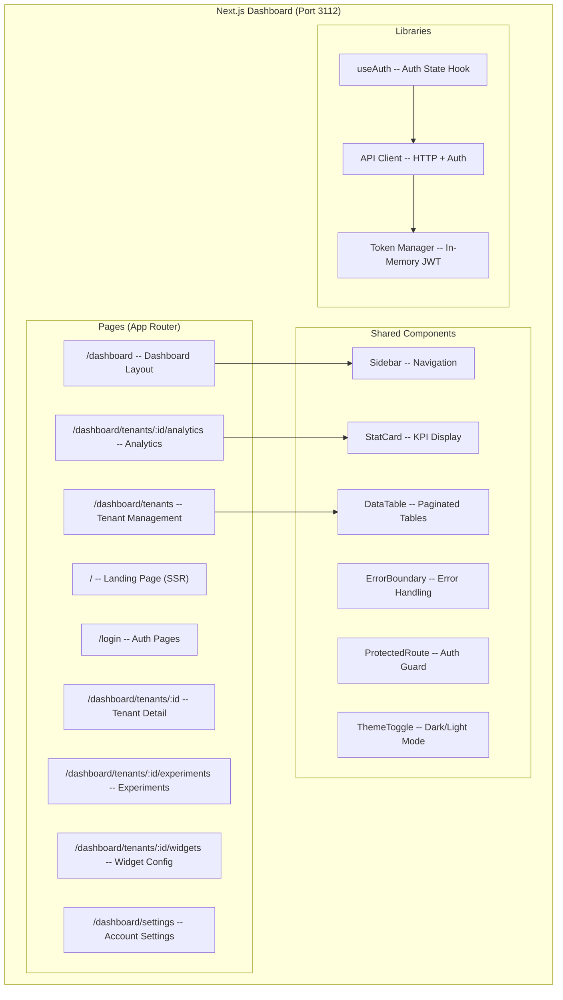

### 2.5 SDK Architecture

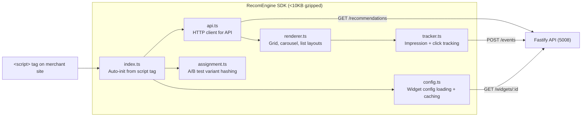

**SDK Design Principles:**
- IIFE wrapper: only `window.RecomEngine` is exposed globally
- Zero npm dependencies in the bundle
- Built with esbuild for tree-shaking and minification
- Graceful degradation: widget hides if API is unreachable; no errors thrown
- Intersection Observer for viewport-based impression tracking
- Shadow DOM (optional) for style isolation from host page

---

## 3. Data Flow Diagrams

### 3.1 Event Ingestion Flow

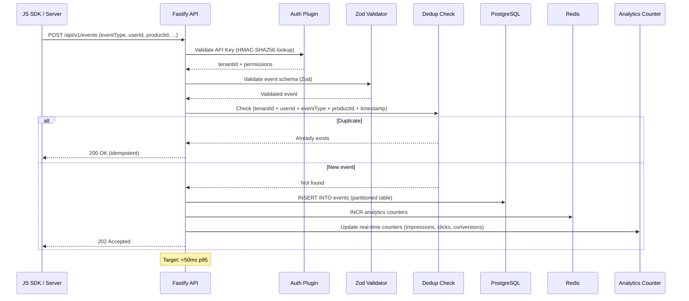

### 3.2 Recommendation Request Flow

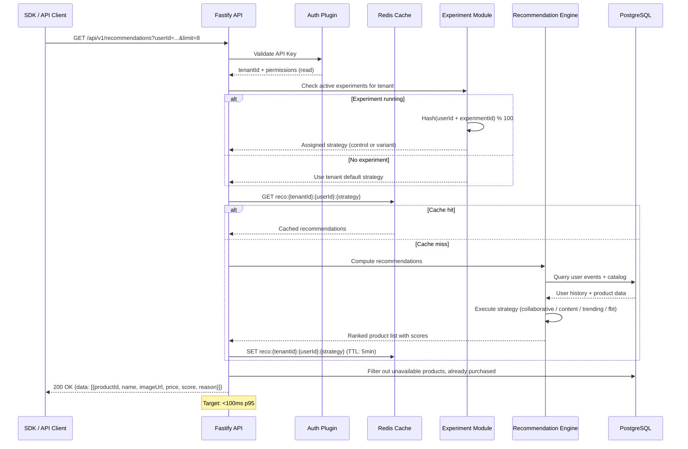

### 3.3 A/B Test Assignment Flow

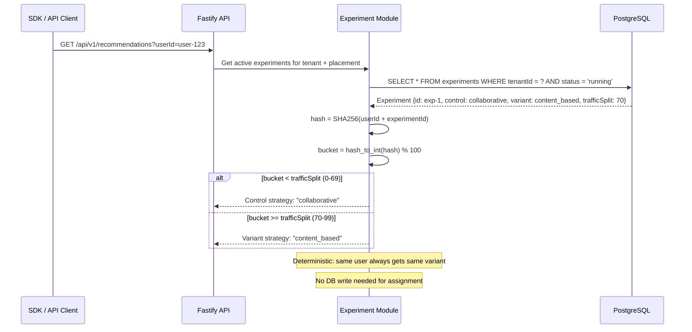

### 3.4 Analytics Aggregation Flow

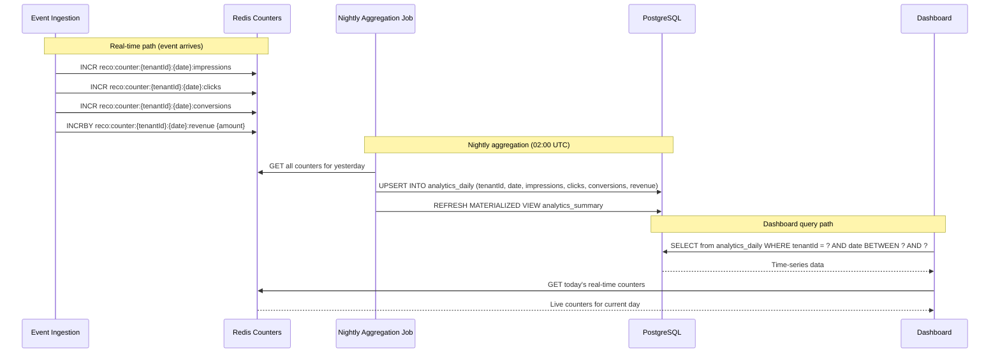

---

## 4. Data Architecture

### 4.1 Entity Relationship Diagram

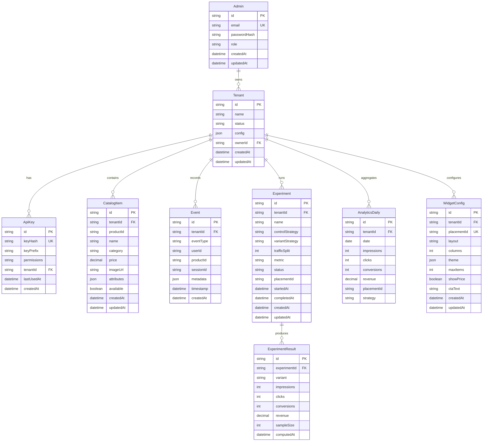

### 4.2 Event Storage Strategy

Events are the highest-volume table. PostgreSQL native range partitioning by month is used:

- **Partition key**: `created_at` (timestamp of record insertion)
- **Partition interval**: Monthly (`events_2026_01`, `events_2026_02`, ...)
- **Partition pruning**: PostgreSQL query planner automatically skips irrelevant partitions
- **Retention**: Raw events retained for 90 days; older partitions detached and archived
- **Indexes per partition**: `(tenant_id, timestamp)`, `(tenant_id, user_id, event_type)`, `(tenant_id, product_id)`

See [ADR-002: Event Storage Strategy](ADRs/002-event-storage-strategy.md) for full rationale.

### 4.3 Data Isolation

All data tables include a `tenant_id` column. Tenant isolation is enforced at two levels:

1. **Application level**: A Prisma middleware automatically injects `tenant_id` into all WHERE clauses. Every service method receives `tenantId` from the authenticated context.
2. **Index level**: All query-critical indexes are prefixed with `tenant_id` to ensure efficient per-tenant queries.

Future enhancement: PostgreSQL Row-Level Security (RLS) for defense-in-depth (Phase 2).

---

## 5. Caching Strategy

### 5.1 Redis Key Patterns

| Key Pattern | Value | TTL | Purpose |
|-------------|-------|-----|---------|
| `reco:{tenantId}:{userId}:{strategy}` | JSON array of `{productId, score}` | 5 min | Pre-computed recommendations |
| `reco:trending:{tenantId}` | JSON array of `{productId, velocity}` | 15 min | Trending products (global per tenant) |
| `reco:fbt:{tenantId}:{productId}` | JSON array of `{productId, cooccurrence}` | 30 min | Frequently bought together |
| `reco:counter:{tenantId}:{date}:impressions` | Integer | 48 hours | Real-time impression count |
| `reco:counter:{tenantId}:{date}:clicks` | Integer | 48 hours | Real-time click count |
| `reco:counter:{tenantId}:{date}:conversions` | Integer | 48 hours | Real-time conversion count |
| `reco:counter:{tenantId}:{date}:revenue` | Integer (cents) | 48 hours | Real-time revenue (in cents) |
| `reco:widget:{tenantId}:{placementId}` | JSON widget config | 60 sec | Widget configuration cache |
| `reco:catalog:{tenantId}:available` | Set of productIds | 10 min | Available products for filtering |
| `reco:ratelimit:{apiKeyPrefix}:{window}` | Counter | Per window | Rate limit tracking |
| `reco:dedup:{tenantId}:{hash}` | `1` | 24 hours | Event deduplication bloom filter fallback |
| `jti:blacklist:{jti}` | `1` | Matches token expiry | Revoked JWT tracking |

### 5.2 Cache Invalidation Rules

| Trigger | Action |
|---------|--------|
| Catalog item updated/deleted | Delete `reco:catalog:{tenantId}:available`; delete all `reco:{tenantId}:*` keys for affected strategy |
| Widget config saved | Delete `reco:widget:{tenantId}:{placementId}` |
| Tenant config changed (default strategy) | Delete all `reco:{tenantId}:*` keys |
| Experiment started/stopped | No cache invalidation needed (strategy resolved at request time) |
| Nightly aggregation completes | Delete `reco:counter:{tenantId}:{yesterday}:*` after persisting to DB |

### 5.3 Cache Miss Strategy

On cache miss for recommendations:
1. Compute recommendations synchronously (target: <80ms for computation alone)
2. Write result to Redis with TTL
3. Return result to client

This synchronous fallback is acceptable because:
- Collaborative filtering uses a pre-computed similarity matrix (refreshed every 15 minutes)
- Content-based uses pre-indexed catalog attributes
- Trending reads from materialized counters
- Only frequently_bought_together requires a live DB query

---

## 6. Security Architecture

### 6.1 Authentication Model

```mermaid
graph TB
    subgraph "Dashboard Auth (JWT)"
        SIGNUP[POST /signup] --> BCRYPT[bcrypt hash, cost 12]
        LOGIN[POST /login] --> VERIFY[Verify password]
        VERIFY --> JWT[Issue JWT access token, 1hr]
        VERIFY --> REFRESH[Set HttpOnly refresh cookie, 7d]
        JWT --> HEADER[Authorization: Bearer {token}]
        HEADER --> VALIDATE[Validate + decode JWT]
        VALIDATE --> ADMIN_ROUTES[Admin-only routes: tenants, experiments, analytics]
    end

    subgraph "API Auth (API Key)"
        APIKEY[API Key: rk_live_...]
        APIKEY --> HMAC[HMAC-SHA256 hash]
        HMAC --> LOOKUP[Lookup keyHash in DB]
        LOOKUP --> PERMS{Check permissions}
        PERMS -->|read| READ_ROUTES[Recommendations, catalog queries, widget config]
        PERMS -->|read-write| WRITE_ROUTES[Events, catalog CRUD, everything]
    end
```

### 6.2 Security Layers

| Layer | Mechanism | Implementation |
|-------|-----------|----------------|
| Transport | TLS 1.2+ | Enforced at load balancer / reverse proxy |
| Authentication | JWT + API Key dual auth | Auth Plugin (ConnectSW shared) |
| Authorization | Permission-based (read / read-write) | `requirePermission()` decorator |
| Rate Limiting | Per-API-key distributed limits | Redis Rate Limit Store (1000 read/min, 500 write/min) |
| Input Validation | Schema-first validation | Zod schemas on all endpoints |
| Data Isolation | Tenant-scoped queries | Prisma middleware injects `tenantId` |
| Password Storage | bcrypt cost factor 12 | ConnectSW Crypto Utils |
| API Key Storage | HMAC-SHA256 hashing | ConnectSW Crypto Utils (API_KEY_HMAC_SECRET) |
| Security Headers | Helmet defaults | @fastify/helmet |
| CORS | Per-tenant origin whitelist | @fastify/cors with dynamic origin lookup |
| CSRF | SameSite cookies + custom header | Double-submit cookie pattern for dashboard |
| SDK Isolation | IIFE scope, optional Shadow DOM | No global pollution beyond `window.RecomEngine` |

### 6.3 API Key Lifecycle

```
Generate (admin action)
  --> Full key shown ONCE (rk_live_abc123...)
  --> Key stored as HMAC-SHA256 hash
  --> Prefix stored for identification (rk_live_abc)
  --> On API request: compute HMAC of provided key, lookup hash
  --> lastUsedAt updated on each successful auth
  --> Revoke: soft delete (keyHash retained for audit trail)
```

---

## 7. Deployment Architecture

### 7.1 Local Development

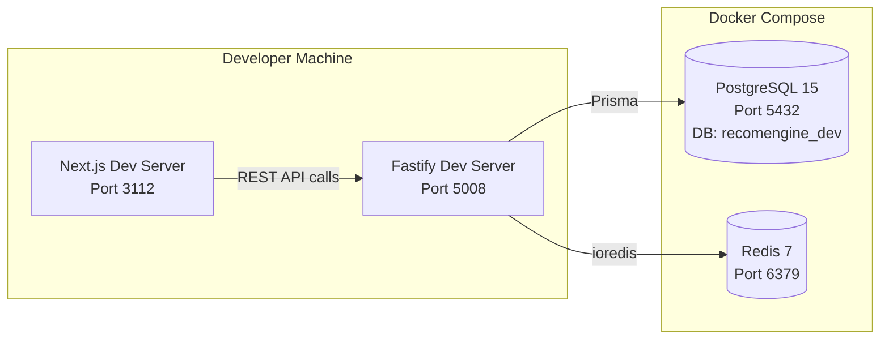

### 7.2 Production Architecture

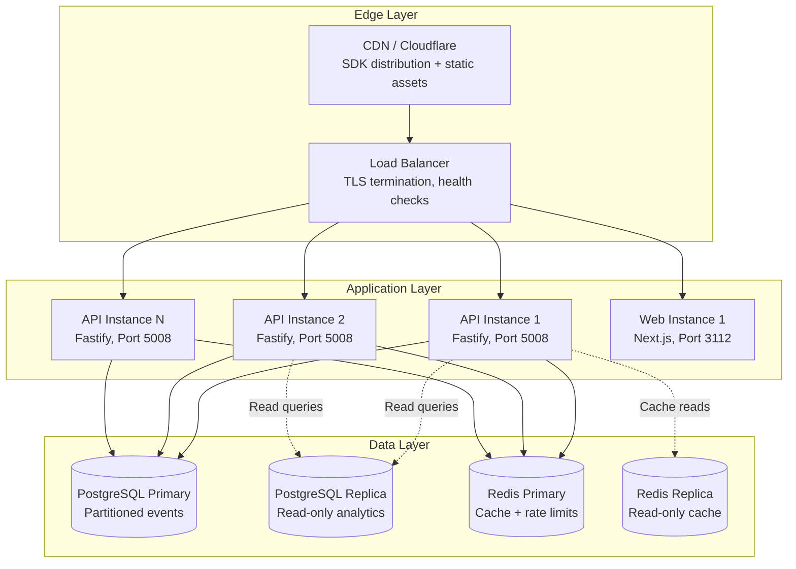

**Scaling Strategy:**
- API layer is stateless; scale horizontally by adding instances behind the load balancer
- PostgreSQL read replicas for analytics queries (heavy reads)
- Redis replica for cache reads (recommendation serving)
- SDK served entirely from CDN (no API server load for SDK delivery)

### 7.3 Infrastructure Requirements

| Component | Development | Production (MVP Launch) |
|-----------|------------|------------------------|
| API Instances | 1 | 2 (auto-scaling to 4) |
| Web Instances | 1 | 1 |
| PostgreSQL | Single (Docker) | Primary + 1 Replica (managed, e.g., RDS) |
| Redis | Single (Docker) | Primary + 1 Replica (managed, e.g., ElastiCache) |
| CDN | None (local SDK file) | Cloudflare |
| Monitoring | Console logging | Structured logs + metrics endpoint |

---

## 8. Observability

### 8.1 Logging

All structured logging via the ConnectSW Logger utility:

- **Format**: JSON in production, human-readable in development
- **Levels**: error, warn, info, debug (configurable via `LOG_LEVEL`)
- **PII redaction**: Automatic redaction of password, token, apiKey, authorization fields
- **Correlation ID**: Every request gets a unique `X-Request-ID` header (generated by Observability Plugin)

### 8.2 Metrics

Exposed via `GET /internal/metrics` (protected by `INTERNAL_API_KEY`):

| Metric | Type | Description |
|--------|------|-------------|
| `http_requests_total` | Counter | Total requests by method, path, status |
| `http_request_duration_ms` | Histogram | p50, p95, p99 latency |
| `recommendation_cache_hit_ratio` | Gauge | Cache hits / total recommendation requests |
| `event_ingestion_throughput` | Counter | Events ingested per second |
| `recommendation_latency_ms` | Histogram | Recommendation computation time (excludes cache hits) |
| `active_experiments` | Gauge | Currently running experiments |
| `error_rate` | Gauge | 5xx errors / total requests (rolling 5 min window) |

### 8.3 Health Checks

| Endpoint | Type | Checks |
|----------|------|--------|
| `GET /health` | Liveness | Process is running, can accept HTTP |
| `GET /ready` | Readiness | PostgreSQL connected, Redis connected, Prisma ready |

---

## 9. Technology Decisions

| Decision | Choice | Rationale | ADR |
|----------|--------|-----------|-----|
| Architecture style | Modular monolith | Simplicity for MVP; module boundaries allow future extraction | [ADR-001](ADRs/001-monolith-architecture.md) |
| Event storage | PostgreSQL partitioned tables | No additional dependency; native partitioning is sufficient for MVP scale | [ADR-002](ADRs/002-event-storage-strategy.md) |
| Recommendation caching | Redis with 5-min TTL | <100ms p95 target; in-memory cache for hot data | [ADR-003](ADRs/003-recommendation-caching.md) |
| Backend framework | Fastify 4 | ConnectSW standard; plugin architecture; high performance | Company standard |
| ORM | Prisma 5 | ConnectSW standard; type-safe; migration tooling | Company standard |
| Frontend | Next.js 14 + React 18 | ConnectSW standard; SSR for landing pages; App Router | Company standard |
| Styling | Tailwind CSS | ConnectSW standard; utility-first; rapid UI development | Company standard |
| SDK bundler | esbuild | Fastest build; smallest output; tree-shaking | Performance requirement |
| Auth | JWT + HMAC API Keys | ConnectSW Auth Plugin (production-tested) | Company standard |
| Rate limiting | Redis-backed per-key | ConnectSW Redis Rate Limit Store (distributed) | Company standard |

---

## 10. Reused ConnectSW Components

| Component | Source | Adaptation Needed |
|-----------|--------|-------------------|
| Auth Plugin | `@connectsw/shared` or `stablecoin-gateway` | Change permissions from `read/write/refund` to `read/read-write`; add tenant context |
| Prisma Plugin | `@connectsw/shared` or `stablecoin-gateway` | None (copy as-is) |
| Redis Plugin | `@connectsw/shared` or `stablecoin-gateway` | None (copy as-is) |
| Observability Plugin | `stablecoin-gateway` | None (copy as-is) |
| Logger | `@connectsw/shared` or `stablecoin-gateway` | None (copy as-is) |
| Crypto Utils | `@connectsw/shared` or `stablecoin-gateway` | Change key prefix from `sk_live_` to `rk_live_` |
| Redis Rate Limit Store | `stablecoin-gateway` | None (copy as-is) |
| Error Classes | `invoiceforge` | None (copy as-is) |
| Pagination Helper | `invoiceforge` | None (copy as-is) |
| Token Manager | `stablecoin-gateway` (frontend) | None (copy as-is) |
| useAuth hook | `stablecoin-gateway` (frontend) | Update API client import |
| StatCard | `stablecoin-gateway` (frontend) | None (copy as-is) |
| ErrorBoundary | `stablecoin-gateway` (frontend) | None (copy as-is) |
| ProtectedRoute | `stablecoin-gateway` (frontend) | None (copy as-is) |

---

## 11. Performance Budget

| Operation | Target (p95) | Strategy |
|-----------|-------------|----------|
| Recommendation API response | <100ms | Redis cache (5-min TTL); pre-computed similarity matrix |
| Event ingestion (single) | <50ms | Async counter updates; lightweight validation |
| Event ingestion (batch, 100) | <200ms | Bulk INSERT; parallel validation |
| Dashboard page load (LCP) | <2s | SSR for initial render; lazy-load charts |
| SDK bundle load | <100ms | <10KB gzipped; CDN delivery; async loading |
| Widget render (after API response) | <200ms | Minimal DOM operations; no framework overhead |
| Analytics query (30-day range) | <500ms | Materialized views; partitioned event tables |

---

## 12. Future Considerations (Post-MVP)

1. **Worker Extraction**: If recommendation computation exceeds in-process time budgets, extract to a dedicated worker service communicating via Redis pub/sub or a job queue.
2. **Read Replicas**: Route analytics and recommendation read queries to PostgreSQL replicas to reduce primary load.
3. **Row-Level Security**: Add PostgreSQL RLS policies for defense-in-depth tenant isolation.
4. **Streaming Pipeline**: If event ingestion exceeds PostgreSQL write capacity, introduce a Kafka/Redis Streams buffer.
5. **ML Model Service**: Replace in-process recommendation algorithms with a Python-based model service for advanced ML (embeddings, deep learning).
6. **Multi-Region**: Deploy API instances in multiple regions with regional Redis caches for global <100ms latency.

---

**End of Architecture Document**
