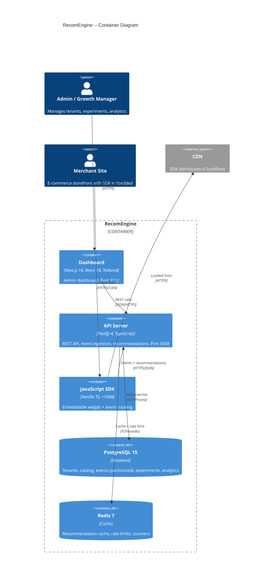
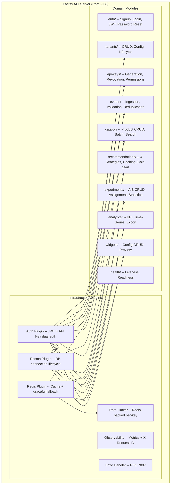
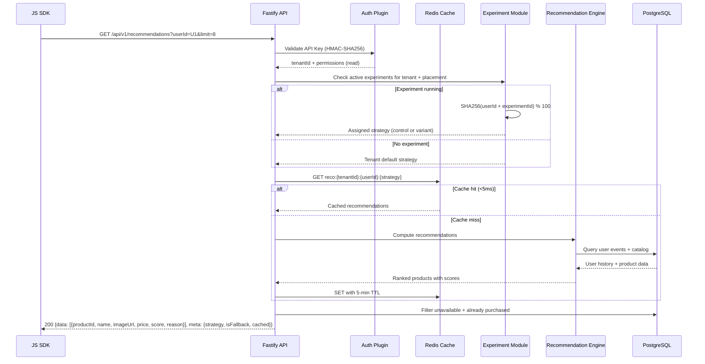
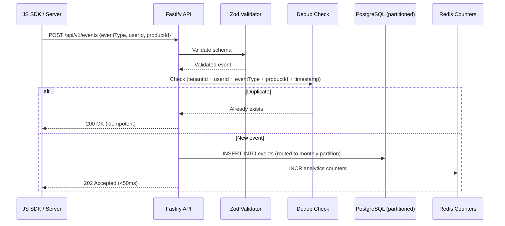

# Implementation Plan: RecomEngine MVP

**Product**: RecomEngine
**Branch**: `feature/recomengine/mvp`
**Created**: 2026-02-12
**Updated**: 2026-03-06
**Spec**: `products/recomengine/docs/PRD.md` (65 FRs, 34 NFRs, 12 features)

## Summary

Build a complete B2B SaaS product recommendation orchestrator for mid-market e-commerce businesses. RecomEngine enables merchants to deliver personalized product recommendations via embeddable widgets and REST APIs. The platform ingests real-time behavioral events, runs configurable recommendation algorithms (collaborative filtering, content-based, trending, frequently bought together), provides an A/B testing framework for strategy comparison, and delivers analytics dashboards with revenue attribution.

**Business context**: Mid-market e-commerce ($1M-$100M revenue) is underserved. Enterprise solutions cost $50k-$500k/year. RecomEngine targets $25k MRR by month 6 with usage-based pricing, aiming for 50 tenants in the first 3 months.

## Technical Context

- **Language/Version**: TypeScript 5+ / Node.js 20+
- **Backend**: Fastify 4 + Prisma 5 + PostgreSQL 15
- **Frontend**: Next.js 14 / React 18 / Tailwind CSS 3
- **Cache**: Redis 7 (recommendations, rate limits, real-time counters)
- **SDK**: Vanilla TypeScript, esbuild, <10KB gzipped
- **Testing**: Jest + React Testing Library + Playwright
- **Primary Dependencies**: ioredis, bcrypt, zod, date-fns, @fastify/jwt, @fastify/cors, @fastify/helmet, @fastify/rate-limit, @fastify/cookie, esbuild
- **Target Platform**: Web (dashboard + embeddable SDK)
- **Assigned Ports**: Frontend 3112 / Backend 5008

## Architecture

### Container Diagram (C4 Level 2)



### Component Diagram (C4 Level 3) -- API Server



### Data Flow -- Recommendation Request



### Data Flow -- Event Ingestion



### Integration Points

| System | Direction | Protocol | Data Exchanged | Auth Method |
|--------|-----------|----------|---------------|-------------|
| Merchant Website | Inbound | HTTPS/REST | Events, recommendation requests | API Key (X-API-Key header) |
| Admin Dashboard | Inbound | HTTPS/REST | Tenant CRUD, analytics, experiments | JWT Bearer token |
| CDN (Cloudflare) | Outbound | HTTPS | SDK JS bundle (static file) | None (public) |
| PostgreSQL | Internal | TCP | All persistent data | Connection string |
| Redis | Internal | TCP | Cache, rate limits, counters | Connection string |

### Security Considerations

- **Authentication**: Dual auth -- JWT (1hr access + 7d HttpOnly refresh cookie) for dashboard admins; HMAC-SHA256 API keys for SDK/server-to-server
- **Authorization**: Permission-based per API key (read vs read-write). Admin JWT required for tenant management, experiments, analytics
- **Data Protection**: API keys stored as HMAC-SHA256 hashes (never plaintext). Passwords bcrypt cost 12. TLS 1.2+ at transport. PII redaction in structured logs
- **Input Validation**: Zod schemas on all 34 endpoints. Metadata capped at 4KB. String lengths enforced
- **Rate Limiting**: 1,000 read/min, 500 write/min per API key. Redis-backed distributed limits. Burst: 2x for 10s
- **Tenant Isolation**: Prisma middleware injects `tenant_id` in all WHERE clauses. All indexes prefixed with `tenant_id`
- **CSRF**: SameSite cookies + custom header (double-submit cookie pattern) for dashboard
- **CORS**: Per-tenant origin whitelist stored in tenant config. @fastify/cors with dynamic origin
- **SDK Security**: IIFE scope (only `window.RecomEngine` global). Zero external dependencies. Optional Shadow DOM for style isolation

### Error Handling Strategy

| Error Category | Example | Detection | Recovery | User Experience |
|---------------|---------|-----------|----------|----------------|
| Validation | Invalid event schema | Zod schema check | Return 400/422 with field-level errors | SDK: silent drop. Dashboard: form error messages |
| Auth | Expired JWT | Auth plugin middleware | 401 response; client redirects to login | Dashboard: "Session expired" redirect |
| Auth | Invalid API key | HMAC lookup fails | 401 response | SDK: widget hidden (graceful degradation) |
| Permission | Write with read-only key | Permission check | 403 response with detail | SDK: error callback invoked |
| Rate limit | >1000 reads/min | Redis counter | 429 with retry-after header | SDK: back-off. Dashboard: toast notification |
| Not found | Nonexistent tenant | DB query returns null | 404 RFC 7807 response | Dashboard: "Not found" page |
| Duplicate | Same event re-submitted | Dedup check | 200 OK (idempotent) | Transparent to client |
| DB connection | PostgreSQL down | Health check probe | 503 on /ready. Reconnect pool | Dashboard: maintenance page. SDK: cached results or hidden widget |
| Redis failure | Redis unreachable | Connection error handler | Graceful degradation: all cache misses, in-memory rate limiting | Slower recommendations but functional |
| Tenant suspended | API call to suspended tenant | Status check in auth middleware | 403 "Tenant suspended" | SDK: widget hidden. Dashboard: read-only mode |
| Internal error | Unhandled exception | Global error handler | 500 with generic message (no leak) | Dashboard: "Something went wrong" page |

## Constitution Check

**Gate: Before Phase 0**

| Article | Requirement | Status |
|---------|------------|--------|
| I. Spec-First | PRD exists with 65 FRs, 34 NFRs, 12 features, acceptance criteria | PASS |
| II. Component Reuse | COMPONENT-REGISTRY.md checked; 19 components identified for reuse | PASS |
| III. TDD | Test plan defined per feature, TDD Red-Green-Refactor enforced | PASS |
| IV. TypeScript | TypeScript 5+ strict mode configured | PASS |
| V. Default Stack | Fastify + Prisma + PostgreSQL + Next.js + Tailwind (matches default) | PASS |
| VI. Traceability | All FRs mapped to endpoints and tables in architecture.md Section 13 | PASS |
| VII. Port Registry | Ports 3112/5008 registered in PORT-REGISTRY.md | PASS |
| VIII. Git Safety | Branch naming follows convention; specific file staging enforced | PASS |
| IX. Diagram-First | C4 context, container, component, ER, sequence, state diagrams included | PASS |
| X. Quality Gates | Testing gate, spec consistency gate, code review gate planned | PASS |
| XI. Anti-Rationalization | TDD enforced; verification-before-completion required for all tasks | PASS |
| XII. Context Engineering | Progressive disclosure levels applied per task complexity | PASS |
| XIII. CI Enforcement | GitHub Actions workflow planned with lint, test, coverage, security, e2e | PASS |
| XIV. Clean Code | ESLint shared config, Semgrep blocking, clean code self-review checklist | PASS |

## Implementation Audit

**Gate: Before Phase 0** -- Capabilities verified against existing codebase.

| # | Capability | Spec Req | Status | Evidence | Action |
|---|-----------|----------|--------|----------|--------|
| 1 | Admin authentication (signup/login/JWT) | NFR-014, NFR-015 | NOT_IMPLEMENTED | No `products/recomengine/apps/` directory exists | INCLUDE |
| 2 | Tenant CRUD + lifecycle | FR-001 to FR-005 | NOT_IMPLEMENTED | No implementation files | INCLUDE |
| 3 | API key provisioning | FR-006 to FR-010 | NOT_IMPLEMENTED | No implementation files | INCLUDE |
| 4 | Event ingestion (single + batch) | FR-011 to FR-017 | NOT_IMPLEMENTED | No implementation files | INCLUDE |
| 5 | Catalog CRUD + batch + search | FR-018 to FR-023 | NOT_IMPLEMENTED | No implementation files | INCLUDE |
| 6 | Recommendation engine (4 strategies) | FR-024 to FR-032 | NOT_IMPLEMENTED | No implementation files | INCLUDE |
| 7 | JavaScript SDK | FR-033 to FR-041 | NOT_IMPLEMENTED | No `sdk/` directory | INCLUDE |
| 8 | A/B testing framework | FR-042 to FR-048 | NOT_IMPLEMENTED | No implementation files | INCLUDE |
| 9 | Analytics dashboard + API | FR-049 to FR-056 | NOT_IMPLEMENTED | No implementation files | INCLUDE |
| 10 | Widget configuration | F-012 | NOT_IMPLEMENTED | No implementation files | INCLUDE |
| 11 | REST API standards (versioning, pagination, errors) | FR-057 to FR-062 | NOT_IMPLEMENTED | No implementation files | INCLUDE |
| 12 | Health checks | NFR-017 | NOT_IMPLEMENTED | No implementation files | INCLUDE |

**Verified scope**: 12 of 12 capabilities proceed to planning.
- **Excluded** (already implemented): None
- **Included** (new work needed): All 12 capabilities
- **Reduced scope** (gaps only): None

**Verification method**: Filesystem scan -- `products/recomengine/apps/` directory does not exist.

## Component Reuse Plan

| Need | Existing Component | Source | Action |
|------|-------------------|--------|--------|
| Auth (JWT + API Key) | Auth Plugin | `@connectsw/auth/backend` | Adapt: permissions to read/read_write, add tenant context |
| Auth routes | Auth Routes | `@connectsw/auth/backend` | Adapt: remove unused routes, add tenant-scoped auth |
| API key hashing | Crypto Utils | `@connectsw/shared/utils/crypto` | Adapt: prefix rk_live_/rk_test_ |
| DB connection | Prisma Plugin | `@connectsw/shared/plugins/prisma` | Copy as-is |
| Redis connection | Redis Plugin | `@connectsw/shared/plugins/redis` | Copy as-is |
| Rate limiting | Redis Rate Limit Store | `stablecoin-gateway` | Copy as-is |
| Logging | Logger | `@connectsw/shared/utils/logger` | Copy as-is |
| Metrics | Observability Plugin | `stablecoin-gateway` | Copy as-is |
| Errors | AppError (RFC 7807) | `@connectsw/auth/backend` | Copy as-is |
| Pagination | Pagination Helper | `invoiceforge` | Copy as-is |
| Input validation | Zod patterns | `stablecoin-gateway` | Adapt: RecomEngine-specific schemas |
| Frontend auth | useAuth + TokenManager | `@connectsw/auth/frontend` | Adapt: API client import path |
| KPI cards | StatCard | `stablecoin-gateway` | Copy as-is |
| Data tables | TransactionsTable pattern | `stablecoin-gateway` | Adapt: column definitions |
| Navigation | Sidebar | `stablecoin-gateway` | Adapt: RecomEngine routes |
| Error boundary | ErrorBoundary | `stablecoin-gateway` | Copy as-is |
| Route guard | ProtectedRoute | `@connectsw/auth/frontend` | Copy as-is |
| Theme | useTheme + ThemeToggle | `stablecoin-gateway` | Adapt: storage key |
| Docker | Dockerfile + compose | `stablecoin-gateway` | Adapt: ports, DB name |
| CI/CD | GitHub Actions | `stablecoin-gateway` | Adapt: paths, product name |
| E2E | Playwright config + auth fixture | `stablecoin-gateway` | Adapt: URL, port |
| Recommendation engine | None | -- | **Build new** (domain-specific) |
| A/B assignment (hash-based) | None | -- | **Build new** (domain-specific) |
| JavaScript SDK | None | -- | **Build new** (domain-specific) |
| Analytics aggregation | None | -- | **Build new** (domain-specific) |
| Revenue attribution | None | -- | **Build new** (domain-specific) |

## Project Structure

```
products/recomengine/
├── apps/
│   ├── api/
│   │   ├── src/
│   │   │   ├── plugins/          # auth, prisma, redis, observability, rate-limit, error-handler
│   │   │   ├── modules/
│   │   │   │   ├── auth/         # routes.ts, handlers.ts, service.ts, schemas.ts
│   │   │   │   ├── tenants/      # routes.ts, handlers.ts, service.ts, schemas.ts
│   │   │   │   ├── api-keys/     # routes.ts, handlers.ts, service.ts, schemas.ts
│   │   │   │   ├── events/       # routes.ts, handlers.ts, service.ts, schemas.ts
│   │   │   │   ├── catalog/      # routes.ts, handlers.ts, service.ts, schemas.ts
│   │   │   │   ├── recommendations/  # routes.ts, handlers.ts, service.ts, schemas.ts
│   │   │   │   │                      # strategies/ (collaborative.ts, content-based.ts, trending.ts, fbt.ts)
│   │   │   │   ├── experiments/  # routes.ts, handlers.ts, service.ts, schemas.ts, statistics.ts
│   │   │   │   ├── analytics/    # routes.ts, handlers.ts, service.ts, schemas.ts
│   │   │   │   ├── widgets/      # routes.ts, handlers.ts, service.ts, schemas.ts
│   │   │   │   └── health/       # routes.ts, handlers.ts
│   │   │   ├── utils/            # logger, crypto, validation, errors, pagination
│   │   │   ├── config.ts         # Environment variable validation
│   │   │   ├── app.ts            # Fastify app builder (plugin registration)
│   │   │   └── server.ts         # Server entry point
│   │   ├── tests/
│   │   │   ├── unit/             # Pure function tests (strategies, statistics, crypto)
│   │   │   └── integration/      # Full HTTP tests with real DB + Redis
│   │   ├── prisma/
│   │   │   ├── schema.prisma     # Prisma schema matching db-schema.sql
│   │   │   └── migrations/
│   │   └── package.json
│   ├── web/
│   │   ├── src/
│   │   │   ├── app/              # Next.js App Router pages (per site map)
│   │   │   ├── components/       # React components (dashboard, forms, charts)
│   │   │   ├── hooks/            # useAuth, useTenants, useAnalytics, etc.
│   │   │   └── lib/              # API client, token manager, utils
│   │   ├── tests/
│   │   └── package.json
│   └── sdk/
│       ├── src/
│       │   ├── index.ts          # Entry point, auto-init from script tag
│       │   ├── api.ts            # HTTP client for recommendation API
│       │   ├── tracker.ts        # Impression + click tracking (Intersection Observer)
│       │   ├── renderer.ts       # Grid, carousel, list layout rendering
│       │   ├── config.ts         # Widget config loading + 60s cache
│       │   └── assignment.ts     # A/B test variant hashing (SHA-256)
│       ├── dist/
│       │   └── recomengine.v1.js # Bundled, minified SDK
│       ├── esbuild.config.ts
│       └── package.json
├── e2e/
│   ├── tests/
│   │   └── stories/              # Organized by feature (F-001 through F-012)
│   └── playwright.config.ts
├── docker-compose.yml            # PostgreSQL 15 + Redis 7
└── docs/
    ├── PRD.md
    ├── architecture.md
    ├── api-schema.yml
    ├── db-schema.sql
    ├── plan.md                   # This file
    ├── tasks.md
    └── ADRs/
        ├── 001-monolith-architecture.md
        ├── 002-event-storage-strategy.md
        └── 003-recommendation-caching.md
```

## Implementation Phases

### Phase 1: Foundation [Week 1]

**FR mapping**: Infrastructure for all FRs. NFR-014, NFR-015, NFR-016, NFR-031.

| # | Task | FR/NFR | TDD Approach |
|---|------|--------|-------------|
| 1.1 | Initialize monorepo: package.json, tsconfig.json (strict), eslint (extends @connectsw/eslint-config/backend), prettier | NFR-016 | Config verification tests |
| 1.2 | Set up Prisma schema from db-schema.sql. Run initial migration | All FR (data layer) | Migration smoke test |
| 1.3 | Copy + configure shared plugins: prisma, redis, observability, rate-limit, error-handler | NFR-011, NFR-031, NFR-032 | Plugin registration integration test |
| 1.4 | Copy + configure shared utils: logger, crypto (adapt prefix to rk_), errors, pagination | NFR-009, NFR-015 | Unit tests for crypto key generation + hashing |
| 1.5 | Build app.ts with plugin registration order: observability -> prisma -> redis -> rate-limit -> auth -> routes | NFR-031 | Integration test: app starts and responds to health check |
| 1.6 | Implement health/ module: GET /health + GET /ready | NFR-017 | Integration test: /ready returns 503 when DB disconnected |
| 1.7 | Set up Docker Compose (PostgreSQL 15 + Redis 7) | Infrastructure | docker-compose up smoke test |
| 1.8 | Set up Next.js app (port 3112), copy shared frontend components | NFR-004 | Dev server starts test |
| 1.9 | Set up Playwright config (port 3112 + 5008) | Testing | Config validation |

### Phase 2: Auth + Tenant Management [Week 2]

**FR mapping**: FR-001 to FR-010, NFR-014, NFR-015.

| # | Task | FR/NFR | TDD Approach |
|---|------|--------|-------------|
| 2.1 | Adapt @connectsw/auth: signup, login, logout, forgot/reset password | NFR-014, NFR-015 | Integration tests: full auth flow with real DB |
| 2.2 | Implement tenants/ module: POST /tenants (FR-001), GET /tenants (FR-005), GET/PUT/DELETE /tenants/:id (FR-003, FR-004) | FR-001 to FR-005 | Integration tests: CRUD + status lifecycle + data isolation |
| 2.3 | Implement api-keys/ module: POST (FR-006, FR-007), GET (FR-009), DELETE (FR-008) | FR-006 to FR-010 | Integration tests: key generation, permission enforcement, max 10 limit, revocation |
| 2.4 | Implement Prisma middleware for tenant_id scoping | NFR-010 | Integration test: cross-tenant query returns empty |
| 2.5 | Build dashboard login page + tenant list page | FR-001, FR-005 | E2E: admin can log in and see tenant list |

### Phase 3: Data Ingestion [Week 3-4]

**FR mapping**: FR-011 to FR-023.

| # | Task | FR/NFR | TDD Approach |
|---|------|--------|-------------|
| 3.1 | Implement events/ module: POST /events (FR-011, FR-014, FR-015) | FR-011, FR-013 to FR-016 | Integration tests: valid event accepted, invalid rejected with field errors, 7 event types |
| 3.2 | Implement event deduplication (FR-016) | FR-016 | Integration test: duplicate returns 200, single record in DB |
| 3.3 | Implement POST /events/batch (FR-012) | FR-012, NFR-003 | Integration test: 100 events, mix of valid/invalid, response with accepted/rejected counts |
| 3.4 | Set up monthly event partitioning (run create_event_partition for current + 3 months ahead) | NFR-025 | Integration test: events route to correct partition |
| 3.5 | Implement catalog/ module: POST (FR-018), POST /batch (FR-019), GET with pagination + search + filter (FR-023) | FR-018 to FR-023 | Integration tests: CRUD, batch upsert, category filter, name search |
| 3.6 | Implement PUT /catalog/:productId (FR-021), DELETE (FR-022 soft delete) | FR-021, FR-022 | Integration tests: update, soft delete, unavailable excluded from queries |
| 3.7 | Build dashboard catalog browser page | FR-023 | E2E: admin can view and search catalog |

### Phase 4: Recommendation Engine [Week 4-5]

**FR mapping**: FR-024 to FR-032.

| # | Task | FR/NFR | TDD Approach |
|---|------|--------|-------------|
| 4.1 | Implement trending strategy (FR-028) | FR-028 | Unit test: velocity scoring. Integration test: returns top products by weighted events |
| 4.2 | Implement content-based strategy (FR-027) | FR-027 | Unit test: attribute similarity. Integration test: returns similar products |
| 4.3 | Implement collaborative filtering strategy (FR-026) | FR-026 | Unit test: cosine similarity. Integration test: user-user recommendations with sufficient data |
| 4.4 | Implement frequently-bought-together strategy (FR-029) | FR-029 | Unit test: co-occurrence. Integration test: with productId context |
| 4.5 | Implement cold-start fallback (FR-032) | FR-032 | Integration test: new user (0 events) gets trending fallback with meta.isFallback: true |
| 4.6 | Implement GET /recommendations endpoint (FR-024, FR-025, FR-030, FR-031) | FR-024, FR-025, FR-030, FR-031 | Integration test: response shape with score + reason, exclude purchased |
| 4.7 | Implement Redis caching layer (ADR-003) | NFR-001, NFR-020 | Integration test: cache hit <5ms, cache miss computes + stores, invalidation on catalog change |
| 4.8 | Performance validation | NFR-001 | Load test: p95 <100ms with warm cache |

### Phase 5: A/B Testing [Week 5-6]

**FR mapping**: FR-042 to FR-048.

| # | Task | FR/NFR | TDD Approach |
|---|------|--------|-------------|
| 5.1 | Implement experiments/ module: CRUD (FR-042, FR-043, FR-046) | FR-042 to FR-047 | Integration tests: create, status transitions (draft->running->paused->completed), delete constraints |
| 5.2 | Implement unique running constraint per placement (FR-047) | FR-047 | Integration test: second experiment on same placement returns 409 |
| 5.3 | Implement deterministic user assignment: SHA-256(userId + experimentId) % 100 (FR-044) | FR-044 | Unit test: same user always gets same variant. Integration test: assignment affects recommendation strategy |
| 5.4 | Implement results computation: p-value, confidence intervals (FR-045) | FR-045 | Unit test: z-test for CTR, t-test for revenue. Integration test: GET /experiments/:id/results returns statistics |
| 5.5 | Integrate experiment routing into recommendation flow | FR-044 | Integration test: user in experiment gets assigned strategy, meta.experimentId populated |

### Phase 6: Analytics + Dashboard [Week 6-7]

**FR mapping**: FR-049 to FR-056.

| # | Task | FR/NFR | TDD Approach |
|---|------|--------|-------------|
| 6.1 | Implement Redis real-time counters (updated on event ingestion) | FR-049, FR-055 | Integration test: event ingestion increments counters |
| 6.2 | Implement nightly aggregation job (aggregate_daily_analytics function) | FR-050, NFR-007 | Integration test: aggregation produces correct daily rows |
| 6.3 | Implement revenue attribution logic (30-min window) | FR-049 (revenue) | Integration test: click -> purchase within 30min = attributed; outside = not attributed |
| 6.4 | Implement analytics/ module: GET overview (FR-049), GET timeseries (FR-050), GET top-products (FR-051), GET export CSV (FR-056) | FR-049 to FR-056 | Integration tests: date range filtering, CSV format, correct aggregation |
| 6.5 | Build dashboard: KPI cards, time-series chart, top products table, experiment results | FR-049 to FR-055 | E2E: admin views analytics, filters by date range, sees charts |
| 6.6 | Implement 60-second auto-refresh (FR-055) | FR-055 | E2E: data updates without full page reload |
| 6.7 | Implement CSV export download (FR-056) | FR-056 | E2E: admin clicks export, CSV file downloads with correct headers |

### Phase 7: SDK + Widgets [Week 7-8]

**FR mapping**: FR-033 to FR-041, F-012.

| # | Task | FR/NFR | TDD Approach |
|---|------|--------|-------------|
| 7.1 | Implement widgets/ module: CRUD for widget configs (F-012) | F-012 | Integration tests: create, update, delete, unique per placement |
| 7.2 | Build SDK entry point: auto-init from script tag data-api-key (FR-033, FR-034) | FR-033, FR-034 | Unit test: reads API key from script tag, initializes |
| 7.3 | Build SDK api.ts: HTTP client for recommendations + events (FR-038) | FR-038 | Unit test: correct request formation, error handling |
| 7.4 | Build SDK renderer.ts: grid, carousel, list layouts (FR-035, FR-036) | FR-035, FR-036 | Unit test: DOM structure per layout, multiple placements |
| 7.5 | Build SDK tracker.ts: Intersection Observer for impressions, click tracking (FR-037) | FR-037 | Unit test: impression fires on viewport entry, click fires on element click |
| 7.6 | Build SDK assignment.ts: A/B variant hashing | FR-044 (client-side) | Unit test: consistent hash assignment |
| 7.7 | Build SDK config.ts: widget config loading with 60s cache | F-012 | Unit test: config fetched, cached, refreshed after TTL |
| 7.8 | Implement graceful degradation (FR-039) | FR-039 | Unit test: API unreachable -> widget hidden, no console errors |
| 7.9 | Implement RecomEngine.onRecommendations callback (FR-040) | FR-040 | Unit test: callback invoked with recommendation data |
| 7.10 | Bundle with esbuild, verify <10KB gzipped (FR-041, NFR-005) | FR-041, NFR-005 | Build test: output size assertion |
| 7.11 | Build dashboard widget config page | F-012 | E2E: admin configures widget, preview updates |

### Phase 8: Polish + Quality Gates [Week 8]

**FR mapping**: FR-057 to FR-062, all NFRs.

| # | Task | FR/NFR | TDD Approach |
|---|------|--------|-------------|
| 8.1 | Verify all 34 endpoints follow JSON:API envelope + pagination (FR-058, FR-059) | FR-058, FR-059 | Integration test suite: response shape validation |
| 8.2 | Verify RFC 7807 error format on all error paths (FR-060) | FR-060 | Integration test: 400, 401, 403, 404, 409, 422, 429, 500 all return RFC 7807 |
| 8.3 | Configure CORS for SDK requests (FR-061) | FR-061 | Integration test: CORS headers present, per-tenant origins |
| 8.4 | Generate OpenAPI spec from route schemas (FR-062) | FR-062 | Verify auto-generated spec matches api-schema.yml |
| 8.5 | Run full test suite, verify >= 80% coverage | All | Coverage report |
| 8.6 | Run security audit: npm audit, Semgrep (blocking), Trivy | NFR-008 to NFR-016 | No HIGH/CRITICAL findings |
| 8.7 | Run /speckit.analyze for spec consistency | All | PASS required |
| 8.8 | Update COMPONENT-REGISTRY.md with new reusable components | Constitution Art. II | Recommendation strategies, A/B assignment, SDK patterns |
| 8.9 | Build landing page, docs pages (quickstart, SDK reference, API reference) | Site map | E2E: pages load, navigation works |
| 8.10 | Final E2E suite: full tenant onboarding flow (signup -> create tenant -> API key -> catalog -> events -> recommendations) | All | E2E: <30 minutes end-to-end flow |

## Complexity Tracking

| Decision | Violation of Simplicity? | Justification | Simpler Alternative Rejected |
|----------|------------------------|---------------|------------------------------|
| 4 recommendation strategies | No | Each is a pure function (50-100 LOC). Variety serves different tenant data maturity levels | Single strategy -- rejected: tenants with <1000 users cannot use collaborative filtering |
| PostgreSQL event partitioning | No | Native PostgreSQL feature; prevents table bloat at 100M events/month. See ADR-002 | Single table -- rejected: query degradation at scale |
| Redis caching layer | No | Required to meet <100ms p95. See ADR-003 | No cache -- rejected: DB-only exceeds latency budget |
| A/B test statistics (z-test, t-test) | No | Standard statistical methods (20-30 LOC each). Required for merchant confidence | No statistics -- rejected: merchants need significance testing to trust results |
| Modular monolith (10 modules) | No | Matches ConnectSW standard pattern. Module boundaries designed for future extraction. See ADR-001 | Microservices -- rejected: premature at MVP scale |
| JavaScript SDK with esbuild | No | Zero-dependency IIFE is the simplest approach for embeddable widget. esbuild produces smallest output | React-based SDK -- rejected: framework dependency inflates bundle beyond 10KB |
| Revenue attribution (30-min window) | No | Simple timestamp comparison. Last-click model (no complex attribution chains) | No attribution -- rejected: revenue proof is core value proposition |

## References

- **PRD**: `products/recomengine/docs/PRD.md`
- **Architecture**: `products/recomengine/docs/architecture.md`
- **API Schema**: `products/recomengine/docs/api-schema.yml` (OpenAPI 3.0, 2479 lines)
- **DB Schema**: `products/recomengine/docs/db-schema.sql` (496 lines)
- **ADR-001**: Monolith Architecture (`docs/ADRs/001-monolith-architecture.md`)
- **ADR-002**: Event Storage Strategy (`docs/ADRs/002-event-storage-strategy.md`)
- **ADR-003**: Recommendation Caching (`docs/ADRs/003-recommendation-caching.md`)
- **Component Registry**: `.claude/COMPONENT-REGISTRY.md`
- **Port Registry**: `.claude/PORT-REGISTRY.md` (Frontend: 3112, Backend: 5008)
- **Addendum**: `products/recomengine/.claude/addendum.md`

## Next Step

Run `/speckit.tasks` to generate dependency-ordered task list from this plan.
