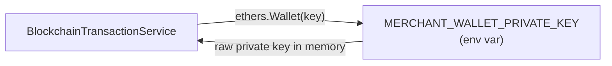
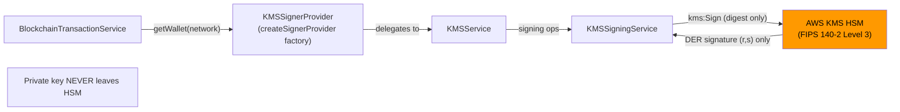

# ADR-005: AWS KMS for Hot Wallet Signing Key Management

## Status

Accepted (2026-02-27)

## Context

The stablecoin-gateway hot wallet signs Ethereum transactions on behalf of
merchants (refunds, gas top-ups). A signing key is required. The decision is
where that key lives and how signing operations are performed.

At MVP launch (January 2026), CRIT-002 in SECURITY-DECISIONS.md accepted a
raw private key in the `MERCHANT_WALLET_PRIVATE_KEY` environment variable as
a calculated, time-bounded risk. The review date was 2026-03-01. The gateway
now generates revenue and is receiving early SOC2 enquiries from merchants.
The risk calculus has changed.

The question: **what key management strategy should we permanently adopt?**

### Alternatives Considered

#### Option A: Environment Variable (current, MVP approach)

Store the Ethereum private key in `MERCHANT_WALLET_PRIVATE_KEY`.

**Pros**:
- Zero infrastructure cost
- Zero operational complexity
- Works with any deployment environment

**Cons**:
- Any process with memory access on the host can extract the key
- Log aggregation leaks (exception dumps, debug traces) can surface key bytes
- Key rotation requires a full deployment (app restart + coordinated env var
  update across all environments)
- No tamper-evident audit trail for individual signing operations
- Incompatible with SOC2 Type II requirements for key management

**Verdict**: Rejected for production. Acceptable only for local development.

---

#### Option B: HashiCorp Vault Transit Engine

Use Vault's transit secrets engine. The key is stored in Vault; the app sends
data to Vault for signing.

**Pros**:
- Vendor-neutral; works across AWS, GCP, Azure, on-premise
- Rich access control policies (fine-grained per-operation)
- Audit logging built in (Vault audit log)
- Dynamic secrets for related use cases

**Cons**:
- Requires running and operating a Vault cluster (HA recommended: 3+ nodes)
- Adds an infrastructure dependency with its own availability SLA
- Vault's transit engine supports RSA and Ed25519 natively; secp256k1 (used
  by Ethereum) requires Vault Enterprise or a custom plugin, which adds
  significant complexity and cost
- Operational burden: certificate management, unsealing, snapshot backups
- Estimated cost: $200-$500/month for HA cluster (Vault Cloud or self-hosted)

**Verdict**: Viable long-term option if ConnectSW becomes multi-cloud.
Rejected for now because: (1) Vault does not natively support secp256k1 in
the open-source edition, (2) operational overhead is high relative to current
transaction volume, (3) AWS KMS is already partially implemented and our
entire infrastructure runs on AWS.

---

#### Option C: Azure Key Vault

Use Azure Key Vault Managed HSM for secp256k1 signing.

**Pros**:
- Managed HSM (FIPS 140-2 Level 3)
- secp256k1 key type is supported in Managed HSM (unlike standard Azure Key Vault)
- Microsoft-managed operations (patching, HA)

**Cons**:
- Requires Azure account and cross-cloud latency (all other infrastructure is AWS)
- Azure Managed HSM pricing is approximately $5.00/hour (~$3,600/month) for
  the dedicated HSM pool — significantly more expensive than AWS KMS
- Cross-cloud authentication adds complexity (Azure Service Principal vs AWS
  IAM)
- The existing partial implementation is AWS-specific

**Verdict**: Rejected. The cost is prohibitive for current scale, and the
cross-cloud dependency adds operational risk without commensurate benefit.

---

#### Option D: Self-Hosted HSM Hardware

Provision a physical HSM appliance (e.g., Thales Luna, AWS CloudHSM) in our
own data centre or co-location.

**Pros**:
- Maximum physical control over key material
- Can meet the highest compliance requirements (PCI HSM, FIPS 140-2 Level 3+)
- No per-operation costs

**Cons**:
- Capital cost: $10,000-$40,000 per appliance
- Requires physical security controls, access procedures, and staff training
- MTTF and redundancy require at least two units
- SDK integration complexity (vendor-specific APIs)
- Completely out of scope for an MVP-stage product

**Verdict**: Rejected. Appropriate for a licensed financial institution, not
an early-stage product. AWS KMS provides the same FIPS 140-2 Level 3 HSM
backend without any of the operational overhead.

---

#### Option E: AWS KMS with ECDSA_SHA_256 (CHOSEN)

Store the secp256k1 private key inside AWS KMS (FIPS 140-2 Level 3 HSM).
Application calls `kms:Sign` to sign transaction digests. The private key
never leaves the HSM.

**Pros**:
- Private key is generated inside the HSM and never exported
- Every `kms:Sign` call is automatically recorded in AWS CloudTrail with:
  KeyId, CallerIdentity (IAM role ARN), EventTime, and RequestParameters
- secp256k1 key type (`ECC_SECG_P256K1`) is natively supported
- `ECDSA_SHA_256` signing algorithm matches Ethereum's signature scheme
- AWS KMS SLA: 99.999% availability
- Per-operation cost: $0.03 per 10,000 signing operations. At 1,000 tx/day:
  ~$1/year
- Key rotation is zero-downtime: call `kms:Sign` with new Key ID; old Key ID
  can be retained for decryption purposes but disabled for signing
- IAM policy enforcement: can restrict `kms:Sign` to the gateway IAM role only
- Already partially implemented in `kms.service.ts`, `kms-signing.service.ts`,
  `kms-signer.service.ts`
- Integrated with existing AWS deployment (ECS + RDS)

**Cons**:
- AWS vendor lock-in for signing (mitigated: `SignerProvider` interface allows
  future substitution)
- Network round-trip adds ~5-50ms per signing operation (within KMS SLA p99
  of 50ms in-region)
- Requires IAM role with `kms:Sign` and `kms:GetPublicKey` permissions
  configured on the deployment environment

**Verdict**: Chosen.

---

## Decision

**Use AWS KMS with `ECC_SECG_P256K1` key type and `ECDSA_SHA_256` signing
algorithm for all hot wallet transaction signing in production.**

The key rationale:
1. The key never leaves the HSM — eliminates the most critical attack vector
   of CRIT-002.
2. CloudTrail provides the tamper-evident audit trail required for SOC2 without
   any additional application infrastructure.
3. AWS KMS natively supports secp256k1, which is required for Ethereum and
   Polygon.
4. The implementation is 85% complete. The marginal effort to harden and test
   the existing code is far lower than adopting any alternative.
5. Cost is negligible at current transaction volumes.

---

## Architecture Implications

### Before This Decision



### After This Decision



The `SignerProvider` interface abstracts the signing mechanism from
`BlockchainTransactionService`. If a future decision adopts HashiCorp Vault
or a different provider, only `kms-signer.service.ts` needs to change.

---

## Consequences

### Positive

- Raw private key is eliminated from application memory, environment variables,
  and all log output.
- Every signing operation is audit-trailed in CloudTrail with CallerIdentity
  and RequestParameters (CRIT-002 closed).
- Key rotation is zero-downtime: `KMSService.rotateKey(newKeyId)` swaps the
  active key and invalidates the public key cache without restarting the
  application.
- EC-07 (s normalisation / EIP-2) and EC-06 (v recovery parameter) are
  handled correctly in `KMSSigningService`.

### Negative / Trade-offs

- Each transaction signing now requires one AWS KMS network round-trip
  (~5-50ms p99 in same region). At current volumes (< 100 tx/day) this is
  imperceptible.
- The secp256k1 key must be created in AWS KMS before deployment. DevOps must
  run `aws kms create-key --key-spec ECC_SECG_P256K1 --key-usage SIGN_VERIFY`
  and configure `KMS_KEY_ID` in the environment.
- If AWS KMS is unavailable (regional incident), no refund transactions can be
  signed. This is acceptable given the 99.999% SLA and the fact that the hot
  wallet only holds gas fees.

### Neutral

- `EnvVarSignerProvider` is retained for development and test environments.
  It is blocked at the factory level when `NODE_ENV=production`.

---

## IAM Policy (Required Configuration)

The gateway's IAM role must have exactly these KMS permissions, and no others:

```json
{
  "Version": "2012-10-17",
  "Statement": [
    {
      "Sid": "AllowKMSSigning",
      "Effect": "Allow",
      "Action": [
        "kms:Sign",
        "kms:GetPublicKey"
      ],
      "Resource": "arn:aws:kms:REGION:ACCOUNT_ID:key/KEY_ID"
    }
  ]
}
```

**Explicitly denied (must not be granted)**:
- `kms:Decrypt`
- `kms:GenerateDataKey`
- `kms:ScheduleKeyDeletion`
- `kms:DeleteAlias`
- `kms:CreateKey`

---

## Key Creation Procedure (DevOps)

One-time setup per environment (dev/staging/prod use separate keys per
OQ-04 resolution):

```bash
# Create key
aws kms create-key \
  --key-spec ECC_SECG_P256K1 \
  --key-usage SIGN_VERIFY \
  --description "stablecoin-gateway hot wallet signing key (prod)" \
  --region YOUR_REGION

# Tag for cost allocation
aws kms tag-resource \
  --key-id KEY_ID \
  --tags TagKey=product,TagValue=stablecoin-gateway \
         TagKey=env,TagValue=prod

# Set env var
KMS_KEY_ID=KEY_ID
AWS_REGION=YOUR_REGION
```

---

## Reviewed By

- Security Engineer
- Backend Engineer
- DevOps Engineer

*Decision owner: Architect (ConnectSW)*
*Date: 2026-02-27*
