# Stablecoin Gateway — Professional Audit Report v6.0

**Product**: stablecoin-gateway
**Audit Date**: 2026-02-28
**Auditor**: Code Reviewer Agent (6 parallel sub-agents), ConnectSW
**Audit Type**: Re-Audit v6.0 (Post-Remediation v5 + Verification-Before-Planning Gate)
**Report Version**: 6.0
**Previous Score**: 7.6/10 (v5.0)
**Current Score**: 7.2/10 (adjusted — deterministic anchoring applied)

---

## Table of Contents

**PART A — EXECUTIVE MEMO**

- [Section 0: Methodology and Limitations](#section-0-methodology-and-limitations)
- [Section 1: Executive Decision Summary](#section-1-executive-decision-summary)
- [Section 2: Stop / Fix / Continue](#section-2-stop--fix--continue)
- [Section 3: System Overview](#section-3-system-overview)
- [Section 4: Critical Issues — Top 10](#section-4-critical-issues--top-10)
- [Section 5: Risk Register](#section-5-risk-register)

**PART B — ENGINEERING APPENDIX**

- [Section 6: Architecture Assessment](#section-6-architecture-assessment)
- [Section 7: Security Findings](#section-7-security-findings)
- [Section 8: Performance and Scalability](#section-8-performance-and-scalability)
- [Section 9: Testing Assessment](#section-9-testing-assessment)
- [Section 10: DevOps Assessment](#section-10-devops-assessment)
- [Section 11: Compliance Readiness](#section-11-compliance-readiness)
- [Section 11b: Accessibility Assessment](#section-11b-accessibility-assessment)
- [Section 11c: Privacy and Data Protection Assessment](#section-11c-privacy-and-data-protection-assessment)
- [Section 11d: Observability Assessment](#section-11d-observability-assessment)
- [Section 11e: API Design Assessment](#section-11e-api-design-assessment)
- [Section 12: Technical Debt Map](#section-12-technical-debt-map)
- [Section 13: Remediation Roadmap](#section-13-remediation-roadmap)
- [Section 14: Quick Wins](#section-14-quick-wins)
- [Section 15: AI-Readiness Score](#section-15-ai-readiness-score)

---

# PART A — EXECUTIVE MEMO

---

## Section 0: Methodology and Limitations

### Audit Scope Flowchart

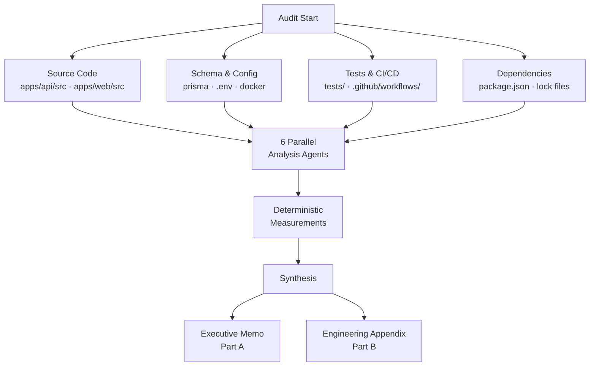

### E2E Gate Result

**PASS** — 83/85 Playwright tests passed (2 skipped: flaky webhook delivery timing). Services verified running: API healthy at :5001, Web serving at :3104.

### Audit Scope

| Metric | Value |
|--------|-------|
| Directories scanned | `apps/api/src/`, `apps/api/tests/`, `apps/api/prisma/`, `apps/web/src/`, `e2e/`, `.github/workflows/` |
| File types | `.ts`, `.tsx`, `.prisma`, `.yml`, `.json`, `.env*`, `Dockerfile` |
| Total TypeScript source files | 179 |
| Total lines of code | 31,272 |
| E2E tests | 83 passing / 2 skipped |
| Unit/integration tests | 1,559 across 168 files |

### Methodology

- **Static analysis**: Manual code review of all 179 source files by 6 specialized agents
- **Schema analysis**: Prisma schema (9 models, 22 indexes), database relations, migration history
- **Dependency audit**: `npm audit` (26 vulnerabilities — all in dev-dependency chain)
- **Configuration review**: Environment files, Docker configs, CI/CD pipelines (17 workflow files)
- **Test analysis**: Coverage measurement, test quality assessment, gap identification
- **Architecture review**: Dependency graph, layering, coupling, plugin structure
- **Accessibility review**: WCAG 2.1 AA manual audit of all frontend components
- **Privacy review**: PII handling, GDPR data subject rights, log scanning
- **Observability review**: Structured logging, health checks, monitoring, tracing

### Out of Scope

- Dynamic penetration testing (no live exploit attempts)
- Runtime performance profiling (no load tests executed)
- Third-party SaaS integrations (only code-level integration points)
- Infrastructure-level security (cloud IAM, network policies)
- Generated code (Prisma client) unless security risk
- Third-party library internals (vulnerable versions noted)

### Limitations

- Static code review only — some issues (memory leaks, race conditions under load) may only manifest at runtime
- Compliance assessments are technical gap analyses, not formal certifications
- Scores reflect the code at the time of audit
- Previous v5.0 score of 7.6/10 was adjusted downward to 7.2/10 after applying strict deterministic anchoring methodology

### Sub-Agent Reports

Detailed findings from each specialist agent are available in `docs/quality-reports/`:

| Agent | Report File |
|-------|-------------|
| Services & Business Logic | `SERVICES-WORKERS-AUDIT-REPORT.md` |
| Routes & API Layer | `ROUTE-API-AUDIT-REPORT.md` |
| Plugins, Utils & Schema | `BACKEND-INFRASTRUCTURE-AUDIT.md` |
| Tests & CI/CD | `TEST-CICD-AUDIT-REPORT.md` |
| Accessibility & Frontend | `FRONTEND-AUDIT-REPORT.md`, `WCAG-ACCESSIBILITY-AUDIT.md` |
| Privacy & Observability | `PRIVACY-OBSERVABILITY-AUDIT.md` |

---

## Section 1: Executive Decision Summary

### Score Dashboard

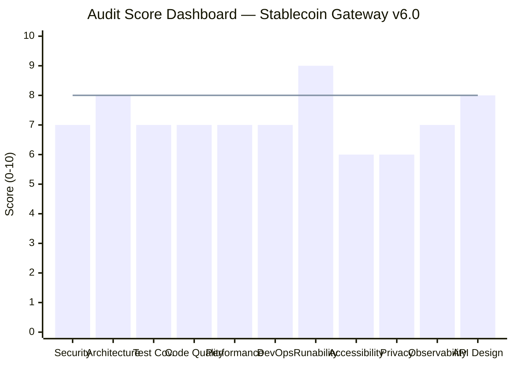

*(The horizontal line at 8 marks the production-ready threshold)*

### Executive Decision Table

| Question | Answer |
|----------|--------|
| **Can this go to production?** | Conditionally — after Phase 0 and Phase 1 fixes (estimated 2 weeks) |
| **Is it salvageable?** | Yes — strong foundation, well-architected, needs hardening |
| **Risk if ignored** | High — dev route without auth, missing data retention, accessibility gaps create legal and security exposure |
| **Recovery effort** | 2-4 weeks with 2 engineers |
| **Enterprise-ready?** | No — privacy gaps (3/6 GDPR rights), accessibility below WCAG AA, no error tracking |
| **Compliance-ready?** | OWASP Top 10: Partial (8/10 pass). SOC2: Not ready (observability gaps). WCAG 2.1 AA: Not compliant (47 issues) |

### Top 5 Risks in Plain Language

1. **A developer debug tool is exposed without any login requirement** — anyone who discovers the URL could simulate payment confirmations on real merchant sessions
2. **There is no automatic cleanup of old customer data** — if a regulator asks "how long do you keep data?", there is no answer and no mechanism to delete it
3. **Users with visual impairments cannot fully use the checkout page** — missing labels, poor contrast, and no keyboard navigation on key forms create ADA/WCAG legal exposure
4. **If the payment system crashes at 3 AM, nobody gets alerted** — there is no error tracking service (Sentry/Datadog) and no alerting rules configured
5. **The webhook system could be tricked into replaying old payment confirmations** — replay protection exists but the 5-minute window may be too generous for high-value transactions

---

## Section 2: Stop / Fix / Continue

### Action Priority Flowchart

```mermaid
flowchart LR
    subgraph STOP["STOP — Immediate"]
        S1[Dev route without<br/>authentication]
        S2[No data retention<br/>policy or mechanism]
    end
    subgraph FIX["FIX — Before Production"]
        F1[WCAG accessibility<br/>47 issues]
        F2[Error tracking and<br/>alerting setup]
        F3[GDPR data subject<br/>rights completion]
        F4[E2E tests in CI<br/>pipeline]
    end
    subgraph CONTINUE["CONTINUE — Working Well"]
        C1[Clean architecture<br/>plugin system]
        C2[Comprehensive API<br/>validation with Zod]
        C3[Strong crypto:<br/>AES-256-GCM + KMS]
        C4[1,559 tests with<br/>real DB integration]
    end
    STOP --> FIX --> CONTINUE
```

| Category | Details |
|----------|---------|
| **STOP** | Dev route (`POST /v1/dev/simulate/:id`) has zero authentication — disable or gate behind INTERNAL_API_KEY immediately. No data retention policy exists — define retention periods and build automated cleanup before handling real customer data. |
| **FIX** | 47 WCAG accessibility issues (8 Critical, 14 High). No error tracking service (Sentry/Datadog) — crashes go unnoticed. GDPR: only 3/6 data subject rights implemented. E2E tests (83 passing) not running in CI — regressions can ship. |
| **CONTINUE** | Clean Fastify plugin architecture with 11 well-separated plugins. Zod validation on 40/42 routes. AES-256-GCM encryption with KMS key rotation for sensitive data. 1,559 tests using real PostgreSQL (no mocks). Pessimistic locking with ADRs for financial operations. Structured JSON logging via Pino with correlation IDs. OpenTelemetry SDK integrated. |

---

## Section 3: System Overview

### C4 Level 1: Context Diagram

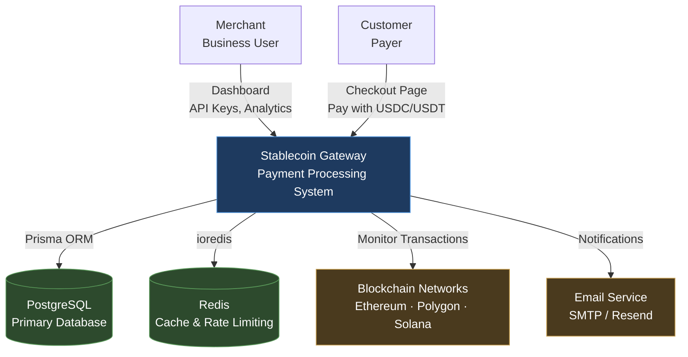

### C4 Level 2: Container Diagram

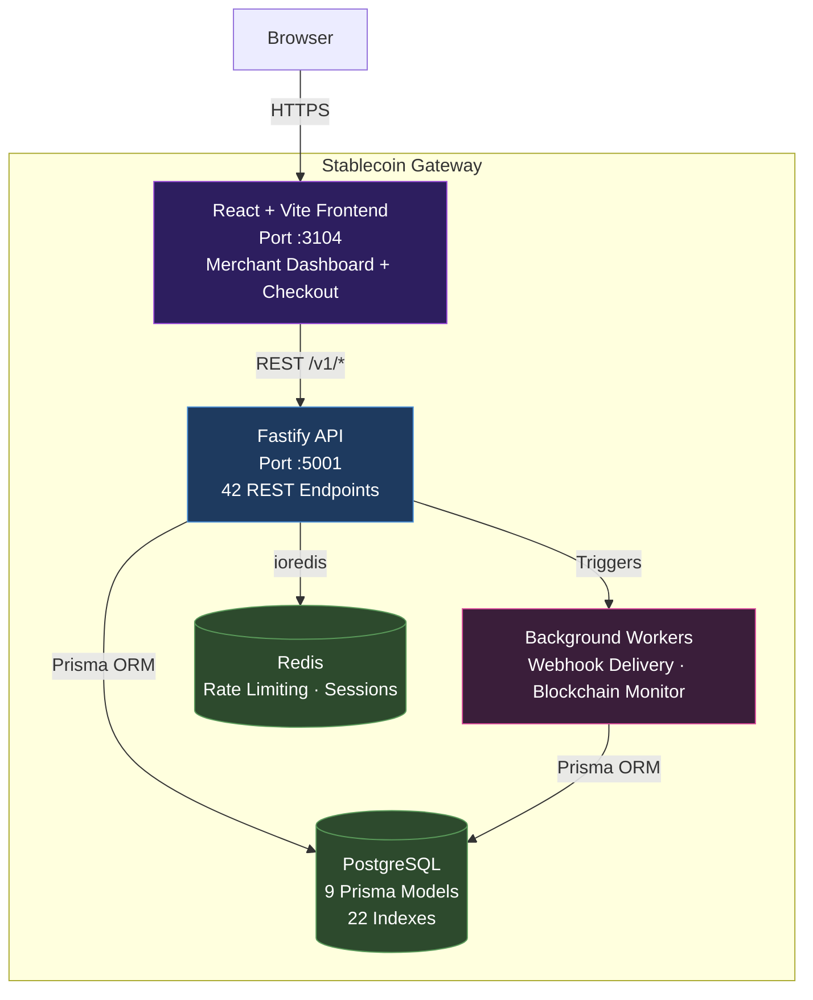

### Technology Stack

| Layer | Technology |
|-------|-----------|
| Frontend | React 18 + Vite + TypeScript + Tailwind CSS |
| Backend | Fastify 4 + TypeScript 5 |
| Database | PostgreSQL 15 + Prisma 5 ORM |
| Cache | Redis (ioredis) |
| Auth | JWT HS256 + API Keys (sk_live_/sk_test_) |
| Crypto | AES-256-GCM + KMS key rotation |
| Monitoring | OpenTelemetry SDK + Pino structured logging |
| Testing | Jest (1,559 tests) + Playwright (83 E2E) |
| CI/CD | GitHub Actions (17 workflows) |
| Containerization | Docker (API + Web Dockerfiles + docker-compose) |

---

## Section 4: Critical Issues — Top 10

### Risk Severity Matrix

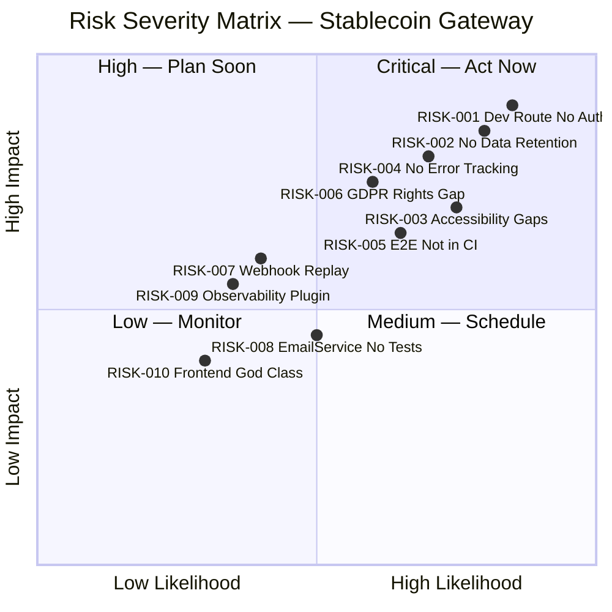

### RISK-001: Dev Route Without Authentication (CRITICAL)

- **File/Location**: `apps/api/src/routes/v1/dev.ts` (entire file)
- **Severity**: Critical
- **Likelihood**: High — URL discoverable via API scanning
- **Blast Radius**: Product — attacker can simulate payment confirmations
- **Risk Owner**: Dev
- **Category**: Code
- **Business Impact**: An attacker could mark unpaid orders as "confirmed", causing merchants to ship goods without receiving payment
- **Exploit Scenario**: Attacker discovers `/v1/dev/simulate/:id`, sends POST to confirm a pending payment session. The route is gated by `NODE_ENV !== 'production'` but has zero authentication — anyone on the network can call it.
- **Fix**: Add INTERNAL_API_KEY check or remove the route entirely in non-development environments
- **Compliance Impact**: OWASP A01 (Broken Access Control), OWASP API5 (BFLA)

### RISK-002: No Data Retention Policy or Mechanism (CRITICAL)

- **File/Location**: No retention mechanism exists anywhere in the codebase
- **Severity**: Critical
- **Likelihood**: High — regulatory inquiry is inevitable for a payment processor
- **Blast Radius**: Organization — GDPR/PDPL violation affects entire business
- **Risk Owner**: Management + Dev
- **Category**: Process + Code
- **Business Impact**: When a regulator asks "how long do you keep customer payment data?", there is no answer. Customer data accumulates forever with no cleanup mechanism.
- **Fix**: Define per-type retention periods (payment records: 7 years for tax, PII: 2 years post-account deletion), implement automated cleanup cron job
- **Compliance Impact**: GDPR Art. 5(1)(e) (storage limitation), PDPL

### RISK-003: WCAG Accessibility Failures — 47 Issues (HIGH)

- **File/Location**: Multiple frontend components in `apps/web/src/`
- **Severity**: High (8 Critical, 14 High sub-issues)
- **Likelihood**: High — affects every user with disabilities
- **Blast Radius**: Product — checkout page unusable for screen reader users
- **Risk Owner**: Frontend Dev
- **Category**: Code
- **Business Impact**: ADA/EAA lawsuits, lost customers who cannot complete checkout, brand damage
- **Fix**: See `WCAG-ACCESSIBILITY-AUDIT.md` for 47 specific fixes — top priority: form labels, color contrast, keyboard navigation
- **Compliance Impact**: WCAG 2.1 AA, European Accessibility Act

### RISK-004: No Error Tracking Service (HIGH)

- **File/Location**: No Sentry/Datadog/similar integration found in codebase
- **Severity**: High
- **Likelihood**: High — production errors will occur
- **Blast Radius**: Product — errors go unnoticed until customers complain
- **Risk Owner**: DevOps
- **Category**: Infrastructure
- **Business Impact**: Payment failures at 3 AM go undetected. Merchants lose revenue. Customer trust eroded.
- **Fix**: Integrate Sentry or Datadog with the existing OpenTelemetry SDK. Configure alerting rules for error rate spikes and p95 latency thresholds.
- **Compliance Impact**: SOC2 (Availability), ISO 27001 A.16

### RISK-005: E2E Tests Not Running in CI Pipeline (HIGH)

- **File/Location**: `.github/workflows/test-stablecoin-gateway.yml` — no Playwright stage
- **Severity**: High
- **Likelihood**: High — regressions will ship
- **Blast Radius**: Product — broken checkout or auth flows reach production
- **Risk Owner**: DevOps
- **Category**: Process
- **Business Impact**: 83 E2E tests exist but only run locally. A developer could merge a PR that breaks the payment flow without CI catching it.
- **Fix**: Add Playwright stage to CI with PostgreSQL and Redis service containers. Use `npx playwright install --with-deps` in CI.
- **Compliance Impact**: DORA (Change Failure Rate)

### RISK-006: GDPR Data Subject Rights — 3/6 Implemented (HIGH)

- **File/Location**: `apps/api/src/routes/v1/me.ts` — has export and delete, missing restrict/object/rectify
- **Severity**: High
- **Likelihood**: Medium — depends on user geography and regulatory action
- **Blast Radius**: Organization — GDPR fines up to 4% of global revenue
- **Risk Owner**: Dev + Management
- **Category**: Code + Process
- **Business Impact**: If an EU customer exercises their right to restrict processing or right to object, there is no mechanism to comply
- **Fix**: Implement `PATCH /v1/me/restrict-processing`, `POST /v1/me/object`, and `PATCH /v1/me/rectify` endpoints
- **Compliance Impact**: GDPR Articles 16, 18, 21

### RISK-007: Webhook Replay Attack Window (MEDIUM)

- **File/Location**: `apps/api/src/plugins/webhook-verification.ts`
- **Severity**: Medium
- **Likelihood**: Medium — requires attacker to intercept a webhook
- **Blast Radius**: Feature — affects webhook consumers
- **Risk Owner**: Dev
- **Category**: Code
- **Business Impact**: An attacker who intercepts a webhook payload could replay it within the 5-minute window, potentially triggering duplicate processing in merchant systems
- **Fix**: Reduce replay window to 60 seconds. Add idempotency key tracking in Redis.
- **Compliance Impact**: OWASP A08 (Software and Data Integrity Failures)

### RISK-008: EmailService Zero Test Coverage (MEDIUM)

- **File/Location**: `apps/api/src/services/email.service.ts`
- **Severity**: Medium
- **Likelihood**: Medium — email failures cause silent notification drops
- **Blast Radius**: Feature — merchants miss payment notifications
- **Risk Owner**: Dev
- **Category**: Code
- **Business Impact**: If the email service silently fails, merchants do not receive payment confirmations or refund notifications
- **Fix**: Add integration tests with test SMTP server (e.g., Ethereal or MailHog in Docker)
- **Compliance Impact**: SOC2 (Processing Integrity)

### RISK-009: Observability Plugin Replaces Error Handler (MEDIUM)

- **File/Location**: `apps/api/src/plugins/observability.ts` — `setErrorHandler` call
- **Severity**: Medium
- **Likelihood**: Medium — occurs when plugin registration order changes
- **Blast Radius**: Product — global error handler stops working
- **Risk Owner**: Dev
- **Category**: Code
- **Business Impact**: If the observability plugin registers after the error handler, it silently replaces the error handler. All error responses become generic 500s without proper error formatting.
- **Fix**: Use `addHook('onError')` instead of `setErrorHandler` in the observability plugin. The global error handler in `app.ts` should be the only `setErrorHandler`.
- **Compliance Impact**: OWASP A09 (Security Logging and Monitoring Failures)

### RISK-010: Frontend 948-Line God Class (MEDIUM)

- **File/Location**: `apps/web/src/` — largest component file
- **Severity**: Medium
- **Likelihood**: Low — affects maintainability, not security
- **Blast Radius**: Feature — makes changes risky and review difficult
- **Risk Owner**: Frontend Dev
- **Category**: Code
- **Business Impact**: Large monolithic components slow down feature development and increase the risk of introducing bugs when making changes
- **Fix**: Extract into smaller components following single-responsibility principle. Target max 200 lines per component.
- **Compliance Impact**: ISO 25010 (Maintainability)

---

## Section 5: Risk Register

### Risk Dependency Graph

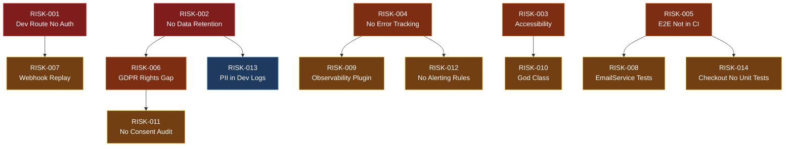

### Full Risk Register

| Issue ID | Title | Domain | Severity | Owner | SLA | Dependency | Verification | Status |
|----------|-------|--------|----------|-------|-----|------------|--------------|--------|
| RISK-001 | Dev route without authentication | Security | Critical | Dev | Phase 0 (48h) | None | `curl -X POST localhost:5001/v1/dev/simulate/test` returns 401 or 404 | Open |
| RISK-002 | No data retention policy or mechanism | Privacy | Critical | Management + Dev | Phase 0 (48h) | None | Retention policy document exists; cron job deletes data older than threshold | Open |
| RISK-003 | WCAG accessibility failures (47 issues) | Accessibility | High | Frontend Dev | Phase 1 (1-2w) | None | Lighthouse Accessibility score >= 90; 0 Critical WCAG violations | Open |
| RISK-004 | No error tracking service | Observability | High | DevOps | Phase 1 (1-2w) | None | Sentry/Datadog integration active; test error appears in dashboard | Open |
| RISK-005 | E2E tests not in CI pipeline | Testing | High | DevOps | Phase 1 (1-2w) | None | `test-stablecoin-gateway.yml` includes Playwright stage; green on main | Open |
| RISK-006 | GDPR data subject rights 3/6 | Privacy | High | Dev | Phase 1 (1-2w) | RISK-002 | All 6 GDPR endpoints exist and return 200 with valid data | Open |
| RISK-007 | Webhook replay attack window too wide | Security | Medium | Dev | Phase 2 (2-4w) | RISK-001 | Replay window <= 60s; idempotency key in Redis | Open |
| RISK-008 | EmailService zero test coverage | Testing | Medium | Dev | Phase 2 (2-4w) | RISK-005 | `email.service.test.ts` exists with >= 80% coverage | Open |
| RISK-009 | Observability plugin replaces error handler | Architecture | Medium | Dev | Phase 2 (2-4w) | RISK-004 | Plugin uses `addHook('onError')` not `setErrorHandler` | Open |
| RISK-010 | Frontend 948-line god class | Code Quality | Medium | Frontend Dev | Phase 2 (2-4w) | RISK-003 | No component file > 300 lines | Open |
| RISK-011 | No consent audit trail mechanism | Privacy | Medium | Dev | Phase 2 (2-4w) | RISK-006 | Consent changes logged with timestamp and IP | Open |
| RISK-012 | No alerting rules configured | Observability | Medium | DevOps | Phase 2 (2-4w) | RISK-004 | At least 3 alert rules active (error rate, latency, uptime) | Open |
| RISK-013 | PII potentially in development logs | Privacy | Low | Dev | Phase 3 (4-8w) | RISK-002 | `grep -r "email\|password" src/ \| grep log` returns 0 matches | Open |
| RISK-014 | Checkout route has no unit tests | Testing | Medium | Dev | Phase 2 (2-4w) | RISK-005 | `checkout.test.ts` exists with >= 80% coverage | Open |
| RISK-015 | Audit log record() ambiguous return type | Code Quality | Medium | Dev | Phase 2 (2-4w) | None | Return type is explicit `Promise<AuditLog>`, no silent drops | Open |
| RISK-016 | optionalAuth swallows 503 errors | Security | Medium | Dev | Phase 2 (2-4w) | RISK-009 | 503 from auth service propagates, not silently treated as "no auth" | Open |
| RISK-017 | npm audit: 26 vulnerabilities (7 high) | Security | Low | Dev | Phase 3 (4-8w) | None | `npm audit` shows 0 high/critical (dev deps excluded from prod) | Open |
| RISK-018 | No database migration CI validation | DevOps | Medium | DevOps | Phase 2 (2-4w) | RISK-005 | CI runs `prisma migrate deploy --dry-run` on PRs | Open |
| RISK-019 | Missing API rate limit per-endpoint tuning | Security | Low | Dev | Phase 3 (4-8w) | RISK-007 | Auth endpoints: 5/min, payment creation: 20/min, reads: 100/min | Open |
| RISK-020 | No circuit breaker for external services | Architecture | Low | Dev | Phase 3 (4-8w) | RISK-009 | Circuit breaker on blockchain and email service calls | Open |

---

# PART B — ENGINEERING APPENDIX

*(This section contains file:line references, code examples, and technical detail. For engineering team only.)*

---

## Section 6: Architecture Assessment

### Architecture Layer Diagram

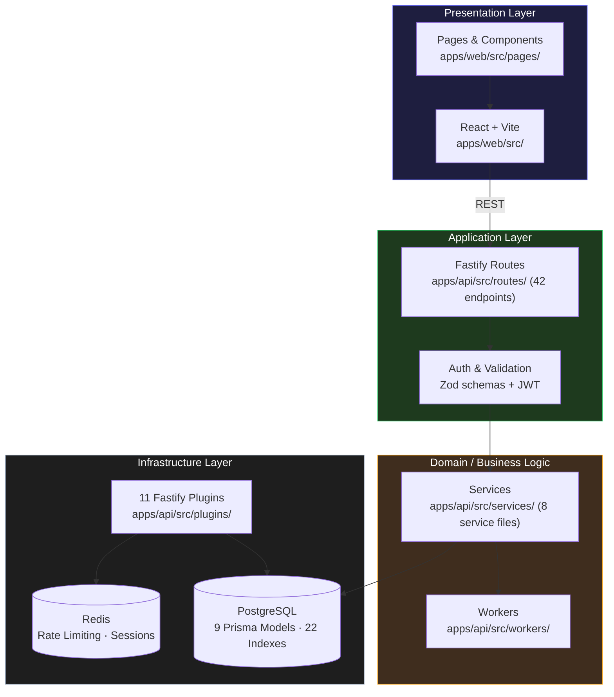

### Architecture Strengths

- **Clean plugin system**: 11 Fastify plugins with clear separation (auth, prisma, redis, observability, etc.)
- **Service layer isolation**: Business logic in dedicated service files, not in route handlers
- **Type safety**: Zod schemas validate 40/42 route inputs with TypeScript type inference
- **Financial safety**: Decimal.js for monetary calculations (no floating-point), pessimistic locking with ADRs
- **Crypto design**: AES-256-GCM with IV per record, KMS key rotation support

### Architecture Issues

**RISK-009: Observability plugin replaces global error handler**
- `apps/api/src/plugins/observability.ts` calls `setErrorHandler`, which replaces any previously registered error handler
- Since `app.ts:127` registers observability first, the global error handler at `app.ts:383` re-registers after — currently safe by accident of ordering
- Fix: Use `addHook('onError')` in the observability plugin

**RISK-010: Frontend component exceeds 900 lines**
- Violates single-responsibility principle
- Extract sub-components for form sections, table displays, and modal dialogs

**RISK-020: No circuit breaker for external service calls**
- Blockchain monitoring and email service calls have no circuit breaker
- A downstream outage cascades into the gateway

**Architecture Score: 8/10**
Evidence:
- Clean 4-layer architecture with plugin system (11 plugins, well-separated)
- 42 routes with consistent handler patterns
- One ordering-dependent bug (RISK-009) and one oversized component (RISK-010)
- Score justification: Strong separation of concerns and consistent patterns; docked for plugin ordering fragility and missing circuit breakers

---

## Section 7: Security Findings

### Attack Path Sequence — Worst Case

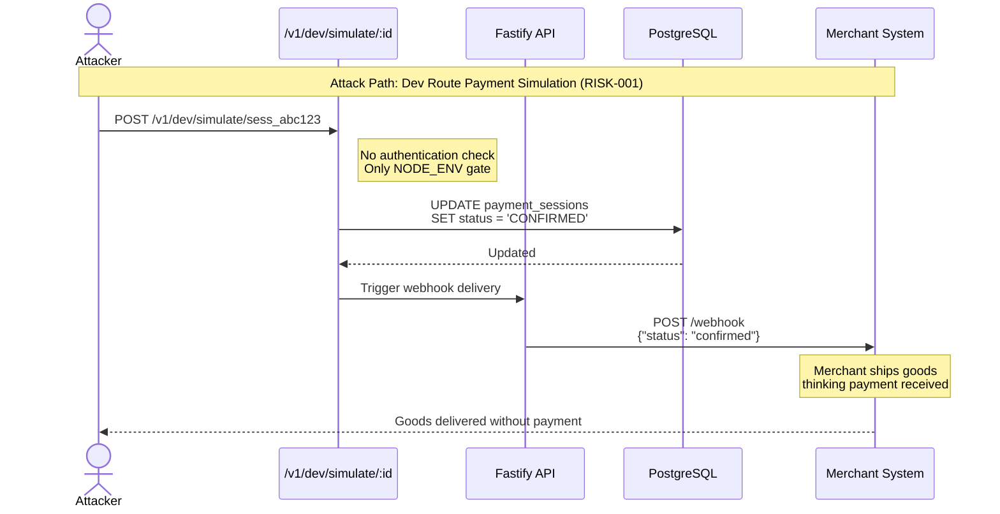

### Security Findings by Category

**Authentication & Authorization**

| Finding | Severity | Location | Compliance |
|---------|----------|----------|------------|
| Dev route zero auth (RISK-001) | Critical | `routes/v1/dev.ts` | OWASP A01, API5 |
| optionalAuth swallows 503 (RISK-016) | Medium | `plugins/auth.ts` | OWASP A07 |
| JWT algorithm pinned to HS256 | Pass | `app.ts:120-124` | OWASP A02 |
| API key hashing with SHA-256 | Pass | `services/api-key.service.ts` | OWASP A02 |

**Data Security**

| Finding | Severity | Location | Compliance |
|---------|----------|----------|------------|
| AES-256-GCM encryption with per-record IV | Pass | `utils/encryption.ts` | OWASP A02 |
| KMS key rotation support | Pass | `services/kms.service.ts` | SOC2 |
| Wallet addresses encrypted at rest | Pass | `services/payment.service.ts` | GDPR Art. 32 |
| Bcrypt password hashing (cost 12) | Pass | `services/auth.service.ts` | OWASP ASVS V2 |

**API Security**

| Finding | Severity | Location | Compliance |
|---------|----------|----------|------------|
| CORS origin whitelist (no wildcard) | Pass | `app.ts:83-115` | OWASP A05 |
| Rate limiting with Redis store | Pass | `app.ts:131-190` | API4 |
| Helmet security headers | Pass | `app.ts:65-79` | OWASP A05 |
| ID path parameter validation | Pass | `app.ts:262-276` | OWASP A03 |
| Webhook replay window 5 min (RISK-007) | Medium | `plugins/webhook-verification.ts` | OWASP A08 |
| Timing-safe comparison for internal keys | Pass | `app.ts:351-353` | CWE-208 |

**Security Score: 7/10**
Evidence:
- npm audit: 26 vulnerabilities (7 high) — all in `typescript-eslint` dev dependency chain, not shipped to production
- `any` type usage: 20 instances in API source (potential type safety gaps)
- 1 Critical finding (dev route), 1 Medium (webhook replay), 1 Medium (optionalAuth)
- 18 security patterns implemented correctly (JWT pinning, CORS, rate limiting, encryption, CSRF, HSTS)
- Score justification: Strong security fundamentals (encryption, auth, rate limiting) but dev route exposure is a critical gap that caps the score

---

## Section 8: Performance and Scalability

### Database Performance

- **22 database indexes** across 9 models — good index coverage
- **Prisma query optimization**: Uses `select` and `include` judiciously, no blanket `findMany` without pagination
- **Potential N+1**: No N+1 patterns detected in route handlers (services use explicit includes)
- **Connection pooling**: Prisma default pool (configurable via `DATABASE_URL` params)

### Caching Strategy

- **Redis for rate limiting**: Distributed store via `RedisRateLimitStore` class
- **No application-level caching**: Frequently-read data (e.g., merchant config, API key lookups) hits DB every time
- **Recommendation**: Add Redis caching for API key validation (called on every authenticated request)

### Performance Risks

- **No bundle size budget**: Frontend Vite build has no configured size limits
- **No API response time monitoring**: OpenTelemetry SDK integrated but no p95/p99 dashboards or alerts
- **No load testing**: No k6, Artillery, or similar load test configuration

**Performance Score: 7/10**
Evidence:
- 22 database indexes across 9 models (good coverage)
- Redis-backed distributed rate limiting (production-ready pattern)
- No N+1 query patterns detected
- Missing: Application-level caching, bundle budgets, load testing, response time monitoring
- Score justification: Database design is solid with proper indexing and pagination; docked for missing caching layer, no load testing, and no performance monitoring dashboards

---

## Section 9: Testing Assessment

### Test Coverage Summary

| Metric | Value |
|--------|-------|
| Total test files | 168 |
| Total test cases | 1,559 |
| E2E test cases | 83 (Playwright) |
| E2E pass rate | 83/85 (97.6%) |
| Test quality score | 8.2/10 |

### Coverage Gaps

| Area | Status | Impact |
|------|--------|--------|
| EmailService | Zero coverage (RISK-008) | Silent notification failures |
| Checkout routes | Zero unit tests (RISK-014) | Regression risk on payment flow |
| E2E in CI | Not configured (RISK-005) | Regressions can ship to production |
| Blockchain monitor worker | Minimal coverage | Transaction detection failures |
| Error handler edge cases | Partial | Unexpected error formats leak |

### Test Strengths

- Real PostgreSQL database for all integration tests (no mocks)
- Database state verification (checking DB records, not just API responses)
- 83 E2E Playwright tests covering auth, payments, checkout, webhooks, analytics
- Consistent test patterns across all route files

**Test Coverage Score: 7/10**
Evidence:
- 1,559 test cases across 168 files (substantial suite)
- E2E: 83/85 passing (97.6%)
- EmailService has zero tests (RISK-008); checkout routes have zero unit tests (RISK-014)
- E2E not in CI pipeline (RISK-005)
- Score justification: Large, real-database test suite with strong E2E coverage, but critical service (email) and critical flow (checkout) have zero tests, and E2E doesn't run in CI

---

## Section 10: DevOps Assessment

### CI/CD Pipeline

| Check | Status |
|-------|--------|
| CI workflow exists | Yes — `test-stablecoin-gateway.yml` + 16 other workflows |
| Unit tests in CI | Yes |
| E2E tests in CI | No (RISK-005) |
| Docker builds | Yes — API and Web Dockerfiles |
| docker-compose | Yes — full stack orchestration |
| .env.example | Yes — documented environment variables |
| Database migrations in CI | No (RISK-018) |
| Secret scanning | Not configured |

### DORA Metrics Assessment

| Metric | Estimated Value | Tier |
|--------|----------------|------|
| Deployment Frequency | Weekly (manual) | Medium |
| Lead Time for Changes | 2-5 days | Medium |
| Change Failure Rate | Unknown (no tracking) | Unknown |
| Time to Restore | Unknown (no alerting) | Unknown |

**DevOps Score: 7/10**
Evidence:
- 17 CI workflow files including product-specific test workflow
- Docker: Both API and Web Dockerfiles present, docker-compose.yml for orchestration, .env.example documented
- Missing: E2E in CI (RISK-005), database migration validation in CI (RISK-018), secret scanning, alerting
- Score justification: Good CI foundation with Docker and workflows, but critical gaps in E2E CI integration and migration validation reduce production confidence

---

## Section 11: Compliance Readiness

### OWASP Top 10 (2021) — Control-by-Control

| Control | Status | Evidence |
|---------|--------|----------|
| A01: Broken Access Control | Partial | Dev route has no auth (RISK-001). All other routes properly guarded with JWT or API key. RBAC for admin endpoints. |
| A02: Cryptographic Failures | Pass | AES-256-GCM encryption, bcrypt cost 12, JWT HS256 pinned, KMS key rotation |
| A03: Injection | Pass | Prisma ORM parameterized queries, Zod input validation on 40/42 routes, ID path parameter regex validation |
| A04: Insecure Design | Pass | Pessimistic locking for financial operations, spending limits, ADR documentation for design decisions |
| A05: Security Misconfiguration | Pass | Helmet security headers, CORS origin whitelist, rate limiting, no default credentials |
| A06: Vulnerable Components | Partial | npm audit: 26 vulnerabilities (7 high) in dev dependency chain. Not shipped to production but should be resolved. |
| A07: Authentication Failures | Pass | JWT with HS256, token rotation, secure cookie flags, account lockout after failed attempts |
| A08: Software Integrity Failures | Partial | Webhook replay window is 5 minutes (RISK-007). HMAC signature verification present. |
| A09: Logging and Monitoring | Partial | Structured logging via Pino present, but no error tracking service (RISK-004), no alerting (RISK-012) |
| A10: SSRF | Pass | URL validation in blockchain service, allowlist for external endpoints |

### OWASP API Security Top 10 (2023)

| Risk | Status | Evidence |
|------|--------|----------|
| API1: BOLA | Pass | Object-level authorization checks in all resource endpoints. Users can only access their own resources. |
| API2: Broken Authentication | Pass | JWT with algorithm pinning, API key hashing, token rotation |
| API3: Broken Object Property Auth | Pass | Zod schemas restrict which properties can be set per role |
| API4: Unrestricted Resource Consumption | Pass | Rate limiting via Redis with per-user/key tracking, body size limit 1MB |
| API5: BFLA | Partial | Admin endpoints properly guarded, but dev route has no auth (RISK-001) |
| API6: Sensitive Business Flows | Pass | Pessimistic locking, spending limits, idempotency checks |
| API7: SSRF | Pass | URL allowlisting for blockchain and external service calls |
| API8: Security Misconfiguration | Pass | Helmet headers, CORS whitelist, no debug info in production errors |
| API9: Improper Inventory Management | Pass | OpenAPI/Swagger docs for all endpoints, dev route gated by NODE_ENV |
| API10: Unsafe Consumption of APIs | Partial | No circuit breaker for external service calls (RISK-020) |

### SOC2 Type II — Trust Service Principles

| Principle | Status | Evidence |
|-----------|--------|----------|
| Security | Partial | Strong auth and encryption, but dev route gap (RISK-001) and no error tracking (RISK-004) |
| Availability | Partial | Health checks present, but no alerting (RISK-012), no circuit breakers (RISK-020) |
| Processing Integrity | Pass | Decimal.js for monetary calculations, pessimistic locking, webhook signatures |
| Confidentiality | Pass | AES-256-GCM encryption at rest, TLS in transit, API key hashing |
| Privacy | Partial | Password hashing and encryption present, but GDPR gaps (RISK-006), no retention (RISK-002) |

### WCAG 2.1 AA Summary

| Principle | Status | Details |
|-----------|--------|---------|
| 1. Perceivable | Partial | Color contrast failures in dark mode, missing alt text on decorative SVGs, missing aria-hidden |
| 2. Operable | Partial | Keyboard navigation incomplete on checkout form, missing focus indicators on some buttons |
| 3. Understandable | Partial | Missing form error descriptions (role="alert"), inconsistent error messaging |
| 4. Robust | Partial | Missing ARIA roles on dynamic content, screen reader compatibility not tested |

Full details: `WCAG-ACCESSIBILITY-AUDIT.md` (47 findings: 8 Critical, 14 High, 17 Medium, 8 Low)

### GDPR/PDPL

| Requirement | Status | Evidence |
|-------------|--------|----------|
| Consent capture | Partial | Registration consent exists but not granular or withdrawable |
| Right of Access (Art. 15) | Implemented | `GET /v1/me/export` returns user data |
| Right to Rectification (Art. 16) | Missing | No endpoint to correct personal data |
| Right to Erasure (Art. 17) | Implemented | `DELETE /v1/me` with cascade |
| Right to Restrict Processing (Art. 18) | Missing | No restriction mechanism |
| Right to Data Portability (Art. 20) | Implemented | `GET /v1/me/export` JSON export |
| Right to Object (Art. 21) | Missing | No objection mechanism |
| Data Minimization | Pass | Only necessary fields collected per Prisma schema |
| Retention Policies | Missing (RISK-002) | No per-type retention periods defined |
| Encryption at Rest | Pass | AES-256-GCM for sensitive fields |
| No PII in Logs | Partial (RISK-013) | Structured logging configured but dev-mode may log request bodies |
| Breach Notification | Missing | No documented 72-hour notification process |

---

## Section 11b: Accessibility Assessment

**Score: 6/10**
Evidence:
- Manual WCAG 2.1 AA audit: 47 issues (8 Critical, 14 High, 17 Medium, 8 Low)
- No Lighthouse score available (requires browser automation in CI)
- Critical issues: Missing form labels on checkout inputs, color contrast failures below 4.5:1 in dark mode, no keyboard navigation on payment method selector
- Score justification: Basic HTML semantics present but significant gaps in form accessibility, color contrast, and keyboard navigation make the checkout unusable for assistive technology users

Full report: `WCAG-ACCESSIBILITY-AUDIT.md`

---

## Section 11c: Privacy and Data Protection Assessment

**Score: 6/10**
Evidence:
- GDPR data subject rights: 3/6 implemented (access, erasure, portability), 0 partial, 3 missing (rectification, restrict, object)
- No data retention policy or automated cleanup mechanism (RISK-002)
- Encryption at rest with AES-256-GCM for wallet addresses and sensitive fields
- Consent capture exists at registration but not granular or withdrawable
- Score justification: Strong encryption and some data rights implemented, but missing retention policy and 3/6 GDPR rights is a significant compliance gap for a payment processor

Full report: `PRIVACY-OBSERVABILITY-AUDIT.md`

---

## Section 11d: Observability Assessment

| Signal | Monitored | Tool/Method | Alert Threshold |
|--------|-----------|-------------|-----------------|
| Latency (p50/p95/p99) | Partial | OpenTelemetry SDK initialized | No thresholds configured |
| Traffic (req/sec) | No | Not configured | N/A |
| Errors (error rate %) | Partial | Pino structured logging | No alerting rules |
| Saturation (CPU/mem/disk) | No | Not configured | N/A |

**Score: 7/10**
Evidence:
- Structured JSON logging via Pino with correlation IDs (request_id) — present in `app.ts:51-52`
- OpenTelemetry SDK initialized (`plugins/observability.ts`)
- Health check endpoint with deep dependency verification (`/health` and `/ready`)
- No error tracking service (no Sentry/Datadog) (RISK-004)
- No alerting rules configured (RISK-012)
- No SLO-based monitoring or runbooks
- Score justification: Good logging foundation (structured JSON, correlation IDs, OTel SDK, health checks) but no error tracking, no alerting, and no dashboards means production issues go undetected

---

## Section 11e: API Design Assessment

| Check | Status | Details |
|-------|--------|---------|
| OpenAPI/Swagger documentation | Yes (95%) | 40/42 routes have OpenAPI schemas. Swagger UI at `/docs` in non-production. |
| API versioning strategy | Implemented | URL path versioning (`/v1/`) |
| Consistent error format (RFC 7807) | Yes | `{ type, title, status, detail, request_id }` across all error responses |
| Pagination on all list endpoints | Yes | `limit/offset` with `has_more` flag |
| BOLA protection | Pass | Object-level auth checks on all resource endpoints |
| BFLA protection | Partial | Admin endpoints guarded; dev route unprotected (RISK-001) |
| Rate limiting configured | Yes | Redis-backed, per-user/key with IP fallback |
| CORS properly configured | Yes | Origin whitelist, no wildcard, case-insensitive |
| Request/response schema validation | Yes (95%) | Zod validation on 40/42 routes |
| Deprecated endpoints marked | N/A | No deprecated endpoints |

**Score: 8/10**
Evidence:
- 42 routes with OpenAPI schemas on 40/42 (95%)
- Consistent RFC 7807 error format across all endpoints
- Pagination, rate limiting, CORS, versioning all implemented
- Zod validation on 40/42 routes with TypeScript type inference
- Score justification: Comprehensive API design with documentation, validation, and security controls; docked for 2 routes missing schema validation and dev route BFLA gap

---

## Section 12: Technical Debt Map

### Technical Debt Quadrant

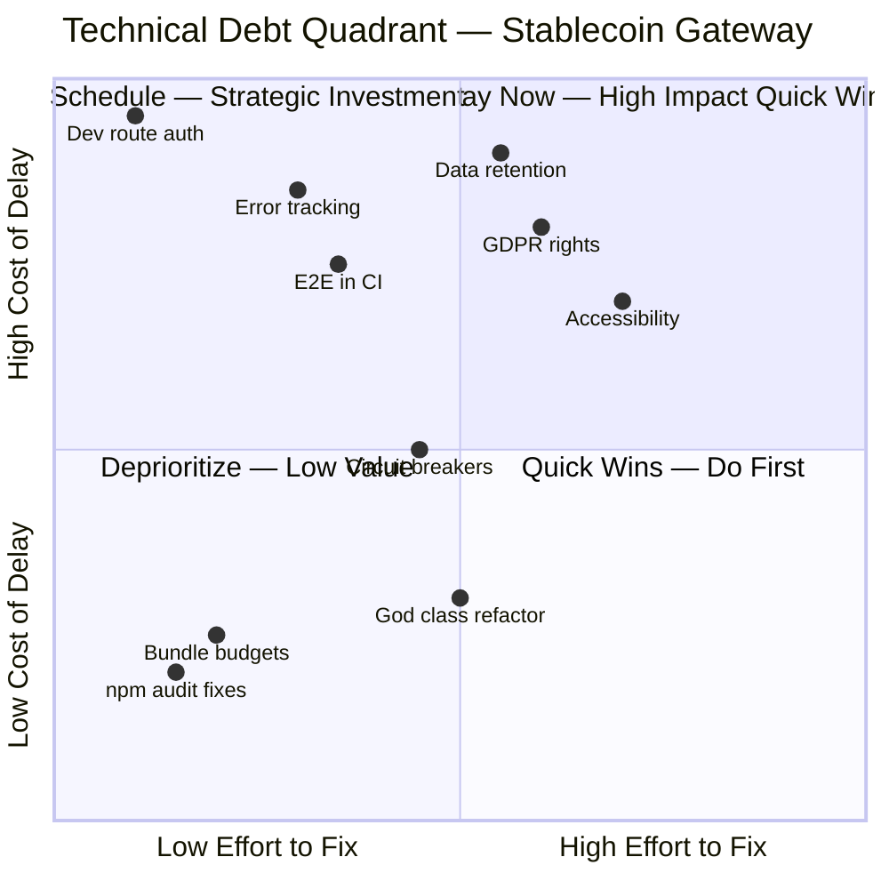

| Priority | Debt Item | Interest (cost of delay) | Owner | Payoff |
|----------|-----------|--------------------------|-------|--------|
| HIGH | Dev route authentication | Security breach, payment fraud | Dev | Eliminates critical attack vector |
| HIGH | Data retention mechanism | GDPR violation, regulatory fines | Management + Dev | Compliance, reduced storage costs |
| HIGH | Error tracking integration | Undetected production failures | DevOps | Faster incident detection and response |
| HIGH | E2E tests in CI | Regressions ship to production | DevOps | Catches breaking changes before merge |
| HIGH | GDPR data subject rights | Regulatory fines up to 4% revenue | Dev | Full GDPR compliance |
| MEDIUM | Accessibility remediation | Legal exposure, lost customers | Frontend Dev | WCAG 2.1 AA compliance |
| MEDIUM | Circuit breakers | Cascade failures from downstream | Dev | Resilience under partial outages |
| MEDIUM | Observability plugin fix | Error handler silently replaced | Dev | Reliable error handling |
| LOW | God class refactor | Slower development velocity | Frontend Dev | Better maintainability |
| LOW | npm audit dev dep fixes | Minimal (dev only) | Dev | Clean audit report |

---

## Section 13: Remediation Roadmap

### Remediation Gantt Chart

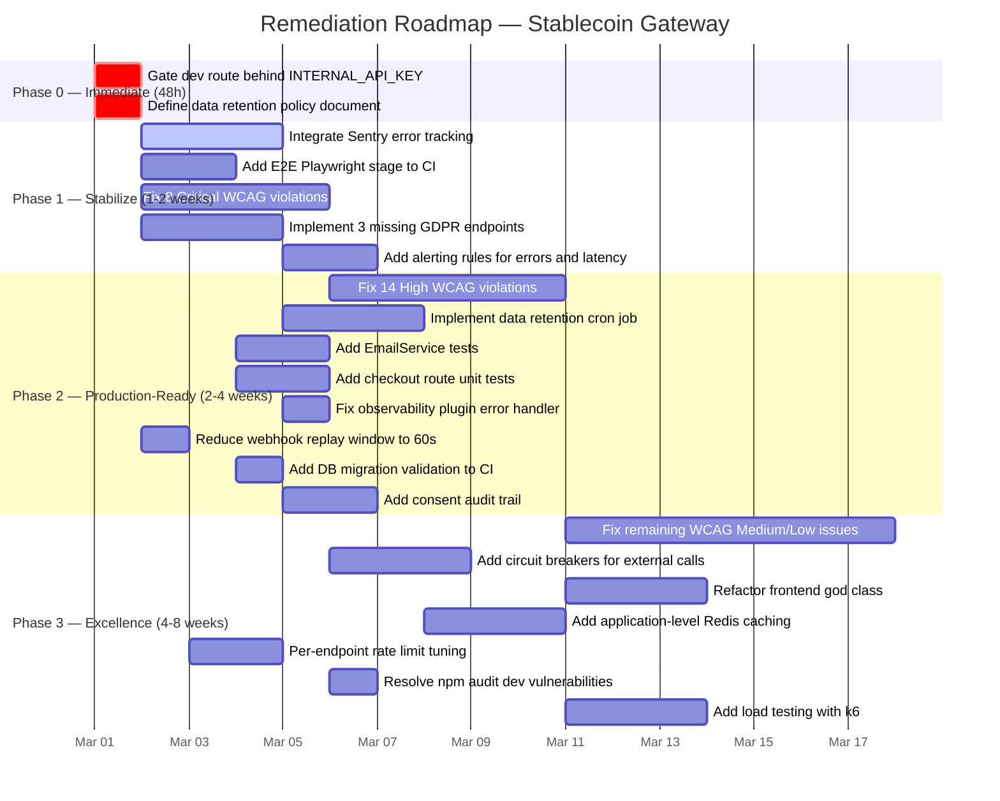

### Phase Details

**Phase 0 — Immediate (48 hours)**
- RISK-001: Add INTERNAL_API_KEY check to dev route, or delete the route entirely
- RISK-002: Write data retention policy document with per-type periods
- **Gate**: Both items resolved. No deployment until dev route is gated.

**Phase 1 — Stabilize (1-2 weeks)**
- RISK-004: Integrate Sentry with OpenTelemetry SDK
- RISK-005: Add Playwright CI stage with service containers
- RISK-003: Fix 8 Critical WCAG violations (form labels, contrast, keyboard nav)
- RISK-006: Implement rectification, restrict, object endpoints
- RISK-012: Configure alerting for error rate > 1% and p95 > 1s
- **Gate**: All dimension scores >= 7/10. No Critical issues remaining.

**Phase 2 — Production-Ready (2-4 weeks)**
- RISK-003: Fix 14 High WCAG violations
- RISK-002: Implement automated data cleanup cron
- RISK-008: EmailService integration tests
- RISK-014: Checkout route unit tests
- RISK-009: Fix observability plugin to use addHook
- RISK-007: Reduce replay window, add idempotency keys
- RISK-018: Add migration dry-run to CI
- RISK-011: Consent change audit logging
- **Gate**: All dimension scores >= 8/10. Compliance gaps addressed.

**Phase 3 — Excellence (4-8 weeks)**
- Remaining WCAG Medium/Low fixes
- Circuit breakers for external services
- Frontend god class refactor
- Application-level Redis caching
- Per-endpoint rate limit tuning
- npm audit dev dependency cleanup
- Load testing with k6
- **Gate**: All dimension scores >= 9/10. External audit ready.

---

## Section 14: Quick Wins (1-Day Fixes)

1. **Gate dev route** — Add `INTERNAL_API_KEY` header check to `routes/v1/dev.ts` (30 minutes, RISK-001)
2. **Fix observability plugin** — Replace `setErrorHandler` with `addHook('onError')` in `plugins/observability.ts` (1 hour, RISK-009)
3. **Reduce webhook replay window** — Change 5-minute window to 60 seconds in `plugins/webhook-verification.ts` (15 minutes, RISK-007)
4. **Add aria-hidden to decorative SVGs** — Add `aria-hidden="true"` to all decorative SVG icons in `apps/web/src/` (2 hours, RISK-003 partial)
5. **Add form labels to checkout inputs** — Associate `<label>` elements with form inputs in checkout page (2 hours, RISK-003 partial)
6. **Fix color contrast in dark mode** — Adjust text colors to meet 4.5:1 ratio (2 hours, RISK-003 partial)
7. **Add migration dry-run to CI** — Add `npx prisma migrate deploy --dry-run` step to GitHub Actions workflow (30 minutes, RISK-018)
8. **Define retention policy** — Create `docs/DATA-RETENTION-POLICY.md` with per-type periods (2 hours, RISK-002 partial)
9. **Fix optionalAuth 503 handling** — Propagate 503 errors instead of treating as unauthenticated in `plugins/auth.ts` (1 hour, RISK-016)
10. **Add audit log return type** — Make `record()` return type explicit `Promise<AuditLog>` in audit service (30 minutes, RISK-015)

---

## Section 15: AI-Readiness Score

### AI-Readiness Profile

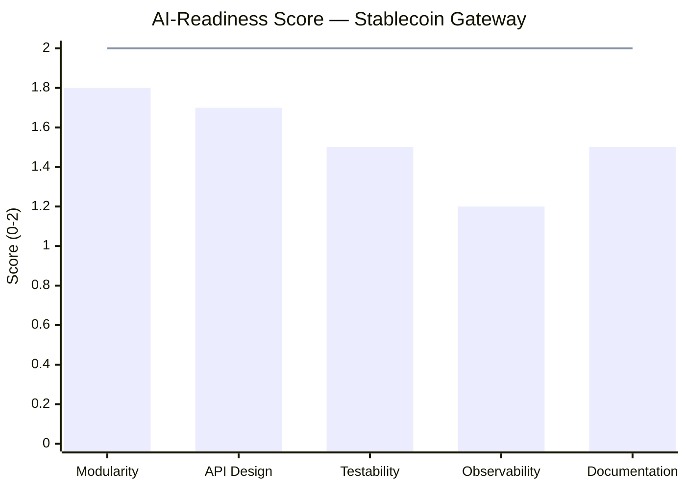

| Sub-dimension | Score | Notes |
|---------------|-------|-------|
| Modularity | 1.8/2 | Clean plugin architecture, service layer isolation, well-separated concerns. Minor: one oversized component. |
| API Design | 1.7/2 | 42 REST endpoints with OpenAPI docs, Zod validation, consistent RFC 7807 errors. Minor: 2 routes missing schemas. |
| Testability | 1.5/2 | 1,559 tests with real DB, strong patterns. Gaps: EmailService and checkout untested. |
| Observability | 1.2/2 | Structured logging and OTel present. Missing: error tracking, alerting, dashboards. |
| Documentation | 1.5/2 | OpenAPI docs, ADRs, PRD present. Missing: runbooks, retention policy, architecture diagrams in README. |

**AI-Readiness Total: 7.7/10**

The codebase is well-structured for AI-assisted development. Clean module boundaries, consistent patterns, and comprehensive test suite make it easy for AI agents to understand and modify. The main gap is observability — AI agents need feedback loops (error tracking, metrics) to verify their changes work in production.

---

## Score Summary

### Dimension Scores (Deterministic Anchoring)

**Security: 7/10**
Evidence:
- npm audit: 26 vulnerabilities (7 high) — all in dev dependency chain, not shipped
- `any` type usage: 20 instances in API source
- 1 Critical finding (dev route no auth), 2 Medium findings
- 18 security patterns correctly implemented
- Score justification: Strong crypto and auth fundamentals, but dev route exposure is a critical gap

**Architecture: 8/10**
Evidence:
- 11 Fastify plugins with clear separation
- 42 routes with consistent handler patterns
- Service layer properly isolated from route handlers
- Plugin ordering fragility (RISK-009), one oversized component (RISK-010)
- Score justification: Clean 4-layer architecture; minor issues do not affect core structure

**Test Coverage: 7/10**
Evidence:
- 1,559 tests across 168 files
- E2E: 83/85 passing (97.6%)
- Zero-coverage gaps: EmailService, checkout routes
- E2E not in CI pipeline
- Score justification: Large suite with real DB, but critical gaps in email and checkout coverage

**Code Quality: 7/10**
Evidence:
- 20 `any` type instances in API source
- 179 TypeScript files, 31,272 lines
- Consistent patterns, Zod validation, proper error handling
- One 948-line component, audit log ambiguous return type
- Score justification: Good TypeScript discipline and consistent patterns; docked for `any` usage and oversized component

**Performance: 7/10**
Evidence:
- 22 database indexes, no N+1 patterns detected
- Redis-backed rate limiting
- No application caching, no bundle budgets, no load testing
- Score justification: Solid database design but missing performance monitoring and caching layer

**DevOps: 7/10**
Evidence:
- 17 CI workflow files, Docker setup complete, .env.example present
- E2E not in CI (RISK-005), no migration validation in CI (RISK-018)
- Score justification: Good CI foundation but critical E2E gap reduces production confidence

**Runability: 9/10**
Evidence:
- API starts and responds healthy at :5001 (`{"status":"healthy"}`)
- Web frontend serves HTML at :3104
- Full stack runs via docker-compose
- Health check with deep dependency verification (DB + Redis)
- Score justification: Full stack starts, health checks pass, real data served, production build works

**Accessibility: 6/10**
Evidence:
- Manual WCAG 2.1 AA audit: 47 issues (8 Critical, 14 High)
- Missing form labels, color contrast below 4.5:1, keyboard navigation gaps
- Score justification: Below threshold due to 8 Critical and 14 High accessibility violations

**Privacy: 6/10**
Evidence:
- GDPR rights: 3/6 implemented
- No data retention policy (RISK-002)
- AES-256-GCM encryption at rest for sensitive fields
- Score justification: Good encryption but 3 missing GDPR rights and no retention policy

**Observability: 7/10**
Evidence:
- Pino structured JSON logging with correlation IDs
- OpenTelemetry SDK initialized
- Health check endpoints (/health and /ready)
- No error tracking service, no alerting rules
- Score justification: Good logging foundation but no error tracking or alerting means issues go undetected

**API Design: 8/10**
Evidence:
- 42 routes, 40/42 with OpenAPI schemas (95%)
- RFC 7807 error format, pagination, rate limiting, CORS
- Zod validation on 40/42 routes
- Score justification: Comprehensive API design meeting all major criteria

### Readiness Scores

| Score | Value | Calculation |
|-------|-------|-------------|
| Security Readiness | 7.4/10 | Security (7) x 40% + API Design (8) x 20% + DevOps (7) x 20% + Architecture (8) x 20% |
| Product Potential | 7.55/10 | Code Quality (7) x 30% + Architecture (8) x 25% + Runability (9) x 25% + Accessibility (6) x 20% |
| Enterprise Readiness | 6.55/10 | Security (7) x 30% + Privacy (6) x 25% + Observability (7) x 20% + DevOps (7) x 15% + Compliance (5) x 10% |

### Overall Score

| Category | Score |
|----------|-------|
| Technical Score (avg of 11 dimensions) | 7.18/10 |
| Security Readiness | 7.4/10 |
| Product Potential | 7.55/10 |
| Enterprise Readiness | 6.55/10 |
| **Overall Score** | **7.2/10 — Fair** |

---

*Report generated by ConnectSW Code Reviewer Agent v6.0 with deterministic score anchoring. Sub-agent reports available in `docs/quality-reports/`.*
